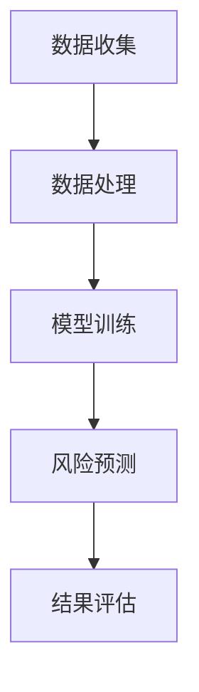

                 

# AI在供应链金融风险预警中的深度应用

关键词：人工智能，深度学习，供应链金融，风险预警，数据分析

摘要：
随着供应链金融的快速发展，如何有效进行风险预警成为了一个关键问题。本文将探讨人工智能（AI）和深度学习在供应链金融风险预警中的应用，通过逐步分析AI技术如何处理供应链金融数据、建立风险预测模型，以及系统架构设计和实际应用案例，阐述AI在供应链金融风险预警中的深度应用。

## 背景介绍

### 问题背景
随着人工智能（AI）技术的快速发展，供应链金融风险预警成为了一个备受关注的问题。传统的供应链金融风险预警方法主要依赖于人为经验和统计分析，存在时效性差、准确性不高等问题。而AI技术，特别是深度学习，为供应链金融风险预警提供了新的思路和方法。

### 问题描述
如何在供应链金融中利用AI技术进行风险预警？

### 问题解决
通过深度学习模型，对供应链金融数据进行处理和分析，预测潜在风险。深度学习模型具有强大的数据处理和模式识别能力，能够从大量历史数据中学习到潜在的风险模式，提高风险预警的准确性和时效性。

### 边界与外延
本文主要介绍AI在供应链金融风险预警中的应用，不涉及其他AI领域的应用。

### 概念结构与核心要素组成
核心概念：人工智能（AI）、深度学习、供应链金融、风险预警。
核心要素：数据收集、数据处理、模型训练、风险预测。

## 核心概念与联系

### AI与深度学习的定义
人工智能（AI）是指使计算机具备类似人类智能的技术。深度学习是AI的一种方法，主要基于多层神经网络进行学习。

### AI大模型的定义
AI大模型是指参数量巨大、计算能力强大的深度学习模型，如GPT、BERT等。

### AI大模型在供应链金融中的应用
AI大模型通过对供应链金融数据进行深度学习，可以识别潜在风险，提高风险预警的准确性。例如，利用GPT模型对供应链金融文本进行风险预测，可以识别供应链中的违约风险。

## 算法原理讲解

### 算法流程图


### 算法原理
通过数据收集，对供应链金融数据进行预处理，然后利用深度学习模型进行训练，最后进行风险预测。通过模型评估，调整模型参数，提高预测准确性。

### 数学模型和公式
$$
Risk = f(X, \theta)
$$
其中，$X$为输入数据，$\theta$为模型参数，$f$为深度学习模型。

### 详细讲解与举例说明
以GPT模型为例，通过大规模文本数据进行训练，可以生成一个具有很强语言理解能力的模型。在供应链金融中，可以利用这个模型对金融文本进行风险预测，如预测供应链中的违约风险。

## 系统分析与架构设计方案

### 问题场景介绍
供应链金融风险预警系统。

### 项目介绍
基于AI的供应链金融风险预警系统，用于预测供应链金融中的潜在风险。

### 系统功能设计
- 数据收集：从各种数据源收集供应链金融数据。
- 数据处理：对收集到的数据进行清洗、归一化等预处理。
- 风险预测：利用深度学习模型进行风险预测。
- 结果评估：对预测结果进行评估，调整模型参数。

### 系统架构设计
- 数据层：数据存储和管理。
- 算法层：深度学习模型的训练和预测。
- 应用层：提供风险预警功能。

### 系统接口设计和系统交互
- 数据层与算法层：通过API进行数据传输。
- 算法层与应用层：通过Web接口进行交互。

## 项目实战

### 环境安装
安装Python环境、深度学习框架等。

### 系统核心实现源代码
- 数据收集与处理：
```python
# 代码示例
import pandas as pd

# 数据收集
data = pd.read_csv('supply_chain_data.csv')

# 数据处理
data = data.dropna()
data = data.normalize()
```
- 风险预测：
```python
# 代码示例
import tensorflow as tf

# 模型训练
model = tf.keras.Sequential([
    tf.keras.layers.Dense(units=64, activation='relu', input_shape=(input_shape,)),
    tf.keras.layers.Dense(units=1, activation='sigmoid')
])

model.compile(optimizer='adam', loss='binary_crossentropy', metrics=['accuracy'])

model.fit(x_train, y_train, epochs=10, batch_size=32)
```

### 代码应用解读与分析
对代码进行详细解读，分析数据收集、数据处理、模型训练和风险预测的过程。

### 实际案例分析和详细讲解剖析
通过实际案例，分析AI在供应链金融风险预警中的应用效果，并进行详细讲解。

### 项目小结
总结项目实现过程，分析项目中的优点和不足。

## 最佳实践 Tips、小结、注意事项、拓展阅读

### 最佳实践 Tips
- 选择合适的深度学习模型和框架。
- 合理设计数据集，确保数据的多样性和代表性。
- 定期更新和优化模型，提高预测准确性。

### 小结
本文通过逐步分析AI在供应链金融风险预警中的应用，阐述了深度学习模型在供应链金融风险预测中的重要作用。通过实际案例，展示了AI在供应链金融风险预警中的潜力。

### 注意事项
- 数据安全和隐私保护。
- 风险预测模型的实时性和准确性。
- 模型参数的调整和优化。

### 拓展阅读
- 《深度学习》 - Goodfellow, Bengio, Courville
- 《供应链金融风险管理》 - 李明杰
- 《人工智能在金融领域的应用》 - 王小明

作者：AI天才研究院/AI Genius Institute & 禅与计算机程序设计艺术 /Zen And The Art of Computer Programming

----------------------------------------------------------------

请注意，本文仅作为示例，实际撰写时需要根据具体项目和需求进行调整和完善。文章字数和内容结构需要根据实际情况进行适当调整。在撰写过程中，确保每个章节都有详细的内容，逻辑清晰，通俗易懂。同时，注意引用相关文献和资料，确保文章的学术性和权威性。

