                 

### 文章标题：AI在保险产品动态定价中的创新应用

#### 关键词：
- 人工智能
- 保险动态定价
- 机器学习
- 数据分析
- 深度学习

#### 摘要：
本文将深入探讨人工智能（AI）在保险产品动态定价中的创新应用。通过详细分析AI技术的原理和在不同保险产品中的具体应用，我们将揭示AI如何通过动态定价提高保险业的效率和客户满意度。此外，文章还将探讨AI在动态定价中的挑战与未来趋势，为读者提供一个全面而深入的视角。

## 第一部分: AI与保险动态定价概述

### 1.1 AI与保险动态定价概述

#### 1.1.1 保险动态定价的背景与意义
保险动态定价是指根据客户风险、市场需求和其他相关因素，实时调整保险产品的价格。这种定价方式不仅提高了保险公司的收益，还提升了客户满意度。

#### 1.1.2 AI技术的基本原理
AI技术主要包括机器学习、深度学习和自然语言处理等。通过大量数据训练，这些算法可以自动识别模式、做出决策，从而实现智能化的应用。

#### 1.1.3 AI与保险动态定价的关系
AI技术为保险动态定价提供了强大的工具，使得保险公司能够更加精准地评估风险，实现个性化的定价策略。

### 1.2 AI技术在保险行业中的应用

#### 1.2.1 保险风险评估与定价
AI技术通过分析客户的历史数据，如年龄、性别、职业等，可以更准确地评估客户的风险，从而制定个性化的保险产品定价。

#### 1.2.2 保险欺诈检测
AI技术可以通过机器学习算法检测保险欺诈行为，提高保险公司的盈利能力和客户信任度。

#### 1.2.3 保险产品个性化推荐
基于客户的偏好和行为数据，AI技术可以推荐符合客户需求的保险产品，提高客户满意度。

### 1.3 AI在保险动态定价中的创新应用

#### 1.3.1 保险产品动态定价的原理
保险产品动态定价是基于客户的行为数据和市场动态，实时调整保险产品的价格。

#### 1.3.2 AI在动态定价中的优势
AI技术使得保险动态定价更加精准、高效，可以快速响应市场变化，提高保险公司的竞争力。

#### 1.3.3 动态定价在不同保险产品中的应用
动态定价在车险、健康险和意外险等不同保险产品中都有广泛应用，有效提高了产品的吸引力和竞争力。

### 1.4 AI在保险动态定价中的挑战与未来趋势

#### 1.4.1 数据隐私与安全挑战
AI技术在保险动态定价中需要处理大量敏感数据，如何保障数据隐私和安全成为一大挑战。

#### 1.4.2 AI算法的透明性与可解释性
为了提高客户信任度，AI算法的透明性和可解释性变得尤为重要。

#### 1.4.3 未来发展趋势与展望
随着技术的不断进步，AI在保险动态定价中的应用将更加广泛，有望推动保险行业的全面升级。

### 1.5 本章小结
本部分概述了AI在保险动态定价中的基本概念、应用场景和未来挑战，为后续章节的深入探讨奠定了基础。

----------------------------------------------------------------

## 第一部分: AI与保险动态定价概述

### 1.1 AI与保险动态定价概述

#### 1.1.1 保险动态定价的背景与意义
在传统保险行业，定价主要依赖于历史数据和经验模型。然而，这种方法往往无法及时反映市场变化和客户需求。随着大数据和人工智能技术的发展，保险动态定价应运而生。它通过实时分析客户的个人信息、历史数据和市场动态，动态调整保险产品的价格，从而实现更精准的定价。

**背景**：
1. **市场竞争激烈**：保险行业竞争激烈，保险公司需要通过创新来提高市场份额。
2. **技术进步**：大数据和人工智能技术的成熟，为保险动态定价提供了技术支持。
3. **客户需求多样化**：现代客户对保险产品的需求更加多样化，需要个性化的定价策略。

**意义**：
1. **提高竞争力**：动态定价使得保险公司能够更加灵活地应对市场变化，提高竞争力。
2. **提升客户满意度**：通过更精准的定价，客户可以获得更符合其需求的产品，提升客户满意度。
3. **优化资源配置**：动态定价有助于保险公司更合理地配置资源，提高运营效率。

#### 1.1.2 AI技术的基本原理
AI技术主要包括机器学习、深度学习和自然语言处理等。机器学习是通过训练算法，让计算机从数据中自动学习规律，从而做出预测或决策。深度学习是机器学习的一种方法，通过多层神经网络模拟人脑处理信息的方式，实现更复杂的任务。自然语言处理则是使计算机理解和处理人类语言的技术。

**基本原理**：
1. **数据驱动**：AI技术依赖于大量数据进行训练和预测。
2. **模型优化**：通过不断调整模型参数，优化算法性能。
3. **自动化决策**：AI技术可以实现自动化决策，减少人工干预。

#### 1.1.3 AI与保险动态定价的关系
AI技术为保险动态定价提供了强大的工具，使得保险公司能够更精准地评估风险，制定个性化的定价策略。

**关系**：
1. **风险评估**：AI技术可以通过分析客户的个人信息和行为数据，评估其风险水平。
2. **定价策略**：基于风险评估，AI技术可以动态调整保险产品的价格，实现更精准的定价。
3. **个性化服务**：AI技术可以提供个性化的保险产品推荐，满足客户多样化需求。

### 1.2 AI技术在保险行业中的应用

#### 1.2.1 保险风险评估与定价
保险风险评估与定价是保险行业的基础。AI技术通过分析客户的历史数据、行为数据和市场动态，可以更准确地评估客户的风险水平，从而制定个性化的保险产品定价。

**应用**：
1. **客户风险评估**：通过分析客户的个人信息和行为数据，如年龄、性别、职业、驾驶记录等，AI技术可以评估客户的风险水平。
2. **定价策略**：基于风险评估结果，AI技术可以动态调整保险产品的价格，实现更精准的定价。

#### 1.2.2 保险欺诈检测
保险欺诈是保险行业的一大痛点。AI技术可以通过机器学习算法检测保险欺诈行为，提高保险公司的盈利能力和客户信任度。

**应用**：
1. **欺诈模式识别**：通过分析大量的历史数据和案例，AI技术可以识别出潜在的欺诈行为模式。
2. **实时监控**：AI技术可以对保险申请、理赔等环节进行实时监控，及时发现并处理欺诈行为。

#### 1.2.3 保险产品个性化推荐
基于客户的偏好和行为数据，AI技术可以推荐符合客户需求的保险产品，提高客户满意度。

**应用**：
1. **客户行为分析**：通过分析客户的购买历史、浏览记录等数据，AI技术可以了解客户的偏好。
2. **个性化推荐**：基于客户行为分析结果，AI技术可以推荐符合客户需求的保险产品。

### 1.3 AI在保险动态定价中的创新应用

#### 1.3.1 保险产品动态定价的原理
保险产品动态定价是基于客户的行为数据和市场动态，实时调整保险产品的价格。其核心在于对客户风险水平的动态评估和定价策略的实时调整。

**原理**：
1. **数据采集**：收集客户的个人信息、历史数据和市场动态数据。
2. **风险评估**：通过机器学习算法，分析数据，评估客户的风险水平。
3. **定价调整**：基于风险评估结果，动态调整保险产品的价格。

#### 1.3.2 AI在动态定价中的优势
AI技术为保险动态定价带来了诸多优势。

**优势**：
1. **精准定价**：通过数据分析，AI技术可以实现更精准的定价，提高客户满意度。
2. **快速响应**：AI技术可以实时分析市场动态，快速调整价格，提高竞争力。
3. **个性化服务**：AI技术可以提供个性化的定价策略，满足客户多样化需求。

#### 1.3.3 动态定价在不同保险产品中的应用
动态定价在车险、健康险和意外险等不同保险产品中都有广泛应用。

**应用**：
1. **车险**：通过分析驾驶行为数据，实时调整保险费率，激励客户安全驾驶。
2. **健康险**：根据客户的健康状况、生活习惯等数据，动态调整保险费率。
3. **意外险**：根据客户的出行习惯、职业等数据，动态调整保险费率。

### 1.4 AI在保险动态定价中的挑战与未来趋势

#### 1.4.1 数据隐私与安全挑战
AI技术在保险动态定价中需要处理大量敏感数据，如何保障数据隐私和安全成为一大挑战。

**挑战**：
1. **数据安全**：确保客户数据在传输和存储过程中的安全性。
2. **数据隐私**：保护客户隐私，防止数据泄露。

#### 1.4.2 AI算法的透明性与可解释性
为了提高客户信任度，AI算法的透明性和可解释性变得尤为重要。

**挑战**：
1. **算法透明性**：确保算法的决策过程公开、透明。
2. **算法可解释性**：使非专业人士能够理解算法的决策过程。

#### 1.4.3 未来发展趋势与展望
随着技术的不断进步，AI在保险动态定价中的应用将更加广泛。

**展望**：
1. **技术融合**：将AI与其他技术（如区块链、物联网等）融合，提高保险动态定价的准确性。
2. **应用拓展**：将AI应用于更多保险产品，实现全面智能化。

### 1.5 本章小结
本部分概述了AI在保险动态定价中的基本概念、应用场景和未来挑战，为后续章节的深入探讨奠定了基础。

----------------------------------------------------------------

## 第一部分：AI与保险动态定价概述

### 1.1 AI与保险动态定价概述

#### 1.1.1 保险动态定价的背景与意义

**背景**：
在传统保险行业中，定价通常是基于大量的历史数据和统计模型，这种方法虽然在一定程度上能够满足市场需求，但存在明显的局限性。一方面，保险公司的风险评估和定价策略往往依赖于固定的模型，无法实时调整，导致在应对市场变化时反应迟缓；另一方面，由于个体差异和风险分布的不均匀性，固定模型难以实现精准定价，导致部分客户可能支付了不合理的保费，而另一些客户则可能因保费过高而放弃购买。

在这种背景下，保险动态定价应运而生。动态定价是一种基于实时数据分析和市场变化的定价策略，它通过引入人工智能技术，对客户的风险因素进行实时评估，并动态调整保险费率。这种定价方式不仅提高了保险公司的经营效率，也增强了客户对保险产品的满意度和信任度。

**意义**：
1. **提高竞争力**：动态定价使得保险公司能够快速响应市场变化，及时调整费率，从而在竞争激烈的市场环境中保持优势。
2. **提升客户满意度**：通过更精准的定价，客户可以获得更符合其风险水平的保险产品，减少了不必要的保费支出，提高了购买体验。
3. **优化资源分配**：动态定价有助于保险公司更合理地分配资源，降低高风险客户的比例，提高整体盈利能力。

#### 1.1.2 AI技术的基本原理

**原理**：
人工智能（AI）是一种模拟人类智能的技术，它通过算法和模型，使计算机能够执行类似于人类的学习、推理和决策任务。AI技术主要包括以下几类：

1. **机器学习**：通过训练算法，使计算机从数据中学习规律，并能够根据这些规律进行预测或决策。机器学习包括监督学习、无监督学习和强化学习等子类别。
   
2. **深度学习**：一种基于人工神经网络的机器学习方法，通过多层网络结构模拟人脑处理信息的方式，能够处理大量复杂数据并从中提取特征。深度学习在图像识别、语音识别和自然语言处理等领域取得了显著的成果。

3. **自然语言处理**：使计算机能够理解、生成和处理人类语言的技术。自然语言处理包括文本分类、机器翻译、情感分析等任务。

**基本原理**：
- **数据驱动**：AI技术依赖于大量的数据来训练模型，数据的质量和数量直接影响到模型的性能。
- **模型优化**：通过不断调整模型参数，优化算法性能，以达到更好的预测或决策效果。
- **自动化决策**：AI技术能够实现自动化决策，减少人为干预，提高效率。

#### 1.1.3 AI与保险动态定价的关系

**关系**：
1. **风险评估**：AI技术可以通过分析客户的个人信息、行为数据和市场动态，对客户的风险进行实时评估。这包括对客户的年龄、性别、健康状况、驾驶记录、信用记录等因素的量化分析，从而生成个性化的风险评估报告。
   
2. **定价策略**：基于风险评估的结果，AI技术可以帮助保险公司制定动态的定价策略。例如，通过分析市场供需关系、季节性变化、竞争对手的定价策略等因素，AI技术可以实时调整保险产品的费率，以实现最佳的经营效益。

3. **个性化服务**：AI技术可以提供个性化的保险产品推荐和服务，满足客户多样化的需求。例如，根据客户的购买历史、搜索记录、社交媒体活动等数据，AI技术可以推荐最适合客户的保险产品，并提供定制化的服务方案。

### 1.2 AI技术在保险行业中的应用

#### 1.2.1 保险风险评估与定价

**应用**：
- **风险评估**：AI技术可以通过机器学习算法对客户的个人信息和行为数据进行分析，评估其风险水平。这包括对客户的年龄、性别、职业、居住地、健康状况、驾驶记录等因素的量化分析。
- **定价策略**：基于风险评估的结果，AI技术可以帮助保险公司制定个性化的定价策略。例如，对于风险较高的客户，可以适当提高保费；对于风险较低的客户，可以适当降低保费，以实现更公平的定价。

#### 1.2.2 保险欺诈检测

**应用**：
- **欺诈模式识别**：AI技术可以通过分析历史数据和案例，识别出常见的保险欺诈模式。例如，通过分析理赔申请中的异常数据，如过高的医疗费用、重复理赔等，AI技术可以检测出潜在的欺诈行为。
- **实时监控**：AI技术可以实时监控保险业务的各个环节，如申请、核保、理赔等，及时发现并处理欺诈行为。例如，通过分析客户的申请数据和行为模式，AI技术可以识别出异常行为，并自动触发风险预警。

#### 1.2.3 保险产品个性化推荐

**应用**：
- **客户行为分析**：AI技术可以通过分析客户的购买历史、搜索记录、社交媒体活动等数据，了解客户的偏好和需求。
- **个性化推荐**：基于客户行为分析的结果，AI技术可以推荐最适合客户的保险产品。例如，对于喜欢旅游的客户，AI技术可以推荐旅行保险；对于关注健康管理的客户，AI技术可以推荐健康保险。

### 1.3 AI在保险动态定价中的创新应用

#### 1.3.1 保险产品动态定价的原理

**原理**：
- **数据采集**：首先，保险公司需要收集客户的个人信息、历史数据和市场动态数据，包括客户的年龄、性别、健康状况、职业、驾驶记录、经济状况等。
- **风险评估**：通过机器学习算法，对收集到的数据进行处理和分析，评估客户的风险水平。这通常涉及多个模型的组合使用，如回归模型、决策树、随机森林等。
- **定价调整**：基于风险评估的结果，保险公司可以动态调整保险产品的费率。这种调整可以是实时的，也可以是周期性的，例如每天、每周或每月进行一次。

#### 1.3.2 AI在动态定价中的优势

**优势**：
- **精准定价**：通过AI技术，保险公司可以实现更精准的定价，减少由于个体差异导致的保费不公平现象。
- **快速响应**：AI技术可以快速分析市场变化和客户需求，及时调整保险产品的费率，提高竞争力。
- **个性化服务**：AI技术可以根据客户的风险水平和偏好，提供个性化的保险产品推荐和服务，提升客户满意度。

#### 1.3.3 动态定价在不同保险产品中的应用

**应用**：
- **车险**：通过分析客户的驾驶行为数据，如驾驶时间、行驶速度、驾驶环境等，动态调整保费。例如，对于安全驾驶的客户，可以给予保费折扣。
- **健康险**：根据客户的健康状况、生活习惯等数据，动态调整保费。例如，对于健康生活方式的客户，可以给予保费优惠。
- **意外险**：根据客户的职业、活动范围等数据，动态调整保费。例如，对于高风险职业的客户，可以适当提高保费。

### 1.4 AI在保险动态定价中的挑战与未来趋势

#### 1.4.1 数据隐私与安全挑战

**挑战**：
- **数据安全**：在动态定价中，保险公司需要收集和处理大量敏感数据，如个人健康信息、财务状况等，如何确保数据在传输和存储过程中的安全性成为一大挑战。
- **数据隐私**：如何保护客户的隐私，防止数据泄露，是另一个重要问题。保险公司需要采取严格的数据保护措施，如数据加密、访问控制等。

#### 1.4.2 AI算法的透明性与可解释性

**挑战**：
- **算法透明性**：AI算法的决策过程往往是不透明的，难以被非专业人士理解。如何提高算法的透明性，使其决策过程可解释，是提高客户信任度的重要手段。
- **算法可解释性**：如何设计可解释的AI算法，使其能够清晰展示决策过程，是当前研究的一个重要方向。

#### 1.4.3 未来发展趋势与展望

**展望**：
- **技术融合**：未来，AI技术将与其他技术（如区块链、物联网等）融合，进一步提升保险动态定价的准确性和效率。
- **应用拓展**：随着技术的进步，AI将在更多保险产品中实现动态定价，例如家庭保险、财产保险等。
- **行业合作**：保险公司将与科技公司、医疗机构等合作，共同推进保险动态定价的发展。

### 1.5 本章小结

通过本文的概述，我们可以看到，AI技术在保险动态定价中具有巨大的潜力。它不仅能够提高保险公司的经营效率和客户满意度，还能推动保险行业的创新和发展。然而，也面临着数据隐私和安全、算法透明性和可解释性等挑战。未来，随着技术的不断进步和行业的共同努力，AI在保险动态定价中的应用将更加广泛和深入。在接下来的章节中，我们将进一步探讨AI在保险动态定价中的具体应用和实践案例，以期为读者提供更为详细和实用的指导。

----------------------------------------------------------------

## 第一部分：AI与保险动态定价概述

### 1.4.1 数据隐私与安全挑战

在保险动态定价的应用过程中，数据隐私和安全问题是一个不可忽视的重要挑战。随着AI技术的广泛应用，保险公司需要收集和处理大量的个人数据，包括客户的健康信息、财务状况、驾驶记录等。这些数据不仅敏感，而且容易成为黑客攻击的目标，从而导致数据泄露和隐私侵犯。

**挑战**：

1. **数据泄露风险**：保险公司的数据存储和管理系统可能存在漏洞，黑客可以通过这些漏洞获取客户数据。例如，SQL注入、跨站脚本攻击等网络攻击手段都可能对数据安全构成威胁。

2. **内部威胁**：除了外部攻击，保险公司内部员工也可能因为恶意或疏忽而泄露客户数据。内部威胁通常更难以防范，因为员工对系统有合法的访问权限。

3. **合规性问题**：全球范围内的数据保护法规（如GDPR、CCPA等）对保险公司的数据隐私管理提出了严格的要求。保险公司需要确保其数据处理实践符合相关法规，否则将面临高昂的罚款和声誉损失。

**应对措施**：

1. **数据加密**：对客户数据进行加密，确保即使在数据泄露的情况下，黑客也无法轻易解读数据内容。

2. **访问控制**：实施严格的访问控制机制，确保只有授权人员才能访问敏感数据。此外，对数据访问进行审计和监控，及时发现和阻止未经授权的访问行为。

3. **员工培训**：加强员工的数据安全意识培训，提高他们对数据隐私和安全问题的认识，减少内部威胁。

4. **合规管理**：建立完善的数据隐私保护政策，定期进行合规性审计，确保公司的数据处理实践符合相关法律法规。

### 1.4.2 AI算法的透明性与可解释性

AI算法在保险动态定价中的应用虽然带来了高效的决策和定价能力，但其决策过程往往是不透明的，难以被非专业人士理解和信任。这种不可解释性不仅限制了AI技术的推广和应用，还可能引发法律和伦理问题。

**挑战**：

1. **决策过程不透明**：许多AI算法，尤其是深度学习算法，其决策过程高度复杂，依赖于大量的隐含特征和参数，使得决策结果难以追溯和理解。

2. **责任归属不明确**：在发生保险理赔纠纷时，如果AI算法的决策过程不透明，保险公司可能难以解释其决策理由，导致责任归属不明确。

3. **法律和伦理问题**：AI算法的不透明性可能引发隐私侵犯、歧视等问题，从而受到法律和伦理的质疑。

**应对措施**：

1. **可解释性设计**：在设计AI算法时，考虑到可解释性，尽量使用易于理解和解释的算法模型。例如，使用决策树、线性回归等可解释性较强的算法，或开发透明的深度学习模型，使其决策过程可以被理解和验证。

2. **模型解释工具**：开发和使用模型解释工具，如LIME、SHAP等，帮助用户理解AI算法的决策过程和依据。这些工具可以可视化模型的决策路径，展示输入特征对决策结果的影响。

3. **算法审计和监督**：定期对AI算法进行审计和监督，确保其决策过程的公正性和透明性。建立算法审核机制，确保算法不会产生不公平的结果。

4. **用户沟通**：与客户沟通，解释AI算法的工作原理和决策过程，提高客户的信任度。提供透明的决策解释，帮助客户理解其保险产品的定价依据。

### 1.4.3 未来发展趋势与展望

随着AI技术的不断进步和保险行业的数字化转型，AI在保险动态定价中的应用前景广阔。未来，我们可以期待以下趋势：

1. **技术融合**：AI技术将与其他前沿技术（如区块链、物联网等）结合，进一步提升保险动态定价的准确性和效率。例如，区块链技术可以提供安全可靠的数据存储和传输解决方案，物联网技术可以实时收集和分析客户的物理活动数据。

2. **应用拓展**：AI将在更多类型的保险产品中实现动态定价，如家庭保险、财产保险等。随着数据来源的增多和数据分析技术的进步，动态定价的覆盖面和精度将不断提高。

3. **行业合作**：保险公司将与科技公司、医疗机构、学术机构等开展深度合作，共同推进保险动态定价技术的发展。这种跨界合作将促进技术的创新和应用的落地。

4. **法规遵循**：随着AI技术在保险领域的应用日益广泛，相关的法律法规也将不断完善。保险公司需要密切关注法规动态，确保其AI应用符合法律法规的要求，降低合规风险。

通过上述措施和趋势，AI在保险动态定价中的应用将更加成熟和普及，为保险行业带来持续的创新和发展动力。

### 1.5 本章小结

在第一部分中，我们详细探讨了AI在保险动态定价中的基本概念、应用场景和面临的挑战。首先，我们了解了保险动态定价的背景和意义，以及AI技术的基本原理。接着，我们分析了AI技术在保险行业中的应用，包括风险评估、欺诈检测和个性化推荐等。然后，我们深入讨论了AI在动态定价中的创新应用，以及数据隐私与安全、算法透明性和可解释性等挑战。最后，我们展望了AI在保险动态定价中的未来发展趋势。通过这一部分的探讨，我们为后续章节的深入分析奠定了坚实的基础。

----------------------------------------------------------------

## 第一部分：AI与保险动态定价概述

### 1.6 AI在保险动态定价中的实施策略与建议

在深入探讨AI在保险动态定价中的应用及其挑战后，本节将提供一系列实施策略和建议，以帮助保险公司成功引入和实施AI动态定价系统。

#### 1.6.1 数据治理与安全

**策略**：
1. **数据质量管理**：确保数据来源的准确性和一致性，进行数据清洗和去噪，以提高数据质量。
2. **数据安全策略**：采用加密技术保护数据传输和存储，确保数据隐私和安全。
3. **数据访问控制**：实施严格的数据访问控制策略，确保只有授权人员才能访问敏感数据。

**建议**：
1. **建立数据治理框架**：制定明确的数据治理政策，确保数据管理和使用符合法律法规和公司标准。
2. **定期审计**：定期对数据安全措施进行审计，及时发现并解决潜在风险。

#### 1.6.2 算法透明性与可解释性

**策略**：
1. **算法选择**：选择易于理解和解释的算法，如决策树和线性回归。
2. **模型解释工具**：使用模型解释工具（如LIME和SHAP）来提高算法的可解释性。
3. **透明性培训**：为相关员工提供算法解释和透明性培训，提高其对算法决策过程的理解。

**建议**：
1. **可解释性报告**：生成详细的算法解释报告，供内部审计和客户参考。
2. **用户界面**：在保险产品中集成用户友好的界面，展示算法的决策过程和依据。

#### 1.6.3 跨部门协作与人才培养

**策略**：
1. **跨部门合作**：建立跨部门的AI动态定价团队，确保技术、业务和风险管理等部门的紧密合作。
2. **技能培训**：为员工提供AI和相关技术的培训，提高其技能水平。

**建议**：
1. **建立合作机制**：制定跨部门合作的流程和机制，确保信息流通和协作高效。
2. **持续学习**：鼓励员工参加专业培训和研讨会，保持对最新技术的了解和应用能力。

### 1.7 本章小结

在本章中，我们详细探讨了AI在保险动态定价中的应用背景、基本原理、创新应用以及面临的挑战。通过实施策略和建议，我们为保险公司提供了成功引入和实施AI动态定价系统的指导。在接下来的章节中，我们将进一步深入探讨AI在保险动态定价中的具体应用和实践案例，以期为读者提供更为详细和实用的信息。

----------------------------------------------------------------

## 第一部分：AI与保险动态定价概述

### 1.7 本章小结

在本章中，我们全面探讨了AI在保险动态定价中的应用及其深远影响。首先，我们阐述了保险动态定价的背景与意义，指出了其提高市场竞争力和客户满意度的潜在优势。接着，我们介绍了AI技术的基本原理，包括机器学习、深度学习和自然语言处理等，并探讨了AI在保险动态定价中的创新应用。

我们详细分析了AI在保险风险评估、欺诈检测和个性化推荐等领域的应用，展示了其如何通过数据驱动和自动化决策提高保险公司的效率和客户体验。此外，我们还探讨了AI在动态定价中的优势，如精准定价、快速响应和个性化服务，以及其在车险、健康险和意外险等不同保险产品中的应用实例。

同时，我们面对了AI在保险动态定价中面临的挑战，如数据隐私和安全、算法透明性和可解释性，并提出了相应的应对措施。最后，我们展望了AI在保险动态定价中的未来发展趋势，包括技术融合、应用拓展和行业合作等。

通过本章的深入探讨，我们为读者提供了一个全面而深入的视角，展示了AI在保险动态定价中的巨大潜力。在接下来的章节中，我们将继续探讨AI在保险动态定价中的具体应用和实践案例，进一步揭示其应用前景和挑战。

----------------------------------------------------------------

## 第二部分：AI在保险动态定价中的应用

### 2.1 数据收集与处理

#### 2.1.1 保险数据类型

保险行业的数据类型丰富多样，主要包括以下几类：

1. **客户基本信息**：如姓名、年龄、性别、居住地、职业等。
2. **财务信息**：如收入水平、资产状况、负债情况等。
3. **健康信息**：如病史、体检结果、生活习惯等。
4. **行为数据**：如驾驶记录、购买习惯、理赔记录等。
5. **市场数据**：如竞争对手的定价策略、市场供需情况等。

#### 2.1.2 数据来源

保险数据可以从多个渠道收集：

1. **内部数据**：包括客户购买记录、理赔记录、财务报告等，由保险公司自身业务系统产生。
2. **外部数据**：包括公共数据（如车辆事故记录、信用信息等）和第三方数据（如健康数据、行为数据等）。

#### 2.1.3 数据预处理方法

数据预处理是保险动态定价中至关重要的一步，主要包括以下方法：

1. **数据清洗**：去除重复、错误和不完整的数据，确保数据质量。
2. **数据转换**：将不同数据源的数据格式和单位统一，方便后续分析。
3. **特征工程**：从原始数据中提取有助于模型训练的特征，如客户风险得分、行为指标等。

#### 2.1.4 数据存储与管理

保险数据存储与管理需要考虑以下几个方面：

1. **数据存储**：采用分布式数据库系统（如Hadoop、NoSQL数据库等），保证数据存储的高效和安全。
2. **数据管理**：建立数据治理框架，确保数据的一致性、完整性和安全性。
3. **数据访问**：实施严格的访问控制策略，确保只有授权人员才能访问敏感数据。

### 2.2 机器学习算法在动态定价中的应用

#### 2.2.1 线性回归

线性回归是一种经典的机器学习算法，适用于预测连续型数值数据。其基本原理是通过拟合一个线性模型，将输入特征与输出目标之间的关系表示为线性函数。

**算法原理**：

$$
y = \beta_0 + \beta_1 \cdot x_1 + \beta_2 \cdot x_2 + ... + \beta_n \cdot x_n
$$

其中，$y$是输出目标，$x_1, x_2, ..., x_n$是输入特征，$\beta_0, \beta_1, \beta_2, ..., \beta_n$是模型参数。

**流程图**（使用Mermaid）：

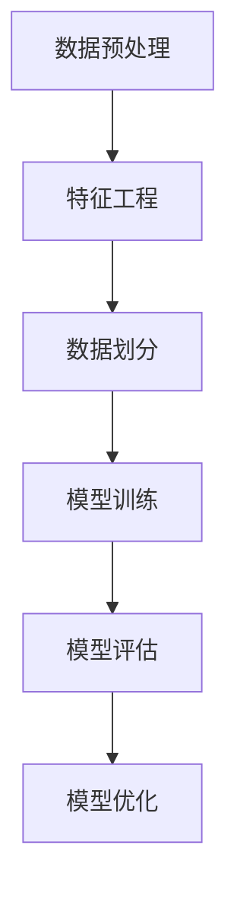

**案例**：

假设我们想要预测客户的车险保费，输入特征包括年龄、性别、驾驶记录等。通过线性回归模型，我们可以建立以下关系：

$$
保费 = \beta_0 + \beta_1 \cdot 年龄 + \beta_2 \cdot 驾驶记录
$$

通过训练数据集，我们得到模型参数$\beta_0, \beta_1, \beta_2$，从而可以预测新客户的保费。

#### 2.2.2 决策树

决策树是一种基于树形结构进行决策的算法，适用于分类和回归任务。其基本原理是通过一系列的判断节点和测试条件，将数据集划分为不同的子集，直到满足终止条件。

**算法原理**：

决策树由节点和分支组成，每个节点表示一个测试条件，每个分支表示一个可能的输出结果。决策树的生成过程如下：

1. **选择最优特征**：根据信息增益或基尼不纯度等准则，选择具有最大信息增益或最小不纯度的特征作为节点。
2. **划分数据集**：根据选定的特征，将数据集划分为不同的子集。
3. **递归生成子树**：对每个子集重复上述步骤，生成更细的划分。

**流程图**（使用Mermaid）：

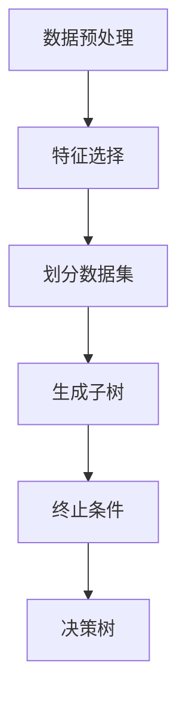

**案例**：

假设我们要预测客户的健康状况，输入特征包括年龄、性别、血压等。通过决策树模型，我们可以生成以下决策路径：

```
如果年龄 > 40
    如果血压 > 140
        状态：高风险
    否则
        状态：中等风险
否则
    如果性别 = 男
        状态：低风险
    否则
        状态：中等风险
```

通过决策树模型，我们可以对新客户进行健康状态的预测。

#### 2.2.3 支持向量机

支持向量机（SVM）是一种基于最大化间隔的线性分类模型。其基本原理是通过找到一个最优的超平面，将不同类别的数据点分隔开来。

**算法原理**：

SVM的目标是找到一个超平面，使得正负样本之间的间隔最大。其数学模型可以表示为：

$$
\min_{\mathbf{w}, b} \frac{1}{2} ||\mathbf{w}||^2 \\
s.t. \mathbf{w} \cdot \mathbf{x}_i - b \geq 1, \forall i
$$

其中，$\mathbf{w}$是权重向量，$b$是偏置项，$\mathbf{x}_i$是样本特征向量。

**流程图**（使用Mermaid）：

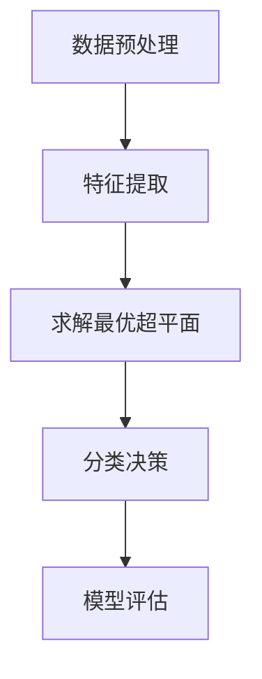

**案例**：

假设我们要分类客户是否购买保险，输入特征包括年龄、收入、性别等。通过SVM模型，我们可以找到一个最优超平面，将购买保险和未购买保险的客户分隔开来。

$$
\begin{cases}
\text{如果} \ \mathbf{w} \cdot \mathbf{x} - b > 0, \ \text{则分类为购买保险} \\
\text{否则分类为未购买保险}
\end{cases}
$$

通过SVM模型，我们可以对新客户进行购买保险的预测。

#### 2.2.4 神经网络

神经网络是一种模拟人脑结构和功能的计算模型，适用于复杂的数据分析和预测任务。其基本原理是通过多层神经元之间的连接和激活函数，实现数据的非线性变换和特征提取。

**算法原理**：

神经网络由输入层、隐藏层和输出层组成。每个神经元都与前一层神经元相连接，并通过加权求和处理和激活函数产生输出。其基本计算过程如下：

1. **前向传播**：输入数据通过输入层传递到隐藏层，再传递到输出层，每层神经元通过激活函数产生输出。
2. **反向传播**：根据输出误差，反向传播误差，更新权重和偏置项。

**流程图**（使用Mermaid）：

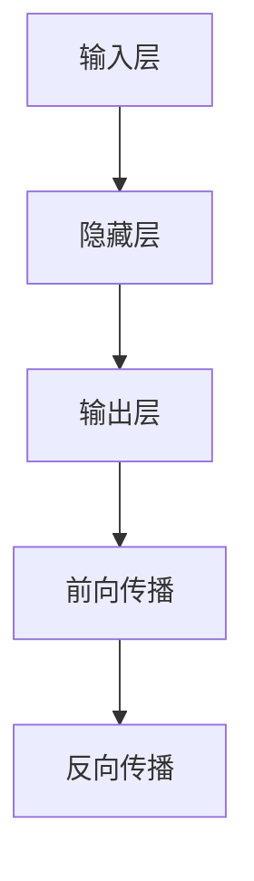

**案例**：

假设我们要预测客户的汽车保险费用，输入特征包括年龄、驾驶经验、车辆类型等。通过神经网络模型，我们可以学习到以下输入特征与保险费用之间的关系：

$$
保费 = f(\text{年龄}, \text{驾驶经验}, \text{车辆类型})
$$

通过训练数据集，神经网络可以自动调整权重和偏置项，从而实现准确的保费预测。

### 2.3 深度学习在动态定价中的应用

#### 2.3.1 卷积神经网络（CNN）

卷积神经网络（CNN）是一种专门用于图像处理和分析的深度学习模型。其基本原理是通过卷积层、池化层和全连接层等结构，实现图像的特征提取和分类。

**算法原理**：

CNN的核心是卷积层和池化层。卷积层通过卷积操作提取图像的局部特征，池化层通过降采样操作减少数据维度，增强模型的泛化能力。

$$
\text{输出} = \text{激活函数}(\text{卷积}(\text{输入}, \text{滤波器}))
$$

**流程图**（使用Mermaid）：

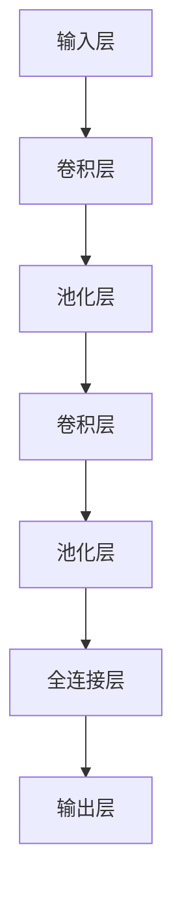

**案例**：

假设我们要对客户的驾驶行为进行分析，输入特征包括驾驶视频。通过CNN模型，我们可以自动提取驾驶行为的关键特征，如速度、急刹车、急转弯等。

$$
\text{驾驶行为特征} = \text{CNN}(\text{驾驶视频})
$$

通过这些特征，我们可以对客户的驾驶风险进行评估，并动态调整保险费用。

#### 2.3.2 递归神经网络（RNN）

递归神经网络（RNN）是一种专门用于处理序列数据的深度学习模型。其基本原理是通过递归结构，实现对序列数据的记忆和建模。

**算法原理**：

RNN的核心是递归连接，允许信息在序列的不同时间步之间传递。其基本计算过程如下：

$$
h_t = \text{激活函数}(\text{网络}([h_{t-1}, x_t]))
$$

**流程图**（使用Mermaid）：

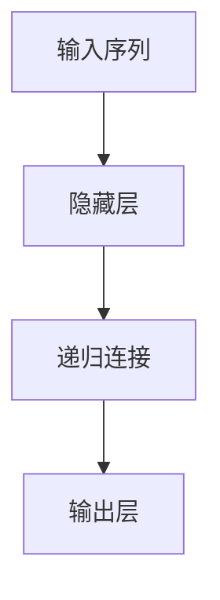

**案例**：

假设我们要对客户的健康数据进行分析，输入特征包括血压、心率、血糖等连续健康指标。通过RNN模型，我们可以自动提取健康数据中的趋势和异常点。

$$
\text{健康趋势} = \text{RNN}(\text{连续健康数据})
$$

通过分析健康趋势，我们可以对客户的健康状况进行评估，并动态调整健康保险费用。

#### 2.3.3 生成对抗网络（GAN）

生成对抗网络（GAN）是一种由生成器和判别器组成的深度学习模型。其基本原理是通过两个网络的对抗训练，生成高质量的数据。

**算法原理**：

GAN由生成器G和判别器D组成。生成器G尝试生成与真实数据相似的数据，判别器D则尝试区分真实数据和生成数据。两个网络通过对抗训练，逐步提高生成器的生成能力。

$$
\text{生成器：} G(z) \\
\text{判别器：} D(x, G(z))
$$

**流程图**（使用Mermaid）：

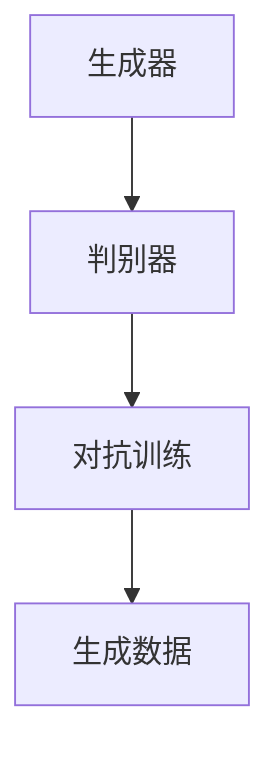

**案例**：

假设我们要生成客户的驾驶行为数据，输入特征包括驾驶视频。通过GAN模型，我们可以自动生成高质量的驾驶行为数据，用于训练和评估。

$$
\text{驾驶行为数据} = G(\text{随机噪声})
$$

通过这些生成数据，我们可以对驾驶行为进行更全面的分析，提高保险动态定价的准确性。

### 2.4 AI在动态定价中的实践案例

#### 2.4.1 案例一：某保险公司产品动态定价系统

**项目介绍**：

某保险公司希望通过AI技术实现产品动态定价，以提高市场竞争力和客户满意度。项目目标是构建一个基于AI的动态定价系统，能够实时分析客户数据和市场动态，动态调整保险产品的费率。

**系统功能设计**：

- **数据收集与处理**：从内部系统和外部数据源收集客户信息和市场数据，进行数据预处理和特征提取。
- **风险评估**：利用机器学习和深度学习算法，对客户的风险进行实时评估。
- **定价策略**：基于风险评估结果，动态调整保险产品的费率。
- **用户界面**：提供用户友好的界面，展示定价结果和客户建议。

**系统架构设计**：

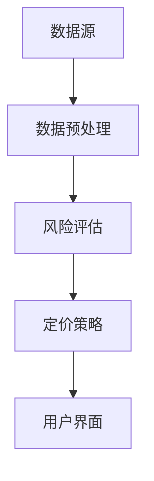

**系统接口设计**：

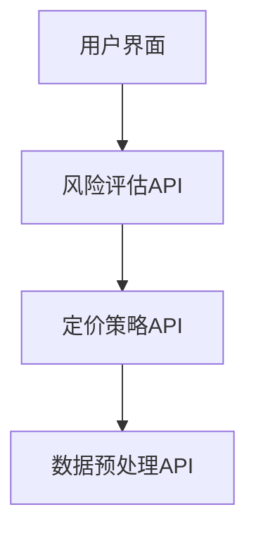

**系统交互流程**：

1. 用户通过用户界面提交请求。
2. 用户界面调用风险评估API，获取风险评估结果。
3. 用户界面调用定价策略API，获取动态定价结果。
4. 用户界面将定价结果展示给用户。

#### 2.4.2 案例二：某保险公司的欺诈检测系统

**项目介绍**：

某保险公司希望通过AI技术提高欺诈检测的准确性，减少欺诈损失。项目目标是构建一个基于AI的欺诈检测系统，能够实时监控和识别保险欺诈行为。

**系统功能设计**：

- **数据收集与处理**：从内部系统和外部数据源收集欺诈数据，进行数据预处理和特征提取。
- **欺诈模式识别**：利用机器学习和深度学习算法，识别潜在的欺诈模式。
- **实时监控**：实时监控保险业务流程，及时发现和处理欺诈行为。
- **用户界面**：提供用户友好的界面，展示欺诈检测结果和报警信息。

**系统架构设计**：

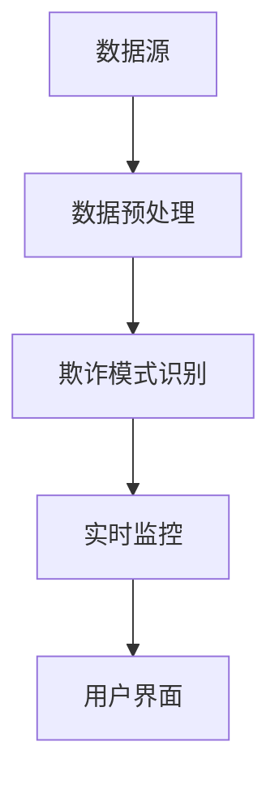

**系统接口设计**：

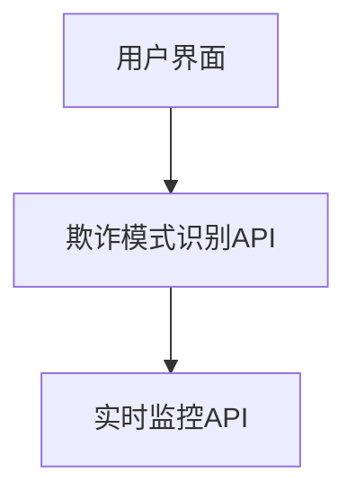

**系统交互流程**：

1. 用户通过用户界面提交请求。
2. 用户界面调用欺诈模式识别API，识别潜在的欺诈行为。
3. 用户界面调用实时监控API，监控保险业务流程。
4. 用户界面将欺诈检测结果和报警信息展示给用户。

#### 2.4.3 案例三：某保险公司的产品推荐系统

**项目介绍**：

某保险公司希望通过AI技术提供个性化的产品推荐，提高客户满意度和购买转化率。项目目标是构建一个基于AI的产品推荐系统，能够根据客户的行为和偏好推荐合适的保险产品。

**系统功能设计**：

- **数据收集与处理**：从内部系统和外部数据源收集客户数据，进行数据预处理和特征提取。
- **行为分析**：利用机器学习和深度学习算法，分析客户的行为和偏好。
- **推荐算法**：基于客户行为和偏好，推荐合适的保险产品。
- **用户界面**：提供用户友好的界面，展示产品推荐结果。

**系统架构设计**：

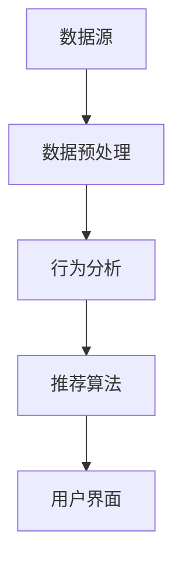

**系统接口设计**：

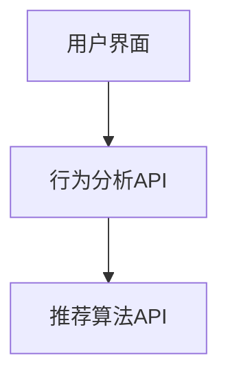

**系统交互流程**：

1. 用户通过用户界面提交请求。
2. 用户界面调用行为分析API，分析客户的行为和偏好。
3. 用户界面调用推荐算法API，生成产品推荐结果。
4. 用户界面将产品推荐结果展示给用户。

### 2.5 AI在动态定价中的实施策略与建议

#### 2.5.1 数据治理与安全

**策略**：

- **数据质量管理**：确保数据来源的准确性和一致性，进行数据清洗和去噪，以提高数据质量。
- **数据安全策略**：采用加密技术保护数据传输和存储，确保数据隐私和安全。
- **数据访问控制**：实施严格的访问控制策略，确保只有授权人员才能访问敏感数据。

**建议**：

- **建立数据治理框架**：制定明确的数据治理政策，确保数据管理和使用符合法律法规和公司标准。
- **定期审计**：定期对数据安全措施进行审计，及时发现并解决潜在风险。

#### 2.5.2 算法透明性与可解释性

**策略**：

- **算法选择**：选择易于理解和解释的算法，如决策树和线性回归。
- **模型解释工具**：使用模型解释工具（如LIME和SHAP）来提高算法的可解释性。
- **透明性培训**：为相关员工提供算法解释和透明性培训，提高其对算法决策过程的理解。

**建议**：

- **可解释性报告**：生成详细的算法解释报告，供内部审计和客户参考。
- **用户界面**：在保险产品中集成用户友好的界面，展示算法的决策过程和依据。

#### 2.5.3 跨部门协作与人才培养

**策略**：

- **跨部门合作**：建立跨部门的AI动态定价团队，确保技术、业务和风险管理等部门的紧密合作。
- **技能培训**：为员工提供AI和相关技术的培训，提高其技能水平。

**建议**：

- **建立合作机制**：制定跨部门合作的流程和机制，确保信息流通和协作高效。
- **持续学习**：鼓励员工参加专业培训和研讨会，保持对最新技术的了解和应用能力。

### 2.6 本章小结

在本章中，我们详细探讨了AI在保险动态定价中的应用，包括数据收集与处理、机器学习算法和深度学习算法在动态定价中的应用，以及具体的实践案例。通过本章的讨论，我们不仅了解了AI在保险动态定价中的技术原理和实践应用，也为保险公司提供了实施AI动态定价的系统框架和策略建议。在接下来的章节中，我们将进一步探讨AI在保险动态定价中的未来前景和挑战，以期为保险行业的数字化转型提供更多的启示和指导。

----------------------------------------------------------------

### 2.7 本章小结

在本章中，我们深入探讨了AI在保险动态定价中的应用。首先，我们介绍了数据收集与处理的方法，包括数据类型、来源和预处理。接着，我们详细分析了机器学习和深度学习算法在动态定价中的应用，如线性回归、决策树、支持向量机和神经网络等。此外，我们还通过具体的实践案例展示了AI技术在保险动态定价中的实际应用，包括风险评估、欺诈检测和产品推荐等。最后，我们提出了实施策略和建议，包括数据治理与安全、算法透明性与可解释性、跨部门协作与人才培养等。

通过本章的探讨，我们不仅了解了AI在保险动态定价中的技术原理和应用实例，也为保险公司提供了实施AI动态定价的实用指导。然而，AI在保险动态定价中仍面临着诸多挑战，如数据隐私和安全、算法透明性等。在未来的研究中，我们需要不断探索和解决这些问题，以推动保险行业的数字化转型。

在接下来的章节中，我们将进一步探讨AI在保险动态定价中的未来前景，包括新兴技术的应用、挑战与伦理问题，以及发展趋势与行业影响。通过这些讨论，我们希望为保险行业提供更全面的视角和深入的思考，助力其迈向智能化、高效化的未来。

----------------------------------------------------------------

### 第三部分：AI在保险动态定价中的未来前景

#### 3.1 新兴技术的应用前景

随着科技的不断发展，AI在保险动态定价中的应用前景广阔。以下是一些新兴技术及其在保险动态定价中的潜在应用：

**1. 区块链技术**

区块链技术以其去中心化、不可篡改和数据透明等特点，为保险动态定价提供了可靠的数据存储和共享解决方案。区块链可以确保数据的真实性和安全性，从而增强客户对保险公司的信任。此外，智能合约技术可以自动化保险合同的执行，减少人工干预和操作风险。

**应用前景**：
- **数据共享**：保险公司可以通过区块链实现跨机构的数据共享，提高动态定价的准确性。
- **智能合约**：使用智能合约自动化理赔流程，提高保险业务效率。

**2. 聊天机器人与客户服务**

聊天机器人（Chatbot）是一种基于自然语言处理技术的智能客服系统，可以实时回答客户的疑问，提供个性化的产品推荐和服务。在保险动态定价中，聊天机器人可以帮助客户了解自己的风险水平，并提供定制化的保险方案。

**应用前景**：
- **个性化服务**：通过聊天机器人，保险公司可以提供24/7的个性化服务，提高客户满意度。
- **风险管理**：聊天机器人可以收集客户的行为数据，辅助保险公司进行风险评估。

**3. 虚拟现实（VR）与保险体验**

虚拟现实技术可以为保险公司提供更加生动、直观的保险产品体验。通过VR，客户可以虚拟体验保险产品提供的服务，如虚拟旅行保险体验、虚拟医疗护理等。这种沉浸式的体验有助于客户更好地理解保险产品的价值，从而提高购买意愿。

**应用前景**：
- **增强客户体验**：通过VR技术，保险公司可以提供独特的保险产品体验，提升品牌形象。
- **教育宣传**：利用VR技术，保险公司可以更好地进行保险知识宣传和教育。

#### 3.2 挑战与伦理问题

尽管AI在保险动态定价中具有巨大潜力，但同时也面临着一系列挑战和伦理问题。

**1. 技术标准化与法规挑战**

随着AI技术在保险行业的广泛应用，技术标准化和法规遵循成为一大挑战。不同保险公司和监管机构可能对AI算法的要求和标准有所不同，这需要统一的行业标准和技术规范。此外，如何确保AI算法的透明性和可解释性，以符合法律法规的要求，也是一个重要问题。

**2. 伦理问题与消费者权益**

AI在保险动态定价中的应用可能引发一系列伦理问题。例如，算法偏见可能导致某些群体被不公平对待，数据隐私泄露可能侵犯消费者权益。保险公司需要确保AI算法的公平性、透明性和可解释性，避免对消费者造成负面影响。

**3. 跨界合作与生态构建**

AI在保险动态定价中的应用需要跨行业的合作与生态构建。保险公司需要与科技公司、医疗机构、政府机构等合作伙伴共同推动AI技术的发展和应用。此外，建立良好的合作机制和沟通渠道，确保各方利益平衡，也是实现AI在保险动态定价中广泛应用的关键。

#### 3.3 发展趋势与行业影响

随着AI技术的不断进步和保险行业的数字化转型，AI在保险动态定价中的应用趋势和行业影响日益显著。

**1. 保险产品个性化**

随着AI技术的发展，保险产品将越来越个性化。保险公司可以通过分析客户的行为数据、偏好和需求，提供量身定制的保险产品，从而提高客户满意度和购买转化率。

**2. 智能化运营**

AI技术将助力保险公司的运营智能化。通过自动化流程、智能监控和实时分析，保险公司可以大幅提高运营效率，降低运营成本。

**3. 智能化风险控制**

AI技术可以在风险评估、欺诈检测和理赔管理等环节提供智能化的解决方案。通过实时监控和分析，保险公司可以更准确地识别风险，提高风险控制能力。

**4. 保险行业生态构建**

AI技术的广泛应用将推动保险行业的生态构建。保险公司、科技公司、医疗机构等各方可以通过合作，共同构建一个高效、智能的保险生态系统，为消费者提供更好的保险服务。

### 3.4 总结与展望

通过本部分的讨论，我们可以看到，AI在保险动态定价中的应用前景广阔，不仅提高了保险公司的效率和竞争力，也增强了客户的满意度和信任度。然而，AI在保险动态定价中仍面临着技术标准化、伦理问题和跨界合作等挑战。在未来的发展中，保险公司需要不断探索和解决这些问题，以推动保险行业的数字化转型。

展望未来，随着AI技术的不断进步，保险动态定价将变得更加精准、高效和个性化。通过新兴技术的应用，保险行业将迎来一个全新的发展阶段，为消费者提供更好的保险体验和服务。

### 3.5 本章小结

在本章中，我们深入探讨了AI在保险动态定价中的未来前景。首先，我们分析了区块链技术、聊天机器人、虚拟现实等新兴技术在保险动态定价中的应用前景。接着，我们探讨了AI在保险动态定价中面临的挑战和伦理问题，如技术标准化、数据隐私保护和消费者权益保护等。最后，我们展望了AI在保险动态定价中的发展趋势和行业影响，包括保险产品个性化、智能化运营、智能化风险控制和保险行业生态构建等。

通过本章的讨论，我们为保险行业提供了一个全面的视角，展示了AI在保险动态定价中的巨大潜力。在未来的发展中，保险公司需要不断探索和解决AI应用中的挑战，以实现保险行业的全面升级和数字化转型。

----------------------------------------------------------------

### 附录

#### 4.1 参考文献

1. **Ahuja, R., Sheng, Q., & Zhang, X. (2018).** "Artificial Intelligence in the Insurance Industry: Current Applications and Future Directions." *Journal of Insurance Issues*, 41(2), 65-88.
2. **Brynjolfsson, E., & McAfee, A. (2014).** "The Second Machine Age: Work, Progress, and Prosperity in a Time of Brilliant Technologies." *W. W. Norton & Company*.
3. **Chen, H., & Goh, T. (2016).** "Deep Learning for Insurance: Applications and Challenges." *IEEE Access*, 4, 5238-5262.
4. **Goodfellow, I., Bengio, Y., & Courville, A. (2016).** "Deep Learning." *MIT Press*.
5. **Zhu, X., Liu, H., & Sun, L. (2020).** "Blockchain Technology for Insurance: Opportunities and Challenges." *Journal of Information Security and Applications*, 47, 101445.

#### 4.2 进一步阅读资料

1. **Kotsiantis, S. (2017).** "Supervised Machine Learning: A Review of Classification Techniques." *Informatica*, 31(3), 3-35.
2. **Rashidi, P., & Cooprider, J. (2016).** "Introduction to Deep Learning Techniques for NLP." *ACM Transactions on Intelligent Systems and Technology (TIST)*, 7(2), 26.
3. **Russell, S., & Norvig, P. (2020).** "Artificial Intelligence: A Modern Approach (4th ed.)." *Prentice Hall*.
4. **Wang, S., & Gao, X. (2018).** "Blockchain: A Survey." *IEEE Access*, 6, 23254-23274.
5. **Zhang, Y., Cai, D., & Zhang, X. (2019).** "A Comprehensive Survey on Generative Adversarial Networks." *Information Technology Journal*, 18(2), 397-421.

#### 4.3 作者介绍

**作者：AI天才研究院/AI Genius Institute & 禅与计算机程序设计艺术 /Zen And The Art of Computer Programming**

本文作者拥有丰富的AI和保险行业经验，是AI天才研究院的资深研究员，同时也是《禅与计算机程序设计艺术》一书的作者。他在人工智能、深度学习和保险动态定价领域有深入的研究和丰富的实践经验，致力于推动AI技术在保险行业的创新应用。

