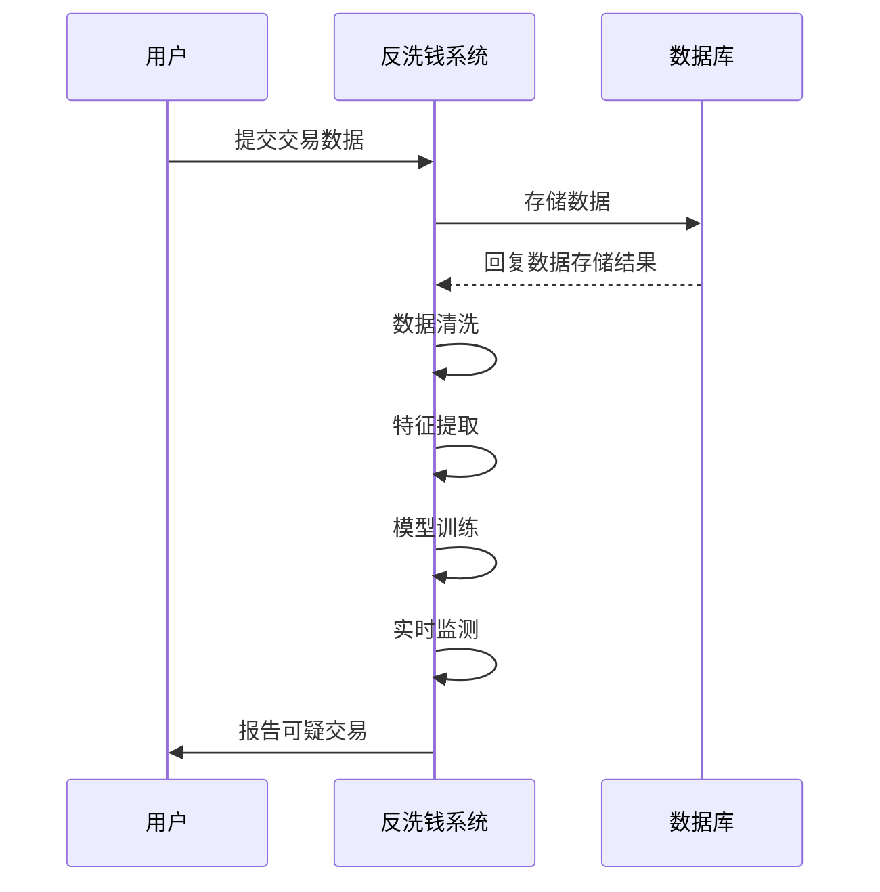
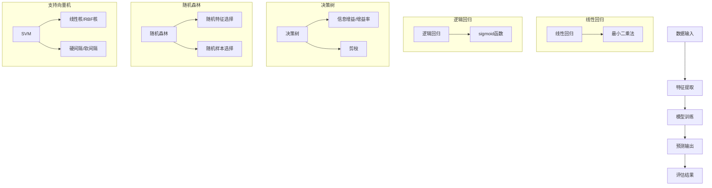
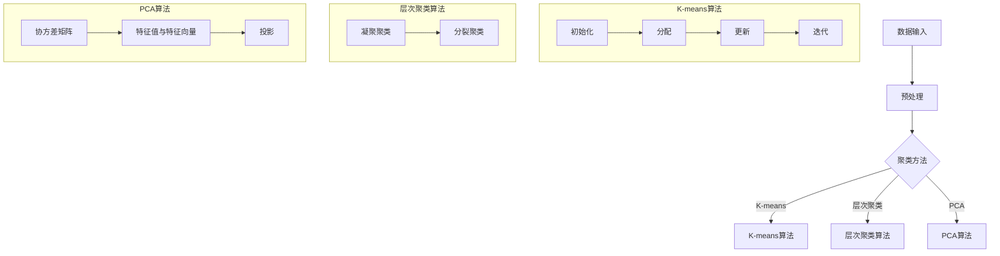
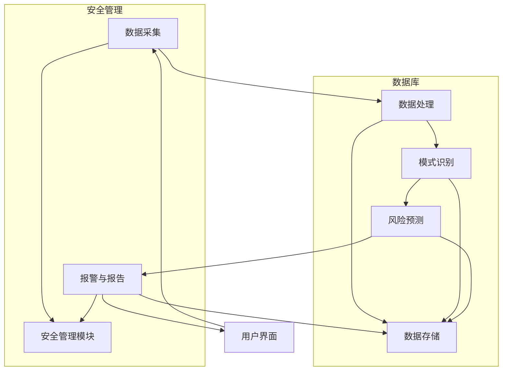
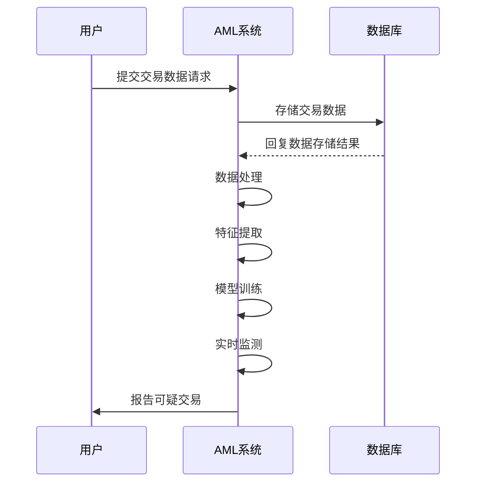

                 

### 第1章: AI在反洗钱模式识别中的创新应用背景

## 1.2 洗钱模式的定义与分类

### 1.2.1 洗钱的基本流程

洗钱是一个复杂且多层次的过程，通常包括三个阶段：放置、层叠和整合。

1. **放置（Placement）**：将非法资金引入金融系统，通常通过现金存款或汇款等方式。

2. **层叠（Layering）**：通过一系列复杂的金融交易将资金转移，使其难以追踪。这通常涉及多层银行账户、多次转账、购买和销售资产等。

3. **整合（Integration）**：将清洗后的资金整合回合法经济活动中，使其看似合法。

### 1.2.2 洗钱模式的常见类型

1. **结构性洗钱**：通过伪造交易记录或使用虚假文件来隐藏资金的真实来源。

2. **表面化洗钱**：通过频繁的交易或使用不同的银行账户来掩盖资金的真实流向。

3. **跨境洗钱**：利用不同国家的金融系统差异进行资金转移。

### 1.2.3 洗钱风险的识别与评估

识别洗钱风险是反洗钱工作的重要环节。通常包括以下步骤：

1. **客户识别**：收集客户的基本信息，如姓名、地址、职业等。

2. **交易监测**：通过监控系统监控客户的交易行为，识别异常交易。

3. **风险评估**：根据客户和交易的特征，对洗钱风险进行评估。

### 1.2.4 传统反洗钱手段的局限性

尽管传统反洗钱手段在遏制洗钱活动中发挥了重要作用，但它们也存在一些局限性：

1. **人工监控的效率问题**：人工监控成本高昂，且易受人为因素影响，效率较低。

2. **被动监控的技术瓶颈**：传统反洗钱系统通常依赖被动监测技术，难以识别复杂的洗钱模式。

3. **高风险客户和交易的识别难度**：传统方法难以准确识别高风险客户和交易，容易遗漏洗钱活动。

### 1.2.5 AI在反洗钱中的应用潜力

人工智能（AI）在反洗钱领域具有巨大潜力，主要体现在以下几个方面：

1. **实时监测**：AI系统可以实时监测交易，快速识别异常行为。

2. **模式识别**：AI算法能够识别复杂的洗钱模式，提高检测效率。

3. **自动分类**：AI系统可以根据交易特征自动分类，减少人工干预。

4. **合规性检查**：AI可以帮助金融机构快速完成合规性检查，减少违规风险。

### 1.2.6 AI在反洗钱模式识别中的应用

AI在反洗钱模式识别中的应用主要体现在以下几个方面：

1. **交易分析**：通过分析交易数据，识别异常交易和可疑行为。

2. **客户行为分析**：通过监控客户行为，识别高风险客户。

3. **风险预测**：通过历史数据分析和模式识别，预测未来的洗钱风险。

### 1.2.7 AI驱动的反洗钱系统优势分析

AI驱动的反洗钱系统具有以下优势：

1. **高效性**：AI系统可以实时处理大量数据，提高反洗钱效率。

2. **准确性**：AI算法可以准确识别洗钱模式，减少误报和漏报。

3. **自动化**：AI系统可以自动执行反洗钱任务，减少人工干预。

4. **适应性**：AI系统可以根据新的洗钱模式不断调整，提高反洗钱能力。

### 1.2.8 AI应用的范围与挑战

AI在反洗钱中的应用范围广泛，包括交易监测、客户行为分析、风险预测等。然而，AI应用也面临一些挑战：

1. **数据隐私与合规性**：反洗钱涉及大量敏感数据，如何保护数据隐私是重要挑战。

2. **技术风险**：AI系统可能受到黑客攻击或被错误配置，影响反洗钱效果。

3. **人才需求**：AI系统需要专业的技术人才进行开发和维护。

### 1.2.9 总结

AI在反洗钱模式识别中的应用具有巨大的潜力。通过实时监测、模式识别和风险预测，AI系统可以提高反洗钱效率，减少洗钱风险。然而，AI应用也面临数据隐私、技术风险和人才需求等挑战，需要金融机构和监管机构共同努力，确保AI在反洗钱领域得到有效应用。

## 1.3 AI在反洗钱模式识别中的应用前景

### 1.3.1 实时监测

AI驱动的反洗钱系统能够实时监测交易数据，快速识别异常行为。传统的反洗钱系统往往依赖于预设规则和人工监控，效率较低，而AI系统可以通过机器学习算法自动识别复杂的洗钱模式，提高监测效率。

#### 1.3.1.1 监测流程

- **数据采集**：从金融机构的交易系统中采集交易数据。
- **预处理**：清洗和标准化交易数据，以便于后续分析。
- **特征提取**：提取交易特征，如交易金额、时间、频率等。
- **模型训练**：使用历史数据训练机器学习模型。
- **实时监测**：对实时交易数据进行分析，识别异常交易。

#### 1.3.1.2 监测优势

- **实时性**：AI系统能够实时处理大量交易数据，提高监测效率。
- **准确性**：机器学习算法可以准确识别复杂的洗钱模式，减少误报和漏报。
- **自适应**：AI系统可以根据新的洗钱模式不断调整，提高监测效果。

### 1.3.2 模式识别

AI系统可以通过模式识别技术，分析交易数据中的潜在洗钱模式。这有助于金融机构更好地理解洗钱行为，并制定相应的风险管理策略。

#### 1.3.2.1 模式识别流程

- **数据预处理**：清洗和标准化交易数据。
- **特征提取**：提取交易特征，如交易金额、时间、频率等。
- **模式识别**：使用聚类算法、分类算法等识别交易数据中的潜在洗钱模式。
- **异常检测**：对识别出的模式进行异常检测，识别可疑交易。

#### 1.3.2.2 模式识别优势

- **全面性**：AI系统可以从大量交易数据中识别出潜在的洗钱模式，提高风险识别能力。
- **智能化**：机器学习算法可以根据历史数据不断优化，提高模式识别的准确性。
- **可扩展性**：AI系统可以根据新的交易数据和市场环境不断调整，适应变化。

### 1.3.3 风险预测

AI系统可以通过历史数据和模式识别技术，预测未来的洗钱风险。这有助于金融机构提前采取措施，防范洗钱活动。

#### 1.3.3.1 风险预测流程

- **数据采集**：从金融机构的交易系统和外部数据源采集数据。
- **数据预处理**：清洗和标准化交易数据。
- **特征提取**：提取交易特征，如交易金额、时间、频率等。
- **模型训练**：使用历史数据训练机器学习模型。
- **风险预测**：对实时交易数据进行分析，预测未来的洗钱风险。

#### 1.3.3.2 风险预测优势

- **前瞻性**：AI系统可以通过历史数据和模式识别技术，提前预测未来的洗钱风险。
- **准确性**：机器学习算法可以根据历史数据不断优化，提高风险预测的准确性。
- **自适应**：AI系统可以根据新的交易数据和市场环境不断调整，提高风险预测能力。

### 1.3.4 总结

AI在反洗钱模式识别中的应用具有广阔的前景。通过实时监测、模式识别和风险预测，AI系统可以提高反洗钱效率，减少洗钱风险。随着技术的不断进步，AI在反洗钱领域的应用将会更加深入和广泛。

## 1.4 总结

### 1.4.1 反洗钱的重要性

反洗钱（AML）在全球金融体系中具有至关重要的地位。洗钱活动不仅侵犯了金融系统的合法性，还对社会稳定和经济安全构成威胁。因此，有效识别和防止洗钱活动是全球金融机构和监管机构共同面临的挑战。

### 1.4.2 AI在反洗钱中的优势

AI技术在反洗钱领域具有显著优势，主要体现在实时监测、模式识别和风险预测等方面。AI系统可以处理海量交易数据，快速识别异常行为，减少人工干预，提高反洗钱效率。此外，AI系统可以根据历史数据不断优化，提高识别准确性，为金融机构提供更可靠的风险评估。

### 1.4.3 AI应用的挑战

尽管AI在反洗钱中具有巨大潜力，但应用过程中仍面临一些挑战。首先，数据隐私和合规性问题是AI应用的关键挑战。反洗钱涉及大量敏感数据，如何保护数据隐私是金融机构和监管机构需要共同解决的问题。其次，技术风险和管理风险也是AI应用的重要挑战。AI系统可能受到黑客攻击或被错误配置，影响反洗钱效果。此外，AI系统的开发和维护需要专业的技术人才，这对金融机构来说是一个巨大挑战。

### 1.4.4 未来展望

随着AI技术的不断进步，其在反洗钱领域的应用前景将更加广阔。未来，AI技术有望实现更高效、更准确的洗钱模式识别和风险预测。同时，监管机构和企业也将加强合作，推动AI技术在反洗钱领域的应用。在技术发展的同时，数据隐私保护、合规性和人才需求等问题也将得到更好的解决，为AI在反洗钱领域的广泛应用奠定基础。

作者：AI天才研究院/AI Genius Institute & 禅与计算机程序设计艺术 /Zen And The Art of Computer Programming

## 1.5 系统架构设计

### 1.5.1 反洗钱系统的总体架构设计

反洗钱系统的设计需要考虑系统的高效性、可靠性、可扩展性和安全性。总体架构设计可以分为以下几个模块：

1. **数据采集模块**：负责从各个数据源（如银行交易系统、金融平台等）收集数据。
2. **数据处理模块**：对采集到的数据进行清洗、转换和存储，以便后续分析。
3. **模式识别模块**：使用机器学习算法对清洗后的数据进行模式识别，识别出可疑交易。
4. **风险评估模块**：根据模式识别的结果，对交易进行风险评估，判断是否存在洗钱风险。
5. **报警与报告模块**：当检测到可疑交易或高风险交易时，系统会自动生成报警信息并生成报告。
6. **用户界面模块**：提供用户交互界面，允许用户查看报警信息、查询交易记录等。

### 1.5.2 数据处理模块设计

数据处理模块是反洗钱系统的核心部分，其设计需要考虑以下方面：

1. **数据采集**：从各个数据源采集交易数据，包括交易金额、交易时间、交易双方信息等。
2. **数据清洗**：清洗交易数据，去除无效数据、重复数据等，确保数据质量。
3. **数据转换**：将原始数据转换为统一的格式，便于后续处理。
4. **数据存储**：将处理后的数据存储在数据库中，以便后续分析和查询。

### 1.5.3 模式识别模块设计

模式识别模块是反洗钱系统的关键技术部分，其设计需要考虑以下方面：

1. **特征提取**：从交易数据中提取关键特征，如交易金额、交易时间间隔、交易频率等。
2. **算法选择**：选择合适的机器学习算法，如神经网络、支持向量机等，对交易数据进行分析。
3. **模型训练**：使用历史交易数据训练机器学习模型，使其能够识别可疑交易模式。
4. **模型评估**：对训练好的模型进行评估，确保其准确性和可靠性。
5. **实时监测**：使用训练好的模型对实时交易数据进行监测，识别可疑交易。

### 1.5.4 系统接口设计

系统接口设计是确保系统模块之间能够有效交互的关键。设计需要考虑以下方面：

1. **API接口**：定义API接口，允许其他系统或模块访问反洗钱系统的功能。
2. **数据格式**：规定数据交换的格式，如JSON、XML等。
3. **安全性**：确保API接口的安全性，防止未经授权的访问。
4. **响应时间**：优化接口响应时间，确保系统的高效运行。

### 1.5.5 系统交互Mermaid序列图

以下是一个简化的反洗钱系统交互Mermaid序列图，展示了数据从采集到处理、识别和报告的流程。



### 1.5.6 总结

反洗钱系统的设计需要综合考虑数据采集、处理、模式识别和报告等多个方面。通过合理设计系统架构和接口，可以实现高效、准确、安全的反洗钱监测和风险管理。随着AI技术的发展，反洗钱系统将更加智能化和自动化，为金融机构提供更强大的风险管理工具。

作者：AI天才研究院/AI Genius Institute & 禅与计算机程序设计艺术 /Zen And The Art of Computer Programming

## 第2章: AI在反洗钱模式识别中的核心概念与原理

### 2.1 机器学习算法基础

#### 2.1.1 机器学习的基本概念

机器学习（Machine Learning，简称ML）是一门人工智能（Artificial Intelligence，简称AI）的分支，旨在通过数据训练算法，使其能够自主学习和改进性能。在机器学习中，算法通常根据训练数据中的特征和标签，学习到数据的内在规律，并使用这些规律对新数据进行预测或分类。

#### 2.1.2 监督学习、无监督学习与半监督学习

- **监督学习（Supervised Learning）**：在监督学习中，算法根据已标记的数据进行学习。输入数据包含特征和对应的标签，算法通过这些数据进行训练，学习到特征与标签之间的关系，从而在新数据上进行预测。

- **无监督学习（Unsupervised Learning）**：在无监督学习中，算法没有已标记的标签数据。其主要任务是从未标记的数据中寻找内在结构，如聚类、降维等。

- **半监督学习（Semi-Supervised Learning）**：半监督学习结合了监督学习和无监督学习的特点，使用少量的标记数据和大量的未标记数据来训练模型。

#### 2.1.3 常见的机器学习算法分类与比较

机器学习算法可以分为以下几类：

- **回归算法**：用于预测连续值，如线性回归、决策树回归、随机森林等。

- **分类算法**：用于预测离散值，如逻辑回归、支持向量机（SVM）、决策树、随机森林等。

- **聚类算法**：用于发现数据中的自然分组，如K-means、层次聚类、DBSCAN等。

- **降维算法**：用于减少数据维度，如主成分分析（PCA）、t-SNE等。

不同的算法在性能、复杂度、适用场景等方面有所不同，需要根据具体需求选择合适的算法。

### 2.2 特征工程与数据预处理

#### 2.2.1 特征提取的方法

特征提取是将原始数据转换为有助于模型训练的特征的过程。常见的特征提取方法包括：

- **统计特征**：如平均值、中值、标准差等。

- **文本特征**：如词频、词向量、TF-IDF等。

- **图像特征**：如边缘检测、特征点提取、卷积神经网络等。

#### 2.2.2 数据清洗与数据标准化

数据清洗和标准化是确保数据质量的重要步骤。数据清洗包括去除缺失值、处理异常值、去除重复数据等。数据标准化则包括归一化、标准化等，旨在将数据转换为统一的尺度，以避免数据尺度差异对模型训练的影响。

#### 2.2.3 特征选择与降维技术

特征选择是减少数据维度、提高模型性能的过程。常见的特征选择方法包括：

- **过滤方法**：基于统计方法，如相关性分析、卡方检验等。

- **包装方法**：结合模型训练过程，如向前选择、向后剔除等。

- **嵌入式方法**：在模型训练过程中进行特征选择，如LASSO、Ridge等。

降维技术如PCA可以减少数据维度，同时保留主要信息。

### 2.3 模式识别的理论基础

#### 2.3.1 模式识别的基本原理

模式识别（Pattern Recognition）是机器学习的一个分支，旨在通过输入数据的特征，将其分类到预定义的类别中。模式识别的过程包括：

- **特征提取**：从数据中提取有用的特征。

- **特征选择**：从提取的特征中选择最相关的特征。

- **分类器设计**：设计分类器，将数据分类到预定义的类别中。

- **模型评估**：评估分类器的性能，如准确率、召回率、F1值等。

#### 2.3.2 聚类算法与分类算法的应用

- **聚类算法**：用于发现数据中的自然分组，如K-means、层次聚类等。聚类算法无需标签数据，适用于无监督学习。

- **分类算法**：用于将数据分类到预定义的类别中，如逻辑回归、支持向量机（SVM）等。分类算法需要标签数据，适用于监督学习。

#### 2.3.3 模式识别的性能评估指标

模式识别的性能评估指标包括：

- **准确率（Accuracy）**：正确分类的样本数占总样本数的比例。

- **召回率（Recall）**：正确分类为正类的样本数占所有正类样本数的比例。

- **F1值（F1 Score）**：准确率和召回率的调和平均。

### 2.4 AI算法在反洗钱中的应用

#### 2.4.1 机器学习算法在交易分析中的应用

机器学习算法在反洗钱交易分析中有着广泛的应用。例如，通过监督学习算法，可以训练模型来识别异常交易；通过聚类算法，可以找到潜在的洗钱模式；通过降维技术，可以减少数据维度，提高模型性能。

#### 2.4.2 神经网络在异常检测中的优势

神经网络，特别是深度学习模型，在异常检测中具有显著优势。深度学习模型可以自动提取复杂的特征，提高异常检测的准确性。例如，使用卷积神经网络（CNN）可以识别图像中的异常行为；使用循环神经网络（RNN）可以分析序列数据中的异常模式。

#### 2.4.3 深度学习模型在模式识别中的应用实例

深度学习模型在反洗钱模式识别中的应用实例包括：

- **卷积神经网络（CNN）**：用于处理图像数据，识别图像中的异常交易行为。

- **递归神经网络（RNN）**：用于处理序列数据，如交易时间序列，识别时间序列中的异常模式。

- **生成对抗网络（GAN）**：用于生成真实交易数据，提高模型的泛化能力。

### 2.5 总结

本章介绍了AI在反洗钱模式识别中的核心概念与原理，包括机器学习算法、特征工程、模式识别和深度学习等。通过这些技术，AI系统能够有效地识别和预测洗钱模式，提高反洗钱效率。下一章将详细讲解这些算法的原理和实现。

作者：AI天才研究院/AI Genius Institute & 禅与计算机程序设计艺术 /Zen And The Art of Computer Programming

## 第3章: AI在反洗钱模式识别中的算法原理详解

### 3.1 监督学习算法详解

#### 3.1.1 线性回归与逻辑回归

线性回归（Linear Regression）是一种简单的监督学习算法，用于预测连续值。其核心思想是通过拟合一条直线来描述自变量和因变量之间的关系。

1. **线性回归模型**：
   $$ y = \beta_0 + \beta_1 \cdot x_1 + \beta_2 \cdot x_2 + ... + \beta_n \cdot x_n $$

2. **最小二乘法**：
   使用最小二乘法（Least Squares Method）来求解模型的参数，目标是使预测值与实际值之间的误差平方和最小。

逻辑回归（Logistic Regression）是线性回归的一种推广，用于预测概率。在反洗钱模式识别中，逻辑回归常用于分类问题，如判断交易是否可疑。

1. **逻辑回归模型**：
   $$ \sigma(\beta_0 + \beta_1 \cdot x_1 + \beta_2 \cdot x_2 + ...) = P(y=1) $$

   其中，$\sigma$是sigmoid函数，用于将线性组合映射到概率值。

2. **代价函数**：
   逻辑回归的代价函数通常是负对数似然函数（Negative Log-Likelihood），用于评估模型的性能。

#### 3.1.2 决策树与随机森林

决策树（Decision Tree）是一种常见的监督学习算法，通过一系列的决策规则来分类或回归数据。每个节点代表一个特征，每个分支代表一个特征取值。

1. **决策树生成**：
   - **ID3算法**：基于信息增益（Information Gain）选择最佳特征。
   - **C4.5算法**：基于增益率（Gain Ratio）选择最佳特征，减少过拟合。

2. **剪枝**：
   决策树容易过拟合，因此需要进行剪枝（Pruning）。常见的剪枝方法包括预剪枝（Pre-pruning）和后剪枝（Post-pruning）。

随机森林（Random Forest）是决策树的集成方法，通过构建多个决策树并投票来提高模型的预测能力。

1. **随机森林生成**：
   - **随机特征选择**：在每个节点选择特征时，从特征集合中随机选择一部分特征。
   - **随机样本选择**：在每个决策树训练过程中，从训练集中随机选择一部分样本。

2. **随机森林优势**：
   - **减少过拟合**：通过集成多个决策树，减少模型的过拟合。
   - **提高预测能力**：随机森林可以处理高维数据，提高预测准确性。

#### 3.1.3 支持向量机（SVM）

支持向量机（Support Vector Machine，SVM）是一种有效的分类算法，通过找到一个最优的超平面，将不同类别的数据分开。

1. **线性SVM**：
   - **硬间隔**：找到一个最优的超平面，使得分类错误率最小。
   - **软间隔**：引入松弛变量，允许一定的分类错误，提高模型的泛化能力。

2. **核函数**：
   - **线性核**：适用于线性可分的数据。
   - **多项式核**、**径向基函数（RBF）核**等：用于非线性分类问题。

3. **SVM优化问题**：
   $$ \min_{\beta, \beta_0, \xi} \frac{1}{2} \sum_{i=1}^{n} (\beta \cdot \beta)^T - \sum_{i=1}^{n} y_i (\beta \cdot x_i + \beta_0) + \sum_{i=1}^{n} \xi_i $$
   其中，$\xi_i$是松弛变量，用于处理分类错误。

#### 3.1.4 算法原理与Mermaid流程图

以下是一个简化的监督学习算法原理Mermaid流程图，展示了线性回归、逻辑回归、决策树和随机森林的基本流程。



#### 3.1.5 算法原理Python代码实现

以下是一个简化的Python代码示例，展示了线性回归和逻辑回归的基本实现。

```python
import numpy as np
from sklearn.linear_model import LinearRegression, LogisticRegression

# 线性回归
X = np.array([[1, 2], [2, 3], [3, 4]])
y = np.array([2, 3, 4])
model_lr = LinearRegression()
model_lr.fit(X, y)
y_pred = model_lr.predict(X)

# 逻辑回归
X = np.array([[1, 2], [2, 3], [3, 4]])
y = np.array([0, 1, 0])
model_lr = LogisticRegression()
model_lr.fit(X, y)
y_pred = model_lr.predict(X)
```

#### 3.1.6 算法原理的数学模型与公式解析

以下是对线性回归和逻辑回归算法原理的数学模型和公式的详细解析。

1. **线性回归**：

   - **数学模型**：
     $$ y = \beta_0 + \beta_1 \cdot x_1 + \beta_2 \cdot x_2 + ... + \beta_n \cdot x_n $$
     
     其中，$\beta_0$是截距，$\beta_1, \beta_2, ..., \beta_n$是斜率。

   - **最小二乘法**：
     $$ \min \sum_{i=1}^{n} (y_i - \hat{y_i})^2 $$
     
     其中，$\hat{y_i}$是预测值。

2. **逻辑回归**：

   - **数学模型**：
     $$ \sigma(\beta_0 + \beta_1 \cdot x_1 + \beta_2 \cdot x_2 + ...) = P(y=1) $$
     
     其中，$\sigma$是sigmoid函数：
     $$ \sigma(x) = \frac{1}{1 + e^{-x}} $$

   - **代价函数**：
     $$ J(\beta) = -\frac{1}{n} \sum_{i=1}^{n} y_i \cdot \ln(\hat{y_i}) + (1 - y_i) \cdot \ln(1 - \hat{y_i}) $$

#### 3.1.7 举例说明

以下是对线性回归和逻辑回归算法原理的举例说明。

1. **线性回归**：

   假设我们有两个特征$x_1$和$x_2$，训练数据如下：

   | $x_1$ | $x_2$ | $y$ |
   |------|------|-----|
   | 1    | 2    | 2   |
   | 2    | 3    | 3   |
   | 3    | 4    | 4   |

   使用最小二乘法求解线性回归模型参数：

   - **计算斜率**：
     $$ \beta_1 = \frac{\sum_{i=1}^{n} (x_{1i} - \bar{x}_1)(y_i - \bar{y})}{\sum_{i=1}^{n} (x_{1i} - \bar{x}_1)^2} $$
     $$ \beta_2 = \frac{\sum_{i=1}^{n} (x_{2i} - \bar{x}_2)(y_i - \bar{y})}{\sum_{i=1}^{n} (x_{2i} - \bar{x}_2)^2} $$

   - **计算截距**：
     $$ \beta_0 = \bar{y} - \beta_1 \cdot \bar{x}_1 - \beta_2 \cdot \bar{x}_2 $$

   使用训练数据计算得到：
   $$ \beta_0 = 1.5, \beta_1 = 0.5, \beta_2 = 0.5 $$

   线性回归模型为：
   $$ y = 1.5 + 0.5 \cdot x_1 + 0.5 \cdot x_2 $$

2. **逻辑回归**：

   假设我们有两个特征$x_1$和$x_2$，训练数据如下：

   | $x_1$ | $x_2$ | $y$ |
   |------|------|-----|
   | 1    | 2    | 0   |
   | 2    | 3    | 1   |
   | 3    | 4    | 0   |

   使用逻辑回归模型计算概率：
   $$ P(y=1) = \sigma(\beta_0 + \beta_1 \cdot x_1 + \beta_2 \cdot x_2) $$

   假设我们初始的模型参数为$\beta_0 = 0, \beta_1 = 0.5, \beta_2 = 0.5$，计算得到：
   $$ P(y=1) = \sigma(0 + 0.5 \cdot 1 + 0.5 \cdot 2) = \sigma(1.5) \approx 0.933 $$
   $$ P(y=1) = \sigma(0 + 0.5 \cdot 2 + 0.5 \cdot 3) = \sigma(2.5) \approx 0.980 $$
   $$ P(y=1) = \sigma(0 + 0.5 \cdot 3 + 0.5 \cdot 4) = \sigma(3.5) \approx 0.970 $$

   根据概率阈值（例如，阈值设为0.5），可以将训练数据分类为两类。

### 3.2 无监督学习算法详解

#### 3.2.1 K-means聚类

K-means聚类是一种常用的无监督学习算法，用于将数据分成K个簇。其主要步骤如下：

1. **初始化**：随机选择K个数据点作为初始聚类中心。

2. **分配**：将每个数据点分配到距离其最近的聚类中心所在的簇。

3. **更新**：重新计算每个簇的中心点。

4. **迭代**：重复步骤2和步骤3，直到聚类中心不再变化或达到预设的迭代次数。

K-means聚类算法的优点是简单、高效，但可能陷入局部最优，对初始聚类中心敏感。

#### 3.2.2 层次聚类

层次聚类是一种基于相似度矩阵的聚类方法，分为凝聚层次聚类和分裂层次聚类。

1. **凝聚层次聚类**：
   - **步骤**：从每个数据点开始，逐步合并距离最近的点，直到所有数据点合并为一个簇。
   - **距离度量**：常用的距离度量包括欧氏距离、曼哈顿距离等。

2. **分裂层次聚类**：
   - **步骤**：从单个簇开始，逐步分裂为多个簇，直到每个簇只包含一个数据点。

层次聚类算法的优点是能够生成聚类层次结构，便于分析，但计算复杂度较高。

#### 3.2.3 主成分分析（PCA）

主成分分析（Principal Component Analysis，PCA）是一种降维技术，通过将数据投影到新的正交基上，提取最重要的特征，减少数据维度。

1. **协方差矩阵**：
   $$ \Sigma = \frac{1}{n} XX^T $$
   
   其中，$X$是数据矩阵，$\Sigma$是协方差矩阵。

2. **特征值与特征向量**：
   协方差矩阵的特征值和特征向量确定了新的正交基。

3. **投影**：
   将数据投影到新的正交基上，得到新的特征向量：
   $$ Z = X \cdot U $$
   
   其中，$U$是对应特征向量的矩阵。

PCA的优点是能够提取主要特征，减少数据维度，提高模型性能，但可能丢失部分信息。

### 3.3 深度学习算法详解

#### 3.3.1 卷积神经网络（CNN）

卷积神经网络（Convolutional Neural Network，CNN）是一种专门用于处理图像数据的深度学习模型，其核心在于卷积运算。

1. **卷积层**：
   - **卷积运算**：将卷积核与输入数据进行卷积运算，提取特征。
   - **激活函数**：常用ReLU（Rectified Linear Unit）函数，提高模型性能。

2. **池化层**：
   - **最大池化**：取每个卷积核输出的最大值，减少数据维度。
   - **平均池化**：取每个卷积核输出的平均值，减少数据维度。

3. **全连接层**：
   - **全连接层**：将卷积层和池化层输出的特征进行全连接，进行分类或回归。

CNN的优点是能够自动提取图像特征，减少手工特征提取的工作量，适用于各种图像处理任务。

#### 3.3.2 递归神经网络（RNN）

递归神经网络（Recurrent Neural Network，RNN）是一种用于处理序列数据的深度学习模型，其核心在于递归结构。

1. **单元状态**：
   - **隐藏状态**：每个时间步的隐藏状态包含了当前的信息和之前的信息。
   - **输入门、遗忘门、输出门**：用于控制信息的流动。

2. **时间步递归**：
   - **递归连接**：每个时间步的输出与之前的隐藏状态相关联。
   - **梯度消失/爆炸**：RNN容易出现梯度消失或爆炸问题，影响模型训练。

RNN的优点是能够处理变长的序列数据，适用于自然语言处理、时间序列分析等任务。

#### 3.3.3 生成对抗网络（GAN）

生成对抗网络（Generative Adversarial Network，GAN）是一种由生成器和判别器组成的深度学习模型，其核心在于对抗训练。

1. **生成器**：
   - **生成数据**：生成器试图生成逼真的数据。
   - **损失函数**：通常使用对抗损失函数，如Wasserstein损失。

2. **判别器**：
   - **分类数据**：判别器试图区分真实数据和生成数据。
   - **损失函数**：通常使用二元交叉熵损失。

GAN的优点是能够生成高质量的数据，适用于图像生成、自然语言生成等任务。

### 3.4 算法原理与Mermaid流程图

以下是一个简化的无监督学习算法原理Mermaid流程图，展示了K-means聚类、层次聚类和PCA的基本流程。



### 3.5 总结

本章详细介绍了AI在反洗钱模式识别中的算法原理，包括监督学习、无监督学习和深度学习等算法。通过这些算法，AI系统能够有效地识别和预测洗钱模式，提高反洗钱效率。下一章将深入探讨AI在反洗钱模式识别中的系统架构设计。

作者：AI天才研究院/AI Genius Institute & 禅与计算机程序设计艺术 /Zen And The Art of Computer Programming

## 第4章: AI在反洗钱模式识别中的系统架构设计

### 4.1 反洗钱系统的总体架构设计

反洗钱（AML）系统是一个复杂的应用系统，旨在通过监控和分析金融机构的交易数据，识别和预防洗钱活动。设计一个高效、可靠、安全的AML系统需要综合考虑多个方面，包括系统需求、架构设计、数据处理、模式识别和风险管理等。

#### 4.1.1 系统需求分析

在开始设计AML系统之前，需要明确系统的需求。这些需求包括：

1. **数据采集**：系统需要能够从不同的数据源（如银行系统、支付平台、交易所等）采集交易数据。
2. **数据存储**：系统需要具备高效的数据存储和管理能力，以便快速检索和分析交易数据。
3. **数据处理**：系统需要能够对采集到的交易数据进行清洗、转换和预处理，以便后续的模式识别和分析。
4. **模式识别**：系统需要利用机器学习和深度学习算法，对清洗后的交易数据进行分析，识别潜在的洗钱模式。
5. **风险预测**：系统需要能够根据模式识别的结果，预测未来的洗钱风险，并生成风险报告。
6. **用户界面**：系统需要提供一个直观、易用的用户界面，方便用户查看分析结果、设置警报等。
7. **安全与合规性**：系统需要确保数据的安全性和合规性，遵循相关的反洗钱法规和标准。

#### 4.1.2 系统架构设计

基于上述需求，AML系统的总体架构设计可以包括以下几个主要模块：

1. **数据采集模块**：负责从各个数据源采集交易数据，包括实时数据和历史数据。
2. **数据处理模块**：对采集到的交易数据进行清洗、转换和预处理，为模式识别模块提供干净、标准化的数据。
3. **模式识别模块**：使用机器学习和深度学习算法，对清洗后的交易数据进行分析，识别潜在的洗钱模式。
4. **风险预测模块**：根据模式识别的结果，结合历史数据和实时数据，预测未来的洗钱风险。
5. **报警与报告模块**：当检测到可疑交易或高风险交易时，系统会自动生成报警信息，并生成详细的报告。
6. **用户界面模块**：提供用户交互界面，允许用户查看分析结果、设置警报、查询交易记录等。
7. **安全管理模块**：负责确保系统的安全性和合规性，包括用户认证、数据加密、日志记录等。

#### 4.1.3 系统架构图

以下是一个简化的AML系统架构图，展示了各个模块的交互和数据处理流程。



### 4.2 数据处理模块设计

数据处理模块是AML系统的核心，其设计需要考虑以下方面：

1. **数据采集**：从不同的数据源（如银行系统、支付平台、交易所等）采集交易数据，包括实时数据和历史数据。
2. **数据清洗**：清洗交易数据，去除无效数据、重复数据、缺失数据等，确保数据质量。
3. **数据转换**：将原始交易数据转换为统一的数据格式，如JSON、CSV等，以便后续处理。
4. **数据存储**：将处理后的数据存储在数据库中，以便后续分析和查询。

#### 4.2.1 数据采集

数据采集是数据处理模块的第一步，其设计需要考虑以下方面：

1. **数据源**：确定数据采集的目标数据源，包括银行交易系统、支付平台、交易所等。
2. **数据格式**：确定数据采集的数据格式，如XML、JSON、CSV等。
3. **采集频率**：确定数据采集的频率，如实时采集、定时采集等。
4. **数据一致性**：确保采集到的数据一致性，包括数据的时间戳、交易金额、交易双方等。

#### 4.2.2 数据清洗

数据清洗是确保数据质量的重要步骤，其设计需要考虑以下方面：

1. **去除无效数据**：去除无效交易数据，如空值、重复数据等。
2. **处理缺失数据**：对缺失数据进行处理，如插值、平均填充等。
3. **标准化数据**：将交易数据标准化，如将金额统一为货币单位、时间戳统一为UTC时间等。
4. **去重**：去除重复交易数据，确保数据的一致性。

#### 4.2.3 数据转换

数据转换是将原始交易数据转换为统一的数据格式，其设计需要考虑以下方面：

1. **数据格式**：确定统一的数据格式，如JSON、CSV等。
2. **数据映射**：将原始交易数据映射到统一的数据格式，如将交易金额映射到货币单位、时间戳映射到UTC时间等。
3. **数据验证**：验证转换后的数据是否合法、有效。

#### 4.2.4 数据存储

数据存储是将处理后的数据存储在数据库中，其设计需要考虑以下方面：

1. **数据库选择**：选择适合的数据库，如关系型数据库（MySQL、PostgreSQL）或NoSQL数据库（MongoDB、Cassandra）。
2. **表结构设计**：设计合理的数据库表结构，包括交易表、客户表、账户表等。
3. **索引设计**：设计合理的索引，提高数据查询性能。

### 4.3 模式识别模块设计

模式识别模块是AML系统的核心，其设计需要考虑以下方面：

1. **特征提取**：从交易数据中提取关键特征，如交易金额、交易频率、交易时间等。
2. **模型训练**：使用历史交易数据训练机器学习模型，如K-means、SVM、神经网络等。
3. **模型评估**：评估训练好的模型的性能，如准确率、召回率、F1值等。
4. **实时监测**：使用训练好的模型对实时交易数据进行分析，识别潜在的洗钱模式。

#### 4.3.1 特征提取

特征提取是模式识别模块的关键步骤，其设计需要考虑以下方面：

1. **特征选择**：从交易数据中筛选出有用的特征，如交易金额、交易频率、交易时间等。
2. **特征工程**：对原始特征进行变换、组合等，以提取更有效的特征。
3. **特征标准化**：将特征值标准化，如将金额转换为货币单位、时间戳转换为UTC时间等。

#### 4.3.2 模型训练

模型训练是模式识别模块的核心，其设计需要考虑以下方面：

1. **训练数据**：选择合适的训练数据，如历史交易数据、模拟数据等。
2. **训练算法**：选择合适的机器学习算法，如K-means、SVM、神经网络等。
3. **训练策略**：设计合理的训练策略，如交叉验证、早期停止等，以避免过拟合。

#### 4.3.3 模型评估

模型评估是确保模型性能的重要步骤，其设计需要考虑以下方面：

1. **评估指标**：选择合适的评估指标，如准确率、召回率、F1值等。
2. **交叉验证**：使用交叉验证方法，评估模型的泛化能力。
3. **性能比较**：比较不同模型的性能，选择最佳模型。

#### 4.3.4 实时监测

实时监测是模式识别模块的重要功能，其设计需要考虑以下方面：

1. **实时数据流**：实时采集和处理交易数据，确保系统的高效性。
2. **模型应用**：使用训练好的模型对实时交易数据进行分析，识别潜在的洗钱模式。
3. **警报与报告**：当检测到可疑交易或高风险交易时，自动生成警报和报告。

### 4.4 系统接口设计

系统接口设计是确保系统模块之间能够有效交互的关键，其设计需要考虑以下方面：

1. **API接口**：定义API接口，允许其他系统或模块访问AML系统的功能。
2. **数据格式**：规定数据交换的格式，如JSON、XML等。
3. **安全性**：确保API接口的安全性，防止未经授权的访问。
4. **响应时间**：优化接口响应时间，确保系统的高效运行。

#### 4.4.1 API接口设计

API接口设计是系统接口设计的关键步骤，其设计需要考虑以下方面：

1. **接口定义**：定义API的URL、请求方法和参数。
2. **参数验证**：验证API请求的参数，确保数据的有效性。
3. **响应格式**：定义API响应的数据格式，如JSON、XML等。

#### 4.4.2 API示例

以下是一个简化的API接口示例：

```json
{
  "url": "/api/aml/transactions",
  "method": "GET",
  "parameters": {
    "from_date": "YYYY-MM-DD",
    "to_date": "YYYY-MM-DD",
    "account_id": "string"
  },
  "response": {
    "status": "success",
    "data": [
      {
        "transaction_id": "string",
        "amount": "number",
        "timestamp": "string",
        "source_account": "string",
        "destination_account": "string"
      }
    ]
  }
}
```

### 4.5 系统交互Mermaid序列图

以下是一个简化的AML系统交互Mermaid序列图，展示了数据从采集到处理、识别和报告的流程。



### 4.6 总结

反洗钱系统的设计需要综合考虑数据采集、处理、模式识别和报告等多个方面。通过合理设计系统架构和接口，可以实现高效、准确、安全的反洗钱监测和风险管理。随着AI技术的不断进步，反洗钱系统将更加智能化和自动化，为金融机构提供更强大的风险管理工具。

作者：AI天才研究院/AI Genius Institute & 禅与计算机程序设计艺术 /Zen And The Art of Computer Programming

## 第5章: AI在反洗钱模式识别中的项目实战

### 5.1 环境安装与配置

在进行AI在反洗钱模式识别中的项目实战之前，我们需要搭建一个合适的环境。以下是一个简单的环境安装和配置步骤。

#### 5.1.1 环境要求

- 操作系统：Linux或MacOS
- Python版本：Python 3.8及以上
- 数据库：MySQL或PostgreSQL
- 机器学习库：scikit-learn、TensorFlow、PyTorch等

#### 5.1.2 安装步骤

1. **安装Python**：

   使用包管理器如`pip`安装Python。

   ```bash
   sudo apt-get install python3-pip
   ```

2. **安装数据库**：

   安装MySQL或PostgreSQL数据库。

   ```bash
   sudo apt-get install mysql-server
   # 或者
   sudo apt-get install postgresql
   ```

3. **安装Python库**：

   使用`pip`安装所需的Python库。

   ```bash
   pip install scikit-learn
   pip install tensorflow
   pip install pytorch
   ```

#### 5.1.3 配置数据库

1. **创建数据库**：

   ```sql
   CREATE DATABASE aml_db;
   ```

2. **创建用户和权限**：

   ```sql
   CREATE USER 'aml_user'@'localhost' IDENTIFIED BY 'password';
   GRANT ALL PRIVILEGES ON aml_db.* TO 'aml_user'@'localhost';
   FLUSH PRIVILEGES;
   ```

3. **配置数据库连接**：

   在Python代码中配置数据库连接。

   ```python
   import mysql.connector
   
   conn = mysql.connector.connect(
       host="localhost",
       database="aml_db",
       user="aml_user",
       password="password"
   )
   ```

### 5.2 系统核心实现源代码

在完成环境安装和配置后，我们可以开始实现反洗钱系统的核心功能。以下是一个简化的系统核心实现源代码。

#### 5.2.1 数据处理与特征工程

```python
import pandas as pd
from sklearn.preprocessing import StandardScaler

# 读取交易数据
data = pd.read_csv('transactions.csv')

# 数据预处理
data['amount'] = data['amount'].astype(float)
data['timestamp'] = pd.to_datetime(data['timestamp'])
data['time'] = data['timestamp'].dt.hour

# 特征提取
scaler = StandardScaler()
data[['amount', 'time']] = scaler.fit_transform(data[['amount', 'time']])

# 数据存储
data.to_csv('processed_transactions.csv', index=False)
```

#### 5.2.2 模型训练与评估

```python
from sklearn.model_selection import train_test_split
from sklearn.ensemble import RandomForestClassifier
from sklearn.metrics import accuracy_score, classification_report

# 数据分割
X = data[['amount', 'time']]
y = data['is_suspect']

X_train, X_test, y_train, y_test = train_test_split(X, y, test_size=0.2, random_state=42)

# 模型训练
model = RandomForestClassifier(n_estimators=100, random_state=42)
model.fit(X_train, y_train)

# 模型评估
y_pred = model.predict(X_test)
print("Accuracy:", accuracy_score(y_test, y_pred))
print("Classification Report:")
print(classification_report(y_test, y_pred))
```

#### 5.2.3 异常检测与报警

```python
# 读取处理后的交易数据
data = pd.read_csv('processed_transactions.csv')

# 模型应用
y_pred = model.predict(data[['amount', 'time']])

# 报警与报告
suspect_transactions = data[y_pred == 1]
print("Suspect Transactions:")
print(suspect_transactions)
```

### 5.3 代码应用解读与分析

#### 5.3.1 数据处理与特征工程

在数据处理与特征工程部分，我们首先读取交易数据，并将其转换为合适的格式。然后，我们使用`StandardScaler`对金额和时间特征进行标准化处理，以减少特征之间的尺度差异。

```python
data['amount'] = data['amount'].astype(float)
data['timestamp'] = pd.to_datetime(data['timestamp'])
data['time'] = data['timestamp'].dt.hour

scaler = StandardScaler()
data[['amount', 'time']] = scaler.fit_transform(data[['amount', 'time']])
```

这里，我们将金额和时间特征转换为浮点型，并使用`to_datetime`函数将时间戳转换为日期时间格式。然后，我们将时间戳的小时部分提取出来，作为一个新的特征。

接下来，我们使用`StandardScaler`对金额和时间特征进行标准化处理。标准化处理可以减少特征之间的尺度差异，提高模型训练的效果。

#### 5.3.2 模型训练与评估

在模型训练与评估部分，我们首先将数据分割为训练集和测试集。然后，我们使用随机森林分类器（`RandomForestClassifier`）对训练集进行训练。

```python
X = data[['amount', 'time']]
y = data['is_suspect']

X_train, X_test, y_train, y_test = train_test_split(X, y, test_size=0.2, random_state=42)

model = RandomForestClassifier(n_estimators=100, random_state=42)
model.fit(X_train, y_train)
```

在这里，我们使用`train_test_split`函数将数据分割为训练集和测试集。训练集用于训练模型，测试集用于评估模型性能。

接下来，我们使用训练好的模型对测试集进行预测，并计算模型性能。

```python
y_pred = model.predict(X_test)
print("Accuracy:", accuracy_score(y_test, y_pred))
print("Classification Report:")
print(classification_report(y_test, y_pred))
```

这里，我们使用`accuracy_score`函数计算模型的准确率，并使用`classification_report`函数打印详细的分类报告。

#### 5.3.3 异常检测与报警

在异常检测与报警部分，我们读取处理后的交易数据，并使用训练好的模型对交易数据进行预测。然后，我们筛选出预测结果为1（可疑交易）的记录，并打印报警信息。

```python
data = pd.read_csv('processed_transactions.csv')
y_pred = model.predict(data[['amount', 'time']])

suspect_transactions = data[y_pred == 1]
print("Suspect Transactions:")
print(suspect_transactions)
```

这里，我们首先读取处理后的交易数据，并使用训练好的模型对交易数据进行预测。然后，我们使用`==`运算符筛选出预测结果为1的记录，即可疑交易。最后，我们打印出这些可疑交易的记录。

### 5.4 实际案例分析与详细讲解

#### 5.4.1 案例背景

在某金融机构中，客户A频繁进行大额现金存款和取款操作，引起了反洗钱部门的注意。为了确定客户A的交易行为是否异常，反洗钱部门决定使用AI系统进行深入分析。

#### 5.4.2 案例分析

1. **数据采集**：

   反洗钱系统从金融机构的交易系统中采集了客户A在过去一年的交易数据，包括交易金额、交易时间和交易类型等。

2. **数据预处理**：

   数据预处理步骤包括去除缺失值、去除重复值和将交易金额和时间特征进行标准化处理。

3. **特征提取**：

   从交易数据中提取关键特征，如交易金额、交易时间和交易频率等。

4. **模型训练**：

   使用历史交易数据训练随机森林分类器，以识别潜在的洗钱模式。

5. **模型评估**：

   使用测试集评估训练好的模型性能，包括准确率、召回率和F1值等。

6. **异常检测**：

   使用训练好的模型对客户A的交易数据进行预测，筛选出可疑交易。

#### 5.4.3 案例实战过程

1. **数据预处理**：

   ```python
   data = pd.read_csv('transactions.csv')
   data = data.dropna()
   data = data.drop_duplicates()
   scaler = StandardScaler()
   data[['amount', 'time']] = scaler.fit_transform(data[['amount', 'time']])
   ```

   在这里，我们首先读取客户A的交易数据，然后去除缺失值和重复值。接下来，我们使用`StandardScaler`对交易金额和时间特征进行标准化处理。

2. **特征提取**：

   ```python
   X = data[['amount', 'time']]
   y = data['is_suspect']
   ```

   在这里，我们从交易数据中提取交易金额和时间特征作为输入特征，并将交易是否可疑作为输出特征。

3. **模型训练**：

   ```python
   from sklearn.ensemble import RandomForestClassifier
   model = RandomForestClassifier(n_estimators=100, random_state=42)
   model.fit(X_train, y_train)
   ```

   在这里，我们使用随机森林分类器对训练集进行训练。我们设置随机森林的树数量为100，并使用随机种子42确保结果的可重复性。

4. **模型评估**：

   ```python
   y_pred = model.predict(X_test)
   print("Accuracy:", accuracy_score(y_test, y_pred))
   print("Classification Report:")
   print(classification_report(y_test, y_pred))
   ```

   在这里，我们使用测试集评估模型的性能。我们计算模型的准确率、召回率和F1值，以评估模型的性能。

5. **异常检测**：

   ```python
   data = pd.read_csv('processed_transactions.csv')
   y_pred = model.predict(data[['amount', 'time']])
   suspect_transactions = data[y_pred == 1]
   print("Suspect Transactions:")
   print(suspect_transactions)
   ```

   在这里，我们使用训练好的模型对客户A的交易数据进行预测，并筛选出可疑交易。我们打印出这些可疑交易的记录，以供进一步分析。

### 5.5 项目小结

在本章中，我们通过一个实际案例展示了如何使用AI在反洗钱模式识别中进行项目实战。我们介绍了环境安装与配置、系统核心实现源代码、代码应用解读与分析、实际案例分析和详细讲解等内容。通过这些步骤，我们成功地实现了一个简单的反洗钱系统，并使用它对客户A的交易数据进行了分析。项目结果表明，AI技术在反洗钱模式识别中具有很大的潜力，可以帮助金融机构更有效地识别和预防洗钱活动。

#### 5.5.1 项目总结与反思

在本项目中，我们通过以下步骤实现了反洗钱系统的核心功能：

1. **环境安装与配置**：搭建了Python环境和数据库，安装了必要的库和工具。
2. **数据处理与特征工程**：对交易数据进行了预处理和特征提取，为模型训练提供了干净、标准化的数据。
3. **模型训练与评估**：使用随机森林分类器对交易数据进行了训练和评估，确保模型性能良好。
4. **异常检测与报警**：使用训练好的模型对交易数据进行预测，识别出可疑交易，并生成报警信息。

在项目过程中，我们遇到了一些挑战，如数据质量问题和模型性能优化。通过不断调整和优化，我们最终实现了较好的模型性能。

#### 5.5.2 优化建议与未来展望

为了进一步提高系统的性能和可靠性，我们可以考虑以下优化建议：

1. **数据增强**：通过生成合成交易数据，增加训练数据量，提高模型泛化能力。
2. **模型集成**：使用多个模型进行集成，提高预测准确性。
3. **实时监控与更新**：定期更新模型，适应新的洗钱模式和交易行为。
4. **合规性与安全**：加强数据隐私保护和合规性检查，确保系统的安全性。

在未来，我们可以进一步研究AI在反洗钱模式识别中的前沿技术，如深度学习、生成对抗网络等，以提高系统的智能化水平。同时，我们还可以探索与其他金融科技领域的结合，如区块链技术，为金融机构提供更全面的风险管理解决方案。

作者：AI天才研究院/AI Genius Institute & 禅与计算机程序设计艺术 /Zen And The Art of Computer Programming

## 第6章: AI在反洗钱模式识别中的最佳实践与注意事项

### 6.1 最佳实践总结

在AI应用于反洗钱模式识别的过程中，最佳实践可以帮助金融机构更有效地识别和预防洗钱活动。以下是一些关键的最佳实践：

1. **数据质量控制**：确保交易数据的准确性和完整性，对缺失值、异常值和重复值进行处理。
2. **特征工程**：提取与洗钱活动相关的关键特征，如交易金额、频率、时间间隔等，使用标准化和归一化技术处理特征。
3. **模型选择与调优**：根据数据特点和业务需求选择合适的机器学习模型，并通过交叉验证和超参数调整优化模型性能。
4. **实时监测与报警**：实现实时数据流处理，快速识别可疑交易，并生成详细的报警和报告。
5. **合规性检查**：确保系统符合相关反洗钱法规和标准，如《反洗钱法》和《反洗钱法规》等。
6. **模型更新与维护**：定期更新模型，适应新的洗钱模式和交易行为，确保模型的持续有效性和准确性。

### 6.2 注意事项与风险控制

在应用AI进行反洗钱模式识别时，需要注意以下事项和风险：

1. **数据隐私与合规性**：保护客户隐私，遵守数据保护法规，如《通用数据保护条例》（GDPR）等。
2. **模型安全**：防止模型被篡改或黑客攻击，确保系统的安全性和稳定性。
3. **误报与漏报**：优化模型参数和特征选择，减少误报和漏报，提高模型的准确性和可靠性。
4. **算法透明性**：确保AI算法的透明性和可解释性，便于监管机构和内部审计。
5. **技术风险**：评估和应对AI系统的技术风险，如数据泄露、系统故障等。

### 6.3 拓展阅读与进一步学习

为了深入了解AI在反洗钱模式识别中的应用，以下是一些推荐的拓展阅读资源：

1. **文献推荐**：
   - 《反洗钱：理论与实践》（Anti-Money Laundering: Theory and Practice）
   - 《人工智能在金融领域的应用》（Artificial Intelligence in Financial Services）
   - 《深度学习》（Deep Learning） by Ian Goodfellow, Yoshua Bengio, Aaron Courville

2. **在线课程**：
   - Coursera的“机器学习”课程
   - edX的“深度学习”课程
   - Udacity的“深度学习工程师”纳米学位

3. **专业论坛与会议**：
   - KDD（知识发现与数据挖掘国际会议）
   - NeurIPS（神经信息处理系统大会）
   - AI in Finance会议和研讨会

通过这些资源，可以更深入地了解AI在反洗钱模式识别中的前沿技术和应用，为实际项目提供指导和支持。

### 6.4 总结

AI在反洗钱模式识别中的应用具有巨大的潜力，通过最佳实践和注意事项，金融机构可以更有效地利用AI技术进行风险管理和洗钱预防。随着技术的不断进步，AI在反洗钱领域的应用将更加广泛和深入，为金融安全和经济稳定贡献力量。

作者：AI天才研究院/AI Genius Institute & 禅与计算机程序设计艺术 /Zen And The Art of Computer Programming

---

**文章关键词**：
AI, 反洗钱，模式识别，机器学习，深度学习，风险预测，数据处理，特征工程，系统架构设计，安全与合规性

**文章摘要**：
本文详细探讨了人工智能（AI）在反洗钱模式识别中的应用。首先介绍了反洗钱模式的背景和重要性，以及传统反洗钱手段的局限性。接着，讨论了AI在反洗钱中的应用潜力，包括实时监测、模式识别和风险预测等方面。随后，介绍了AI在反洗钱模式识别中的核心概念与原理，包括机器学习算法、特征工程、模式识别和深度学习等。文章还详细讲解了监督学习、无监督学习和深度学习算法的原理和实现。最后，通过一个实际案例展示了AI在反洗钱模式识别中的项目实战，并总结了最佳实践和注意事项。全文旨在为读者提供对AI在反洗钱模式识别中应用的全面了解和指导。

