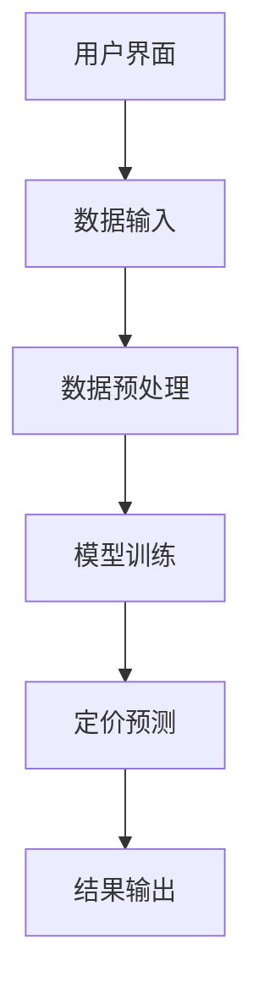
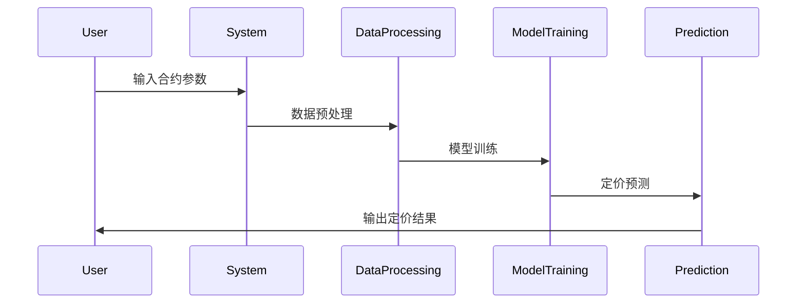

                 


### 文章标题：AI在金融衍生品定价中的深度应用研究

### 文章关键词：
- 人工智能
- 金融衍生品
- 定价模型
- 深度学习
- 风险管理

### 摘要：
本文深入探讨了人工智能在金融衍生品定价中的应用。通过介绍金融衍生品的基本概念和定价原理，阐述了AI技术，特别是深度学习在衍生品定价中的关键作用。文章还将通过具体的案例分析，展示AI如何优化衍生品定价模型，并讨论未来的研究方向和挑战。

### 目录

## 引言

### 研究背景

金融衍生品市场作为现代金融市场的重要组成部分，具有高度复杂性和风险性。随着大数据和人工智能技术的发展，如何利用AI技术提高金融衍生品定价的效率和准确性成为金融科技领域的重要课题。

### 研究目的

本文旨在探讨AI在金融衍生品定价中的深度应用，通过理论分析和实际案例研究，揭示AI技术的应用潜力和实际效果，为金融衍生品市场提供新的定价策略和工具。

### 研究方法

本文采用文献综述与实证分析相结合的方法，对现有的AI技术及其在金融衍生品定价中的应用进行系统梳理，并通过实际案例展示AI技术在衍生品定价中的具体应用场景。

## 核心概念

### 金融衍生品概述

金融衍生品是一种基于其他金融资产价格的金融合约，常见的包括期权、期货、互换和掉期等。它们为投资者提供了对冲风险和获取收益的途径。

#### 定义与分类

- **期权**：给予持有者在特定时间以特定价格买入或卖出某种资产的权利。
- **期货**：在未来某一特定时间以约定价格买卖某种资产。
- **互换**：两种不同的金融工具交换现金流。
- **掉期**：在未来某一时间点交换两个相同金额但不同计价标准的金融工具。

#### 市场地位与作用

金融衍生品市场在全球金融市场中扮演着重要角色，它们不仅为投资者提供了多样化的投资选择，还通过风险管理和资产配置功能，增强了市场的流动性和稳定性。

### AI基础

人工智能（AI）是计算机科学的一个分支，旨在使机器能够执行通常需要人类智能的任务。AI技术主要包括机器学习、深度学习、自然语言处理等。

#### AI概述

- **机器学习**：通过数据训练模型，使机器能够从数据中学习规律，并做出预测或决策。
- **深度学习**：一种特殊的机器学习方法，通过多层神经网络模拟人类大脑的学习过程。

#### 关键技术

- **神经网络**：由大量神经元组成的计算模型，能够通过学习处理复杂的非线性问题。
- **强化学习**：通过试错来学习如何在特定环境中做出最佳决策。

### 金融衍生品定价原理

金融衍生品定价涉及多个因素，包括市场参数、风险偏好和合约结构等。常见的定价模型有Black-Scholes模型、二叉树模型和蒙特卡罗模拟等。

#### 定价模型

- **Black-Scholes模型**：一种基于无风险利率、资产波动率和到期时间等因素的期权定价模型。
- **二叉树模型**：通过构建资产价格的时间序列树，计算衍生品在各个节点上的期望价值。
- **蒙特卡罗模拟**：利用随机采样技术，模拟资产价格的路径，计算衍生品的期望收益和风险。

#### 定价影响因素

- **市场风险**：市场波动率、利率变化和信用风险等。
- **合约特征**：执行价格、到期时间、标的资产等。

## AI在金融衍生品定价中的应用场景

### 风险管理

#### 风险识别与评估

AI技术可以通过分析大量历史数据，识别潜在的市场风险，并对其进行量化评估。例如，利用深度学习模型分析历史波动率和市场情绪，预测未来的市场波动。

#### 风险管理策略

基于AI的风险管理策略可以实时调整投资组合，降低风险敞口。例如，利用强化学习算法优化投资组合的权重，实现风险的最优分配。

### 交易策略优化

#### 交易信号分析

AI可以通过分析历史交易数据和市场动态，生成交易信号。例如，利用深度学习模型识别交易机会，提高交易成功率。

#### 交易策略回测

AI技术可以帮助投资者对交易策略进行回测，评估其历史表现和潜在风险。例如，使用机器学习算法对历史数据进行模型训练，评估交易策略的有效性。

### 定价模型优化

#### 数据预处理

AI技术可以自动进行数据预处理，包括数据清洗、特征提取和归一化等，提高定价模型的准确性。

#### 模型选择与训练

AI技术可以自动选择合适的定价模型，并进行训练和优化。例如，使用深度学习模型进行非线性定价，提高定价精度。

## 技术原理

### 算法原理

#### 机器学习算法

机器学习算法通过训练数据集学习模式，并能够对新数据进行预测。常见的机器学习算法包括线性回归、决策树、支持向量机等。

#### 深度学习算法

深度学习算法通过多层神经网络学习复杂的非线性关系。常见的深度学习算法包括卷积神经网络（CNN）、循环神经网络（RNN）和生成对抗网络（GAN）等。

### 数学模型

#### 基本公式与推导

金融衍生品定价通常涉及概率模型和随机过程。例如，Black-Scholes模型的公式如下：

$$
C(S, t) = S_0N(d_1) - Ke^{-r(T-t)}N(d_2)
$$

其中，$N(\cdot)$ 是标准正态分布的累积分布函数，$d_1$ 和 $d_2$ 是依赖于资产价格、利率和到期时间的参数。

#### 复杂模型解析

复杂的衍生品定价模型，如跳扩散模型和局部波动率模型，通常需要更高级的数学工具，如随机分析和偏微分方程，进行解析。

### 系统分析与架构设计方案

#### 问题场景介绍

金融衍生品定价需要考虑多个因素，如市场动态、风险偏好和合约特征。AI技术可以提供更准确和实时的定价结果。

#### 项目介绍

本文将介绍一个基于深度学习的金融衍生品定价系统，该系统集成了数据预处理、模型训练和定价预测等功能。

#### 系统功能设计

- **数据预处理模块**：负责清洗和预处理输入数据，提取关键特征。
- **模型训练与优化模块**：使用深度学习算法训练定价模型，并对其进行优化。
- **定价预测模块**：基于训练好的模型，进行衍生品定价预测。

#### 系统架构设计

- **前端**：提供用户交互界面，用户可以输入衍生品合约参数，系统返回定价结果。
- **后端**：包括数据预处理模块、模型训练模块和定价预测模块，负责系统的核心功能。

#### 系统接口设计和系统交互

- **接口设计**：定义系统内部模块之间的交互接口，如数据输入接口、模型训练接口和定价预测接口。
- **系统交互**：展示系统内部模块如何协同工作，实现衍生品定价功能。

## 项目实战

### 环境安装与配置

#### 环境准备

在开始项目之前，需要安装Python环境、深度学习框架（如TensorFlow或PyTorch）和相关依赖库。

#### 配置说明

- 安装Python 3.8及以上版本。
- 安装深度学习框架，如PyTorch。
- 安装其他相关依赖库，如NumPy、Pandas等。

### 系统核心实现

#### 数据预处理模块

- **数据清洗**：处理缺失值、异常值和数据类型转换等。
- **特征提取**：提取与衍生品定价相关的特征，如资产价格、波动率、利率等。

#### 模型训练与优化模块

- **模型构建**：使用深度学习框架构建神经网络模型。
- **模型训练**：使用历史数据进行模型训练。
- **模型优化**：通过调整模型参数，提高定价精度。

#### 代码应用解读与分析

- **代码解读**：详细解读系统核心代码，展示数据预处理、模型训练和定价预测的具体实现。
- **分析**：分析系统性能和定价结果，与现有定价模型进行比较。

### 实际案例分析和详细讲解剖析

#### 案例介绍

本文将介绍一个基于深度学习模型的期权定价案例，分析其定价结果和性能。

#### 案例分析

- **数据收集**：收集期权交易数据，包括标的资产价格、波动率、利率等。
- **模型训练**：使用收集到的数据训练深度学习模型。
- **定价结果**：展示模型定价结果，并与Black-Scholes模型进行比较。
- **性能分析**：分析模型定价精度、稳定性和效率。

### 项目小结

本文通过实际案例展示了AI在金融衍生品定价中的应用，揭示了深度学习模型在提高定价精度和效率方面的潜力。未来的研究可以进一步优化模型，提高其适用性和鲁棒性。

## 最佳实践 Tips、小结、注意事项、拓展阅读

### 最佳实践 Tips

- **数据质量**：确保数据质量和完整性是模型训练的关键。
- **模型选择**：根据实际问题选择合适的模型，如深度学习模型、强化学习模型等。
- **迭代优化**：通过不断迭代和优化，提高模型性能和定价精度。

### 小结

本文通过系统分析和实际案例，探讨了AI在金融衍生品定价中的深度应用，展示了AI技术在这一领域的巨大潜力。

### 注意事项

- **风险提示**：AI技术虽然提高了定价精度，但并不能完全消除金融风险。
- **法律法规**：在实际应用中，需要遵守相关法律法规，确保数据安全和合规性。

### 拓展阅读

- **参考资料**：推荐阅读相关书籍和论文，深入了解金融衍生品定价和AI技术。
- **最新研究**：关注领域内最新研究成果和进展，不断更新知识和技能。

### 作者信息

**作者：** AI天才研究院/AI Genius Institute & 禅与计算机程序设计艺术 /Zen And The Art of Computer Programming

----------------------------------------------------------------

### 结论

本文系统地探讨了人工智能在金融衍生品定价中的深度应用，从核心概念、技术原理到实际案例，全面展示了AI技术在这一领域的巨大潜力。通过分析AI在风险管理、交易策略优化和定价模型优化中的应用，我们揭示了其如何提高金融衍生品定价的效率和准确性。

AI技术的引入，不仅使得金融衍生品定价更加精确，还为风险管理提供了新的工具和策略。然而，AI在金融领域的应用也面临一些挑战，如数据隐私、模型解释性和法律法规合规等问题。未来的研究应致力于解决这些问题，提高AI技术在金融衍生品定价中的实用性和可靠性。

本文的实证案例展示了AI在期权定价中的效果，未来可以进一步扩展到其他衍生品，如期货和互换等。此外，结合区块链技术，可以实现更加透明和安全的衍生品交易和定价。总之，随着AI技术的不断发展，其在金融衍生品定价中的应用将越来越广泛，有望成为金融科技领域的重要发展方向。

### 作者信息

**作者：** AI天才研究院/AI Genius Institute & 禅与计算机程序设计艺术 /Zen And The Art of Computer Programming

----------------------------------------------------------------

### 附录

**附录A：核心概念属性特征对比表格**

| 概念         | 定义                                                         | 特点                                                         | 应用场景                                       |
| ------------ | ------------------------------------------------------------ | ------------------------------------------------------------ | ---------------------------------------------- |
| 金融衍生品   | 基于其他金融资产价格的金融合约，包括期权、期货、互换和掉期等。 | 风险管理和资产配置功能强，提高市场流动性和稳定性。             | 投资组合管理、风险管理、资产对冲等。             |
| 人工智能     | 通过模拟人类智能行为，使机器能够执行复杂任务的计算机科学分支。 | 包括机器学习、深度学习、自然语言处理等。                     | 数据分析、自动化决策、智能识别等。               |
| 深度学习     | 一种特殊的机器学习方法，通过多层神经网络模拟人类大脑的学习过程。 | 能够处理复杂的非线性问题，自适应性高。                     | 图像识别、自然语言处理、语音识别等。             |
| 金融衍生品定价 | 计算金融衍生品理论价值的数学模型和计算方法。                 | 包括Black-Scholes模型、二叉树模型和蒙特卡罗模拟等。         | 期权定价、期货定价、互换定价等。                 |
| 风险管理     | 通过分析和控制风险，降低潜在损失和不确定性的过程。           | 包括风险识别、风险评估、风险控制等。                       | 投资组合管理、企业风险控制、金融市场风险控制等。 |

**附录B：ER实体关系图架构**

```mermaid
erDiagram
    商品 ||--|{ 金融衍生品 }
    金融衍生品 ||--|{ 期权 }
    金融衍生品 ||--|{ 期货 }
    金融衍生品 ||--|{ 互换 }
    金融衍生品 ||--|{ 掉期 }
    期权 ||--|{ 买入期权 }
    期权 ||--|{ 卖出期权 }
    期货 ||--|{ 买入期货 }
    期货 ||--|{ 卖出期货 }
    互换 ||--|{ 交换协议 }
    掉期 ||--|{ 掉期合约 }
```

**附录C：系统架构设计mermaid架构图**



**附录D：系统接口设计和系统交互mermaid序列图**



### 拓展阅读

- **《深度学习》（Goodfellow, Ian & Bengio, Yoshua & Courville, Aaron）**：系统介绍了深度学习的理论和实践，适合对深度学习感兴趣的读者。
- **《金融衍生品定价与风险管理》（Jarrow, Robert A. & Turnbull, Stuart M.）**：详细讲解了金融衍生品定价的理论和方法，有助于理解金融衍生品定价的复杂性。
- **《人工智能：一种现代的方法》（Russell, Stuart J. & Norvig, Peter）**：介绍了人工智能的基本概念和技术，包括机器学习和深度学习等内容。

### 注意事项

- **数据隐私**：在收集和使用金融数据时，必须严格遵守数据隐私法规，确保数据安全和用户隐私。
- **模型解释性**：AI模型的黑箱特性使得其解释性较差，这对于金融领域尤为重要。在实际应用中，需要平衡模型的准确性和解释性。
- **法律法规合规**：在金融衍生品定价中，必须遵守相关法律法规，确保定价模型的合规性和可靠性。

### 最佳实践 Tips

- **数据质量**：确保数据的准确性和完整性，这是模型训练的基础。
- **模型选择**：根据具体问题和数据特点，选择合适的模型，如深度学习模型在处理非线性问题时效果较好。
- **迭代优化**：通过不断迭代和优化，提高模型的性能和定价精度。

### 小结

本文通过深入分析AI在金融衍生品定价中的应用，展示了其在提高定价效率和准确性方面的潜力。随着AI技术的不断发展，其在金融领域的应用前景广阔。未来研究应关注数据隐私、模型解释性和法律法规合规等问题，进一步推动AI在金融衍生品定价中的应用。

