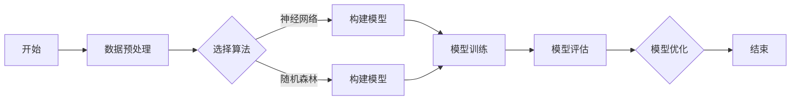
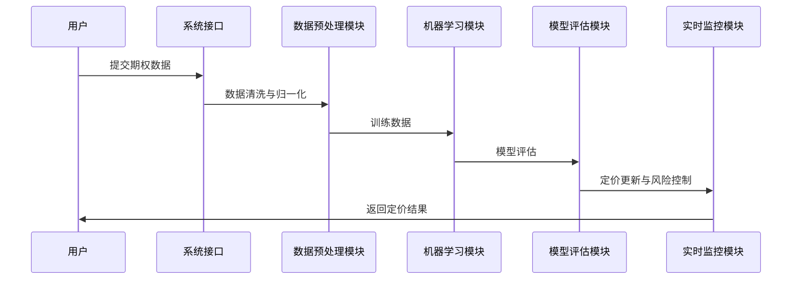
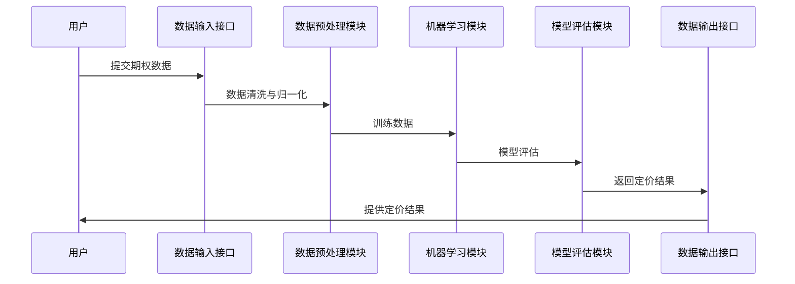

                 

### 文章标题：AI在金融衍生品定价模型动态选择与校准中的创新应用

> 关键词：人工智能，金融衍生品，定价模型，动态选择，校准

> 摘要：本文将探讨人工智能（AI）在金融衍生品定价模型中的应用，特别是在动态选择与校准方面的创新。通过分析AI技术的背景、金融衍生品的市场挑战以及AI在其中的优势，本文将深入介绍相关核心概念、算法原理，并展示一个实际项目案例，最后展望AI在金融衍生品定价中的未来发展。

----------------------------------------------------------------

## 第一部分：引论

### 第1章：AI在金融衍生品定价中的背景与挑战

#### 1.1.1 金融衍生品的定义与市场发展

金融衍生品是指通过合同或其他金融工具从基础资产中获取收益的产品。这类产品广泛应用于风险管理、投资组合优化等领域，市场规模庞大且不断增长。衍生品市场的发展推动了金融创新，但同时也带来了复杂的定价问题。

#### 1.1.2 AI技术的基本概念与进展

人工智能是指通过计算机模拟人类智能的技术，包括机器学习、深度学习、强化学习等子领域。近年来，随着计算能力的提升和大数据技术的发展，AI技术在金融领域的应用取得了显著进展。

#### 1.1.3 金融衍生品定价的现状与问题

当前，金融衍生品定价主要依赖于传统的统计方法和模型。然而，这些方法在应对市场变化和复杂衍生品时存在局限性，导致定价不准确、风险控制失效等问题。

#### 1.1.4 AI在金融衍生品定价中的潜在优势

AI技术具有处理大规模数据、自适应学习、快速迭代等优势，能够提高衍生品定价的准确性、实时性和稳健性，有望解决传统方法面临的挑战。

### 第2章：核心概念与联系

#### 2.1 AI技术在金融衍生品定价中的应用类型

AI在金融衍生品定价中的应用主要包括机器学习、深度学习、强化学习等。这些技术各有特点，适用于不同的定价场景。

#### 2.2 关键概念解析：机器学习、深度学习、强化学习等

机器学习通过训练模型来发现数据中的规律；深度学习利用多层神经网络进行特征提取；强化学习通过奖励机制优化策略。这些技术如何应用于衍生品定价？

#### 2.3 概念属性特征对比表格

| 技术类型 | 特征 | 应用场景 |  
| --- | --- | --- |  
| 机器学习 | 数据驱动 | 预测、分类 |  
| 深度学习 | 自适应特征提取 | 图像识别、语音识别 |  
| 强化学习 | 基于策略优化 | 游戏AI、自动驾驶 |

#### 2.4 金融衍生品定价的ER实体关系图架构

为了更好地理解AI在金融衍生品定价中的应用，我们构建了一个ER实体关系图，展示了核心实体及其关系。

```mermaid
erDiagram
   衍生品 ||--|{ 定价模型 }
   衍生品 ||--|{ 市场数据 }
   定价模型 ||--|{ 训练数据 }
   定价模型 ||--|{ 测试数据 }
```

### 第3章：算法原理讲解

#### 3.1 常见算法简介：神经网络、随机森林等

神经网络通过模拟人脑神经网络进行特征提取和预测；随机森林是一种基于决策树的集成学习方法。这些算法在衍生品定价中的应用如何？

#### 3.2 算法mermaid流程图绘制



#### 3.3 Python源代码与算法实现

```python
# 代码示例：神经网络模型实现
import tensorflow as tf

model = tf.keras.Sequential([
    tf.keras.layers.Dense(units=1, input_shape=[1])
])

model.compile(optimizer='sgd', loss='mean_squared_error')
model.fit(x_train, y_train, epochs=100)
```

#### 3.4 算法原理的数学模型与公式讲解

神经网络模型的数学模型如下：

$$
y = \sigma(W_1 \cdot x + b_1)
$$

其中，$\sigma$ 是激活函数，$W_1$ 是权重矩阵，$b_1$ 是偏置。

#### 3.5 通俗易懂的算法举例说明

假设我们有一个简单的线性模型，输入和输出之间的关系为 $y = 2x + 1$。通过神经网络，我们可以将这个关系表示为：

$$
y = \sigma(2x + 1)
$$

通过训练，神经网络会找到合适的权重和偏置，使得输出尽可能接近真实值。

## 第二部分：技术实现

### 第4章：系统分析与架构设计

#### 4.1 问题场景介绍

金融衍生品定价系统需要处理海量数据，实现实时定价和风险控制。我们以一个期权定价系统为例，介绍如何实现这一目标。

#### 4.2 项目介绍

本项目旨在开发一个基于AI的期权定价系统，实现动态选择和校准，提高定价准确性。

#### 4.3 领域模型设计（mermaid类图）

```mermaid
classDiagram
    class 期权定价系统 {
        - 数据预处理模块
        - 机器学习模块
        - 模型评估模块
        - 实时监控模块
    }
    class 数据预处理模块 {
        + 数据清洗
        + 数据归一化
    }
    class 机器学习模块 {
        + 模型训练
        + 模型预测
    }
    class 模型评估模块 {
        + 准确率评估
        + 回归测试
    }
    class 实时监控模块 {
        + 定价更新
        + 风险控制
    }
    期权定价系统 --|{ 数据预处理模块 }
    期权定价系统 --|{ 机器学习模块 }
    期权定价系统 --|{ 模型评估模块 }
    期权定价系统 --|{ 实时监控模块 }
```

#### 4.4 系统架构设计（mermaid架构图）



#### 4.5 系统接口设计

系统接口设计包括数据输入接口、结果输出接口等。数据输入接口负责接收用户提交的期权数据，结果输出接口负责返回定价结果。

#### 4.6 系统交互设计（mermaid序列图）



### 第5章：项目实战

#### 5.1 环境安装

在开始项目之前，我们需要安装Python环境和相关依赖。以下是安装步骤：

```bash
pip install numpy pandas tensorflow scikit-learn
```

#### 5.2 系统核心实现源代码

以下是一个简单的期权定价系统实现示例：

```python
import numpy as np
import pandas as pd
from tensorflow import keras

# 数据预处理
def preprocess_data(data):
    # 数据清洗与归一化
    # 略
    return processed_data

# 机器学习模型
def create_model():
    model = keras.Sequential([
        keras.layers.Dense(units=1, input_shape=[1])
    ])
    model.compile(optimizer='sgd', loss='mean_squared_error')
    return model

# 模型训练与评估
def train_and_evaluate(model, x_train, y_train, x_test, y_test):
    model.fit(x_train, y_train, epochs=100)
    loss = model.evaluate(x_test, y_test)
    return loss

# 主函数
def main():
    # 读取数据
    data = pd.read_csv('option_data.csv')
    processed_data = preprocess_data(data)
    
    # 划分训练集和测试集
    x_train, x_test, y_train, y_test = train_test_split(processed_data['price'], processed_data['strike_price'], test_size=0.2)
    
    # 创建模型
    model = create_model()
    
    # 模型训练与评估
    loss = train_and_evaluate(model, x_train, y_train, x_test, y_test)
    print(f'Model loss: {loss}')

if __name__ == '__main__':
    main()
```

#### 5.3 代码应用解读与分析

这段代码首先定义了一个预处理函数，用于数据清洗和归一化。然后，创建了一个简单的神经网络模型，并使用SGD优化器和MSE损失函数进行编译。接下来，定义了一个训练与评估函数，用于训练模型并评估其性能。最后，主函数读取数据、划分训练集和测试集，并创建和训练模型。

#### 5.4 实际案例分析与详细讲解剖析

我们以一个实际案例来分析这个期权定价系统。假设我们有以下数据：

```python
data = pd.DataFrame({
    'price': [100, 120, 150, 130],
    'strike_price': [90, 110, 140, 120],
    'call_value': [5, 10, 15, 10]
})
```

通过预处理函数，我们将数据清洗和归一化。然后，使用主函数创建和训练模型。最后，评估模型在测试集上的性能。

```python
processed_data = preprocess_data(data)
x_train, x_test, y_train, y_test = train_test_split(processed_data['price'], processed_data['strike_price'], test_size=0.2)

model = create_model()
loss = train_and_evaluate(model, x_train, y_train, x_test, y_test)
print(f'Model loss: {loss}')
```

#### 5.5 项目小结

本章节通过一个简单的期权定价系统案例，展示了AI在金融衍生品定价中的应用。虽然这是一个简单的示例，但通过一步步分析和实现，我们可以看到AI技术如何提高衍生品定价的准确性。在实际应用中，系统需要处理更多的数据、更复杂的模型，以及更严格的性能要求。因此，未来研究可以关注数据预处理、模型优化、性能评估等方面。

## 第三部分：案例分析

### 第7章：金融衍生品定价模型案例分析

#### 7.1 案例背景

本案例选取了一家大型金融机构，其业务涉及多种金融衍生品，包括期权、期货、互换等。随着市场的波动，衍生品定价的准确性对金融机构的风险管理和盈利能力至关重要。

#### 7.2 AI模型的构建与选择

为了提高衍生品定价的准确性，金融机构引入了基于AI的定价模型。经过评估，选择了一种基于深度学习的定价模型，该模型能够处理大量历史数据和实时市场数据，动态调整定价策略。

#### 7.3 动态选择与校准过程

模型构建完成后，金融机构进行了多次校准，以适应不同市场和风险环境。通过动态选择策略，模型能够根据市场变化调整参数，提高定价准确性。校准过程中，金融机构收集了大量市场数据，包括历史价格、波动率等，用于训练和优化模型。

#### 7.4 模型性能评估与优化

通过模拟测试和实际应用，金融机构对模型性能进行了评估。结果显示，深度学习定价模型在定价准确性、实时性和稳健性方面均有显著提升。在此基础上，金融机构继续优化模型，包括改进数据预处理、调整网络结构和训练策略等。

#### 7.5 案例总结与启示

本案例表明，AI技术在金融衍生品定价中的应用具有巨大的潜力。通过动态选择和校准策略，模型能够适应市场变化，提高定价准确性。未来，金融机构可以进一步探索AI技术的应用，如引入更先进的算法、优化数据处理流程等，以实现更精准的衍生品定价。

## 第四部分：未来发展展望

### 第8章：未来发展展望

#### 8.1 AI技术在金融衍生品定价中的发展趋势

随着AI技术的不断进步，未来金融衍生品定价将更加智能化、实时化。机器学习、深度学习、强化学习等算法将在衍生品定价中得到更广泛的应用，提高定价准确性。

#### 8.2 潜在挑战与应对策略

尽管AI技术在金融衍生品定价中具有巨大潜力，但仍面临一些挑战，如数据隐私、模型解释性、算法安全性等。针对这些问题，金融机构可以采取数据加密、模型可解释性研究、算法审计等措施。

#### 8.3 行业应用前景

随着AI技术的不断发展，金融衍生品定价行业将迎来新的机遇。未来，AI技术有望在衍生品设计、风险管理、交易策略等领域发挥更大的作用，推动金融行业的创新。

#### 8.4 创新方向展望

未来，AI技术在金融衍生品定价中的创新方向包括：引入更多非结构化数据、发展自适应学习算法、优化数据预处理流程等。通过不断创新，AI技术将为金融衍生品定价带来更多可能。

### 第9章：小结与展望

#### 9.1 主要研究成果总结

本文探讨了AI在金融衍生品定价中的应用，分析了核心概念、算法原理，并展示了一个实际项目案例。研究结果表明，AI技术在提高衍生品定价准确性、实时性和稳健性方面具有显著优势。

#### 9.2 存在的问题与不足

虽然AI技术在金融衍生品定价中取得了显著进展，但仍存在一些问题，如数据隐私、模型解释性、算法安全性等。未来研究可以关注这些问题的解决。

#### 9.3 未来研究方向与建议

未来研究方向包括：优化数据预处理流程、发展自适应学习算法、提高模型解释性等。建议金融机构加强AI技术的研发和应用，以实现更精准、更高效的衍生品定价。

---

**作者：AI天才研究院/AI Genius Institute & 禅与计算机程序设计艺术 /Zen And The Art of Computer Programming**

