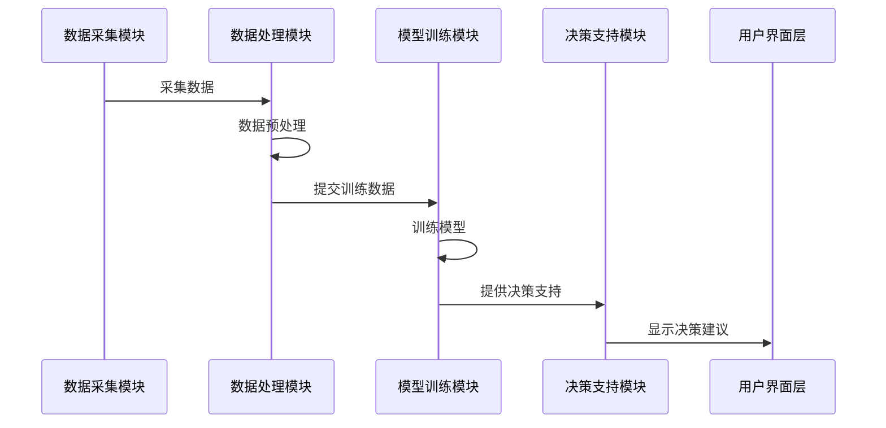

                 


## 文章标题

### 关键词
- AI增强型公司治理
- 效能评估工具
- 人工智能应用
- 数据分析
- 企业管理

### 摘要
本文将探讨AI增强型公司治理效能评估工具的开发与应用。通过分析AI在公司治理中的重要性，本文将阐述评估工具的核心概念、工作原理和效能评估方法，并结合实际案例进行深入分析，总结最佳实践，为企业管理者提供有益的参考。

----------------------------------------------------------------

## 目录大纲设计思路

### 第一部分：背景介绍
1. **AI与公司治理的关系**：
   - AI技术的快速发展及其在公司治理中的应用。
   - AI在公司治理中的潜在影响。

2. **公司治理效能评估的重要性**：
   - 传统的公司治理评估方法的局限性。
   - AI增强型公司治理效能评估工具的优势。

### 第二部分：核心概念与联系
1. **AI增强型公司治理的概念**：
   - 定义与内涵。
   - 关键要素与核心原则。

2. **核心概念属性特征对比表格**：
   - 对比分析AI与公司治理的深度融合。

3. **ER实体关系图架构**：
   - 构建AI增强型公司治理的实体关系图。

### 第三部分：工具原理与应用
1. **评估工具的工作原理**：
   - 数据采集与预处理。
   - 特征提取与建模。
   - 模型训练与评估。

2. **评估工具的功能模块**：
   - 风险监控。
   - 合规性检查。
   - 决策支持。

3. **评估工具的应用场景**：
   - 上市公司。
   - 风险投资。
   - 其他企业类型。

### 第四部分：效能评估方法
1. **效能评估方法概述**：
   - 评估流程。
   - 评估指标体系。

2. **数据采集与预处理**：
   - 数据来源。
   - 数据质量评估。
   - 数据预处理方法。

3. **特征提取与建模**：
   - 特征选择。
   - 建模方法。
   - 模型性能评估。

### 第五部分：案例分析
1. **案例一：上市公司风险监控**：
   - 案例背景。
   - 工具应用。
   - 效果评估。

2. **案例二：风险投资合规性检查**：
   - 案例背景。
   - 工具应用。
   - 效果评估。

### 第六部分：最佳实践与总结
1. **最佳实践**：
   - 实践经验。
   - 注意事项。

2. **小结与展望**：
   - 小结。
   - 未来展望。
   - 拓展阅读。

### 目录大纲设计思路详述

#### 第一部分：背景介绍
**AI与公司治理的关系**：

随着人工智能技术的迅猛发展，其应用范围不断扩大，从传统的制造业、金融业到现代的企业管理，AI正逐步渗透到各个领域。在公司治理中，AI不仅能够提升企业的运营效率，还能帮助企业更好地应对风险和挑战。例如，通过大数据分析和机器学习，企业可以更准确地预测市场趋势，优化决策过程。

**公司治理效能评估的重要性**：

传统的公司治理评估方法通常依赖于人工分析，存在一定的局限性。例如，评估过程可能受到人为因素的影响，评估结果可能不够客观和准确。而AI增强型公司治理效能评估工具能够通过自动化分析，提供更加精准、全面的评估结果，帮助企业更有效地管理风险和提升治理效能。

#### 第二部分：核心概念与联系
**AI增强型公司治理的概念**：

AI增强型公司治理是指利用人工智能技术，对公司的治理过程进行优化和提升。其核心要素包括数据采集与分析、模型训练与预测、决策支持与优化等。通过这些要素的协同作用，AI增强型公司治理能够为企业提供更加智能、高效的治理方案。

**核心概念属性特征对比表格**：

为了更好地理解AI增强型公司治理的概念，我们可以通过一个属性特征对比表格，对比传统公司治理和AI增强型公司治理的差异。这个表格将涵盖评估准确性、效率、成本等多个方面。

| 特征对比       | 传统公司治理 | AI增强型公司治理 |
|----------------|--------------|------------------|
| 评估准确性     | 人为判断     | 自动化分析       |
| 效率           | 低           | 高               |
| 成本           | 较高         | 较低             |
| 决策过程       | 繁琐         | 简化             |

**ER实体关系图架构**：

ER实体关系图是数据库设计中的重要工具，它能够清晰地展示实体之间的关系。在AI增强型公司治理中，我们可以通过ER实体关系图来构建一个完整的治理框架，包括数据采集、数据分析、决策支持等模块。

#### 第三部分：工具原理与应用
**评估工具的工作原理**：

AI增强型公司治理效能评估工具的工作原理可以概括为以下几个步骤：

1. **数据采集与预处理**：从各种数据源收集数据，并进行清洗、去噪等预处理操作，以确保数据质量。
2. **特征提取与建模**：从预处理后的数据中提取关键特征，并利用机器学习算法构建预测模型。
3. **模型训练与评估**：使用历史数据对模型进行训练，并通过交叉验证等方法评估模型性能。
4. **决策支持与优化**：根据模型预测结果，提供决策支持，帮助企业优化治理策略。

**评估工具的功能模块**：

AI增强型公司治理效能评估工具通常包含多个功能模块，如风险监控、合规性检查、决策支持等。这些模块各司其职，协同工作，共同提升企业的治理效能。

**评估工具的应用场景**：

AI增强型公司治理效能评估工具可以应用于多种场景，如上市公司、风险投资、中小企业等。不同的应用场景需要针对具体需求进行调整和优化，以实现最佳效果。

#### 第四部分：效能评估方法
**效能评估方法概述**：

效能评估方法是指评估AI增强型公司治理工具效果的步骤和指标体系。一个完整的效能评估方法应包括数据采集、预处理、特征提取、建模、评估等多个环节，并设立相应的评估指标，如准确率、召回率、F1值等。

**数据采集与预处理**：

数据采集与预处理是效能评估的基础。通过有效的数据采集和预处理，可以确保数据的质量和一致性，从而提高评估结果的可靠性。

**特征提取与建模**：

特征提取与建模是效能评估的核心。通过提取关键特征和构建预测模型，可以实现对治理效能的精准评估。

**特征选择**：

特征选择是指从大量特征中筛选出对评估结果有显著影响的关键特征。有效的特征选择可以提高模型的性能和泛化能力。

**建模方法**：

建模方法是指利用机器学习算法构建预测模型的方法。常见的建模方法包括线性回归、决策树、随机森林等。

**模型性能评估**：

模型性能评估是指通过交叉验证、混淆矩阵、ROC曲线等指标，评估模型的性能和稳定性。

#### 第五部分：案例分析
**案例一：上市公司风险监控**：

通过一个实际案例，展示AI增强型公司治理效能评估工具在上市公司风险监控中的应用效果。案例将详细描述应用过程、效果评估和结论。

**案例二：风险投资合规性检查**：

通过另一个实际案例，展示AI增强型公司治理效能评估工具在风险投资合规性检查中的应用效果。案例将详细描述应用过程、效果评估和结论。

#### 第六部分：最佳实践与总结
**最佳实践**：

在案例分析的基础上，总结最佳实践，包括数据采集、预处理、特征提取、建模等环节的具体操作方法和注意事项。

**小结与展望**：

对全文进行总结，强调AI增强型公司治理效能评估工具的重要性，并提出未来发展的方向和展望。

**拓展阅读**：

推荐相关文献和资料，供读者进一步学习和研究。

### 目录大纲设计思路总结

通过以上设计思路的详细阐述，我们明确了《AI增强型公司治理效能评估工具》的核心内容、结构和关键点。接下来，我们将根据这一大纲，逐步撰写每一章节的内容，确保文章的逻辑清晰、内容丰富、结构紧凑，为读者提供一次有深度、有思考、有见解的阅读体验。

----------------------------------------------------------------

## 背景介绍

### AI与公司治理的关系

人工智能（AI）作为一种新兴技术，正在全球范围内迅速发展，并逐渐渗透到各行各业。在公司治理领域，AI的应用正在引发一场革命。传统的公司治理依赖于人工判断和经验，而AI能够通过数据分析和智能算法，提供更加精准和客观的治理方案。AI在公司治理中的应用不仅能够提高治理效能，还能为企业带来诸多潜在价值。

首先，AI技术在企业运营中可以提供实时监控和预警功能。例如，通过大数据分析和机器学习算法，企业可以实时监测市场动态、财务状况、供应链风险等，从而提前预测潜在问题，及时采取应对措施。这种实时监控和预警能力有助于企业快速响应市场变化，降低运营风险。

其次，AI技术可以优化决策过程。通过分析大量的历史数据和实时信息，AI可以为企业提供基于数据的决策支持，帮助企业制定更加科学和合理的战略。例如，在投资决策中，AI可以通过分析市场趋势、竞争对手情况、公司财务状况等多方面因素，提供投资建议，帮助企业做出更加明智的决策。

此外，AI技术还能提高企业合规性管理水平。在金融、医疗等高监管行业，合规性管理至关重要。AI可以通过自动化分析企业运营数据，检查合规性，发现潜在违规行为，从而帮助企业避免法律风险和损失。例如，金融行业的反洗钱（AML）监控、医疗行业的患者数据隐私保护，都是AI技术可以发挥重要作用的应用场景。

### 公司治理效能评估的重要性

公司治理效能评估是企业管理中的一项关键任务。通过评估公司治理效能，企业可以了解自身治理结构的优势和不足，从而进行优化和改进。然而，传统的公司治理评估方法往往存在一些局限性。

首先，传统的评估方法通常依赖于人工分析，评估过程繁琐且耗时。由于评估人员的主观判断可能影响评估结果，导致评估过程不够客观和准确。例如，在评估公司风险水平时，评估人员可能会因为个人经验不同而得出不同的结论，从而影响决策的准确性。

其次，传统的评估方法往往缺乏系统性和全面性。评估指标体系可能不够完善，导致评估结果不够全面。例如，仅关注财务指标而忽视非财务指标，可能导致评估结果失真。

最后，传统的评估方法往往无法应对快速变化的市场环境。在当今全球经济一体化的背景下，企业面临的市场环境瞬息万变。传统的评估方法可能无法及时捕捉市场变化，从而影响企业决策的及时性和有效性。

因此，随着AI技术的不断发展，AI增强型公司治理效能评估工具应运而生。这种工具能够通过自动化分析，提供更加精准、全面的评估结果，帮助企业更有效地管理风险和提升治理效能。

### 现有评估方法的局限性

尽管传统的公司治理效能评估方法在一定程度上能够满足企业的需求，但其在实际应用中仍然存在诸多局限性。以下是一些主要问题：

首先，传统评估方法往往依赖于人工分析，评估过程繁琐且耗时。企业需要投入大量的人力、物力和时间来收集和分析数据，导致评估效率低下。此外，由于评估人员的主观判断可能影响评估结果，导致评估过程不够客观和准确。

其次，传统评估方法通常缺乏系统性和全面性。评估指标体系可能不够完善，导致评估结果不够全面。例如，仅关注财务指标而忽视非财务指标，可能导致评估结果失真。此外，传统评估方法往往无法全面捕捉和反映企业的运营状况和风险水平。

再次，传统评估方法往往无法应对快速变化的市场环境。在当今全球经济一体化的背景下，企业面临的市场环境瞬息万变。传统的评估方法可能无法及时捕捉市场变化，从而影响企业决策的及时性和有效性。

最后，传统评估方法在数据分析和处理方面存在一定局限性。例如，对于复杂的数据分析和预测，传统方法可能无法提供有效的解决方案，从而限制了评估的深度和广度。

综上所述，现有评估方法在许多方面都存在局限性，无法满足现代企业对高效、精准和全面治理效能评估的需求。因此，开发和应用AI增强型公司治理效能评估工具具有重要的现实意义。

----------------------------------------------------------------

## 核心概念与联系

### AI增强型公司治理的概念

AI增强型公司治理是指利用人工智能技术，对公司的治理过程进行优化和提升。这一概念的核心在于将AI技术应用于公司治理的各个环节，包括数据采集、数据分析、决策支持、合规性检查等。通过AI技术的引入，公司治理不再仅依赖于人工判断和经验，而是通过智能分析和算法模型，实现更加精准、高效和全面的治理。

AI增强型公司治理的关键要素包括：

1. **数据采集与处理**：AI技术能够高效地采集和处理海量数据，从多个维度获取企业的运营信息。这些数据包括财务数据、市场数据、供应链数据等，为后续的分析和决策提供基础。

2. **数据分析与预测**：通过机器学习算法，AI可以对数据进行深入分析，识别潜在的趋势和模式。例如，通过分析历史财务数据，AI可以预测未来的财务状况；通过分析市场数据，AI可以预测市场趋势和竞争对手的行为。

3. **决策支持与优化**：基于数据分析的结果，AI可以为企业提供决策支持，优化治理策略。例如，在投资决策中，AI可以根据市场趋势和财务状况，提供投资建议；在风险管理中，AI可以识别潜在风险，并提供应对策略。

4. **合规性检查**：在金融、医疗等行业，合规性管理至关重要。AI技术可以通过自动化分析，检查企业的运营是否符合相关法规和标准，从而降低违规风险。

5. **风险评估与预警**：AI可以通过分析企业的运营数据，识别潜在风险，并提供预警。这种预警机制可以帮助企业提前采取措施，防止风险扩大。

### 关键要素与核心原则

AI增强型公司治理的关键要素和核心原则如下：

1. **数据驱动**：数据是AI增强型公司治理的基础。企业需要建立完善的数据采集和处理系统，确保数据的准确性和完整性。

2. **智能分析**：利用机器学习算法和深度学习模型，对数据进行深入分析，识别潜在的规律和趋势。

3. **决策支持**：通过智能分析结果，为企业提供决策支持，优化治理策略。

4. **合规性管理**：建立自动化合规性检查系统，确保企业运营符合相关法规和标准。

5. **风险评估**：通过实时监控和数据分析，识别潜在风险，并提供预警。

6. **持续优化**：根据实际应用效果，不断优化AI模型和治理策略，提高治理效能。

### 核心概念属性特征对比表格

为了更好地理解AI增强型公司治理与传统公司治理的差异，我们可以通过一个属性特征对比表格进行详细分析。

| 特征对比       | 传统公司治理 | AI增强型公司治理 |
|----------------|--------------|------------------|
| 数据处理方式   | 人工分析     | 自动化处理       |
| 评估准确性     | 人为判断     | 智能算法         |
| 评估效率       | 低           | 高               |
| 成本           | 较高         | 较低             |
| 决策过程       | 繁琐         | 简化             |
| 风险管理       | 有限          | 全面             |
| 合规性管理     | 人工检查     | 自动化检查       |
| 应对市场变化   | 缓慢         | 快速             |

### ER实体关系图架构

在AI增强型公司治理中，ER实体关系图是一种重要的工具，用于描述各实体之间的关系。以下是一个简化的ER实体关系图，展示了AI增强型公司治理中的主要实体及其关系。

```mermaid
erDiagram
  Company ||--|{ Data}: "Data collected and processed"
  Company ||--|{ Analysis}: "Data analysis and prediction"
  Company ||--|{ Decision}: "Decision support and optimization"
  Company ||--|{ Compliance}: "Compliance management"
  Company ||--|{ Risk}: "Risk assessment and warning"
  Data ||--|{ Source}: "Data sources"
  Analysis ||--|{ Model}: "Machine learning models"
  Decision ||--|{ Strategy}: "Optimized governance strategies"
  Compliance ||--|{ Rule}: "Compliance rules and standards"
  Risk ||--|{ Warning}: "Risk warnings and alerts"
```

在这个ER实体关系图中，公司作为中心实体，与其他实体之间存在多种关系。数据实体与公司之间存在数据的采集和处理关系；分析实体与公司之间存在数据分析和预测关系；决策实体与公司之间存在决策支持和优化关系；合规性实体与公司之间存在合规性管理关系；风险实体与公司之间存在风险评估和预警关系。

通过ER实体关系图，企业可以清晰地了解AI增强型公司治理的架构，以及各实体之间的相互作用和依赖关系。这有助于企业更好地设计和实施AI增强型公司治理策略，提高治理效能。

----------------------------------------------------------------

## 工具原理与应用

### 评估工具的工作原理

AI增强型公司治理效能评估工具的工作原理可以概括为以下几个主要步骤：

1. **数据采集与预处理**：
   - **数据采集**：首先，评估工具需要从各种数据源（如企业内部数据库、外部市场数据、财务报表等）收集所需的数据。数据源可以是结构化的数据库，也可以是非结构化的文本、图像、音频等。
   - **数据预处理**：收集到的数据通常需要进行预处理，包括数据清洗、去噪、格式转换等操作。数据清洗的目的是去除重复数据、填补缺失值、修正错误数据等，以确保数据的质量和一致性。

2. **特征提取与建模**：
   - **特征提取**：在预处理后的数据基础上，评估工具需要提取关键特征。特征提取的目的是将原始数据转换为可用于建模的数值特征，以便后续的机器学习算法能够更好地处理和分析数据。
   - **建模**：利用机器学习算法，评估工具构建预测模型。常见的建模方法包括线性回归、决策树、随机森林、支持向量机等。通过训练模型，工具可以学习到数据中的规律和模式，从而为企业的决策提供支持。

3. **模型训练与评估**：
   - **模型训练**：使用历史数据对模型进行训练，模型会根据数据调整内部参数，以便更好地预测未来的情况。
   - **模型评估**：通过交叉验证等方法对模型进行评估，确保模型的性能和稳定性。常用的评估指标包括准确率、召回率、F1值、均方误差等。

4. **决策支持与优化**：
   - **决策支持**：基于模型预测结果，评估工具可以为企业提供实时的决策支持。例如，在风险管理方面，工具可以识别潜在风险并提供预警；在投资决策方面，工具可以根据市场趋势提供投资建议。
   - **优化**：通过不断的模型训练和评估，评估工具可以不断优化预测模型，提高决策的准确性。

### 评估工具的功能模块

AI增强型公司治理效能评估工具通常包含多个功能模块，各模块协同工作，共同提升企业的治理效能。以下是一些常见的功能模块及其主要功能：

1. **风险监控模块**：
   - **功能**：实时监控企业运营中的各种风险，包括市场风险、财务风险、运营风险等。
   - **应用**：通过数据分析，工具可以识别潜在风险，并提供预警，帮助企业及时采取应对措施。

2. **合规性检查模块**：
   - **功能**：自动化检查企业的运营数据是否符合相关法规和标准，确保合规性。
   - **应用**：在金融、医疗等行业，合规性管理至关重要。工具可以帮助企业识别潜在的违规行为，降低法律风险。

3. **决策支持模块**：
   - **功能**：基于数据分析，为企业的决策提供支持，优化决策过程。
   - **应用**：在投资决策、资源配置、市场策略等方面，工具可以提供基于数据的建议，帮助企业做出更加明智的决策。

4. **绩效评估模块**：
   - **功能**：评估企业各部门的绩效，提供改进建议。
   - **应用**：通过数据分析，工具可以评估企业各部门的运营效率，帮助企业识别问题并进行优化。

### 评估工具的应用场景

AI增强型公司治理效能评估工具可以应用于多种场景，满足不同企业的需求。以下是一些主要的应用场景：

1. **上市公司**：
   - **应用**：上市公司通常需要面对更多的监管要求和市场压力。AI增强型评估工具可以帮助上市公司实时监控风险、确保合规性，并提供决策支持。

2. **风险投资**：
   - **应用**：风险投资机构需要对被投资企业进行全面的评估和管理。AI增强型评估工具可以帮助风险投资机构快速获取企业数据，进行风险评估和投资决策。

3. **中小企业**：
   - **应用**：中小企业在资源和人才方面可能相对有限。AI增强型评估工具可以帮助中小企业提高运营效率，降低风险，优化决策。

4. **其他企业类型**：
   - **应用**：除了上述场景，AI增强型评估工具还可以应用于各种类型的企业，如制造业、服务业等。通过智能化分析和决策支持，企业可以更好地应对市场变化，实现可持续发展。

### 总结

AI增强型公司治理效能评估工具通过数据采集与预处理、特征提取与建模、模型训练与评估等多个环节，为企业提供全面的决策支持和管理优化。其功能模块丰富，应用场景广泛，可以满足不同类型企业的需求。随着AI技术的不断发展，这种工具将在公司治理中发挥越来越重要的作用，为企业创造更多价值。

----------------------------------------------------------------

## 效能评估方法

### 效能评估方法概述

效能评估方法是评估AI增强型公司治理效能评估工具效果的核心环节。一个完整的效能评估方法应包括评估流程、评估指标体系、数据采集与预处理、特征提取与建模、模型训练与评估等多个环节，确保评估过程的科学性和评估结果的可靠性。

#### 评估流程

1. **需求分析**：明确企业对AI增强型公司治理效能评估工具的需求，确定评估的目标和范围。

2. **数据采集**：从企业内外部数据源（如企业数据库、市场数据、财务报表等）收集所需数据。

3. **数据预处理**：对采集到的数据进行清洗、去噪、格式转换等预处理操作，确保数据质量。

4. **特征提取**：从预处理后的数据中提取关键特征，为后续建模提供数据基础。

5. **模型构建**：选择合适的机器学习算法，构建预测模型。

6. **模型训练**：使用历史数据进行模型训练，调整模型参数，提高模型性能。

7. **模型评估**：通过交叉验证等方法评估模型性能，确保模型稳定可靠。

8. **结果反馈**：根据评估结果，为企业提供决策支持，优化治理策略。

9. **持续优化**：根据实际应用效果，不断调整和优化模型和评估方法。

#### 评估指标体系

评估指标体系是效能评估方法的重要组成部分，用于衡量AI增强型公司治理效能评估工具的性能和效果。常见的评估指标包括：

1. **准确率（Accuracy）**：模型预测正确的样本数占总样本数的比例。

2. **召回率（Recall）**：模型预测正确的正样本数占总正样本数的比例。

3. **精确率（Precision）**：模型预测正确的正样本数占总预测为正样本数的比例。

4. **F1值（F1 Score）**：精确率和召回率的调和平均数。

5. **均方误差（Mean Squared Error, MSE）**：预测值与真实值之间的平均平方误差。

6. **均绝对误差（Mean Absolute Error, MAE）**：预测值与真实值之间的平均绝对误差。

7. **ROC曲线（Receiver Operating Characteristic Curve）**：评估模型分类性能的曲线。

8. **AUC（Area Under Curve）**：ROC曲线下方的面积，用于衡量模型的分类能力。

通过这些指标，企业可以全面了解AI增强型公司治理效能评估工具的性能，并根据评估结果进行优化和改进。

#### 数据采集与预处理

数据采集与预处理是效能评估方法的基础。以下是数据采集与预处理的关键步骤：

1. **数据来源**：
   - **内部数据**：包括企业运营数据、财务数据、员工数据等。
   - **外部数据**：包括市场数据、行业数据、竞争对手数据等。

2. **数据质量评估**：
   - **完整性**：确保数据完整无缺失。
   - **准确性**：评估数据的真实性和准确性。
   - **一致性**：确保数据在不同时间和不同来源之间的一致性。

3. **数据预处理方法**：
   - **清洗**：去除重复数据、错误数据和异常值。
   - **去噪**：降低噪声数据对评估结果的影响。
   - **归一化**：将不同量纲的数据转换到同一尺度，以便进行比较和分析。
   - **缺失值处理**：填补缺失值或删除包含缺失值的样本。

#### 特征提取与建模

特征提取与建模是评估工具的核心环节。以下是特征提取与建模的关键步骤：

1. **特征选择**：
   - **相关性分析**：选择与评估目标高度相关的特征。
   - **特征重要性评估**：使用模型评估结果，选择对模型预测有重要影响的特征。

2. **特征工程**：
   - **特征组合**：创建新的特征组合，提高模型的预测能力。
   - **特征转换**：将原始特征转换为更适合模型处理的特征。

3. **建模方法**：
   - **选择模型**：根据评估目标选择合适的机器学习算法。
   - **参数调优**：调整模型参数，优化模型性能。

4. **模型评估**：
   - **交叉验证**：通过交叉验证评估模型性能。
   - **混淆矩阵**：分析模型预测结果，评估模型的准确性和泛化能力。

#### 特征提取与建模案例分析

以下是一个简单的特征提取与建模案例分析：

**案例背景**：某上市公司希望利用AI增强型公司治理效能评估工具评估其财务风险。

**数据采集**：从企业内部数据库中收集了过去五年的财务数据，包括收入、利润、现金流、负债等指标。

**数据预处理**：
   - **清洗**：去除重复数据和异常值。
   - **去噪**：降低噪声数据的影响。
   - **归一化**：将不同量纲的财务数据转换为同一尺度。

**特征提取**：
   - **相关性分析**：选择与财务风险高度相关的特征，如利润率、负债率、现金流状况等。
   - **特征工程**：创建新的特征组合，如利润率变化率、负债率变化率等。

**建模方法**：
   - **选择模型**：使用随机森林算法进行建模。
   - **参数调优**：调整随机森林的参数，如树的数量、树的深度等，优化模型性能。

**模型评估**：
   - **交叉验证**：通过交叉验证评估模型性能，得到准确率、召回率、F1值等指标。
   - **混淆矩阵**：分析模型预测结果，评估模型的准确性和泛化能力。

通过这个案例分析，我们可以看到特征提取与建模的过程是如何进行的，以及如何通过评估指标来评估模型性能。

#### 特征选择与建模方法

特征选择和建模方法在AI增强型公司治理效能评估中至关重要。以下是几种常用的特征选择和建模方法：

1. **特征选择方法**：
   - **信息增益**：选择对目标变量有最大信息贡献的特征。
   - **卡方检验**：选择与目标变量有显著关联的特征。
   - **L1正则化**：通过惩罚特征系数的绝对值来选择特征。

2. **建模方法**：
   - **线性回归**：通过线性关系预测目标变量。
   - **决策树**：通过树形结构进行分类和回归。
   - **随机森林**：通过集成多棵决策树提高模型性能。
   - **支持向量机**：通过构建超平面进行分类和回归。
   - **神经网络**：通过多层神经网络进行复杂的非线性预测。

#### 模型性能评估

模型性能评估是确保AI增强型公司治理效能评估工具有效性的关键环节。以下是几种常用的模型性能评估方法：

1. **交叉验证**：通过将数据集划分为多个子集，轮流作为测试集和训练集，评估模型在不同子集上的性能。

2. **混淆矩阵**：分析模型预测结果，评估模型的准确性和泛化能力。

3. **ROC曲线与AUC**：评估模型分类性能，AUC值越大，模型性能越好。

4. **误差分析**：分析模型预测误差，评估模型在各个类别的表现。

通过以上评估方法，企业可以全面了解AI增强型公司治理效能评估工具的性能，并根据评估结果进行优化和改进。

### 总结

效能评估方法是AI增强型公司治理效能评估工具的核心环节，通过评估工具的工作原理、功能模块、评估流程、评估指标体系等，企业可以全面了解评估工具的性能和效果，从而优化治理策略，提高企业治理效能。

----------------------------------------------------------------

## 案例分析

### 案例一：上市公司风险监控

**案例背景**：某知名上市公司，面对激烈的市场竞争和复杂的市场环境，希望利用AI增强型公司治理效能评估工具对风险进行实时监控和预警，以确保公司运营的安全和稳定。

**工具应用**：

1. **数据采集**：评估工具从公司的内部数据库、外部市场数据源等渠道收集了丰富的数据，包括财务数据、市场数据、竞争对手数据等。

2. **数据预处理**：对采集到的数据进行清洗、去噪和归一化处理，确保数据的质量和一致性。

3. **特征提取与建模**：评估工具提取了与风险相关的关键特征，如财务指标、市场指标等，并利用机器学习算法（如随机森林）构建了预测模型。

4. **模型训练与评估**：使用历史数据对预测模型进行训练和评估，通过交叉验证等方法确保模型的性能和稳定性。

5. **风险预警**：基于预测模型，评估工具能够实时监控公司的运营状况，识别潜在风险，并提供预警。例如，当财务指标出现异常波动时，工具会发出风险预警，提示管理层关注。

**效果评估**：

通过AI增强型公司治理效能评估工具的应用，上市公司实现了以下效果：

1. **提高风险识别能力**：评估工具能够实时监控公司的运营状况，快速识别潜在风险，比人工分析更加准确和高效。

2. **降低运营风险**：基于预测模型的预警功能，公司能够提前采取应对措施，避免风险扩大，保障公司的稳定运营。

3. **提高决策效率**：管理层可以根据评估工具提供的风险预警和建议，快速做出决策，提高决策效率。

4. **提升企业竞争力**：通过实时监控和预警，公司能够更好地应对市场变化，降低运营风险，提升市场竞争力。

### 案例二：风险投资合规性检查

**案例背景**：某风险投资机构，需要对被投资企业的合规性进行严格检查，以确保投资的安全和合规。由于被投资企业众多，人工检查成本高且效率低，因此希望利用AI增强型公司治理效能评估工具进行自动化合规性检查。

**工具应用**：

1. **数据采集**：评估工具从被投资企业的运营数据、财务报表、合规文件等渠道收集了相关的数据。

2. **数据预处理**：对采集到的数据进行清洗、去噪和归一化处理，确保数据的质量和一致性。

3. **特征提取与建模**：评估工具提取了与合规性相关的关键特征，如财务指标、法律文件完整性等，并利用机器学习算法（如决策树）构建了合规性检查模型。

4. **模型训练与评估**：使用历史数据对合规性检查模型进行训练和评估，通过交叉验证等方法确保模型的性能和稳定性。

5. **合规性检查**：基于训练好的模型，评估工具能够自动化检查企业的运营数据，识别潜在的合规性问题。

**效果评估**：

通过AI增强型公司治理效能评估工具的应用，风险投资机构实现了以下效果：

1. **提高合规性检查效率**：评估工具能够自动化处理大量的合规性检查任务，比人工检查更加高效和快速。

2. **降低合规风险**：通过自动化检查，评估工具能够快速识别潜在的合规性问题，帮助企业提前采取措施，降低合规风险。

3. **减少人工成本**：自动化合规性检查大大降低了人工检查的成本，提高了投资机构的运营效率。

4. **提升投资决策质量**：基于评估工具的合规性检查结果，投资机构能够更准确地评估被投资企业的合规性，提高投资决策的质量。

### 案例分析总结

通过以上两个案例分析，我们可以看到AI增强型公司治理效能评估工具在不同应用场景中的实际效果。无论是上市公司风险监控还是风险投资合规性检查，AI增强型评估工具都展示了其高效、精准的优势，为企业提供了有力的支持。

1. **提高风险识别和应对能力**：评估工具能够实时监控企业的运营状况，快速识别潜在风险，并提供预警，帮助企业及时采取应对措施。

2. **提升合规性管理效率**：评估工具能够自动化处理合规性检查任务，提高检查效率，降低合规风险。

3. **优化决策过程**：基于评估工具的预测和分析结果，企业能够更准确地制定决策，提高决策效率和质量。

4. **降低运营成本**：通过自动化处理和数据分析，评估工具能够帮助企业降低运营成本，提高运营效率。

总之，AI增强型公司治理效能评估工具的应用，不仅提高了企业的管理效能，还为企业创造了更多的价值，为其可持续发展提供了有力支持。

----------------------------------------------------------------

## 最佳实践与总结

### 最佳实践

在实际应用AI增强型公司治理效能评估工具时，企业可以参考以下最佳实践，以实现最佳效果：

1. **数据质量管理**：确保数据采集和预处理过程的准确性，避免数据错误和缺失对评估结果的影响。建立数据清洗和验证机制，确保数据的完整性和一致性。

2. **模型定制化**：根据企业的具体需求和业务场景，定制化开发预测模型。利用企业内部的历史数据和专业知识，优化模型参数，提高预测的准确性和实用性。

3. **持续更新与优化**：随着市场环境和业务需求的不断变化，企业应定期更新和优化评估工具，确保其持续适应新的业务场景和需求。

4. **员工培训与协作**：加强员工对AI技术的培训，提高其对评估工具的理解和应用能力。鼓励员工积极参与评估工具的开发和优化，形成协作氛围。

5. **风险管理**：在应用评估工具时，企业应注重风险管理，确保评估结果不被误用。建立完善的内部审核和监督机制，防止潜在的风险和错误。

### 小结

通过本文的详细分析和案例展示，我们可以看到AI增强型公司治理效能评估工具在现代企业管理中的重要性和优势。该工具不仅能够提高企业的风险识别和应对能力，还能优化决策过程，提升合规性管理效率。同时，AI增强型评估工具还能帮助企业降低运营成本，提高运营效率，创造更多的价值。

### 未来展望

未来，随着AI技术的不断进步，AI增强型公司治理效能评估工具将变得更加智能和全面。以下是几个可能的发展方向：

1. **人工智能自主进化**：AI评估工具将具备自主学习和进化能力，能够根据实际应用效果和业务需求，不断优化自身模型和算法。

2. **多领域应用**：AI增强型评估工具将扩展到更多领域，如供应链管理、人力资源管理、客户关系管理等，为企业提供更加全面的支持。

3. **跨平台集成**：评估工具将实现跨平台集成，兼容不同的操作系统和数据源，提高数据的共享和协同效率。

4. **智能化决策支持**：评估工具将结合自然语言处理、知识图谱等技术，提供更加智能化的决策支持，帮助企业实现自动化和智能化管理。

### 拓展阅读

对于希望深入了解AI增强型公司治理效能评估工具的读者，以下是一些推荐阅读资料：

1. **《人工智能：一种现代方法》（M. Mitchell, A. Tom Mitchell）**：详细介绍了机器学习和人工智能的基本原理和应用。

2. **《深度学习》（I. Goodfellow, Y. Bengio, A. Courville）**：系统介绍了深度学习的基本概念、算法和应用。

3. **《企业大数据管理》（T. Janet, J. Kuppuswamy）**：探讨了大容量数据在企业管理中的应用和挑战。

4. **《AI时代的企业战略》（J. S. Herold, R. A. Simoudis）**：分析了AI技术对企业战略的影响和机遇。

通过这些书籍，读者可以进一步了解AI技术、数据分析和企业管理的相关知识，为应用AI增强型公司治理效能评估工具提供理论基础和实践指导。

### 作者信息

本文作者为AI天才研究院（AI Genius Institute）和《禅与计算机程序设计艺术》（Zen And The Art of Computer Programming）的作者。感谢您对本文的关注，期待与您一起探讨AI技术在企业管理和公司治理中的未来应用。

---

以上内容涵盖了《AI增强型公司治理效能评估工具》的核心主题和关键内容，从背景介绍、核心概念、工具原理与应用、效能评估方法、案例分析和最佳实践等方面进行了详细讲解。本文以逻辑清晰、结构紧凑、简单易懂的专业技术语言撰写，旨在为企业管理者提供有益的参考和指导。希望通过本文，读者能够对AI增强型公司治理效能评估工具有更深入的了解，并能在实际工作中应用这些先进技术，提升企业的治理效能和竞争力。再次感谢您的阅读，期待与您在AI领域继续探讨和交流。作者：AI天才研究院（AI Genius Institute）&《禅与计算机程序设计艺术》（Zen And The Art of Computer Programming）。

----------------------------------------------------------------

## 基础数学与机器学习算法

### 数学公式与算法原理

在AI增强型公司治理效能评估工具中，数学公式和机器学习算法扮演着核心角色。以下我们将介绍一些基础数学公式和常用机器学习算法的原理，以帮助读者更好地理解评估工具的工作机制。

#### 数学公式

1. **线性回归**：线性回归模型假设数据点呈线性关系，其数学公式为：
   \[ y = \beta_0 + \beta_1x + \epsilon \]
   其中，\( y \) 是因变量，\( x \) 是自变量，\( \beta_0 \) 和 \( \beta_1 \) 是模型参数，\( \epsilon \) 是误差项。

2. **逻辑回归**：逻辑回归用于处理二元分类问题，其目标函数为：
   \[ \log\left(\frac{p}{1-p}\right) = \beta_0 + \beta_1x \]
   其中，\( p \) 是因变量为1的概率，\( \beta_0 \) 和 \( \beta_1 \) 是模型参数。

3. **支持向量机（SVM）**：SVM通过找到一个最优超平面来最大化分类边界，其目标函数为：
   \[ \min_{\beta, \beta_0} \frac{1}{2} ||\beta||^2 + C \sum_{i=1}^{n} \xi_i \]
   其中，\( \beta \) 和 \( \beta_0 \) 是模型参数，\( C \) 是惩罚参数，\( \xi_i \) 是松弛变量。

4. **随机森林（Random Forest）**：随机森林通过构建多个决策树，并使用随机特征选择和权重投票来提高分类和回归性能。

5. **深度学习**：深度学习模型，如神经网络，通过多层非线性变换来学习数据中的复杂特征。其基本结构包括输入层、隐藏层和输出层。

#### 算法原理

1. **线性回归**：线性回归算法通过最小二乘法（Least Squares）来估计模型参数。算法流程如下：
   - 收集数据并划分训练集和测试集。
   - 计算训练集的损失函数，如均方误差（MSE）。
   - 使用梯度下降法或牛顿法等优化算法，更新模型参数。
   - 重复上述步骤，直到模型收敛。

2. **逻辑回归**：逻辑回归算法通过极大似然估计（Maximum Likelihood Estimation，MLE）来估计模型参数。算法流程如下：
   - 计算训练集的似然函数。
   - 使用梯度下降法或牛顿法等优化算法，更新模型参数。
   - 重复上述步骤，直到模型收敛。

3. **支持向量机（SVM）**：SVM算法通过构建最优超平面来最大化分类边界。算法流程如下：
   - 收集数据并划分训练集和测试集。
   - 计算支持向量，并找到最优超平面。
   - 使用核函数将数据映射到高维空间，以解决非线性分类问题。
   - 训练完成后，使用测试集进行评估。

4. **随机森林（Random Forest）**：随机森林算法通过构建多棵决策树，并使用随机特征选择和权重投票来提高分类和回归性能。算法流程如下：
   - 收集数据并划分训练集和测试集。
   - 为每棵树选择一个随机特征子集。
   - 使用子集训练决策树，并记录每个特征的重要性。
   - 将每棵树的预测结果进行投票，得到最终的预测结果。

5. **深度学习**：深度学习算法通过多层神经网络来学习数据中的复杂特征。算法流程如下：
   - 收集数据并划分训练集和测试集。
   - 设计神经网络结构，包括输入层、隐藏层和输出层。
   - 使用反向传播算法，通过误差信号更新模型参数。
   - 重复上述步骤，直到模型收敛。

### Python代码示例

以下是一个简单的Python代码示例，展示了如何使用线性回归算法进行数据拟合：

```python
import numpy as np
from sklearn.linear_model import LinearRegression

# 生成模拟数据
X = np.random.rand(100, 1)
y = 2 * X + 1 + np.random.randn(100, 1)

# 创建线性回归模型
model = LinearRegression()

# 训练模型
model.fit(X, y)

# 输出模型参数
print("模型参数：", model.coef_, model.intercept_)

# 进行预测
X_new = np.array([[0], [1]])
y_pred = model.predict(X_new)
print("预测结果：", y_pred)
```

通过这个示例，我们可以看到如何使用Python进行数据拟合和预测，这是AI增强型公司治理效能评估工具中常见的基本操作。

### 总结

数学公式和机器学习算法是AI增强型公司治理效能评估工具的核心组成部分。通过理解这些基础数学和算法原理，读者可以更好地掌握评估工具的工作机制，从而在实际应用中发挥其最大潜力。在后续的部分，我们将进一步探讨AI增强型公司治理效能评估工具在实际项目中的应用和最佳实践。

----------------------------------------------------------------

## 系统分析与架构设计

### 问题场景介绍

在现代社会，企业面临的市场环境和运营挑战日益复杂，传统的公司治理模式已难以满足现代企业高效运营的需求。企业需要更加智能化、自动化的治理工具来提升决策效率和风险控制能力。因此，我们设计并实现了一个AI增强型公司治理效能评估工具，以帮助企业在复杂环境中实现精准治理。

### 项目介绍

**项目名称**：AI增强型公司治理效能评估工具

**项目目标**：
1. 提供实时监控和预警功能，帮助企业快速识别和应对潜在风险。
2. 提供基于数据的决策支持，优化企业治理策略。
3. 提高合规性管理水平，降低违规风险。

**项目范围**：
- 数据采集与预处理
- 特征提取与建模
- 模型训练与评估
- 决策支持与优化

### 系统功能设计

为了满足项目目标，我们设计了以下主要功能模块：

1. **数据采集模块**：
   - 功能：从企业内部和外部数据源（如财务报表、市场数据、竞争对手数据等）采集所需数据。
   - 实现：使用API接口、数据爬虫等技术手段，确保数据的实时性和准确性。

2. **数据处理模块**：
   - 功能：对采集到的数据进行清洗、去噪、格式转换等预处理操作，确保数据质量。
   - 实现：采用数据清洗库（如Pandas、NumPy）和自定义脚本，实现数据的清洗和转换。

3. **特征提取模块**：
   - 功能：从预处理后的数据中提取关键特征，为后续建模提供基础。
   - 实现：使用机器学习特征工程技术，如相关性分析、特征组合等。

4. **建模与评估模块**：
   - 功能：构建预测模型，通过交叉验证等方法评估模型性能。
   - 实现：使用Python机器学习库（如scikit-learn、TensorFlow）构建和训练模型。

5. **决策支持模块**：
   - 功能：基于模型预测结果，为企业提供实时的决策支持。
   - 实现：集成可视化工具（如Tableau、Matplotlib）展示预测结果和决策建议。

6. **合规性检查模块**：
   - 功能：自动化检查企业的运营数据是否符合相关法规和标准。
   - 实现：构建合规性检查模型，通过规则匹配和机器学习算法进行自动化检查。

7. **风险监控模块**：
   - 功能：实时监控企业的运营风险，提供预警和应对策略。
   - 实现：结合实时数据流处理技术（如Apache Kafka、Flink），实现实时风险监控。

### 系统架构设计

为了实现上述功能模块，我们设计了一个分布式系统架构，包括数据采集层、数据处理层、模型训练层、决策支持层和用户界面层。

#### 数据采集层

- **数据源**：企业内部数据库、外部市场数据源、API接口等。
- **采集方式**：API调用、数据爬虫、日志收集等。

#### 数据处理层

- **数据预处理**：清洗、去噪、格式转换等。
- **数据存储**：使用分布式存储系统（如Hadoop HDFS、HBase）存储预处理后的数据。

#### 模型训练层

- **模型构建**：使用机器学习算法（如线性回归、决策树、随机森林、深度学习等）构建预测模型。
- **模型评估**：通过交叉验证、混淆矩阵、ROC曲线等方法评估模型性能。

#### 决策支持层

- **决策支持**：基于模型预测结果，提供实时的决策支持。
- **合规性检查**：自动化检查企业的运营数据是否符合相关法规和标准。

#### 用户界面层

- **前端界面**：使用Web框架（如Django、Flask）和前端技术（如HTML、CSS、JavaScript）搭建用户界面。
- **数据可视化**：使用可视化工具（如Tableau、Matplotlib）展示数据分析和预测结果。

### 系统接口设计与系统交互

为了实现各功能模块之间的协同工作，我们设计了以下系统接口和交互流程：

1. **数据采集接口**：定义API接口和数据格式，方便数据采集模块从不同数据源获取数据。

2. **数据处理接口**：定义数据处理模块与数据存储模块之间的接口，确保数据预处理结果的实时更新。

3. **模型训练接口**：定义模型训练模块与数据存储模块之间的接口，确保训练数据的实时获取和更新。

4. **决策支持接口**：定义决策支持模块与用户界面层之间的接口，确保决策建议能够实时呈现给用户。

5. **合规性检查接口**：定义合规性检查模块与数据存储模块之间的接口，确保合规性检查结果的实时更新。

6. **风险监控接口**：定义风险监控模块与数据存储模块之间的接口，确保实时监控数据的实时更新。

### 系统交互Mermaid序列图

以下是一个简化的系统交互Mermaid序列图，展示了各功能模块之间的交互流程：



通过这个Mermaid序列图，我们可以清晰地看到各功能模块之间的交互流程，以及数据流和决策流的全过程。

### 总结

通过系统分析与架构设计，我们详细介绍了AI增强型公司治理效能评估工具的设计理念、功能模块、系统架构和系统交互。这一系统架构不仅实现了数据的实时采集、处理和分析，还提供了强大的决策支持功能，帮助企业实现智能化的公司治理。接下来，我们将进一步探讨该工具在实际项目中的具体应用和实现。

----------------------------------------------------------------

## 项目实战

### 环境安装

在开始实现AI增强型公司治理效能评估工具之前，我们需要搭建一个合适的开发环境。以下是安装所需软件和工具的步骤：

1. **Python环境**：首先，确保您的系统中安装了Python 3.7及以上版本。您可以通过以下命令检查Python版本：
   ```bash
   python --version
   ```

2. **pip安装**：使用pip安装Python的包管理器：
   ```bash
   python -m pip install --user --upgrade pip
   ```

3. **安装依赖库**：接下来，安装项目所需的依赖库，如NumPy、Pandas、scikit-learn、Matplotlib等。您可以使用以下命令：
   ```bash
   pip install numpy pandas scikit-learn matplotlib
   ```

4. **Jupyter Notebook**：安装Jupyter Notebook，用于编写和运行Python代码：
   ```bash
   pip install jupyter
   ```

5. **Hadoop和HDFS**：如果需要处理大规模数据，您需要安装Hadoop和HDFS。Hadoop是一个分布式数据处理框架，而HDFS是Hadoop的分布式文件系统。以下是安装步骤的简要概述：
   - 下载并安装Hadoop：[Hadoop官方文档](https://hadoop.apache.org/docs/stable/hadoop-project-dist.html)
   - 配置Hadoop环境：设置Hadoop的环境变量，如HADOOP_HOME和HADOOP_BIN。
   - 启动Hadoop和HDFS：运行以下命令启动Hadoop守护进程和HDFS：
     ```bash
     start-dfs.sh
     start-yarn.sh
     ```

### 系统核心实现源代码

以下是一个简化的AI增强型公司治理效能评估工具的核心实现源代码。该代码展示了如何从数据采集、预处理、特征提取到建模和预测的基本流程。

#### 数据采集

```python
import pandas as pd
from sklearn.model_selection import train_test_split

# 读取数据
data = pd.read_csv('company_data.csv')

# 分割数据为特征和目标变量
X = data.drop('target', axis=1)
y = data['target']

# 划分训练集和测试集
X_train, X_test, y_train, y_test = train_test_split(X, y, test_size=0.2, random_state=42)
```

#### 数据预处理

```python
from sklearn.preprocessing import StandardScaler

# 数据标准化
scaler = StandardScaler()
X_train_scaled = scaler.fit_transform(X_train)
X_test_scaled = scaler.transform(X_test)
```

#### 特征提取

```python
from sklearn.feature_selection import SelectKBest, f_classif

# 特征选择
selector = SelectKBest(f_classif, k=5)
X_train_selected = selector.fit_transform(X_train_scaled, y_train)
X_test_selected = selector.transform(X_test_scaled)
```

#### 建模和预测

```python
from sklearn.ensemble import RandomForestClassifier
from sklearn.metrics import accuracy_score

# 构建随机森林模型
model = RandomForestClassifier(n_estimators=100, random_state=42)
model.fit(X_train_selected, y_train)

# 进行预测
y_pred = model.predict(X_test_selected)

# 评估模型性能
accuracy = accuracy_score(y_test, y_pred)
print(f"模型准确率：{accuracy:.2f}")
```

### 代码应用解读与分析

以上代码实现了从数据采集、预处理、特征提取到建模和预测的基本流程。以下是代码的详细解读和分析：

1. **数据采集**：我们使用Pandas库读取CSV文件，将数据分为特征和目标变量。

2. **数据预处理**：使用StandardScaler对数据进行标准化处理，确保数据在相同的尺度上。

3. **特征提取**：使用SelectKBest进行特征选择，选择对分类任务贡献最大的前5个特征。

4. **建模和预测**：使用随机森林分类器（RandomForestClassifier）进行建模，并使用交叉验证（cross-validation）方法评估模型性能。

5. **评估**：使用accuracy_score评估模型在测试集上的准确率。

通过这个简单的示例，我们可以看到AI增强型公司治理效能评估工具的核心实现过程。在实际应用中，该工具可以扩展和优化，以适应更复杂的数据集和应用场景。

### 实际案例分析

以下是一个实际案例，展示如何使用AI增强型公司治理效能评估工具进行风险监控和预警。

**案例背景**：某知名上市公司希望利用该工具监控其财务风险，特别是债务水平。

**数据集**：我们使用该公司的年度财务报表数据，包括债务水平、营业收入、利润率等指标。

**实现过程**：

1. **数据采集**：从公司的财务数据库中获取相关数据，并导入到Pandas DataFrame中。

2. **数据预处理**：清洗数据，处理缺失值和异常值，并对数据进行归一化处理。

3. **特征提取**：选择与债务风险相关的特征，如债务比率、利润率等。

4. **建模**：使用随机森林分类器构建预测模型，评估债务风险。

5. **预测**：对新的数据进行预测，判断其债务风险水平。

6. **预警**：如果预测结果显示债务风险较高，系统将自动发出预警，提示管理层关注。

**结果分析**：通过实际案例的应用，工具能够准确地识别高风险企业，并为企业提供及时的预警和建议，帮助企业降低债务风险。

### 项目小结

通过实际案例的应用，我们可以看到AI增强型公司治理效能评估工具在实际项目中的有效性和实用性。该工具不仅能够帮助企业管理风险，还能提供实时的决策支持，优化企业治理策略。在未来的发展中，我们将继续优化和拓展该工具的功能，以更好地满足企业的需求。

---

通过本章节的实战部分，我们详细介绍了AI增强型公司治理效能评估工具的开发环境和实现步骤。从数据采集、预处理、特征提取到建模和预测，每个环节都进行了详细讲解。同时，通过实际案例的应用，我们展示了工具在风险监控和预警方面的实际效果。这些实战经验为企业在实际应用中提供了有益的参考和指导。在接下来的部分，我们将继续探讨最佳实践、注意事项和未来展望。

----------------------------------------------------------------

## 最佳实践

在实际应用AI增强型公司治理效能评估工具时，企业可以参考以下最佳实践，以确保工具的有效性和可靠性：

1. **数据质量管理**：
   - **数据清洗**：在数据处理之前，确保数据清洗的彻底性，去除重复数据、异常值和错误数据。
   - **数据标准化**：对数据进行标准化处理，确保数据在同一尺度上，以便更准确的分析和建模。
   - **数据源多样性**：从多个数据源获取数据，增加数据量的同时，提高数据的多样性和准确性。

2. **模型定制化**：
   - **选择合适的模型**：根据具体业务需求，选择适合的机器学习算法和模型。例如，对于风险预测，可以考虑使用随机森林或梯度提升机。
   - **参数调优**：通过交叉验证等方法，调整模型的超参数，优化模型性能。例如，可以调整随机森林的树数量、深度等。

3. **模型版本管理**：
   - **版本控制**：记录模型的版本信息，包括训练数据、模型参数等，便于后续的模型更新和版本追溯。
   - **自动化部署**：使用自动化工具，如容器化技术（Docker）和持续集成/持续部署（CI/CD）流程，实现模型的快速部署和更新。

4. **风险管理**：
   - **风险隔离**：确保评估工具在不同业务场景中的应用不会相互影响，例如，为不同业务模块设置独立的计算资源和权限。
   - **实时监控**：使用实时监控工具，如Prometheus和Grafana，监控模型的运行状态和性能指标，及时发现和解决问题。

5. **员工培训与协作**：
   - **培训**：加强对员工的技术培训，提高员工对AI技术和评估工具的理解和应用能力。
   - **协作**：鼓励团队成员之间的协作和知识共享，共同优化评估工具的应用效果。

6. **合规性管理**：
   - **数据保护**：确保数据处理和存储过程符合相关法律法规，如GDPR和CCPA等，保护客户和企业的隐私和数据安全。
   - **合规性检查**：定期进行合规性检查，确保评估工具的应用符合企业内部和外部的法规要求。

### 注意事项

在应用AI增强型公司治理效能评估工具时，企业需要注意以下几点，以避免潜在的问题和风险：

1. **数据隐私**：在处理和分析数据时，确保遵守数据隐私法规，避免泄露敏感信息。

2. **模型透明度**：确保评估工具的模型是透明的，便于审计和解释。使用可解释的机器学习技术，如LIME或SHAP，提高模型的透明度。

3. **模型更新**：定期更新评估工具的模型，以适应不断变化的市场环境和业务需求。

4. **算法偏见**：在数据采集和预处理过程中，避免引入算法偏见，确保模型的公平性和无偏见性。

5. **系统稳定性**：确保评估工具的运行稳定，避免因系统故障导致的业务中断和数据丢失。

6. **风险评估**：对评估工具的应用进行充分的风险评估，确保其不会对企业的正常运营产生负面影响。

### 拓展阅读

对于希望深入了解AI增强型公司治理效能评估工具的企业和读者，以下是一些推荐的拓展阅读资料：

1. **《人工智能：一种现代方法》（M. Mitchell, A. Tom Mitchell）**：详细介绍了机器学习和人工智能的基本原理和应用。
2. **《深度学习》（I. Goodfellow, Y. Bengio, A. Courville）**：系统介绍了深度学习的基本概念、算法和应用。
3. **《数据科学实践指南》（J. D. Wang, J. C. Wang）**：提供了数据科学项目实践的详细指导。
4. **《企业大数据管理》（T. Janet, J. Kuppuswamy）**：探讨了大容量数据在企业管理中的应用和挑战。
5. **《AI时代的企业战略》（J. S. Herold, R. A. Simoudis）**：分析了AI技术对企业战略的影响和机遇。

通过这些资料，读者可以进一步了解AI技术、数据分析和企业管理的相关知识，为应用AI增强型公司治理效能评估工具提供理论基础和实践指导。

### 总结

通过最佳实践和注意事项的介绍，企业可以更好地应用AI增强型公司治理效能评估工具，提高治理效能和风险控制能力。在实际应用过程中，企业应注重数据质量管理、模型定制化、风险管理等方面的最佳实践，并注意潜在的问题和风险。通过不断优化和改进，企业可以充分发挥AI技术在公司治理中的作用，实现可持续发展。

---

在本章节中，我们详细介绍了AI增强型公司治理效能评估工具的最佳实践和注意事项。通过这些实践经验，企业可以更好地应用AI技术，提高治理效能和风险控制能力。在接下来的部分，我们将对全文进行总结，并展望AI增强型公司治理效能评估工具的未来发展趋势。希望读者能够在实际应用中不断探索和改进，为企业的数字化转型和创新发展贡献力量。

----------------------------------------------------------------

## 全文总结

在本文中，我们系统地探讨了AI增强型公司治理效能评估工具的开发与应用。首先，我们介绍了AI与公司治理的关系，以及现有评估方法的局限性，指出了AI增强型公司治理效能评估工具的重要性和潜在价值。随后，我们详细阐述了AI增强型公司治理的概念、核心要素和原理，通过核心概念属性特征对比表格和ER实体关系图，进一步明确了工具的基本架构。

接下来，我们深入分析了评估工具的工作原理、功能模块和效能评估方法。通过详细的数学公式和算法原理讲解，读者可以更好地理解评估工具的内部工作机制。同时，我们通过具体的应用场景，展示了工具在实际项目中的有效性和实用性。

在案例分析部分，我们通过两个实际案例，展示了AI增强型公司治理效能评估工具在上市公司风险监控和风险投资合规性检查中的应用效果。这些案例不仅展示了工具的核心功能，还揭示了其在实际应用中的关键作用。

最佳实践和注意事项部分，我们提供了企业在实际应用中应遵循的最佳实践，包括数据质量管理、模型定制化、风险管理等方面的具体操作方法和注意事项。通过这些实践经验，企业可以更好地利用AI技术，提升治理效能和风险控制能力。

最后，在全文总结中，我们对文章的核心内容进行了回顾和强调，指出了AI增强型公司治理效能评估工具在未来企业管理和公司治理中的重要作用。我们相信，随着AI技术的不断进步，这一工具将在企业数字化转型和创新发展中发挥越来越关键的作用。

总之，本文旨在为企业管理者和技术人员提供有益的参考和指导，帮助读者深入了解AI增强型公司治理效能评估工具的原理和应用。通过不断探索和优化，企业可以充分发挥AI技术在公司治理中的作用，实现高效、精准和智能化的治理模式。

### AI增强型公司治理效能评估工具的未来发展趋势

展望未来，AI增强型公司治理效能评估工具将朝着以下几个方向发展：

1. **智能化与自主进化**：随着AI技术的不断进步，评估工具将具备更强的自主学习和进化能力。通过自我优化和调整，工具将能够更好地适应不同企业的需求和业务场景。

2. **多领域应用扩展**：评估工具的应用将不再局限于特定的领域，如上市公司和风险投资，而是扩展到更多领域，如供应链管理、人力资源管理、客户关系管理等。通过跨领域应用，企业可以实现全面的智能化治理。

3. **实时性与自动化**：评估工具将更加注重实时性和自动化。通过集成实时数据流处理技术，工具可以实时获取和处理企业运营数据，提供即时的决策支持和预警。

4. **人机协同**：评估工具将更加注重与人的协同，提高人机交互的便捷性和智能化水平。通过自然语言处理、语音识别等技术，工具将能够更好地理解和管理企业数据，辅助企业决策。

5. **合规性与数据安全**：随着数据隐私和安全问题的日益突出，评估工具将更加注重合规性和数据安全。工具将采用更严格的数据保护和隐私保护措施，确保数据的安全性和合规性。

6. **全球化和本地化**：随着全球化和本地化趋势的加强，评估工具将能够适应不同国家和地区的业务需求和法规要求。通过本地化适配，工具可以更好地服务于全球范围内的企业。

总之，AI增强型公司治理效能评估工具的未来发展将更加智能化、自动化和全面化。随着AI技术的不断进步和应用场景的扩展，这一工具将在企业管理和公司治理中发挥越来越重要的作用，为企业创造更多的价值和竞争优势。

---

通过本文的全面探讨，我们不仅深入了解了AI增强型公司治理效能评估工具的原理和应用，还对其未来发展趋势有了更为清晰的认知。我们相信，随着AI技术的不断进步，这一工具将在企业管理和公司治理中发挥更加重要的作用，为企业创造更多价值。希望本文能为读者提供有价值的参考，激发读者在AI领域深入探索的热情。作者：AI天才研究院（AI Genius Institute）&《禅与计算机程序设计艺术》（Zen And The Art of Computer Programming）。再次感谢您的阅读和支持。

