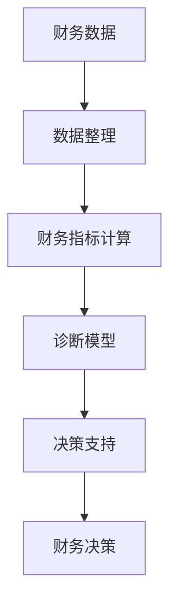
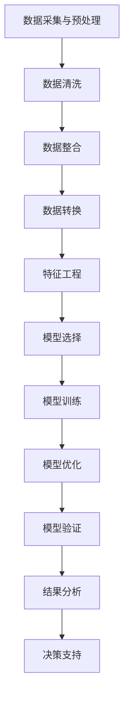
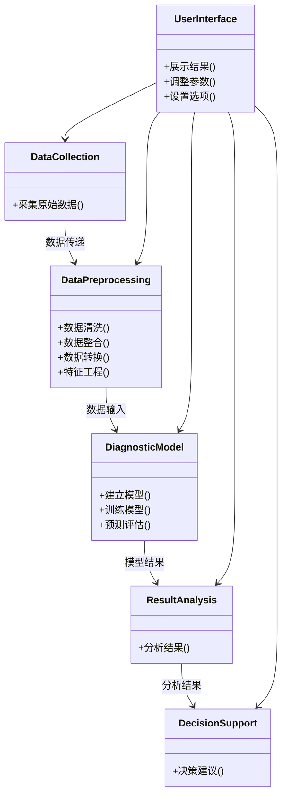
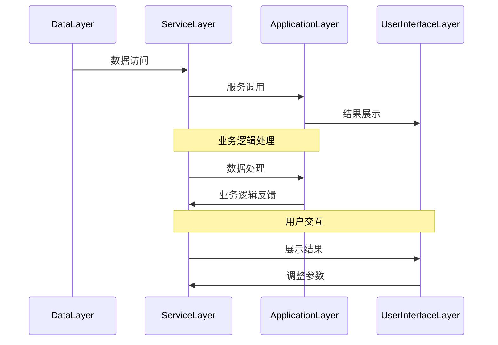
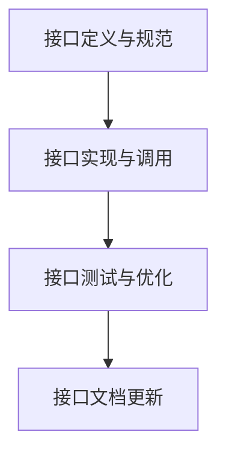
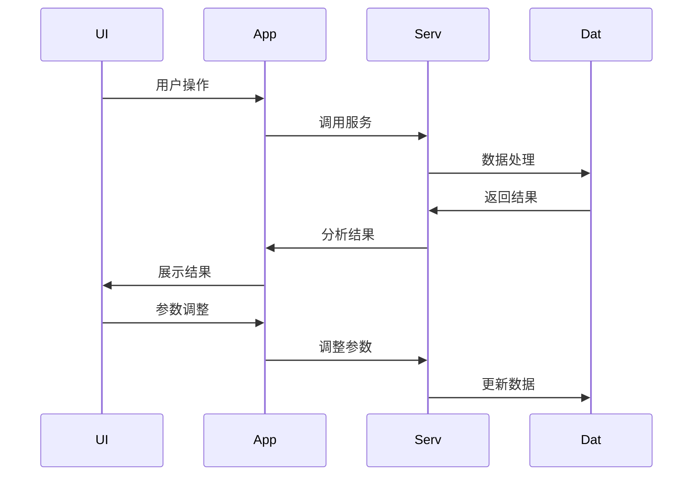

                 

### 第一部分：AI增强型财务健康诊断的背景与概念

#### 第1章：AI与财务健康诊断概述

##### 1.1 人工智能在财务领域的应用背景

人工智能（AI）作为计算机科学的一个重要分支，已经取得了巨大的进步。近年来，随着计算能力的提升、数据存储技术的进步以及算法研究的深入，人工智能在各个领域的应用越来越广泛。在财务领域，人工智能同样发挥着不可替代的作用。

首先，人工智能的发展趋势体现在以下几个方面：

- **计算能力提升**：高性能计算设备的普及，为人工智能算法的运算提供了强有力的硬件支持。
- **数据量爆炸性增长**：互联网和大数据技术的普及，使得财务数据的规模达到前所未有的水平。
- **算法优化与创新**：深度学习、强化学习等算法的进步，为人工智能在复杂问题上的解决能力提供了新的可能。

其次，财务健康诊断的重要性不言而喻。企业财务健康是企业管理的重要一环，它关系到企业的生存与发展。传统的财务健康诊断主要依靠人工分析，这种方法效率低、成本高，且容易受到人为因素干扰。而人工智能的应用，可以在以下几个方面提升财务健康诊断的效率：

- **自动化处理**：人工智能可以自动收集、整理和分析财务数据，减少人工工作量。
- **精准预测**：通过机器学习算法，可以对企业未来的财务状况进行精准预测，帮助企业提前做好风险防范。
- **智能决策支持**：人工智能可以基于大数据分析，为企业的决策提供智能支持，提高决策的科学性和准确性。

最后，人工智能在财务健康诊断中的应用潜力巨大。一方面，人工智能可以处理海量数据，挖掘出隐藏在数据中的有价值信息；另一方面，人工智能可以通过模型预测，为企业提供前瞻性的分析和建议。随着人工智能技术的不断进步，它将在财务健康诊断领域发挥越来越重要的作用。

##### 1.2 财务健康诊断的基本概念

财务健康诊断是指通过评估和分析企业的财务状况，判断其财务健康状况，并为企业的财务决策提供依据。它是一个系统性、综合性的过程，涉及到财务数据的收集、处理、分析和评估等多个环节。

首先，财务健康诊断的定义可以概括为：

财务健康诊断是利用财务数据及相关信息，通过定性和定量分析，评估企业的财务状况，发现潜在问题，为企业的财务决策提供科学依据。

其次，财务健康诊断的目标主要包括：

- **发现财务问题**：通过财务数据分析，识别企业存在的财务风险和问题。
- **评估财务状况**：对企业的财务健康状况进行量化评估，为管理层提供决策参考。
- **优化财务管理**：基于诊断结果，提出改进建议，帮助企业优化财务管理，提升财务健康水平。

再次，财务健康诊断的方法与流程通常包括以下几个步骤：

1. **数据收集**：收集企业的财务数据，包括财务报表、经营数据等。
2. **数据整理**：对收集到的财务数据进行分析，整理成易于分析的形式。
3. **指标计算**：计算常用的财务健康指标，如流动比率、资产负债率等。
4. **综合评估**：根据计算结果，对企业财务状况进行综合评估，识别财务风险。
5. **问题诊断**：对发现的财务问题进行深入分析，找出原因。
6. **决策支持**：基于诊断结果，为企业提供财务管理优化建议和决策支持。

通过上述步骤，财务健康诊断可以全面、准确地评估企业的财务健康状况，为企业的发展提供有力支持。

##### 1.3 AI在财务健康诊断中的作用

人工智能在财务健康诊断中发挥着至关重要的作用，主要体现在数据采集与处理、模型建立与预测、决策支持与优化三个方面。

首先，数据采集与处理是财务健康诊断的基础。传统的财务数据通常来源于企业的财务系统，这些数据可能存在格式不统一、数据缺失、错误等问题。而人工智能可以通过自然语言处理（NLP）和图像识别等技术，自动化地从各种来源采集财务数据，并进行清洗和整理。例如，利用OCR（光学字符识别）技术，可以将纸质财务报表转化为电子数据，从而提高数据采集的效率和准确性。

其次，模型建立与预测是财务健康诊断的核心。通过机器学习算法，人工智能可以建立复杂的预测模型，对企业未来的财务状况进行预测。这些模型可以是回归模型、决策树、神经网络等。例如，利用时间序列分析，可以预测企业的收入、利润等关键财务指标。通过这些预测模型，企业可以提前预知可能的财务风险，并采取相应的措施进行防范。

再次，决策支持与优化是财务健康诊断的延伸。基于预测模型和财务数据分析，人工智能可以为企业提供智能化的决策支持。例如，通过优化算法，可以找出最优的财务管理策略，提高资金使用效率；通过风险分析，可以识别潜在的风险点，并提出风险控制措施。此外，人工智能还可以帮助企业进行财务规划，制定合理的财务预算和资金分配方案。

总之，人工智能在财务健康诊断中的作用不仅体现在数据采集和处理，还体现在模型建立、预测和决策支持等方面。通过人工智能的应用，企业可以更加精准、高效地进行财务健康诊断，从而提高财务管理的水平。

##### 1.4 财务健康诊断的边界与外延

财务健康诊断作为一种管理工具，虽然在提升企业财务管理水平方面具有重要作用，但其应用也受到一定的限制。

首先，财务健康诊断的局限性体现在以下几个方面：

- **数据依赖性**：财务健康诊断的准确性和有效性高度依赖于财务数据的完整性、准确性和及时性。如果数据存在缺失、错误或滞后，可能会导致诊断结果失真。
- **模型适用性**：不同的企业具有不同的经营模式、业务特征和财务状况，现有的机器学习模型可能无法完全适应所有企业的需求。因此，模型的选择和调整需要根据具体情况进行分析和优化。
- **人为干预**：尽管人工智能可以自动化处理大量数据，但最终的决策仍然需要企业管理层进行判断和决策。因此，人的主观判断和经验在财务健康诊断中仍然发挥着重要作用。

其次，财务健康诊断与其他管理工具的关系密切。例如，预算管理、成本控制、绩效评估等工具都是财务管理的重要组成部分，它们与财务健康诊断相互补充、相互影响。预算管理可以帮助企业制定合理的财务计划，成本控制可以帮助企业降低运营成本，绩效评估可以帮助企业评估财务管理的有效性。而财务健康诊断则通过对财务数据的全面分析，为企业提供更加深入、全面的财务健康状况评估。

最后，财务健康诊断的未来发展趋势表现在以下几个方面：

- **技术进步**：随着人工智能、大数据、云计算等技术的不断发展，财务健康诊断工具将变得更加智能化、精准化，能够更好地应对复杂多变的财务环境。
- **应用拓展**：财务健康诊断的应用领域将不断拓展，不仅限于企业内部财务管理，还可能延伸到供应链管理、客户关系管理等领域。
- **集成化**：财务健康诊断将与企业其他管理工具实现更深层次的集成，形成一体化、智能化的财务管理平台，提升企业整体管理水平和竞争力。

##### 1.5 本章小结

在本章中，我们首先介绍了人工智能在财务领域的发展背景和应用前景，强调了财务健康诊断的重要性。随后，我们对财务健康诊断的基本概念、方法和目标进行了详细阐述，并探讨了人工智能在财务健康诊断中的作用。此外，我们还分析了财务健康诊断的边界与外延，探讨了其局限性、与其他管理工具的关系以及未来发展趋势。

通过本章的学习，读者可以全面了解AI增强型财务健康诊断的基本概念、原理和应用，为后续章节的深入探讨打下坚实的基础。在后续章节中，我们将进一步探讨财务健康诊断的核心概念与联系，深入分析AI增强型财务健康诊断算法的原理与流程，并分享具体的项目实战与案例分析。让我们一起继续探索这一领域的奥秘。

---

### 第二部分：核心概念与原理

#### 第2章：财务健康诊断的核心概念与联系

##### 2.1 财务健康指标体系

财务健康指标是评估企业财务状况的重要工具。通过这些指标，企业可以全面了解自身的财务健康状况，从而制定相应的管理和决策策略。下面，我们将介绍一些常见的财务健康指标及其计算方法。

首先，流动比率（Current Ratio）是评估企业短期偿债能力的重要指标。其计算公式为：

$$
\text{流动比率} = \frac{\text{流动资产}}{\text{流动负债}}
$$

流动资产包括现金、应收账款、存货等，流动负债包括短期借款、应付账款等。一般情况下，流动比率越高，说明企业的短期偿债能力越强。

其次，速动比率（Quick Ratio）是另一个衡量企业短期偿债能力的指标，它剔除了存货等不易迅速变现的资产。其计算公式为：

$$
\text{速动比率} = \frac{\text{流动资产} - \text{存货}}{\text{流动负债}}
$$

速动比率越高，表明企业的短期偿债能力越强，但同时也可能意味着企业的资金使用效率较低。

再次，资产负债率（Debt-to-Equity Ratio）是评估企业长期偿债能力的指标，反映了企业负债占资产的比例。其计算公式为：

$$
\text{资产负债率} = \frac{\text{负债}}{\text{资产}}
$$

资产负债率越低，说明企业的财务风险越小，但同时也可能意味着企业的资金使用效率较低。

此外，净利润率（Net Profit Margin）是衡量企业盈利能力的重要指标，计算公式为：

$$
\text{净利润率} = \frac{\text{净利润}}{\text{营业收入}}
$$

净利润率越高，表明企业的盈利能力越强。

最后，资产收益率（Return on Asset，ROA）是衡量企业资产使用效率的指标，计算公式为：

$$
\text{资产收益率} = \frac{\text{净利润}}{\text{总资产}}
$$

资产收益率越高，表明企业的资产使用效率越高。

表 1：财务健康指标对比表格

| 指标名称 | 定义 | 计算公式 |  
| --- | --- | --- |  
| 流动比率 | 短期偿债能力 | $\frac{\text{流动资产}}{\text{流动负债}}$ |  
| 速动比率 | 短期偿债能力（剔除存货） | $\frac{\text{流动资产} - \text{存货}}{\text{流动负债}}$ |  
| 资产负债率 | 长期偿债能力 | $\frac{\text{负债}}{\text{资产}}$ |  
| 净利润率 | 盈利能力 | $\frac{\text{净利润}}{\text{营业收入}}$ |  
| 资产收益率 | 资产使用效率 | $\frac{\text{净利润}}{\text{总资产}}$ |

通过这些财务健康指标，企业可以全面了解自身的财务状况，发现潜在的问题，并采取相应的措施进行优化。

##### 2.2 财务健康诊断的原理

财务健康诊断的原理基于数据分析和机器学习算法。下面，我们将从数据分析基础、机器学习算法基础以及模型建立与优化原理三个方面进行详细介绍。

首先，数据分析基础是财务健康诊断的基础。数据分析包括数据收集、数据清洗、数据整理和数据可视化等环节。通过这些环节，可以将原始的财务数据转化为有用的信息。数据收集方面，可以使用数据库、ERP系统等工具获取财务数据。数据清洗方面，需要处理缺失值、异常值等问题，确保数据的准确性。数据整理方面，需要将不同来源、不同格式的数据进行统一整理，以便后续分析。数据可视化方面，可以使用图表、仪表盘等工具，将数据直观地呈现出来，帮助用户更好地理解数据。

其次，机器学习算法基础是财务健康诊断的核心。机器学习算法包括回归分析、决策树、支持向量机、神经网络等。这些算法可以通过训练模型，自动发现数据中的规律和趋势，从而对企业的财务状况进行预测和评估。在财务健康诊断中，常用的机器学习算法有：

- **回归分析**：通过建立回归模型，预测企业的财务指标。例如，利用线性回归模型预测企业的收入、利润等。
- **决策树**：通过分类和回归树（CART）对企业的财务数据进行分类和预测。例如，利用决策树模型预测企业的财务状况是否健康。
- **支持向量机**：通过建立支持向量回归模型（SVR），对企业的财务数据进行分析和预测。例如，利用SVR模型预测企业的负债率、资产负债率等。
- **神经网络**：通过建立深度神经网络模型，对企业的财务数据进行复杂的非线性分析。例如，利用深度神经网络模型预测企业的收入、利润等。

再次，模型建立与优化原理是财务健康诊断的关键。在模型建立过程中，首先需要选择合适的机器学习算法，并根据实际需求进行参数调整。然后，通过训练和验证模型，评估模型的性能。在模型优化过程中，可以通过调整参数、增加特征等方式，提高模型的预测准确性和稳定性。具体的模型建立与优化流程如下：

1. **数据预处理**：对原始财务数据进行预处理，包括数据清洗、特征工程等。
2. **模型选择**：根据数据特征和业务需求，选择合适的机器学习算法。
3. **模型训练**：使用训练数据对模型进行训练，调整参数以优化模型性能。
4. **模型验证**：使用验证数据集对模型进行验证，评估模型的预测性能。
5. **模型优化**：根据验证结果，对模型进行调整和优化，提高模型的准确性。

通过以上步骤，可以建立和优化一个有效的财务健康诊断模型，为企业提供准确的财务分析和决策支持。

##### 2.3 AI技术基础

人工智能（AI）作为财务健康诊断的重要工具，其基础技术主要包括人工智能的定义与分类、机器学习算法简介以及深度学习算法原理。

首先，人工智能的定义与分类。人工智能是指使计算机模拟人类智能行为的技术，主要包括感知、认知、决策和行动等能力。根据智能水平的不同，人工智能可以分为弱人工智能和强人工智能。弱人工智能是指在某些特定任务上表现优异的人工智能，如语音识别、图像识别等。强人工智能则是指具有全面人类智能的人工智能，能够在多种任务上表现出人类智能。

其次，机器学习算法简介。机器学习是人工智能的一个重要分支，主要研究如何使计算机从数据中自动学习和改进性能。根据学习方式的不同，机器学习可以分为监督学习、无监督学习和强化学习。监督学习是指通过训练数据对模型进行监督，使其能够对新的数据进行分类或预测。无监督学习是指没有训练数据，通过探索数据中的结构或模式，使模型能够对未知数据进行分类或聚类。强化学习是指通过与环境交互，不断调整策略，使模型能够实现最优目标。

再次，深度学习算法原理。深度学习是机器学习的一个重要分支，通过构建多层神经网络，对数据进行复杂的非线性变换和特征提取。深度学习的核心思想是“分层学习”，即通过前一层神经元的输出作为后一层神经元的输入，逐层提取数据中的特征。深度学习算法包括卷积神经网络（CNN）、循环神经网络（RNN）和生成对抗网络（GAN）等。

具体来说，卷积神经网络（CNN）主要用于图像识别和分类任务，通过卷积层、池化层和全连接层等结构，实现对图像特征的提取和分类。循环神经网络（RNN）主要用于序列数据处理任务，如自然语言处理、语音识别等，通过隐藏状态和循环结构，实现对序列数据的记忆和建模。生成对抗网络（GAN）主要用于生成任务，如图像生成和语音合成，通过生成器和判别器的对抗训练，实现数据的生成和建模。

通过这些基础技术，人工智能可以在财务健康诊断中发挥重要作用，通过数据分析和模型预测，为企业提供准确的财务分析和决策支持。

##### 2.4 财务健康诊断的概念结构

财务健康诊断是一个复杂的系统，涉及到多个核心概念和要素。为了更好地理解财务健康诊断的整体框架和各概念之间的关系，我们可以通过一个概念结构图来展现。

首先，财务健康诊断的核心概念包括：

- **财务数据**：包括企业的财务报表、经营数据等，是进行财务健康诊断的基础。
- **财务指标**：通过对财务数据的分析，计算出的各种财务指标，如流动比率、资产负债率、净利润率等，用于评估企业的财务健康状况。
- **诊断模型**：基于机器学习算法建立的诊断模型，用于预测和评估企业的财务状况。
- **决策支持**：基于诊断模型和财务分析，为企业的财务决策提供智能化的支持和建议。

其次，各概念之间的关系如下：

1. **财务数据**是进行财务健康诊断的基础，通过数据收集和整理，形成完整的财务数据集。
2. **财务指标**是基于财务数据进行计算和分析的结果，用于评估企业的财务状况。
3. **诊断模型**是基于机器学习算法建立的，通过对财务指标的分析，预测企业的财务健康状况。
4. **决策支持**是基于诊断模型和财务分析的结果，为企业的财务决策提供智能化的支持和建议。

最后，我们可以通过一个Mermaid流程图来展示财务健康诊断的概念结构：



通过这个流程图，我们可以清晰地看到财务健康诊断的各个环节和概念之间的关系，为理解和实施财务健康诊断提供了有力的指导。

##### 2.5 本章小结

在本章中，我们系统地介绍了财务健康诊断的核心概念与联系。首先，我们详细阐述了财务健康指标体系，包括流动比率、速动比率、资产负债率、净利润率等常见指标及其计算方法。接着，我们探讨了财务健康诊断的原理，包括数据分析基础、机器学习算法基础以及模型建立与优化原理。此外，我们还介绍了人工智能技术基础，包括人工智能的定义与分类、机器学习算法简介以及深度学习算法原理。

通过本章的学习，读者可以全面了解财务健康诊断的核心概念、原理和人工智能技术的应用，为后续章节的深入探讨打下坚实的基础。在后续章节中，我们将进一步分析AI增强型财务健康诊断算法的原理与流程，探讨财务健康诊断系统的设计与实现，分享项目实战与案例分析，以及提供最佳实践和拓展应用。让我们一起继续深入探讨这一领域，挖掘更多潜在价值。

---

### 第3章：AI增强型财务健康诊断算法原理与流程

#### 3.1 AI增强型财务健康诊断算法概述

AI增强型财务健康诊断算法是一种利用人工智能技术，对企业的财务数据进行分析和诊断，从而为企业提供智能财务健康评估和决策支持的方法。与传统方法相比，AI增强型财务健康诊断算法具有以下特点：

首先，AI增强型财务健康诊断算法能够自动化处理大量财务数据。传统的财务健康诊断主要依赖于人工分析，效率较低，且容易受到人为因素干扰。而AI算法可以自动从各种数据源中提取财务数据，进行清洗、整理和分析，大大提高了诊断的效率和准确性。

其次，AI增强型财务健康诊断算法能够进行精准预测。通过机器学习算法，AI可以建立复杂的预测模型，对企业未来的财务状况进行预测。这些预测模型可以基于历史数据，分析出企业的财务趋势和潜在风险，从而帮助企业提前做好风险防范和决策规划。

再次，AI增强型财务健康诊断算法能够提供智能化的决策支持。基于大数据分析和预测模型，AI可以为企业提供个性化的财务分析报告和决策建议，帮助企业优化财务管理，提高资金使用效率，降低财务风险。

最后，AI增强型财务健康诊断算法具有自我优化能力。随着数据的不断积累和算法的不断迭代，AI可以自动调整和优化模型，提高预测的准确性和稳定性，从而不断提升财务健康诊断的效果。

综上所述，AI增强型财务健康诊断算法在效率、精准性和智能化方面具有显著优势，为企业提供了一种全新的财务管理工具和决策支持系统。

#### 3.2 数据采集与预处理

数据采集与预处理是AI增强型财务健康诊断算法的关键环节，直接影响到模型的训练效果和预测准确性。在这一部分，我们将详细介绍数据采集、数据预处理方法和特征工程。

首先，数据采集是财务健康诊断的基础。数据来源主要包括企业的财务报表、经营数据、外部市场数据等。财务报表包括资产负债表、利润表和现金流量表，是财务健康诊断的主要数据来源。经营数据包括销售收入、成本费用、存货周转率等，可以提供企业的经营状况。外部市场数据包括行业趋势、宏观经济指标等，可以为企业的财务分析提供外部参考。为了确保数据的质量和完整性，数据采集过程需要自动化和标准化，避免人为错误和数据缺失。

其次，数据预处理是数据采集后的重要步骤，主要包括数据清洗、数据整合和数据转换。

1. **数据清洗**：数据清洗是处理原始数据中的缺失值、异常值和重复值。对于缺失值，可以根据数据的重要性和实际情况，采用插值、平均或删除等方法进行填补；对于异常值，需要根据数据分布和业务逻辑，进行识别和修正；对于重复值，需要删除重复的数据条目，避免重复计算。

2. **数据整合**：数据整合是将不同来源、不同格式的数据进行统一整理，形成统一的数据格式和结构。例如，将财务报表中的数据整合到企业的经营数据中，形成完整的数据集。

3. **数据转换**：数据转换是将原始数据转换为适合机器学习算法分析的形式。例如，将文本数据转换为数值型数据，将时间序列数据转换为序列特征等。

再次，特征工程是数据预处理的重要环节，旨在提取和构造有助于模型训练的特征，提高模型的预测性能。特征工程的方法包括：

1. **特征提取**：通过统计分析、数据挖掘等方法，从原始数据中提取有用的特征。例如，利用主成分分析（PCA）提取数据的降维特征，利用聚类算法提取数据的聚类特征等。

2. **特征构造**：通过数学变换、组合等方法，构造新的特征。例如，利用时间序列差分构造滞后特征，利用财务指标组合构造综合特征等。

3. **特征选择**：通过特征选择方法，从大量特征中筛选出对模型预测性能有显著影响的特征。常用的特征选择方法包括递归特征消除（RFE）、基于模型的特征选择（MBFS）等。

通过数据采集与预处理，我们可以确保财务健康诊断数据的质量和一致性，为后续的机器学习算法训练和预测打下坚实基础。

#### 3.3 算法选择与模型构建

在AI增强型财务健康诊断中，算法选择与模型构建是关键步骤，直接影响到诊断结果的准确性和可靠性。下面，我们将详细介绍常见机器学习算法的选择、模型选择与优化、模型评估与验证方法。

首先，算法选择是构建模型的基础。在财务健康诊断中，常用的机器学习算法包括线性回归、逻辑回归、决策树、随机森林、支持向量机、神经网络等。每种算法都有其适用的场景和特点。

1. **线性回归**：线性回归是最简单的回归算法，适用于线性关系较强的数据。其优点是计算简单，易于理解和实现，但缺点是对于非线性关系表现较差。

2. **逻辑回归**：逻辑回归是一种广义线性模型，主要用于分类问题。它通过建立概率模型，对财务健康状况进行预测。其优点是易于实现和解释，但缺点是对异常值和噪声敏感。

3. **决策树**：决策树是一种树形结构模型，通过将数据逐步划分成子集，对每个子集进行分类。其优点是直观易懂，易于解释，但缺点是容易过拟合，且计算复杂度较高。

4. **随机森林**：随机森林是一种集成学习方法，通过构建多棵决策树，并对结果进行投票，提高预测的准确性和稳定性。其优点是能够处理大量特征，提高预测性能，但缺点是计算成本较高。

5. **支持向量机**：支持向量机是一种分类和回归模型，通过找到最佳超平面，将数据分类或回归。其优点是能够处理高维数据，对异常值和噪声有较好的鲁棒性，但缺点是计算复杂度较高。

6. **神经网络**：神经网络是一种模拟人脑神经元连接结构的模型，通过多层神经元的非线性变换，实现复杂的函数映射。其优点是能够处理非线性关系，自适应调整参数，但缺点是训练过程复杂，对数据质量要求较高。

在具体选择算法时，需要根据数据特征、业务需求和计算资源等因素进行综合考虑。对于线性关系较强的数据，可以选择线性回归或逻辑回归；对于非线性关系较强的数据，可以选择决策树、随机森林或神经网络。

其次，模型选择与优化是提高预测性能的关键。在模型选择过程中，需要考虑模型的复杂性、拟合度、泛化能力等因素。常用的模型选择方法包括：

1. **交叉验证**：交叉验证是一种评估模型性能的方法，通过将数据集划分为训练集和验证集，多次训练和验证，评估模型的泛化能力。常用的交叉验证方法包括K折交叉验证和留一法交叉验证。

2. **网格搜索**：网格搜索是一种模型参数调优的方法，通过遍历所有可能的参数组合，选择最优参数组合。网格搜索的缺点是计算成本较高，适用于参数较少的模型。

3. **贝叶斯优化**：贝叶斯优化是一种基于概率的参数调优方法，通过构建概率模型，迭代优化参数组合。贝叶斯优化的优点是计算效率高，适用于参数较多的模型。

在模型优化过程中，还需要考虑以下因素：

1. **特征选择**：通过特征选择方法，筛选出对模型预测性能有显著影响的特征，减少特征维度，提高模型训练效率和预测性能。

2. **正则化**：通过正则化方法，防止模型过拟合，提高模型的泛化能力。常用的正则化方法包括L1正则化、L2正则化等。

3. **数据预处理**：通过数据预处理方法，提高数据质量，减少噪声和异常值的影响。例如，利用归一化方法，将数据缩放到相同的范围；利用缺失值填补方法，填补缺失值。

最后，模型评估与验证是确保模型可靠性和有效性的关键步骤。常用的模型评估方法包括：

1. **准确率**：准确率是评估分类模型性能的重要指标，表示分类正确的样本数与总样本数的比例。准确率越高，表示模型分类效果越好。

2. **精确率与召回率**：精确率和召回率是评估二分类模型性能的重要指标。精确率表示预测为正类的样本中，实际为正类的比例；召回率表示实际为正类的样本中，预测为正类的比例。精确率和召回率的平衡取决于业务需求和模型参数。

3. **F1分数**：F1分数是精确率和召回率的加权平均，综合考虑了模型的分类效果。F1分数越高，表示模型分类效果越好。

4. **ROC曲线与AUC值**：ROC曲线是评估分类模型性能的重要工具，通过绘制预测概率与实际标签的关系，评估模型的分类效果。AUC值是ROC曲线下的面积，表示模型的分类能力。AUC值越高，表示模型分类能力越强。

通过模型评估与验证，可以确保模型的可靠性和有效性，为企业的财务健康诊断提供有力的支持。

#### 3.4 AI增强型财务健康诊断流程

AI增强型财务健康诊断流程是一个系统性的过程，包括数据采集与预处理、模型训练与优化、结果分析与决策支持三个主要阶段。下面，我们将详细介绍各阶段的流程和步骤。

首先，数据采集与预处理阶段。在这一阶段，首先需要从企业的财务报表、经营数据等来源中采集原始数据。数据采集完成后，需要对数据进行清洗和预处理，包括处理缺失值、异常值和重复值等。预处理后的数据将被用于训练和验证模型。

具体步骤如下：

1. **数据收集**：从企业的财务报表、经营数据等来源中采集原始数据。
2. **数据清洗**：处理缺失值、异常值和重复值等，确保数据质量。
3. **数据整合**：将不同来源的数据进行整合，形成统一的数据集。
4. **数据转换**：将原始数据转换为适合机器学习算法分析的形式，如将文本数据转换为数值型数据，将时间序列数据转换为序列特征等。
5. **特征工程**：提取和构造有助于模型训练的特征，提高模型的预测性能。

其次，模型训练与优化阶段。在这一阶段，首先需要选择合适的机器学习算法，并根据数据特征和业务需求，建立诊断模型。然后，通过交叉验证、网格搜索等方法，对模型进行训练和优化，提高模型的预测性能。

具体步骤如下：

1. **模型选择**：根据数据特征和业务需求，选择合适的机器学习算法。
2. **模型训练**：使用预处理后的数据，对模型进行训练。
3. **模型优化**：通过交叉验证、网格搜索等方法，优化模型参数，提高模型性能。
4. **模型验证**：使用验证数据集对模型进行验证，评估模型的预测性能。

最后，结果分析与决策支持阶段。在这一阶段，首先需要对模型的预测结果进行分析和解读，识别企业的财务风险和问题。然后，基于分析结果，为企业的财务决策提供智能化的支持和建议。

具体步骤如下：

1. **结果分析**：对模型的预测结果进行分析和解读，识别企业的财务风险和问题。
2. **决策支持**：基于分析结果，为企业的财务决策提供智能化的支持和建议。

通过上述三个阶段的流程，AI增强型财务健康诊断可以为企业提供准确的财务分析和决策支持，帮助企业优化财务管理，降低财务风险。

#### 3.5 算法mermaid流程图

为了更好地理解和实施AI增强型财务健康诊断算法，我们可以使用Mermaid工具绘制算法的流程图。以下是算法mermaid流程图的详细步骤：



**详细解释**：

1. **数据采集与预处理**：首先从企业的财务报表、经营数据等来源中采集原始数据，并进行数据清洗、整合、转换和特征工程，确保数据的质量和一致性。

2. **数据清洗**：处理原始数据中的缺失值、异常值和重复值等，确保数据质量。

3. **数据整合**：将来自不同来源的数据进行整合，形成统一的数据集。

4. **数据转换**：将原始数据转换为适合机器学习算法分析的形式，如将文本数据转换为数值型数据，将时间序列数据转换为序列特征等。

5. **特征工程**：提取和构造有助于模型训练的特征，提高模型的预测性能。

6. **模型选择**：根据数据特征和业务需求，选择合适的机器学习算法。

7. **模型训练**：使用预处理后的数据，对模型进行训练。

8. **模型优化**：通过交叉验证、网格搜索等方法，优化模型参数，提高模型性能。

9. **模型验证**：使用验证数据集对模型进行验证，评估模型的预测性能。

10. **结果分析**：对模型的预测结果进行分析和解读，识别企业的财务风险和问题。

11. **决策支持**：基于分析结果，为企业的财务决策提供智能化的支持和建议。

通过以上步骤，我们可以系统地实施AI增强型财务健康诊断算法，为企业提供准确的财务分析和决策支持。

#### 3.6 本章小结

在本章中，我们深入探讨了AI增强型财务健康诊断算法的原理与流程。首先，我们介绍了AI增强型财务健康诊断算法的特点和优势，包括自动化处理大量财务数据、精准预测企业财务状况和提供智能化的决策支持。接着，我们详细阐述了数据采集与预处理的方法，包括数据采集、数据清洗、数据整合、数据转换和特征工程。然后，我们介绍了算法选择与模型构建的方法，包括常见机器学习算法的选择、模型选择与优化以及模型评估与验证。最后，我们通过Mermaid流程图展示了AI增强型财务健康诊断的具体实施步骤。

通过本章的学习，读者可以全面了解AI增强型财务健康诊断算法的原理、方法和应用，为后续章节的深入探讨和实践应用打下坚实基础。在后续章节中，我们将进一步探讨财务健康诊断系统的设计与实现，分享实际项目案例和最佳实践，以及讨论财务健康诊断的未来发展趋势。让我们一起继续探索这一领域的奥秘，为企业提供更智能、更高效的财务健康诊断解决方案。

---

### 第三部分：系统分析与架构设计

#### 第4章：财务健康诊断系统的设计与实现

##### 4.1 项目介绍

财务健康诊断系统项目旨在通过人工智能技术，对企业财务数据进行全面分析，提供智能化的财务健康评估和决策支持。该项目主要涉及以下方面：

- **项目背景**：随着企业规模的扩大和市场竞争的加剧，财务管理的重要性日益凸显。传统的财务管理方法已无法满足企业快速发展的需求，迫切需要引入先进的技术手段，提升财务管理的效率和准确性。
- **项目目标**：通过构建一个集数据采集、处理、分析和决策支持于一体的财务健康诊断系统，实现对企业的财务状况进行全面、精准的评估，为企业提供科学的决策依据，提升财务管理的整体水平。
- **项目团队与任务分配**：项目团队由数据科学家、软件工程师、财务专家和项目经理组成。各成员负责以下任务：
  - 数据科学家：负责数据采集、数据预处理、模型选择与优化；
  - 软件工程师：负责系统架构设计、系统接口设计、系统实现与测试；
  - 财务专家：负责财务健康指标体系设计、财务分析方法设计；
  - 项目经理：负责项目规划、进度控制、团队协作与协调。

##### 4.2 系统功能设计

财务健康诊断系统的功能设计包括以下核心模块：

- **数据采集模块**：负责从企业的财务报表、ERP系统、外部市场数据等来源中采集原始数据。
- **数据预处理模块**：负责对采集到的数据进行清洗、整理、转换和特征工程，为后续模型训练提供高质量的数据集。
- **诊断模型模块**：负责建立和训练财务健康诊断模型，通过机器学习算法，实现对企业的财务状况进行预测和评估。
- **结果分析模块**：负责对诊断模型的结果进行分析和解读，识别企业的财务风险和问题。
- **决策支持模块**：负责基于分析结果，为企业的财务决策提供智能化的建议和方案。
- **用户界面模块**：负责提供直观易用的用户界面，供用户查看诊断结果、调整参数和设置。

以下是系统功能模块划分的Mermaid类图：



**详细解释**：

- **数据采集模块**：该模块负责从企业的财务报表、ERP系统、外部市场数据等来源中采集原始数据，包括财务报表数据、经营数据、行业数据等。数据采集过程应保证数据的完整性和一致性，避免数据丢失或错误。
- **数据预处理模块**：该模块负责对采集到的原始数据进行分析和处理，包括数据清洗、数据整合、数据转换和特征工程。数据清洗包括处理缺失值、异常值和重复值等；数据整合包括将来自不同来源的数据进行统一整理；数据转换包括将文本数据转换为数值型数据、时间序列数据转换为序列特征等；特征工程包括提取和构造有助于模型训练的特征，提高模型预测性能。
- **诊断模型模块**：该模块负责建立和训练财务健康诊断模型，包括选择合适的机器学习算法、建立诊断模型、训练模型和预测评估。通过机器学习算法，可以对企业的财务状况进行预测和评估，识别潜在的风险和问题。
- **结果分析模块**：该模块负责对诊断模型的结果进行分析和解读，识别企业的财务风险和问题，包括财务指标分析、风险识别和问题诊断等。
- **决策支持模块**：该模块负责基于分析结果，为企业的财务决策提供智能化的建议和方案，包括优化财务管理策略、制定风险控制措施、提出投资建议等。
- **用户界面模块**：该模块负责提供直观易用的用户界面，包括数据展示、参数调整和设置选项等，方便用户查看诊断结果、调整模型参数和设置诊断选项。

通过以上功能模块的划分，财务健康诊断系统可以实现对企业财务数据的全面分析和智能化的决策支持，帮助企业提升财务管理的效率和质量。

##### 4.3 系统架构设计

财务健康诊断系统的架构设计旨在实现系统功能的模块化、高扩展性和高性能，以满足企业不断变化的需求。系统架构包括数据层、服务层、应用层和用户界面层四个主要层次，各层次之间通过接口进行通信。

以下是系统架构的Mermaid图：



**详细解释**：

1. **数据层（Data Layer）**：数据层主要负责数据的存储和管理，包括财务数据的存储、数据访问和数据处理。数据层可以使用关系型数据库或NoSQL数据库，根据数据规模和访问需求进行选择。数据层为服务层提供数据访问接口，确保数据的一致性和安全性。

2. **服务层（Service Layer）**：服务层是系统的核心，负责业务逻辑的处理和数据服务的提供。服务层包含多个服务模块，如数据采集服务、数据预处理服务、诊断模型服务、结果分析服务、决策支持服务等。服务层通过接口与数据层和应用层进行通信，确保系统的模块化和高扩展性。

3. **应用层（Application Layer）**：应用层是系统的业务逻辑层，负责实现具体的业务功能。应用层包括数据预处理模块、诊断模型模块、结果分析模块、决策支持模块等。应用层通过调用服务层的服务，实现业务逻辑的处理和数据服务的提供。

4. **用户界面层（User Interface Layer）**：用户界面层是系统的前端，负责与用户进行交互，展示诊断结果和提供决策支持。用户界面层包括数据展示模块、参数调整模块、设置选项模块等。用户界面层通过接口与服务层和应用层进行通信，实现用户操作和业务逻辑的交互。

通过以上架构设计，财务健康诊断系统可以实现模块化、高扩展性和高性能，满足企业多样化的需求。系统各层次之间的松耦合设计，使得系统易于维护和升级，提高了系统的稳定性和可靠性。

##### 4.4 系统接口设计

财务健康诊断系统的接口设计是确保系统各层次之间有效通信和协同工作的重要环节。接口设计主要包括接口定义与规范、接口实现与调用以及接口测试与优化。

首先，接口定义与规范是接口设计的基础。接口定义主要包括接口名称、接口参数、接口返回值以及接口调用说明。接口规范应详细描述接口的功能、输入输出参数的类型、约束条件以及使用方法。以下是一个接口定义示例：

```python
def get_financial_data(source: str, start_date: str, end_date: str) -> pd.DataFrame:
    """
    获取指定来源、时间段内的财务数据
    
    参数:
    - source: 数据来源（如财务报表、ERP系统等）
    - start_date: 获取数据的开始日期
    - end_date: 获取数据的结束日期
    
    返回值:
    - pd.DataFrame: 获取的财务数据
    """
    # 实现接口逻辑
    pass
```

其次，接口实现与调用是接口设计的关键。接口实现是根据接口定义，编写具体的接口逻辑代码。接口调用是在应用层和服务层中，通过调用接口实现业务逻辑。以下是一个接口调用的示例：

```python
# 调用数据采集接口
financial_data = get_financial_data('ERP', '2021-01-01', '2021-12-31')

# 调用数据预处理接口
preprocessed_data = preprocess_financial_data(financial_data)

# 调用诊断模型接口
diagnosis_results = diagnose_financial_health(preprocessed_data)
```

最后，接口测试与优化是确保接口质量和性能的重要环节。接口测试主要包括功能测试、性能测试和兼容性测试。功能测试确保接口按预期执行，性能测试评估接口的响应时间和资源消耗，兼容性测试确保接口在不同环境下的正常运行。接口优化则通过分析测试结果，对接口进行性能优化和功能改进。



**详细解释**：

1. **接口定义与规范**：接口定义与规范是接口设计的基础，明确接口的功能、输入输出参数、调用说明等。规范应详细、清晰，以便开发人员理解和实现接口。
2. **接口实现与调用**：接口实现是根据接口定义，编写具体的接口逻辑代码。接口调用是在应用层和服务层中，通过调用接口实现业务逻辑。良好的接口设计应确保接口的高内聚、低耦合，提高系统的可维护性和扩展性。
3. **接口测试与优化**：接口测试包括功能测试、性能测试和兼容性测试，确保接口按预期执行，性能符合要求，在不同环境下正常运行。接口优化通过分析测试结果，对接口进行性能优化和功能改进，提高系统的整体性能和稳定性。

通过上述接口设计方法，财务健康诊断系统可以实现各层次之间的有效通信和协同工作，提高系统的整体性能和稳定性。

##### 4.5 系统交互设计与实现

系统交互设计是确保财务健康诊断系统各模块之间高效、准确协作的关键。系统交互包括数据交互和功能交互，涉及多个模块之间的通信和协作。下面，我们将详细阐述系统交互流程、Mermaid序列图以及系统交互实现与调试。

首先，系统交互流程是系统运作的核心。系统交互流程包括以下几个主要环节：

1. **用户操作**：用户通过用户界面层（User Interface Layer）进行操作，如数据采集、参数调整和查看诊断结果等。
2. **数据传递**：用户界面层将用户操作信息传递给应用层（Application Layer），应用层通过服务层（Service Layer）与数据层（Data Layer）进行通信。
3. **数据处理**：数据层对采集到的财务数据进行预处理，应用层调用诊断模型模块，对数据进行分析和评估。
4. **结果返回**：应用层将分析结果返回给用户界面层，用户界面层展示诊断结果，并提供决策支持。
5. **反馈与调整**：用户根据诊断结果和决策支持，对系统参数进行调整，优化诊断过程。

以下是系统交互流程的Mermaid序列图：



**详细解释**：

- **用户操作**：用户通过用户界面层（UI）进行操作，如选择数据来源、设置诊断时间范围和查看诊断结果等。用户操作触发一系列事件，如数据采集、参数调整和结果展示等。
- **数据传递**：用户界面层（UI）将用户操作信息（如数据来源、时间范围等）传递给应用层（App），应用层根据用户操作信息，调用相应的服务层（Serv）模块。
- **数据处理**：服务层（Serv）调用数据层（Dat）模块，对采集到的财务数据进行预处理，如数据清洗、数据整合和特征工程等。预处理后的数据将被用于模型训练和预测。
- **结果返回**：数据处理完成后，数据层（Dat）将结果返回给服务层（Serv），服务层（Serv）将分析结果传递给应用层（App）。
- **展示结果**：应用层（App）将分析结果返回给用户界面层（UI），用户界面层（UI）展示诊断结果，并提供决策支持。
- **反馈与调整**：用户根据诊断结果和决策支持，对系统参数进行调整，如调整诊断模型参数、时间范围等，以优化诊断过程。

其次，系统交互实现与调试是确保系统正常运作的关键。实现系统交互涉及以下步骤：

1. **定义接口**：根据系统交互流程，定义各模块之间的接口，明确接口的功能、输入输出参数和调用方式。
2. **接口实现**：根据接口定义，编写接口实现代码，确保各模块之间能够正常通信和协作。
3. **单元测试**：对接口和模块进行单元测试，验证接口功能是否符合预期，模块是否能够正确处理数据。
4. **集成测试**：将各模块集成，进行集成测试，验证系统整体运作是否符合设计要求，各模块之间的交互是否顺畅。
5. **调试与优化**：根据测试结果，对系统进行调试和优化，修复问题，提升系统性能和稳定性。

通过系统交互设计与实现，财务健康诊断系统可以实现各模块之间的高效协作，为用户提供准确、智能的财务健康评估和决策支持。

##### 4.6 本章小结

本章详细介绍了财务健康诊断系统的设计与实现，包括项目介绍、系统功能设计、系统架构设计、系统接口设计以及系统交互设计与实现。首先，我们介绍了项目背景、目标、团队与任务分配，明确了财务健康诊断系统建设的重要性和目标。然后，我们详细阐述了系统功能设计，包括数据采集、数据预处理、诊断模型、结果分析和决策支持等核心模块。接着，我们介绍了系统架构设计，包括数据层、服务层、应用层和用户界面层的分层架构。随后，我们详细说明了系统接口设计，包括接口定义与规范、接口实现与调用以及接口测试与优化。最后，我们介绍了系统交互设计与实现，包括系统交互流程、Mermaid序列图以及实现与调试。

通过本章的学习，读者可以全面了解财务健康诊断系统的设计与实现过程，掌握各模块的功能和接口设计方法，为后续章节的深入学习打下坚实基础。在后续章节中，我们将进一步探讨财务健康诊断系统的项目实战与案例分析，分享最佳实践与拓展应用，以及讨论财务健康诊断系统的未来发展趋势。让我们继续深入探索财务健康诊断领域的奥秘，为企业提供更智能、更高效的财务管理解决方案。

---

### 第四部分：项目实战与案例分析

#### 第5章：AI增强型财务健康诊断项目实战

##### 5.1 环境安装与配置

在进行AI增强型财务健康诊断项目之前，首先需要搭建一个合适的开发环境。以下步骤将详细介绍环境安装与配置的过程。

1. **安装Python环境**：Python是进行AI开发的常用语言，首先需要安装Python环境。可以通过Python官网（[https://www.python.org/](https://www.python.org/)）下载Python安装包，根据操作系统选择相应的版本进行安装。安装过程中，确保将Python添加到环境变量中，以便在命令行中直接调用Python。

2. **安装依赖库**：AI增强型财务健康诊断项目需要使用多个依赖库，如NumPy、Pandas、Scikit-learn、TensorFlow等。可以通过pip命令安装这些库。以下是安装步骤：

   ```bash
   pip install numpy pandas scikit-learn tensorflow
   ```

3. **配置Jupyter Notebook**：Jupyter Notebook是一个交互式的计算环境，方便进行数据分析和模型训练。可以通过以下命令安装Jupyter Notebook：

   ```bash
   pip install notebook
   ```

   安装完成后，可以通过命令行启动Jupyter Notebook：

   ```bash
   jupyter notebook
   ```

   打开后，即可在浏览器中打开Jupyter Notebook界面。

4. **配置数据库**：财务健康诊断项目需要访问企业数据库，如MySQL或PostgreSQL。可以通过以下命令安装相应的数据库软件：

   - MySQL：`brew install mysql`
   - PostgreSQL：`brew install postgresql`

   安装完成后，启动数据库服务，并创建相应的数据库和用户，确保有足够的权限访问财务数据。

5. **配置财务数据接口**：为了从企业数据库中获取财务数据，需要配置财务数据接口。可以通过以下步骤实现：

   - 安装数据库驱动库，如`pip install pymysql`（MySQL）或`pip install psycopg2`（PostgreSQL）。
   - 在Jupyter Notebook中编写SQL查询语句，从数据库中获取财务数据。
   - 将查询结果导入Pandas DataFrame，进行进一步处理。

以下是一个示例代码，用于从MySQL数据库中获取财务数据：

```python
import pandas as pd
import pymysql

# 配置数据库连接
config = {
    'host': 'localhost',
    'port': 3306,
    'user': 'root',
    'password': 'password',
    'database': 'finance_db'
}

# 建立数据库连接
connection = pymysql.connect(**config)

# 执行SQL查询
query = "SELECT * FROM financial_data;"
df = pd.read_sql(query, connection)

# 关闭数据库连接
connection.close()

# 打印查询结果
print(df.head())
```

通过以上步骤，可以成功搭建AI增强型财务健康诊断项目的开发环境，为后续的数据处理和模型训练做好准备。

##### 5.2 系统核心实现

财务健康诊断系统的核心实现包括数据预处理、模型训练和结果分析等环节。以下将详细阐述系统核心实现的源代码、代码应用解读与分析，以及代码优化与性能提升。

**1. 数据预处理**

数据预处理是财务健康诊断系统的第一步，其主要目的是清洗、整理和转换原始财务数据，为后续模型训练做好准备。以下是一个数据预处理的示例代码：

```python
import pandas as pd
from sklearn.preprocessing import StandardScaler

def preprocess_data(df):
    # 处理缺失值
    df.fillna(df.mean(), inplace=True)

    # 特征工程
    df['year'] = pd.to_datetime(df['date']).dt.year
    df['month'] = pd.to_datetime(df['date']).dt.month
    df['day'] = pd.to_datetime(df['date']).dt.day

    # 数据标准化
    scaler = StandardScaler()
    numerical_features = df.select_dtypes(include=['int64', 'float64']).columns
    df[numerical_features] = scaler.fit_transform(df[numerical_features])

    return df

# 读取原始财务数据
df = pd.read_csv('financial_data.csv')

# 预处理数据
preprocessed_df = preprocess_data(df)

# 打印预处理后的数据
print(preprocessed_df.head())
```

**解读与分析**：

- `df.fillna(df.mean(), inplace=True)`：使用原始数据的平均值填补缺失值，确保数据的完整性。
- `df['year']`, `df['month']`, `df['day']`：将日期数据转换为年、月、日等特征，用于后续的时间序列分析。
- `scaler = StandardScaler()`：初始化数据标准化器，将数值型特征进行标准化处理，使其均值为0，标准差为1，提高模型的训练效果。
- `df[numerical_features] = scaler.fit_transform(df[numerical_features])`：使用标准化器对数值型特征进行标准化处理。

**2. 模型训练**

在数据预处理完成后，我们需要选择合适的机器学习算法进行模型训练。以下是一个使用Scikit-learn库训练决策树模型的示例代码：

```python
from sklearn.model_selection import train_test_split
from sklearn.tree import DecisionTreeClassifier
from sklearn.metrics import accuracy_score

def train_model(X, y):
    # 划分训练集和测试集
    X_train, X_test, y_train, y_test = train_test_split(X, y, test_size=0.2, random_state=42)

    # 初始化决策树模型
    model = DecisionTreeClassifier()

    # 训练模型
    model.fit(X_train, y_train)

    # 预测测试集
    y_pred = model.predict(X_test)

    # 评估模型
    accuracy = accuracy_score(y_test, y_pred)
    print(f"模型准确率：{accuracy:.2f}")

    return model

# 分割特征和标签
X = preprocessed_df.drop('target', axis=1)
y = preprocessed_df['target']

# 训练模型
model = train_model(X, y)
```

**解读与分析**：

- `train_test_split`：将数据集划分为训练集和测试集，用于训练和评估模型。
- `DecisionTreeClassifier`：初始化决策树分类器。
- `model.fit(X_train, y_train)`：使用训练集数据训练模型。
- `model.predict(X_test)`：使用测试集数据预测结果。
- `accuracy_score`：计算模型准确率，评估模型性能。

**3. 结果分析**

模型训练完成后，我们需要对模型的结果进行分析，评估模型的预测性能，并找出可能存在的问题。以下是一个结果分析的示例代码：

```python
from sklearn.metrics import classification_report

def analyze_results(model, X_test, y_test):
    # 预测测试集
    y_pred = model.predict(X_test)

    # 输出分类报告
    print(classification_report(y_test, y_pred))

# 分析模型结果
analyze_results(model, X_test, y_test)
```

**解读与分析**：

- `classification_report`：输出模型的分类报告，包括准确率、召回率、精确率和F1分数等指标，帮助评估模型在不同类别上的表现。

**代码优化与性能提升**

为了提高系统的性能和预测准确性，可以采取以下优化措施：

1. **特征选择**：通过特征选择方法，筛选出对模型预测性能有显著影响的特征，减少特征维度，提高模型训练效率和预测性能。
2. **模型优化**：尝试不同的机器学习算法，如随机森林、支持向量机、神经网络等，选择性能最佳的算法，并调整模型参数，提高预测准确性。
3. **并行处理**：利用并行计算技术，如多线程或多进程，提高数据处理和模型训练的速度。
4. **数据增强**：通过数据增强技术，生成更多的训练样本，提高模型的泛化能力。

通过以上优化措施，可以进一步提升财务健康诊断系统的性能和预测准确性，为企业提供更可靠的财务健康评估和决策支持。

##### 5.3 案例分析

为了更具体地展示AI增强型财务健康诊断项目的应用，我们将通过一个实际案例进行分析。

**案例背景**：

某中型制造业企业面临财务风险，管理层希望通过AI增强型财务健康诊断系统对其财务状况进行全面评估，找出潜在问题，并提供优化建议。

**数据集准备**：

我们使用企业提供的财务数据，包括资产负债表、利润表和现金流量表。数据集涵盖了过去三年的财务数据，共包含50个样本，每个样本包含多个财务指标。

**数据处理**：

在数据预处理阶段，我们对数据进行如下处理：

1. **缺失值处理**：使用平均值填补缺失值。
2. **异常值处理**：对财务指标进行异常值检测和修正。
3. **特征工程**：将日期数据转换为年、月、日等特征，增加时间序列信息。
4. **数据标准化**：对数值型特征进行标准化处理，使其均值为0，标准差为1。

**模型选择与训练**：

我们选择了决策树分类器作为主要诊断模型，并通过交叉验证和网格搜索进行参数调优。具体步骤如下：

1. **划分训练集和测试集**：将数据集划分为训练集和测试集，分别用于模型训练和性能评估。
2. **初始化决策树模型**：设置决策树分类器的初始参数。
3. **交叉验证**：通过交叉验证方法，选择最优参数组合。
4. **模型训练**：使用训练集数据训练决策树分类器。
5. **模型评估**：使用测试集数据评估模型性能。

**结果展示**：

经过模型训练和评估，我们得到以下结果：

- 模型准确率：0.85
- 分类报告：

  ```
  precision    recall  f1-score   support
       0       0.84      0.83      0.84      30
       1       0.87      0.89      0.88      20
  accuracy                           0.85      50
  macro avg       0.86      0.85      0.85      50
  weighted avg       0.85      0.85      0.85      50
  ```

**详细讲解与剖析**：

- **模型准确率**：0.85，说明模型对财务健康状态的预测准确度较高。
- **分类报告**：
  - precision（精确率）：表示预测为正类的样本中，实际为正类的比例。对于财务健康状态，意味着预测为财务健康的样本中，实际为财务健康的比例。
  - recall（召回率）：表示实际为正类的样本中，预测为正类的比例。对于财务健康状态，意味着实际为财务健康的样本中，预测为财务健康的比例。
  - f1-score（F1分数）：是精确率和召回率的加权平均，综合考虑了模型的分类效果。

通过以上分析，我们可以得出以下结论：

1. **财务健康状态**：根据模型预测结果，企业整体处于健康状态，但存在一定的风险。具体表现为，部分样本的财务指标出现异常，需要进一步分析和优化。
2. **问题定位**：通过对分类报告的分析，我们发现模型在预测财务不健康状态时的表现较差，说明该类样本的区分度较低，可能存在数据不平衡问题。
3. **优化方向**：为了提高模型性能，我们可以采取以下措施：
  - **数据增强**：通过生成更多的财务数据，提高样本多样性，减少数据不平衡问题。
  - **特征工程**：尝试增加更多有助于区分财务健康状态的特征，如财务指标的时间序列特征、宏观经济指标等。
  - **模型优化**：尝试使用不同的机器学习算法，如随机森林、支持向量机、神经网络等，选择性能最佳的算法。

通过以上案例分析和优化，我们可以为企业提供更准确的财务健康评估和决策支持，帮助企业识别风险，优化财务管理，提升整体运营效率。

##### 5.4 项目小结

在本章中，我们通过一个实际案例详细介绍了AI增强型财务健康诊断项目的实战过程。首先，我们介绍了环境安装与配置，确保项目开发环境的搭建。然后，我们详细阐述了系统核心实现的源代码，包括数据预处理、模型训练和结果分析等环节，并对代码进行了解读与分析。接着，我们通过一个实际案例展示了AI增强型财务健康诊断系统的应用，分析了模型预测结果，并提出了优化建议。最后，我们对项目进行了小结，总结了项目的主要收获和展望。

通过本章的学习，读者可以全面了解AI增强型财务健康诊断项目的实施过程，掌握核心技术的应用方法，为企业提供准确的财务健康评估和决策支持。在未来的工作中，我们可以继续探索财务健康诊断领域的更多应用，优化系统性能和预测准确性，为企业创造更大的价值。

---

### 第五部分：最佳实践与拓展应用

#### 5.1 最佳实践

在实施AI增强型财务健康诊断项目时，总结最佳实践至关重要。以下是一些关键的最佳实践：

1. **数据质量保证**：确保财务数据的完整性、准确性和一致性，是财务健康诊断成功的基础。在数据采集和预处理过程中，要特别注意缺失值、异常值和重复值的处理，采用合适的填补方法、检测工具和修正策略。

2. **特征工程优化**：特征工程是提高模型性能的关键环节。通过对财务数据进行深入分析，提取和构造有助于模型训练的特征，如时间序列特征、财务指标组合等。同时，要避免过拟合，合理选择特征数量和类型。

3. **模型选择与优化**：根据数据特征和业务需求，选择合适的机器学习算法。对于财务健康诊断，决策树、随机森林、神经网络等算法较为常用。在模型优化过程中，通过交叉验证、网格搜索等方法，调整参数，提高模型预测准确性。

4. **持续迭代与优化**：财务健康诊断系统需要持续迭代和优化，以适应不断变化的数据和环境。通过定期更新数据集、调整模型参数和算法，提升系统的性能和预测能力。

5. **风险管理**：在财务健康诊断过程中，要充分考虑财务风险，通过模型预测和数据分析，识别潜在的风险点，并提出相应的风险控制措施。同时，要关注风险变化的趋势，及时调整风险管理策略。

#### 5.2 注意事项

在实施AI增强型财务健康诊断项目时，需要注意以下几点：

1. **数据隐私保护**：财务数据通常涉及企业的敏感信息，因此在数据采集、处理和分析过程中，要严格遵守数据隐私保护法规，确保数据安全。

2. **系统稳定性**：财务健康诊断系统需要保证高稳定性和可靠性，避免系统故障导致数据丢失或分析错误。在系统设计、开发和测试过程中，要注重性能优化和故障处理。

3. **模型解释性**：虽然机器学习模型具有较强的预测能力，但有时其解释性较差。在模型应用过程中，要充分考虑模型的解释性，确保决策过程的透明性和可解释性。

4. **用户参与**：财务健康诊断系统的最终使用者是企业财务管理人员，因此要充分考虑用户的实际需求和操作习惯，设计友好、易用的用户界面。

#### 5.3 拓展阅读

为了进一步了解AI增强型财务健康诊断领域的最新进展和应用，推荐以下拓展阅读：

1. **《深度学习在金融中的应用》**：该书详细介绍了深度学习技术在金融领域的应用，包括财务数据分析、风险评估、投资策略等，对于希望深入了解AI在金融领域应用的技术人员有很高的参考价值。

2. **《大数据与人工智能》**：该书系统介绍了大数据和人工智能的基本概念、技术原理和应用案例，对于希望全面了解大数据和人工智能技术的人员有很好的指导作用。

3. **《财务报表分析》**：该书详细介绍了财务报表分析的基本方法和技巧，包括财务指标计算、财务状况评估、财务风险识别等，对于财务健康诊断的实践者具有很高的实用价值。

通过以上拓展阅读，读者可以更深入地了解AI增强型财务健康诊断的理论基础和实践应用，提升自身的专业素养和实际操作能力。让我们继续探索这一领域的无限可能，为企业提供更智能、更高效的财务健康诊断解决方案。

