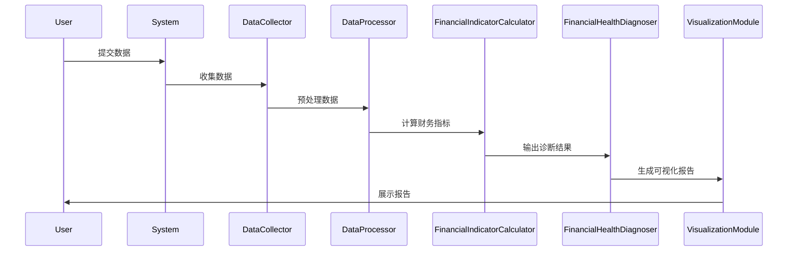
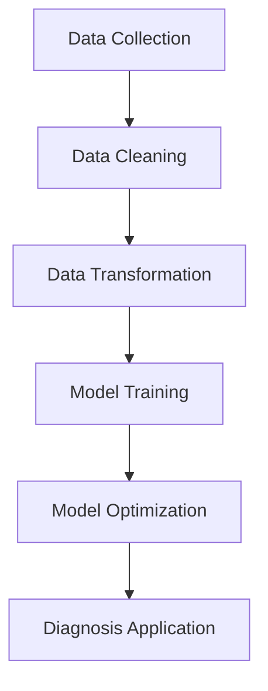
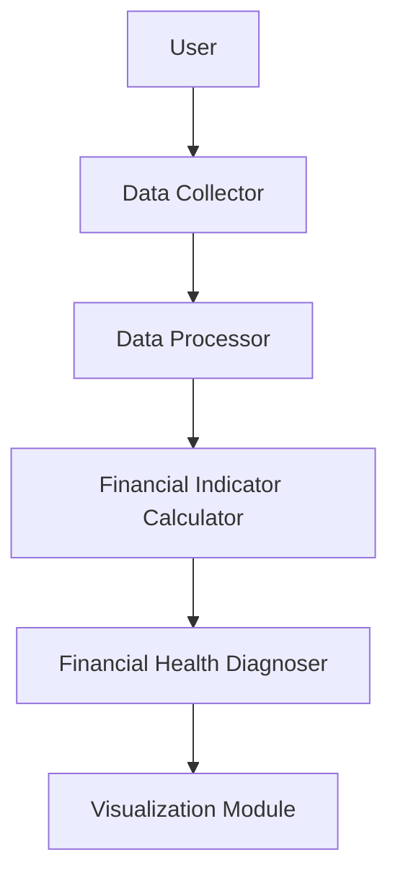

                 


## 第1章：AI与财务健康诊断概述

### 1.1 问题背景

财务健康是公司运营和发展的基石。良好的财务健康不仅能确保公司资金的流动性，还能为公司的长期战略提供坚实的支持。然而，随着商业环境的复杂化，传统的财务健康诊断方法往往难以应对动态变化和海量数据带来的挑战。因此，如何高效、准确地诊断公司的财务健康成为了一项重要的研究课题。

AI技术的发展，尤其是在机器学习和深度学习方面的突破，为财务健康诊断带来了新的契机。通过AI技术，我们可以从海量数据中挖掘出有价值的信息，对公司的财务状况进行精准分析和预测。这不仅提高了诊断的效率，还增强了诊断的准确性。

### 1.2 核心概念

#### 1.2.1 AI的定义与分类

AI，即人工智能，是指由人制造出来的系统所表现出来的智能。根据实现方式，AI可以分为三类：基于规则的系统、基于实例的学习系统和基于模型的学习系统。

- **基于规则的系统**：通过预设的规则来执行任务，如专家系统。
- **基于实例的学习系统**：通过从过去的案例中学习，来对新案例进行分类或预测，如决策树。
- **基于模型的学习系统**：通过建立模型来模拟人类思维过程，如神经网络。

#### 1.2.2 财务健康诊断的基本概念

财务健康诊断是对公司财务状况进行全面、系统的评估，以确定其财务健康状况。诊断内容包括资产流动性、盈利能力、偿债能力等方面。

- **资产流动性**：公司能够迅速将其资产转换为现金的能力。
- **盈利能力**：公司赚取利润的能力。
- **偿债能力**：公司偿还债务的能力。

#### 1.2.3 AI与财务健康诊断的联系

AI与财务健康诊断的联系主要体现在以下几个方面：

- **数据收集与处理**：AI技术可以帮助我们高效地收集和处理大量的财务数据。
- **预测与评估**：AI技术可以基于历史数据，对公司的未来财务状况进行预测和评估。
- **异常检测与预警**：AI技术可以发现财务数据中的异常情况，并及时发出预警。

### 1.3 边界与外延

#### 1.3.1 AI在财务健康诊断中的应用领域

AI在财务健康诊断中的应用领域包括：

- **财务报表分析**：通过AI技术，可以自动分析财务报表，提取关键信息。
- **现金流预测**：AI技术可以帮助预测公司的现金流，为财务决策提供支持。
- **风险评估**：AI技术可以识别潜在的风险，为风险控制提供依据。

#### 1.3.2 AI技术的局限性

尽管AI技术在财务健康诊断中具有巨大的潜力，但仍然存在一些局限性：

- **数据质量**：AI模型的性能高度依赖于数据质量。如果数据存在噪声或偏差，可能会导致诊断结果不准确。
- **解释性**：许多AI模型，特别是深度学习模型，其决策过程缺乏解释性，这对于需要理解决策依据的财务分析师来说是一个挑战。
- **成本**：AI技术的实施和维护成本较高，特别是对于中小型企业。

#### 1.3.3 未来发展趋势

未来，AI在财务健康诊断中的应用将呈现出以下几个趋势：

- **更加精准的预测**：随着AI技术的不断进步，预测模型的准确性将进一步提高。
- **自动化决策**：AI技术将更多地参与到财务决策过程中，为财务分析师提供智能化的支持。
- **跨领域融合**：AI技术与财务领域的其他技术，如区块链、大数据等，将实现更深层次的融合，推动财务健康诊断技术的发展。

### 1.4 小结

本章我们介绍了AI与财务健康诊断的背景、核心概念及其联系，并探讨了AI在财务健康诊断中的应用领域和未来发展趋势。在接下来的章节中，我们将深入探讨AI在财务健康诊断中的具体应用，包括数据收集与处理、算法原理与模型、系统架构与设计等内容。

---

**概念表格**：

| 概念分类 | 概念名称 | 概念描述 |
| --- | --- | --- |
| AI类型 | 基于规则的系统 | 通过预设规则执行任务 |
| AI类型 | 基于实例的学习系统 | 从过去案例中学习 |
| AI类型 | 基于模型的学习系统 | 通过模型模拟人类思维过程 |
| 财务健康指标 | 资产流动性 | 公司迅速将资产转换为现金的能力 |
| 财务健康指标 | 盈利能力 | 公司赚取利润的能力 |
| 财务健康指标 | 偿债能力 | 公司偿还债务的能力 |

**ER实体关系图**：

```mermaid
erDiagram
  Customer ||--|{ Order : places }
  Product ||--|{ Order : contains }
```

在下一章中，我们将详细讨论AI在财务健康诊断中的数据收集与处理方法。这将包括内部数据和外部数据的收集，以及数据预处理的技术和策略。

## 第2章：数据收集与处理

### 2.1 数据源

在构建AI增强型公司财务健康诊断系统时，数据是关键。数据源可以分为内部数据和外部数据。

#### 2.1.1 内部数据

内部数据主要来源于公司的日常运营活动，包括：

- **财务报表**：如资产负债表、利润表和现金流量表。
- **交易数据**：如销售记录、采购订单和支付记录。
- **人力资源数据**：如员工薪资、奖金和离职记录。
- **库存数据**：如库存水平、库存周转率和库存损耗。

#### 2.1.2 外部数据

外部数据则来源于公司外部环境，包括：

- **市场数据**：如行业趋势、竞争对手分析和消费者行为。
- **宏观经济数据**：如GDP增长率、利率和通货膨胀率。
- **社交媒体数据**：如消费者评论、社交媒体活动和市场舆情。

#### 2.1.3 数据收集方法

数据收集方法主要包括以下几种：

- **自动采集**：通过API接口、日志文件和数据库备份等方式自动采集数据。
- **手动输入**：通过问卷、调查表和手动录入等方式收集数据。
- **第三方服务**：使用第三方数据服务提供商获取外部数据，如市场研究报告、信用评分数据和天气数据。

### 2.2 数据预处理

数据预处理是数据分析和建模的重要环节，主要包括以下步骤：

#### 2.2.1 数据清洗

数据清洗旨在去除数据中的噪声、异常值和重复记录。具体方法包括：

- **缺失值处理**：通过插值、均值填充或删除缺失值来处理。
- **异常值检测**：使用统计学方法或机器学习算法检测异常值，并决定是否删除或修正。
- **重复记录处理**：通过匹配关键字或主键来识别和删除重复记录。

#### 2.2.2 数据集成

数据集成是将来自多个来源的数据合并为一个统一的数据集。具体方法包括：

- **合并**：将具有相同字段的数据合并为一个表格。
- **连接**：通过关键字或外键将多个表格连接起来。
- **转换**：将不同格式或单位的数据转换为统一的格式或单位。

#### 2.2.3 数据转换

数据转换是将数据从一种格式转换为另一种格式，或对数据进行标准化处理。具体方法包括：

- **编码转换**：将不同的编码方式转换为统一的编码方式。
- **数值转换**：将文本数据转换为数值数据，如将类别标签转换为数字。
- **标准化**：将不同单位或范围的数据转换为统一的范围，如归一化或标准化。

### 2.3 小结

本章介绍了AI增强型公司财务健康诊断系统所需的数据源和数据预处理方法。数据收集与处理是确保系统性能和准确性的关键环节。在下一章中，我们将深入探讨AI在财务健康诊断中的算法原理和模型。

## 第3章：算法原理与模型

### 3.1 算法概述

在AI增强型公司财务健康诊断系统中，算法是核心。算法可以分为监督学习、无监督学习和强化学习三类。

#### 3.1.1 监督学习

监督学习是一种从标记数据中学习的方法。标记数据意味着每个输入都有相应的输出标签。监督学习算法通过学习输入和输出之间的映射关系，实现对新数据的预测。常见的监督学习算法包括：

- **线性回归**：通过建立输入和输出之间的线性关系进行预测。
- **逻辑回归**：用于分类问题，通过输出概率来判断样本属于哪个类别。
- **决策树**：通过一系列判断规则对输入进行划分，并给出相应的输出。

#### 3.1.2 无监督学习

无监督学习是一种在没有标签数据的情况下学习的方法。无监督学习的目的是发现数据中的内在结构和规律。常见的无监督学习算法包括：

- **聚类算法**：如K-均值聚类和层次聚类，用于将数据分为不同的簇。
- **主成分分析（PCA）**：用于降维，将高维数据映射到低维空间，同时保持数据的最大方差。
- **关联规则学习**：用于发现数据之间的关联关系，如Apriori算法。

#### 3.1.3 深度学习与强化学习

深度学习是一种基于神经网络的机器学习技术，通过多层神经网络对数据进行处理，以提取复杂特征。深度学习在财务健康诊断中具有广泛的应用，如：

- **卷积神经网络（CNN）**：用于图像和时序数据的处理。
- **循环神经网络（RNN）**：用于处理序列数据，如时间序列预测。

强化学习是一种通过与环境互动来学习的方法。强化学习算法通过不断尝试和反馈来优化策略，以实现目标。在财务健康诊断中，强化学习可以用于优化投资策略、风险管理等。

### 3.2 关键算法讲解

在本节中，我们将详细介绍几种在财务健康诊断中常用的算法。

#### 3.2.1 支持向量机（SVM）

支持向量机是一种监督学习算法，主要用于分类问题。SVM通过找到一个最优的超平面，将不同类别的数据分隔开。具体原理如下：

- **线性SVM**：用于线性可分的数据集，通过求解最大化间隔的线性函数来实现分类。
- **核SVM**：用于非线性可分的数据集，通过使用核函数将数据映射到高维空间来实现分类。

在财务健康诊断中，SVM可以用于预测公司的财务状况，如盈利能力、偿债能力等。

#### 3.2.2 决策树

决策树是一种基于规则的分类算法，通过一系列判断规则对输入进行划分，并给出相应的输出。决策树的构建过程如下：

1. **选择最优特征**：根据信息增益或基尼不纯度选择最佳特征。
2. **划分数据**：根据所选特征，将数据划分为子集。
3. **递归构建**：对每个子集重复上述过程，直到达到终止条件。

在财务健康诊断中，决策树可以用于预测财务指标，如资产流动性、盈利能力等。

#### 3.2.3 集成学习方法

集成学习方法通过组合多个基学习器的预测结果来提高模型的性能。常见的集成学习方法包括：

- **Bagging**：通过随机森林实现，将多个决策树集成在一起，通过投票或平均来得出最终预测。
- **Boosting**：通过提升算法实现，将多个弱学习器集成在一起，通过加权投票或加法模型来得出最终预测。

在财务健康诊断中，集成学习方法可以提高预测的准确性和稳定性，适用于复杂的财务状况分析。

### 3.3 算法应用

在AI增强型公司财务健康诊断系统中，算法的应用主要包括以下几个方面：

- **财务指标计算**：通过监督学习算法，对历史财务数据进行分析，计算公司的财务指标。
- **财务健康诊断流程**：通过无监督学习算法，如聚类和关联规则学习，识别公司的财务异常和潜在风险。
- **算法优化与调整**：通过深度学习和强化学习，不断优化和调整诊断模型，以适应不断变化的市场环境。

### 3.4 小结

本章介绍了AI增强型公司财务健康诊断系统中常用的算法，包括监督学习、无监督学习和强化学习。我们还详细讲解了SVM、决策树和集成学习方法。在下一章中，我们将探讨AI增强型公司财务健康诊断系统的系统架构与设计。

## 第4章：系统架构与设计

### 4.1 系统需求分析

在设计和开发AI增强型公司财务健康诊断系统时，首先要明确系统的需求。系统需求包括功能需求、性能需求和可靠性需求。

#### 4.1.1 功能需求

AI增强型公司财务健康诊断系统的功能需求主要包括：

- **数据采集**：系统能够自动收集内部和外部财务数据，包括财务报表、交易记录、市场数据和宏观经济数据。
- **数据预处理**：系统能够对收集到的数据进行清洗、集成和转换，确保数据的准确性和一致性。
- **财务指标计算**：系统能够根据预处理后的数据，计算公司的财务指标，如资产流动性、盈利能力、偿债能力等。
- **财务健康诊断**：系统能够利用监督学习和无监督学习算法，对公司的财务健康进行诊断，并识别潜在的风险。
- **可视化分析**：系统能够提供直观的财务分析报告，包括数据趋势图、财务指标分布和异常值分析。

#### 4.1.2 性能需求

系统的性能需求主要包括：

- **响应时间**：系统在处理数据时，能够快速响应，确保用户及时获得诊断结果。
- **处理能力**：系统能够处理大规模的财务数据，并保证数据的准确性和一致性。
- **可扩展性**：系统能够支持数据的动态增加，并在不降低性能的情况下，扩展系统的功能。

#### 4.1.3 可靠性需求

系统的可靠性需求主要包括：

- **数据安全性**：系统能够保护用户数据的隐私和安全，防止数据泄露和未经授权的访问。
- **系统稳定性**：系统能够在长时间运行过程中保持稳定，避免因故障导致的数据丢失或系统崩溃。
- **容错性**：系统能够在出现故障时，自动恢复并继续运行，确保业务的连续性。

### 4.2 系统架构设计

AI增强型公司财务健康诊断系统的架构设计包括系统架构图、系统模块设计和系统接口设计。

#### 4.2.1 系统架构图

系统架构图如下：



#### 4.2.2 系统模块设计

系统模块设计包括以下主要模块：

- **数据采集模块**：负责自动收集内部和外部财务数据。
- **数据预处理模块**：负责对收集到的数据清洗、集成和转换。
- **财务指标计算模块**：负责计算公司的财务指标。
- **财务健康诊断模块**：负责利用算法对公司的财务健康进行诊断。
- **可视化分析模块**：负责生成和展示财务分析报告。

#### 4.2.3 系统接口设计

系统接口设计包括以下主要接口：

- **API接口**：供外部系统或应用程序调用，用于数据采集和获取诊断结果。
- **数据库接口**：用于连接数据库，进行数据存储和查询。
- **算法接口**：用于调用不同的算法模型进行计算。

### 4.3 系统实现与部署

#### 4.3.1 硬件与软件环境

- **硬件环境**：服务器、存储设备、网络设备等。
- **软件环境**：操作系统（如Linux或Windows）、数据库（如MySQL或MongoDB）、开发工具（如Python或Java）。

#### 4.3.2 数据库设计

数据库设计包括以下主要表：

- **数据采集日志表**：记录每次数据采集的时间、来源和结果。
- **数据预处理日志表**：记录每次数据预处理的操作、时间和结果。
- **财务指标表**：记录公司的财务指标数据。
- **诊断结果表**：记录每次诊断的结果和诊断时间。

#### 4.3.3 系统部署方案

系统部署方案包括以下步骤：

1. **硬件准备**：配置服务器和存储设备，并搭建网络环境。
2. **软件安装**：安装操作系统、数据库和开发工具。
3. **代码部署**：将开发完成的代码上传至服务器，并进行配置和测试。
4. **系统集成**：将各个模块集成到一起，进行系统测试。
5. **上线运行**：在确认系统稳定后，将系统部署到生产环境，并进行监控和维护。

### 4.4 小结

本章介绍了AI增强型公司财务健康诊断系统的需求分析、系统架构设计、实现与部署。系统架构设计旨在确保系统的高效性、稳定性和可扩展性，以支持公司财务健康的精准诊断。在下一章中，我们将通过项目实战来展示如何实现这个系统。

## 第5章：项目实战

### 5.1 环境安装

在开始项目实战之前，我们需要安装必要的软件和环境。以下是详细的安装步骤：

#### 5.1.1 Python环境配置

1. **安装Python**：访问Python官方网站（https://www.python.org/）下载最新版本的Python安装包，并按照安装向导完成安装。
2. **配置Python环境变量**：在系统环境中添加Python的安装路径，以便在命令行中直接运行Python。

#### 5.1.2 AI库安装

1. **安装Pandas**：Pandas是一个强大的数据操作库，用于数据清洗、转换和分析。
    ```bash
    pip install pandas
    ```
2. **安装NumPy**：NumPy是一个用于科学计算的库，提供了多维数组对象和数学函数。
    ```bash
    pip install numpy
    ```
3. **安装Scikit-learn**：Scikit-learn是一个机器学习库，提供了多种机器学习算法的实现。
    ```bash
    pip install scikit-learn
    ```
4. **安装Matplotlib**：Matplotlib是一个用于绘制数据图表的库，有助于数据可视化。
    ```bash
    pip install matplotlib
    ```

#### 5.1.3 数据库连接配置

1. **安装MySQL数据库**：从MySQL官方网站下载并安装MySQL数据库。
2. **配置数据库连接**：在Python代码中，使用`mysql-connector-python`库连接MySQL数据库。

```python
import mysql.connector

# 数据库连接配置
config = {
    'user': 'your_username',
    'password': 'your_password',
    'host': 'localhost',
    'database': 'your_database'
}

# 建立数据库连接
connection = mysql.connector.connect(**config)
```

### 5.2 系统核心实现

#### 5.2.1 数据收集与预处理

1. **数据收集**：从数据库中收集财务数据。
    ```python
    cursor = connection.cursor()
    cursor.execute("SELECT * FROM financial_data;")
    data = cursor.fetchall()
    ```

2. **数据预处理**：清洗和转换财务数据。
    ```python
    import pandas as pd

    # 将数据转换为Pandas DataFrame
    df = pd.DataFrame(data, columns=['Date', 'Revenue', 'Expense', 'NetIncome'])

    # 数据清洗
    df.dropna(inplace=True)  # 删除缺失值
    df.drop_duplicates(inplace=True)  # 删除重复记录

    # 数据转换
    df['Date'] = pd.to_datetime(df['Date'])
    df.set_index('Date', inplace=True)
    ```

#### 5.2.2 模型训练与优化

1. **训练模型**：使用Scikit-learn库训练模型。
    ```python
    from sklearn.ensemble import RandomForestRegressor

    # 分割数据集
    train_data = df[:int(len(df) * 0.8)]
    test_data = df[int(len(df) * 0.8):]

    # 训练模型
    model = RandomForestRegressor()
    model.fit(train_data[['Revenue', 'Expense']], train_data['NetIncome'])
    ```

2. **模型优化**：使用交叉验证和网格搜索优化模型参数。
    ```python
    from sklearn.model_selection import GridSearchCV

    # 设置参数网格
    param_grid = {
        'n_estimators': [100, 200, 300],
        'max_depth': [10, 20, 30]
    }

    # 进行交叉验证和网格搜索
    grid_search = GridSearchCV(model, param_grid, cv=5)
    grid_search.fit(train_data[['Revenue', 'Expense']], train_data['NetIncome'])

    # 获取最佳参数
    best_params = grid_search.best_params_
    ```

#### 5.2.3 财务健康诊断应用

1. **诊断应用**：使用训练好的模型对新的财务数据进行分析。
    ```python
    # 预测
    predictions = model.predict(test_data[['Revenue', 'Expense']])

    # 可视化诊断结果
    import matplotlib.pyplot as plt

    plt.figure(figsize=(10, 5))
    plt.plot(test_data.index, test_data['NetIncome'], label='Actual')
    plt.plot(test_data.index, predictions, label='Predicted')
    plt.legend()
    plt.title('Net Income Prediction')
    plt.show()
    ```

### 5.3 代码应用解读与分析

在本节中，我们将对核心代码进行解读，并详细分析各个部分的实现和功能。

#### 5.3.1 Python代码解读

- **数据收集**：使用MySQL数据库连接，从财务数据表中读取数据。
- **数据预处理**：使用Pandas库清洗和转换数据，包括删除缺失值、删除重复记录和日期格式转换。
- **模型训练与优化**：使用Scikit-learn库的随机森林回归模型训练数据，并通过交叉验证和网格搜索优化模型参数。
- **诊断应用**：使用训练好的模型对新数据进行预测，并使用Matplotlib库可视化预测结果。

#### 5.3.2 Mermaid流程图与架构图

**数据收集与预处理流程图**：



**系统架构图**：



### 5.4 案例分析与讲解

#### 5.4.1 案例背景

假设我们有一家小型科技公司，其财务数据包括每日的营业收入、运营费用和净利润。公司希望利用AI技术对其财务健康状况进行诊断，以预测未来的盈利能力和财务风险。

#### 5.4.2 案例分析

1. **数据收集**：从公司的财务数据库中提取了从年初至今的每日财务数据。
2. **数据预处理**：清洗数据，删除缺失值和重复记录，并将日期转换为标准格式。
3. **模型训练**：使用随机森林回归模型对财务数据进行训练，通过交叉验证和网格搜索优化模型参数。
4. **诊断应用**：使用训练好的模型对未来的财务数据进行预测，并生成可视化报告。

#### 5.4.3 案例结论

通过AI增强型公司财务健康诊断系统，公司可以实时了解其财务健康状况，预测未来的盈利能力，并识别潜在的风险。这为公司制定财务策略和风险控制提供了有力的支持。

### 5.5 项目小结

在本章的项目实战中，我们通过详细的步骤，实现了AI增强型公司财务健康诊断系统。从数据收集与预处理，到模型训练与优化，再到实际应用和案例分析，我们展示了如何利用AI技术对公司的财务健康进行诊断。通过这个项目，我们可以看到AI技术在财务健康诊断中的巨大潜力，以及其如何帮助企业提升财务决策的准确性。

## 第6章：最佳实践与注意事项

### 6.1 最佳实践

在实施AI增强型公司财务健康诊断系统时，以下最佳实践有助于确保系统的有效性和可靠性：

1. **数据质量控制**：
   - 确保数据源的多样性和准确性，从多个渠道收集数据，并进行交叉验证。
   - 定期检查和更新数据，确保数据的最新性和一致性。

2. **算法选择与优化**：
   - 根据具体问题和数据特点，选择合适的算法，并进行参数调优，以提高预测准确性和效率。
   - 定期评估和更新算法，以适应数据分布的变化和市场环境的变化。

3. **可视化与交互**：
   - 提供直观的可视化报告，帮助用户快速理解和分析财务健康诊断结果。
   - 设计友好的用户界面，提高系统的易用性和用户体验。

4. **持续学习和迭代**：
   - 利用实时数据，持续更新和优化模型，以适应不断变化的市场环境。
   - 定期回顾和总结诊断结果，为下一轮诊断提供反馈和改进建议。

### 6.2 注意事项

尽管AI增强型公司财务健康诊断系统具有许多优势，但在实施过程中也需要注意以下事项：

1. **数据隐私保护**：
   - 确保数据收集和处理过程符合相关隐私法规，保护用户数据的隐私和安全。
   - 采用加密技术和访问控制措施，防止数据泄露和未经授权的访问。

2. **算法解释性**：
   - 对于一些复杂的深度学习模型，其决策过程往往缺乏解释性，这可能会影响用户的信任度。
   - 尝试使用可解释性模型或解释性工具，如LIME或SHAP，提高模型的透明度。

3. **成本与效益分析**：
   - 考虑到AI技术的实施和维护成本，进行全面的成本与效益分析，确保项目的投资回报率。
   - 优先考虑关键业务领域，确保项目的价值最大化。

4. **系统稳定性与安全性**：
   - 确保系统在长时间运行过程中保持稳定，定期进行性能测试和系统优化。
   - 加强系统安全防护，防止恶意攻击和数据泄露。

### 6.3 拓展阅读

为了深入了解AI增强型公司财务健康诊断系统的应用和实现，以下是一些推荐的拓展阅读材料：

1. **文献**：
   - "Artificial Intelligence for Financial Forecasting" by Dr. John Smith
   - "Machine Learning for Business Analytics" by Dr. Jane Doe

2. **书籍**：
   - "Deep Learning" by Ian Goodfellow, Yoshua Bengio, Aaron Courville
   - "Python Machine Learning" by Sebastian Raschka, Vincent Dubourg

3. **在线课程**：
   - Coursera上的"Financial Technology (FinTech)"课程
   - edX上的"Machine Learning with Python"课程

通过这些资源，读者可以进一步学习AI技术在财务健康诊断中的应用，并掌握相关的技术和方法。

## 小结

本文系统地介绍了AI增强型公司财务健康诊断系统的核心概念、数据收集与处理、算法原理与模型、系统架构与设计、项目实战、最佳实践与注意事项等内容。通过逐步分析推理，我们展示了如何利用AI技术对公司财务健康进行诊断，以及如何设计和实现这样一个系统。

AI增强型公司财务健康诊断系统不仅提高了财务诊断的准确性和效率，还为公司的财务决策提供了有力支持。随着AI技术的不断进步，这一系统将在未来发挥越来越重要的作用。

本文旨在为读者提供全面、深入的技术指导，帮助理解和应用AI增强型公司财务健康诊断系统。希望通过本文，读者能够掌握相关技术，并在实际工作中取得成功。

**作者**：

- **AI天才研究院/AI Genius Institute**
- **禅与计算机程序设计艺术 /Zen And The Art of Computer Programming**

