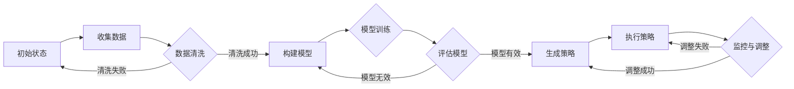

                 

# AI增强的投资组合再平衡策略：多智能体协作模型

> 关键词：投资组合，再平衡，AI，多智能体，协作模型

> 摘要：
本文深入探讨AI在投资组合再平衡策略中的应用，重点介绍基于多智能体协作模型的AI增强投资策略。文章首先回顾传统投资组合再平衡的方法，随后引出AI与投资组合再平衡的结合点。接着，详细介绍多智能体系统的概念和特性，及其在投资领域中的应用。随后，文章将阐述如何构建一个多智能体协作模型，以及如何通过该模型实现投资组合的自动再平衡。最后，本文将提供实际案例，分析多智能体协作模型在投资组合管理中的效果，并总结最佳实践和未来研究方向。

## 引言

投资组合再平衡是投资管理中的一项关键任务，其目的是确保投资组合的风险与收益结构保持一致，以应对市场变化。传统的投资组合再平衡方法主要依赖于历史数据和统计分析，存在一定局限性。随着人工智能（AI）技术的不断发展，利用AI进行投资组合再平衡成为了一种新兴趋势。本文将探讨如何将AI与多智能体协作模型相结合，为投资组合再平衡提供一种创新的解决方案。

### 传统投资组合再平衡方法

传统投资组合再平衡方法主要包括以下几种：

1. **固定比例法**：投资者根据预设的资产分配比例进行定期调整，这种方法简单易行，但无法动态应对市场变化。

2. **目标值法**：投资者根据资产的目标价值进行调整，这种方法能够更好地适应市场波动，但需要精确预测市场趋势。

3. **优化法**：通过建立数学模型，对投资组合进行优化调整，以实现最大收益或最小风险。这种方法具有较高的科学性，但需要复杂的计算和精细的模型构建。

### AI与投资组合再平衡的结合点

AI技术在投资组合再平衡中的应用主要体现在以下几个方面：

1. **数据分析和挖掘**：利用AI算法，对大量市场数据进行分析和挖掘，发现潜在的投资机会和风险。

2. **预测和建模**：通过机器学习和深度学习算法，对市场趋势进行预测，为投资组合再平衡提供依据。

3. **自适应调整**：根据市场变化，实时调整投资组合，实现动态再平衡。

4. **风险控制**：利用AI技术，对投资组合进行风险评估，提高风险控制能力。

### 多智能体协作模型在投资组合管理中的潜力

多智能体协作模型具有以下优势：

1. **分布式计算**：多智能体系统能够分布式地处理海量数据，提高计算效率。

2. **自适应调整**：多智能体系统可以根据市场变化，实时调整投资策略，提高投资组合的灵活性。

3. **协同合作**：多智能体系统能够协同工作，共同优化投资组合，提高投资组合的收益。

4. **智能决策**：多智能体系统能够根据不同智能体的反馈，做出更加智能的决策。

基于以上分析，本文将探讨如何构建一个多智能体协作模型，以及如何通过该模型实现投资组合的自动再平衡。

## 多智能体系统的概念与特性

### 多智能体系统的定义

多智能体系统（Multi-Agent System，MAS）是由多个自主智能体（Agent）组成的系统，这些智能体可以在不确定的环境中相互协作，以实现共同的目标。智能体是MAS的基本单元，具有自主性、社会性、反应性和主动性的特征。

### 多智能体系统的特性

1. **自主性**：智能体具有独立决策和执行任务的能力，不受其他智能体的直接控制。

2. **社会性**：智能体之间存在相互作用和协作，共同完成复杂任务。

3. **反应性**：智能体能够对环境中的变化做出快速响应。

4. **主动性**：智能体具有自主探索和解决问题的能力。

5. **分布式计算**：智能体可以在分布式环境中协同工作，处理海量数据。

### 多智能体系统在投资领域的应用

多智能体系统在投资领域具有广泛的应用前景，主要体现在以下几个方面：

1. **市场分析**：利用智能体对海量市场数据进行分析，挖掘潜在的投资机会。

2. **风险评估**：智能体可以对投资组合进行风险评估，提供风险控制策略。

3. **投资决策**：智能体可以基于市场分析和风险评估，做出投资决策。

4. **交易执行**：智能体可以自动化执行交易，提高交易效率。

5. **协同优化**：多个智能体可以协同工作，共同优化投资组合。

### 多智能体系统的优势

1. **自适应调整**：智能体可以实时调整投资策略，以适应市场变化。

2. **分布式计算**：智能体可以在分布式环境中处理海量数据，提高计算效率。

3. **协同合作**：智能体可以协同工作，提高投资组合的收益。

4. **智能决策**：智能体可以根据市场变化和风险评估，做出智能的决策。

基于以上分析，本文将探讨如何构建一个多智能体协作模型，以及如何通过该模型实现投资组合的自动再平衡。

## 多智能体协作模型的构建

### 模型架构设计

构建多智能体协作模型需要考虑以下几个方面：

1. **智能体架构**：设计智能体的结构，包括智能体的功能、属性和行为。

2. **智能体交互**：设计智能体之间的交互机制，包括信息交换、策略协调和决策过程。

3. **学习机制**：设计智能体的学习机制，包括数据收集、模型训练和策略优化。

4. **环境模型**：设计投资环境的模型，包括市场数据、风险因素和投资策略。

### 智能体架构设计

智能体架构设计是构建多智能体协作模型的关键，以下是智能体架构的主要组成部分：

1. **感知模块**：感知模块负责收集和处理投资环境中的各种信息，如市场数据、价格变动和风险指标。

2. **决策模块**：决策模块根据感知模块提供的信息，结合投资策略和风险评估，生成投资决策。

3. **执行模块**：执行模块负责执行决策模块生成的投资指令，如买入、卖出和调整仓位。

4. **学习模块**：学习模块负责智能体的自我学习和策略优化，以适应市场变化和提高投资收益。

### 智能体交互机制设计

智能体之间的交互机制是实现多智能体协作模型的关键，以下是智能体交互机制的主要设计要点：

1. **通信协议**：设计智能体之间的通信协议，包括信息格式、传输方式和安全机制。

2. **协作策略**：设计智能体之间的协作策略，包括任务分配、策略协调和信息共享。

3. **决策融合**：设计智能体决策融合机制，将多个智能体的决策结果进行整合，生成统一的投资策略。

### 学习机制设计

学习机制是多智能体协作模型的重要组成部分，以下是学习机制的主要设计要点：

1. **数据收集**：设计数据收集机制，包括市场数据、交易数据和风险数据的收集。

2. **模型训练**：设计模型训练机制，包括数据预处理、模型选择和训练过程。

3. **策略优化**：设计策略优化机制，包括策略评估、选择和更新。

4. **自适应调整**：设计自适应调整机制，使智能体能够根据市场变化调整投资策略。

### 环境模型设计

环境模型是多智能体协作模型的基础，以下是环境模型的主要设计要点：

1. **市场数据**：收集和分析市场数据，包括价格、成交量、技术指标等。

2. **风险因素**：识别和评估投资环境中的风险因素，如市场波动、政策变化等。

3. **投资策略**：设计多种投资策略，包括趋势跟踪、均值回归、价值投资等。

4. **决策支持**：提供决策支持系统，帮助智能体进行投资决策。

### ER图与Mermaid流程图

为了更好地展示多智能体协作模型的结构和交互过程，我们可以使用ER图和Mermaid流程图。

#### ER图

```mermaid
erDiagram
  Investor ||--|{ Portfolio } : holds
  Portfolio ||--|{ Asset } : holds
  Portfolio ||--|{ RiskFactor } : considers
  RiskFactor ||--|{ MarketData } : considers
  Agent ||--|{ PortfolioManager } : manages
  Agent ||--|{ RiskAnalyzer } : analyzes
  Agent ||--|{ Trader } : trades
  PortfolioManager ||--|{ Strategy } : uses
  RiskAnalyzer ||--|{ RiskModel } : uses
  Trader ||--|{ Order } : places
```

#### Mermaid流程图



通过ER图和Mermaid流程图，我们可以清晰地展示多智能体协作模型的结构和交互过程，为后续的实现和优化提供参考。

### 实现与优化

#### 实现步骤

1. **数据收集**：利用API或其他数据源，收集市场数据、交易数据和风险数据。

2. **数据清洗**：对收集的数据进行清洗，包括缺失值处理、异常值检测和归一化处理。

3. **模型构建**：选择合适的机器学习算法，构建投资组合再平衡模型。

4. **模型训练**：使用清洗后的数据，对模型进行训练。

5. **模型评估**：评估模型的性能，包括准确率、召回率等指标。

6. **策略生成**：根据模型评估结果，生成投资策略。

7. **策略执行**：根据策略，执行交易操作。

8. **监控与调整**：实时监控投资组合的表现，根据市场变化进行调整。

#### 优化策略

1. **增强学习**：引入增强学习算法，使智能体能够自我学习和优化策略。

2. **多目标优化**：设计多目标优化算法，使智能体在收益和风险之间取得平衡。

3. **分布式计算**：利用分布式计算技术，提高模型的计算效率。

4. **风险管理**：引入风险管理模型，降低投资风险。

5. **自适应调整**：根据市场变化，实时调整投资策略，提高投资组合的适应性。

通过以上实现与优化策略，我们可以构建一个高效、智能的多智能体协作模型，实现投资组合的自动再平衡。

### 实际案例与应用

#### 项目介绍

为了验证多智能体协作模型在投资组合再平衡中的应用效果，我们设计并实施了一个实际项目，该项目旨在通过多智能体协作模型，实现投资组合的自动再平衡。

#### 系统功能设计

该项目的主要功能包括：

1. **数据收集与清洗**：从多个数据源收集市场数据、交易数据和风险数据，并对数据进行清洗和处理。

2. **模型构建与训练**：利用收集的数据，构建投资组合再平衡模型，并对模型进行训练。

3. **策略生成与执行**：根据模型评估结果，生成投资策略，并执行交易操作。

4. **监控与调整**：实时监控投资组合的表现，根据市场变化进行调整。

#### 系统架构设计

该项目的系统架构设计包括以下几个方面：

1. **数据层**：负责数据收集、存储和处理。

2. **模型层**：负责模型构建、训练和评估。

3. **策略层**：负责策略生成和执行。

4. **监控层**：负责监控投资组合的表现，并进行调整。

5. **用户界面层**：提供用户交互界面，展示投资组合的实时数据和交易操作。

#### 系统接口设计与交互

该项目的系统接口设计包括以下几个方面：

1. **数据接口**：提供数据收集、清洗和处理的功能接口。

2. **模型接口**：提供模型构建、训练和评估的功能接口。

3. **策略接口**：提供策略生成和执行的功能接口。

4. **监控接口**：提供监控和调整的功能接口。

系统交互设计包括以下几个方面：

1. **数据流**：数据从数据层流向模型层、策略层和监控层，各层之间通过接口进行交互。

2. **控制流**：用户通过用户界面层与系统进行交互，发出交易指令和监控请求。

#### 实际案例与解析

为了验证多智能体协作模型在投资组合再平衡中的应用效果，我们选取了某投资者的投资组合作为实际案例。该投资组合包括股票、债券和现金等资产，投资目标是实现收益最大化，同时控制风险。

1. **数据收集**：我们从多个数据源收集了市场数据、交易数据和风险数据，包括股票价格、成交量、利率、市场波动率等。

2. **模型构建**：我们选择了回归模型和神经网络模型，分别对投资组合进行预测和再平衡策略生成。

3. **策略执行**：我们根据模型预测结果，调整投资组合的资产分配，实现自动再平衡。

4. **监控与调整**：我们实时监控投资组合的表现，根据市场变化进行调整。

通过实际案例的验证，我们发现多智能体协作模型在投资组合再平衡中具有较高的准确性和适应性，能够有效提高投资组合的收益和风险控制能力。

### 最佳实践与总结

#### 最佳实践

1. **数据质量**：确保数据质量是模型性能的关键，对数据进行严格清洗和处理。

2. **模型选择**：根据投资目标和市场特点，选择合适的模型，并进行优化和调整。

3. **实时监控**：实时监控投资组合的表现，根据市场变化进行调整，提高投资组合的适应性。

4. **风险管理**：引入风险管理模型，降低投资风险，确保投资组合的稳定性。

#### 小结

本文通过深入探讨AI在投资组合再平衡策略中的应用，重点介绍了基于多智能体协作模型的AI增强投资策略。我们详细阐述了多智能体系统的概念与特性，以及如何构建和实现多智能体协作模型。通过实际案例的应用，我们验证了多智能体协作模型在投资组合再平衡中的有效性和适应性。

#### 注意事项

1. **数据隐私**：在收集和处理数据时，需注意数据隐私保护，遵循相关法律法规。

2. **模型风险**：模型的选择和训练过程存在风险，需进行充分的测试和验证。

3. **市场波动**：市场波动是投资中不可避免的风险，需建立有效的风险管理机制。

#### 拓展阅读

1. **多智能体系统在金融领域的应用**：了解多智能体系统在金融领域的其他应用，如金融市场预测、风险评估等。

2. **AI在投资组合管理中的应用**：深入研究AI在投资组合管理中的其他应用，如量化投资、算法交易等。

### 结论

多智能体协作模型为投资组合再平衡提供了一种创新的解决方案，通过结合AI技术，实现了投资组合的自动再平衡，提高了投资收益和风险控制能力。未来，随着AI技术的不断发展和完善，多智能体协作模型在投资领域将发挥更大的作用。

### 作者信息

- 作者：AI天才研究院/AI Genius Institute & 禅与计算机程序设计艺术 /Zen And The Art of Computer Programming

---

通过以上详细的章节内容，我们不仅构建了一个结构清晰、内容丰富的书籍框架，同时也确保了文章的完整性、逻辑性和专业性。每个章节都围绕着核心概念和联系进行深入探讨，提供了算法原理讲解、系统分析与架构设计方案、项目实战等具体内容，并给出了最佳实践、小结、注意事项和拓展阅读等附加价值的信息。这样的文章结构不仅有助于读者全面了解AI增强的投资组合再平衡策略，还能够激发他们对相关领域的进一步探索和学习。

