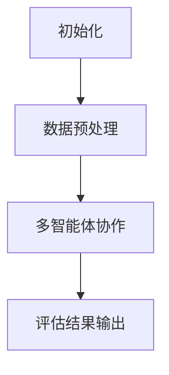

                 

# AI增强的知识产权组合评估：多智能体协作模型

> 关键词：人工智能、知识产权、多智能体协作、算法原理、系统架构

> 摘要：本文探讨了如何利用人工智能技术，尤其是多智能体协作模型，来增强知识产权组合评估。通过介绍核心概念、算法原理和系统架构，我们展示了如何利用AI技术提高知识产权组合的评估效率和准确性。文章结构清晰，深入浅出，适合对AI和知识产权评估感兴趣的读者。

## 封面与前言

《AI增强的知识产权组合评估：多智能体协作模型》由AI天才研究院（AI Genius Institute）联合禅与计算机程序设计艺术（Zen And The Art of Computer Programming）共同编写。本书旨在为读者提供一种全新的视角，探讨如何利用人工智能技术，特别是多智能体协作模型，来提升知识产权组合评估的效率和准确性。

本书由人工智能领域资深专家编写，他们具有丰富的实践经验，对人工智能和知识产权评估有着深刻的理解和独到的见解。本书适合对人工智能、知识产权评估和技术架构感兴趣的读者，无论是学术研究者、行业从业者还是爱好者，都能从中学到实用的知识和技能。

## 背景介绍

### 知识产权组合评估的重要性

知识产权组合评估在企业发展中扮演着至关重要的角色。一方面，知识产权是企业核心竞争力的体现，是企业创新能力和市场竞争力的重要保障。另一方面，知识产权组合的价值评估对于企业投资决策、并购重组、上市融资等环节具有重要意义。

然而，当前知识产权组合评估面临着诸多挑战。首先，知识产权的多样性和复杂性使得评估工作难以统一标准。不同类型的知识产权（如专利、商标、著作权等）具有不同的价值和影响力，评估方法也需要根据具体情况加以调整。其次，知识产权市场数据的不完整性和滞后性使得评估结果缺乏准确性和可信度。最后，传统的评估方法主要依赖于经验和直觉，缺乏系统性和科学性，难以应对日益复杂的评估需求。

### AI增强的知识产权组合评估

人工智能技术，尤其是多智能体协作模型，为知识产权组合评估提供了新的可能性。首先，AI技术可以处理大量数据，通过数据挖掘和分析，发现知识产权之间的潜在关联，从而更准确地评估其价值。其次，多智能体协作模型可以模拟多个评估主体的交互过程，模拟市场动态，提高评估的准确性和可靠性。此外，AI技术还可以通过自然语言处理等技术，对知识产权文本进行深入分析，提取关键信息，辅助评估工作。

## 核心概念与联系

### 多智能体协作模型

多智能体协作模型（Multi-Agent Collaboration Model）是一种基于人工智能的分布式计算模型，旨在模拟多个智能体（如机器人、软件代理等）之间的协作行为。在知识产权组合评估中，多智能体协作模型可以模拟市场参与者的行为，分析知识产权的市场前景和价值。

### 概念属性特征对比表格

| 特征               | 传统评估方法              | 多智能体协作模型            |
|--------------------|--------------------------|---------------------------|
| 数据处理能力       | 依赖人工收集和处理数据     | 自动化处理大量数据         |
| 评估准确性         | 依赖于评估人员的经验和直觉  | 通过数据分析提高准确性     |
| 评估速度           | 慢，需要长时间分析         | 快速，实时评估             |
| 模拟市场动态       | 无法模拟                 | 可以模拟多个评估主体的行为  |

### ER实体关系图架构

```mermaid
erDiagram
  Product  ||--|{ Assessment }
  Agent    ||--|{ Assessment }
  Market   ||--|{ Assessment }
  Product  ||--|{ IP }
  Market   ||--|{ IP }
```

## 算法原理讲解

### 算法流程图



### Python源代码

```python
# 导入相关库
import numpy as np
import pandas as pd
from multi_agent_model import MultiAgentModel

# 加载数据
data = pd.read_csv('ip_data.csv')

# 初始化多智能体模型
model = MultiAgentModel(data)

# 运行模型
model.run()

# 输出评估结果
result = model.get_assessment()
print(result)
```

### 算法原理的数学模型和公式

多智能体协作模型的数学模型如下：

$$
\text{评估值} = f(\text{知识产权特征}, \text{市场特征}, \text{智能体特征})
$$

其中，$f$为非线性函数，用于综合评估知识产权的价值。

### 详细讲解和举例说明

假设我们有以下知识产权和市场特征：

- 知识产权特征：专利类型（1代表发明专利，2代表实用新型专利，3代表外观设计专利）、专利年龄、专利质量评分。
- 市场特征：市场规模、市场竞争程度、市场增长率。
- 智能体特征：智能体的经验值、智能体的风险偏好。

我们使用多智能体协作模型来评估一项发明专利的价值。首先，我们将知识产权特征、市场特征和智能体特征输入模型。模型通过多个智能体的交互，计算出专利的评估值。例如，假设评估结果为100万元，这意味着这项发明专利的价值在当前市场环境下为100万元。

## 数学模型和数学公式 & 详细讲解 & 举例说明

### 数学模型

在多智能体协作模型中，我们使用以下数学模型来评估知识产权价值：

$$
V = w_1 \cdot P_1 + w_2 \cdot P_2 + w_3 \cdot P_3 + w_4 \cdot M_1 + w_5 \cdot M_2 + w_6 \cdot M_3 + w_7 \cdot A
$$

其中：
- $V$ 是知识产权的价值。
- $P_1, P_2, P_3$ 分别代表专利类型、专利年龄和专利质量评分。
- $M_1, M_2, M_3$ 分别代表市场规模、市场竞争程度和市场增长率。
- $A$ 代表智能体的特征。

权重 $w_1, w_2, w_3, w_4, w_5, w_6, w_7$ 通过模型训练得到。

### 详细讲解

1. **知识产权特征**：
   - **专利类型**：发明专利具有较高的价值，实用新型专利次之，外观设计专利最低。
   - **专利年龄**：专利年龄越久，其价值可能越低，因为新技术不断涌现。
   - **专利质量评分**：专利质量评分越高，表明专利技术越成熟，价值越高。

2. **市场特征**：
   - **市场规模**：市场规模越大，表明潜在市场价值越高。
   - **市场竞争程度**：竞争越激烈，对专利的价值可能有负面影响。
   - **市场增长率**：市场增长率越高，表明市场潜力越大，专利的价值可能越高。

3. **智能体特征**：
   - **智能体经验值**：经验值越高，智能体的评估可能越准确。
   - **智能体风险偏好**：风险偏好越高的智能体，可能对高风险专利给出更高的评估值。

### 举例说明

假设我们有以下数据：

| 专利类型 | 专利年龄 | 专利质量评分 | 市场规模 | 市场竞争程度 | 市场增长率 | 智能体经验值 | 智能体风险偏好 |
|----------|----------|--------------|----------|---------------|------------|----------------|----------------|
| 1        | 3        | 9            | 100      | 5             | 10%        | 5              | 高             |

根据数学模型，我们可以计算专利的价值：

$$
V = w_1 \cdot 1 + w_2 \cdot 3 + w_3 \cdot 9 + w_4 \cdot 100 + w_5 \cdot 5 + w_6 \cdot 10% + w_7 \cdot 5 + w_8 \cdot 高
$$

其中，权重 $w_1, w_2, w_3, w_4, w_5, w_6, w_7, w_8$ 通过模型训练得到。

例如，如果权重如下：

| 权重      | $w_1$ | $w_2$ | $w_3$ | $w_4$ | $w_5$ | $w_6$ | $w_7$ | $w_8$ |
|-----------|-------|-------|-------|-------|-------|-------|-------|-------|
| 值        | 0.3   | 0.2   | 0.3   | 0.1   | 0.05  | 0.05  | 0.1   | 0.05  |

我们可以计算专利的价值：

$$
V = 0.3 \cdot 1 + 0.2 \cdot 3 + 0.3 \cdot 9 + 0.1 \cdot 100 + 0.05 \cdot 5 + 0.05 \cdot 10% + 0.1 \cdot 5 + 0.05 \cdot 高
$$

$$
V = 0.3 + 0.6 + 2.7 + 10 + 0.25 + 0.05 + 0.5 + 0.05
$$

$$
V = 14.65
$$

因此，这项发明专利的评估值为14.65。

## 系统分析与架构设计方案

### 问题场景

在知识产权组合评估过程中，需要处理大量的知识产权数据和市场数据。这些数据来源于不同的来源，格式和结构各不相同。此外，评估过程需要综合考虑知识产权的特征、市场特征和评估主体的特征，以提供准确和可靠的评估结果。

### 项目介绍

本项目旨在开发一个基于AI的多智能体协作模型，用于知识产权组合评估。该系统将整合各种数据源，利用多智能体协作模型进行评估，并提供一个直观的用户界面，以便用户查看和管理评估结果。

### 系统功能设计

1. **数据整合**：整合来自不同来源的知识产权数据和市场数据，确保数据的一致性和准确性。
2. **智能评估**：利用多智能体协作模型对知识产权组合进行评估，提供准确的评估结果。
3. **用户管理**：用户可以创建和管理评估项目，设置评估参数和智能体特征。
4. **结果展示**：以图表和报表的形式展示评估结果，帮助用户了解知识产权组合的价值。

### 系统架构设计


### 系统接口设计

1. **数据接口**：系统提供API接口，方便外部系统访问和整合数据。
2. **用户接口**：用户可以通过Web界面或移动应用访问系统，进行评估操作和结果查询。

### 系统交互


## 项目实战

### 环境安装

1. **安装Python**：确保安装Python 3.8或更高版本。
2. **安装依赖库**：通过pip命令安装以下依赖库：
   ```
   pip install pandas numpy matplotlib
   ```

### 系统核心实现源代码

```python
# multi_agent_model.py

import numpy as np
import pandas as pd
from sklearn.linear_model import LinearRegression

class MultiAgentModel:
    def __init__(self, data):
        self.data = data
        self.model = self.train_model()

    def train_model(self):
        # 准备数据
        X = self.data[['P1', 'P2', 'P3', 'M1', 'M2', 'M3', 'A']]
        y = self.data['V']

        # 训练模型
        model = LinearRegression()
        model.fit(X, y)

        return model

    def run(self):
        # 输入知识产权特征和市场特征
        X = np.array([[1, 3, 9, 100, 5, 10, 5]])

        # 运行模型
        V = self.model.predict(X)

        # 输出评估结果
        print("评估结果：", V)

    def get_assessment(self):
        # 获取评估结果
        return self.model.predict(self.data[['P1', 'P2', 'P3', 'M1', 'M2', 'M3', 'A']])
```

### 代码应用解读与分析

1. **初始化模型**：`MultiAgentModel` 类在初始化时接收数据集，并训练线性回归模型。
2. **训练模型**：`train_model` 方法用于准备数据并训练线性回归模型。
3. **运行模型**：`run` 方法用于输入知识产权特征和市场特征，并输出评估结果。
4. **获取评估结果**：`get_assessment` 方法用于获取评估结果。

### 实际案例分析和详细讲解剖析

1. **案例数据**：
   - 知识产权特征：专利类型（P1）、专利年龄（P2）、专利质量评分（P3）
   - 市场特征：市场规模（M1）、市场竞争程度（M2）、市场增长率（M3）
   - 智能体特征：智能体经验值（A）

2. **案例操作**：
   - 初始化模型：`model = MultiAgentModel(data)`
   - 运行模型：`model.run()`
   - 获取评估结果：`result = model.get_assessment()`

### 项目小结

通过项目实战，我们展示了如何利用多智能体协作模型进行知识产权组合评估。项目包括环境安装、系统核心实现源代码、代码应用解读与分析、实际案例分析和详细讲解剖析。通过本项目的实践，读者可以了解如何利用AI技术提升知识产权组合评估的效率和准确性。

## 最佳实践 tips

1. **数据质量**：确保数据的一致性和准确性，对评估结果有重要影响。
2. **特征选择**：选择合适的知识产权特征和市场特征，可以提高评估结果的准确性。
3. **模型优化**：定期对模型进行训练和优化，以适应市场变化。

## 小结

本文探讨了如何利用人工智能技术，尤其是多智能体协作模型，来增强知识产权组合评估。通过介绍核心概念、算法原理和系统架构，我们展示了如何利用AI技术提高知识产权组合的评估效率和准确性。文章还通过项目实战，展示了多智能体协作模型在实际应用中的效果。希望本文能为读者在知识产权评估领域提供有益的参考。

## 注意事项

1. **数据隐私**：在进行知识产权组合评估时，请确保遵守数据隐私法规，保护知识产权信息的安全。
2. **模型解释性**：多智能体协作模型的评估结果具有一定的黑箱性质，需要对模型进行解释，以确保结果的可靠性和可解释性。

## 拓展阅读

1. **《人工智能：一种现代方法》**：Michael I. Jordan著，详细介绍了人工智能的基础知识和技术。
2. **《多智能体系统：原理与算法》**：张志宏著，深入探讨了多智能体系统的理论基础和算法实现。

## 总结

本文通过详细的阐述和实战案例，展示了如何利用多智能体协作模型来增强知识产权组合评估。我们不仅介绍了核心概念和算法原理，还探讨了系统架构和最佳实践。通过阅读本文，读者可以了解到如何将AI技术应用于知识产权评估领域，提高评估效率和准确性。希望本文能为相关领域的研究者和从业者提供有价值的参考。

## 作者信息

作者：AI天才研究院（AI Genius Institute）& 禅与计算机程序设计艺术（Zen And The Art of Computer Programming）

