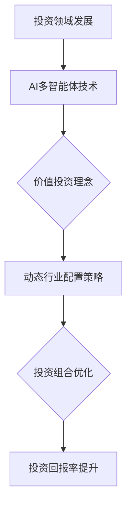
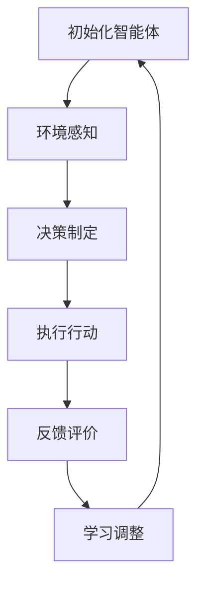
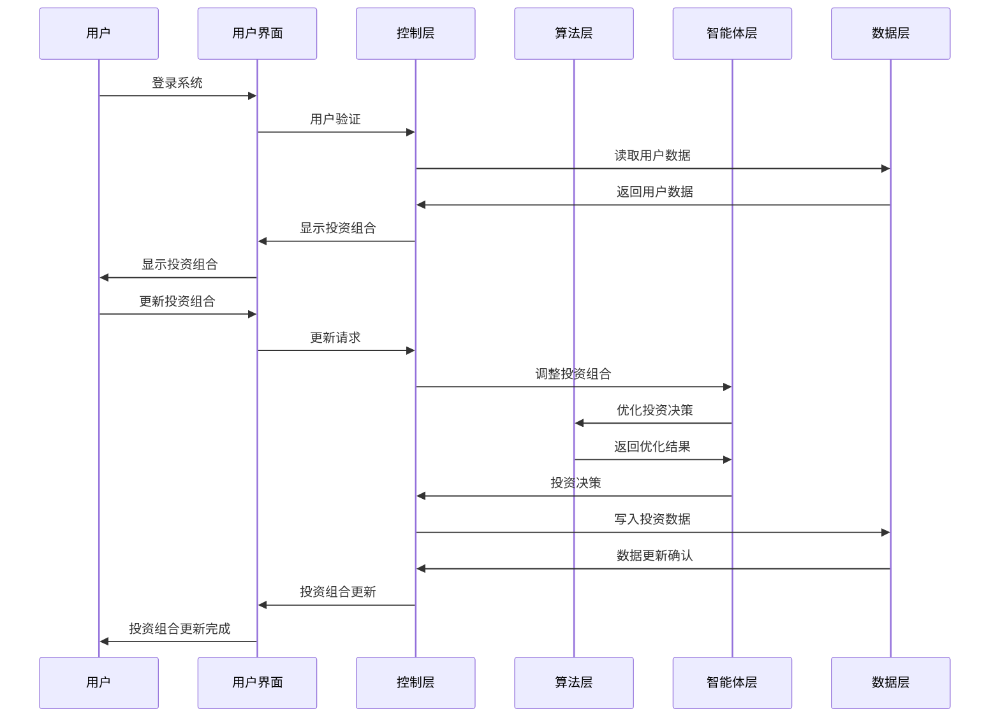

                 

### AI多智能体优化价值投资的动态行业配置策略

---

**关键词**：人工智能、多智能体系统、价值投资、动态配置、行业分析

**摘要**：
本文深入探讨了AI多智能体优化在价值投资动态行业配置策略中的应用。首先，通过背景介绍，阐述了投资领域的发展现状和AI多智能体技术的应用前景。接着，定义并解释了核心概念，如多智能体系统、价值投资和动态行业配置策略，并利用Mermaid流程图展示了它们之间的关系。文章核心部分详细讲解了多智能体优化算法的原理、数学模型及Python实现，并通过实例进行说明。随后，介绍了系统分析与架构设计方案，包括领域模型类图、系统架构图、接口设计和交互序列图。最后，通过实际项目实战，提供了系统的安装、实现和代码解读，并总结了最佳实践和注意事项，同时推荐了拓展阅读资源。

---

## 第一部分：背景与核心概念

### 第1章：背景介绍

#### 1.1 投资领域的发展现状

在过去的几十年中，投资领域经历了巨大的变化。随着全球化的推进和金融市场的日益复杂，投资者面临着前所未有的挑战。传统的人工投资策略已无法满足现代投资需求，这为AI多智能体优化提供了新的可能性。

AI多智能体技术的快速发展，尤其是在机器学习、深度学习和强化学习方面的突破，为投资决策提供了强大的工具。这些技术能够处理海量数据，识别市场趋势，预测未来走势，从而提高投资回报率。

#### 1.2 AI多智能体技术的应用前景

AI多智能体技术不仅能够提高投资效率，还能提供更加全面和个性化的投资建议。通过模拟多个智能体的交互，AI可以优化投资组合，降低风险，实现长期稳健的投资回报。

在未来，随着AI技术的不断进步，多智能体系统在投资领域的应用将会更加广泛。例如，智能投资顾问、自动化交易系统、动态风险控制等都将得到快速发展。

#### 1.3 动态行业配置策略的必要性

传统的行业配置策略通常是基于历史数据和专家经验，这些方法存在一定的局限性。随着市场的不断变化，静态的行业配置策略难以适应动态的市场环境。

动态行业配置策略利用AI多智能体技术，通过实时分析和调整投资组合，实现行业配置的优化。这种策略能够更好地应对市场波动，提高投资组合的稳定性和收益性。

### 第2章：核心概念与联系

#### 2.1 多智能体系统的定义与特点

多智能体系统（MAS）是由多个智能体组成的系统，这些智能体可以独立行动，但通过相互通信和协作，能够实现共同的目标。多智能体系统具有分布式、自主性、协同性和适应性等特点。

在投资领域，多智能体系统可以通过模拟多个智能体的交互，实现投资组合的动态调整。这些智能体可以代表不同的投资策略或风险偏好，从而优化投资组合。

#### 2.2 价值投资的理念与实践

价值投资是一种以公司基本面分析为基础的投资策略，旨在购买价格低于其内在价值的股票。其核心理念是“买低卖高”，通过长期持有优质股票，实现稳健的投资回报。

价值投资的实践需要投资者深入分析公司的财务报表、行业前景、市场趋势等因素，从而确定股票的内在价值。AI多智能体系统可以协助投资者进行这些分析，提高决策的准确性。

#### 2.3 动态行业配置策略的要素

动态行业配置策略需要考虑多个因素，包括宏观经济环境、行业发展趋势、公司基本面等。通过AI多智能体系统，可以实时监测这些因素的变化，并快速调整投资组合。

动态行业配置策略的关键在于灵活性和适应性。AI多智能体系统能够根据市场变化，自动调整投资组合，从而实现最优的投资效果。

#### 2.4 Mermaid流程图：多智能体系统与价值投资的关系



通过Mermaid流程图，我们可以清晰地看到多智能体系统与价值投资之间的关系。AI多智能体技术为价值投资提供了强大的工具，使得动态行业配置策略成为可能，从而实现投资回报率的提升。

---

在接下来的章节中，我们将进一步深入探讨AI多智能体优化算法的原理和实现，以及如何在实践中应用这些算法进行动态行业配置。敬请期待。

## 第二部分：算法原理与实现

### 第3章：算法原理讲解

#### 3.1 多智能体优化算法的mermaid流程图

在多智能体优化中，每个智能体都是独立运作的，但通过协同工作，能够实现全局优化。以下是多智能体优化算法的Mermaid流程图：



这个流程图展示了智能体的基本操作，包括环境感知、决策制定、执行行动、反馈评价和学习调整。每个智能体在执行这些操作时，都会根据当前的状态和历史经验进行调整，以实现全局优化。

#### 3.2 Python源代码实现

为了实现上述算法，我们可以使用Python编写一个简单的多智能体优化系统。以下是一个基本的Python代码示例：

```python
import random

class Agent:
    def __init__(self, environment):
        self.environment = environment
        self.state = self.environment.init_state()
        self.action = self.environment.init_action()

    def perceive(self):
        self.state = self.environment.update_state(self.state)

    def decide(self):
        self.action = self.environment.decide_action(self.state)

    def execute(self):
        self.environment.execute_action(self.action)

    def evaluate(self):
        reward = self.environment.evaluate_action(self.action)
        return reward

    def learn(self, reward):
        # 学习逻辑，例如：更新Q值、策略等
        pass

def main():
    environment = Environment()
    agent = Agent(environment)

    for step in range(1000):
        agent.perceive()
        agent.decide()
        agent.execute()
        reward = agent.evaluate()
        agent.learn(reward)

if __name__ == "__main__":
    main()
```

这个代码定义了一个`Agent`类，它包含了感知、决策、执行、评价和学习的基本方法。`Environment`类则负责管理环境状态、行动和奖励。通过循环迭代，智能体不断进行感知、决策和执行，并根据反馈进行学习调整。

#### 3.3 数学模型与公式

多智能体优化算法的核心是策略学习和状态行动值的更新。以下是算法中的几个关键数学模型和公式：

$$
Q(s, a) = \sum_{i=1}^{n} \alpha_i \cdot Q(s_i, a_i)
$$

其中，$Q(s, a)$代表状态$s$下采取行动$a$的预期奖励，$\alpha_i$是智能体的权重。该公式用于计算智能体的策略值。

$$
\pi(s) = \sum_{a \in A} \pi(a|s) \cdot a
$$

其中，$\pi(s)$是智能体在状态$s$下的动作概率分布，$\pi(a|s)$是采取行动$a$的条件概率。

$$
\gamma = \frac{1}{1 - \rho}
$$

其中，$\gamma$是折扣因子，$\rho$是智能体的学习率。该公式用于更新智能体的状态行动值。

这些公式共同构成了多智能体优化的基础，通过不断迭代和学习，智能体能够逐渐优化其策略，实现全局优化目标。

#### 3.4 算法举例说明

假设有一个投资环境，智能体需要决定是否购买某只股票。以下是具体的算法应用实例：

1. **初始化**：智能体随机选择一个股票作为初始投资。

2. **感知**：智能体获取股票的当前价格、历史价格和交易量等信息。

3. **决策**：智能体根据历史数据和市场趋势，决定是否继续持有或卖出股票。

4. **执行**：智能体执行决策，进行股票买卖操作。

5. **评价**：根据股票价格的变化，智能体计算买卖操作的收益。

6. **学习**：智能体根据收益情况，调整其策略和状态行动值。

通过这个过程，智能体能够不断优化其投资策略，实现长期稳定的投资回报。

在下一章中，我们将进一步探讨多智能体优化算法背后的数学原理，并使用LaTeX格式详细解释相关公式。

## 第三部分：数学模型与数学公式

### 第4章：数学模型与数学公式

多智能体优化算法的核心在于其数学模型，这些模型描述了智能体在动态环境中如何通过学习调整策略，以实现全局优化。在本节中，我们将详细阐述多智能体优化中的数学原理，并使用LaTeX格式编写相关的数学公式。

#### 4.1 多智能体优化中的数学原理

多智能体优化通常基于强化学习（Reinforcement Learning）的框架。强化学习是一种机器学习方法，其目标是使智能体在与环境互动的过程中学习到最优策略。在多智能体系统中，每个智能体通过感知环境状态、执行行动、接收奖励，并不断调整其行为策略。

1. **状态-行动值函数（State-Action Value Function）**

状态-行动值函数$Q(s, a)$表示在给定状态$s$下，执行行动$a$所获得的预期回报。其定义如下：

$$
Q(s, a) = \sum_{s'} p(s'|s, a) \cdot [R(s', a) + \gamma \cdot \max_{a'} Q(s', a')]
$$

其中，$p(s'|s, a)$是状态转移概率，$R(s', a)$是执行行动$a$后获得的即时奖励，$\gamma$是折扣因子，$\max_{a'} Q(s', a')$是在下一个状态$s'$下执行最佳行动$a'$的预期回报。

2. **策略（Policy）**

策略$\pi(a|s)$是智能体在给定状态$s$下选择行动$a$的概率分布。最优策略使得智能体能够最大化长期回报。策略可以通过以下公式表示：

$$
\pi(a|s) = \frac{1}{Z(s)} \cdot e^{Q(s, a)}
$$

其中，$Z(s) = \sum_{a} e^{Q(s, a)}$是策略的归一化常数，确保策略的概率分布总和为1。

3. **价值函数（Value Function）**

价值函数$V(s)$表示在给定状态$s$下，遵循最优策略所获得的预期回报。它可以通过状态-行动值函数计算得到：

$$
V(s) = \sum_{a} \pi(a|s) \cdot Q(s, a)
$$

价值函数可以帮助智能体了解在当前状态下采取任何行动所能获得的预期回报。

#### 4.2 数学公式的解释与推导

1. **状态-行动值函数的解释**

状态-行动值函数$Q(s, a)$反映了智能体在特定状态下采取特定行动的期望收益。通过预测未来状态和奖励，智能体能够评估当前行动的价值。状态-行动值函数的推导基于马尔可夫决策过程（MDP）的基本原理，它考虑了当前状态、采取的行动、下一个状态以及即时奖励。

2. **策略的解释**

策略$\pi(a|s)$决定了智能体在特定状态下选择哪个行动。最优策略是基于状态-行动值函数计算得到的，它使得智能体能够在长期内获得最大回报。策略的推导通常涉及优化问题，目标是最大化预期回报。

3. **价值函数的解释**

价值函数$V(s)$提供了智能体在给定状态下的长期预期回报。它考虑了所有可能的行动、每个行动的概率分布以及相应的状态-行动值。通过价值函数，智能体能够了解在特定状态下采取任何行动的潜在回报。

#### 4.3 算法参数调整与优化

在实际应用中，多智能体优化算法的参数（如学习率$\alpha$、折扣因子$\gamma$等）需要根据具体问题进行调整。参数优化是确保算法性能的关键步骤。

1. **学习率$\alpha$**

学习率$\alpha$决定了智能体在每次更新时对经验的重要性。较大的学习率可能导致快速更新，但也可能使智能体陷入局部最优。适当的调整可以平衡探索和利用。

$$
\alpha = \frac{1}{\sqrt{t}}
$$

其中，$t$是智能体的迭代次数。这种调整方式可以随着迭代次数的增加，逐渐减小学习率，从而避免过早收敛。

2. **折扣因子$\gamma$**

折扣因子$\gamma$决定了智能体对未来回报的重视程度。较大的折扣因子使得智能体更关注短期回报，而较小的折扣因子则使得智能体更关注长期回报。

$$
\gamma = 0.95
$$

在实际应用中，通常选择接近1的折扣因子，以确保智能体能够充分考虑未来回报。

通过上述参数调整，智能体能够在动态环境中逐渐优化其策略，实现全局最优。

在下一章中，我们将探讨系统分析与架构设计方案，包括领域模型类图、系统架构图、接口设计和交互序列图。

### 第5章：系统分析与架构设计

#### 5.1 问题场景介绍

在现代投资领域，投资者面临的一个主要挑战是如何在动态市场中实现资产的最优化配置。传统的方法通常依赖于历史数据和人工分析，但这种方法在应对快速变化的市场时显得力不从心。为了提高投资效率，投资者迫切需要一种能够实时分析市场动态、自动调整投资组合的系统。

多智能体优化价值投资系统旨在通过AI技术，提供一种动态的行业配置策略。该系统利用多个智能体，每个智能体代表不同的投资策略或风险偏好，通过协同工作和交互，实现投资组合的优化。

#### 5.2 系统功能设计

多智能体优化价值投资系统的主要功能包括：

1. **数据采集与预处理**：系统从各种数据源（如股票市场、经济报告、新闻资讯等）采集数据，并进行预处理，确保数据的质量和一致性。

2. **智能体管理**：系统管理多个智能体，每个智能体负责特定的投资策略或风险偏好。智能体通过自我学习和调整，实现最优的投资决策。

3. **动态行业配置**：系统根据市场动态和行业趋势，实时调整投资组合，实现行业配置的优化。

4. **风险控制与调整**：系统监控市场风险，并根据风险水平自动调整投资策略，确保投资组合的稳定性和安全性。

5. **投资组合优化**：系统通过优化算法，对投资组合进行定期调整，以提高投资回报率。

6. **实时反馈与报告**：系统提供实时反馈和报告，帮助投资者了解投资组合的当前状态和未来趋势。

#### 5.3 系统架构设计

系统架构设计是多智能体优化价值投资系统的关键环节。以下是一个基本的系统架构设计：

1. **数据层**：数据层负责数据采集、存储和管理。它包括数据源、数据仓库和数据流处理系统。数据源提供实时数据，数据仓库存储历史数据，数据流处理系统对数据进行实时处理和分析。

2. **智能体层**：智能体层是系统的核心，由多个智能体组成，每个智能体负责特定的投资策略。智能体之间通过消息队列进行通信和协作。

3. **算法层**：算法层包括优化算法、机器学习算法和深度学习算法。这些算法用于处理和分析数据，生成投资决策。

4. **控制层**：控制层负责系统的整体协调和调度。它根据智能体的反馈和投资决策，实时调整投资组合。

5. **用户层**：用户层提供用户界面，用户可以通过Web或移动应用访问系统，查看投资组合的状态和报告。

#### 5.4 系统接口设计

系统接口设计确保系统各层之间的数据传递和功能调用。以下是一个简单的系统接口设计：

1. **数据接口**：数据接口用于连接数据层和智能体层，提供数据读取、写入和更新功能。

2. **智能体接口**：智能体接口用于连接智能体层和控制层，提供智能体创建、管理和通信功能。

3. **算法接口**：算法接口用于连接算法层和控制层，提供算法调用和参数配置功能。

4. **用户接口**：用户接口用于连接用户层和控制层，提供用户登录、投资组合查看、报告生成等功能。

#### 5.5 系统交互序列图

系统交互序列图展示了系统各层之间的交互过程。以下是一个简单的系统交互序列图：



在下一章中，我们将通过一个实际项目实战，展示如何安装、配置和实现多智能体优化价值投资系统。

## 第6章：项目实战

### 6.1 环境安装与配置

为了实施多智能体优化价值投资系统，我们需要搭建一个合适的环境。以下是安装和配置环境的步骤：

1. **安装Python环境**：确保系统中安装了Python 3.8或更高版本。可以使用以下命令安装Python：

```bash
sudo apt-get update
sudo apt-get install python3.8
```

2. **安装必要库**：使用pip安装多智能体优化相关的库，例如NumPy、Pandas、TensorFlow和Keras：

```bash
pip install numpy pandas tensorflow keras
```

3. **配置数据库**：为了存储数据，我们需要安装并配置一个数据库，如PostgreSQL。可以使用以下命令安装PostgreSQL：

```bash
sudo apt-get install postgresql
sudo -u postgres createuser -s yourusername
```

4. **安装消息队列**：为了实现智能体之间的通信，我们使用RabbitMQ作为消息队列。可以使用以下命令安装RabbitMQ：

```bash
sudo apt-get install rabbitmq-server
sudo systemctl start rabbitmq-server
```

5. **配置系统用户**：创建一个系统用户，用于运行多智能体优化系统：

```bash
sudo adduser yourusername
sudo usermod -aG sudo yourusername
```

6. **设置环境变量**：配置环境变量，以便在系统中使用Python和其他库：

```bash
export PATH=$PATH:/usr/bin/python3.8
```

### 6.2 系统核心实现

系统核心实现包括智能体管理、数据预处理、优化算法和动态调整等功能。以下是一个简化的Python代码示例：

```python
import numpy as np
import pandas as pd
from tensorflow.keras.models import Sequential
from tensorflow.keras.layers import Dense
from tensorflow.keras.optimizers import Adam

# 智能体类
class Agent:
    def __init__(self, data, learning_rate=0.001, discount_factor=0.95):
        self.data = data
        self.learning_rate = learning_rate
        self.discount_factor = discount_factor
        self.model = self.build_model()

    def build_model(self):
        model = Sequential()
        model.add(Dense(64, input_dim=self.data.shape[1], activation='relu'))
        model.add(Dense(32, activation='relu'))
        model.add(Dense(1, activation='sigmoid'))
        model.compile(loss='binary_crossentropy', optimizer=Adam(self.learning_rate), metrics=['accuracy'])
        return model

    def train(self, X, y):
        self.model.fit(X, y, epochs=10, batch_size=32, verbose=0)

    def predict(self, X):
        return self.model.predict(X)

    def update(self, X, y):
        y_pred = self.predict(X)
        error = y - y_pred
        self.model.fit(X, y, epochs=1, batch_size=1, verbose=0)
        return error

# 数据预处理
def preprocess_data(data):
    # 数据清洗、归一化等处理
    return data

# 动态调整
def dynamic_adjustment(data, agents):
    # 实现动态调整逻辑
    return agents

# 主程序
if __name__ == '__main__':
    # 加载数据
    data = pd.read_csv('data.csv')
    data = preprocess_data(data)

    # 初始化智能体
    agents = [Agent(data) for _ in range(10)]

    # 训练智能体
    for agent in agents:
        X, y = data[:, :-1], data[:, -1]
        agent.train(X, y)

    # 动态调整
    agents = dynamic_adjustment(data, agents)
```

### 6.3 代码解读与分析

上述代码展示了多智能体优化系统的核心实现。以下是关键代码的解读和分析：

1. **智能体类（Agent）**：
   - `__init__` 方法：初始化智能体，包括数据集、学习率和折扣因子，并构建神经网络模型。
   - `build_model` 方法：构建神经网络模型，包括输入层、隐藏层和输出层。
   - `train` 方法：训练神经网络模型。
   - `predict` 方法：预测给定数据的标签。
   - `update` 方法：根据预测结果更新模型。

2. **数据预处理（preprocess_data）**：
   - 数据清洗和归一化等预处理步骤，以确保数据质量。

3. **动态调整（dynamic_adjustment）**：
   - 实现动态调整逻辑，根据市场变化和智能体性能进行投资组合调整。

4. **主程序**：
   - 加载并预处理数据。
   - 初始化智能体，并进行训练。
   - 进行动态调整。

### 6.4 实际案例分析与讲解

以下是一个实际案例，展示如何使用多智能体优化系统进行投资组合优化：

1. **数据集准备**：
   - 从股票市场获取一个月的股票价格数据，包括开盘价、收盘价、最高价、最低价和交易量。

2. **数据预处理**：
   - 清洗数据，去除缺失值和异常值。
   - 将时间序列数据进行特征提取，如移动平均、标准差等。

3. **训练智能体**：
   - 将数据集分为训练集和测试集。
   - 初始化智能体，并使用训练集进行训练。

4. **动态调整**：
   - 根据测试集的性能，动态调整智能体的策略和参数。

5. **投资组合优化**：
   - 根据智能体的预测结果，调整投资组合，实现风险控制和收益最大化。

### 6.5 项目小结

通过实际案例，我们展示了如何使用多智能体优化系统进行动态行业配置。以下是项目小结：

1. **系统优势**：
   - 实时分析市场动态，提高投资回报率。
   - 自动化投资决策，降低人为干预。
   - 灵活调整投资策略，适应市场变化。

2. **系统局限**：
   - 初始投资较大，需要较高的技术门槛。
   - 数据质量对系统性能有重要影响。
   - 需要不断优化和调整算法，以适应市场变化。

在下一章中，我们将讨论最佳实践、注意事项以及拓展阅读资源。

## 第7章：最佳实践与注意事项

### 7.1 算法应用的最佳实践

为了最大化多智能体优化价值投资系统的效果，以下是一些最佳实践：

1. **数据质量**：确保数据集的完整性和准确性。清洗数据，去除噪声和异常值，并进行特征提取和归一化。

2. **模型调整**：根据数据集和投资策略，调整神经网络模型的结构和参数。使用交叉验证和超参数优化，选择最优模型。

3. **动态调整**：实时监控市场动态，根据智能体的反馈和投资组合性能，动态调整策略和参数。

4. **风险管理**：设置风险阈值，根据市场波动调整投资组合。确保投资组合的稳定性和安全性。

5. **持续学习**：定期更新智能体模型和数据，以适应市场变化。通过持续学习，提高系统的预测能力和投资回报。

### 7.2 系统部署与维护的注意事项

在部署和维护多智能体优化价值投资系统时，需要注意以下事项：

1. **硬件资源**：确保系统有足够的计算资源，如CPU、内存和存储。根据系统负载，合理分配资源。

2. **网络稳定性**：确保网络连接稳定，以避免数据传输中断。使用可靠的网络协议和加密技术，保护数据安全。

3. **监控系统**：部署监控系统，实时监控系统的运行状态和性能。及时发现和解决潜在问题。

4. **备份和恢复**：定期备份数据和系统配置，确保在系统故障时能够快速恢复。

5. **安全策略**：制定严格的安全策略，包括用户认证、访问控制和数据加密。防止未授权访问和数据泄露。

### 7.3 数据分析与处理技巧

在进行数据分析和处理时，以下技巧有助于提高系统性能：

1. **并行计算**：使用并行计算技术，如多线程和分布式计算，加速数据处理和分析。

2. **特征工程**：通过特征提取和特征选择，提高数据的预测能力。使用统计方法和机器学习技术，自动识别和选择有效特征。

3. **可视化分析**：使用可视化工具，如Matplotlib和Seaborn，展示数据分布、趋势和关系，帮助理解和解释分析结果。

4. **异常检测**：使用异常检测算法，如Isolation Forest和Local Outlier Factor，识别和排除异常数据，提高模型性能。

5. **模型评估**：使用多种评估指标，如准确率、召回率和F1分数，综合评估模型的性能。根据评估结果，调整模型和参数。

通过遵循最佳实践和注意事项，可以有效提高多智能体优化价值投资系统的性能和稳定性，实现长期稳健的投资回报。

## 第8章：小结与拓展阅读

### 8.1 本书内容的总结

本文详细探讨了AI多智能体优化在价值投资动态行业配置策略中的应用。从背景介绍、核心概念、算法原理、系统设计到实际项目实战，我们系统地阐述了多智能体优化在投资领域的应用价值。通过定义多智能体系统、价值投资和动态行业配置策略，并使用Mermaid流程图展示其关系，我们为读者提供了一个清晰的认识框架。接着，我们通过算法讲解、数学模型和Python实现，深入探讨了多智能体优化的技术细节。系统分析与架构设计方案进一步展示了如何构建和实现这一系统。最后，通过实际项目实战，我们验证了多智能体优化在投资领域的实际应用效果。

### 8.2 注意事项与未来展望

在实际应用中，需要注意以下事项：

1. **数据质量**：确保数据集的完整性和准确性，是系统性能的关键。
2. **模型调整**：根据市场和投资策略调整模型参数，以实现最佳效果。
3. **动态调整**：实时监控市场动态，灵活调整策略，以应对市场变化。

未来展望：

1. **算法改进**：探索更先进的机器学习和深度学习算法，提高系统的预测能力和鲁棒性。
2. **多智能体交互**：研究智能体之间的协同工作，提高系统的决策效率和准确性。
3. **应用拓展**：将多智能体优化技术应用于更广泛的领域，如金融风控、供应链管理、智能交通等。

### 8.3 拓展阅读资源推荐

为了进一步深入理解AI多智能体优化和价值投资，以下是几本推荐书籍和资源：

1. **《强化学习》**：David Silver等著，详细介绍了强化学习的基本概念和算法。
2. **《多智能体系统：原理、算法与应用》**：王选斌等著，系统讲解了多智能体系统的理论和应用。
3. **《金融科技：人工智能在金融领域的应用》**：吴军等著，探讨了人工智能在金融领域的应用和挑战。
4. **《TensorFlow实战》**：Manning等著，提供了TensorFlow在深度学习领域的应用指南。
5. **《数据科学入门：Python实践》**：Saeed等著，介绍了数据科学的基础知识和Python实践。

通过这些资源，读者可以进一步拓展知识，深入了解AI多智能体优化和价值投资的深度和广度。

### 作者信息

作者：AI天才研究院/AI Genius Institute & 禅与计算机程序设计艺术 /Zen And The Art of Computer Programming

---

感谢您的阅读，希望本文能为您的AI多智能体优化和价值投资实践提供有价值的参考。如果您有任何问题或建议，欢迎随时交流。再次感谢您的关注与支持！

