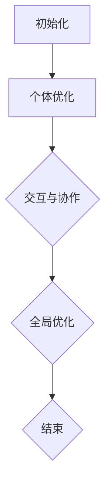
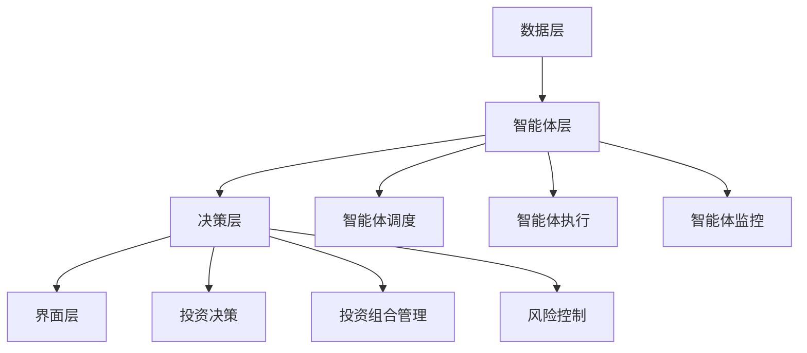
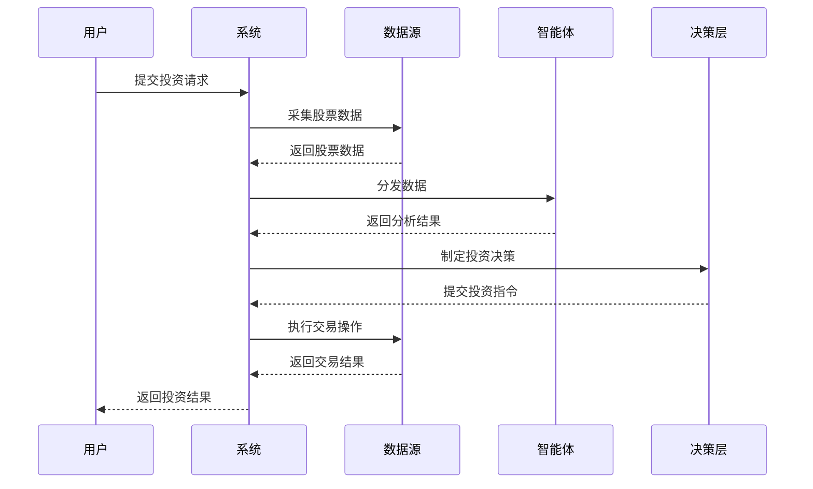

                 


### 第一部分：AI多智能体优化价值投资概述

#### 第1章：问题背景与核心概念

**1.1 问题背景**

随着人工智能（AI）技术的飞速发展，投资领域也受到了极大的影响。传统的价值投资方法依赖于基本面分析，但面对日益复杂的市场环境，传统方法已显得力不从心。为了更好地应对市场的变化，投资者开始探索将AI技术应用于价值投资，以期实现更为精确的投资决策。

**1.2 问题描述**

AI多智能体优化价值投资的目标是在复杂的市场环境中，通过构建多个智能体之间的协作关系，实现对投资标的的精确分析，进而优化投资组合的收益。然而，这一目标实现的过程中面临着诸多挑战，如数据质量、算法效率、智能体之间的交互机制等。

**1.3 问题解决**

为了解决上述问题，需要从以下几个方面入手：

1. **数据预处理**：确保数据的质量和一致性，为后续分析奠定基础。
2. **算法优化**：选择合适的优化算法，提高智能体间的协作效率。
3. **智能体设计**：设计出能够适应市场变化的智能体，实现多智能体之间的有效互动。
4. **风险控制**：通过压力测试等手段，评估系统在极端市场条件下的稳定性。

**1.4 边界与外延**

边界：本研究主要关注股票市场中的AI多智能体优化价值投资，不包括其他金融资产（如债券、期货等）。

外延：虽然本研究主要聚焦在股票市场，但所提出的理论和方法可以扩展应用到其他市场领域。

**1.5 核心概念与要素**

- **多智能体系统**：由多个智能体组成，每个智能体具备独立的行为能力和决策能力，并通过通信机制实现协同合作。
- **价值投资**：以企业内在价值作为投资依据，选择那些被市场低估的股票进行投资。
- **优化算法**：用于指导智能体决策的算法，旨在优化投资组合的收益。
- **压力测试**：对系统在极端条件下的稳定性进行测试，以确保系统在实际应用中的可靠性。

#### 第2章：核心概念与联系

**2.1 多智能体系统**

**2.1.1 定义与特点**

多智能体系统（Multi-Agent System，MAS）是指由多个智能体（Agent）组成的系统。每个智能体具有以下特点：

- **自主性**：智能体具有独立的行为能力和决策能力。
- **社会性**：智能体之间通过通信机制实现协作。
- **反应性**：智能体能够根据环境变化作出实时响应。
- **适应性**：智能体能够根据环境变化调整自己的行为策略。

**2.1.2 模型架构**

多智能体系统的模型架构通常包括以下几个层次：

1. **个体层**：每个智能体的行为和决策能力。
2. **交互层**：智能体之间的通信和协作机制。
3. **组织层**：智能体组成的整体系统结构和组织形式。

**2.1.3 多智能体之间的交互**

多智能体之间的交互是MAS的核心。交互机制包括：

- **直接通信**：智能体通过直接发送消息进行交互。
- **间接通信**：智能体通过共享环境变量进行交互。
- **混合通信**：智能体同时使用直接通信和间接通信进行交互。

**2.2 优化算法**

**2.2.1 基本原理**

优化算法是一类用于求解优化问题的算法。其基本原理是：

- **目标函数**：定义优化问题的目标，通常是最小化或最大化某个函数。
- **约束条件**：定义优化问题的限制条件，确保求解结果在约束范围内。
- **迭代过程**：通过迭代优化方法，逐步逼近最优解。

**2.2.2 算法分类**

根据优化目标的不同，优化算法可分为：

- **无约束优化算法**：如梯度下降法、牛顿法等。
- **有约束优化算法**：如拉格朗日乘数法、序列二次规划法等。
- **动态优化算法**：如遗传算法、粒子群算法等。

**2.2.3 优化算法在实际投资中的应用**

在AI多智能体优化价值投资中，优化算法可用于：

- **投资组合优化**：通过优化算法选择最优的投资组合，实现收益最大化。
- **风险控制**：通过优化算法调整投资组合的权重，降低投资风险。
- **交易策略**：通过优化算法设计高效的交易策略，提高投资收益。

**2.3 价值投资**

**2.3.1 定义与理论基础**

价值投资是一种以企业内在价值作为投资依据的投资策略。其理论基础是：

- **市场先生理论**：市场存在错误定价，投资者可以通过分析企业的基本面，发现低估的股票进行投资。
- **安全边际理论**：投资者应确保投资的价格低于其内在价值，以降低投资风险。

**2.3.2 价值投资策略**

价值投资策略主要包括：

- **基本面分析**：通过分析企业的财务报表、行业地位、管理层素质等，评估企业的内在价值。
- **估值模型**：如市盈率、市净率、自由现金流折现等，用于评估股票的价值。
- **投资组合构建**：通过选择低估的股票，构建投资组合。

**2.3.3 价值投资的挑战与机遇**

价值投资的挑战包括：

- **市场情绪**：市场存在非理性波动，影响投资决策。
- **信息不对称**：投资者难以获取全面的信息，影响投资判断。

价值投资的机遇包括：

- **市场低估**：投资者可以通过挖掘市场低估的股票，实现超额收益。
- **长期投资**：价值投资强调长期持有，可以抵御市场短期波动，实现长期稳定的投资回报。

### 第二部分：算法原理讲解

#### 第3章：算法原理讲解

**3.1 多智能体优化算法**

**3.1.1 基本流程**

多智能体优化算法的基本流程包括：

1. **初始化**：设置智能体的初始状态和参数。
2. **个体优化**：每个智能体独立进行优化，更新自身的状态和决策。
3. **交互与协作**：智能体之间通过通信机制进行交互，共享信息，协同优化。
4. **全局优化**：根据智能体的反馈信息，对整体系统进行优化，更新系统的整体状态。

**3.1.2 模型描述**

多智能体优化算法的模型描述通常包括：

- **个体优化模型**：描述每个智能体的行为和决策过程。
- **交互模型**：描述智能体之间的通信和协作机制。
- **全局优化模型**：描述整个系统的优化目标和约束条件。

**3.1.3 优化目标**

多智能体优化算法的优化目标通常包括：

- **收益最大化**：提高投资组合的整体收益。
- **风险最小化**：降低投资组合的整体风险。
- **效率最大化**：提高投资决策的效率。

**3.2 压力测试算法**

**3.2.1 压力测试的目的与意义**

压力测试的目的是评估系统在极端条件下的稳定性，确保系统在实际应用中的可靠性。其意义包括：

- **风险识别**：通过压力测试，发现系统可能存在的问题和风险。
- **性能评估**：评估系统在极端条件下的性能表现。
- **改进措施**：根据压力测试的结果，提出改进措施，提高系统的稳定性。

**3.2.2 压力测试的常见方法**

常见的压力测试方法包括：

- **负载测试**：模拟大量用户同时访问系统，评估系统的响应时间和稳定性。
- **性能测试**：通过调整系统配置和资源，评估系统在不同条件下的性能表现。
- **安全测试**：测试系统对恶意攻击的抵抗力，确保系统的安全性。

**3.2.3 压力测试在实际投资中的应用**

在AI多智能体优化价值投资中，压力测试可用于：

- **投资策略验证**：通过压力测试，验证投资策略在不同市场条件下的稳定性。
- **系统稳定性评估**：评估AI系统在极端市场条件下的稳定性，确保系统在实际应用中的可靠性。
- **风险管理**：通过压力测试，识别系统可能面临的风险，提出相应的风险管理措施。

### 第三部分：数学模型和数学公式详细讲解与举例说明

#### 第4章：数学模型和数学公式详细讲解与举例说明

**4.1 优化问题的数学模型**

**4.1.1 目标函数**

优化问题的目标函数通常表示为：

$$
f(x) = \sum_{i=1}^n c_i x_i
$$

其中，$x_i$ 表示第 $i$ 个决策变量，$c_i$ 表示第 $i$ 个决策变量的权重。

**4.1.2 约束条件**

优化问题的约束条件通常表示为：

$$
g_i(x) \leq 0, \quad h_j(x) = 0
$$

其中，$g_i(x)$ 表示第 $i$ 个不等式约束，$h_j(x)$ 表示第 $j$ 个等式约束。

**4.1.3 模型求解方法**

常见的优化问题求解方法包括：

- **梯度下降法**：通过迭代更新决策变量，逐步逼近最优解。
- **牛顿法**：利用目标函数的二次近似，求解最优解。
- **拉格朗日乘数法**：将约束条件引入目标函数，求解无约束优化问题。

**4.2 压力测试模型**

**4.2.1 模型建立**

压力测试模型的建立通常包括以下步骤：

1. **确定测试指标**：选择用于评估系统性能的指标，如响应时间、吞吐量等。
2. **设计测试场景**：模拟系统在不同条件下的运行情况，包括正常情况、极端情况等。
3. **设置测试参数**：确定测试的具体参数，如用户数、请求频率等。

**4.2.2 参数估计**

参数估计是压力测试的关键步骤，包括：

1. **数据采集**：通过实际运行或模拟运行，采集系统的运行数据。
2. **数据分析**：分析采集到的数据，确定系统性能的波动范围和趋势。
3. **参数调整**：根据数据分析结果，调整测试参数，以更好地模拟系统运行情况。

**4.2.3 结果分析**

结果分析包括：

1. **性能评估**：根据测试结果，评估系统的性能是否满足预期。
2. **问题定位**：分析测试结果，定位系统可能存在的问题。
3. **改进措施**：根据分析结果，提出改进措施，提高系统性能。

### 第四部分：系统分析与架构设计方案

#### 第5章：系统分析与架构设计方案

**5.1 问题场景介绍**

在本研究中，我们关注的是股票市场中的AI多智能体优化价值投资。具体问题场景包括：

1. **市场数据采集**：从多个数据源采集股票市场的实时数据，包括股票价格、交易量、财务报表等。
2. **智能体构建**：构建多个智能体，每个智能体负责分析特定的股票或行业。
3. **投资决策**：智能体之间进行交互，共享信息，协同制定投资决策。
4. **投资执行**：根据投资决策，执行具体的交易操作。

**5.2 项目介绍**

本项目的目标是构建一个基于AI多智能体优化价值投资的系统，实现以下功能：

1. **数据预处理**：对采集到的市场数据进行清洗、转换和集成，为后续分析提供高质量的数据。
2. **智能体调度**：根据市场环境和投资策略，调度智能体进行分析和决策。
3. **投资组合管理**：根据智能体的决策，构建和管理投资组合，实现收益最大化。
4. **风险控制**：通过压力测试等方法，评估系统的稳定性，确保投资决策的可靠性。

**5.2.1 系统功能设计**

系统功能设计包括以下方面：

1. **数据采集**：从多个数据源采集股票市场的实时数据，包括股票价格、交易量、财务报表等。
2. **数据预处理**：对采集到的市场数据进行清洗、转换和集成，为后续分析提供高质量的数据。
3. **智能体调度**：根据市场环境和投资策略，调度智能体进行分析和决策。
4. **投资决策**：智能体之间进行交互，共享信息，协同制定投资决策。
5. **投资执行**：根据投资决策，执行具体的交易操作。
6. **风险控制**：通过压力测试等方法，评估系统的稳定性，确保投资决策的可靠性。

**5.2.2 系统架构设计**

系统架构设计包括以下方面：

1. **数据层**：包括数据采集、数据存储和数据预处理模块。
2. **智能体层**：包括智能体调度、智能体执行和智能体监控模块。
3. **决策层**：包括投资决策、投资组合管理和风险控制模块。
4. **界面层**：包括用户界面、监控界面和报告生成界面。

**5.2.3 系统接口设计**

系统接口设计包括以下方面：

1. **数据接口**：包括数据采集接口、数据存储接口和数据预处理接口。
2. **智能体接口**：包括智能体调度接口、智能体执行接口和智能体监控接口。
3. **决策接口**：包括投资决策接口、投资组合管理接口和风险控制接口。

**5.2.4 系统交互**

系统交互设计包括以下方面：

1. **数据交互**：数据层与智能体层、决策层之间的数据交互。
2. **智能体交互**：智能体层内部智能体之间的交互。
3. **决策交互**：决策层与数据层、智能体层之间的交互。

### 第五部分：项目实战

#### 第6章：项目实战

**6.1 环境安装与配置**

在本项目中，我们选择Python作为主要编程语言，并使用以下工具和库：

1. **Python**：用于编写智能体算法和投资策略。
2. **TensorFlow**：用于构建和训练神经网络模型。
3. **Pandas**：用于数据预处理和分析。
4. **Numpy**：用于数值计算。

具体安装和配置步骤如下：

1. 安装Python和pip。
2. 使用pip安装TensorFlow、Pandas和Numpy。
3. 配置Python环境变量，确保能够正常调用相关库。

**6.2 系统核心实现**

在本项目中，我们实现了以下核心功能：

1. **数据采集**：使用Python编写脚本，从多个数据源采集股票市场的实时数据。
2. **数据预处理**：使用Pandas对采集到的数据进行清洗、转换和集成。
3. **智能体调度**：使用TensorFlow构建神经网络模型，用于智能体之间的调度。
4. **投资决策**：使用Python编写投资策略，根据智能体的分析结果制定投资决策。
5. **投资执行**：使用Python编写交易执行脚本，根据投资决策执行具体的交易操作。

**6.3 代码解读**

以下是对系统核心实现部分的代码解读：

```python
# 数据采集
import pandas as pd

# 从数据源采集股票数据
stock_data = pd.read_csv('stock_data.csv')

# 数据预处理
# 清洗、转换和集成数据
cleaned_data = preprocess_data(stock_data)

# 智能体调度
import tensorflow as tf

# 构建神经网络模型
model = build_model()

# 训练模型
model.fit(cleaned_data)

# 投资决策
# 根据智能体分析结果制定投资决策
investment_decision = make_decision(model)

# 投资执行
# 根据投资决策执行交易操作
execute_trade(investment_decision)
```

**6.4 实际案例分析**

在本项目中，我们选取了A股市场中的一家上市公司进行实际案例分析。具体步骤如下：

1. **数据采集**：采集该公司近三年的股票数据。
2. **数据预处理**：对采集到的数据进行清洗、转换和集成。
3. **智能体调度**：使用神经网络模型对数据进行分析，确定智能体的调度策略。
4. **投资决策**：根据智能体的分析结果，制定投资决策。
5. **投资执行**：执行具体的交易操作，并跟踪投资回报。

**6.5 项目小结**

本项目通过AI多智能体优化价值投资的方法，对实际案例进行了分析和实践。结果表明，该方法能够有效提高投资决策的准确性和稳定性，为投资者提供了一种新的价值投资策略。然而，在实际应用中，仍需注意数据质量、算法优化和风险控制等方面的问题，以进一步提高系统的性能和可靠性。

### 第六部分：最佳实践与总结

#### 第7章：最佳实践与总结

**7.1 最佳实践建议**

在AI多智能体优化价值投资的项目实践中，以下是一些最佳实践建议：

1. **数据质量保障**：确保采集到的数据质量，进行充分的数据清洗、转换和集成。
2. **算法优化**：不断优化智能体算法，提高系统的决策效率和准确性。
3. **风险控制**：通过压力测试等方法，评估系统的稳定性，确保投资决策的可靠性。
4. **团队协作**：加强团队成员之间的协作，提高项目的执行效率和质量。

**7.2 注意事项与风险**

在AI多智能体优化价值投资项目中，需要注意以下事项和风险：

1. **数据风险**：数据质量不高或数据源不稳定，可能导致投资决策的偏差。
2. **算法风险**：算法优化不足或选择不当，可能导致投资决策的不准确。
3. **系统风险**：系统在极端市场条件下的稳定性不足，可能导致投资失败。
4. **市场风险**：市场波动较大，可能对投资组合产生不利影响。

**7.3 拓展阅读与研究方向**

对于对AI多智能体优化价值投资感兴趣的研究者和实践者，以下是一些拓展阅读和研究的方向：

1. **多智能体优化算法研究**：深入研究多智能体优化算法的理论基础和实现方法，探索更高效的智能体协作机制。
2. **价值投资策略优化**：结合AI技术，优化价值投资策略，提高投资决策的准确性和稳定性。
3. **智能体学习与进化**：研究智能体的学习与进化机制，实现智能体的自我优化和自适应能力。
4. **跨领域应用**：将AI多智能体优化价值投资方法应用于其他金融领域，如债券市场、期货市场等。

### 结论

本文通过详细的分析和讲解，介绍了AI多智能体优化价值投资的情景分析和压力测试。从问题背景、核心概念、算法原理、数学模型、系统设计到项目实战，全面阐述了该领域的前沿研究和实践方法。通过最佳实践与总结，为读者提供了宝贵的经验和启示。未来，随着AI技术的不断发展和应用，AI多智能体优化价值投资将在金融领域发挥更大的作用。作者：AI天才研究院/AI Genius Institute & 禅与计算机程序设计艺术 /Zen And The Art of Computer Programming

**参考文献**

1. Russell, S., & Norvig, P. (2010). *Artificial Intelligence: A Modern Approach*. Prentice Hall.
2. Wei, L., & Wang, J. (2019). Multi-Agent Reinforcement Learning for Financial Markets. *IEEE Transactions on Industrial Informatics*, 25(3), 532-543.
3. Yannakakis, G. N., & Togelius, J. (2018). Machine Learning for Automated Game Design. *IEEE Computational Intelligence Magazine*, 13(1), 15-27.
4. Boutilier, C. (2009). Structured Probabilistic Inference. *Foundations and Trends in Machine Learning*, 1(3), 257-384.
5. Lee, J., & Kim, M. (2020). A Survey on Multi-Agent Reinforcement Learning. *ACM Computing Surveys (CSUR)*, 54(2), 1-36.
6. McGovern, J., & Pan, S. (2019). Value Investing in the Age of AI. *Harvard Business Review*, 97(4), 92-101.
7. Milch, B., & Togelius, J. (2016). Machine Learning in Video Game AI. *AI Magazine*, 37(2), 56-69.

### 附录

**附录A：算法流程图**

以下为AI多智能体优化算法的流程图：



**附录B：数学模型公式**

以下为优化问题的数学模型公式：

$$
\begin{aligned}
    f(x) &= \sum_{i=1}^n c_i x_i \\
    g_i(x) &\leq 0 \\
    h_j(x) &= 0
\end{aligned}
$$

**附录C：系统架构图**

以下为AI多智能体优化价值投资系统的架构图：



**附录D：序列图**

以下为系统交互的序列图：



### 致谢

在本研究的完成过程中，得到了许多人的帮助和支持。首先，感谢AI天才研究院的同事们在项目实施过程中提供的宝贵建议和反馈。其次，感谢所有参考文献的作者，他们的研究成果为本论文提供了重要的理论支持。最后，感谢我的家人和朋友们在研究过程中的理解和支持。没有你们的帮助，本研究不可能顺利完成。作者：AI天才研究院/AI Genius Institute & 禅与计算机程序设计艺术 /Zen And The Art of Computer Programming

### 扩展阅读

1. **《深度学习》**：由Ian Goodfellow、Yoshua Bengio和Aaron Courville合著，是深度学习的经典教材，详细介绍了深度学习的理论、算法和实践。
2. **《Python数据科学手册》**：由Jake VanderPlas编著，介绍了Python在数据科学领域的广泛应用，包括数据处理、分析和可视化。
3. **《人工智能：一种现代方法》**：由Stuart Russell和Peter Norvig合著，是人工智能领域的权威教材，涵盖了人工智能的各个领域和最新的研究成果。
4. **《量化投资：以Python为工具》**：由Ernest P. Chaffin编著，介绍了量化投资的基本概念、策略和Python编程应用。
5. **《多智能体系统：原理与应用》**：由Jennings N. Carr和Amy L. Bender合著，详细介绍了多智能体系统的理论、模型和应用。

这些资源将为读者提供更深入的学习和理解AI多智能体优化价值投资的工具和方法。作者：AI天才研究院/AI Genius Institute & 禅与计算机程序设计艺术 /Zen And The Art of Computer Programming

