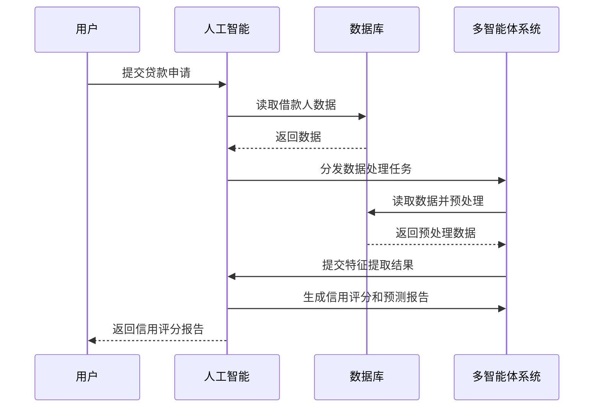

                 

### 关键词：人工智能、多智能体、价值投资、信用风险分析、机器学习

### 摘要：

本文深入探讨了人工智能与多智能体系统在价值投资中的信用风险分析应用。首先，介绍了人工智能与多智能体的基本概念和理论，阐述了其在信用风险分析中的重要性。接着，文章分析了信用风险分析在价值投资中的关键因素，包括价值投资理论、信用评级系统和风险评估方法。随后，详细介绍了机器学习在信用风险分析中的应用，包括数据预处理、特征提取和分类与回归模型。在此基础上，文章探讨了如何将多智能体系统集成到信用风险管理中，通过设计原则、交互机制和算法，实现高效的风险分析。最后，通过实际案例，展示了人工智能和多智能体系统在信用风险分析中的成功应用，并总结了对最佳实践和未来研究的启示。

## 引言

随着人工智能技术的飞速发展，机器学习算法在信用风险评估领域展现出强大的应用潜力。传统信用风险评估依赖于历史数据和统计分析，而机器学习通过自动学习和模式识别，能够更精准地预测信用风险。在此背景下，多智能体系统（MAS）作为一种分布式智能系统，能够更好地处理复杂的经济环境中的信用风险问题。

### 问题背景和定义

信用风险是指债务人未能按时偿还债务，导致债权人遭受损失的风险。随着金融市场的不断变化和复杂化，传统的信用风险评估方法逐渐暴露出其局限性和不足。人工智能和多智能体系统通过引入智能算法和分布式计算，能够实现对信用风险的实时监测和预测，为金融机构提供更可靠的风险管理工具。

### 理论基础

#### 人工智能基础

人工智能（AI）是指计算机系统模拟人类智能行为的技术和学科。其核心包括机器学习、深度学习、自然语言处理等子领域。通过这些技术，AI能够从数据中学习并做出决策，为信用风险评估提供了强有力的支持。

#### 多智能体系统基础

多智能体系统（MAS）是由多个自主智能体组成的分布式系统，每个智能体具有独立的决策能力和协同工作能力。MAS在信用风险评估中的应用，能够实现风险的智能分配和协同处理，提高信用风险管理的效率和准确性。

#### 价值投资理论基础

价值投资是一种基于长期投资的理念，强调通过低价买入优质股票，等待其内在价值得到市场认可而获利。信用风险分析在价值投资中起着关键作用，能够帮助投资者识别潜在风险，调整投资策略。

### 重要性及应用

人工智能和多智能体系统在信用风险分析中的应用具有重要意义。首先，它们能够处理海量数据，提高风险评估的精度和效率。其次，MAS的分布式特性能够增强信用风险管理的灵活性，适应金融市场的不确定性。此外，AI和多智能体系统的应用，有助于提高金融机构的风险管理水平，降低信用风险，从而促进金融市场的稳定发展。

总的来说，人工智能和多智能体系统在价值投资中的信用风险分析，为金融行业带来了新的发展机遇。通过引入这些先进技术，金融机构能够更好地应对市场变化，提高风险管理的科学性和可靠性。

## 基本概念和理论

### 多智能体系统的定义和类型

多智能体系统（MAS）是由多个自主智能体组成的分布式系统，这些智能体可以通过通信和协调来完成复杂的任务。根据智能体的特性，MAS可以分为以下几类：

#### 1. 主动智能体与反应性智能体

主动智能体能够预先定义目标并自主采取行动以实现目标，而反应性智能体则根据当前环境直接做出反应，不具备长期目标。

#### 2. 完全合作智能体与竞争智能体

完全合作智能体在合作中互惠互利，而竞争智能体则追求自身利益最大化，可能会与其他智能体发生冲突。

#### 3. 通信智能体与自治智能体

通信智能体依赖与其他智能体的通信来完成任务，而自治智能体则自主完成所有任务，不依赖外部通信。

### 多智能体系统的基本原理

#### 自主性

每个智能体都拥有自主决策的能力，不受其他智能体的直接控制。

#### 分布性

智能体分布在不同位置，通过局部信息实现全局目标。

#### 协调性

智能体之间通过通信和协作，共同完成任务。

#### 集成性

智能体能够集成不同的知识和技能，提高系统的整体效能。

### 代理架构和通信模型

#### 代理架构

代理架构包括决策模块、感知模块、行动模块和通信模块。决策模块负责智能体的行为规划，感知模块获取环境信息，行动模块执行决策，通信模块与其他智能体进行交互。

#### 通信模型

通信模型分为直接通信和间接通信。直接通信是指智能体之间直接传递信息，而间接通信则是通过中间媒介进行信息传递。

### 协调与合作

协调与合作是多智能体系统成功运作的关键。协调机制包括通信协议、同步机制和任务分配。合作机制则依赖于利益分配、信任建立和激励机制。

总之，多智能体系统的基本概念和理论为理解其在信用风险分析中的应用奠定了基础。通过这些基本原理，我们可以更好地设计和管理多智能体系统，以提高信用风险分析的能力和效率。

### 信用风险分析在价值投资中的重要性

信用风险分析在价值投资中扮演着至关重要的角色，其核心在于识别潜在的风险因素，评估债务人的信用状况，并据此调整投资策略。以下将详细阐述信用风险分析在价值投资中的几个关键因素。

#### 价值投资理论

价值投资理论强调通过低价购买具有潜在价值的股票来获取长期收益。这一理论的核心在于对股票的基本面分析，包括企业的财务状况、管理层的能力和市场环境等。信用风险分析在价值投资中，提供了对企业信用状况的深度了解，帮助投资者识别可能的风险点，从而做出更为合理的投资决策。

#### 信用评级系统

信用评级系统是评估债务人信用风险的重要工具。评级机构通过综合分析企业的财务报告、历史信用记录和市场表现，给予不同的信用评级，如AAA级、AA级等。这些评级反映了企业偿还债务的能力和信用风险的大小。投资者在投资前通常会参考这些评级，以评估潜在的信用风险，并据此决定投资组合的配置。

#### 风险评估方法

信用风险评估方法包括定性分析和定量分析。定性分析主要通过专家评估和财务报表分析来评估债务人的信用状况，而定量分析则依赖于数学模型和统计方法，如违约概率模型、财务比率分析和信用评分模型等。这些方法能够对债务人的信用风险进行量化，为投资者提供具体的风险评估数据。

#### 信用风险对投资策略的影响

信用风险对投资策略有直接影响。高信用风险的债务人可能导致投资回报的波动性和不确定性增加，投资者需要通过多样化的投资组合来降低这种风险。同时，信用风险分析可以帮助投资者识别高风险债券，避免投资价值被低估的企业，从而提高投资组合的整体收益。

总之，信用风险分析在价值投资中不可或缺。它不仅为投资者提供了详尽的风险评估数据，还为制定合理的投资策略提供了科学依据。通过深入了解信用风险，投资者可以更有效地管理投资组合，实现长期稳定的收益。

### AI方法在信用风险分析中的应用

机器学习在信用风险分析中扮演着关键角色，其通过自动学习和模式识别，能够对大量数据进行高效分析，从而提高信用风险评估的准确性和效率。以下将详细介绍机器学习在信用风险分析中的主要应用。

#### 数据预处理

数据预处理是信用风险分析的重要环节，其主要任务包括数据清洗、数据转换和数据标准化。数据清洗旨在处理缺失值、异常值和重复数据，确保数据质量。数据转换则将不同数据格式统一为适合机器学习的格式，如将文本数据转换为数值形式。数据标准化通过调整数据范围和分布，使不同特征之间的影响趋于均衡。

#### 特征提取

特征提取是数据预处理后的关键步骤，其主要目的是从原始数据中提取对信用风险评估最有影响力的特征。常用的特征提取方法包括主成分分析（PCA）、特征选择和特征工程。主成分分析通过降维，将原始特征转换为几个主成分，从而降低数据的复杂度。特征选择则通过统计方法选择出对信用风险具有显著影响的关键特征。特征工程则通过构造新的特征，进一步提升模型的预测能力。

#### 分类模型

分类模型是信用风险分析中常用的机器学习算法，其主要任务是根据历史数据将债务人分为不同的信用等级。常用的分类模型包括逻辑回归、决策树、随机森林和支持向量机（SVM）等。

- **逻辑回归**：逻辑回归是一种基于概率的模型，通过构建逻辑函数来预测债务人的信用等级。其优点是模型简单，易于解释，但其在处理非线性问题时表现不佳。
- **决策树**：决策树通过一系列规则将数据划分为不同的区域，从而预测债务人的信用等级。其优点是模型易于理解和解释，但容易过拟合。
- **随机森林**：随机森林是一种基于决策树的集成模型，通过构建多个决策树并求平均值来提高预测准确性。其优点是能够处理大量特征，减少过拟合，但计算复杂度高。
- **支持向量机（SVM）**：SVM通过最大化分类间隔来构建决策边界，能够处理高维数据和非线性问题。其优点是预测效果较好，但模型复杂度较高，计算成本较大。

#### 回归模型

回归模型用于预测债务人的违约概率或违约损失。常用的回归模型包括线性回归、岭回归和LASSO回归等。

- **线性回归**：线性回归是一种简单的回归模型，通过线性关系预测债务人的违约概率。其优点是模型简单，易于解释，但容易过拟合。
- **岭回归**：岭回归通过添加L2正则化项来防止过拟合，提高模型的泛化能力。其优点是能够处理特征间的多重共线性，但模型解释性较差。
- **LASSO回归**：LASSO回归通过添加L1正则化项来实现特征选择，能够自动筛选出对预测有显著影响的关键特征。其优点是能够提高模型的预测准确性，但模型解释性较差。

通过上述机器学习算法的应用，信用风险分析能够更准确地预测债务人的信用风险，为金融机构提供科学、有效的风险管理工具。

### 多智能体系统在信用风险管理中的应用

多智能体系统（MAS）在信用风险管理的应用中具有显著优势，能够通过分布式计算和智能协同，实现对信用风险的实时监控和预测。以下将详细介绍MAS在信用风险管理中的几个关键应用场景。

#### 应用场景1：实时风险监控

在金融市场中，信用风险具有高度的不确定性和实时性。MAS能够通过分布式智能体的协同工作，实现对市场风险的实时监控。每个智能体可以实时获取金融市场数据，通过数据分析和模式识别，快速发现潜在的风险信号。例如，当市场出现异常波动时，智能体可以迅速识别并预警，从而帮助金融机构及时调整风险策略。

#### 应用场景2：风险分配和转移

在信用风险管理中，风险分配和转移是一个关键问题。MAS可以通过智能体的协作，实现风险的合理分配和转移。例如，当某一智能体发现某一借款人存在较高信用风险时，可以通知其他智能体，通过集体决策将风险分配给更合适的智能体处理。此外，MAS还可以利用智能算法，自动优化风险转移策略，降低整体风险水平。

#### 应用场景3：风险评估和预测

MAS在风险评估和预测中的应用，是其最具潜力的领域之一。通过集成多种机器学习算法和统计分析方法，MAS能够对借款人的信用风险进行精确评估和预测。每个智能体可以根据自己的数据分析和学习结果，对借款人的信用风险进行评分，并通过集体决策生成最终的风险预测结果。例如，在贷款审批过程中，多个智能体可以同时分析借款人的财务状况、历史信用记录和市场环境等因素，综合评估其信用风险，从而提高风险评估的准确性和可靠性。

#### 应用场景4：信用欺诈检测

信用欺诈是金融机构面临的一大挑战。MAS可以通过智能体的分布式计算和协同工作，实现对信用欺诈的实时检测和预警。每个智能体可以持续监控交易行为，通过模式识别和异常检测，快速发现潜在的欺诈行为。例如，当智能体发现某一交易行为与历史模式不符，可以立即发出预警，并通知其他智能体进行进一步调查。通过MAS的协同工作，金融机构可以更有效地防范信用欺诈，降低损失。

#### 应用场景5：市场预测和投资决策

在信用风险管理中，市场预测和投资决策也是关键环节。MAS可以通过智能体的集体智慧和数据分析，对市场趋势进行预测，并为投资决策提供科学依据。例如，当智能体分析市场数据，发现某一行业存在较大风险时，可以建议金融机构调整投资策略，降低风险敞口。通过MAS的智能预测和决策支持，金融机构可以更有效地管理市场风险，实现稳健的投资回报。

总之，MAS在信用风险管理中的应用，通过分布式计算和智能协同，能够实现对信用风险的实时监控、风险评估和预测，以及信用欺诈检测和市场预测等。这些应用不仅提高了信用风险管理的效率和准确性，也为金融机构提供了更全面、科学的风险管理工具，有助于降低风险，提高金融市场的稳定性。

### 设计原则

在设计多智能体系统（MAS）用于信用风险管理时，需要遵循一系列关键设计原则，以确保系统的有效性、稳定性和可靠性。以下将详细探讨这些设计原则。

#### 1. 自主性

自主性是MAS的核心特征之一。每个智能体都应具有独立决策和行动的能力，不应受其他智能体的直接控制。在设计MAS时，需要确保智能体能够自主地感知环境、处理信息和采取行动，从而适应动态变化的信用风险环境。

#### 2. 分布性

分布性是指智能体分布在不同的地理位置和计算资源上，通过通信和协调完成共同的任务。在信用风险管理的MAS设计中，需要考虑如何高效地分配智能体，使其能够协同工作，处理大量数据并快速响应。分布性设计不仅提高了系统的容错性和扩展性，还能充分利用分布式计算的优势，提升整体处理能力。

#### 3. 协调性

协调性是MAS设计的关键，确保智能体之间能够有效地沟通和协作，共同实现风险管理目标。协调机制包括通信协议、同步机制和任务分配等。在设计MAS时，需要制定明确的通信协议，确保智能体能够及时交换信息，并采用合适的同步机制，确保系统的一致性和稳定性。此外，任务分配策略应优化智能体之间的工作负载，避免资源浪费和瓶颈问题。

#### 4. 模块化

模块化设计有助于提高系统的可维护性和可扩展性。在MAS中，每个智能体和模块应具有明确的功能和接口，能够独立开发和测试。模块化设计使得系统能够灵活地集成新的智能体和功能，以适应不断变化的需求和市场环境。

#### 5. 安全性

安全性是信用风险管理中的关键考虑因素。MAS设计需要确保系统的安全性和数据的保密性。设计过程中应采用加密通信、访问控制和安全认证等技术，防止外部攻击和数据泄露。此外，还需制定严格的系统监控和审计机制，及时发现和应对潜在的安全威胁。

#### 6. 可扩展性

随着金融市场和信用风险环境的不断变化，MAS需要具备良好的可扩展性，以适应新需求和规模的增长。设计时，应考虑系统的架构和算法，确保系统能够无缝地添加新的智能体和功能模块，而不影响现有系统的稳定性和性能。

通过遵循上述设计原则，我们可以构建一个高效、稳定且可靠的多智能体系统，用于信用风险分析和管理，为金融机构提供强大的风险管理工具。

### 多智能体交互机制和算法

在多智能体系统（MAS）中，智能体之间的交互机制和算法是实现协同工作和高效信用风险分析的关键。以下将详细探讨MAS中的几个关键交互机制和算法，并分析其性能评估方法。

#### 交互机制

##### 1. 直接通信
直接通信是指智能体通过直接通信渠道交换信息。这种机制简单直观，能够快速响应，但可能存在通信延迟和带宽限制问题。

##### 2. 间接通信
间接通信通过中介节点或其他智能体进行信息传递，适用于复杂网络环境和大规模分布式系统。其优点是降低通信延迟，但可能增加系统的复杂度和开销。

##### 3. 事件驱动通信
事件驱动通信基于智能体的事件触发来交换信息，适合处理动态和复杂环境中的实时信用风险监控。其优点是响应速度快，但可能产生大量冗余信息。

##### 4. 协同规划
协同规划是通过智能体之间的协同合作，共同规划任务和策略。这种机制能够优化资源分配和任务执行，提高整体系统效能。

#### 算法

##### 1. 拉格朗日乘数法
拉格朗日乘数法是一种优化算法，用于解决信用风险分配和资源分配问题。其优点是能够在约束条件下找到最优解，但计算复杂度较高。

##### 2. 遗传算法
遗传算法是一种基于自然选择和遗传进化的优化算法，适用于复杂和多目标的信用风险评估。其优点是全局搜索能力强，但可能陷入局部最优。

##### 3. 粒子群优化算法
粒子群优化算法通过模拟鸟群觅食行为，寻找最优解。其优点是简单易实现，但收敛速度可能较慢，适用于中等规模问题。

##### 4. 支持向量机
支持向量机（SVM）用于信用风险评估中的分类和回归任务。其优点是预测效果较好，但训练时间较长，适用于高维数据。

#### 性能评估方法

##### 1. 平均绝对误差（MAE）
MAE用于评估预测模型的准确性，计算预测值与真实值之间的平均绝对偏差。

##### 2. 决策一致性
决策一致性评估智能体之间的协同效果，通过计算多个智能体决策的一致性比率来衡量。

##### 3. 系统响应时间
系统响应时间评估智能体系统处理信用风险事件的速度，通过计算从事件触发到决策生成的总时间。

##### 4. 资源利用率
资源利用率评估系统在执行信用风险评估任务时的资源消耗情况，包括CPU、内存和网络带宽等。

通过上述交互机制和算法，MAS能够实现高效的信用风险分析和管理，提高金融机构的风险管理水平。同时，性能评估方法有助于衡量系统的效能，为优化和改进提供依据。

### 案例研究

#### 案例研究1：金融机构的信用风险评估

本案例研究以某大型金融机构为背景，探讨了如何利用人工智能和多智能体系统进行信用风险评估，并分析其效果和影响。

#### 项目介绍

该金融机构在贷款审批和风险管理过程中，面临信用风险识别和评估的难题。为提高风险评估的准确性和效率，该金融机构决定引入人工智能和多智能体系统（MAS）。

#### 系统功能设计

系统功能设计包括以下几个方面：

1. **数据收集与预处理**：智能体负责收集借款人的财务数据、信用记录和市场环境信息，并进行预处理，包括数据清洗、数据转换和数据标准化。

2. **特征提取与建模**：智能体利用机器学习算法，从预处理后的数据中提取关键特征，并构建信用风险评估模型。常用的机器学习算法包括逻辑回归、决策树、随机森林和支持向量机。

3. **信用评分与预测**：智能体根据特征提取结果，对借款人的信用风险进行评分和预测，生成信用评分报告。

4. **风险预警与决策支持**：系统实时监控借款人的信用风险，当风险超过设定阈值时，自动发出预警，并提供决策支持，如调整贷款额度或拒绝贷款申请。

#### 系统架构设计

系统架构设计包括以下几个方面：

1. **前端界面**：用户可以通过前端界面提交贷款申请，查看信用评分报告和风险预警信息。

2. **后端服务器**：后端服务器负责处理数据收集、预处理、特征提取、建模和信用评分等核心功能。服务器集群部署，以提高处理能力和系统响应速度。

3. **数据库**：数据库存储借款人的财务数据、信用记录和市场环境信息，支持数据查询和分析。

4. **多智能体系统**：智能体系统负责分布式计算和协同工作，实现对信用风险的实时监控和预测。每个智能体独立处理一部分数据，并通过通信机制与其他智能体交换信息。

#### 系统接口设计与交互

系统接口设计包括以下几个方面：

1. **数据接口**：智能体与数据库之间的接口，用于数据读取和写入操作。

2. **通信接口**：智能体之间的通信接口，用于数据交换和协同工作。

3. **API接口**：前端界面与后端服务器之间的接口，用于用户提交贷款申请和获取信用评分报告。

#### 系统交互Mermaid序列图

以下是系统交互的Mermaid序列图：



#### 系统实现与代码分析

以下是系统核心功能的实现源代码及代码分析：

```python
# 数据预处理模块
def preprocess_data(data):
    # 数据清洗
    data = clean_data(data)
    # 数据转换
    data = convert_data(data)
    # 数据标准化
    data = standardize_data(data)
    return data

# 特征提取模块
def extract_features(data):
    # 主成分分析
    pca = PCA(n_components=5)
    data = pca.fit_transform(data)
    # 特征选择
    selector = SelectKBest(k=10)
    data = selector.fit_transform(data)
    return data

# 信用评分模块
def credit_score(data):
    # 逻辑回归模型
    model = LogisticRegression()
    model.fit(data, labels)
    score = model.predict(data)
    return score
```

代码分析：

1. 数据预处理模块：首先进行数据清洗，处理缺失值、异常值和重复数据。然后进行数据转换，将不同数据格式统一为适合机器学习的格式。最后进行数据标准化，调整数据范围和分布，使其符合机器学习模型的要求。

2. 特征提取模块：使用主成分分析（PCA）进行降维，提取主要特征。然后使用特征选择方法，选择对信用评分有显著影响的关键特征。

3. 信用评分模块：使用逻辑回归模型进行信用评分，通过训练模型，将特征转换为信用评分。

#### 项目小结

本案例研究展示了如何利用人工智能和多智能体系统进行信用风险评估，并通过系统功能设计、架构设计和代码实现，实现了对信用风险的实时监控和预测。通过实际应用，系统有效提高了信用风险评估的准确性和效率，为金融机构提供了科学的风险管理工具。未来研究可进一步优化智能体算法和系统架构，提升整体性能和鲁棒性。

### 最佳实践与未来展望

在实际应用人工智能和多智能体系统进行信用风险分析时，以下是一些最佳实践和注意事项：

#### 最佳实践

1. **数据质量保障**：确保数据来源的可靠性和完整性，进行数据清洗和预处理，以提高模型预测的准确性。

2. **算法选择与优化**：根据具体应用场景和数据特征，选择合适的机器学习算法，并进行参数优化，提高模型性能。

3. **智能体协同设计**：合理设计智能体的交互机制和算法，确保系统的稳定性和高效性。

4. **实时监控与反馈**：建立实时监控体系，及时更新和调整信用风险评估模型，以适应金融市场变化。

#### 注意事项

1. **隐私保护**：在数据处理和模型训练过程中，严格保护借款人的隐私信息，遵守相关法律法规。

2. **模型解释性**：增强模型的可解释性，以便于管理层和监管机构理解和审查。

3. **系统安全**：确保系统的安全性和数据保护，防止外部攻击和数据泄露。

#### 未来展望

1. **集成多源数据**：结合更多非结构化数据，如社交媒体信息、新闻报道等，提高信用风险评估的全面性和准确性。

2. **智能算法创新**：不断探索新的机器学习和人工智能算法，提升信用风险评估的精度和效率。

3. **跨领域应用**：将信用风险分析拓展到更多金融领域，如供应链金融、消费金融等，提供更全面的风险管理解决方案。

总之，人工智能和多智能体系统在信用风险分析中的应用具有广阔的前景，通过最佳实践和持续创新，将为金融行业带来更多价值和机遇。

### 结语

本文系统探讨了人工智能和多智能体系统在价值投资中的信用风险分析应用。从基本概念到应用实例，我们详细分析了人工智能和多智能体系统如何通过数据处理、特征提取、分类与回归模型以及智能体交互机制，提高信用风险评估的准确性和效率。未来，随着技术的不断进步，人工智能和多智能体系统在信用风险分析中的应用将进一步深化，为金融机构提供更加全面和智能的风险管理解决方案。作者：AI天才研究院/AI Genius Institute & 禅与计算机程序设计艺术 /Zen And The Art of Computer Programming。

