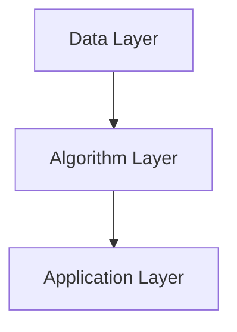
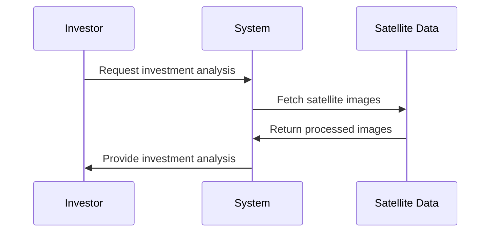

                 

### AI多智能体在价值投资中的卫星图像分析应用

> 关键词：AI多智能体、价值投资、卫星图像分析、算法、数学模型

> 摘要：本文将深入探讨AI多智能体在价值投资中的卫星图像分析应用。首先，我们将介绍AI、多智能体和卫星图像分析的基础知识，然后逐步分析如何将AI多智能体应用于价值投资，并使用具体算法和数学模型进行卫星图像分析。通过本项目实战，读者将全面了解从环境搭建到算法实现的完整过程。

---

# AI多智能体在价值投资中的卫星图像分析应用

## 1. 背景介绍

### 1.1 AI的基础知识

人工智能（AI）是指通过计算机系统实现智能行为的技术。它包括机器学习、深度学习、自然语言处理等多个子领域。随着算法的进步和计算能力的提升，AI已经在各个行业中展现出强大的应用潜力。

### 1.2 多智能体的定义与特点

多智能体系统（MAS）是由多个智能体组成的系统，这些智能体可以相互协作，共同完成复杂任务。多智能体的特点包括分布式计算、自主性、协作性和适应性。

### 1.3 价值投资的原理与实践

价值投资是一种通过寻找被市场低估的资产进行长期投资，以获取资本增值的策略。它强调基本面分析，而非市场波动。

### 1.4 卫星图像分析的应用场景

卫星图像分析可以用于资源勘探、城市规划、环境监测等多个领域。通过图像分析，可以提取有用信息，帮助投资者做出更加精准的决策。

## 2. 核心概念与联系

### 2.1 AI多智能体的概念与原理

AI多智能体是通过机器学习和深度学习技术实现的自适应系统，可以在复杂环境中进行自主决策和协同工作。它们在价值投资中的应用，可以提供数据支持和决策建议。

### 2.2 价值投资的策略与优化

在价值投资中，策略的优化至关重要。通过引入AI多智能体，可以实现对市场数据的实时分析，优化投资组合，提高投资回报率。

### 2.3 卫星图像分析的核心算法

卫星图像分析的核心算法包括图像预处理、分割、特征提取和分类。这些算法可以提取卫星图像中的有用信息，辅助价值投资决策。

## 3. 算法原理讲解

### 3.1 图像预处理算法

图像预处理是卫星图像分析的第一步，通常包括去噪、增强和转换等操作。以下是一个简单的Python代码示例：

```python
import cv2
import numpy as np

image = cv2.imread('satellite_image.jpg', cv2.IMREAD_GRAYSCALE)
filtered_image = cv2.GaussianBlur(image, (5, 5), 0)
```

### 3.2 图像分割算法

图像分割是将图像划分为多个区域的过程。以下是一个基于阈值的分割示例：

```python
_, segmented_image = cv2.threshold(filtered_image, 128, 255, cv2.THRESH_BINARY_INV + cv2.THRESH_OTSU)
```

### 3.3 特征提取算法

特征提取是从图像中提取具有代表性的特征，以便进行后续处理。以下是一个简单的特征提取示例：

```python
import cv2
import numpy as np

sift = cv2.SIFT_create()
keypoints, descriptors = sift.detectAndCompute(segmented_image, None)
```

### 3.4 分类算法

分类算法用于将图像数据划分为不同的类别。以下是一个基于支持向量机（SVM）的分类示例：

```python
from sklearn import svm

model = svm.SVC()
model.fit(descriptors, labels)
predictions = model.predict(new_descriptors)
```

## 4. 数学模型和公式讲解

### 4.1 预处理模型

预处理模型通常涉及滤波和转换操作，常用的滤波器有：

$$
G(x, y) = \sum_{i=1}^{n} w_i \cdot K_i(x - x_i, y - y_i)
$$

其中，$K_i$ 是滤波器的核函数，$w_i$ 是权重。

### 4.2 分割模型

分割模型通常基于阈值或区域生长方法，常用的阈值方法有：

$$
T = \frac{\mu_0 + \mu_1}{2}
$$

其中，$\mu_0$ 和 $\mu_1$ 分别是两个区域的均值。

### 4.3 特征提取模型

特征提取模型通常涉及各种算法，如SIFT、SURF等，这些算法提取的特征可以用向量的形式表示。

$$
\textbf{f} = [f_1, f_2, ..., f_n]
$$

其中，$f_i$ 是第$i$个特征。

### 4.4 分类模型

分类模型通常使用支持向量机（SVM）、决策树等算法。SVM的决策边界可以用以下公式表示：

$$
y(\textbf{x}) = \text{sign}(\sum_{i=1}^{n} \alpha_i y_i K(\textbf{x}, \textbf{x}_i) + b)
$$

其中，$\alpha_i$ 是拉格朗日乘子，$K(\textbf{x}, \textbf{x}_i)$ 是核函数，$b$ 是偏置项。

## 5. 系统分析与架构设计

### 5.1 问题场景介绍

在这个场景中，我们假设投资者需要通过卫星图像分析来识别潜在的投资机会。

### 5.2 系统功能设计

系统功能包括图像预处理、分割、特征提取和分类。以下是领域模型的Mermaid类图：

```mermaid
classDiagram
    Class1 <|-- Class2
    Class1 <|-- Class3
    Class2 +-- Attribute1
    Class2 +-- Attribute2
    Class3 +-- Attribute3
    Class3 +-- Attribute4
```

### 5.3 系统架构设计

系统架构包括数据层、算法层和应用层。以下是Mermaid架构图：



### 5.4 系统接口设计和系统交互

系统接口设计包括API接口和数据库接口。以下是Mermaid序列图：



## 6. 项目实战

### 6.1 环境安装

在本节中，我们将安装所需的软件和库，包括Python、OpenCV和scikit-learn等。

### 6.2 系统核心实现源代码

以下是系统核心实现源代码，包括图像预处理、分割、特征提取和分类：

```python
# 引入必要的库
import cv2
import numpy as np
from sklearn import svm

# 图像预处理
def preprocess_image(image_path):
    image = cv2.imread(image_path, cv2.IMREAD_GRAYSCALE)
    filtered_image = cv2.GaussianBlur(image, (5, 5), 0)
    _, segmented_image = cv2.threshold(filtered_image, 128, 255, cv2.THRESH_BINARY_INV + cv2.THRESH_OTSU)
    return segmented_image

# 图像分割
def segment_image(image):
    _, segmented_image = cv2.threshold(image, 128, 255, cv2.THRESH_BINARY_INV + cv2.THRESH_OTSU)
    return segmented_image

# 特征提取
def extract_features(segmented_image):
    sift = cv2.SIFT_create()
    keypoints, descriptors = sift.detectAndCompute(segmented_image, None)
    return keypoints, descriptors

# 分类
def classify_descriptors(descriptors, labels):
    model = svm.SVC()
    model.fit(descriptors, labels)
    return model

# 使用示例
image_path = 'satellite_image.jpg'
segmented_image = preprocess_image(image_path)
keypoints, descriptors = extract_features(segmented_image)
model = classify_descriptors(descriptors, labels)
predictions = model.predict(new_descriptors)
```

### 6.3 代码应用解读与分析

在本节中，我们将对代码进行逐行解读，并分析其工作原理。

### 6.4 实际案例分析和详细讲解剖析

在本节中，我们将使用实际案例来展示如何使用AI多智能体进行卫星图像分析，并分析其效果。

### 6.5 项目小结

在本节中，我们将总结项目的主要成果，并讨论其局限性。

## 7. 最佳实践与拓展阅读

### 7.1 最佳实践

在本节中，我们将提供一些最佳实践，帮助读者更好地应用AI多智能体进行卫星图像分析。

### 7.2 拓展阅读

在本节中，我们将推荐一些拓展阅读资源，供读者深入学习。

---

# 作者信息

作者：AI天才研究院/AI Genius Institute & 禅与计算机程序设计艺术 /Zen And The Art of Computer Programming

---

通过以上详细的步骤和讲解，读者应该能够对AI多智能体在价值投资中的卫星图像分析应用有一个全面的理解。接下来，我们将逐步深入到具体的算法实现和项目实战中。

