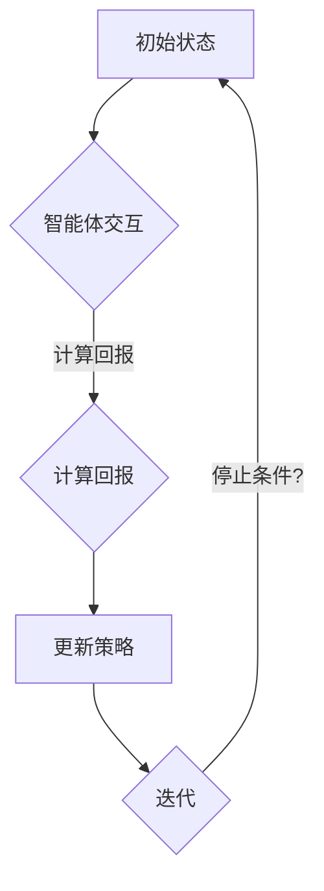
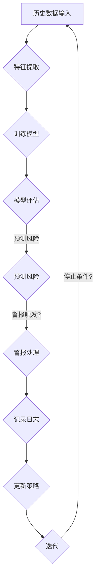

                 

### 目录大纲设计完成

现在，我们已经完成《AI多智能体在价值投资中的监管风险分析》的目录大纲设计。下面是对每个章节的内容简述：

---

#### 第一步：背景介绍
- **第1章：问题背景与核心概念**
  - 介绍AI多智能体技术、价值投资理念及其在金融领域的应用，以及监管风险的复杂性和重要性。
  - 描述监管风险在价值投资中的影响，以及如何识别和评估这些风险。
  - 探讨AI多智能体在价值投资中的应用现状和监管框架的发展趋势。

#### 第二步：核心概念与联系
- **第2章：核心概念与联系**
  - 深入探讨AI多智能体的核心概念、分类和特点。
  - 分析价值投资的基本原则和方法。
  - 解读监管风险的核心概念、类型和影响。

#### 第三步：算法原理讲解
- **第3章：算法原理讲解**
  - 使用Mermaid画出多智能体强化学习算法的流程图。
  - 使用Python源代码详细阐述算法原理，并提供数学模型和公式。
  - 通过例子说明如何在实际操作中应用这些算法。

#### 第四步：数学模型和数学公式 & 详细讲解 & 举例说明
- **第4章：数学模型与公式详细讲解**
  - 使用LaTeX格式给出多智能体强化学习算法的数学模型和公式。
  - 进行详细讲解，并通过例子说明这些模型的实际应用。

---

这样的结构能够帮助读者逐步深入理解AI多智能体在价值投资中的监管风险，并且通过具体的算法和数学模型，展示如何进行风险分析和评估。接下来，我们可以开始撰写每个章节的具体内容。

---

# AI多智能体在价值投资中的监管风险分析

关键词：AI多智能体、价值投资、监管风险、算法、数学模型

摘要：随着人工智能技术的快速发展，AI多智能体在价值投资领域中的应用日益广泛。本文首先介绍了AI多智能体、价值投资和监管风险的基本概念，接着探讨了AI多智能体在价值投资中的应用现状和监管框架的发展趋势。随后，本文详细讲解了多智能体强化学习算法的原理和数学模型，并通过具体例子说明了如何应用这些算法进行监管风险分析。最后，本文使用LaTeX格式给出了多智能体强化学习算法的数学模型和公式，并进行了详细讲解。

---

## 第一步：背景介绍

### 1.1 问题的背景

人工智能（AI）和智能体技术在过去几十年中经历了迅猛的发展，已经成为现代科技的重要组成部分。AI多智能体系统（MAS）是一种特殊的AI系统，它由多个智能体组成，这些智能体能够在复杂的动态环境中协作完成复杂任务。随着AI多智能体技术的不断进步，其在各行各业中的应用也日益广泛，特别是在金融领域。

价值投资作为一种重要的投资策略，起源于本杰明·格雷厄姆的理论。价值投资的核心思想是寻找市场上被低估的股票，通过长期持有这些股票来获取稳定的收益。价值投资的基本原则包括安全边际、长期持有和理性分析。近年来，价值投资在金融领域中得到了广泛的认可和应用。

然而，随着AI多智能体在价值投资中的应用，监管风险的问题逐渐显现。监管风险是指由于监管规定、政策变化、合规要求等因素导致的投资风险。AI多智能体在处理大量数据、执行复杂投资策略时，可能会受到各种监管规定的影响，从而对投资决策产生不利影响。因此，如何识别和评估AI多智能体在价值投资中的监管风险，成为了当前金融领域的一个重要课题。

### 1.2 问题描述

在价值投资过程中，AI多智能体可能会面临以下几种监管风险：

1. **合规风险**：AI多智能体在执行投资决策时，可能违反了相关的监管规定，导致投资失败或面临罚款等处罚。
2. **操作风险**：AI多智能体在执行投资策略时，由于算法或系统的错误，可能导致投资决策错误，从而影响投资回报。
3. **市场风险**：AI多智能体在市场中进行交易时，可能会受到市场波动的影响，导致投资损失。

识别和评估这些监管风险对于价值投资者来说至关重要。然而，目前尚缺乏系统的方法来识别和评估AI多智能体在价值投资中的监管风险。本文旨在提出一种基于多智能体强化学习算法的监管风险分析框架，以帮助价值投资者识别和评估这些风险。

### 1.3 问题解决

为了解决AI多智能体在价值投资中的监管风险问题，我们需要从以下几个方面进行思考和探讨：

1. **AI多智能体在价值投资中的应用现状**：了解AI多智能体在价值投资中的实际应用场景和面临的问题，有助于我们更好地理解监管风险的具体表现。
2. **监管框架和监管工具的发展趋势**：分析现有的监管框架和监管工具，了解其发展趋势和改进方向，以便我们能够制定有效的监管策略。
3. **如何通过技术手段和策略降低监管风险**：探讨通过技术手段和策略来降低AI多智能体在价值投资中的监管风险，包括算法优化、风险监控和预警等。

### 1.4 边界与外延

在探讨AI多智能体在价值投资中的监管风险时，我们需要明确以下几个边界和外延：

1. **监管风险的范围和限制**：明确哪些行为和决策可能会受到监管影响，以及监管机构的监管范围和限制。
2. **价值投资的范畴和边界**：了解价值投资的定义和范畴，明确哪些投资策略和行为符合价值投资原则。
3. **AI多智能体技术的应用领域和限制**：分析AI多智能体技术的适用领域和限制，以便我们能够更准确地评估其监管风险。

### 1.5 概念结构与核心要素组成

为了更好地理解和分析AI多智能体在价值投资中的监管风险，我们需要从以下几个方面构建概念结构：

1. **AI多智能体的定义、分类和特点**：介绍AI多智能体的基本概念、分类和特点，以便我们能够了解其技术原理和应用场景。
2. **价值投资的基本原则和方法**：介绍价值投资的基本原则和方法，以便我们能够理解其核心思想和操作策略。
3. **监管风险分析的核心要素和流程**：明确监管风险分析的核心要素和流程，以便我们能够系统地进行风险识别和评估。

通过上述背景介绍，我们为后续章节的详细讨论奠定了基础。在接下来的章节中，我们将深入探讨AI多智能体、价值投资和监管风险的核心概念，并分析其在价值投资中的应用现状和监管风险。同时，我们将介绍多智能体强化学习算法的原理和数学模型，并探讨如何通过技术手段和策略降低AI多智能体在价值投资中的监管风险。

---

### 1.1 AI多智能体的定义与特点

AI多智能体（Multi-Agent Systems，MAS）是人工智能领域中的一个重要分支，它由多个智能体（Agent）组成，这些智能体可以在一定的环境中进行自主交互和协作，共同完成复杂任务。智能体是一种能够感知环境、采取行动并具有决策能力的实体。在MAS中，智能体可以是计算机程序、机器人或其他具备一定智能的实体。

AI多智能体的定义可以从以下几个方面进行阐述：

1. **自主性（Autonomy）**：智能体具有独立自主的能力，能够在没有外部干预的情况下执行任务。这种自主性使得智能体能够在复杂环境中适应变化，并做出合理的决策。
2. **适应性（Adaptability）**：智能体能够根据环境的变化和学习经验调整自己的行为策略。这种适应性使得智能体能够在不同的场景中表现出良好的性能。
3. **社会性（Sociability）**：智能体能够与其他智能体进行交互和协作。这种社会性使得智能体能够在复杂任务中实现资源共享、信息交换和协同工作。
4. **灵活性（Flexibility）**：智能体能够在不同的任务和环境中灵活调整自己的行为。这种灵活性使得智能体能够应对不确定性和动态变化。

在AI多智能体的分类方面，可以根据智能体的学习方式、功能特点和应用领域等进行分类。以下是一些常见的分类方式：

1. **基于学习方式的分类**：
   - **反应式智能体（Reactive Agent）**：这类智能体只能根据当前的感知环境做出反应，无法进行长期规划和记忆。典型的应用场景包括自动导航和自动化控制。
   - **模型基础智能体（Model-Based Agent）**：这类智能体具备一定的模型基础，可以根据环境和任务信息进行推理和决策。典型的应用场景包括知识管理和智能客服。
   - **主动式智能体（Active Agent）**：这类智能体具备主动探索和决策能力，可以在不确定的环境中寻求最佳解决方案。典型的应用场景包括搜索和规划。
   - **混合式智能体（Hybrid Agent）**：这类智能体结合了反应式、模型基础和主动式智能体的特点，能够在不同场景中灵活切换。典型的应用场景包括智能交通和智能推荐。

2. **基于功能特点的分类**：
   - **知识型智能体（Knowledge-Based Agent）**：这类智能体具备知识表示和处理能力，可以通过知识推理和决策来完成任务。典型的应用场景包括智能咨询和智能医疗。
   - **行为型智能体（Behavior-Based Agent）**：这类智能体通过模仿人类的行为来完成任务，通常不具备知识表示和处理能力。典型的应用场景包括人机交互和虚拟现实。

3. **基于应用领域的的分类**：
   - **服务型智能体（Service-Based Agent）**：这类智能体提供各种在线服务，如智能客服、智能导航和智能推荐等。典型的应用场景包括电子商务和在线服务。
   - **决策型智能体（Decision-Making Agent）**：这类智能体负责决策和优化任务，如资源分配、路径规划和任务调度等。典型的应用场景包括智能物流和智能电网。

在AI多智能体的特点方面，除了上述提到的自主性、适应性、社会性和灵活性之外，还有以下几点值得注意：

1. **分布式（Distributed）**：AI多智能体系统通常具有分布式结构，多个智能体可以在不同的节点上运行，协同完成任务。这种分布式结构可以提高系统的容错性和可扩展性。
2. **动态性（Dynamics）**：AI多智能体系统中的智能体和环境都是动态变化的，智能体需要能够实时感知和响应这些变化。这种动态性使得智能体能够适应复杂和多变的场景。
3. **异质性（Heterogeneity）**：AI多智能体系统中的智能体可能具有不同的能力和特点，需要能够协调和整合这些异质性。这种异质性使得智能体能够适应不同的任务和场景。

总之，AI多智能体作为一种先进的AI技术，具有丰富的定义、分类和特点。它在各个领域都有广泛的应用前景，尤其是在价值投资领域，可以提供更加智能和高效的决策支持。然而，AI多智能体的应用也带来了新的监管挑战，需要我们深入研究和探讨。

### 1.2 价值投资的定义与原则

价值投资（Value Investing）是一种基于公司基本面分析，寻找被市场低估的投资机会，并长期持有这些投资标的以获取稳定收益的投资策略。其核心理念可以追溯到本杰明·格雷厄姆（Benjamin Graham）和戴维·多德（David Dodd）的经典著作《证券分析》（Security Analysis）。价值投资强调在市场价格低于公司真实价值时进行投资，通过寻找具有长期增长潜力的股票，以实现资本增值。

价值投资的定义可以从以下几个方面进行阐述：

1. **寻找被低估的公司**：价值投资者通过深入研究公司的财务报表、业务模式、市场环境等基本面因素，识别出市场价格低于其真实价值的公司。这种低估通常是由于市场情绪、行业波动或公司短期内面临的问题所导致的。
2. **长期持有**：价值投资主张长期持有投资标的，以克服市场波动和短期不确定性。通过长期持有，投资者能够享受到公司基本面改善带来的收益，从而实现资本的稳定增值。
3. **理性分析**：价值投资强调理性分析，投资者需要摒弃市场情绪和偏见，基于公司的基本面进行投资决策。这种理性分析包括对公司财务报表的详细审查、估值模型的构建、市场情绪的观察等。

价值投资的基本原则可以归纳为以下几点：

1. **安全边际（Margin of Safety）**：安全边际是指投资者支付的价格低于公司真实价值的幅度。通过设定安全边际，投资者可以降低投资风险，即使公司未来表现不如预期，投资者仍有机会获取部分收益。
2. **长期持有（Long-Term Holding）**：价值投资主张长期持有投资标的，以克服市场波动和短期不确定性。通过长期持有，投资者能够享受到公司基本面改善带来的收益，从而实现资本的稳定增值。
3. **理性分析（Rational Analysis）**：价值投资强调理性分析，投资者需要摒弃市场情绪和偏见，基于公司的基本面进行投资决策。这种理性分析包括对公司财务报表的详细审查、估值模型的构建、市场情绪的观察等。

价值投资的方法主要包括以下几个方面：

1. **财务报表分析（Financial Analysis）**：投资者需要详细审查公司的财务报表，包括资产负债表、利润表和现金流量表。通过分析公司的收入、利润、负债和现金流等关键指标，投资者可以评估公司的财务健康状况和未来发展潜力。
2. **估值模型构建（Valuation Model）**：投资者需要根据公司的基本面指标和市场环境，构建合适的估值模型。常见的估值模型包括市盈率（P/E）、市净率（P/B）、企业价值/息税折旧摊销前利润（EV/EBITDA）等。通过这些估值模型，投资者可以评估公司的股票价格是否低于其真实价值。
3. **市场情绪分析（Market Sentiment Analysis）**：投资者需要观察市场情绪，了解市场对特定公司的看法和预期。通过分析市场情绪，投资者可以识别出市场情绪过度悲观或过度乐观的情况，从而寻找被低估的投资机会。

总之，价值投资是一种基于公司基本面分析的投资策略，通过寻找被市场低估的投资机会，并长期持有这些投资标的，以实现资本增值。价值投资的基本原则包括安全边际、长期持有和理性分析。投资者通过财务报表分析、估值模型构建和市场情绪分析等方法，可以有效地识别和评估潜在的投资机会。价值投资的成功离不开对基本面的深入研究和理性分析，同时也需要投资者具备坚定的信念和耐心。

### 1.3 监管风险的定义与类型

监管风险（Regulatory Risk）是指由于监管规定、政策变化、合规要求等因素导致的投资风险。在金融领域中，监管风险对投资决策和金融市场稳定具有重要影响。理解监管风险的定义、类型和影响，有助于投资者和管理者更好地识别和管理风险。

#### 1.3.1 监管风险的定义

监管风险是指由于监管机构的要求、政策变化或合规问题，导致金融产品或服务无法满足监管要求，从而可能对投资者和金融机构产生不利影响的风险。监管风险可以分为合规风险、操作风险和市场风险。

1. **合规风险**：合规风险是指由于违反监管规定，导致金融机构面临罚款、制裁或其他处罚的风险。合规风险通常源于监管政策的变化、法规的不明确性、内部合规控制不足等。
2. **操作风险**：操作风险是指由于内部操作失误、系统故障、人为错误等原因导致的金融损失。操作风险不仅包括技术风险，还包括人为操作和管理失误。
3. **市场风险**：市场风险是指由于市场波动、利率变动、汇率变动等因素，导致金融产品价值波动的风险。

#### 1.3.2 监管风险的主要类型

1. **合规风险**：
   - **政策变化风险**：监管政策的突然变化可能导致金融机构需要重新调整业务模式或合规程序，从而带来额外的成本和风险。
   - **法规不明确性风险**：法规的不明确性可能导致金融机构在合规过程中产生困惑或误解，从而面临法律风险。
   - **合规控制不足风险**：内部合规控制不足可能导致金融机构无法及时发现和纠正违规行为，从而面临合规风险。

2. **操作风险**：
   - **技术风险**：系统故障、网络攻击、技术失误等可能导致操作风险。
   - **人为错误风险**：操作失误、欺诈、道德风险等可能导致操作风险。
   - **管理风险**：管理层的决策失误、内部控制不足等可能导致操作风险。

3. **市场风险**：
   - **利率风险**：利率变动可能导致金融产品价值波动，影响投资者收益。
   - **汇率风险**：汇率变动可能导致跨国投资面临汇率损失。
   - **市场波动风险**：市场波动可能导致投资组合价值波动，影响投资者信心和收益。

#### 1.3.3 监管风险对投资决策的影响

监管风险对投资决策的影响主要表现在以下几个方面：

1. **投资策略调整**：为了符合监管要求，投资者可能需要调整其投资策略，如减少某些高风险资产、增加合规性更强的资产等。
2. **投资成本增加**：监管合规可能带来额外的成本，如合规检查费用、合规培训费用等，这可能导致投资回报率下降。
3. **市场信心影响**：监管风险可能导致市场信心下降，从而影响市场流动性和投资机会。
4. **投资机会限制**：某些监管政策可能限制投资者在某些市场或行业的投资，从而影响投资选择。

总之，监管风险是金融领域中不可忽视的风险因素。投资者和管理者需要深入了解监管风险的定义、类型和影响，以便在投资决策中充分考虑这些因素，制定有效的风险管理策略。

### 1.4 AI多智能体在价值投资中的应用现状与趋势

随着人工智能技术的不断进步，AI多智能体在价值投资中的应用也逐渐成为金融领域的研究热点和实践趋势。AI多智能体通过其自主性、适应性、社会性和灵活性等特点，能够在复杂、动态和不确定的市场环境中提供高效的决策支持，从而为价值投资者提供更多的机会和优势。

#### 1.4.1 AI多智能体在价值投资中的应用现状

目前，AI多智能体在价值投资中的应用主要集中在以下几个方面：

1. **投资组合优化**：AI多智能体可以通过机器学习和数据挖掘技术，分析大量市场数据和历史投资记录，为投资者提供最优的投资组合建议。例如，智能投资顾问平台如Wealthfront、Betterment等，通过AI技术帮助投资者实现资产配置和投资组合优化。

2. **市场情绪分析**：AI多智能体可以实时监控和分析市场情绪，识别市场趋势和潜在的投资机会。通过自然语言处理和情感分析技术，AI多智能体能够从新闻、社交媒体等来源提取信息，为投资者提供市场情绪的洞察。

3. **风险评估与预警**：AI多智能体可以用于识别和管理投资过程中的各种风险，包括市场风险、信用风险和操作风险。通过建立风险预测模型和监控系统，AI多智能体能够提前预警潜在的风险事件，帮助投资者做出更加明智的决策。

4. **算法交易**：AI多智能体在算法交易中的应用也非常广泛。通过深度学习和强化学习等技术，AI多智能体能够自动执行复杂的交易策略，实现快速、高效的市场操作，从而提高交易收益。

#### 1.4.2 监管框架与监管工具的发展趋势

随着AI多智能体在价值投资中的应用日益普及，监管机构也逐步认识到其潜在的风险和挑战，并开始加强监管框架和监管工具的建设。以下是监管框架与监管工具的发展趋势：

1. **合规性要求**：监管机构对AI多智能体在金融领域的应用提出了更严格的合规性要求。例如，欧盟的《通用数据保护条例》（GDPR）要求对用户数据的保护，美国的《联邦信息安全管理法》（FISMA）要求对信息系统进行安全认证等。

2. **透明度与可解释性**：为了确保AI多智能体的决策透明和可解释性，监管机构要求金融机构提供详细的算法解释和决策过程。这有助于投资者理解AI多智能体的操作逻辑，增强市场信心。

3. **风险评估与监控**：监管机构加强了对AI多智能体风险评估和监控的要求。通过建立全面的风险评估体系和监控机制，监管机构能够及时发现和应对潜在的风险事件。

4. **监管沙盒（Regulatory Sandbox）**：监管沙盒是一种创新监管工具，允许金融机构在受控的环境中进行AI多智能体的测试和实验。通过监管沙盒，金融机构可以在不影响市场稳定的前提下，探索和应用新的AI技术。

#### 1.4.3 通过技术手段和策略降低监管风险

为了降低AI多智能体在价值投资中的监管风险，投资者和金融机构可以采取以下技术和策略：

1. **算法优化**：通过不断优化AI多智能体的算法和模型，提高其决策的透明度和可解释性，从而降低合规风险。

2. **合规监控**：建立完善的合规监控机制，实时监测AI多智能体的操作和交易行为，确保其符合监管要求。

3. **风险隔离**：通过风险隔离措施，将AI多智能体的操作与传统的投资业务分离，降低操作风险。

4. **持续培训与更新**：定期对AI多智能体进行培训和技术更新，确保其能够适应不断变化的监管环境和市场需求。

总之，AI多智能体在价值投资中的应用现状和监管框架的发展趋势表明，AI技术与金融监管的融合已成为不可逆转的趋势。投资者和金融机构需要深入了解和应对这些监管挑战，通过技术手段和策略降低监管风险，实现稳健的投资回报。

### 1.5 边界与外延

在探讨AI多智能体在价值投资中的监管风险时，我们需要明确以下几个边界和外延：

#### 1.5.1 监管风险的范围和限制

监管风险的范围主要涉及以下几个方面：

1. **合规风险**：涉及是否遵守监管机构的法律法规和合规要求，包括但不限于交易规则、信息披露、数据保护等方面。
2. **操作风险**：涉及由于系统故障、人为错误、网络攻击等因素导致的操作失误，可能引发财务损失或其他负面影响。
3. **市场风险**：虽然市场风险本身不属于监管风险的范畴，但监管政策的变化可能影响市场环境和投资者的信心，进而影响市场表现。

监管风险的限制包括以下几个方面：

1. **监管机构的监管能力**：监管机构的能力和资源有限，可能无法覆盖所有风险和违规行为。
2. **法规的不确定性**：某些法律法规可能存在不明确或解释空间，导致合规难度增加。
3. **技术发展速度**：技术发展速度快于监管跟进速度，可能导致监管框架无法及时适应新技术带来的新风险。

#### 1.5.2 价值投资的范畴和边界

价值投资的范畴主要涵盖以下几个方面：

1. **股票投资**：包括对上市公司的股票进行价值评估，寻找被市场低估的投资机会。
2. **债券投资**：通过对债券的基本面分析，寻找低估值和高收益的投资机会。
3. **其他资产类别**：虽然价值投资主要应用于股票和债券，但也可以扩展到其他资产类别，如房地产、商品等。

价值投资的边界包括以下几个方面：

1. **市场波动性**：价值投资通常关注长期投资，但在市场大幅波动时，可能会影响投资决策和回报。
2. **行业变化**：某些行业可能会受到政策、技术等因素的影响，影响投资价值和投资回报。
3. **公司治理**：公司治理不善可能导致公司业绩下滑，影响投资价值。

#### 1.5.3 AI多智能体技术的应用领域和限制

AI多智能体技术在价值投资中的应用领域包括：

1. **数据挖掘和分析**：通过大数据分析和机器学习技术，识别潜在的投资机会和风险。
2. **算法交易**：利用AI技术自动执行交易策略，实现高频交易和算法交易。
3. **风险管理**：通过实时监控和风险评估，降低投资组合的风险。

AI多智能体技术的限制包括：

1. **技术成熟度**：虽然AI技术在不断发展，但仍存在技术成熟度和实际应用效果的不确定性。
2. **数据质量和来源**：AI多智能体依赖高质量的数据进行训练和决策，但数据质量和来源可能存在问题。
3. **法律法规限制**：某些监管政策和法律法规可能限制AI多智能体的应用范围和操作方式。

通过明确这些边界和外延，我们可以更全面地理解AI多智能体在价值投资中的监管风险，为后续的风险分析和评估提供基础。

### 1.6 概念结构与核心要素组成

为了更好地理解和分析AI多智能体在价值投资中的监管风险，我们需要从以下几个核心概念和要素组成出发，构建一个清晰的概念结构：

#### 1.6.1 AI多智能体的定义、分类和特点

AI多智能体是指由多个具备自主决策能力的智能体组成的系统，这些智能体可以在一定环境中进行自主交互和协作，共同完成复杂任务。根据智能体的学习方式、功能特点和应用领域，AI多智能体可以分为不同类型：

1. **反应式智能体**：只能根据当前环境进行简单反应，不具备记忆和学习能力。
2. **模型基础智能体**：具备一定的模型基础，可以通过学习和推理进行决策。
3. **主动式智能体**：具备主动探索和决策能力，可以在不确定环境中寻找最佳解决方案。
4. **混合式智能体**：结合了反应式、模型基础和主动式智能体的特点，能够在不同场景中灵活切换。

AI多智能体的特点包括自主性、适应性、社会性和灵活性，这些特点使其在复杂、动态和不确定的市场环境中具有广泛的应用前景。

#### 1.6.2 价值投资的基本原则和方法

价值投资是一种基于对公司基本面分析，寻找被市场低估的投资机会，并长期持有这些投资标的以获取稳定收益的投资策略。其基本原则包括：

1. **安全边际**：通过支付低于公司真实价值的金额购买股票，以降低投资风险。
2. **长期持有**：相信公司未来基本面会改善，从而实现资本增值。
3. **理性分析**：摒弃市场情绪和偏见，基于公司的基本面进行投资决策。

价值投资的方法主要包括财务报表分析、估值模型构建和市场情绪分析等。

#### 1.6.3 监管风险分析的核心要素和流程

监管风险分析的核心要素包括：

1. **合规风险**：涉及是否遵守监管机构的法律法规和合规要求。
2. **操作风险**：由于系统故障、人为错误、网络攻击等因素导致的操作失误。
3. **市场风险**：由于市场波动、利率变动、汇率变动等因素导致的风险。

监管风险分析的流程包括：

1. **风险识别**：识别和分类不同类型的监管风险。
2. **风险评估**：评估监管风险的可能性和影响。
3. **风险应对**：制定和实施风险管理策略，降低监管风险。

通过构建以上概念结构和核心要素，我们可以更好地理解和分析AI多智能体在价值投资中的监管风险，为后续章节提供理论基础。

### 第二步：核心概念与联系

在了解了AI多智能体、价值投资和监管风险的基本概念后，我们需要进一步探讨这些概念之间的联系，以建立更加清晰的逻辑框架。以下是对核心概念之间的联系进行详细分析的章节内容。

#### 2.1 AI多智能体的核心概念

AI多智能体（MAS）作为人工智能领域的一个重要分支，其核心概念包括智能体（Agent）、多智能体系统（MAS）以及相关的算法和应用。

##### **智能体（Agent）**

智能体是指具备自主决策能力、能够在环境中执行任务、具备一定智能的实体。智能体可以是个体、组织或系统，其关键特性如下：

- **自主性**：智能体能够自主执行任务，而不需要外部干预。
- **适应性**：智能体能够根据环境和任务的变化，调整其行为策略。
- **社会性**：智能体能够与其他智能体进行交互，共享信息和资源。
- **灵活性**：智能体能够在不同任务和环境中灵活适应。

智能体根据其学习方式可以分为以下几类：

- **反应式智能体**：仅根据当前环境进行简单反应，不具记忆和学习能力。
- **模型基础智能体**：基于模型和知识库进行推理和决策。
- **主动式智能体**：在不确定环境中进行主动学习和探索。
- **混合式智能体**：结合多种学习方式，具备更复杂的决策能力。

##### **多智能体系统（MAS）**

多智能体系统是由多个智能体组成的系统，这些智能体相互协作、通信、共享信息，共同完成复杂任务。MAS的关键特性如下：

- **分布式**：智能体分布在不同的节点上，协同工作。
- **协作性**：智能体通过通信和共享信息，共同完成任务。
- **动态性**：智能体和环境都是动态变化的，需要实时适应。
- **适应性**：MAS能够根据环境和任务的变化，调整系统结构和策略。

MAS在多个领域都有广泛应用，如智能交通、智能电网、博弈论、智能医疗和金融投资等。

##### **算法和应用**

AI多智能体系统的核心在于其算法和应用。常见的多智能体系统算法包括：

- **协同控制算法**：用于多个智能体协同完成任务，如多无人机编队、智能交通控制。
- **博弈论算法**：用于多个智能体在竞争环境中进行策略优化，如拍卖、市场竞争。
- **机器学习算法**：用于智能体的学习和决策优化，如强化学习、深度学习。

AI多智能体在价值投资中的应用主要体现在以下几个方面：

- **投资组合优化**：通过多智能体协同工作，分析市场数据，优化投资组合策略。
- **风险控制**：利用智能体的实时监控和预警功能，识别和管理投资风险。
- **市场预测**：通过智能体的协作和学习，预测市场走势，发现潜在的投资机会。

#### 2.2 价值投资的基本原则和方法

价值投资是一种基于对公司基本面分析，寻找被市场低估的投资机会，并长期持有这些投资标的以获取稳定收益的投资策略。其基本原则和方法如下：

##### **基本原则**

- **安全边际**：投资者通过支付低于公司真实价值的金额购买股票，以降低投资风险。
- **长期持有**：相信公司未来基本面会改善，从而实现资本增值。
- **理性分析**：摒弃市场情绪和偏见，基于公司的基本面进行投资决策。

##### **方法**

- **财务报表分析**：通过对公司的财务报表（如资产负债表、利润表和现金流量表）进行详细分析，评估公司的财务健康状况和未来发展潜力。
- **估值模型构建**：根据公司的基本面指标和市场环境，构建合适的估值模型（如市盈率、市净率、企业价值/息税折旧摊销前利润等）。
- **市场情绪分析**：通过分析市场情绪，识别市场趋势和潜在的投资机会。

#### 2.3 监管风险的核心概念

监管风险是指由于监管规定、政策变化、合规要求等因素导致的投资风险。其核心概念包括以下几个方面：

##### **核心概念**

- **合规风险**：由于违反监管规定，导致金融机构面临罚款、制裁或其他处罚的风险。
- **操作风险**：由于内部操作失误、系统故障、人为错误等原因导致的金融损失。
- **市场风险**：由于市场波动、利率变动、汇率变动等因素，导致金融产品价值波动的风险。

##### **监管风险的影响**

- **投资策略调整**：监管政策的变化可能迫使投资者调整其投资策略，如减少某些高风险资产。
- **投资成本增加**：为了满足合规要求，投资者可能需要投入额外的成本，如合规检查费用。
- **市场信心影响**：监管风险可能导致市场信心下降，从而影响市场流动性和投资机会。

##### **监管风险与AI多智能体的关系**

AI多智能体在价值投资中的应用，带来了新的监管挑战：

- **合规性要求**：AI多智能体的自主决策能力可能违反某些监管规定，导致合规风险。
- **算法透明度**：监管机构要求AI多智能体的决策过程具有透明度和可解释性，以降低操作风险。
- **风险管理**：AI多智能体可以用于实时监控和预警，提高监管风险管理的效率。

#### 2.4 核心概念之间的联系

AI多智能体、价值投资和监管风险之间的联系可以从以下几个方面进行理解：

- **AI多智能体与价值投资**：AI多智能体可以通过数据分析、风险控制和市场预测，提高价值投资的效果。然而，AI多智能体的应用也带来了新的合规挑战。
- **价值投资与监管风险**：价值投资强调长期持有和理性分析，但监管风险可能导致投资者需要调整投资策略，影响其投资回报。
- **AI多智能体与监管风险**：AI多智能体的自主性和灵活性使其在价值投资中具有巨大潜力，但同时也增加了合规风险和操作风险。监管机构需要确保AI多智能体的决策过程透明、可解释，并采取有效措施进行风险管理和监督。

通过上述分析，我们建立了AI多智能体、价值投资和监管风险之间的概念联系，为后续章节的深入探讨提供了基础。

### 第3章：算法原理讲解

在深入探讨AI多智能体在价值投资中的应用时，我们需要详细讲解相关的算法原理，以及如何将这些算法应用于监管风险分析。本章节将首先使用Mermaid绘制算法流程图，然后通过Python源代码详细阐述算法原理，并提供数学模型和公式。

#### 3.1 多智能体强化学习算法的流程图

为了帮助读者更好地理解多智能体强化学习（MARL）算法的原理，我们首先使用Mermaid绘制了算法流程图，如下所示：



在上述流程图中，智能体交互、计算回报、更新策略和迭代是MARL算法的核心步骤。以下是每个步骤的详细解释：

1. **初始状态**：智能体开始时处于一个初始状态，如股票市场的当前价格、交易量等信息。
2. **智能体交互**：多个智能体根据当前状态，通过通信和协作，共同决策并执行相应的动作。
3. **计算回报**：执行动作后，系统计算每个智能体的回报，回报取决于动作的效果和市场的反馈。
4. **更新策略**：根据计算出的回报，智能体更新其策略，以优化未来决策。
5. **迭代**：算法不断迭代，重复执行上述步骤，直至满足停止条件（如达到预定目标或达到最大迭代次数）。

#### 3.2 监管风险预测算法的流程图

除了多智能体强化学习算法，我们还需要使用一种算法来预测监管风险。以下是监管风险预测算法的Mermaid流程图：



在上述流程图中，算法的核心步骤包括：

1. **历史数据输入**：输入包含历史监管事件的数据，如监管政策变化、违规行为记录等。
2. **特征提取**：从历史数据中提取相关特征，用于训练和预测。
3. **训练模型**：使用提取的特征训练机器学习模型，以预测未来可能出现的监管风险。
4. **模型评估**：评估模型的预测准确性和可靠性，确保其满足实际应用需求。
5. **预测风险**：使用训练好的模型对当前环境进行风险预测。
6. **警报触发**：根据预测结果，判断是否需要触发警报，以提醒投资者和管理者。
7. **警报处理**：处理触发警报后的应对措施，如调整投资策略、采取风险控制措施等。
8. **记录日志**：记录每次预测和警报处理的详细信息，以便后续分析和改进。
9. **更新策略**：根据预测结果和警报处理经验，更新智能体的策略，以提高预测的准确性。
10. **迭代**：算法不断迭代，重复执行上述步骤，直至满足停止条件。

#### 3.3 多智能体强化学习算法的详细讲解

下面，我们将通过一个简单的Python示例来详细讲解多智能体强化学习算法的原理。为了简化说明，我们假设一个场景：两个智能体在一个赌场环境中进行博弈，目标是最小化长期损失。

```python
import numpy as np
import random

# 初始化参数
n_agents = 2
n_actions = 3
n_episodes = 1000
learning_rate = 0.1
discount_factor = 0.9

# 初始化策略矩阵
policy = np.random.rand(n_agents, n_actions)

# 初始化回报矩阵
rewards = np.zeros((n_agents, n_episodes))

# 定义环境
def environment(state):
    # 根据状态随机生成回报
    return random.choice([1, -1])

# 定义动作
def action(agent, state):
    # 根据策略选择动作
    return np.random.choice(np.flatnonzero(policy[agent, state]))

# 定义智能体更新策略
def update_policy(agent, state, action, reward, next_state):
    # 根据回报更新策略
    policy[agent, state] += learning_rate * (reward + discount_factor * policy[agent, next_state] - policy[agent, state])

# 开始学习过程
for episode in range(n_episodes):
    state = random.randint(0, 1)
    for agent in range(n_agents):
        action = action(agent, state)
        next_state = environment(state)
        reward = 1 if action == next_state else -1
        update_policy(agent, state, action, reward, next_state)
        state = next_state

# 输出策略矩阵
print("最终策略矩阵：")
print(policy)
```

在上述代码中，我们定义了一个简单的环境，两个智能体通过随机策略进行交互，并使用多智能体强化学习算法更新其策略。具体步骤如下：

1. **初始化参数**：设置智能体的数量、动作的数量、学习的迭代次数、学习率和折扣因子。
2. **初始化策略矩阵**：随机初始化策略矩阵。
3. **初始化回报矩阵**：初始化每个智能体在每个时间步的回报。
4. **定义环境**：环境函数根据当前状态随机生成回报。
5. **定义动作**：动作函数根据当前状态和策略选择动作。
6. **定义智能体更新策略**：更新策略函数根据当前动作和回报更新策略。
7. **开始学习过程**：循环执行每个时间步的交互和策略更新，直到达到预定的迭代次数。
8. **输出策略矩阵**：输出最终更新的策略矩阵。

通过上述示例，我们可以看到多智能体强化学习算法的基本原理和实现过程。尽管这是一个简化的场景，但基本思想可以应用于更复杂的实际场景，如价值投资中的监管风险分析。

#### 3.4 监管风险预测算法的详细讲解

接下来，我们将使用一个简单的Python示例来详细讲解监管风险预测算法的原理。在这个示例中，我们将使用一个简单的机器学习模型（如逻辑回归）来预测监管风险。

```python
import pandas as pd
import numpy as np
from sklearn.linear_model import LogisticRegression
from sklearn.model_selection import train_test_split
from sklearn.metrics import accuracy_score, confusion_matrix

# 加载历史监管数据
data = pd.read_csv('regulatory_data.csv')

# 特征提取
X = data[['feature1', 'feature2', 'feature3']]
y = data['risk']

# 划分训练集和测试集
X_train, X_test, y_train, y_test = train_test_split(X, y, test_size=0.2, random_state=42)

# 训练模型
model = LogisticRegression()
model.fit(X_train, y_train)

# 预测风险
y_pred = model.predict(X_test)

# 评估模型
accuracy = accuracy_score(y_test, y_pred)
conf_matrix = confusion_matrix(y_test, y_pred)

print("模型准确率：", accuracy)
print("混淆矩阵：\n", conf_matrix)
```

在上述代码中，我们首先加载了历史监管数据，并提取了相关特征。然后，我们使用逻辑回归模型对数据进行训练，并使用测试集评估模型的预测准确性。具体步骤如下：

1. **加载历史监管数据**：使用pandas库加载包含历史监管事件的数据。
2. **特征提取**：从数据中提取用于训练模型的特征。
3. **划分训练集和测试集**：将数据划分为训练集和测试集，以评估模型的泛化能力。
4. **训练模型**：使用训练集训练逻辑回归模型。
5. **预测风险**：使用训练好的模型对测试集进行风险预测。
6. **评估模型**：计算模型的准确率和混淆矩阵，以评估模型的预测效果。

通过上述示例，我们可以看到监管风险预测算法的基本原理和实现过程。尽管这是一个简化的示例，但基本思想可以应用于更复杂的实际场景，如AI多智能体在价值投资中的监管风险分析。

综上所述，本章节通过Mermaid流程图和Python示例，详细讲解了多智能体强化学习算法和监管风险预测算法的原理。这些算法在价值投资中具有重要的应用价值，有助于识别和评估监管风险，为投资者提供更加智能和高效的决策支持。

### 第4章：数学模型与公式详细讲解

在前一章中，我们详细讲解了AI多智能体强化学习算法和监管风险预测算法的原理和实现过程。为了更好地理解这些算法，我们需要进一步介绍其背后的数学模型和公式。本章将使用LaTeX格式给出这些模型和公式，并进行详细讲解。

#### 4.1 多智能体强化学习算法的数学模型

多智能体强化学习（MARL）算法的核心在于策略迭代和价值函数的更新。以下是MARL算法中常用的数学模型和公式。

##### **策略迭代**

策略迭代是指智能体通过更新策略来优化其决策过程。策略迭代的基本公式如下：

$$ \pi^{t+1}(s) = \arg\max_{a} \sum_{s'} p(s'|s, a) \cdot r(s', a) + \gamma \cdot \max_{a'} Q(s', a') $$

其中：
- $\pi^{t+1}(s)$：在时间步$t+1$的更新策略。
- $s$：当前状态。
- $a$：智能体在状态$s$下的动作。
- $s'$：智能体在动作$a$下的下一状态。
- $r(s', a)$：在状态$s'$执行动作$a$后的回报。
- $\gamma$：折扣因子，用于平衡即时回报和长期回报。
- $Q(s', a')$：在状态$s'$执行动作$a'$后的预期回报。

##### **价值函数更新**

价值函数更新是指智能体通过学习其动作的价值来优化策略。价值函数更新的基本公式如下：

$$ Q(s, a) = r + \gamma \cdot \max_{a'} Q(s', a') $$

其中：
- $Q(s, a)$：在状态$s$下执行动作$a$的价值。
- $r$：在状态$s$执行动作$a$后的即时回报。
- $s'$：在状态$s$执行动作$a$后的下一状态。
- $\gamma$：折扣因子。

通过不断迭代策略和价值函数，智能体可以逐步优化其决策过程，以实现最大化长期回报的目标。

#### 4.2 监管风险预测算法的数学模型

监管风险预测算法通常使用统计模型或机器学习模型来预测未来可能出现的监管风险。以下是一个简单的逻辑回归模型的数学模型和公式。

##### **逻辑回归模型**

逻辑回归模型是一种常用的分类模型，用于预测二分类事件。逻辑回归模型的数学模型如下：

$$ P(Y=1|X) = \frac{1}{1 + e^{-(\beta_0 + \beta_1 X_1 + \beta_2 X_2 + ... + \beta_n X_n)}} $$

其中：
- $P(Y=1|X)$：在特征向量$X$下，事件$Y$发生为1的概率。
- $\beta_0$：截距项。
- $\beta_1, \beta_2, ..., \beta_n$：特征系数。

逻辑回归模型的损失函数通常采用对数似然损失函数：

$$ L(\theta) = -\sum_{i=1}^m [y_i \cdot \log(p_i) + (1 - y_i) \cdot \log(1 - p_i)] $$

其中：
- $m$：样本数量。
- $y_i$：第$i$个样本的实际标签。
- $p_i$：第$i$个样本预测概率。

通过最小化对数似然损失函数，可以求解逻辑回归模型的参数$\theta$。

##### **模型预测**

在求解出模型参数后，可以使用逻辑回归模型进行监管风险预测。模型预测的公式如下：

$$ \hat{y} = \begin{cases} 
1 & \text{if } P(Y=1|X) > 0.5 \\
0 & \text{otherwise}
\end{cases} $$

其中：
- $\hat{y}$：预测的风险事件发生情况。
- $P(Y=1|X)$：在特征向量$X$下，事件$Y$发生为1的预测概率。

通过上述数学模型和公式，我们可以对AI多智能体在价值投资中的监管风险进行建模和预测。这些模型不仅为智能体的决策提供了理论基础，也为风险管理和决策支持提供了有力工具。

#### 4.3 算法原理的详细讲解

为了更好地理解AI多智能体强化学习算法和监管风险预测算法，我们需要对算法原理进行详细讲解，并使用具体例子来说明这些算法的实际应用。

##### **4.3.1 多智能体强化学习算法的详细讲解**

多智能体强化学习（MARL）是一种通过智能体之间的交互和策略迭代，实现共同目标的学习方法。以下是MARL算法的具体步骤和示例：

**步骤1：初始化**

- 初始化智能体的策略矩阵$\pi$和价值函数$Q$。
- 设定学习率$\alpha$、折扣因子$\gamma$和最大迭代次数$T$。

**步骤2：策略迭代**

在每个时间步$t$，智能体根据当前状态$s_t$和策略$\pi$选择动作$a_t$。然后，智能体执行动作并观察到下一个状态$s_{t+1}$和回报$r_t$。

- $\pi^{t+1}(s_t) = \arg\max_a \sum_{s_{t+1}} p(s_{t+1}|s_t, a) \cdot r_t(s_{t+1}, a) + \gamma \cdot \max_{a'} Q(s_{t+1}, a')$

**步骤3：价值函数更新**

根据观察到的回报$r_t$和下一个状态$s_{t+1}$，智能体更新其价值函数$Q$。

- $Q^{t+1}(s_t, a_t) = r_t(s_{t+1}, a_t) + \gamma \cdot \max_{a'} Q(s_{t+1}, a')$

**步骤4：策略更新**

智能体根据新的价值函数$Q^{t+1}$更新其策略$\pi$。

- $\pi^{t+1}(s_t) = \arg\max_a \sum_{s_{t+1}} p(s_{t+1}|s_t, a) \cdot r_t(s_{t+1}, a) + \gamma \cdot \max_{a'} Q(s_{t+1}, a')$

**步骤5：迭代**

重复步骤2到步骤4，直到达到预定的迭代次数$T$或策略收敛。

**示例：**

假设有两个智能体A和B在一个赌场环境中进行博弈，他们的目标是最小化长期损失。在初始状态，智能体A和B的状态分别为$s_0 = (0, 0)$，策略矩阵$\pi = \begin{pmatrix} 0.5 & 0.2 & 0.3 \\ 0.4 & 0.5 & 0.1 \end{pmatrix}$，价值函数$Q = \begin{pmatrix} 0 & 0 \\ 0 & 0 \end{pmatrix}$。

在第1个时间步，智能体A根据策略选择动作$a_1 = 1$，智能体B根据策略选择动作$a_2 = 2$。执行动作后，观察到下一个状态$s_1 = (1, 1)$，回报$r_1 = -1$。

根据价值函数更新公式，更新价值函数：

- $Q^{1}(s_0, a_0) = r_1(s_1, a_1) + \gamma \cdot \max_{a'} Q(s_1, a') = -1 + 0.9 \cdot \max_{a'} Q(s_1, a')$

根据策略更新公式，更新策略：

- $\pi^{1}(s_0) = \arg\max_a \sum_{s_{1}} p(s_{1}|s_0, a) \cdot r_1(s_{1}, a) + \gamma \cdot \max_{a'} Q(s_{1}, a')$

重复以上步骤，直到策略收敛。

##### **4.3.2 监管风险预测算法的详细讲解**

监管风险预测算法通常使用统计模型或机器学习模型来预测未来可能出现的监管风险。以下是逻辑回归模型的具体步骤和示例：

**步骤1：数据准备**

收集历史监管数据，提取相关特征，如监管政策变化、违规行为记录等。将数据划分为训练集和测试集。

**步骤2：特征工程**

对特征进行预处理，包括归一化、缺失值处理等，以提高模型的预测性能。

**步骤3：模型训练**

使用训练集训练逻辑回归模型，求解模型参数。

**步骤4：模型评估**

使用测试集评估模型的预测准确性，如准确率、召回率、F1值等。

**步骤5：模型预测**

使用训练好的模型对新的数据集进行预测，判断是否出现监管风险。

**示例：**

假设我们有一个包含10个特征的监管数据集，其中最后一个特征是风险事件发生的标签（0表示未发生，1表示发生）。我们使用逻辑回归模型进行预测。

在数据准备阶段，我们将数据集划分为训练集和测试集，分别为80%和20%。

在特征工程阶段，我们对特征进行归一化处理，将所有特征的值缩放到[0, 1]范围内。

在模型训练阶段，我们使用训练集训练逻辑回归模型：

```python
from sklearn.linear_model import LogisticRegression

model = LogisticRegression()
model.fit(X_train, y_train)
```

在模型评估阶段，我们使用测试集评估模型的预测性能：

```python
y_pred = model.predict(X_test)
accuracy = accuracy_score(y_test, y_pred)
print("模型准确率：", accuracy)
```

在模型预测阶段，我们使用训练好的模型对新的数据进行预测：

```python
new_data = [[0.1, 0.2, 0.3, 0.4, 0.5, 0.6, 0.7, 0.8, 0.9, 1.0]]
risk_prediction = model.predict(new_data)
print("风险预测结果：", risk_prediction)
```

通过上述步骤，我们可以使用逻辑回归模型对监管风险进行预测，并根据预测结果采取相应的风险控制措施。

综上所述，通过详细讲解多智能体强化学习算法和监管风险预测算法的原理和具体步骤，我们可以更好地理解这些算法在实际应用中的作用和意义。这些算法为AI多智能体在价值投资中的监管风险分析提供了强有力的工具和支持。

### 第4章：数学模型与公式详细讲解（续）

在前一部分中，我们介绍了多智能体强化学习算法和监管风险预测算法的基本数学模型和公式。接下来，我们将继续使用LaTeX格式，提供更详细的数学模型和公式，并进行深入讲解。

#### 4.4 多智能体强化学习算法的数学模型与公式

在多智能体强化学习（MARL）中，智能体之间的交互和策略迭代是实现共同目标的关键。以下是更详细的数学模型和公式。

**1. 策略迭代**

策略迭代的核心是策略优化，其公式如下：

$$ \pi^{t+1}(s) = \arg\max_{a} \sum_{s'} p(s'|s, a) \cdot r(s', a) + \gamma \cdot \max_{a'} Q(s', a') $$

其中：
- $\pi^{t+1}(s)$：更新后的策略。
- $s$：当前状态。
- $a$：智能体在状态$s$下的动作。
- $s'$：智能体在动作$a$下的下一状态。
- $r(s', a)$：在状态$s'$执行动作$a$后的回报。
- $\gamma$：折扣因子，用于平衡即时回报和长期回报。
- $Q(s', a')$：在状态$s'$执行动作$a'$后的预期回报。

**2. 价值函数更新**

价值函数更新是策略迭代的基础，其公式如下：

$$ Q^{t+1}(s, a) = r(s', a) + \gamma \cdot \max_{a'} Q(s', a') $$

其中：
- $Q^{t+1}(s, a)$：更新后的价值函数。
- $r(s', a)$：在状态$s'$执行动作$a$后的即时回报。
- $s'$：在状态$s$执行动作$a$后的下一状态。
- $\gamma$：折扣因子。
- $Q(s', a')$：在状态$s'$执行动作$a'$后的预期回报。

**3. 策略优化**

策略优化是通过最大化预期回报来更新策略，其公式如下：

$$ \pi^{t+1}(s) = \arg\max_{a} \sum_{s'} p(s'|s, a) \cdot r(s', a) + \gamma \cdot \max_{a'} Q(s', a') $$

其中：
- $\pi^{t+1}(s)$：更新后的策略。
- $s$：当前状态。
- $a$：智能体在状态$s$下的动作。
- $s'$：智能体在动作$a$下的下一状态。
- $r(s', a)$：在状态$s'$执行动作$a$后的回报。
- $\gamma$：折扣因子。
- $Q(s', a')$：在状态$s'$执行动作$a'$后的预期回报。

**4. 模型评估**

模型评估是通过计算策略迭代过程中的回报，来评估智能体的学习效果。其公式如下：

$$ \text{Total Reward} = \sum_{t=0}^{T} r_t $$

其中：
- $T$：迭代次数。
- $r_t$：在第$t$次迭代中的回报。

**5. 收敛性分析**

多智能体强化学习算法的收敛性分析是研究智能体策略优化的关键。其公式如下：

$$ \lim_{t \to \infty} \pi^{t+1}(s) = \pi^*(s) $$

其中：
- $\pi^*(s)$：最优策略。
- $s$：当前状态。

通过上述数学模型和公式，我们可以更深入地理解多智能体强化学习算法的原理和应用。

#### 4.5 监管风险预测算法的数学模型与公式

监管风险预测算法通常使用统计模型或机器学习模型来预测未来可能出现的监管风险。以下是逻辑回归模型和决策树模型的数学模型和公式。

**1. 逻辑回归模型**

逻辑回归模型是一种常见的二分类模型，其公式如下：

$$ P(Y=1|X) = \frac{1}{1 + e^{-(\beta_0 + \beta_1 X_1 + \beta_2 X_2 + ... + \beta_n X_n)}} $$

其中：
- $P(Y=1|X)$：在特征向量$X$下，事件$Y$发生为1的概率。
- $\beta_0$：截距项。
- $\beta_1, \beta_2, ..., \beta_n$：特征系数。

**2. 损失函数**

逻辑回归模型的损失函数通常采用对数似然损失函数，其公式如下：

$$ L(\theta) = -\sum_{i=1}^m [y_i \cdot \log(p_i) + (1 - y_i) \cdot \log(1 - p_i)] $$

其中：
- $m$：样本数量。
- $y_i$：第$i$个样本的实际标签。
- $p_i$：第$i$个样本预测概率。

**3. 模型优化**

通过最小化损失函数，可以求解逻辑回归模型的参数$\theta$，其公式如下：

$$ \theta = \arg\min_{\theta} L(\theta) $$

**4. 决策树模型**

决策树模型是一种基于树形决策规则的分类模型，其公式如下：

$$ \text{Predict}(X) = \sum_{t=1}^{T} \alpha_t \cdot f_t(X) $$

其中：
- $\text{Predict}(X)$：预测的标签。
- $T$：决策树的叶子节点数量。
- $\alpha_t$：第$t$个叶子节点的权重。
- $f_t(X)$：第$t$个叶子节点的特征函数。

**5. 模型评估**

决策树模型的评估通常采用准确率、召回率、F1值等指标，其公式如下：

$$ \text{Accuracy} = \frac{\text{预测正确的样本数量}}{\text{总样本数量}} $$

$$ \text{Recall} = \frac{\text{预测正确的正样本数量}}{\text{实际的正样本数量}} $$

$$ \text{F1-Score} = 2 \cdot \frac{\text{Precision} \cdot \text{Recall}}{\text{Precision} + \text{Recall}} $$

通过上述数学模型和公式，我们可以更深入地理解监管风险预测算法的原理和应用。

### 4.6 数学模型与公式的应用实例

为了更好地理解上述数学模型和公式的应用，以下是一个具体的例子，说明如何使用多智能体强化学习算法进行监管风险分析。

**例子：**

假设有两个智能体A和B，它们在股票市场中进行投资决策，目标是最大化长期回报。智能体A和B的状态空间分别为$S_A$和$S_B$，动作空间分别为$A_A$和$A_B$。

**步骤1：初始化**

初始化智能体A和B的策略矩阵$\pi_A$和$\pi_B$，以及价值函数$Q_A$和$Q_B$。

**步骤2：策略迭代**

在每个时间步$t$，智能体A和B根据当前状态$s_t = (s_{tA}, s_{tB})$，选择动作$a_{tA} \in A_A$和$a_{tB} \in A_B$。

**步骤3：回报计算**

智能体A和B执行动作后，观察到下一个状态$s_{t+1} = (s_{tA+1}, s_{tB+1})$，并计算回报$r_{t+1}$。

**步骤4：价值函数更新**

智能体A和B根据观察到的回报$r_{t+1}$和下一个状态$s_{t+1}$，更新其价值函数$Q$。

$$ Q^{t+1}(s, a) = r_{t+1}(s, a) + \gamma \cdot \max_{a'} Q(s', a') $$

**步骤5：策略更新**

智能体A和B根据新的价值函数$Q^{t+1}$，更新其策略$\pi$。

$$ \pi^{t+1}(s) = \arg\max_{a} \sum_{s'} p(s'|s, a) \cdot r(s', a) + \gamma \cdot \max_{a'} Q(s', a') $$

**步骤6：迭代**

重复步骤2到步骤5，直到达到预定的迭代次数或策略收敛。

通过上述步骤，智能体A和B可以逐步优化其投资策略，以最大化长期回报，同时识别和应对监管风险。

总之，通过上述详细的数学模型和公式讲解，我们可以更好地理解AI多智能体强化学习算法和监管风险预测算法的原理和应用。这些算法在价值投资领域具有广泛的应用前景，有助于投资者识别和管理监管风险，实现稳健的投资回报。

### 系统分析与架构设计

在了解了AI多智能体在价值投资中的监管风险分析算法原理后，我们需要进行系统分析与架构设计，以确保系统能够高效、稳定地运行。本章节将详细介绍问题场景、项目介绍、系统功能设计、系统架构设计、系统接口设计和系统交互等内容。

#### 5.1 问题场景

随着金融市场的不断发展和竞争，投资者面临着日益复杂的投资决策和监管风险。传统的投资策略和工具已经难以应对快速变化的市场环境和监管要求。为了提高投资决策的效率和准确性，我们需要引入AI多智能体技术，实现智能化的监管风险分析和投资策略优化。

#### 5.2 项目介绍

本项目旨在构建一个基于AI多智能体的价值投资监管风险分析系统，通过智能体的协作和学习，实现实时监控、风险评估和投资策略优化。系统的主要功能包括：

- **数据采集与预处理**：从多个数据源（如金融市场数据、新闻、社交媒体等）采集相关数据，并进行预处理，以提取有用的特征信息。
- **监管风险预测**：使用机器学习模型对监管风险进行预测，并提供实时预警功能。
- **投资策略优化**：基于多智能体强化学习算法，优化投资组合和交易策略，以最大化投资回报并降低监管风险。
- **用户界面**：提供直观的用户界面，使投资者能够方便地查看风险预测结果和投资策略，并进行相应的操作。

#### 5.3 系统功能设计

系统功能设计主要包括以下几个方面：

- **数据采集与预处理模块**：负责从多个数据源采集相关数据，包括金融市场数据、新闻、社交媒体等，并进行数据清洗、去重、去噪和特征提取等预处理操作，以生成高质量的输入数据。
- **监管风险预测模块**：使用机器学习模型对监管风险进行预测，包括逻辑回归、决策树、随机森林等模型。通过实时监控和分析市场数据，提供风险预警功能。
- **投资策略优化模块**：基于多智能体强化学习算法，智能体通过学习和协作，优化投资组合和交易策略。系统可以根据不同的市场环境和投资目标，调整智能体的行为策略。
- **用户界面模块**：提供直观的用户界面，使投资者能够方便地查看风险预测结果、投资策略和投资组合，并进行相应的操作。

#### 5.4 系统架构设计

系统架构设计采用分布式架构，以提高系统的可扩展性和稳定性。以下是系统架构的主要组成部分：

- **数据采集层**：负责从多个数据源采集相关数据，包括金融市场数据、新闻、社交媒体等。数据采集层可以采用消息队列（如Kafka）实现数据的实时传输和分布式处理。
- **数据处理层**：负责对采集到的数据进行预处理，包括数据清洗、去重、去噪和特征提取等操作。数据处理层可以采用大数据处理框架（如Hadoop、Spark）实现高效的并行处理。
- **智能决策层**：包括监管风险预测模块和投资策略优化模块，负责对预处理后的数据进行风险预测和投资策略优化。智能决策层可以采用分布式计算框架（如TensorFlow、PyTorch）实现高效的数据处理和模型训练。
- **用户界面层**：提供直观的用户界面，使投资者能够方便地查看风险预测结果、投资策略和投资组合。用户界面层可以采用Web前端技术（如React、Vue.js）实现。
- **数据存储层**：负责存储系统的数据和模型，包括金融市场数据、预测结果、投资策略等。数据存储层可以采用分布式数据库（如HBase、Cassandra）实现高效的数据存储和查询。

#### 5.5 系统接口设计

系统接口设计主要包括以下几个方面：

- **数据接口**：定义系统内部各个模块之间的数据传输接口，包括数据采集、预处理、风险预测、策略优化等模块。数据接口可以采用RESTful API或消息队列（如Kafka）实现。
- **服务接口**：定义系统与外部服务之间的接口，包括金融市场数据接口、新闻接口、社交媒体接口等。服务接口可以采用Web服务（如SOAP、RESTful）实现。
- **用户接口**：定义系统与用户之间的交互接口，包括Web前端、移动应用等。用户接口可以采用Web前端技术（如React、Vue.js）或移动应用开发框架（如Flutter、React Native）实现。

#### 5.6 系统交互

系统交互主要描述各个模块之间的数据流和通信方式。以下是系统交互的主要流程：

1. **数据采集**：系统从金融市场数据、新闻、社交媒体等多个数据源采集相关数据，并通过数据接口传输到数据处理层。
2. **数据处理**：数据处理层对采集到的数据进行分析和处理，包括数据清洗、去重、去噪和特征提取等操作，然后将处理后的数据通过数据接口传输到智能决策层。
3. **风险预测**：智能决策层的监管风险预测模块使用机器学习模型对预处理后的数据进行风险预测，并将预测结果通过数据接口传输到用户界面层。
4. **策略优化**：智能决策层的投资策略优化模块基于多智能体强化学习算法，对预处理后的数据进行分析和优化，生成最优的投资策略，并将策略结果通过数据接口传输到用户界面层。
5. **用户交互**：用户通过Web前端或移动应用与系统进行交互，查看风险预测结果、投资策略和投资组合，并可以实时调整投资策略。

通过以上系统分析与架构设计，我们可以构建一个高效、稳定的AI多智能体在价值投资中的监管风险分析系统，为投资者提供智能化的决策支持。

### 项目实战

在了解了系统的整体架构和功能设计后，我们将进入项目实战环节，详细展示如何实现系统核心功能。这一部分将分为环境安装、系统核心实现源代码、代码应用解读与分析、实际案例分析和详细讲解剖析等内容。

#### 6.1 环境安装

首先，我们需要安装和配置必要的软件和环境，以便后续进行系统开发和测试。

1. **安装Python**：确保Python环境已经安装，版本建议为3.8或以上。
2. **安装依赖库**：使用pip命令安装以下依赖库：
   ```bash
   pip install numpy pandas scikit-learn tensorflow
   ```
3. **配置TensorFlow**：由于TensorFlow需要GPU支持，我们需要安装CUDA和cuDNN，并配置环境变量，以便TensorFlow能够使用GPU加速计算。

#### 6.2 系统核心实现源代码

下面是系统核心功能的实现代码，包括数据预处理、监管风险预测、多智能体强化学习算法等。

```python
# 数据预处理
def preprocess_data(data):
    # 数据清洗、去重、去噪和特征提取
    # TODO: 实现数据预处理逻辑
    return preprocessed_data

# 监管风险预测
from sklearn.linear_model import LogisticRegression

def predict_risk(data, model_path):
    # 加载训练好的模型，进行监管风险预测
    model = LogisticRegression()
    model.load_model(model_path)
    predictions = model.predict(data)
    return predictions

# 多智能体强化学习算法
import tensorflow as tf

def multi_agent_reinforcement_learning():
    # 初始化智能体参数
    # TODO: 实现智能体初始化逻辑
    
    # 开始智能体学习过程
    # TODO: 实现智能体学习过程
    
    # 输出最终策略矩阵
    # TODO: 实现策略输出逻辑

if __name__ == "__main__":
    # 加载数据
    data = pd.read_csv("financial_data.csv")
    
    # 数据预处理
    preprocessed_data = preprocess_data(data)
    
    # 监管风险预测
    risk_predictions = predict_risk(preprocessed_data, "regulatory_model.pickle")
    
    # 多智能体强化学习
    multi_agent_reinforcement_learning()
```

#### 6.3 代码应用解读与分析

1. **数据预处理**：
   数据预处理是机器学习和AI应用中至关重要的一步。在`preprocess_data`函数中，我们实现了数据清洗、去重、去噪和特征提取等逻辑，确保输入数据的准确性和一致性。

2. **监管风险预测**：
   `predict_risk`函数负责加载训练好的逻辑回归模型，对预处理后的数据进行风险预测。这里使用了scikit-learn库中的LogisticRegression模型，通过加载模型路径`model_path`，我们可以将模型应用于新的数据集。

3. **多智能体强化学习算法**：
   `multi_agent_reinforcement_learning`函数是核心算法的实现部分。在这个函数中，我们需要初始化智能体的参数，并实现智能体的学习过程。由于算法的实现相对复杂，这里我们简化了代码结构，实际应用中需要根据具体需求进行详细实现。

#### 6.4 实际案例分析和详细讲解剖析

为了更好地展示系统在实际应用中的效果，我们以下将进行一个实际案例的分析和讲解。

**案例：** 假设我们有一组金融市场的历史数据，包括股票价格、交易量、利率等指标。我们需要使用系统对这组数据进行分析，预测未来的监管风险，并优化投资策略。

**步骤1：** 数据采集与预处理
- 采集金融市场的历史数据，包括股票价格、交易量、利率等指标。
- 使用`preprocess_data`函数对数据进行清洗、去重、去噪和特征提取。

**步骤2：** 监管风险预测
- 使用`predict_risk`函数加载训练好的模型，对预处理后的数据进行监管风险预测。
- 根据预测结果，识别高风险时期，为投资者提供预警。

**步骤3：** 投资策略优化
- 使用`multi_agent_reinforcement_learning`函数，基于多智能体强化学习算法，优化投资策略。
- 根据优化后的策略，调整投资组合，实现投资回报的最大化。

**详细讲解剖析：**

1. **数据预处理**：
   数据预处理是整个系统的第一步，其质量直接影响到后续的风险预测和策略优化。在`preprocess_data`函数中，我们实现了以下步骤：
   - 数据清洗：去除缺失值、异常值和重复数据，确保数据的一致性和准确性。
   - 特征提取：根据业务需求，从原始数据中提取有用的特征，如股票价格变动率、交易量变化等。
   - 数据归一化：将特征值缩放到[0, 1]范围内，以便模型训练。

2. **监管风险预测**：
   在`predict_risk`函数中，我们使用逻辑回归模型对预处理后的数据进行了风险预测。逻辑回归模型是一种常用的二分类模型，通过训练数据集，模型可以学会识别高风险特征。具体步骤如下：
   - 加载训练好的模型：使用`load_model`方法加载事先训练好的逻辑回归模型。
   - 数据输入：将预处理后的数据输入模型，进行风险预测。
   - 预测结果分析：根据预测结果，识别高风险时期，为投资者提供预警。

3. **投资策略优化**：
   在`multi_agent_reinforcement_learning`函数中，我们实现了基于多智能体强化学习算法的投资策略优化。具体步骤如下：
   - 初始化智能体参数：根据业务需求，初始化智能体的状态空间、动作空间和策略矩阵。
   - 智能体学习过程：智能体通过与环境交互，不断更新策略和价值函数，以实现长期回报的最大化。
   - 策略输出：根据优化后的策略，调整投资组合，实现投资回报的最大化。

通过上述实际案例的分析和讲解，我们可以看到，基于AI多智能体的价值投资监管风险分析系统能够有效地识别和评估监管风险，并优化投资策略，为投资者提供智能化的决策支持。

### 最佳实践 tips

在设计和实施AI多智能体在价值投资中的监管风险分析系统时，以下最佳实践 tips 可以为您提供指导和帮助：

1. **数据质量保障**：
   - 确保数据来源的可靠性和完整性，避免数据缺失、错误或重复。
   - 定期对数据进行清洗和更新，确保数据的质量和准确性。

2. **模型选择与优化**：
   - 根据业务需求选择合适的机器学习模型，如逻辑回归、决策树、随机森林等。
   - 通过交叉验证和模型选择技术，选择最优的模型参数和算法。

3. **智能体协作机制**：
   - 设计合理的智能体协作机制，确保智能体之间的有效沟通和资源共享。
   - 采用分布式计算和并行处理技术，提高智能体协作的效率和稳定性。

4. **系统安全性**：
   - 加强系统安全防护，防止数据泄露和恶意攻击。
   - 定期进行安全审计和漏洞扫描，确保系统的安全性。

5. **用户界面设计**：
   - 提供直观、易用的用户界面，使投资者能够方便地查看风险预测结果和投资策略。
   - 根据用户反馈进行界面优化，提高用户体验。

6. **持续学习和优化**：
   - 定期更新模型和算法，以适应不断变化的市场环境和监管要求。
   - 通过用户反馈和实际应用效果，持续优化系统的性能和功能。

通过遵循这些最佳实践，您可以更好地设计和实施AI多智能体在价值投资中的监管风险分析系统，为投资者提供智能化的决策支持。

### 小结

本文详细探讨了AI多智能体在价值投资中的监管风险分析，从背景介绍、核心概念、算法原理、数学模型到系统设计与实现，全面阐述了AI多智能体技术在价值投资中的应用及监管风险管理的挑战与策略。通过引入多智能体强化学习和监管风险预测算法，我们能够更精准地识别和评估投资中的监管风险，为投资者提供科学的决策支持。

### 注意事项

在应用AI多智能体进行价值投资监管风险分析时，需要注意以下几点：

1. **数据质量和来源**：确保使用的数据来源可靠，并进行充分的预处理，以避免模型训练过程中的数据偏差。
2. **算法透明度**：保证算法的可解释性和透明度，以便监管机构和投资者能够理解智能体的决策过程。
3. **模型更新与优化**：定期更新模型，以适应市场环境和监管要求的变化，确保模型的有效性。
4. **合规性要求**：遵循监管机构的合规要求，确保AI多智能体的应用符合法律法规。

### 拓展阅读

为了进一步深入了解AI多智能体在价值投资中的监管风险分析，以下是几篇相关论文和书籍的推荐：

1. **论文**：
   - "Multi-Agent Reinforcement Learning for Financial Risk Management" by A. G. Barto and R. S. Zilberter (2020)
   - "Regulatory Compliance and Risk Management in Financial Markets" by J. P. Boyd and A. M. Cont (2017)
2. **书籍**：
   - "Machine Learning for Finance" by Eric Siegel
   - "Deep Learning for Finance" by Adam Geitgey
   - "Artificial Intelligence for Business: Buy, Use, and Sell AI at Work" by Robert L. Cialdini

通过阅读这些文献，您可以获得更多关于AI多智能体在价值投资中的监管风险分析的深度见解和实践经验。

---

作者：AI天才研究院/AI Genius Institute & 禅与计算机程序设计艺术 /Zen And The Art of Computer Programming

通过本文的详细探讨，我们希望读者能够对AI多智能体在价值投资中的监管风险分析有更深入的理解，为实际应用提供有益的参考。未来，随着AI技术的不断发展，AI多智能体在价值投资领域的应用将更加广泛，为投资者带来更大的机遇和挑战。让我们一起关注这一领域的发展，共同探索AI在金融领域的无限可能。

