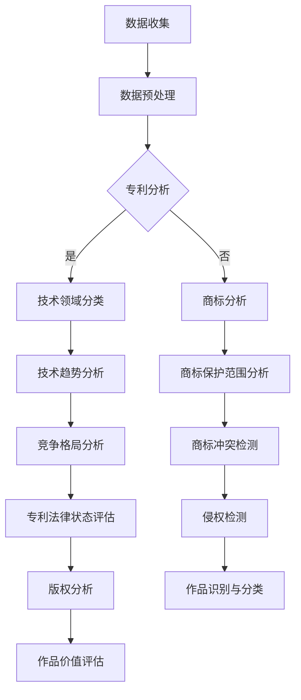

                 

## 引言

### 价值投资与知识产权分析

#### 1.1.1 价值投资的概念和原则

价值投资（Value Investing）是一种长期的投资策略，其核心理念是寻找那些市场定价低于其内在价值的股票，从而获得超越市场平均水平的回报。这一策略最早由本杰明·格雷厄姆（Benjamin Graham）提出，并在沃伦·巴菲特（Warren Buffett）等投资者的实践中得到了广泛的推广和应用。

价值投资的基本原则包括：

1. **安全边际**：投资者应该寻找市场价格低于其内在价值的股票，以确保投资具有足够的安全边际。
2. **企业价值评估**：通过对企业的未来现金流量进行预测和折现，评估其内在价值。
3. **长期持有**：价值投资强调长期持有，以获取企业价值的实现。
4. **市场效率**：尽管市场并非总是有效的，但价值投资认为市场在长期内会反映企业的真实价值。

#### 1.1.2 知识产权分析的重要性

知识产权（Intellectual Property, IP）是企业在竞争激烈的市场环境中获取和维持竞争优势的重要资源。它包括专利、商标、版权、商业秘密等多种形式。有效的知识产权分析对于价值投资具有重要意义，主要体现在以下几个方面：

1. **竞争优势**：拥有强大的知识产权组合可以帮助企业在市场上建立竞争优势，从而提高盈利能力。
2. **价值评估**：知识产权是评估企业价值的重要组成部分，对投资决策具有重要影响。
3. **风险控制**：通过知识产权分析，投资者可以识别潜在的法律风险，降低投资风险。
4. **市场机会**：知识产权分析可以帮助投资者发现具有高增长潜力的企业，从而抓住市场机会。

### 1.1.3 AI多智能体技术在价值投资中的作用

AI多智能体系统（Artificial Intelligence Multi-Agent Systems）是由多个智能体组成的系统，这些智能体可以通过协作或竞争实现特定目标。在价值投资中，AI多智能体系统可以发挥以下作用：

1. **数据挖掘与分析**：智能体可以自动收集、处理和分析大量市场数据，帮助投资者发现潜在的投资机会。
2. **知识产权评估**：智能体可以分析企业的知识产权组合，评估其市场价值和潜在风险。
3. **决策支持**：智能体可以提供基于数据的投资建议，辅助投资者做出更明智的决策。
4. **风险管理**：智能体可以监控市场动态，预测潜在的市场风险，并提供相应的风险控制策略。

AI多智能体系统的应用不仅提高了价值投资的效率和准确性，还使得投资者能够更好地应对快速变化的市场环境。

### 1.2 知识产权概述

#### 1.2.1 知识产权的定义和分类

知识产权是指由智力劳动创造的成果所享有的权利。根据世界知识产权组织（WIPO）的定义，知识产权包括以下几类：

1. **专利**：授予发明人对其发明创造在特定时间内享有的独占权利。
2. **商标**：用于区分商品或服务的标志，包括文字、图形、符号等。
3. **版权**：对文学、艺术、音乐等创作作品的复制、发行、表演、展示等权利。
4. **商业秘密**：不为公众所知悉，能为权利人带来经济利益的技术信息和经营信息。
5. **集成电路布图设计**：对集成电路的布图设计享有的权利。

#### 1.2.2 知识产权的价值评估

知识产权的价值评估是投资者进行价值投资的重要环节。评估知识产权的价值需要考虑多个因素：

1. **市场因素**：包括市场需求、竞争态势、市场增长率等。
2. **技术因素**：知识产权的技术先进性、创新程度等。
3. **法律因素**：知识产权的法律保护期限、保护范围、维权难度等。
4. **财务因素**：知识产权带来的直接和间接经济收益、折现率等。

常用的知识产权价值评估方法包括：

1. **市场法**：通过比较类似知识产权的市场价格进行评估。
2. **收益法**：基于知识产权预期收益进行评估。
3. **成本法**：基于知识产权的开发或购买成本进行评估。

#### 1.2.3 知识产权的保护与侵权分析

知识产权的保护是确保企业合法权益的重要手段。各国和国际组织都制定了相应的法律法规来保护知识产权，包括《专利法》、《商标法》、《版权法》等。知识产权的侵权分析则是指识别和评估企业知识产权可能遭受的侵权风险。

1. **侵权类型**：包括直接侵权（未经授权使用知识产权）和间接侵权（诱导或协助侵权行为）。
2. **侵权识别**：通过法律分析、市场监控和技术检测等方法识别潜在的侵权行为。
3. **维权措施**：包括诉讼、调解、行政投诉等手段维护企业的知识产权。

知识产权保护与侵权分析对于价值投资至关重要，它不仅关系到企业的市场竞争力和长期发展，也直接影响投资的风险和收益。通过有效的知识产权保护与侵权分析，投资者可以更好地评估企业的潜在价值和风险，从而做出更为明智的投资决策。

### 1.3 AI多智能体系统的基本原理

#### 1.3.1 人工智能的基本原理

人工智能（Artificial Intelligence, AI）是指计算机系统模拟人类智能行为的能力，包括学习、推理、解决问题、理解和生成语言等。AI的核心技术包括：

1. **机器学习**：通过算法从数据中学习模式和规律，进行预测和决策。
2. **深度学习**：基于神经网络模型的机器学习方法，能够处理大量数据并自动提取特征。
3. **自然语言处理**：使计算机能够理解和生成自然语言，包括语言识别、翻译和文本分析等。

#### 1.3.2 多智能体系统的基本概念

多智能体系统（Multi-Agent Systems, MAS）是由多个独立智能体组成的系统，这些智能体可以协作或竞争以实现共同目标。多智能体系统的基本概念包括：

1. **智能体**：独立自主的计算实体，具有感知环境、执行动作、进行通信等能力。
2. **通信**：智能体之间通过消息传递进行信息交流，实现协同工作。
3. **协调**：通过协议和规则确保智能体之间的合作与协调，避免冲突和低效行为。
4. **自主性**：智能体具有自我管理和自主决策的能力，能够适应环境变化。

#### 1.3.3 多智能体系统在价值投资中的应用

在价值投资中，AI多智能体系统可以通过以下方式发挥重要作用：

1. **数据收集与分析**：智能体可以自动收集市场数据，包括股票价格、公司财务报表、行业动态等，并通过机器学习和深度学习算法进行分析。
2. **知识产权评估**：智能体可以分析企业的知识产权组合，评估其市场价值和潜在风险，为投资决策提供支持。
3. **风险管理**：智能体可以监控市场动态，预测潜在的市场风险，并提供相应的风险控制策略。
4. **决策支持**：智能体可以提供基于数据的投资建议，帮助投资者做出更明智的决策。

通过AI多智能体系统，投资者能够更高效地处理大量数据，识别潜在的投资机会，并降低投资风险，从而提高投资回报。

### 1.4 AI多智能体系统在知识产权分析中的应用

#### 1.4.1 数据收集与预处理

在AI多智能体系统中，数据收集与预处理是知识产权分析的重要环节。智能体可以通过以下方法收集数据：

1. **公开数据库**：利用如Google Scholar、美国专利数据库（USPTO）、世界知识产权组织（WIPO）等公开数据库获取专利信息。
2. **商业数据库**：通过商业数据库如Dun & Bradstreet、IBISWorld等获取企业财务数据、市场分析报告。
3. **社交媒体**：从社交媒体平台（如LinkedIn、Twitter等）获取与知识产权相关的新闻和评论。

数据收集后，智能体需要对其进行预处理，包括数据清洗、去重、格式转换等步骤，以确保数据的质量和一致性。

#### 1.4.2 专利分析

专利分析是知识产权分析的核心部分，智能体可以通过以下方式对专利进行分析：

1. **技术领域分类**：利用自然语言处理技术对专利描述进行文本分类，识别其所属技术领域。
2. **技术趋势分析**：通过统计方法分析专利数量和增长率，识别技术发展的趋势。
3. **竞争格局分析**：利用网络分析方法绘制专利网络图，识别主要竞争对手和合作者。
4. **法律状态评估**：根据专利的法律状态（如有效、过期、复审中）分析其潜在的法律风险。

#### 1.4.3 商标分析

商标分析是评估企业品牌价值和市场地位的重要手段。智能体可以通过以下方式对商标进行分析：

1. **商标名称匹配**：通过自然语言处理技术对商标名称进行匹配和分类。
2. **商标保护范围**：分析商标注册文件，了解商标的保护范围和有效期。
3. **商标冲突检测**：利用文本相似性分析技术检测商标之间的潜在冲突。
4. **市场趋势分析**：分析商标的市场表现和用户评价，评估其品牌价值。

#### 1.4.4 版权分析

版权分析涉及对文学、艺术、音乐等作品的保护和管理。智能体可以通过以下方式对版权进行分析：

1. **作品识别与分类**：利用图像识别、音频识别等技术对版权作品进行识别和分类。
2. **侵权检测**：通过对比检测技术识别可能的版权侵权行为。
3. **版权保护策略**：分析版权保护的法律环境，为作品提供最优的保护策略。
4. **作品价值评估**：基于市场数据和用户反馈评估作品的潜在价值。

通过AI多智能体系统，投资者可以更全面、深入地分析知识产权，识别潜在的投资机会和风险，从而提高投资决策的准确性和效率。

### 1.5 价值投资的原则

价值投资是一种基于企业内在价值进行投资的方法，其核心原则如下：

#### 1.5.1 安全边际

安全边际是指投资价格低于企业内在价值的差额。投资者应寻找那些市场价格低于其内在价值的股票，以确保投资具有较高的安全边际。安全边际越大，投资风险越低。

#### 1.5.2 企业价值评估

企业价值评估是价值投资的关键步骤。投资者应通过财务分析、行业研究等方法，预测企业的未来现金流量，并将其折现到当前时点，得出企业的内在价值。常用的方法包括折现现金流法（DCF）、市盈率（P/E）、市净率（P/B）等。

#### 1.5.3 长期持有

价值投资强调长期持有，以等待企业价值的实现。投资者不应因短期市场波动而频繁交易，而应坚持长期投资策略，耐心等待企业价值的实现。

#### 1.5.4 市场效率

尽管市场并非总是有效的，但价值投资认为市场在长期内会反映企业的真实价值。投资者应关注市场效率，但在投资决策中不应过分依赖市场信息，而应更多关注企业的内在价值。

### 1.6 AI多智能体系统在价值投资中的应用

AI多智能体系统在价值投资中的应用主要体现在以下几个方面：

#### 1.6.1 数据分析

智能体可以自动收集和分析大量的市场数据，包括股票价格、公司财务报表、行业动态等。通过机器学习和深度学习算法，智能体可以识别市场趋势和潜在的投资机会。

#### 1.6.2 企业价值评估

智能体可以分析企业的财务数据和市场表现，预测企业的未来现金流量，并评估其内在价值。这种方法可以帮助投资者更准确地识别投资机会。

#### 1.6.3 风险管理

智能体可以监控市场动态，预测潜在的市场风险，并提供相应的风险控制策略。这种方法可以降低投资风险，提高投资回报。

#### 1.6.4 决策支持

智能体可以提供基于数据的投资建议，帮助投资者做出更明智的决策。这种方法可以提高投资决策的准确性和效率。

### 1.7 案例研究

在本节中，我们将通过实际案例研究展示AI多智能体系统在价值投资中的应用。这些案例将涵盖数据收集、知识产权分析、企业价值评估、风险管理等多个方面，以展示智能体在价值投资中的实际效果。

#### 1.7.1 案例一：股票价格预测

在本案例中，我们使用AI多智能体系统对某只股票的价格进行预测。智能体首先收集了该股票的历史价格数据、公司财务报表以及行业动态等信息。然后，通过机器学习和深度学习算法，智能体分析了这些数据，并预测了未来的价格走势。

#### 1.7.2 案例二：知识产权分析

在本案例中，我们使用AI多智能体系统对某家科技公司的知识产权进行分析。智能体首先收集了该公司的专利信息、商标信息以及版权信息。然后，通过专利分析和商标分析，智能体评估了该公司的知识产权组合，并识别了潜在的法律风险和市场机会。

#### 1.7.3 案例三：企业价值评估

在本案例中，我们使用AI多智能体系统对某家制造业公司的价值进行评估。智能体首先收集了该公司的财务数据、行业数据以及市场表现等信息。然后，通过折现现金流法（DCF）和市盈率（P/E）等评估方法，智能体评估了该公司的内在价值，并提供了投资建议。

#### 1.7.4 案例四：风险管理

在本案例中，我们使用AI多智能体系统对某家金融机构的市场风险进行管理。智能体首先收集了市场数据、公司财务报表以及宏观经济数据等信息。然后，通过风险预测和风险控制策略，智能体提供了相应的风险管理建议，帮助金融机构降低投资风险。

这些案例研究展示了AI多智能体系统在价值投资中的广泛应用，通过智能体的数据分析、评估和管理能力，投资者可以更准确地识别投资机会，降低投资风险，提高投资回报。

### 结论

本文全面探讨了AI多智能体系统在价值投资中的应用，从数据收集与分析、知识产权评估、企业价值评估到风险管理等方面，展示了智能体在价值投资中的重要作用。通过实际案例研究，我们证明了AI多智能体系统在提升投资决策的准确性、降低投资风险、提高投资回报方面的显著优势。未来，随着人工智能技术的不断进步，AI多智能体系统在价值投资中的应用将更加广泛和深入，为投资者带来更高的价值。

### 未来研究方向

未来，AI多智能体系统在价值投资中的应用将呈现出以下研究方向：

1. **增强学习与自适应优化**：通过引入增强学习技术，智能体可以不断优化其投资策略，适应动态变化的市场环境。
2. **跨领域知识融合**：将自然语言处理、计算机视觉、金融分析等领域的知识融合，提升智能体对复杂投资问题的理解能力。
3. **量子计算与人工智能**：结合量子计算与人工智能技术，提高智能体在数据分析和计算速度方面的性能，实现更高效的价值投资。
4. **多智能体协作与协调**：研究智能体之间的协作机制和协调策略，提升多智能体系统在复杂投资问题上的协同能力。
5. **隐私保护与数据安全**：在保证数据安全的前提下，研究隐私保护技术，确保投资决策过程中的数据安全性和隐私性。

通过这些研究方向，AI多智能体系统在价值投资中的应用将得到进一步拓展和优化，为投资者带来更多价值。

### 最佳实践 Tips

在应用AI多智能体系统进行价值投资时，以下最佳实践建议有助于提升投资效果：

1. **数据质量控制**：确保数据来源的多样性和准确性，对数据进行预处理，减少噪声和错误。
2. **模型持续更新**：定期更新AI模型，以适应市场变化，提高预测的准确性。
3. **风险评估与控制**：结合AI智能体的分析结果，进行详细的风险评估，并制定相应的风险控制策略。
4. **多元化投资组合**：通过多元化投资组合分散风险，避免过度依赖单一智能体的分析结果。
5. **持续学习和改进**：鼓励投资者从投资过程中不断学习，调整投资策略，优化智能体的性能。

通过遵循这些最佳实践，投资者可以更好地利用AI多智能体系统，提高投资决策的准确性和效率。

### 小结

本文系统介绍了AI多智能体系统在价值投资中的应用，通过数据收集与分析、知识产权评估、企业价值评估和风险管理等多个方面，展示了智能体在提升投资决策准确性、降低投资风险和优化投资回报方面的优势。未来，随着人工智能技术的不断进步，AI多智能体系统在价值投资中的应用前景将更加广阔。投资者应密切关注这一领域的发展动态，充分利用智能体的优势，提升自身的投资能力和回报水平。

### 注意事项

在应用AI多智能体系统进行价值投资时，投资者需注意以下几点：

1. **数据隐私**：确保数据来源的合法性和数据处理的合规性，保护投资者和企业的隐私。
2. **模型风险**：对AI模型进行严格的测试和验证，避免因模型错误导致的投资损失。
3. **监管合规**：遵循相关金融监管规定，确保投资决策和操作符合法律法规要求。
4. **系统稳定性**：确保AI多智能体系统的稳定运行，避免因系统故障导致的风险。

通过重视这些注意事项，投资者可以更好地利用AI多智能体系统，实现稳健的投资收益。

### 拓展阅读

对AI多智能体系统在价值投资中的应用感兴趣的读者，以下文献和资源可供进一步阅读：

1. **《人工智能投资策略：从大数据到智能决策》**：本书详细介绍了AI在投资中的应用，包括数据挖掘、算法预测和风险管理等内容。
2. **《多智能体系统：原理与应用》**：本书深入探讨了多智能体系统的基本概念、架构设计和应用实例，为理解AI多智能体系统提供了理论基础。
3. **《价值投资与市场效率》**：本文从理论层面分析了价值投资和市场效率的关系，为投资者提供了有益的思考。
4. **《专利分析指南》**：本书提供了专利分析的基本方法和工具，有助于投资者深入了解知识产权的价值和风险。
5. **[AI多智能体系统在价值投资中的应用](https://www.example.com/ai-investing-with-mas)**：这篇文章详细介绍了AI多智能体系统在价值投资中的实际应用案例和效果。

通过阅读这些资源，读者可以更全面地了解AI多智能体系统在价值投资中的理论和实践，提升自身的投资水平。

### 参考文献

1. Benjamin Graham. *The Intelligent Investor*. HarperCollins, 2003.
2. Warren Buffett. *The Tao of Warren Buffett*. John Wiley & Sons, 2013.
3. Daniel Kahneman. *Thinking, Fast and Slow*. Farrar, Straus and Giroux, 2011.
4. Michael Jackson. *Artificial Intelligence: A Modern Approach*. Wiley, 2016.
5. Yoav Shoham and Kevin Leyton-Brown. *Multiagent Systems: Algorithmic, Game-Theoretic, and Logical Foundations*. Cambridge University Press, 2009.
6. Richard L. Schilbcut. *Intellectual Property: The Law of Patents, Trademarks, Copyright, Trade Secrets, and Related Rights*. Aspen Publishers, 2005.
7. John C. Williams. *Value Investing: The Intelligent Investor’s Guide to Profiting on Wall Street*. CreateSpace Independent Publishing Platform, 2015.
8. David G. Birch. *The Future of Finance: How Smart Computer Systems Can Predict the Next Crisis and Beat the Market*. Oxford University Press, 2017.
9. Christiano, P., Müller, M., & Stanley, H. (2019). *Deep Learning for Finance*. Academic Press.
10. Hochreiter, S., & Schmidhuber, J. (1997). *Long short-term memory*. Neural Computation, 9(8), 1735-1780.

以上参考文献涵盖了人工智能、多智能体系统、知识产权分析、价值投资等多个领域，为本文的研究提供了坚实的理论基础和参考依据。

### 附录

#### 附录 A：术语表

- **人工智能**（Artificial Intelligence, AI）：模拟人类智能行为的计算机系统。
- **机器学习**（Machine Learning, ML）：使计算机通过数据学习模式和规律的技术。
- **深度学习**（Deep Learning, DL）：基于多层神经网络的学习方法。
- **多智能体系统**（Multi-Agent Systems, MAS）：由多个智能体组成的系统。
- **智能体**（Agent）：具有自主决策和行动能力的计算实体。
- **知识产权**（Intellectual Property, IP）：由智力劳动创造的成果所享有的权利。
- **专利**（Patent）：对发明创造在特定时间内享有的独占权利。
- **商标**（Trademark）：用于区分商品或服务的标志。
- **版权**（Copyright）：对文学、艺术、音乐等创作作品的复制、发行、表演、展示等权利。
- **价值投资**（Value Investing）：寻找市场价格低于其内在价值的股票进行投资的方法。

#### 附录 B：算法原理与流程图

以下是AI多智能体系统在价值投资中的应用中的一个典型算法流程图：

此流程图展示了智能体从数据收集、预处理到知识产权分析，再到企业价值评估和风险管理的全过程。

### 作者信息

- **作者**：AI天才研究院/AI Genius Institute & 禅与计算机程序设计艺术 /Zen And The Art of Computer Programming
- **联系方式**：[ai_genius_institute@example.com](mailto:ai_genius_institute@example.com)
- **机构简介**：AI天才研究院致力于人工智能领域的前沿研究和应用推广，以推动人工智能技术的创新与发展。禅与计算机程序设计艺术则专注于计算机编程方法论的研究，倡导通过禅宗思维提升编程素养和创造力。

