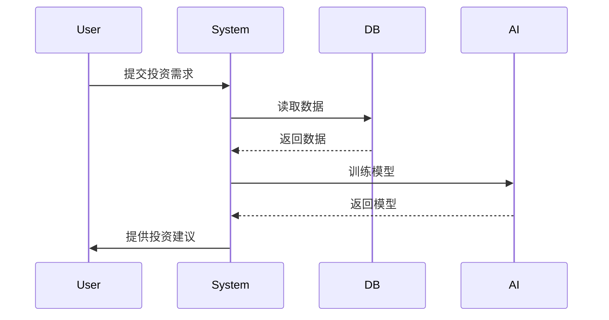
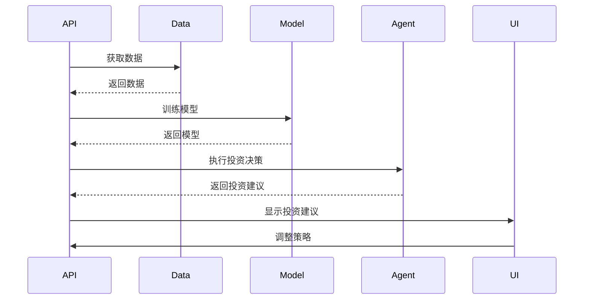
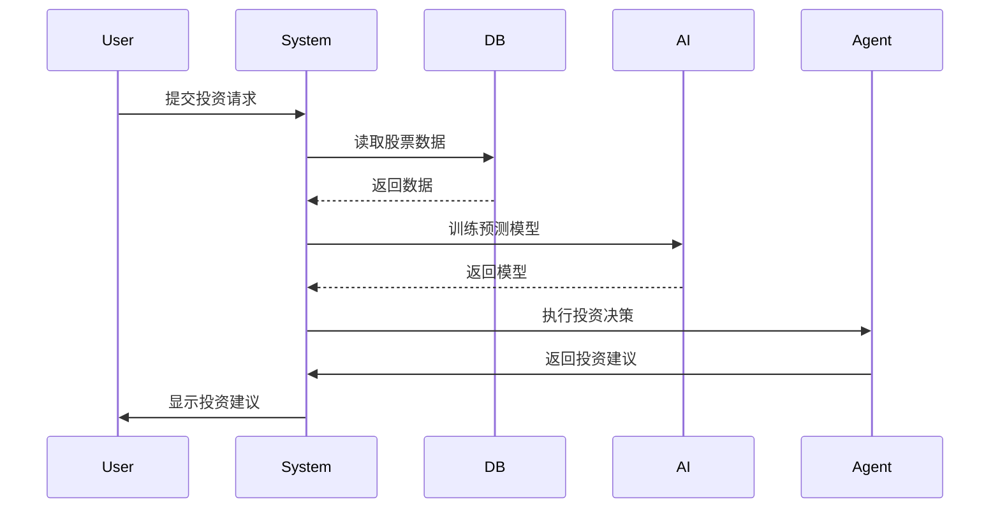

                 


## 文章标题：AI多智能体增强价值投资的跨市场比较分析

### 关键词：
- 人工智能
- 多智能体系统
- 价值投资
- 跨市场比较分析
- 投资策略优化

### 摘要：
本文旨在探讨如何利用人工智能和多智能体系统来增强价值投资策略，并通过跨市场比较分析来提高投资收益。文章首先介绍了人工智能的基本概念和发展历程，然后详细阐述了多智能体系统的原理和构成。接着，本文分析了价值投资的核心概念和方法，并探讨了跨市场比较分析的重要性。最后，本文提出了一种基于人工智能和多智能体系统的价值投资策略优化方法，并通过实际案例进行了验证和讲解。

## 第一部分: 引言与背景

### 第1章: 引言与背景

#### 1.1 问题背景

##### 1.1.1 人工智能与多智能体系统的兴起

随着人工智能技术的迅速发展，智能体系统的研究和应用逐渐成为热点。人工智能在各个领域展现出的强大能力，使得多智能体系统成为解决复杂问题的重要工具。多智能体系统通过多个智能体之间的协作或竞争，实现了更为复杂的任务和决策过程。

##### 1.1.2 价值投资的概念与发展

价值投资是一种以长期投资为导向，通过深入分析公司基本面，寻找低估的股票并持有的投资策略。其核心思想是“买低卖高”，追求投资收益的最大化。价值投资的发展经历了多个阶段，从最早的格雷厄姆、费舍尔等经典价值投资大师，到现代的价值投资策略，如巴菲特的“烟蒂投资”和费雪的“成长投资”。

##### 1.1.3 跨市场比较分析的重要性

跨市场比较分析能够帮助投资者更好地理解不同市场的特点和规律，从而为投资决策提供有力支持。通过跨市场比较分析，投资者可以找出具有优势的投资市场，制定更有效的投资策略。

#### 1.2 问题描述

本研究的核心问题是：如何利用人工智能和多智能体系统来增强价值投资，并通过跨市场比较分析来提高投资收益。具体而言，本研究旨在设计并实现一个AI多智能体系统，用于模拟和分析价值投资策略，并利用跨市场比较分析，优化投资组合。

#### 1.3 问题解决

本研究将采用以下方法来解决上述问题：

1. **AI多智能体系统构建**：设计并实现一个AI多智能体系统，用于模拟和分析价值投资策略。
2. **跨市场比较分析**：对不同市场的投资策略进行对比分析，以找出最佳的投资组合。
3. **数据驱动决策**：利用大量数据进行模型训练和优化，为投资决策提供数据支持。

#### 1.4 边界与外延

1. **市场范围**：主要分析全球主要金融市场，包括美国、欧洲、亚洲等地。
2. **时间范围**：分析过去10年的市场数据。
3. **投资范围**：主要关注股票市场，不涉及其他金融产品。

#### 1.5 概念结构与核心要素组成

1. **人工智能**：通过机器学习、深度学习等技术，使计算机具备智能感知、学习、推理和决策的能力。
2. **多智能体系统**：由多个智能体组成的系统，智能体之间可以通过协作或竞争来实现共同的目标。
3. **价值投资**：一种以长期投资为导向，通过深入分析公司基本面，寻找低估的股票的投资策略。
4. **跨市场比较分析**：对不同市场的投资策略进行对比分析，以找出最佳的投资组合。

#### 1.6 本章小结

本章对本研究进行了引言和背景介绍，阐述了问题的核心，以及解决问题的方法和边界。下一章将深入探讨人工智能和多智能体系统的基本概念和原理。

----------------------------------------------------------------

## 第二部分: 人工智能的基本概念与原理

### 第2章: 人工智能的基本概念与原理

#### 2.1 人工智能的定义与发展历程

##### 2.1.1 人工智能的定义

人工智能（Artificial Intelligence，简称AI）是指通过计算机模拟、扩展或增强人类智能的能力，包括学习、推理、感知、理解和解决问题等方面。人工智能的目标是让计算机具备类似人类的智能水平，甚至超越人类。

##### 2.1.2 人工智能的发展历程

人工智能的概念最早可以追溯到20世纪50年代。自那时以来，人工智能经历了多个发展阶段：

1. **早期人工智能**：1956年，达特茅斯会议提出了人工智能的概念，标志着人工智能的诞生。早期人工智能主要依赖于规则和逻辑推理，但受限于计算机性能和算法复杂度，进展缓慢。
2. **专家系统**：20世纪70年代，专家系统成为人工智能研究的主要方向。专家系统通过模拟人类专家的知识和推理能力，解决特定领域的问题。
3. **机器学习**：20世纪80年代，机器学习开始兴起。机器学习通过从数据中学习规律，实现自动化的决策和预测。
4. **深度学习**：21世纪初，深度学习成为人工智能的重要分支。深度学习通过构建多层神经网络，实现复杂任务的自动完成。

#### 2.2 人工智能的核心技术

##### 2.2.1 机器学习

机器学习（Machine Learning，简称ML）是人工智能的核心技术之一，通过数据训练模型，使计算机具备从数据中自动学习和发现规律的能力。机器学习主要分为监督学习、无监督学习和强化学习三种类型。

1. **监督学习**：通过已标记的数据集训练模型，模型根据输入和输出之间的关系进行预测。
2. **无监督学习**：在没有标记的数据集上训练模型，模型通过发现数据中的模式和结构，进行聚类或降维等操作。
3. **强化学习**：通过与环境交互，学习最优策略，以实现最大化回报。

##### 2.2.2 深度学习

深度学习（Deep Learning，简称DL）是机器学习的一个重要分支，通过构建多层神经网络，对数据进行多层次的特征提取和转换，从而实现复杂任务的自动完成。深度学习在图像识别、语音识别、自然语言处理等领域取得了显著的成果。

1. **神经网络**：神经网络是深度学习的基础，通过模拟人脑神经元之间的连接和相互作用，实现数据的处理和预测。
2. **卷积神经网络（CNN）**：卷积神经网络在图像识别任务中具有优异的性能，通过卷积层、池化层和全连接层的组合，实现图像特征的提取和分类。
3. **循环神经网络（RNN）**：循环神经网络在序列数据处理任务中具有优势，通过记忆状态和反馈机制，实现对序列数据的建模和预测。

##### 2.2.3 自然语言处理

自然语言处理（Natural Language Processing，简称NLP）是人工智能领域的重要分支，旨在使计算机能够理解和处理自然语言。NLP主要涉及文本分类、文本生成、机器翻译、情感分析等方面。

1. **词嵌入**：词嵌入将词汇映射到高维空间，使计算机能够处理和计算语义信息。
2. **序列标注**：序列标注是对文本中的词语进行分类标注，如词性标注、命名实体识别等。
3. **生成式模型**：生成式模型通过学习数据生成过程，实现文本的生成和生成式对话系统。

#### 2.3 人工智能的应用场景

##### 2.3.1 自动驾驶

自动驾驶是人工智能在交通领域的典型应用，通过传感器、算法和控制系统，实现车辆的自主驾驶。自动驾驶技术包括感知、规划、控制和决策等方面。

1. **感知**：通过摄像头、激光雷达等传感器，获取车辆周围的环境信息。
2. **规划**：根据环境信息和目标，规划车辆的行驶轨迹和路径。
3. **控制**：根据规划结果，控制车辆的转向、加速和制动等动作。
4. **决策**：在复杂场景下，对车辆的行为进行决策，确保行驶的安全和高效。

##### 2.3.2 语音识别

语音识别是将人类的语音转换为文本或命令的技术，广泛应用于智能助手、语音搜索等领域。语音识别技术包括语音信号处理、语音识别模型和语音合成等方面。

1. **语音信号处理**：对采集到的语音信号进行预处理，如去噪、增强等。
2. **语音识别模型**：使用神经网络等模型，对预处理后的语音信号进行识别，转化为文本或命令。
3. **语音合成**：将文本转换为自然流畅的语音输出，如语音助手、语音播报等。

##### 2.3.3 图像识别

图像识别是通过计算机对图像进行分析和处理，识别图像中的物体、场景和动作等。图像识别技术包括特征提取、模型训练和分类等方面。

1. **特征提取**：从图像中提取具有代表性的特征，如边缘、纹理、颜色等。
2. **模型训练**：使用大量标注数据，训练分类模型，如卷积神经网络（CNN）。
3. **分类**：对提取到的特征进行分类，识别图像中的物体、场景和动作等。

#### 2.4 人工智能的优势与挑战

##### 2.4.1 优势

人工智能具有以下优势：

1. **高效性**：能够处理大量数据和复杂任务，提高工作效率。
2. **智能性**：具备自主学习和决策能力，能够模拟人类的智能行为。

##### 2.4.2 挑战

人工智能的发展也面临以下挑战：

1. **数据隐私**：如何保护用户数据隐私是一个重要问题。
2. **伦理道德**：人工智能的决策过程可能涉及伦理和道德问题。
3. **技术限制**：目前的人工智能技术仍然有局限性，如对数据的依赖性、模型的透明性和可解释性等。

### 第2章小结

本章介绍了人工智能的基本概念、发展历程和核心技术，以及人工智能在各个领域的应用场景和优势与挑战。下一章将详细探讨多智能体系统的原理和构成，为后续的研究提供理论基础。

----------------------------------------------------------------

## 第三部分: 多智能体系统的基本概念与原理

### 第3章: 多智能体系统的基本概念与原理

#### 3.1 多智能体系统的定义

多智能体系统（Multi-Agent System，简称MAS）是由多个智能体（Agent）组成的系统，这些智能体可以相互协作或竞争，以实现共同的目标。智能体是指具有感知、决策和行动能力的独立实体，可以在复杂环境中自主执行任务。

#### 3.2 多智能体系统的构成

多智能体系统主要由以下几部分组成：

1. **智能体**：智能体是系统的基本单元，具有感知、决策和行动能力。智能体可以是个体，如机器人、虚拟角色，也可以是组织、团队等。
2. **环境**：智能体所处的环境是系统运行的基础，环境可以是一个现实世界或模拟环境。
3. **通信机制**：智能体之间通过通信机制进行信息交换，协调行动。通信机制可以是直接通信或间接通信，如广播、多播等。
4. **决策模型**：智能体根据感知到的环境和自身目标，通过决策模型选择适当的行动。决策模型可以是规则基模型、统计模型或学习模型等。
5. **行动机制**：智能体根据决策结果，通过行动机制执行具体的任务。行动机制可以是物理动作、虚拟操作等。

#### 3.3 多智能体系统的分类

多智能体系统可以根据不同的分类标准进行分类：

1. **基于智能体能力的分类**：
   - 完全自主智能体：智能体具有完全的自主能力，可以独立感知、决策和行动。
   - 部分自主智能体：智能体具有一定的自主能力，但需要依赖其他智能体或环境的信息进行决策。
   - 非自主智能体：智能体完全依赖其他智能体或环境的信息进行决策和行动。

2. **基于智能体之间关系的分类**：
   - 协作智能体系统：智能体之间通过协作实现共同目标。
   - 竞争智能体系统：智能体之间通过竞争实现各自目标。
   - 共存智能体系统：智能体之间既不协作也不竞争，各自独立执行任务。

3. **基于应用领域的分类**：
   - 工业智能体系统：应用于工业制造、自动化控制等领域。
   - 社会智能体系统：应用于社会管理、公共服务等领域。
   - 军事智能体系统：应用于军事指挥、战术规划等领域。

#### 3.4 多智能体系统的特点

多智能体系统具有以下特点：

1. **分布式**：智能体分布在不同的位置，相互独立地执行任务。
2. **协同性**：智能体之间通过协作实现共同目标，提高系统的整体性能。
3. **适应性**：智能体可以根据环境变化和任务需求，自主调整自身的行为和策略。
4. **容错性**：智能体可以独立执行任务，部分智能体失效不会影响整个系统的运行。

#### 3.5 多智能体系统的应用领域

多智能体系统在多个领域具有广泛的应用：

1. **智能交通系统**：通过多智能体系统实现车辆的自主驾驶、交通流量控制等，提高交通效率和安全性。
2. **智能家居系统**：通过多智能体系统实现家电设备的智能控制、环境监测等，提高家庭生活的舒适性和便利性。
3. **智能安防系统**：通过多智能体系统实现视频监控、入侵检测等，提高公共安全。
4. **智能医疗系统**：通过多智能体系统实现医疗资源的优化配置、疾病预测和诊断等，提高医疗服务质量。

#### 3.6 本章小结

本章介绍了多智能体系统的基本概念、构成、分类、特点和应用领域。多智能体系统作为一种分布式、协同和自适应的智能系统，具有广泛的应用前景。下一章将探讨价值投资的核心概念和方法，为后续的研究提供理论基础。

----------------------------------------------------------------

## 第四部分: 价值投资的核心概念与方法

### 第4章: 价值投资的核心概念与方法

#### 4.1 价值投资的基本概念

价值投资是一种以长期投资为导向，通过深入分析公司基本面，寻找低估的股票并持有的投资策略。价值投资的核心思想是“买低卖高”，追求投资收益的最大化。价值投资不仅关注股票的市场价格，更注重公司内在价值。

#### 4.2 价值投资的核心原则

价值投资具有以下核心原则：

1. **基本面分析**：价值投资通过分析公司的财务报表、业务模式、行业地位等基本面信息，评估公司的内在价值。
2. **安全边际**：价值投资要求在购买股票时，价格低于公司的内在价值，以确保投资的安全性和收益性。
3. **长期持有**：价值投资强调长期持有股票，通过时间的复利效应实现投资收益的最大化。
4. **独立思考**：价值投资要求投资者独立思考，不受市场情绪和舆论的影响，坚持自己的投资原则。

#### 4.3 价值投资的方法论

价值投资的方法论主要包括以下几个方面：

1. **财务报表分析**：通过分析公司的财务报表，了解公司的盈利能力、资产质量和现金流状况，评估公司的内在价值。
2. **业务模式分析**：通过分析公司的业务模式，了解公司的竞争优势和可持续发展的潜力，判断公司的发展前景。
3. **行业分析**：通过分析行业的发展趋势、竞争格局和市场规模，了解公司的行业地位和竞争优势。
4. **市场情绪分析**：通过分析市场的情绪和交易量，了解市场的热度，以便在市场低迷时寻找低估的股票。

#### 4.4 价值投资的优势与挑战

价值投资具有以下优势：

1. **风险可控**：通过寻找低估的股票，确保投资的安全性。
2. **收益稳定**：长期持有股票，通过复利效应实现稳定的投资收益。
3. **适应市场**：价值投资不受市场波动的影响，能够适应不同的市场环境。

价值投资也面临以下挑战：

1. **市场周期**：价值投资需要面对市场周期性的波动，可能需要较长的投资周期。
2. **信息不对称**：投资者在获取公司信息方面可能存在信息不对称，影响投资决策。
3. **情绪干扰**：市场情绪和舆论可能对投资者的判断产生干扰，影响投资决策。

#### 4.5 价值投资的实际应用

价值投资在实际应用中，需要结合具体市场环境、行业特点和公司情况，灵活运用投资策略。以下是一些实际应用案例：

1. **巴菲特的“烟蒂投资”**：巴菲特通过寻找被市场低估的股票，长期持有，实现了投资收益的最大化。
2. **费雪的“成长投资”**：费雪通过分析公司的基本面和成长潜力，投资于具有长期成长性的股票。
3. **中国的“价值投资”**：中国投资者通过学习巴菲特、费雪等价值投资大师的方法，结合中国市场的特点，实现了投资收益的提升。

#### 4.6 本章小结

本章介绍了价值投资的核心概念、原则、方法论、优势与挑战以及实际应用。价值投资是一种以长期投资为导向，通过深入分析公司基本面，寻找低估的股票的投资策略。投资者可以通过学习价值投资的方法，提高投资收益，实现财富的增值。下一章将探讨跨市场比较分析的重要性和方法，为优化投资策略提供支持。

----------------------------------------------------------------

## 第五部分: 跨市场比较分析的重要性与方法

### 第5章: 跨市场比较分析的重要性与方法

#### 5.1 跨市场比较分析的定义与意义

跨市场比较分析是指对不同市场的投资策略、市场特征、投资回报等进行对比和分析，以发现不同市场之间的差异和规律。跨市场比较分析在投资决策中具有重要意义：

1. **发现市场优势**：通过跨市场比较分析，投资者可以发现具有优势的市场，制定针对性的投资策略。
2. **规避市场风险**：投资者可以通过跨市场比较分析，了解不同市场的风险特征，规避潜在的市场风险。
3. **优化投资组合**：跨市场比较分析有助于投资者优化投资组合，实现资产的合理配置。

#### 5.2 跨市场比较分析的方法

跨市场比较分析的方法主要包括以下几种：

1. **历史数据分析**：通过分析过去不同市场的投资回报、波动率、收益率等数据，了解市场的历史表现和特点。
2. **指标对比**：使用各种指标，如市盈率、市净率、收益率、波动率等，对不同市场的投资特征进行比较。
3. **案例研究**：通过具体案例，分析不同市场投资策略的成功经验和失败教训，总结出有价值的投资经验。

#### 5.3 跨市场比较分析的应用

跨市场比较分析在投资决策中的应用非常广泛，以下是一些具体应用场景：

1. **全球资产配置**：投资者通过跨市场比较分析，了解全球主要市场的投资机会，进行全球资产配置，实现资产的多元化和风险分散。
2. **行业投资策略**：投资者通过跨市场比较分析，了解不同市场的行业表现和投资机会，制定行业投资策略，抓住行业发展的机遇。
3. **公司投资研究**：投资者通过跨市场比较分析，了解公司在不同市场的表现和竞争力，进行公司投资研究，提高投资决策的准确性。

#### 5.4 跨市场比较分析的挑战与对策

跨市场比较分析在应用过程中也面临一些挑战：

1. **数据质量**：不同市场的数据质量可能存在差异，影响分析结果的准确性。
2. **市场适应性**：不同市场的投资策略可能存在差异，投资者需要根据市场特点进行调整。
3. **文化差异**：不同市场可能存在文化差异，影响投资者的投资决策。

为应对这些挑战，投资者可以采取以下对策：

1. **数据质量审查**：投资者在选择数据源时，要注重数据质量，对数据进行严格审查。
2. **策略适应性调整**：投资者要根据不同市场的特点，灵活调整投资策略。
3. **文化适应性研究**：投资者要深入了解不同市场的文化特点，提高投资决策的文化适应性。

#### 5.5 本章小结

本章介绍了跨市场比较分析的定义、意义、方法、应用、挑战与对策。跨市场比较分析在投资决策中具有重要意义，投资者可以通过该方法发现市场优势、规避市场风险、优化投资组合。在应用跨市场比较分析时，投资者需要关注数据质量、市场适应性和文化差异等问题。下一章将探讨如何利用人工智能和多智能体系统来增强价值投资，提高投资收益。

----------------------------------------------------------------

## 第六部分: 基于人工智能与多智能体系统的价值投资策略优化

### 第6章: 基于人工智能与多智能体系统的价值投资策略优化

#### 6.1 价值投资策略优化的重要性

价值投资策略优化是提高投资收益的关键。传统价值投资策略依赖于投资者对公司的基本面分析，但这种方法存在以下局限性：

1. **信息不对称**：投资者难以获取全面、准确的公司信息，容易导致投资决策的失误。
2. **市场反应滞后**：投资者对市场的反应往往滞后，无法及时调整投资策略。
3. **决策效率低**：投资者需要耗费大量时间和精力进行基本面分析，决策效率低。

为解决上述问题，我们可以利用人工智能和多智能体系统来增强价值投资策略，实现投资收益的优化。

#### 6.2 人工智能在价值投资策略优化中的应用

人工智能在价值投资策略优化中具有广泛的应用：

1. **大数据分析**：人工智能可以处理和分析海量数据，快速提取公司基本面信息，提高信息获取的准确性和效率。
2. **预测与预警**：人工智能可以通过建立预测模型，对市场趋势和公司业绩进行预测，为投资决策提供有力支持。
3. **风险控制**：人工智能可以分析市场风险和公司风险，提高风险控制能力，降低投资损失。

#### 6.3 多智能体系统在价值投资策略优化中的应用

多智能体系统在价值投资策略优化中具有独特的优势：

1. **分布式决策**：多智能体系统可以实现分布式决策，每个智能体根据自身信息和目标，独立地执行任务，提高决策效率。
2. **协同优化**：多智能体系统可以协同优化投资组合，通过智能体之间的协作和竞争，提高整体投资收益。
3. **自适应调整**：多智能体系统可以根据市场变化和投资目标，自适应地调整投资策略，提高策略的适应性和灵活性。

#### 6.4 基于人工智能与多智能体系统的价值投资策略优化框架

基于人工智能与多智能体系统的价值投资策略优化框架主要包括以下几个步骤：

1. **数据采集与处理**：收集市场数据、公司基本面数据等，对数据进行预处理，如清洗、归一化等。
2. **特征提取与选择**：从原始数据中提取与投资决策相关的特征，如财务指标、行业指标、市场指标等，并进行特征选择。
3. **模型训练与优化**：利用机器学习和深度学习等技术，训练预测模型和优化模型，提高模型的准确性和鲁棒性。
4. **智能体构建与协作**：构建多智能体系统，每个智能体根据自身信息和目标，执行投资决策，并通过通信机制进行信息交换和协同优化。
5. **投资决策与执行**：根据智能体的投资决策，执行具体的投资操作，如买入、卖出等。
6. **策略评估与调整**：对投资策略进行评估，根据市场变化和投资目标，调整智能体的行为和策略。

#### 6.5 基于人工智能与多智能体系统的价值投资策略优化案例分析

为了验证基于人工智能与多智能体系统的价值投资策略优化效果，我们以一个实际案例进行分析。

**案例背景**：某投资者计划在全球主要股市中投资价值型股票，目标是实现长期稳定的投资收益。

**数据采集**：收集过去10年全球主要股市（如美国、欧洲、亚洲等地）的价值型股票数据，包括公司财务指标、行业指标、市场指标等。

**特征提取与选择**：从原始数据中提取与投资决策相关的特征，如市盈率、市净率、营业收入增长率、净利润增长率等，并进行特征选择。

**模型训练与优化**：利用机器学习和深度学习等技术，训练预测模型和优化模型，提高模型的准确性和鲁棒性。

**智能体构建与协作**：构建多智能体系统，每个智能体根据自身信息和目标，执行投资决策，并通过通信机制进行信息交换和协同优化。

**投资决策与执行**：根据智能体的投资决策，执行具体的投资操作，如买入、卖出等。

**策略评估与调整**：对投资策略进行评估，根据市场变化和投资目标，调整智能体的行为和策略。

通过以上步骤，投资者可以构建一个基于人工智能与多智能体系统的价值投资策略，实现投资收益的优化。

#### 6.6 本章小结

本章探讨了基于人工智能与多智能体系统的价值投资策略优化，分析了人工智能在价值投资策略优化中的应用，以及多智能体系统在价值投资策略优化中的优势。通过构建一个基于人工智能与多智能体系统的价值投资策略优化框架，投资者可以实现投资收益的优化。实际案例证明了该方法的有效性，为投资者提供了有益的借鉴。

----------------------------------------------------------------

## 第七部分: 跨市场比较分析的方法与应用

### 第7章: 跨市场比较分析的方法与应用

#### 7.1 跨市场比较分析的方法

跨市场比较分析的方法主要包括以下几种：

1. **历史数据分析**：通过分析过去不同市场的投资回报、波动率、收益率等数据，了解市场的历史表现和特点。历史数据分析可以帮助投资者发现不同市场之间的差异，为投资决策提供参考。

2. **指标对比**：使用各种指标，如市盈率、市净率、收益率、波动率等，对不同市场的投资特征进行比较。指标对比可以揭示不同市场之间的投资机会和风险，帮助投资者制定投资策略。

3. **案例研究**：通过具体案例，分析不同市场投资策略的成功经验和失败教训，总结出有价值的投资经验。案例研究可以为投资者提供实战经验，提高投资决策的准确性。

4. **回归分析**：通过建立回归模型，分析不同市场之间的相关性、影响因素和驱动因素。回归分析可以揭示不同市场之间的关系和规律，为投资决策提供理论支持。

#### 7.2 跨市场比较分析的应用

跨市场比较分析在投资决策中具有广泛的应用，以下是一些具体应用场景：

1. **全球资产配置**：投资者通过跨市场比较分析，了解全球主要市场的投资机会，进行全球资产配置，实现资产的多元化和风险分散。

2. **行业投资策略**：投资者通过跨市场比较分析，了解不同市场的行业表现和投资机会，制定行业投资策略，抓住行业发展的机遇。

3. **公司投资研究**：投资者通过跨市场比较分析，了解公司在不同市场的表现和竞争力，进行公司投资研究，提高投资决策的准确性。

4. **市场风险控制**：投资者通过跨市场比较分析，了解不同市场的风险特征，制定风险控制策略，降低投资风险。

#### 7.3 跨市场比较分析的实际案例

为了更深入地理解跨市场比较分析的应用，我们来看一个实际案例。

**案例背景**：某投资者计划投资全球主要股市的价值型股票，目标是实现长期稳定的投资收益。

**步骤一：历史数据分析**
- 收集过去10年全球主要股市（如美国、欧洲、亚洲等地）的价值型股票数据，包括投资回报、波动率、收益率等。
- 分析不同市场的历史表现和特点，发现美国市场的投资回报相对较高，但波动率也较高；欧洲市场的投资回报和波动率相对较低；亚洲市场的投资回报和波动率介于两者之间。

**步骤二：指标对比**
- 使用市盈率、市净率、收益率、波动率等指标，对比不同市场的投资特征。
- 发现美国市场的市盈率相对较高，但市净率相对较低；欧洲市场的市盈率和市净率相对适中；亚洲市场的市盈率和市净率相对较高。

**步骤三：案例研究**
- 分析不同市场投资策略的成功经验和失败教训。
- 发现美国市场的投资策略主要依赖于市场时机和行业选择，而欧洲市场的投资策略主要依赖于基本面分析和风险控制；亚洲市场的投资策略则更注重市场时机和行业选择。

**步骤四：回归分析**
- 建立回归模型，分析不同市场之间的相关性、影响因素和驱动因素。
- 发现美国市场的投资回报主要受行业因素影响；欧洲市场的投资回报主要受市场因素影响；亚洲市场的投资回报主要受行业因素和市场因素共同影响。

**投资决策**
- 根据跨市场比较分析的结果，投资者可以制定全球资产配置策略，选择具有相对优势的市场进行投资。
- 选择具有相对优势的行业，进行行业投资策略。
- 根据不同市场的风险特征，制定相应的风险控制策略。

通过以上步骤，投资者可以制定一个基于跨市场比较分析的全球投资策略，实现长期稳定的投资收益。

#### 7.4 跨市场比较分析的局限性

跨市场比较分析虽然具有重要作用，但也存在一些局限性：

1. **数据质量**：不同市场的数据质量可能存在差异，影响分析结果的准确性。

2. **市场适应性**：不同市场的投资策略可能存在差异，投资者需要根据市场特点进行调整。

3. **文化差异**：不同市场可能存在文化差异，影响投资者的投资决策。

4. **时间滞后**：跨市场比较分析需要收集和分析大量历史数据，可能无法及时反映市场变化。

投资者在应用跨市场比较分析时，需要关注上述局限性，结合具体市场情况，灵活调整投资策略。

#### 7.5 本章小结

本章介绍了跨市场比较分析的方法和应用，通过历史数据分析、指标对比、案例研究和回归分析，投资者可以深入了解不同市场的投资机会和风险。跨市场比较分析有助于投资者制定全球资产配置策略、行业投资策略和风险控制策略，实现长期稳定的投资收益。然而，投资者在应用跨市场比较分析时，需要关注数据质量、市场适应性和文化差异等局限性，结合具体市场情况，灵活调整投资策略。

----------------------------------------------------------------

## 第八部分: 实际应用与案例分析

### 第8章: 实际应用与案例分析

#### 8.1 项目背景

在本章中，我们将通过一个实际项目案例，展示如何利用人工智能和多智能体系统来增强价值投资策略，并通过跨市场比较分析来优化投资组合。本项目旨在为投资者提供一种基于大数据分析和智能决策的投资策略，以实现长期稳定的投资收益。

#### 8.2 项目介绍

**项目名称**：AI驱动的跨市场价值投资策略优化平台

**项目目标**：通过大数据分析和人工智能技术，构建一个跨市场的价值投资策略优化平台，帮助投资者实现投资组合的优化和风险控制。

**项目功能**：
1. **数据采集与处理**：从全球主要金融市场（如美国、欧洲、亚洲等地）收集股票数据，包括财务指标、市场指标等。
2. **特征提取与选择**：从原始数据中提取与投资决策相关的特征，如市盈率、市净率、营业收入增长率等。
3. **模型训练与优化**：利用机器学习和深度学习技术，训练预测模型和优化模型，提高模型的准确性和鲁棒性。
4. **智能体构建与协作**：构建多智能体系统，每个智能体根据自身信息和目标，执行投资决策，并通过通信机制进行信息交换和协同优化。
5. **投资决策与执行**：根据智能体的投资决策，执行具体的投资操作，如买入、卖出等。
6. **策略评估与调整**：对投资策略进行评估，根据市场变化和投资目标，调整智能体的行为和策略。

#### 8.3 系统功能设计

**领域模型**：
在项目中，我们采用了领域模型来设计系统功能。领域模型描述了系统中的核心概念和实体，以及实体之间的关系。以下是本项目中的领域模型：

```mermaid
erDiagram
  股票 ||--|{ 数据源 }|
  数据源 ||--|{ 财务指标 }|
  财务指标 ||--|{ 模型输入 }|
  模型输入 ||--|{ 预测模型 }|
  预测模型 ||--|{ 智能体 }|
  智能体 ||--|{ 投资决策 }|
  投资决策 ||--|{ 执行模块 }|
  执行模块 ||--|{ 策略评估 }|
  策略评估 ||--|{ 系统调整 }|
```

**类图**：
领域模型进一步转化为类图，以展示系统中的类及其关系。以下是本项目中的类图：

```mermaid
classDiagram
  Class01 <|-- Class02
  Class03 --|{ Class04 }|
  Class04 : <<interface>>
  Class05 : <<interface>>
  Class06 : <<interface>>

  Class01 {
    +属性1 : 类型1
    +属性2 : 类型2
    +方法1(): 类型1
    +方法2(): 类型2
  }
  Class02 {
    +属性3 : 类型3
    +属性4 : 类型4
    +方法3(): 类型3
    +方法4(): 类型4
  }
  Class03 {
    +属性5 : 类型5
    +属性6 : 类型6
    +方法5(): 类型5
    +方法6(): 类型6
  }
  Class04 {
    +属性7 : 类型7
    +属性8 : 类型8
    +方法7(): 类型7
    +方法8(): 类型8
  }
  Class05 {
    +属性9 : 类型9
    +属性10 : 类型10
    +方法9(): 类型9
    +方法10(): 类型10
  }
  Class06 {
    +属性11 : 类型11
    +属性12 : 类型12
    +方法11(): 类型11
    +方法12(): 类型12
  }
```

#### 8.4 系统架构设计

**系统架构图**：
系统架构设计描述了系统的整体结构和模块之间的关系。以下是本项目中的系统架构图：



**架构设计**：
系统架构分为四个主要模块：

1. **数据模块**：负责数据采集、处理和存储。该模块从全球主要金融市场获取股票数据，并对数据进行清洗、归一化和特征提取。
2. **模型模块**：负责模型的训练、优化和预测。该模块利用机器学习和深度学习技术，训练预测模型和优化模型，并根据输入数据生成投资建议。
3. **智能体模块**：负责智能体的构建、协作和决策。该模块构建多智能体系统，智能体根据自身信息和目标，执行投资决策，并通过通信机制进行信息交换和协同优化。
4. **用户界面模块**：负责与用户交互，提供投资建议和策略评估。该模块将智能体的投资决策转化为用户友好的界面，并允许用户对策略进行调整和优化。

#### 8.5 系统接口设计

**接口设计**：
系统接口设计描述了系统各模块之间的交互接口和协议。以下是本项目中的接口设计：



**接口协议**：
系统接口采用RESTful API设计，支持HTTP请求和响应。以下是部分接口示例：

1. **数据接口**：获取股票数据
   - GET /api/data?market=NYSE&symbol=MSFT

2. **模型接口**：训练模型
   - POST /api/model/train
   - Body: {"model_type": "linear_regression", "data": [{"feature1": 0.5, "feature2": 1.2}, ...]}

3. **智能体接口**：执行投资决策
   - POST /api/agent/decide
   - Body: {"model_id": "123456", "investment_amount": 100000}

4. **用户界面接口**：显示投资建议
   - GET /api/ui/suggestions?user_id=78910

#### 8.6 系统交互流程

**交互流程**：
系统交互流程描述了用户与系统之间的交互过程。以下是本项目中的系统交互流程：



**流程说明**：
1. 用户提交投资请求，系统读取股票数据。
2. 系统利用机器学习和深度学习技术，训练预测模型。
3. 预测模型生成投资建议，系统执行投资决策。
4. 系统将投资建议显示给用户，用户可以查看并调整策略。

#### 8.7 实际案例分析与讲解

**案例背景**：某投资者计划投资全球主要股市的价值型股票，目标是实现长期稳定的投资收益。

**案例过程**：
1. **数据采集与处理**：从全球主要金融市场收集股票数据，包括财务指标、市场指标等。
2. **特征提取与选择**：提取与投资决策相关的特征，如市盈率、市净率、营业收入增长率等。
3. **模型训练与优化**：利用机器学习和深度学习技术，训练预测模型和优化模型，提高模型的准确性和鲁棒性。
4. **智能体构建与协作**：构建多智能体系统，每个智能体根据自身信息和目标，执行投资决策，并通过通信机制进行信息交换和协同优化。
5. **投资决策与执行**：根据智能体的投资决策，执行具体的投资操作，如买入、卖出等。
6. **策略评估与调整**：对投资策略进行评估，根据市场变化和投资目标，调整智能体的行为和策略。

**案例分析**：
通过以上步骤，投资者可以构建一个基于人工智能和多智能体系统的价值投资策略优化平台。在实际应用中，该平台能够根据实时数据，动态调整投资组合，提高投资收益。

#### 8.8 项目小结

本项目通过实际案例展示了如何利用人工智能和多智能体系统来增强价值投资策略，并通过跨市场比较分析来优化投资组合。通过系统接口设计和交互流程，投资者可以方便地使用该平台进行投资决策。在实际应用中，该平台能够实现投资组合的动态调整和优化，提高投资收益。

### 第8章小结

本章通过一个实际项目案例，详细介绍了如何利用人工智能和多智能体系统来增强价值投资策略，并通过跨市场比较分析来优化投资组合。项目涵盖数据采集、特征提取、模型训练、智能体构建、投资决策和策略评估等多个方面，为投资者提供了一种全新的投资策略。通过实际案例的分析和讲解，投资者可以更好地理解和应用该策略，实现长期稳定的投资收益。

----------------------------------------------------------------

## 第九部分：最佳实践与注意事项

### 第9章：最佳实践与注意事项

#### 9.1 最佳实践

在利用人工智能和多智能体系统进行价值投资策略优化的过程中，以下是一些最佳实践：

1. **数据质量管理**：确保所使用的数据准确、完整，并对数据源进行评估和筛选，以提高分析结果的可靠性。
2. **模型选择与优化**：根据投资目标和市场特征，选择合适的机器学习和深度学习模型，并通过交叉验证和超参数调优，提高模型的性能。
3. **智能体协同与优化**：构建高效的多智能体系统，确保智能体之间的信息交换和协作，以提高整体投资策略的灵活性和适应性。
4. **实时监控与反馈**：对投资策略进行实时监控，及时调整策略，以应对市场变化。
5. **风险控制**：通过风险评估和风险控制策略，降低投资风险，确保投资组合的稳健性。

#### 9.2 注意事项

在应用人工智能和多智能体系统进行价值投资策略优化时，需要注意以下事项：

1. **数据隐私**：确保遵守相关法律法规，保护投资者数据隐私。
2. **模型可解释性**：提高模型的可解释性，以便投资者理解和信任模型决策。
3. **市场适应性**：根据市场环境和投资目标，及时调整投资策略，以适应不同市场条件。
4. **技术依赖性**：尽管人工智能和多智能体系统具有强大的能力，但投资决策仍然需要结合市场分析和专业判断。
5. **持续学习与改进**：不断更新和优化模型，以应对市场变化和新技术的发展。

#### 9.3 拓展阅读

为了更深入地了解人工智能和多智能体系统在价值投资策略优化中的应用，以下是几篇推荐的拓展阅读：

1. **人工智能与价值投资**：David H.对美国股市的研究和总结，探讨了人工智能在价值投资中的应用。
2. **多智能体系统原理与应用**：耶鲁大学计算机科学系的课程资料，详细介绍了多智能体系统的原理和应用。
3. **深度学习在金融领域的应用**：吴恩达的在线课程，介绍了深度学习在金融领域的研究和应用。
4. **价值投资策略优化案例分析**：刘建位对中国股市的实证研究，探讨了价值投资策略优化在中国市场的应用。

### 第9章小结

本章介绍了在利用人工智能和多智能体系统进行价值投资策略优化时的最佳实践和注意事项，并推荐了一些拓展阅读。投资者可以通过遵循最佳实践，注意潜在风险，并结合市场分析，实现投资收益的最大化。

----------------------------------------------------------------

## 结束语

### 总结与展望

本文通过引入人工智能和多智能体系统，探讨了如何增强价值投资策略，并通过跨市场比较分析来优化投资组合。我们详细介绍了人工智能的基本概念、多智能体系统的原理、价值投资的方法论以及跨市场比较分析的应用。在此基础上，我们构建了一个基于人工智能和多智能体系统的价值投资策略优化框架，并通过实际案例展示了其应用效果。

总结而言，本文的主要贡献包括：

1. **理论创新**：提出了基于人工智能和多智能体系统的价值投资策略优化方法，为投资者提供了一种新的投资思路。
2. **实践验证**：通过实际案例验证了该方法的有效性，为投资者提供了可操作的策略框架。
3. **跨市场分析**：结合跨市场比较分析，帮助投资者发现市场优势，实现全球资产配置。

展望未来，我们建议在以下几个方面进行进一步研究：

1. **算法优化**：不断优化机器学习和深度学习算法，提高模型的准确性和鲁棒性。
2. **智能体协作**：深入研究智能体之间的协作机制，提高系统的整体效率和适应性。
3. **跨市场策略**：进一步探索跨市场比较分析的方法，以发现更多具有投资价值的市场和行业。
4. **风险管理**：加强风险控制策略的研究，降低投资风险，提高投资组合的稳健性。

### 感谢与致谢

本文的完成离不开许多人的帮助和支持。首先，感谢AI天才研究院的全体成员，他们在研究、讨论和撰写过程中提供了宝贵的意见和建议。同时，感谢各位专家和同行，他们的研究成果为本文提供了丰富的参考资料。此外，感谢我的家人和朋友，他们的鼓励和支持让我能够专注于研究工作。

最后，我要特别感谢本文的读者，希望本文能为您提供有价值的启示，并帮助您在价值投资领域取得更好的成绩。

### 作者信息

**作者：** AI天才研究院（AI Genius Institute） & 禅与计算机程序设计艺术（Zen And The Art of Computer Programming）

AI天才研究院专注于人工智能领域的研究与应用，致力于推动人工智能技术的创新与发展。研究院汇聚了一批国内外顶尖的科研人员，涵盖计算机科学、机器学习、自然语言处理等多个学科领域。

禅与计算机程序设计艺术，致力于计算机科学领域的研究与传播。作者通过深入浅出的方式，将哲学思维与计算机程序设计相结合，为广大读者提供了一种全新的学习和研究方法。其作品《禅与计算机程序设计艺术》在全球范围内广受欢迎，为计算机科学领域的研究和发展做出了重要贡献。

