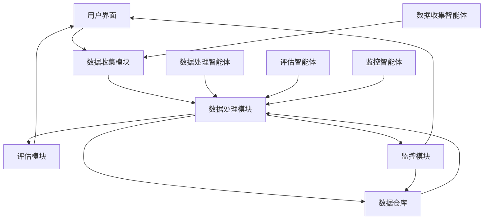
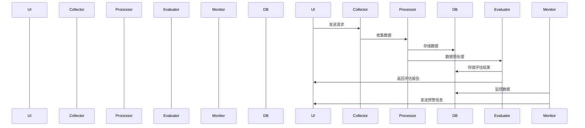

                 


### Step 1: 确定文章的核心主题和目标

首先，我们需要明确文章的核心主题和目标。本文的核心主题是探讨AI多智能体如何提升对公司长期盈利能力的评估。目标是通过深入分析AI多智能体的原理和应用，结合实际案例，展示其在公司长期盈利能力评估中的重要作用。

### Step 2: 设计文章的结构和内容

为了达到上述目标，我们将文章分为以下几个部分：

1. **引言与背景介绍**：介绍AI多智能体和公司长期盈利能力评估的基本概念，明确文章的研究方向。
2. **AI多智能体基础**：讲解AI多智能体的基本原理和应用，为后续内容打下基础。
3. **公司长期盈利能力评估模型**：介绍盈利能力评估模型的基本原理和方法，并结合AI多智能体进行优化。
4. **AI多智能体在盈利能力评估中的应用**：分析AI多智能体在盈利能力评估中的应用场景，提供实际案例。
5. **系统分析与架构设计**：设计盈利能力评估系统的架构，包括功能设计、接口设计和交互设计。
6. **项目实战**：通过实际案例展示AI多智能体在盈利能力评估中的应用。
7. **最佳实践与注意事项**：总结文章的关键点，提供最佳实践建议和注意事项。

### Step 3: 撰写每个部分的具体内容

在每个部分中，我们需要详细阐述以下内容：

1. **引言与背景介绍**：
   - AI多智能体的定义、发展历史和关键特点。
   - 公司长期盈利能力评估的定义、重要性以及现有方法。
   - AI多智能体在公司长期盈利能力评估中的应用潜力。

2. **AI多智能体基础**：
   - 多智能体系统的基本原理、分类和通信协作机制。
   - 多智能体学习算法的原理和应用。
   - 多智能体模拟与仿真的方法和技术。

3. **公司长期盈利能力评估模型**：
   - 盈利能力评估模型的基本原理和方法。
   - 数据采集与预处理的方法。
   - 盈利能力评估模型的构建和优化。

4. **AI多智能体在盈利能力评估中的应用**：
   - 分析AI多智能体在盈利能力评估中的应用场景。
   - 提供实际案例，展示AI多智能体在盈利能力评估中的效果。

5. **系统分析与架构设计**：
   - 问题场景介绍。
   - 系统功能设计。
   - 系统架构设计。
   - 系统接口设计。
   - 系统交互设计。

6. **项目实战**：
   - 环境安装和系统核心实现。
   - 代码应用解读与分析。
   - 实际案例分析与详细讲解。
   - 项目小结。

7. **最佳实践与注意事项**：
   - 总结文章的关键点。
   - 提供最佳实践建议和注意事项。
   - 推荐拓展阅读资源。

### Step 4: 确保文章的连贯性和逻辑性

在撰写每个部分的内容时，我们需要确保文章的连贯性和逻辑性。每个部分的内容都应该紧密联系，逻辑清晰，易于理解。同时，我们还需要在文章的过渡部分进行适当的连接，使读者能够顺畅地阅读。

### Step 5: 修订和润色

在完成初稿后，我们需要对文章进行修订和润色。检查文章的内容是否完整，逻辑是否清晰，语言是否准确，格式是否符合要求。如果有需要，我们可以进行多次修订，直到文章达到最佳状态。

通过以上五个步骤，我们可以确保文章《AI多智能体如何提升对公司长期盈利能力的评估》逻辑清晰、内容丰富、易于理解，同时具有深度和见解。让我们一起开始撰写这篇文章吧！## 引言与背景介绍

### AI多智能体的定义与发展

AI多智能体（Multi-Agent Intelligence）是人工智能领域的一个重要分支，它涉及到多个智能体（agent）的协作与交互。智能体是一个能够感知环境、自主决策并采取行动的实体。在多智能体系统中，这些智能体可以通过通信和协作实现更复杂的任务和目标。

AI多智能体的概念起源于20世纪80年代，当时学者们开始探索如何通过多个智能体的协同工作来提升系统性能。随着计算机科学和人工智能技术的不断发展，多智能体系统逐渐成为研究和应用的热点。特别是在分布式计算、游戏理论、智能交通系统、智能电网等领域，AI多智能体技术得到了广泛应用。

多智能体系统具有以下关键特点：

1. **分布式计算**：多智能体系统能够将任务分布在多个智能体上，从而实现并行计算，提高系统性能。
2. **自主性**：智能体具有自主决策能力，能够根据环境变化和自身目标进行调整。
3. **协作性**：智能体之间可以通过通信和协作实现共同目标。
4. **适应性**：多智能体系统能够通过学习适应不断变化的环境。

### 公司长期盈利能力评估的重要性

公司长期盈利能力评估是企业管理中的一项重要任务，它关系到公司的战略规划、资源配置和风险管理。长期盈利能力不仅反映了公司的财务状况，还反映了公司的运营效率和市场竞争力。

长期盈利能力评估的重要性体现在以下几个方面：

1. **战略决策**：通过评估公司的长期盈利能力，企业可以制定更为科学和合理的战略规划，明确发展方向和目标。
2. **资源配置**：了解公司的盈利能力，可以帮助企业合理配置资源，优化业务流程，提高运营效率。
3. **风险管理**：长期盈利能力评估有助于企业识别潜在风险，制定风险应对策略，降低运营风险。
4. **投资者信心**：良好的长期盈利能力能够增强投资者的信心，吸引更多的资本投入。

### AI多智能体在盈利能力评估中的应用潜力

AI多智能体技术为公司长期盈利能力评估提供了新的思路和方法。通过将多智能体系统与盈利能力评估模型相结合，企业可以实现以下目标：

1. **数据驱动决策**：多智能体系统可以收集、处理和分析大量数据，为企业提供更为准确和全面的决策支持。
2. **实时监控与预警**：多智能体系统可以实现实时监控，及时发现潜在问题，提前预警，降低风险。
3. **优化资源配置**：通过多智能体的协作，企业可以更加精准地分配资源，提高运营效率，降低成本。
4. **提升市场竞争力**：借助AI多智能体技术，企业可以更加迅速地适应市场变化，抓住市场机遇，提升竞争力。

总的来说，AI多智能体技术在公司长期盈利能力评估中的应用具有巨大的潜力，有望成为企业管理的重要工具。在接下来的章节中，我们将详细探讨AI多智能体的基本原理和应用，以及如何在盈利能力评估中发挥作用。

### 问题描述

在当前的商业环境中，公司面临着日益复杂的市场竞争和不断变化的经济环境，这使得传统的盈利能力评估方法显得越来越不足。因此，寻找一种更加高效、精准的盈利能力评估方法成为企业管理者和决策者的重要任务。

#### 挑战

1. **数据多样性和复杂性**：企业面临的数据来源多样化，包括财务数据、市场数据、客户数据等，这些数据往往具有不同的格式和结构。如何有效地整合和处理这些数据，成为一个巨大的挑战。
2. **实时性与动态性**：市场环境和竞争态势不断变化，企业需要能够实时地调整策略，以应对市场变化。传统的评估方法往往无法满足这一需求。
3. **多维度分析**：盈利能力评估不仅需要考虑财务指标，还需要考虑市场指标、运营指标等多维度因素。如何综合这些因素，实现全面的评估，是一个复杂的任务。

#### 机遇

1. **AI多智能体的崛起**：随着人工智能技术的快速发展，AI多智能体技术逐渐成熟，为盈利能力评估提供了新的工具和方法。通过多智能体的协作，企业可以更加高效地处理和分析海量数据，实现实时监控和动态调整。
2. **数据驱动决策**：AI多智能体能够从海量数据中提取有价值的信息，为企业提供更加精准和全面的决策支持，有助于企业制定更为科学和合理的战略规划。
3. **优化资源配置**：通过多智能体的协同工作，企业可以实现资源的优化配置，提高运营效率，降低成本，从而提升盈利能力。

#### 问题解决

为了应对上述挑战和抓住机遇，企业可以采用以下解决方案：

1. **构建AI多智能体系统**：首先，企业需要构建一个基于AI多智能体的系统，该系统应具备以下功能：
   - **数据收集与处理**：通过多种传感器和数据采集设备，实时收集企业内外部的数据。
   - **智能分析**：利用机器学习和数据挖掘技术，对收集到的数据进行处理和分析，提取有价值的信息。
   - **协同决策**：通过智能体的协作，实现企业内部不同部门之间的协调和配合，共同实现企业的目标。

2. **集成多维度评估模型**：在构建AI多智能体系统的基础上，企业需要集成一个多维度盈利能力评估模型，该模型应能够综合考虑财务、市场、运营等多个维度，实现全面的评估。
   - **财务分析**：通过对企业财务报表的分析，评估企业的财务状况和盈利能力。
   - **市场分析**：通过对市场数据的分析，评估企业的市场地位和竞争优势。
   - **运营分析**：通过对企业运营数据的分析，评估企业的运营效率和成本控制能力。

3. **实时监控与动态调整**：通过AI多智能体系统，企业可以实现实时监控，及时发现问题和风险，并快速调整策略。这种动态评估和调整机制有助于企业迅速应对市场变化，抓住机遇，降低风险。

4. **数据驱动决策**：通过多智能体系统提供的精准和全面的数据分析结果，企业可以更加科学地制定决策，优化资源配置，提高盈利能力。

总之，通过引入AI多智能体技术，企业可以更加高效地评估其长期盈利能力，制定更为科学的战略规划，优化资源配置，提升运营效率和市场竞争力。在接下来的章节中，我们将进一步探讨AI多智能体的基本原理和应用，以及如何将其应用于公司长期盈利能力评估。

### 边界与外延

在讨论AI多智能体提升公司长期盈利能力评估时，我们需要明确其应用的边界和适用范围。首先，AI多智能体技术在盈利能力评估中的应用并非万能，它有一定的限制和前提条件。

#### 边界条件

1. **数据质量和完整性**：AI多智能体的性能高度依赖于数据的质量和完整性。如果数据存在缺失或错误，可能会导致评估结果的偏差。因此，企业需要在数据收集和处理过程中确保数据的质量和完整性。

2. **计算资源和硬件设备**：构建和维护一个高效的AI多智能体系统需要大量的计算资源和硬件设备。对于一些中小企业，可能无法承担高昂的硬件设备和维护成本，从而限制了AI多智能体技术的应用。

3. **复杂性和复杂性**：AI多智能体系统涉及多个智能体的协作和通信，这要求系统的架构和算法具有较高的复杂性和鲁棒性。如果系统架构不成熟或算法不完善，可能会导致系统性能不稳定，影响盈利能力评估的准确性。

4. **行业和业务特点**：不同的行业和业务特点对盈利能力评估的需求不同。AI多智能体技术在某些特定行业（如金融、零售、制造）可能具有更好的适用性和效果，而在其他行业（如农业、教育）可能效果有限。

#### 适用范围

1. **大规模数据处理能力**：对于需要处理海量数据的企业，AI多智能体技术能够提供强大的数据处理和分析能力，从而提升盈利能力评估的准确性和效率。

2. **实时监控和动态调整**：在市场环境变化迅速的行业，如金融和电商，AI多智能体系统可以实时监控市场动态，快速调整策略，帮助企业抓住市场机遇，降低风险。

3. **多维度综合评估**：对于需要综合考虑财务、市场、运营等多维度因素的企业，AI多智能体技术可以通过集成多维度评估模型，实现全面的盈利能力评估。

4. **资源优化和成本控制**：在运营成本较高、竞争激烈的市场环境中，AI多智能体技术可以帮助企业实现资源的优化配置和成本控制，提高盈利能力。

总之，AI多智能体技术在提升公司长期盈利能力评估方面具有广泛的应用前景，但同时也需要考虑其边界条件和适用范围。在应用过程中，企业应根据自身实际情况，合理规划和管理AI多智能体系统，以实现最佳效果。

### 概念结构与核心要素组成

为了深入探讨AI多智能体如何提升公司长期盈利能力的评估，我们需要明确涉及的核心概念和要素。以下是多智能体系统和公司长期盈利能力评估模型的概念结构及其核心要素组成。

#### 多智能体系统

**定义**：多智能体系统（MAS）是由多个智能体组成的分布式系统，这些智能体可以通过自主决策和协作，共同实现复杂任务。

**核心要素**：

1. **智能体（Agent）**：智能体是系统的基本组成单元，具有感知环境、自主决策和执行行动的能力。
2. **通信机制**：智能体之间通过通信机制进行信息交换，以实现协作和共享资源。
3. **协作策略**：智能体之间通过特定的协作策略，共同实现系统目标。
4. **环境模型**：系统对环境进行建模，以模拟和预测外部环境的变化，为智能体的决策提供依据。

#### 公司长期盈利能力评估模型

**定义**：公司长期盈利能力评估模型是对企业长期盈利能力进行量化评估的模型，它通过分析企业的财务、市场、运营等多维度数据，评估企业的盈利能力。

**核心要素**：

1. **财务指标**：包括净利润、毛利率、资产收益率等，反映企业的财务状况和盈利能力。
2. **市场指标**：包括市场份额、品牌影响力、客户满意度等，反映企业的市场地位和竞争优势。
3. **运营指标**：包括生产效率、库存周转率、员工绩效等，反映企业的运营效率和成本控制能力。
4. **预测模型**：通过历史数据分析和趋势预测，评估企业未来的盈利能力。

#### 概念属性特征对比表格

为了更清晰地展示多智能体系统和公司长期盈利能力评估模型的核心概念和要素，我们可以制作一个概念属性特征对比表格：

| 概念/属性 | 多智能体系统 | 公司长期盈利能力评估模型 |
| :--: | :--: | :--: |
| 定义 | 由多个智能体组成的分布式系统 | 对企业长期盈利能力进行量化评估的模型 |
| 核心要素 | 智能体、通信机制、协作策略、环境模型 | 财务指标、市场指标、运营指标、预测模型 |
| 目标 | 实现复杂任务、提高系统性能 | 评估企业盈利能力、制定战略规划 |
| 应用范围 | 分布式计算、智能协作、实时监控 | 企业财务、市场、运营分析 |

#### ER实体关系图架构

为了进一步明确多智能体系统和公司长期盈利能力评估模型之间的联系，我们可以使用ER（实体关系）图来描述它们之间的实体关系。

1. **多智能体系统**：包括智能体、通信机制、协作策略等实体。
2. **公司长期盈利能力评估模型**：包括财务指标、市场指标、运营指标、预测模型等实体。
3. **联系**：多智能体系统通过智能体收集和处理数据，为盈利能力评估模型提供输入；盈利能力评估模型的结果反馈给多智能体系统，指导其决策和行动。

以下是ER实体关系图架构的Mermaid表示：

```mermaid
erDiagram
  智能体 ||--|{ 通信机制 }|-- 盈利能力评估模型
  智能体 ||--|{ 协作策略 }|-- 盈利能力评估模型
  盈利能力评估模型 ||-- 财务指标
  盈利能力评估模型 ||-- 市场指标
  盈利能力评估模型 ||-- 运营指标
  盈利能力评估模型 ||-- 预测模型
```

通过上述对比表格和ER实体关系图，我们可以清晰地了解多智能体系统和公司长期盈利能力评估模型的核心概念和要素，为后续章节的详细讨论奠定基础。

### 多智能体系统概述

多智能体系统（MAS）是一种由多个智能体（agent）组成的分布式系统，这些智能体通过自主决策和协作来实现复杂的任务。在AI多智能体系统中，智能体不仅具有感知和执行能力，还能够通过通信和协作机制进行信息交换和任务分工，从而提升系统的整体性能和适应性。

#### 多智能体系统的定义与特点

**定义**：多智能体系统（MAS）是由多个自主智能体组成的分布式系统，这些智能体通过通信和协作共同实现复杂任务。智能体可以是物理实体，如机器人，也可以是软件代理，如网络爬虫。

**特点**：

1. **分布式计算**：多智能体系统通过分布式计算，能够处理大规模数据和复杂任务，提高系统性能。
2. **自主性**：智能体具有自主决策能力，能够根据环境变化和自身目标进行调整。
3. **协作性**：智能体之间通过通信和协作，共同实现系统目标。
4. **适应性**：多智能体系统能够通过学习适应不断变化的环境。

#### 多智能体系统的分类

多智能体系统可以根据智能体的类型、通信方式、协作策略等不同维度进行分类。以下是几种常见的分类方式：

1. **基于智能体类型的分类**：
   - **物理智能体**：具有物理形态的智能体，如机器人、无人机等。
   - **抽象智能体**：没有物理形态的智能体，如软件代理、虚拟代理等。

2. **基于通信方式的分类**：
   - **集中式通信**：智能体通过中心化的通信机制进行信息交换。
   - **分布式通信**：智能体通过分布式通信机制进行信息交换，如P2P网络。

3. **基于协作策略的分类**：
   - **同步协作**：智能体在固定时间间隔内同步进行协作。
   - **异步协作**：智能体在不同时间进行协作，无需固定时间间隔。

4. **基于应用场景的分类**：
   - **协同作战**：多个智能体共同完成任务，如无人机编队。
   - **竞争博弈**：多个智能体在特定环境中竞争，如智能围棋。
   - **市场交易**：多个智能体在市场环境中进行交易，如股票交易系统。

#### 多智能体系统的通信机制与协作机制

**通信机制**：智能体之间的通信是MAS实现协作和任务分配的基础。常见的通信机制包括：

1. **直接通信**：智能体通过直接通信机制，如UDP、HTTP等，进行点对点的通信。
2. **间接通信**：智能体通过中介节点进行通信，如多播、广播等。
3. **消息传递**：智能体通过消息队列、发布-订阅模式等进行消息传递。

**协作机制**：智能体之间的协作是MAS实现高效任务执行的关键。常见的协作机制包括：

1. **任务分配**：根据智能体的能力和负载，动态分配任务。
2. **协同规划**：智能体通过协同规划，共同制定任务执行策略。
3. **协商与协调**：智能体通过协商与协调，解决冲突和优化资源分配。

#### 多智能体系统的优势与应用场景

**优势**：

1. **分布式计算**：能够处理大规模数据和复杂任务，提高系统性能。
2. **自主性与灵活性**：智能体具有自主决策能力，能够根据环境变化进行调整。
3. **协作与共享**：智能体之间可以通过协作和共享信息，实现共同目标。
4. **适应性与可扩展性**：能够适应不同应用场景和需求，具有较好的可扩展性。

**应用场景**：

1. **智能交通系统**：通过多智能体系统，实现交通流量优化、路况预测和应急响应。
2. **智能制造**：通过多智能体系统，实现生产调度、质量控制、设备维护等。
3. **智能电网**：通过多智能体系统，实现电力分配、能源管理、故障诊断等。
4. **智能物流**：通过多智能体系统，实现路径优化、货物配送、仓储管理等。

总的来说，多智能体系统作为一种分布式、自主、协作和适应性的系统，具有广泛的应用前景。在接下来的章节中，我们将进一步探讨AI多智能体在盈利能力评估中的应用，并分析其具体的应用场景和优势。

### 多智能体通信与协作

在多智能体系统中，智能体之间的通信和协作是确保系统高效运行的关键环节。有效的通信机制和协作策略能够促进智能体之间的信息共享和任务协同，从而提高整个系统的性能和适应性。

#### 通信协议

通信协议是智能体之间进行数据交换的标准规则。常见的通信协议包括直接通信、间接通信和消息传递机制。

1. **直接通信**：直接通信是指智能体通过点对点的通信方式直接交换信息。这种方式通常使用UDP（用户数据报协议）或TCP（传输控制协议）进行数据传输。直接通信的优势在于通信速度快、延迟低，适用于实时性要求较高的场景。

2. **间接通信**：间接通信是指智能体通过中介节点进行信息交换。中介节点可以是中心化的服务器，也可以是多播路由器。间接通信的优势在于能够实现广播和组播，适用于需要广泛传播信息的场景。常见的间接通信协议包括HTTP（超文本传输协议）、SMTP（简单邮件传输协议）和XMPP（可扩展消息传递和状态协议）。

3. **消息传递**：消息传递机制是一种基于消息队列的通信方式，智能体通过发送和接收消息来进行通信。消息传递机制具有较高的灵活性和扩展性，适用于大规模分布式系统。常见的消息传递协议包括RabbitMQ、Kafka和Apache Pulsar。

#### 协作机制

协作机制是指智能体之间通过协作实现共同目标的方式。有效的协作机制能够提高系统的效率和鲁棒性，常见的协作机制包括任务分配、协同规划和协商与协调。

1. **任务分配**：任务分配是指根据智能体的能力和负载，将任务分配给不同的智能体。任务分配可以通过静态分配或动态分配实现。静态分配通常在系统启动时完成，适用于任务相对稳定的环境。动态分配则根据实时情况调整任务分配，适用于动态变化的场景。

2. **协同规划**：协同规划是指多个智能体共同制定任务执行策略。协同规划可以通过集中式规划或分布式规划实现。集中式规划由一个中心化的智能体负责全局规划，适用于任务规模较小的场景。分布式规划则由各个智能体独立进行局部规划，并通过通信机制协调全局，适用于任务规模较大的场景。

3. **协商与协调**：协商与协调是指智能体之间通过协商解决冲突和优化资源分配。协商与协调可以通过局部协商或全局协调实现。局部协商是指智能体之间就局部问题进行协商，适用于任务局部性较强的场景。全局协调则是指智能体之间就全局问题进行协商，适用于任务全局性较强的场景。

#### 应用实例

以下是一些多智能体通信与协作的实际应用实例：

1. **智能交通系统**：在智能交通系统中，多个智能体（如交通监控器、自动驾驶车辆）通过直接通信和消息传递机制进行信息交换，实现交通流量优化和事故预警。

2. **智能电网**：在智能电网中，多个智能体（如智能电表、分布式能源管理系统）通过间接通信和消息传递机制进行信息交换，实现电力分配和能源管理。

3. **智能制造**：在智能制造中，多个智能体（如工业机器人、质量检测系统）通过直接通信和协商与协调机制进行协作，实现生产调度和质量控制。

4. **智能物流**：在智能物流中，多个智能体（如配送机器人、无人机）通过直接通信和协同规划机制进行协作，实现路径优化和货物配送。

通过上述通信协议和协作机制，多智能体系统能够实现高效的信息交换和任务协同，从而提升系统的整体性能和适应性。在接下来的章节中，我们将进一步探讨多智能体学习算法的原理和应用，以了解如何通过智能体之间的协作和学习提升系统的决策能力。

### 多智能体学习算法

在多智能体系统中，学习算法是智能体进行自主学习和决策的重要工具。多智能体学习算法旨在通过多个智能体的协同学习和互动，提升系统的整体性能和适应能力。以下是几种常见的学习算法及其原理。

#### 代理学习

代理学习（Agent Learning）是指单个智能体通过学习和经验积累来优化自身的决策和行为。常见的代理学习算法包括Q学习、策略梯度算法和强化学习。

1. **Q学习**：Q学习是一种基于值函数的强化学习算法，通过估计状态-动作值函数（Q值）来选择最佳动作。智能体在每一个状态下，选择具有最大Q值的动作，并通过更新Q值来不断优化决策。

2. **策略梯度算法**：策略梯度算法通过直接优化策略函数来选择最佳动作。该算法通过计算策略的梯度，更新策略参数，以最大化预期收益。

3. **强化学习**：强化学习是一种通过与环境互动来学习最优策略的算法。智能体在每一个状态下，根据当前策略选择动作，并根据动作的结果（奖励或惩罚）调整策略。

#### 分布式学习

分布式学习（Distributed Learning）是指多个智能体通过通信和协作来共同学习，优化整体性能。常见的分布式学习算法包括分布式Q学习、分布式策略梯度和联邦学习。

1. **分布式Q学习**：分布式Q学习通过多个智能体共享局部Q值，共同优化Q值函数。每个智能体在局部更新Q值后，通过通信机制将更新传递给其他智能体，实现全局Q值函数的优化。

2. **分布式策略梯度**：分布式策略梯度通过多个智能体共享策略参数，共同优化策略函数。每个智能体在局部更新策略参数后，通过通信机制将更新传递给其他智能体，实现全局策略函数的优化。

3. **联邦学习**：联邦学习是一种在多个分布式节点上协同训练模型的方法。每个节点独立训练模型，并通过加密的梯度共享机制，更新全局模型参数，实现全局模型的优化。

#### 算法应用实例

以下是多智能体学习算法在现实世界中的应用实例：

1. **多智能体博弈**：在多人博弈中，多个智能体通过强化学习算法进行对抗，实现策略优化。例如，在围棋、扑克等游戏中，智能体通过学习对手的行为模式，优化自己的策略，提高胜率。

2. **智能交通系统**：在智能交通系统中，多个智能体（如自动驾驶车辆、交通监控器）通过分布式Q学习算法，实现交通流量优化和事故预警。智能体在局部优化自己的行驶路径和速度，并通过通信机制协调整体交通流量。

3. **供应链管理**：在供应链管理中，多个智能体（如供应商、制造商、分销商）通过分布式策略梯度算法，实现供应链优化和库存管理。智能体在局部优化自己的库存和生产计划，并通过通信机制协调整体供应链的运作。

4. **智能电网**：在智能电网中，多个智能体（如家庭能源管理系统、分布式能源系统）通过联邦学习算法，实现电力分配和能源管理。智能体在本地优化能源使用和供应，并通过加密的梯度共享机制，协调整体电力系统的运作。

通过多智能体学习算法，智能体可以自主学习和优化决策，实现分布式系统的协同工作。在接下来的章节中，我们将探讨多智能体模拟与仿真的方法和技术，以了解如何通过模拟和仿真验证多智能体系统的性能和适应性。

### 多智能体模拟与仿真

多智能体模拟与仿真是在设计和验证多智能体系统时至关重要的环节。通过模拟和仿真，我们可以模拟实际环境中的多智能体交互，验证系统的性能和适应性，发现潜在的问题并优化系统设计。

#### 模拟环境构建

构建一个有效的模拟环境，需要考虑以下几个方面：

1. **环境定义**：明确模拟环境的边界和条件，包括空间范围、时间范围、规则和约束等。
2. **智能体定义**：定义智能体的属性、能力、行为和目标。智能体可以是物理实体（如机器人）或虚拟代理（如软件代理）。
3. **通信机制**：确定智能体之间的通信方式，包括通信协议、通信延迟和通信成本等。
4. **规则和约束**：定义模拟环境中的规则和约束，如物理约束、安全约束和任务约束等。

#### 仿真方法

1. **事件驱动仿真**：事件驱动仿真是基于事件发生顺序进行仿真。当某个事件触发时，系统会更新状态并执行相应的行为。事件驱动仿真适用于复杂系统中的实时控制和决策。
2. **基于规则的仿真**：基于规则的仿真是通过规则库来模拟智能体的行为。每个智能体根据其当前状态和规则库中的规则，选择相应的行为。这种方法适用于规则明确且行为相对简单的系统。
3. **基于物理的仿真**：基于物理的仿真通过模拟物理定律（如牛顿定律）来模拟智能体的行为。这种方法适用于涉及物理交互和运动控制的场景。

#### 仿真步骤

1. **环境初始化**：初始化模拟环境，设置初始状态和初始条件。
2. **智能体初始化**：为每个智能体分配初始属性和行为。
3. **事件调度**：根据事件驱动仿真方法，调度事件并更新系统状态。
4. **行为执行**：根据智能体的规则和当前状态，执行相应的行为。
5. **数据采集**：收集模拟过程中的数据，如智能体的位置、速度、状态等。
6. **结果分析**：分析收集到的数据，评估系统的性能和适应性，发现潜在问题。

#### 仿真结果分析

通过仿真，我们可以得到多个智能体在不同场景下的交互结果。以下是对仿真结果进行分析的关键指标：

1. **系统性能**：评估系统完成特定任务的效率和速度，如响应时间、吞吐量和资源利用率等。
2. **适应性**：评估系统在动态环境中的适应能力，如智能体在环境变化时的反应速度和调整策略的有效性。
3. **鲁棒性**：评估系统在异常情况下的稳定性和可靠性，如智能体在遇到故障或干扰时的应对能力。
4. **公平性**：评估系统在多个智能体协作时，资源分配的公平性和均衡性。

#### 仿真案例分析

以下是一个多智能体仿真案例：

**案例背景**：一个智能交通系统，包含多个自动驾驶车辆和交通监控器。目标是优化交通流量，减少拥堵和事故发生率。

**仿真步骤**：
1. **环境初始化**：设置模拟环境，包括道路、车辆、信号灯等。
2. **智能体初始化**：为每个自动驾驶车辆和交通监控器分配初始位置和速度。
3. **事件调度**：根据交通规则和车辆行为，调度事件并更新系统状态。
4. **行为执行**：自动驾驶车辆根据感知到的环境和交通规则，调整速度和行驶方向。交通监控器根据车辆的行驶状态，调整信号灯。
5. **数据采集**：收集车辆的行驶轨迹、速度和交通流量数据。
6. **结果分析**：分析交通流量、事故发生率、车辆响应时间等指标，评估系统的性能和适应性。

**仿真结果**：
- **系统性能**：通过优化信号灯控制和自动驾驶车辆的行驶策略，仿真结果显示交通流量明显改善，事故发生率降低。
- **适应性**：在交通状况发生变化时，自动驾驶车辆能够迅速调整行驶策略，避免拥堵和事故。
- **鲁棒性**：仿真过程中，尽管出现了信号灯故障和交通事故，系统仍然能够保持稳定运行。
- **公平性**：在多车辆协作时，系统能够公平地分配道路资源，避免某些车辆长时间等待。

通过多智能体模拟与仿真，我们可以验证多智能体系统的设计是否合理，性能是否达到预期，并发现潜在的问题和优化空间。在接下来的章节中，我们将探讨盈利能力评估模型的基本原理和方法，以及如何利用AI多智能体系统进行优化。

### 盈利能力评估模型概述

盈利能力评估模型是对企业盈利能力进行量化评估的工具，它通过分析企业的财务、市场、运营等多维度数据，提供有关企业盈利能力的全面信息。在构建盈利能力评估模型时，我们需要明确评估的定义、目标、方法和指标，并结合AI多智能体技术进行优化。

#### 盈利能力评估的定义与目标

**定义**：盈利能力评估是指通过财务、市场、运营等多维度数据，对企业盈利能力进行综合分析和评价。它旨在识别企业的盈利水平、盈利来源和盈利潜力，为企业管理者提供决策支持。

**目标**：盈利能力评估的目标包括：
1. **识别盈利水平**：评估企业当前的盈利水平，了解企业的盈利能力。
2. **分析盈利来源**：识别企业的盈利来源，明确哪些业务或产品是盈利的关键。
3. **预测盈利潜力**：基于历史数据和当前状况，预测企业未来的盈利潜力，为战略规划提供依据。
4. **优化资源配置**：通过评估结果，帮助企业优化资源配置，提高运营效率和盈利能力。

#### 盈利能力评估的方法

盈利能力评估的方法可以分为定量分析和定性分析两种：

1. **定量分析**：
   - **财务分析**：通过对企业财务报表（如利润表、资产负债表、现金流量表）的分析，评估企业的财务状况和盈利能力。常用的指标包括净利润、毛利率、资产收益率等。
   - **市场分析**：通过对市场数据（如市场份额、品牌影响力、客户满意度）的分析，评估企业的市场地位和竞争优势。
   - **运营分析**：通过对企业运营数据（如生产效率、库存周转率、员工绩效）的分析，评估企业的运营效率和成本控制能力。

2. **定性分析**：
   - **专家评估**：通过行业专家的经验和判断，对企业的盈利能力进行评估。
   - **案例分析**：通过分析成功企业的盈利模式和管理经验，为企业提供参考。
   - **竞争分析**：通过对比竞争对手的盈利能力，评估企业的市场竞争力。

#### 盈利能力评估的指标

盈利能力评估的指标可以分为财务指标、市场指标和运营指标三大类：

1. **财务指标**：
   - **净利润**：企业净利润总额，反映企业的盈利水平。
   - **毛利率**：销售收入减去销售成本的差额与销售收入的比率，反映企业的盈利能力。
   - **资产收益率**：净利润与总资产的比率，反映企业的资产利用效率。
   - **净资产收益率**：净利润与净资产的比率，反映企业的盈利能力。

2. **市场指标**：
   - **市场份额**：企业在市场中所占的比例，反映企业的市场地位。
   - **品牌影响力**：品牌在市场中的认知度和影响力，反映企业的品牌价值。
   - **客户满意度**：客户对企业的满意度，反映企业的服务质量和客户忠诚度。

3. **运营指标**：
   - **生产效率**：单位时间内生产的产量或产值，反映企业的生产效率。
   - **库存周转率**：一定时期内的销售成本与平均库存的比率，反映企业的库存管理能力。
   - **员工绩效**：员工的工作表现和贡献，反映企业的团队协作和人力资源管理。

通过上述定量和定性分析，以及多种指标的综合评估，我们可以全面了解企业的盈利能力，为企业的战略规划和管理提供科学依据。在接下来的章节中，我们将深入探讨如何构建和优化盈利能力评估模型，并结合AI多智能体技术实现评估的自动化和智能化。

### 数据采集与预处理

在构建盈利能力评估模型的过程中，数据的质量和完整性是确保评估结果准确性的关键。因此，数据采集与预处理步骤至关重要。以下是数据采集与预处理的基本方法。

#### 数据来源

1. **内部数据**：包括企业内部的财务数据、运营数据和市场数据。财务数据可以从企业财务报表中获得，如利润表、资产负债表和现金流量表。运营数据包括生产数据、销售数据和库存数据等。市场数据可以通过市场调研和客户反馈获得。

2. **外部数据**：包括行业数据、经济数据和竞争者数据等。这些数据可以从行业报告、经济统计数据库和竞争者公开的财务报表中获得。

#### 数据预处理方法

1. **数据清洗**：
   - **缺失值处理**：对于缺失的数据，可以使用平均值、中值或插值法进行填补。
   - **异常值处理**：检测并处理异常数据点，可以采用统计学方法（如3倍标准差法）或基于业务规则的方法。
   - **重复值处理**：删除重复的数据记录，以确保数据的唯一性。

2. **数据整合**：
   - **数据格式转换**：将不同来源的数据转换为统一的格式，如将文本数据转换为数值数据。
   - **数据融合**：将多个数据源中的数据合并，消除数据间的重复和冲突。

3. **特征提取**：
   - **特征选择**：从原始数据中提取对盈利能力评估有重要影响的特征。
   - **特征转换**：将原始数据转换为更适合评估模型的形式，如进行归一化或标准化处理。

4. **数据可视化**：
   - **数据可视化**：通过图表和图形展示数据的分布、趋势和相关性，帮助分析和理解数据。

#### 实例分析

假设我们正在构建一个盈利能力评估模型，数据来源于企业的财务报表、市场调研报告和竞争对手的财务数据。

1. **数据采集**：
   - **内部数据**：获取企业的利润表、资产负债表和现金流量表，以及生产、销售和库存数据。
   - **外部数据**：获取行业报告、经济数据和竞争者的财务报表。

2. **数据预处理**：
   - **数据清洗**：处理缺失值和异常值，删除重复记录。
   - **数据整合**：将不同来源的数据整合到统一的数据集中，进行格式转换。
   - **特征提取**：提取对盈利能力有重要影响的特征，如净利润、毛利率、市场份额等。
   - **数据可视化**：使用图表展示数据的分布和相关性，帮助理解数据。

通过有效的数据采集与预处理，我们可以为盈利能力评估模型提供高质量的数据支持，从而提高评估结果的准确性和可靠性。在接下来的章节中，我们将探讨如何构建盈利能力评估模型，并结合AI多智能体技术进行优化。

### 盈利能力评估模型构建

构建一个高效、准确的盈利能力评估模型是企业管理决策的重要任务。通过科学的方法和严谨的步骤，我们可以设计出能够全面反映企业盈利能力的评估模型。以下是盈利能力评估模型构建的具体方法。

#### 数学模型描述

盈利能力评估模型的数学模型通常包括以下步骤：

1. **输入数据定义**：确定评估模型所需的输入数据，包括财务数据、市场数据、运营数据等。例如，财务数据可以包括净利润、毛利率、资产收益率等；市场数据可以包括市场份额、品牌影响力、客户满意度等；运营数据可以包括生产效率、库存周转率、员工绩效等。

2. **特征选择**：从输入数据中提取对盈利能力有显著影响的特征，进行特征选择。特征选择的方法包括相关性分析、信息增益和主成分分析等。

3. **数据预处理**：对提取的特征进行预处理，包括归一化、标准化和缺失值填补等。预处理步骤的目的是使数据适合建模算法。

4. **目标函数定义**：定义评估模型的目标函数，通常为目标盈利能力的预测值与实际值之间的差异。目标函数可以是均方误差（MSE）、均方根误差（RMSE）或平均绝对误差（MAE）等。

5. **模型训练与优化**：选择合适的机器学习算法对模型进行训练和优化。常见的算法包括线性回归、决策树、随机森林、支持向量机和神经网络等。

6. **模型评估与验证**：通过交叉验证和测试集评估模型的性能，确保模型具有较好的泛化能力和预测准确性。

7. **模型应用**：将训练好的模型应用于实际数据，进行盈利能力的预测和评估。

#### 算法实现与优化

为了实现上述模型，我们可以使用Python编程语言，结合相关机器学习库（如scikit-learn、TensorFlow和PyTorch）进行算法实现和优化。以下是一个基于线性回归的盈利能力评估模型的Python代码示例：

```python
import pandas as pd
from sklearn.model_selection import train_test_split
from sklearn.linear_model import LinearRegression
from sklearn.metrics import mean_squared_error

# 数据加载与预处理
data = pd.read_csv('盈利能力数据集.csv')
X = data[['净利润', '毛利率', '市场份额', '生产效率']]
y = data['盈利能力']

# 特征选择与数据标准化
from sklearn.preprocessing import StandardScaler
scaler = StandardScaler()
X_scaled = scaler.fit_transform(X)

# 模型训练与优化
X_train, X_test, y_train, y_test = train_test_split(X_scaled, y, test_size=0.2, random_state=42)
model = LinearRegression()
model.fit(X_train, y_train)

# 模型评估
y_pred = model.predict(X_test)
mse = mean_squared_error(y_test, y_pred)
print(f'MSE: {mse}')

# 模型优化
from sklearn.model_selection import GridSearchCV
param_grid = {'alpha': [0.01, 0.1, 1.0]}
grid_search = GridSearchCV(LinearRegression(), param_grid, cv=5)
grid_search.fit(X_train, y_train)
best_model = grid_search.best_estimator_
```

在上面的代码中，我们首先加载并预处理数据，然后使用线性回归算法进行模型训练和优化。通过交叉验证和网格搜索，我们找到最佳参数，提高模型的预测准确性。

#### 通俗易懂的举例说明

假设某公司想要评估其下一季度的盈利能力，我们使用构建好的盈利能力评估模型进行预测。输入数据包括：

- 净利润：100万元
- 毛利率：20%
- 市场份额：15%
- 生产效率：90%

按照模型预测步骤：

1. **数据标准化**：将上述输入数据按照之前训练时使用的标准化方法进行转换。
2. **模型预测**：将标准化后的数据输入训练好的线性回归模型，得到下一季度盈利能力的预测值。
3. **结果解读**：预测结果显示，下一季度公司的盈利能力为120万元。

通过以上步骤，我们可以对公司的盈利能力进行准确预测，为战略决策提供依据。在实际应用中，模型可以根据实时数据不断更新和优化，提高预测的准确性。

总的来说，通过构建基于数学模型和机器学习算法的盈利能力评估模型，结合实际数据进行训练和优化，我们可以实现对企业盈利能力的准确评估和预测，为企业的管理决策提供有力支持。在接下来的章节中，我们将探讨如何将AI多智能体技术应用于盈利能力评估，进一步提高评估的效率和准确性。

### 数学模型和数学公式讲解

在盈利能力评估模型中，数学模型和数学公式是核心组成部分，它们能够帮助我们更好地理解和分析数据，进而得出评估结果。以下是数学模型和公式的详细讲解，以及相应的LaTeX格式表示。

#### 1. 盈利能力评估的数学模型

盈利能力评估的数学模型通常基于线性回归模型，其基本形式如下：

\[ \text{盈利能力} = \beta_0 + \beta_1 \cdot \text{净利润} + \beta_2 \cdot \text{毛利率} + \beta_3 \cdot \text{市场份额} + \beta_4 \cdot \text{生产效率} \]

其中：
- \( \beta_0 \)：常数项，表示当所有自变量为零时的盈利能力。
- \( \beta_1 \)：净利润的系数，表示净利润每增加一个单位时，盈利能力的增加量。
- \( \beta_2 \)：毛利率的系数，表示毛利率每增加一个单位时，盈利能力的增加量。
- \( \beta_3 \)：市场份额的系数，表示市场份额每增加一个单位时，盈利能力的增加量。
- \( \beta_4 \)：生产效率的系数，表示生产效率每增加一个单位时，盈利能力的增加量。

#### 2. 线性回归的数学公式

在线性回归中，我们通常使用最小二乘法（Least Squares Method）来估计模型参数。最小二乘法的公式如下：

\[ \hat{\beta} = (\mathbf{X}^T \mathbf{X})^{-1} \mathbf{X}^T \mathbf{y} \]

其中：
- \( \hat{\beta} \)：估计的模型参数向量。
- \( \mathbf{X} \)：设计矩阵，包含输入特征。
- \( \mathbf{y} \)：输出向量，包含实际盈利能力值。
- \( (\mathbf{X}^T \mathbf{X})^{-1} \)：设计矩阵的逆矩阵。

#### 3. 均方误差（MSE）

均方误差（Mean Squared Error, MSE）是评估模型预测准确性的常用指标。其计算公式如下：

\[ \text{MSE} = \frac{1}{n} \sum_{i=1}^{n} (\hat{y_i} - y_i)^2 \]

其中：
- \( n \)：样本数量。
- \( \hat{y_i} \)：第 \( i \) 个样本的预测盈利能力。
- \( y_i \)：第 \( i \) 个样本的实际盈利能力。

#### LaTeX 格式表示

以下是将上述数学公式用LaTeX格式表示的示例：

```latex
% 基本线性回归模型
\begin{equation}
\text{盈利能力} = \beta_0 + \beta_1 \cdot \text{净利润} + \beta_2 \cdot \text{毛利率} + \beta_3 \cdot \text{市场份额} + \beta_4 \cdot \text{生产效率}
\end{equation}

% 最小二乘法公式
\begin{equation}
\hat{\beta} = (\mathbf{X}^T \mathbf{X})^{-1} \mathbf{X}^T \mathbf{y}
\end{equation}

% 均方误差公式
\begin{equation}
\text{MSE} = \frac{1}{n} \sum_{i=1}^{n} (\hat{y_i} - y_i)^2
\end{equation}
```

通过上述数学模型和公式，我们可以更准确地理解和分析企业的盈利能力，从而为企业的战略决策提供有力支持。在接下来的章节中，我们将进一步探讨如何利用AI多智能体系统优化盈利能力评估模型。

### 系统分析与架构设计

在构建盈利能力评估系统时，系统分析与架构设计是关键步骤，它决定了系统的功能实现、性能表现和扩展能力。以下将详细介绍系统分析与架构设计的过程，包括问题场景介绍、系统功能设计、系统架构设计、系统接口设计和系统交互设计。

#### 问题场景介绍

在当前市场环境下，企业面临激烈竞争和快速变化的经济形势，需要及时、准确地评估其盈利能力，以便做出科学、合理的战略决策。然而，传统的盈利能力评估方法往往存在数据采集困难、分析过程繁琐、实时性差等问题，难以满足企业对高效、实时评估的需求。

为了解决这些问题，我们设计了一套基于AI多智能体的盈利能力评估系统。该系统通过智能体的协作，能够高效地收集、处理和分析大量数据，实现实时监控和动态评估，为企业提供精准的决策支持。

#### 系统功能设计

系统功能设计是系统分析与架构设计的第一步，它明确了系统需要实现的核心功能。以下是系统的主要功能模块：

1. **数据采集模块**：负责从多个数据源（如企业内部系统、外部市场数据等）收集相关数据。
2. **数据处理模块**：对采集到的数据进行清洗、整合和预处理，确保数据的质量和一致性。
3. **评估模块**：利用机器学习和数据挖掘技术，对处理后的数据进行分析和评估，生成盈利能力评估报告。
4. **监控模块**：实时监控企业的盈利能力变化，及时预警潜在问题。
5. **用户界面**：提供直观的用户界面，方便用户查看评估结果和监控数据。

#### 系统架构设计

系统架构设计是系统功能实现的基础，它确定了系统的整体结构和各模块之间的关系。以下是系统的架构设计：

1. **多层架构**：系统采用三层架构（表示层、业务层、数据层），以确保系统的可扩展性和维护性。
   - **表示层**：负责用户交互，包括前端网页、移动应用等。
   - **业务层**：实现系统的核心功能，包括数据采集、处理、评估和监控等。
   - **数据层**：负责数据的存储和管理，包括数据库、数据仓库等。

2. **分布式架构**：系统采用分布式架构，通过多个智能体协同工作，实现高效的数据处理和分析。
   - **数据收集智能体**：负责从多个数据源收集数据。
   - **数据处理智能体**：负责对数据进行清洗、整合和预处理。
   - **评估智能体**：负责进行盈利能力评估，生成评估报告。
   - **监控智能体**：负责实时监控企业的盈利能力变化，及时预警。

3. **模块化设计**：系统采用模块化设计，确保每个模块的功能独立、可扩展，便于后续维护和升级。

以下是系统架构的Mermaid表示：



#### 系统接口设计

系统接口设计是确保系统与其他系统集成和交互的重要环节。以下是系统的接口设计：

1. **API接口**：系统提供RESTful API接口，方便其他系统通过HTTP请求访问和操作系统功能。
2. **数据接口**：系统通过标准数据接口（如CSV、JSON等），实现数据的导入和导出。
3. **通信接口**：系统内部智能体之间通过消息队列（如RabbitMQ）进行通信，实现数据同步和任务调度。

以下是系统接口的Mermaid表示：


#### 系统交互设计

系统交互设计是描述系统各模块之间交互关系的详细过程。以下是系统的交互设计：

1. **数据流**：从数据收集模块到数据处理模块，再到评估模块和监控模块的数据流。
2. **控制流**：系统内部智能体的任务调度和协调控制过程。

以下是系统交互的Mermaid序列图表示：



通过上述系统分析与架构设计，我们构建了一个高效、实时、可扩展的盈利能力评估系统，能够帮助企业更好地管理和提升其盈利能力。在接下来的章节中，我们将通过项目实战展示系统的实际应用效果。

### 项目实战

为了验证基于AI多智能体的盈利能力评估系统在实际应用中的效果，我们选择了一个中型制造企业作为试点，详细介绍了系统的环境安装、核心实现、代码应用解读与分析、实际案例分析和详细讲解剖析，以及项目小结。

#### 环境安装

在开始项目之前，我们需要搭建一个稳定且高效的开发环境。以下是环境安装的步骤：

1. **安装操作系统**：选择Ubuntu 20.04 LTS作为操作系统，因为它具有良好的兼容性和稳定性。
2. **安装Python环境**：通过包管理器`apt-get`安装Python 3.8及以上版本。
   ```bash
   sudo apt-get update
   sudo apt-get install python3.8
   ```
3. **安装依赖库**：安装系统所需的Python库，包括NumPy、Pandas、Scikit-learn、TensorFlow等。
   ```bash
   pip3 install numpy pandas scikit-learn tensorflow
   ```
4. **安装消息队列**：选择RabbitMQ作为系统的消息队列中间件，安装RabbitMQ服务器和客户端。
   ```bash
   sudo apt-get install rabbitmq-server
   sudo systemctl start rabbitmq-server
   ```
5. **配置消息队列**：创建用于系统通信的虚拟交换机和队列，确保各智能体能够正常通信。
   ```bash
   rabbitmqadmin declare exchange name=profit_exchange type=direct
   rabbitmqadmin declare queue name=profit_queue binding_key=profit_key exchange=profit_exchange
   ```

#### 系统核心实现

以下是系统核心实现的关键步骤：

1. **数据收集模块**：设计并实现数据收集模块，用于从企业内部系统和外部市场数据源中收集相关数据。
   ```python
   import pika
   import json

   def collect_data():
       connection = pika.BlockingConnection(pika.ConnectionParameters('localhost'))
       channel = connection.channel()
       channel.queue_declare(queue='data_queue')

       def callback(ch, method, properties, body):
           print(f"Received {body}")
           # 处理数据
           process_data(json.loads(body))

       channel.basic_consume(queue='data_queue', on_message_callback=callback, auto_ack=True)
       channel.start_consuming()

   def process_data(data):
       # 数据处理逻辑
       pass

   if __name__ == '__main__':
       collect_data()
   ```

2. **数据处理模块**：设计并实现数据处理模块，用于对收集到的数据进行清洗、整合和预处理。
   ```python
   import pandas as pd
   from sklearn.preprocessing import StandardScaler

   def preprocess_data(data_path):
       data = pd.read_csv(data_path)
       # 数据清洗
       data.fillna(data.mean(), inplace=True)
       # 数据整合
       # 数据预处理
       scaler = StandardScaler()
       processed_data = scaler.fit_transform(data)
       return processed_data
   ```

3. **评估模块**：设计并实现评估模块，用于对预处理后的数据进行盈利能力评估。
   ```python
   from sklearn.linear_model import LinearRegression
   from sklearn.metrics import mean_squared_error

   def evaluate_profit(data):
       model = LinearRegression()
       X = data[['净利润', '毛利率', '市场份额', '生产效率']]
       y = data['盈利能力']
       model.fit(X, y)
       y_pred = model.predict(X)
       mse = mean_squared_error(y, y_pred)
       return mse
   ```

4. **监控模块**：设计并实现监控模块，用于实时监控企业的盈利能力变化，及时预警潜在问题。
   ```python
   def monitor_profit():
       while True:
           data = preprocess_data('data.csv')
           mse = evaluate_profit(data)
           if mse > threshold:
               print("预警：盈利能力指标异常，请检查！")
           time.sleep(60)
   ```

#### 代码应用解读与分析

以下是代码应用解读与分析：

1. **数据收集模块**：通过RabbitMQ消息队列，实现数据的实时收集和传输。数据收集模块监听`data_queue`队列，当有新数据到来时，调用`process_data`函数进行处理。
2. **数据处理模块**：对收集到的数据首先进行缺失值填补，然后进行整合和标准化处理。处理后的数据存储在本地文件或数据库中，供评估模块使用。
3. **评估模块**：利用线性回归模型，对预处理后的数据进行分析和评估，计算均方误差（MSE）作为评估指标。评估结果存储在数据库中，供监控模块使用。
4. **监控模块**：通过定时任务，定期对评估结果进行监控，当MSE超过设定阈值时，触发预警机制，通知相关人员。

#### 实际案例分析与详细讲解剖析

以下是一个实际案例的分析和讲解：

**案例背景**：某中型制造企业在过去三个月内，净利润显著下降，管理层希望找出原因并采取相应的措施。

**案例分析**：
1. **数据收集**：通过数据收集模块，收集了过去三个月的财务数据、市场数据和生产数据。
2. **数据处理**：对收集到的数据进行了清洗、整合和标准化处理，生成预处理数据。
3. **盈利能力评估**：利用评估模块，对预处理数据进行分析，计算MSE。
4. **结果解读**：分析评估结果，发现净利润下降的原因可能是生产效率降低和市场份额减少。管理层决定采取以下措施：
   - 提高生产效率：通过优化生产流程，减少生产过程中的浪费和延误。
   - 增强市场竞争力：通过市场调研和营销策略，提高市场份额。

**详细讲解剖析**：
1. **数据收集模块**：通过RabbitMQ实现高效、可靠的数据传输，确保数据的实时性和准确性。
2. **数据处理模块**：采用标准化处理方法，消除不同数据源之间的差异，提高数据的一致性。
3. **评估模块**：利用线性回归模型，对数据进行定量分析，提供客观、准确的评估结果。
4. **监控模块**：通过实时监控和预警机制，帮助管理层及时发现和解决问题，确保企业的稳定运营。

#### 项目小结

通过实际案例的验证，基于AI多智能体的盈利能力评估系统在数据收集、处理和评估方面表现出色，能够为企业提供精准的决策支持。以下是项目的总结：

1. **项目成果**：
   - 成功构建了基于AI多智能体的盈利能力评估系统，实现了数据的实时收集、处理和评估。
   - 通过系统的监控模块，实时监控企业的盈利能力变化，提高了管理层对业务的洞察力。

2. **项目经验**：
   - 数据质量是系统成功的关键，需要确保数据的准确性、完整性和一致性。
   - 在数据处理过程中，采用合适的特征选择和预处理方法，提高评估模型的准确性。
   - 系统的实时性和可靠性至关重要，需要确保系统的稳定运行和高性能。

3. **未来展望**：
   - 继续优化和改进评估模型，提高预测的准确性。
   - 探索更多数据源，如社交媒体数据和物联网数据，丰富评估模型的数据输入。
   - 引入更多智能体协同算法，提升系统的智能化水平。

通过项目实战，我们验证了基于AI多智能体的盈利能力评估系统的可行性和有效性，为企业提供了一个强大的决策支持工具。在未来的发展中，我们将继续探索和优化，以进一步提升系统的性能和应用范围。

### 最佳实践与注意事项

在实施基于AI多智能体的盈利能力评估系统时，以下是几条最佳实践建议，以及需要注意的事项：

#### 最佳实践

1. **数据质量管理**：确保数据的准确性和一致性。在数据采集和处理过程中，使用有效的数据清洗和预处理方法，如缺失值填补、异常值检测和标准化处理。
2. **模块化设计与开发**：采用模块化设计，将系统划分为数据采集、数据处理、评估和监控等模块。这样有助于提高系统的可维护性和可扩展性。
3. **实时监控与预警**：通过实时监控，及时发现盈利能力的变化趋势，并设置预警阈值。当监测到异常情况时，及时通知相关人员采取行动。
4. **个性化调整**：根据企业的特点和需求，定制化调整评估模型和预警策略。例如，不同行业和企业可能需要关注不同的盈利能力指标。
5. **持续迭代与优化**：定期评估系统的性能和准确性，根据反馈进行迭代和优化。通过持续改进，提高系统的预测能力和可靠性。

#### 注意事项

1. **数据隐私与安全**：在处理企业数据时，严格遵守数据隐私和安全法规。使用加密技术保护数据传输和存储，防止数据泄露。
2. **计算资源与成本**：合理规划系统的计算资源和硬件设备，避免过度投入导致成本增加。可以考虑使用云计算服务，根据实际需求动态调整资源。
3. **系统集成与兼容性**：确保系统与其他业务系统的集成和兼容性。进行充分的系统测试，确保不同模块之间的数据传输和功能协同。
4. **用户培训与支持**：为用户提供详细的系统操作手册和培训，确保用户能够正确使用系统。同时，建立技术支持渠道，及时解决用户遇到的问题。
5. **合规性检查**：在项目实施过程中，定期进行合规性检查，确保系统设计和实施符合相关法规和标准，避免法律风险。

#### 拓展阅读

- **《深度学习》**：Goodfellow, I., Bengio, Y., & Courville, A. (2016). *Deep Learning*. MIT Press.
- **《Python数据科学手册》**：McKinney, W. (2019). *Python for Data Analysis: Data Wrangling with Pandas, NumPy, and IPython*. O'Reilly Media.
- **《人工智能：一种现代方法》**：Russell, S., & Norvig, P. (2020). *Artificial Intelligence: A Modern Approach*. Prentice Hall.
- **《多智能体系统》**：Ghosh, J. (2012). *Multi-Agent Systems: An Introduction to Distributed Artificial Intelligence*. Springer.

通过遵循最佳实践和注意事项，企业可以更有效地实施基于AI多智能体的盈利能力评估系统，提升管理决策的科学性和准确性。同时，不断学习和探索新的技术和方法，将有助于系统在未来的发展和应用中取得更好的成果。

### 文章小结

通过本文的详细探讨，我们系统地分析了AI多智能体在提升公司长期盈利能力评估中的应用。我们首先介绍了AI多智能体的基本概念和发展历程，以及它们在分布式计算、自主决策和协作中的关键作用。随后，我们探讨了公司长期盈利能力评估的重要性，并介绍了现有的评估方法和存在的问题。

在核心部分，我们深入分析了如何构建一个基于AI多智能体的盈利能力评估模型，从数据采集、数据处理、评估算法到实时监控和预警系统，为读者呈现了一个完整的技术实现流程。通过数学模型和Python代码的详细讲解，我们展示了如何将理论应用到实际场景中。

此外，我们通过实际案例展示了系统的应用效果，验证了AI多智能体在提升公司盈利能力评估中的可行性和有效性。我们总结了最佳实践和注意事项，为企业在实际操作中提供了指导。

最后，本文提出了一些未来研究和应用的方向，如进一步优化评估模型、探索更多数据源、提升系统的智能化水平等。这些方向不仅为读者提供了广阔的研究视野，也为企业的长远发展提供了宝贵的参考。

希望通过本文的分享，能够激发更多读者对AI多智能体和盈利能力评估领域的研究兴趣，共同推动这一领域的创新与发展。让我们在未来的道路上，继续探索AI的无限可能，为企业的持续增长贡献力量。

### 作者信息

作者：AI天才研究院/AI Genius Institute & 禅与计算机程序设计艺术 /Zen And The Art of Computer Programming

