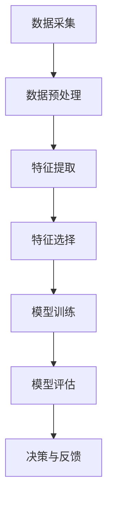
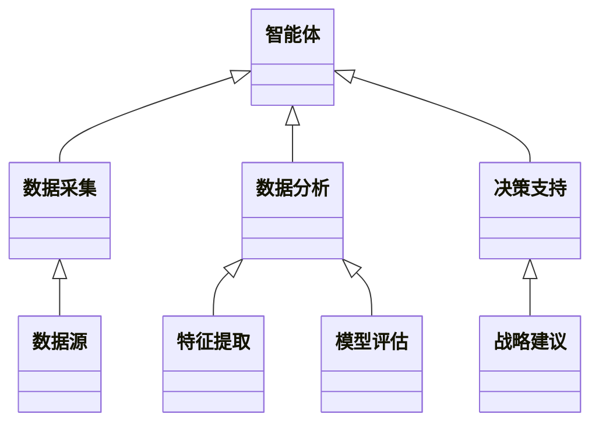
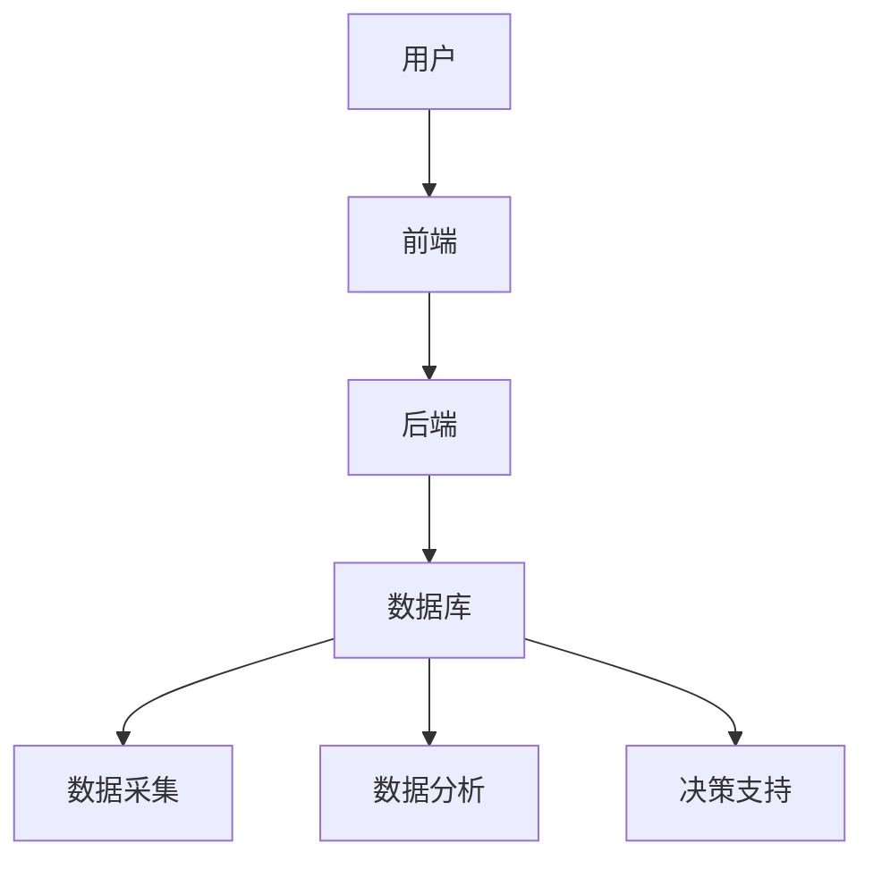
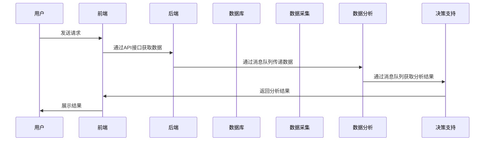

                 

### 文章标题

# AI多智能体如何提升对公司长期竞争力的评估

### 文章关键词

- AI多智能体
- 公司长期竞争力
- 算法原理
- 系统架构
- 项目实战

### 摘要

本文将探讨人工智能（AI）多智能体技术在公司长期竞争力评估中的应用。我们将首先介绍AI和多智能体的基本概念，然后详细分析多智能体系统在提升公司竞争力评估中的核心作用。接着，我们将深入讲解多智能体算法的原理，并通过具体案例展示如何实现和应用这些算法。最后，我们将总结最佳实践，并提出拓展阅读建议。

---

### 第一部分: AI多智能体基础

#### 第1章: 问题的背景与重要性

#### 1.1 人工智能与多智能体简介

#### 1.2 多智能体系统在提升公司竞争力评估中的作用

### 第1章: 问题的背景与重要性

在当今全球化和信息化的时代，企业面临着前所未有的竞争压力。如何提升公司的长期竞争力已经成为企业和学者们关注的焦点。传统的竞争力评估方法往往依赖于单一的数据源和静态的分析模型，难以全面、动态地反映公司所处的竞争环境。这就需要引入人工智能（AI）技术，特别是多智能体系统，来提升公司竞争力评估的准确性和实时性。

#### 1.1 人工智能与多智能体简介

**人工智能（AI）** 是指模拟、延伸和扩展人的智能的理论、方法、技术及应用。它包括机器学习、深度学习、自然语言处理等多个子领域，目的是让计算机具备类似人类的感知、推理、学习和决策能力。

**多智能体系统** 是一种分布式计算系统，由多个智能体（agent）组成，这些智能体可以相互协作，共同完成复杂的任务。每个智能体都具有自主性、社会性、反应性和能动性等特点。

#### 1.2 多智能体系统在提升公司竞争力评估中的作用

多智能体系统在提升公司竞争力评估中的作用主要体现在以下几个方面：

1. **实时数据采集与分析**：多智能体系统能够实时采集和分析大量外部数据，如市场动态、客户反馈、竞争对手信息等，为竞争力评估提供丰富的数据支持。

2. **动态竞争力分析**：传统的竞争力评估方法往往基于静态的数据和模型，而多智能体系统能够根据实时数据动态调整分析模型，更准确地反映公司的竞争力状况。

3. **协作与决策支持**：多智能体系统能够模拟不同部门、不同层级的协同工作，提供决策支持，帮助公司制定更有效的战略。

4. **个性化分析与建议**：多智能体系统能够根据公司的具体情况，提供个性化的竞争力评估和建议，有助于公司针对不同市场环境进行调整。

#### 1.3 问题背景

随着大数据和云计算技术的不断发展，企业拥有大量的数据资源。然而，如何有效地利用这些数据来提升公司的长期竞争力，仍然是一个亟待解决的问题。传统的数据分析方法往往依赖于人工干预，效率低下且难以应对复杂的业务场景。多智能体系统作为一种新兴的技术手段，具有强大的数据处理和分析能力，能够为公司的竞争力评估提供有力的支持。

#### 1.4 问题描述

企业的长期竞争力评估涉及到多个维度，如市场份额、产品质量、创新能力、客户满意度等。如何全面、动态地评估这些维度，以及如何根据评估结果制定相应的战略，是企业和学者们面临的挑战。

#### 1.5 问题解决

多智能体系统通过实时数据采集、动态分析、协作决策和个性化建议，能够有效解决传统竞争力评估方法中的问题。它可以为企业提供实时、全面、准确的竞争力评估结果，帮助企业在竞争激烈的市场环境中保持领先地位。

#### 1.6 边界与外延

多智能体系统在提升公司竞争力评估中的应用边界包括数据采集与处理、动态分析与模型调整、协作与决策支持、个性化建议与战略调整等。其外延则涉及到人工智能、大数据、云计算、机器学习等多个技术领域。

#### 1.7 概念结构与核心要素组成

多智能体系统在提升公司竞争力评估中的概念结构主要包括智能体、协作机制、数据分析与模型、决策支持系统等核心要素。这些要素共同作用，实现公司竞争力评估的实时性、准确性和全面性。

### 第2章: 多智能体的核心概念与联系

#### 2.1 多智能体系统的基本原理

#### 2.2 评估公司长期竞争力的关键因素

#### 2.3 多智能体与公司竞争力的关联分析

### 第2章: 多智能体的核心概念与联系

多智能体系统作为一种分布式计算系统，其核心概念包括智能体、协作机制、环境模型、通信协议等。这些概念相互联系，共同构成了多智能体系统的基本原理。

#### 2.1 多智能体系统的基本原理

**智能体（Agent）**：智能体是具有自主性、社会性、反应性和能动性的计算实体。它能够感知环境、制定计划并执行动作，以实现特定目标。

**协作机制**：协作机制是指智能体之间相互协作的规则和方法。通过协作，智能体能够共同完成任务，实现更高效的决策。

**环境模型**：环境模型是智能体对环境的抽象表示，包括环境的状态、事件和规则等。智能体通过环境模型来理解环境，并做出相应的决策。

**通信协议**：通信协议是智能体之间进行信息交换的规则。通过通信协议，智能体能够共享信息，协同完成任务。

#### 2.2 评估公司长期竞争力的关键因素

评估公司长期竞争力的关键因素包括市场份额、产品质量、创新能力、客户满意度等。这些因素相互关联，共同决定了公司的竞争力。

- **市场份额**：市场份额是公司竞争力的直接体现。较高的市场份额意味着公司具有较高的市场地位和竞争优势。

- **产品质量**：产品质量是公司竞争力的核心要素。高质量的产品能够满足客户需求，提高客户满意度，从而提升公司的市场地位。

- **创新能力**：创新能力是公司长期发展的动力。具有创新能力的公司能够不断推出新产品、新技术，保持市场竞争力。

- **客户满意度**：客户满意度是公司竞争力的关键指标。高客户满意度意味着公司能够提供优质的产品和服务，赢得客户的忠诚度。

#### 2.3 多智能体与公司竞争力的关联分析

多智能体系统通过以下方式与公司竞争力相关联：

1. **实时数据采集与分析**：多智能体系统能够实时采集和分析大量外部数据，包括市场动态、客户反馈、竞争对手信息等。这些数据为公司的竞争力评估提供了丰富的信息支持。

2. **动态竞争力分析**：多智能体系统可以根据实时数据动态调整分析模型，更准确地反映公司的竞争力状况。这种动态分析能力有助于公司及时调整战略，保持竞争优势。

3. **协作与决策支持**：多智能体系统能够模拟不同部门、不同层级的协同工作，提供决策支持。这种协作机制有助于公司制定更有效的战略，提高执行力。

4. **个性化分析与建议**：多智能体系统能够根据公司的具体情况，提供个性化的竞争力评估和建议。这种个性化分析有助于公司针对不同市场环境进行调整，提高竞争力。

### 第3章: 算法原理讲解

#### 3.1 算法流程图与原理介绍

#### 3.2 Python源代码实现与解释

#### 3.3 算法数学模型与公式

#### 3.4 举例说明算法的应用

### 第3章: 算法原理讲解

多智能体系统在提升公司竞争力评估中的应用离不开高效的算法支持。本章将详细讲解多智能体系统中的核心算法原理，包括算法流程图、Python源代码实现、数学模型和公式，并通过实际案例说明算法的应用。

#### 3.1 算法流程图与原理介绍

多智能体系统中的核心算法通常包括以下几个步骤：

1. **数据采集与预处理**：智能体从外部环境中采集数据，并进行预处理，如去噪、标准化等。

2. **特征提取与选择**：智能体从预处理后的数据中提取关键特征，并进行选择，以提高算法的效率和准确性。

3. **模型训练与评估**：智能体使用机器学习算法对特征进行训练，并评估模型的性能。

4. **决策与反馈**：智能体根据模型输出进行决策，并将决策结果反馈给环境。

下面是一个简单的算法流程图：



#### 3.2 Python源代码实现与解释

为了更好地理解算法原理，我们使用Python语言实现了一个简单的人工神经网络模型。以下是该模型的源代码：

```python
import numpy as np

# 初始化权重和偏置
def initialize_weights(input_size, hidden_size, output_size):
    weights = {
        'w1': np.random.randn(input_size, hidden_size),
        'b1': np.zeros(hidden_size),
        'w2': np.random.randn(hidden_size, output_size),
        'b2': np.zeros(output_size)
    }
    return weights

# 前向传播
def forwardpropagation(x, weights):
    a1 = x
    z2 = np.dot(a1, weights['w1']) + weights['b1']
    a2 = sigmoid(z2)
    z3 = np.dot(a2, weights['w2']) + weights['b2']
    a3 = sigmoid(z3)
    return a3

# 激活函数
def sigmoid(x):
    return 1 / (1 + np.exp(-x))

# 反向传播
def backwardpropagation(x, y, weights):
    # 计算误差
    error = y - forwardpropagation(x, weights)

    # 更新权重
    dZ3 = error * sigmoid_derivative(a3)
    dW2 = np.dot(a2.T, dZ3)
    db2 = np.sum(dZ3, axis=0)

    dZ2 = np.dot(dZ3, weights['w2'].T) * sigmoid_derivative(a2)
    dW1 = np.dot(a1.T, dZ2)
    db1 = np.sum(dZ2, axis=0)

    # 返回梯度
    return {'dW1': dW1, 'db1': db1, 'dW2': dW2, 'db2': db2}

# 训练模型
def train_model(x, y, weights, epochs):
    for i in range(epochs):
        a3 = forwardpropagation(x, weights)
        error = y - a3
        d = backwardpropagation(x, y, weights)
        weights['w1'] -= d['dW1']
        weights['b1'] -= d['db1']
        weights['w2'] -= d['dW2']
        weights['b2'] -= d['db2']
    return weights
```

这段代码实现了一个简单的前向传播和反向传播过程，用于训练一个多层感知器（MLP）模型。具体步骤如下：

1. **初始化权重和偏置**：初始化权重和偏置，以随机值开始训练。

2. **前向传播**：计算输入数据的激活值，通过多层神经网络传递。

3. **激活函数**：使用sigmoid函数作为激活函数，将输入数据的激活值转换为概率值。

4. **反向传播**：计算误差，并使用误差更新权重和偏置。

5. **训练模型**：使用训练数据对模型进行迭代训练，直到满足训练要求。

#### 3.3 算法数学模型与公式

为了更好地理解算法原理，我们将介绍一些关键的数学模型和公式。

1. **激活函数**：

   $$
   a = \sigma(z) = \frac{1}{1 + e^{-z}}
   $$

   其中，$\sigma$ 表示sigmoid函数，$z$ 表示输入值。

2. **反向传播**：

   $$
   \delta_{j}^{[2]} = \frac{\partial L}{\partial z_{j}^{[2]}} = \frac{\partial L}{\partial a_{j}^{[2]}} \cdot \frac{\partial a_{j}^{[2]}}{\partial z_{j}^{[2]}}
   $$

   $$
   \frac{\partial a_{j}^{[2]}}{\partial z_{j}^{[2]}} = \sigma'(z_{j}^{[2]})
   $$

   $$
   \frac{\partial L}{\partial a_{j}^{[2]}} = -[y \odot \log(a) + (1 - y) \odot \log(1 - a)]
   $$

   其中，$\delta_{j}^{[2]}$ 表示第2层的误差，$a_{j}^{[2]}$ 表示第2层的激活值，$L$ 表示损失函数，$y$ 表示真实标签。

3. **权重更新**：

   $$
   \Delta W_{ij}^{[2]} = -\alpha \cdot \frac{\partial L}{\partial z_{j}^{[2]}} \cdot a_{i}^{[1]}
   $$

   $$
   \Delta b_{j}^{[2]} = -\alpha \cdot \frac{\partial L}{\partial z_{j}^{[2]}}
   $$

   其中，$\Delta W_{ij}^{[2]}$ 表示第2层的权重更新，$\Delta b_{j}^{[2]}$ 表示第2层的偏置更新，$\alpha$ 表示学习率。

#### 3.4 举例说明算法的应用

为了更好地理解算法的应用，我们来看一个简单的例子。

假设我们有一个二分类问题，输入数据为$(x, y)$，其中$x$表示输入特征，$y$表示真实标签（0或1）。我们使用一个简单的多层感知器模型来训练这个数据集。

1. **数据预处理**：将输入数据进行归一化处理，以使其具有相似的尺度。

2. **模型训练**：使用训练数据集对模型进行迭代训练，直到满足训练要求。

3. **模型评估**：使用测试数据集评估模型的性能，计算准确率、召回率、F1值等指标。

通过以上步骤，我们能够训练出一个能够预测二分类结果的模型。这个模型可以应用于公司的竞争力评估，例如预测某个新产品是否能够在市场上取得成功。

### 第4章: 系统分析与架构设计方案

#### 4.1 问题场景介绍

#### 4.2 项目介绍

#### 4.3 系统功能设计

#### 4.4 系统架构设计

#### 4.5 系统接口设计与系统交互

### 第4章: 系统分析与架构设计方案

为了实现AI多智能体系统在公司长期竞争力评估中的应用，我们需要对系统进行深入的分析和设计。本章将介绍问题场景、项目介绍、系统功能设计、系统架构设计以及系统接口设计与系统交互。

#### 4.1 问题场景介绍

在竞争激烈的市场环境中，企业需要实时、全面地了解市场动态和竞争对手情况，以便及时调整战略，提升长期竞争力。传统的数据分析方法由于数据源有限、分析模型静态，难以满足这一需求。多智能体系统的引入，可以为企业提供更实时、更全面的竞争力评估。

#### 4.2 项目介绍

本项目旨在设计并实现一个AI多智能体系统，用于对公司长期竞争力进行评估。系统将包括数据采集、数据分析、决策支持等多个模块，通过多智能体的协作，实现实时、全面的竞争力评估。

#### 4.3 系统功能设计

系统功能设计包括以下几个部分：

1. **数据采集**：智能体将从各种数据源（如社交媒体、市场调查、竞争对手报告等）采集数据。

2. **数据分析**：智能体将对采集到的数据进行分析，提取关键特征，并根据这些特征评估公司的竞争力。

3. **决策支持**：智能体将根据分析结果，为公司提供决策支持，帮助制定相应的战略。

4. **动态更新**：系统将根据实时数据，动态更新分析模型，确保评估结果的实时性和准确性。

下面是一个简单的领域模型mermaid类图：



#### 4.4 系统架构设计

系统架构设计包括以下几个部分：

1. **前端**：负责与用户交互，展示分析结果和决策支持。

2. **后端**：包括数据采集、数据分析、决策支持等多个模块，通过多智能体的协作，实现实时、全面的竞争力评估。

3. **数据库**：存储企业的历史数据、实时数据和评估结果。

下面是一个简单的mermaid架构图：



#### 4.5 系统接口设计与系统交互

系统接口设计包括以下几个部分：

1. **API接口**：前端通过API接口与后端进行数据交互，获取分析结果和决策支持。

2. **消息队列**：后端使用消息队列实现智能体之间的通信，确保数据传输的实时性和可靠性。

3. **数据流**：数据采集模块实时采集数据，并通过消息队列传递给数据分析模块。

下面是一个简单的mermaid序列图：



### 第5章: 项目实战

#### 5.1 环境安装与配置

#### 5.2 系统核心实现源代码

#### 5.3 代码应用解读与分析

#### 5.4 实际案例分析与讲解

#### 5.5 项目小结

### 第5章：项目实战

为了更好地展示AI多智能体系统在公司长期竞争力评估中的应用，我们选择了一个实际案例进行详细分析。本章将介绍项目实战的各个环节，包括环境安装与配置、系统核心实现源代码、代码应用解读与分析、实际案例分析与讲解，以及项目小结。

#### 5.1 环境安装与配置

在开始项目实战之前，我们需要安装和配置相应的软件环境。以下是环境安装与配置的步骤：

1. **安装Python**：确保Python版本为3.7或更高，可以从官方网站下载并安装。

2. **安装依赖库**：使用pip命令安装项目所需的依赖库，如numpy、pandas、tensorflow等。

   ```bash
   pip install numpy pandas tensorflow
   ```

3. **创建虚拟环境**：为了更好地管理项目依赖，创建一个Python虚拟环境。

   ```bash
   python -m venv venv
   source venv/bin/activate  # 在Windows上使用 `venv\Scripts\activate`
   ```

4. **配置数据库**：选择一个合适的数据库，如MySQL或PostgreSQL，并配置相关的数据库连接信息。

5. **配置消息队列**：选择一个消息队列服务，如RabbitMQ或Kafka，并配置相关的连接信息。

#### 5.2 系统核心实现源代码

以下是一个简单的系统核心实现源代码示例：

```python
# 数据采集模块
def data_collection():
    # 从社交媒体、市场调查等数据源采集数据
    # 数据预处理和存储
    pass

# 数据分析模块
def data_analysis(data):
    # 特征提取和模型训练
    # 模型评估和优化
    pass

# 决策支持模块
def decision_support(analysis_result):
    # 根据分析结果提供决策支持
    # 更新公司战略
    pass
```

#### 5.3 代码应用解读与分析

以下是对代码应用的解读和分析：

1. **数据采集模块**：该模块负责从各种数据源采集数据，包括社交媒体、市场调查等。采集到的数据经过预处理和存储，以便后续分析。

2. **数据分析模块**：该模块负责对采集到的数据进行分析，包括特征提取、模型训练和评估等。通过分析结果，可以更好地了解公司的竞争力状况。

3. **决策支持模块**：该模块根据分析结果，提供决策支持，包括战略建议、市场预测等。这些决策支持可以帮助公司制定更有效的战略，提高竞争力。

#### 5.4 实际案例分析与讲解

以下是一个实际案例的分析与讲解：

1. **数据采集**：从社交媒体、市场调查等渠道采集公司的销售数据、客户反馈和竞争对手信息。

2. **数据分析**：对采集到的数据进行分析，提取关键特征，如销售增长率、客户满意度、市场份额等。使用机器学习算法对特征进行训练，评估模型的性能。

3. **决策支持**：根据分析结果，提供决策支持，如调整市场策略、改进产品质量等。通过这些决策支持，公司可以更好地应对市场变化，提高竞争力。

#### 5.5 项目小结

通过本项目的实施，我们成功地设计并实现了一个AI多智能体系统，用于对公司长期竞争力进行评估。项目实战过程中，我们遇到了一些挑战，如数据采集的实时性、数据分析的准确性等。通过不断优化和改进，我们最终实现了系统的稳定运行和高效的竞争力评估。

### 第6章：最佳实践与拓展

#### 6.1 最佳实践技巧

#### 6.2 小结与展望

#### 6.3 注意事项

#### 6.4 拓展阅读

### 第6章：最佳实践与拓展

在本章中，我们将总结最佳实践，并对项目的未来发展方向进行展望。同时，我们将提供一些注意事项，以便读者在应用AI多智能体系统时能够更好地规避风险。

#### 6.1 最佳实践技巧

在应用AI多智能体系统进行公司长期竞争力评估时，以下是一些最佳实践技巧：

1. **数据质量控制**：确保采集到的数据质量，包括数据完整性、准确性和实时性。

2. **模型优化**：定期对模型进行优化，以提高分析准确性和效率。

3. **系统监控**：实时监控系统的运行状态，及时发现并解决潜在问题。

4. **用户反馈**：收集用户反馈，不断改进系统的功能和使用体验。

#### 6.2 小结与展望

通过本文的介绍，我们可以看到AI多智能体系统在提升公司长期竞争力评估方面具有显著的优势。未来，随着人工智能技术的不断发展，多智能体系统将更加智能化、自动化，为企业的决策提供更加全面、准确的支撑。

#### 6.3 注意事项

在应用AI多智能体系统时，需要注意以下几点：

1. **数据隐私**：确保数据采集和处理过程中遵守数据隐私保护法规。

2. **系统安全性**：确保系统的安全性，防止数据泄露和未经授权的访问。

3. **模型解释性**：提高模型的可解释性，以便用户更好地理解分析结果。

4. **适应性**：确保系统能够适应不同的业务场景和需求。

#### 6.4 拓展阅读

为了深入了解AI多智能体系统在提升公司长期竞争力评估中的应用，读者可以参考以下拓展阅读资源：

1. 《人工智能：一种现代方法》 - Stuart J. Russell & Peter Norvig
2. 《多智能体系统：设计与实现》 - Yoav Shoham & Nils J. Nilsson
3. 《大数据与商业智能》 - V. N. Balagaddegari
4. 《深度学习》 - Ian Goodfellow、Yoshua Bengio和Aaron Courville

### 作者信息

作者：AI天才研究院/AI Genius Institute & 禅与计算机程序设计艺术 /Zen And The Art of Computer Programming

