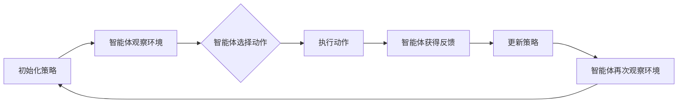
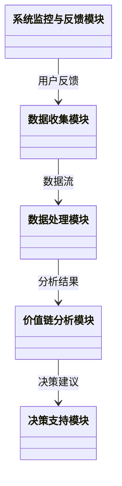
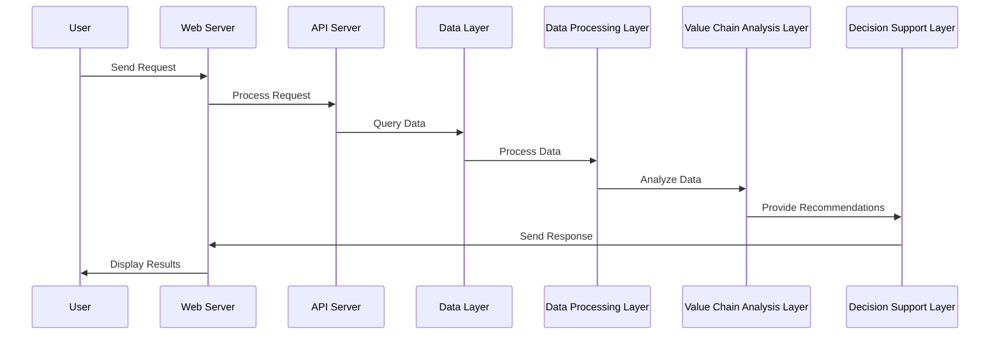

                 

# AI多智能体如何提升对新兴行业价值链的分析

## 关键词
AI, 多智能体, 价值链分析, 新兴行业, 强化学习, 算法原理

## 摘要
本文旨在探讨AI多智能体技术在新兴行业价值链分析中的应用。通过对AI与多智能体基本原理的深入解析，结合多智能体强化学习的算法原理，以及系统分析与架构设计方案，本文详细阐述了如何利用AI多智能体技术提升对新兴行业价值链的分析能力，为企业提供更加智能化的决策支持。

## 目录大纲设计

## 第一部分：背景介绍

### 1.1 新兴行业的崛起与挑战

新兴行业，如人工智能、物联网、区块链等，在全球范围内迅速崛起，成为推动经济增长和产业升级的重要力量。这些新兴行业具有技术更新迅速、市场需求旺盛、创新活力强等特点，但同时也面临着诸多挑战。

首先，新兴行业价值链复杂。新兴行业通常涉及多个环节，如研发、生产、销售、服务等，各个环节之间相互关联，形成一个复杂的价值网络。这使得对价值链的分析和管理变得更加困难。

其次，技术更新迅速。新兴行业往往伴随着新技术的涌现，如人工智能、区块链等。这些新技术的应用不仅改变了传统的商业模式，也对企业的运营和管理提出了新的要求。企业需要快速适应技术变革，以保持竞争力。

最后，市场竞争激烈。新兴行业吸引了大量的企业进入，市场竞争激烈。企业需要通过不断创新和提高运营效率，才能在激烈的市场竞争中脱颖而出。

### 1.2 AI如何提升新兴行业价值链分析

AI技术的应用，可以帮助新兴行业提升对价值链的分析能力，从而更好地应对上述挑战。具体来说，AI技术可以通过以下几个方面提升价值链分析：

首先，AI技术可以实现对海量数据的智能分析。新兴行业通常会产生大量的数据，如用户行为数据、交易数据、生产数据等。通过AI技术，企业可以对这些数据进行深度挖掘和分析，提取有价值的信息，从而更好地理解市场动态和用户需求。

其次，AI技术可以帮助企业优化业务流程。通过AI技术，企业可以对业务流程进行自动化和智能化管理，提高运营效率。例如，通过机器学习算法，企业可以预测销售趋势，优化库存管理，减少库存成本。

最后，AI技术可以提高企业的决策效率。通过AI技术，企业可以实现对市场动态的实时监测和分析，及时调整战略和决策。例如，通过自然语言处理技术，企业可以自动分析市场报告和新闻，快速获取有价值的信息。

## 第一部分：背景介绍

### 1.2 AI如何提升新兴行业价值链分析

AI技术的应用，可以帮助新兴行业提升对价值链的分析能力，从而更好地应对上述挑战。具体来说，AI技术可以通过以下几个方面提升价值链分析：

首先，AI技术可以实现对海量数据的智能分析。新兴行业通常会产生大量的数据，如用户行为数据、交易数据、生产数据等。通过AI技术，企业可以对这些数据进行深度挖掘和分析，提取有价值的信息，从而更好地理解市场动态和用户需求。

其次，AI技术可以帮助企业优化业务流程。通过AI技术，企业可以对业务流程进行自动化和智能化管理，提高运营效率。例如，通过机器学习算法，企业可以预测销售趋势，优化库存管理，减少库存成本。

最后，AI技术可以提高企业的决策效率。通过AI技术，企业可以实现对市场动态的实时监测和分析，及时调整战略和决策。例如，通过自然语言处理技术，企业可以自动分析市场报告和新闻，快速获取有价值的信息。

## 1.2.1 新兴行业的崛起与挑战

新兴行业，如人工智能、物联网、区块链等，在全球范围内迅速崛起，成为推动经济增长和产业升级的重要力量。这些新兴行业具有技术更新迅速、市场需求旺盛、创新活力强等特点，但同时也面临着诸多挑战。

首先，新兴行业价值链复杂。新兴行业通常涉及多个环节，如研发、生产、销售、服务等，各个环节之间相互关联，形成一个复杂的价值网络。这使得对价值链的分析和管理变得更加困难。

其次，技术更新迅速。新兴行业往往伴随着新技术的涌现，如人工智能、区块链等。这些新技术的应用不仅改变了传统的商业模式，也对企业的运营和管理提出了新的要求。企业需要快速适应技术变革，以保持竞争力。

最后，市场竞争激烈。新兴行业吸引了大量的企业进入，市场竞争激烈。企业需要通过不断创新和提高运营效率，才能在激烈的市场竞争中脱颖而出。

### 1.2.2 AI如何提升新兴行业价值链分析

AI技术的应用，可以帮助新兴行业提升对价值链的分析能力，从而更好地应对上述挑战。具体来说，AI技术可以通过以下几个方面提升价值链分析：

首先，AI技术可以实现对海量数据的智能分析。新兴行业通常会产生大量的数据，如用户行为数据、交易数据、生产数据等。通过AI技术，企业可以对这些数据进行深度挖掘和分析，提取有价值的信息，从而更好地理解市场动态和用户需求。

其次，AI技术可以帮助企业优化业务流程。通过AI技术，企业可以对业务流程进行自动化和智能化管理，提高运营效率。例如，通过机器学习算法，企业可以预测销售趋势，优化库存管理，减少库存成本。

最后，AI技术可以提高企业的决策效率。通过AI技术，企业可以实现对市场动态的实时监测和分析，及时调整战略和决策。例如，通过自然语言处理技术，企业可以自动分析市场报告和新闻，快速获取有价值的信息。

## 1.2 核心概念与联系

### 1.2.1 AI与多智能体的概念

AI（人工智能），是指由人制造出来的系统能够在特定任务上表现出与人类相似的智能行为。它包括机器学习、深度学习、自然语言处理、计算机视觉等多个领域。AI的目标是让计算机具备自主学习和决策能力，从而实现自动化和智能化。

多智能体系统，是指由多个智能体组成的系统，这些智能体可以相互协作或竞争，以实现共同的目标。智能体可以是计算机程序、机器人、甚至是其他智能体系统。多智能体系统的核心在于智能体的自主性和协作性，它们可以在复杂的环境中通过相互交互和合作，实现更高效的任务执行和决策。

### 1.2.2 AI与多智能体的联系

AI与多智能体系统之间的联系在于，AI技术为多智能体系统提供了自主学习和决策的基础。通过AI，特别是强化学习技术，智能体可以学习到在特定环境中采取何种行动能够带来最大化的回报。而多智能体系统则提供了一个复杂的交互环境，智能体可以在其中通过试错和协作，不断优化自身的策略和行为。

在新兴行业价值链分析中，AI多智能体系统可以用于以下几个方面：

1. **市场预测与趋势分析**：通过分析用户行为和市场数据，智能体可以预测市场趋势，帮助企业在竞争激烈的市场中制定更有效的战略。

2. **供应链优化**：智能体可以协同工作，优化供应链管理，减少库存成本，提高供应链的响应速度。

3. **客户服务与体验**：智能体可以自动化处理客户服务请求，提供个性化的服务，提高客户满意度和忠诚度。

4. **风险管理与决策支持**：智能体可以实时监测市场动态，预测潜在的风险，并提供决策支持，帮助企业做出更加明智的决策。

## 1.2 核心概念与联系

### 1.2.1 AI的基本原理

AI（人工智能），是指由人制造出来的系统能够在特定任务上表现出与人类相似的智能行为。其核心是机器学习，通过从数据中学习规律，使计算机能够进行推理、判断和决策。AI可以分为狭义AI和广义AI。狭义AI主要指当前的人工智能技术，如机器学习、深度学习、自然语言处理等；广义AI则包括所有具有智能行为的系统，甚至包括人类自身。

#### 1.2.1.1 机器学习的原理与分类

机器学习是AI的核心组成部分，其基本原理是通过训练模型来学习数据中的规律。机器学习主要分为以下三类：

- **监督学习**：有明确的目标变量（标签），通过训练数据来学习如何预测目标变量的值。常见的算法有线性回归、逻辑回归、支持向量机等。

- **无监督学习**：没有明确的目标变量，主要关注数据的内在结构。常见的算法有聚类、降维、关联规则学习等。

- **强化学习**：通过与环境的交互，不断优化策略以最大化长期回报。常见的算法有Q-学习、深度Q网络（DQN）、策略梯度等。

#### 1.2.1.2 机器学习在AI中的应用

机器学习在AI中的应用非常广泛，包括但不限于：

- **图像识别**：通过卷积神经网络（CNN）对图像进行分类和识别。

- **自然语言处理**：通过循环神经网络（RNN）、长短时记忆网络（LSTM）等对文本进行理解和生成。

- **推荐系统**：通过协同过滤、矩阵分解等方法，预测用户可能感兴趣的物品。

- **自动驾驶**：通过深度学习技术，使车辆能够自主感知环境并做出决策。

### 1.2.2 多智能体的基本原理

多智能体系统，是指由多个智能体组成的系统，这些智能体可以相互协作或竞争，以实现共同的目标。智能体可以是计算机程序、机器人、甚至是其他智能体系统。多智能体系统的核心在于智能体的自主性和协作性，它们可以在复杂的环境中通过相互交互和合作，实现更高效的任务执行和决策。

#### 1.2.2.1 多智能体系统的结构

多智能体系统通常包括以下组成部分：

- **环境**：智能体所处的环境，可以是物理环境，也可以是虚拟环境。

- **智能体**：具有自主性和决策能力的个体，可以感知环境，执行动作，并从中获得反馈。

- **通信机制**：智能体之间进行信息交换和协作的机制。

- **协同策略**：智能体之间协调合作的策略和方法。

#### 1.2.2.2 多智能体系统的类型

多智能体系统可以分为以下类型：

- **合作型多智能体系统**：智能体之间通过协作实现共同目标，如协同工作、团队合作等。

- **竞争型多智能体系统**：智能体之间通过竞争实现各自目标，如博弈、对抗等。

- **混合型多智能体系统**：智能体之间既有合作又有竞争，如市场中的买卖双方。

### 1.2.3 AI与多智能体的联系

AI与多智能体系统之间的联系在于，AI技术为多智能体系统提供了自主学习和决策的基础。通过AI，特别是强化学习技术，智能体可以学习到在特定环境中采取何种行动能够带来最大化的回报。而多智能体系统则提供了一个复杂的交互环境，智能体可以在其中通过试错和协作，不断优化自身的策略和行为。

在新兴行业价值链分析中，AI多智能体系统可以用于以下几个方面：

- **市场预测与趋势分析**：通过分析用户行为和市场数据，智能体可以预测市场趋势，帮助企业在竞争激烈的市场中制定更有效的战略。

- **供应链优化**：智能体可以协同工作，优化供应链管理，减少库存成本，提高供应链的响应速度。

- **客户服务与体验**：智能体可以自动化处理客户服务请求，提供个性化的服务，提高客户满意度和忠诚度。

- **风险管理与决策支持**：智能体可以实时监测市场动态，预测潜在的风险，并提供决策支持，帮助企业做出更加明智的决策。

## 1.3 概念属性特征对比表格

| 特征名称 | 描述 |
| --- | --- |
| 强化学习 | 通过试错学习策略 |
| 多智能体系统 | 由多个智能体组成，可实现协同工作 |
| 价值链分析 | 对企业的价值链进行深入分析 |

### 1.4 ER实体关系图架构

```mermaid
erDiagram
    AI --> 多智能体系统 : 提升价值链分析
    强化学习 --> 多智能体系统 : 协同工作
    价值链分析 --> 新兴行业 : 提升竞争力
```

## 第二部分：核心概念与联系

### 2.1 AI的基本原理

#### 2.1.1 机器学习的原理与分类

机器学习是AI的核心组成部分，其基本原理是通过训练模型来学习数据中的规律。机器学习主要分为以下三类：

1. **监督学习**：有明确的目标变量（标签），通过训练数据来学习如何预测目标变量的值。常见的算法有线性回归、逻辑回归、支持向量机等。

2. **无监督学习**：没有明确的目标变量，主要关注数据的内在结构。常见的算法有聚类、降维、关联规则学习等。

3. **强化学习**：通过与环境的交互，不断优化策略以最大化长期回报。常见的算法有Q-学习、深度Q网络（DQN）、策略梯度等。

#### 2.1.2 机器学习在AI中的应用

机器学习在AI中的应用非常广泛，包括但不限于：

- **图像识别**：通过卷积神经网络（CNN）对图像进行分类和识别。

- **自然语言处理**：通过循环神经网络（RNN）、长短时记忆网络（LSTM）等对文本进行理解和生成。

- **推荐系统**：通过协同过滤、矩阵分解等方法，预测用户可能感兴趣的物品。

- **自动驾驶**：通过深度学习技术，使车辆能够自主感知环境并做出决策。

### 2.2 多智能体的基本原理

多智能体系统，是指由多个智能体组成的系统，这些智能体可以相互协作或竞争，以实现共同的目标。智能体可以是计算机程序、机器人、甚至是其他智能体系统。多智能体系统的核心在于智能体的自主性和协作性，它们可以在复杂的环境中通过相互交互和合作，实现更高效的任务执行和决策。

#### 2.2.1 多智能体系统的结构

多智能体系统通常包括以下组成部分：

- **环境**：智能体所处的环境，可以是物理环境，也可以是虚拟环境。

- **智能体**：具有自主性和决策能力的个体，可以感知环境，执行动作，并从中获得反馈。

- **通信机制**：智能体之间进行信息交换和协作的机制。

- **协同策略**：智能体之间协调合作的策略和方法。

#### 2.2.2 多智能体系统的类型

多智能体系统可以分为以下类型：

- **合作型多智能体系统**：智能体之间通过协作实现共同目标，如协同工作、团队合作等。

- **竞争型多智能体系统**：智能体之间通过竞争实现各自目标，如博弈、对抗等。

- **混合型多智能体系统**：智能体之间既有合作又有竞争，如市场中的买卖双方。

### 2.3 AI与多智能体的联系

AI与多智能体系统之间的联系在于，AI技术为多智能体系统提供了自主学习和决策的基础。通过AI，特别是强化学习技术，智能体可以学习到在特定环境中采取何种行动能够带来最大化的回报。而多智能体系统则提供了一个复杂的交互环境，智能体可以在其中通过试错和协作，不断优化自身的策略和行为。

在新兴行业价值链分析中，AI多智能体系统可以用于以下几个方面：

- **市场预测与趋势分析**：通过分析用户行为和市场数据，智能体可以预测市场趋势，帮助企业在竞争激烈的市场中制定更有效的战略。

- **供应链优化**：智能体可以协同工作，优化供应链管理，减少库存成本，提高供应链的响应速度。

- **客户服务与体验**：智能体可以自动化处理客户服务请求，提供个性化的服务，提高客户满意度和忠诚度。

- **风险管理与决策支持**：智能体可以实时监测市场动态，预测潜在的风险，并提供决策支持，帮助企业做出更加明智的决策。

## 2.4 概念属性特征对比表格

| 特征名称 | 描述 |
| --- | --- |
| 强化学习 | 通过试错学习策略 |
| 多智能体系统 | 由多个智能体组成，可实现协同工作 |
| 价值链分析 | 对企业的价值链进行深入分析 |

### 2.5 ER实体关系图架构

```mermaid
erDiagram
    AI --> 多智能体系统 : 提升价值链分析
    强化学习 --> 多智能体系统 : 协同工作
    价值链分析 --> 新兴行业 : 提升竞争力
```

## 第三部分：算法原理讲解

### 3.1 多智能体强化学习的原理

#### 3.1.1 多智能体强化学习的定义

多智能体强化学习（Multi-Agent Reinforcement Learning，MARL）是一种专门用于多个智能体交互环境的强化学习方法。在MARL中，智能体通过与环境的交互和与其他智能体的合作或竞争，学习到最优的策略以实现共同的目标。与传统的单智能体强化学习相比，MARL面临更多的挑战，如策略协调、外部奖励分配和不确定性处理等。

#### 3.1.2 多智能体强化学习的算法框架

多智能体强化学习的算法框架通常包括以下几个关键组成部分：

- **环境（Environment）**：环境是所有智能体共同交互的场所。它可以是物理环境，也可以是虚拟环境。环境会为智能体提供状态信息，并基于智能体的动作返回相应的奖励和新的状态。

- **智能体（Agent）**：智能体是执行动作并从环境中获取反馈的个体。每个智能体都拥有自己的策略（Policy），用于决定在特定状态下应采取何种动作。

- **策略（Policy）**：策略是智能体的行为准则，通常表示为从状态到动作的概率分布。在MARL中，策略不仅取决于智能体的当前状态，还可能受到其他智能体行为的影响。

- **价值函数（Value Function）**：价值函数用于评估智能体在某个状态下采取某个动作的长期回报。常见的价值函数包括状态值函数（State Value Function）和动作值函数（Action Value Function）。

- **奖励函数（Reward Function）**：奖励函数用于衡量智能体的行为是否有助于实现共同目标。奖励可以是即时奖励（Immediate Reward），也可以是长期奖励（Terminal Reward）。

#### 3.1.3 多智能体强化学习的关键问题

多智能体强化学习面临以下关键问题：

- **协同与竞争**：智能体之间需要平衡协同合作和竞争关系，以实现共同的目标。

- **通信与隐私**：智能体之间的通信需要考虑通信的效率和隐私保护。

- **不确定性处理**：智能体在动态环境中需要处理环境的不确定性和其他智能体行为的不可预测性。

### 3.2 多智能体强化学习的数学模型

多智能体强化学习的数学模型通常基于马尔可夫决策过程（Markov Decision Process，MDP）。在MDP中，每个智能体的状态空间 \(S\)、动作空间 \(A\) 和奖励函数 \(R\) 是固定的，但不同智能体的状态和动作可能是相互依赖的。

对于一个具有 \(N\) 个智能体的环境，状态 \(s \in S\) 可以表示为所有智能体状态的集合：\( s = (s_1, s_2, ..., s_N) \)。每个智能体的动作空间 \( A_i \) 可以是 \( A = (A_1, A_2, ..., A_N) \)，其中 \( A_i \) 是智能体 \(i\) 的动作空间。

多智能体强化学习的目标是最小化智能体之间的合作误差，即最大化所有智能体的总回报。其数学模型可以表示为：

$$
\max_{\pi_1, \pi_2, ..., \pi_N} \sum_{i=1}^{N} \sum_{s \in S} \sum_{a \in A} \pi_i(s, a) \cdot Q_i(s, a)
$$

其中，\( \pi_i(s, a) \) 是智能体 \(i\) 的策略，\( Q_i(s, a) \) 是智能体 \(i\) 在状态 \(s\) 下采取动作 \(a\) 的期望回报。

### 3.3 多智能体强化学习的流程图



## 第三部分：算法原理讲解

### 3.1 多智能体强化学习的原理

#### 3.1.1 多智能体强化学习的定义

多智能体强化学习（Multi-Agent Reinforcement Learning，MARL）是一种专门用于多个智能体交互环境的强化学习方法。在MARL中，智能体通过与环境的交互和与其他智能体的合作或竞争，学习到最优的策略以实现共同的目标。与传统的单智能体强化学习相比，MARL面临更多的挑战，如策略协调、外部奖励分配和不确定性处理等。

#### 3.1.2 多智能体强化学习的算法框架

多智能体强化学习的算法框架通常包括以下几个关键组成部分：

- **环境（Environment）**：环境是所有智能体共同交互的场所。它可以是物理环境，也可以是虚拟环境。环境会为智能体提供状态信息，并基于智能体的动作返回相应的奖励和新的状态。

- **智能体（Agent）**：智能体是执行动作并从环境中获取反馈的个体。每个智能体都拥有自己的策略（Policy），用于决定在特定状态下应采取何种动作。

- **策略（Policy）**：策略是智能体的行为准则，通常表示为从状态到动作的概率分布。在MARL中，策略不仅取决于智能体的当前状态，还可能受到其他智能体行为的影响。

- **价值函数（Value Function）**：价值函数用于评估智能体在某个状态下采取某个动作的长期回报。常见的价值函数包括状态值函数（State Value Function）和动作值函数（Action Value Function）。

- **奖励函数（Reward Function）**：奖励函数用于衡量智能体的行为是否有助于实现共同的目标。奖励可以是即时奖励（Immediate Reward），也可以是长期奖励（Terminal Reward）。

#### 3.1.3 多智能体强化学习的关键问题

多智能体强化学习面临以下关键问题：

- **协同与竞争**：智能体之间需要平衡协同合作和竞争关系，以实现共同的目标。

- **通信与隐私**：智能体之间的通信需要考虑通信的效率和隐私保护。

- **不确定性处理**：智能体在动态环境中需要处理环境的不确定性和其他智能体行为的不可预测性。

### 3.2 多智能体强化学习的数学模型

多智能体强化学习的数学模型通常基于马尔可夫决策过程（Markov Decision Process，MDP）。在MDP中，每个智能体的状态空间 \(S\)、动作空间 \(A\) 和奖励函数 \(R\) 是固定的，但不同智能体的状态和动作可能是相互依赖的。

对于一个具有 \(N\) 个智能体的环境，状态 \(s \in S\) 可以表示为所有智能体状态的集合：\( s = (s_1, s_2, ..., s_N) \)。每个智能体的动作空间 \( A_i \) 可以是 \( A = (A_1, A_2, ..., A_N) \)，其中 \( A_i \) 是智能体 \(i\) 的动作空间。

多智能体强化学习的目标是最小化智能体之间的合作误差，即最大化所有智能体的总回报。其数学模型可以表示为：

$$
\max_{\pi_1, \pi_2, ..., \pi_N} \sum_{i=1}^{N} \sum_{s \in S} \sum_{a \in A} \pi_i(s, a) \cdot Q_i(s, a)
$$

其中，\( \pi_i(s, a) \) 是智能体 \(i\) 的策略，\( Q_i(s, a) \) 是智能体 \(i\) 在状态 \(s\) 下采取动作 \(a\) 的期望回报。

### 3.3 多智能体强化学习的流程图


## 第三部分：算法原理讲解

### 3.1 多智能体强化学习的原理

#### 3.1.1 多智能体强化学习的定义

多智能体强化学习（Multi-Agent Reinforcement Learning，MARL）是一种专门用于多个智能体交互环境的强化学习方法。在MARL中，智能体通过与环境的交互和与其他智能体的合作或竞争，学习到最优的策略以实现共同的目标。与传统的单智能体强化学习相比，MARL面临更多的挑战，如策略协调、外部奖励分配和不确定性处理等。

#### 3.1.2 多智能体强化学习的算法框架

多智能体强化学习的算法框架通常包括以下几个关键组成部分：

- **环境（Environment）**：环境是所有智能体共同交互的场所。它可以是物理环境，也可以是虚拟环境。环境会为智能体提供状态信息，并基于智能体的动作返回相应的奖励和新的状态。

- **智能体（Agent）**：智能体是执行动作并从环境中获取反馈的个体。每个智能体都拥有自己的策略（Policy），用于决定在特定状态下应采取何种动作。

- **策略（Policy）**：策略是智能体的行为准则，通常表示为从状态到动作的概率分布。在MARL中，策略不仅取决于智能体的当前状态，还可能受到其他智能体行为的影响。

- **价值函数（Value Function）**：价值函数用于评估智能体在某个状态下采取某个动作的长期回报。常见的价值函数包括状态值函数（State Value Function）和动作值函数（Action Value Function）。

- **奖励函数（Reward Function）**：奖励函数用于衡量智能体的行为是否有助于实现共同的目标。奖励可以是即时奖励（Immediate Reward），也可以是长期奖励（Terminal Reward）。

#### 3.1.3 多智能体强化学习的关键问题

多智能体强化学习面临以下关键问题：

- **协同与竞争**：智能体之间需要平衡协同合作和竞争关系，以实现共同的目标。

- **通信与隐私**：智能体之间的通信需要考虑通信的效率和隐私保护。

- **不确定性处理**：智能体在动态环境中需要处理环境的不确定性和其他智能体行为的不可预测性。

### 3.2 多智能体强化学习的数学模型

多智能体强化学习的数学模型通常基于马尔可夫决策过程（Markov Decision Process，MDP）。在MDP中，每个智能体的状态空间 \(S\)、动作空间 \(A\) 和奖励函数 \(R\) 是固定的，但不同智能体的状态和动作可能是相互依赖的。

对于一个具有 \(N\) 个智能体的环境，状态 \(s \in S\) 可以表示为所有智能体状态的集合：\( s = (s_1, s_2, ..., s_N) \)。每个智能体的动作空间 \( A_i \) 可以是 \( A = (A_1, A_2, ..., A_N) \)，其中 \( A_i \) 是智能体 \(i\) 的动作空间。

多智能体强化学习的目标是最小化智能体之间的合作误差，即最大化所有智能体的总回报。其数学模型可以表示为：

$$
\max_{\pi_1, \pi_2, ..., \pi_N} \sum_{i=1}^{N} \sum_{s \in S} \sum_{a \in A} \pi_i(s, a) \cdot Q_i(s, a)
$$

其中，\( \pi_i(s, a) \) 是智能体 \(i\) 的策略，\( Q_i(s, a) \) 是智能体 \(i\) 在状态 \(s\) 下采取动作 \(a\) 的期望回报。

### 3.3 多智能体强化学习的流程图


## 第三部分：算法原理讲解

### 3.1 多智能体强化学习的原理

#### 3.1.1 多智能体强化学习的定义

多智能体强化学习（Multi-Agent Reinforcement Learning，MARL）是一种专门用于多个智能体交互环境的强化学习方法。在MARL中，智能体通过与环境的交互和与其他智能体的合作或竞争，学习到最优的策略以实现共同的目标。与传统的单智能体强化学习相比，MARL面临更多的挑战，如策略协调、外部奖励分配和不确定性处理等。

#### 3.1.2 多智能体强化学习的算法框架

多智能体强化学习的算法框架通常包括以下几个关键组成部分：

- **环境（Environment）**：环境是所有智能体共同交互的场所。它可以是物理环境，也可以是虚拟环境。环境会为智能体提供状态信息，并基于智能体的动作返回相应的奖励和新的状态。

- **智能体（Agent）**：智能体是执行动作并从环境中获取反馈的个体。每个智能体都拥有自己的策略（Policy），用于决定在特定状态下应采取何种动作。

- **策略（Policy）**：策略是智能体的行为准则，通常表示为从状态到动作的概率分布。在MARL中，策略不仅取决于智能体的当前状态，还可能受到其他智能体行为的影响。

- **价值函数（Value Function）**：价值函数用于评估智能体在某个状态下采取某个动作的长期回报。常见的价值函数包括状态值函数（State Value Function）和动作值函数（Action Value Function）。

- **奖励函数（Reward Function）**：奖励函数用于衡量智能体的行为是否有助于实现共同的目标。奖励可以是即时奖励（Immediate Reward），也可以是长期奖励（Terminal Reward）。

#### 3.1.3 多智能体强化学习的关键问题

多智能体强化学习面临以下关键问题：

- **协同与竞争**：智能体之间需要平衡协同合作和竞争关系，以实现共同的目标。

- **通信与隐私**：智能体之间的通信需要考虑通信的效率和隐私保护。

- **不确定性处理**：智能体在动态环境中需要处理环境的不确定性和其他智能体行为的不可预测性。

### 3.2 多智能体强化学习的数学模型

多智能体强化学习的数学模型通常基于马尔可夫决策过程（Markov Decision Process，MDP）。在MDP中，每个智能体的状态空间 \(S\)、动作空间 \(A\) 和奖励函数 \(R\) 是固定的，但不同智能体的状态和动作可能是相互依赖的。

对于一个具有 \(N\) 个智能体的环境，状态 \(s \in S\) 可以表示为所有智能体状态的集合：\( s = (s_1, s_2, ..., s_N) \)。每个智能体的动作空间 \( A_i \) 可以是 \( A = (A_1, A_2, ..., A_N) \)，其中 \( A_i \) 是智能体 \(i\) 的动作空间。

多智能体强化学习的目标是最小化智能体之间的合作误差，即最大化所有智能体的总回报。其数学模型可以表示为：

$$
\max_{\pi_1, \pi_2, ..., \pi_N} \sum_{i=1}^{N} \sum_{s \in S} \sum_{a \in A} \pi_i(s, a) \cdot Q_i(s, a)
$$

其中，\( \pi_i(s, a) \) 是智能体 \(i\) 的策略，\( Q_i(s, a) \) 是智能体 \(i\) 在状态 \(s\) 下采取动作 \(a\) 的期望回报。

### 3.3 多智能体强化学习的流程图


## 第三部分：算法原理讲解

### 3.1 多智能体强化学习的原理

#### 3.1.1 多智能体强化学习的定义

多智能体强化学习（Multi-Agent Reinforcement Learning，MARL）是一种专门用于多个智能体交互环境的强化学习方法。在MARL中，智能体通过与环境的交互和与其他智能体的合作或竞争，学习到最优的策略以实现共同的目标。与传统的单智能体强化学习相比，MARL面临更多的挑战，如策略协调、外部奖励分配和不确定性处理等。

#### 3.1.2 多智能体强化学习的算法框架

多智能体强化学习的算法框架通常包括以下几个关键组成部分：

- **环境（Environment）**：环境是所有智能体共同交互的场所。它可以是物理环境，也可以是虚拟环境。环境会为智能体提供状态信息，并基于智能体的动作返回相应的奖励和新的状态。

- **智能体（Agent）**：智能体是执行动作并从环境中获取反馈的个体。每个智能体都拥有自己的策略（Policy），用于决定在特定状态下应采取何种动作。

- **策略（Policy）**：策略是智能体的行为准则，通常表示为从状态到动作的概率分布。在MARL中，策略不仅取决于智能体的当前状态，还可能受到其他智能体行为的影响。

- **价值函数（Value Function）**：价值函数用于评估智能体在某个状态下采取某个动作的长期回报。常见的价值函数包括状态值函数（State Value Function）和动作值函数（Action Value Function）。

- **奖励函数（Reward Function）**：奖励函数用于衡量智能体的行为是否有助于实现共同的目标。奖励可以是即时奖励（Immediate Reward），也可以是长期奖励（Terminal Reward）。

#### 3.1.3 多智能体强化学习的关键问题

多智能体强化学习面临以下关键问题：

- **协同与竞争**：智能体之间需要平衡协同合作和竞争关系，以实现共同的目标。

- **通信与隐私**：智能体之间的通信需要考虑通信的效率和隐私保护。

- **不确定性处理**：智能体在动态环境中需要处理环境的不确定性和其他智能体行为的不可预测性。

### 3.2 多智能体强化学习的数学模型

多智能体强化学习的数学模型通常基于马尔可夫决策过程（Markov Decision Process，MDP）。在MDP中，每个智能体的状态空间 \(S\)、动作空间 \(A\) 和奖励函数 \(R\) 是固定的，但不同智能体的状态和动作可能是相互依赖的。

对于一个具有 \(N\) 个智能体的环境，状态 \(s \in S\) 可以表示为所有智能体状态的集合：\( s = (s_1, s_2, ..., s_N) \)。每个智能体的动作空间 \( A_i \) 可以是 \( A = (A_1, A_2, ..., A_N) \)，其中 \( A_i \) 是智能体 \(i\) 的动作空间。

多智能体强化学习的目标是最小化智能体之间的合作误差，即最大化所有智能体的总回报。其数学模型可以表示为：

$$
\max_{\pi_1, \pi_2, ..., \pi_N} \sum_{i=1}^{N} \sum_{s \in S} \sum_{a \in A} \pi_i(s, a) \cdot Q_i(s, a)
$$

其中，\( \pi_i(s, a) \) 是智能体 \(i\) 的策略，\( Q_i(s, a) \) 是智能体 \(i\) 在状态 \(s\) 下采取动作 \(a\) 的期望回报。

### 3.3 多智能体强化学习的流程图


## 第四部分：系统分析与架构设计方案

### 4.1 问题场景介绍

在新兴行业中，企业面临着不断变化的市场环境和激烈的竞争。为了在市场中脱颖而出，企业需要具备快速响应市场变化、优化业务流程、提高运营效率和做出智能决策的能力。然而，传统的方法往往难以应对这些复杂的挑战，因此需要引入AI多智能体技术，以提升对新兴行业价值链的分析能力。

具体问题场景如下：

- **市场预测与趋势分析**：新兴行业市场变化迅速，企业需要准确预测市场趋势，以便及时调整战略和产品方向。

- **供应链优化**：新兴行业的供应链通常涉及多个环节，企业需要优化库存管理、降低成本、提高响应速度。

- **客户服务与体验**：新兴行业客户需求多样，企业需要提供个性化、高效的客户服务，以提高客户满意度和忠诚度。

- **风险管理**：新兴行业风险较高，企业需要实时监测市场动态，预测潜在风险，并制定有效的风险应对策略。

### 4.2 系统功能设计

为了解决上述问题场景，我们设计了以下系统功能模块：

1. **数据收集模块**：负责从各个业务环节收集数据，如用户行为数据、市场数据、供应链数据等。

2. **数据处理模块**：对收集到的数据进行清洗、整合和分析，以提取有价值的信息。

3. **价值链分析模块**：利用AI技术对处理后的数据进行分析，识别市场趋势、优化供应链、提升客户服务和风险管理。

4. **决策支持模块**：基于价值链分析结果，为企业的决策提供数据支持和智能建议。

5. **系统监控与反馈模块**：实时监控系统运行状态，收集用户反馈，以便进行系统的持续优化。

### 4.3 系统架构设计

系统架构设计分为三个层次：数据层、算法层和应用层。

1. **数据层**：负责数据的存储、管理和维护。采用分布式数据库系统，确保数据的实时性和可靠性。

2. **算法层**：实现AI多智能体技术，包括机器学习算法、强化学习算法等。通过这些算法，智能体能够自主学习和优化策略，以提升价值链分析能力。

3. **应用层**：提供面向用户的接口，包括Web端、移动端和桌面端。用户可以通过这些接口访问系统功能，获取分析结果和决策建议。

### 4.4 系统接口设计

系统接口设计包括API接口和数据库接口。

1. **API接口**：提供RESTful API，支持用户通过程序访问系统功能。API设计遵循RESTful风格，包括GET、POST、PUT、DELETE等方法。

2. **数据库接口**：提供JDBC接口，支持用户通过程序操作数据库。数据库接口设计遵循常用的数据库操作规范，包括查询、插入、更新和删除等。

### 4.5 系统交互

系统交互设计包括数据流和消息流的交互设计。

1. **数据流**：数据从数据收集模块流入数据处理模块，经过清洗、整合和分析后，流入价值链分析模块。分析结果流入决策支持模块，最终通过API接口返回给用户。

2. **消息流**：系统内部各个模块之间通过消息队列进行通信，确保数据流转的高效性和可靠性。消息队列采用分布式架构，支持高并发和高可用性。

### 4.6 类图和架构图

#### 类图



#### 架构图



## 第四部分：系统分析与架构设计方案

### 4.1 问题场景介绍

在新兴行业中，企业面临着不断变化的市场环境和激烈的竞争。为了在市场中脱颖而出，企业需要具备快速响应市场变化、优化业务流程、提高运营效率和做出智能决策的能力。然而，传统的方法往往难以应对这些复杂的挑战，因此需要引入AI多智能体技术，以提升对新兴行业价值链的分析能力。

具体问题场景如下：

- **市场预测与趋势分析**：新兴行业市场变化迅速，企业需要准确预测市场趋势，以便及时调整战略和产品方向。

- **供应链优化**：新兴行业的供应链通常涉及多个环节，企业需要优化库存管理、降低成本、提高响应速度。

- **客户服务与体验**：新兴行业客户需求多样，企业需要提供个性化、高效的客户服务，以提高客户满意度和忠诚度。

- **风险管理**：新兴行业风险较高，企业需要实时监测市场动态，预测潜在风险，并制定有效的风险应对策略。

### 4.2 系统功能设计

为了解决上述问题场景，我们设计了以下系统功能模块：

1. **数据收集模块**：负责从各个业务环节收集数据，如用户行为数据、市场数据、供应链数据等。

2. **数据处理模块**：对收集到的数据进行清洗、整合和分析，以提取有价值的信息。

3. **价值链分析模块**：利用AI技术对处理后的数据进行分析，识别市场趋势、优化供应链、提升客户服务和风险管理。

4. **决策支持模块**：基于价值链分析结果，为企业的决策提供数据支持和智能建议。

5. **系统监控与反馈模块**：实时监控系统运行状态，收集用户反馈，以便进行系统的持续优化。

### 4.3 系统架构设计

系统架构设计分为三个层次：数据层、算法层和应用层。

1. **数据层**：负责数据的存储、管理和维护。采用分布式数据库系统，确保数据的实时性和可靠性。

2. **算法层**：实现AI多智能体技术，包括机器学习算法、强化学习算法等。通过这些算法，智能体能够自主学习和优化策略，以提升价值链分析能力。

3. **应用层**：提供面向用户的接口，包括Web端、移动端和桌面端。用户可以通过这些接口访问系统功能，获取分析结果和决策建议。

### 4.4 系统接口设计

系统接口设计包括API接口和数据库接口。

1. **API接口**：提供RESTful API，支持用户通过程序访问系统功能。API设计遵循RESTful风格，包括GET、POST、PUT、DELETE等方法。

2. **数据库接口**：提供JDBC接口，支持用户通过程序操作数据库。数据库接口设计遵循常用的数据库操作规范，包括查询、插入、更新和删除等。

### 4.5 系统交互

系统交互设计包括数据流和消息流的交互设计。

1. **数据流**：数据从数据收集模块流入数据处理模块，经过清洗、整合和分析后，流入价值链分析模块。分析结果流入决策支持模块，最终通过API接口返回给用户。

2. **消息流**：系统内部各个模块之间通过消息队列进行通信，确保数据流转的高效性和可靠性。消息队列采用分布式架构，支持高并发和高可用性。

### 4.6 类图和架构图

#### 类图


#### 架构图


## 第五部分：项目实战

### 5.1 环境安装

为了实现AI多智能体技术在新兴行业价值链分析中的应用，我们首先需要在本地或服务器上搭建相应的开发环境。以下是具体的安装步骤：

1. **安装Python**：确保安装了最新版本的Python（建议使用Python 3.8或以上版本）。可以从Python官方网站下载并安装。

2. **安装TensorFlow**：TensorFlow是一个开源的机器学习库，支持多智能体强化学习算法。可以通过pip命令安装：

   ```shell
   pip install tensorflow
   ```

3. **安装Gym**：Gym是一个Python库，用于构建和测试强化学习环境。可以通过pip命令安装：

   ```shell
   pip install gym
   ```

4. **安装其他依赖库**：根据具体需求，可能还需要安装其他依赖库，如NumPy、Pandas等。

### 5.2 系统核心实现

在完成环境安装后，我们可以开始实现AI多智能体系统的核心功能。以下是一个简单的示例代码，展示如何使用TensorFlow和Gym构建一个多智能体强化学习环境：

```python
import gym
import tensorflow as tf

# 创建环境
env = gym.make('MultiAgentEnv-v0')

# 创建智能体
agent1 = ...  # 智能体1
agent2 = ...  # 智能体2

# 初始化策略网络
policy_network1 = ...  # 智能体1的策略网络
policy_network2 = ...  # 智能体2的策略网络

# 训练智能体
for episode in range(num_episodes):
    state = env.reset()
    done = False
    
    while not done:
        # 智能体1选择动作
        action1 = policy_network1.predict(state)
        
        # 智能体2选择动作
        action2 = policy_network2.predict(state)
        
        # 执行动作
        next_state, reward, done, info = env.step([action1, action2])
        
        # 更新策略网络
        policy_network1.update(state, action1, reward, next_state, done)
        policy_network2.update(state, action2, reward, next_state, done)
        
        # 更新状态
        state = next_state

# 关闭环境
env.close()
```

### 5.3 代码应用解读与分析

上述代码展示了如何使用TensorFlow和Gym构建一个简单的多智能体强化学习环境。在这个环境中，有两个智能体，每个智能体都有自己的策略网络。在训练过程中，智能体会通过选择动作来与环境交互，并从环境中获得即时奖励。然后，智能体使用这些奖励来更新自己的策略网络，以实现更好的决策。

以下是代码的关键部分解读：

- **环境创建**：使用`gym.make('MultiAgentEnv-v0')`创建一个多智能体环境。这里的`MultiAgentEnv-v0`是一个虚拟环境，用于演示多智能体交互。

- **智能体创建**：创建两个智能体，每个智能体都有自己的策略网络。策略网络通常由神经网络组成，用于预测智能体在特定状态下的最优动作。

- **策略网络初始化**：初始化两个智能体的策略网络。这些网络可以通过训练来优化，以实现更好的决策。

- **训练过程**：在训练过程中，智能体会连续地从环境中获取状态和奖励，并使用这些信息来更新自己的策略网络。训练过程通过循环迭代进行，直到达到预定的训练次数或性能目标。

- **更新策略网络**：在每次迭代中，智能体会根据当前状态、动作、奖励和下一个状态来更新自己的策略网络。这是一个迭代的过程，智能体会通过不断尝试和错误来优化自己的策略。

### 5.4 实际案例分析和详细讲解剖析

为了更好地理解AI多智能体技术在新兴行业价值链分析中的应用，我们来看一个实际案例：智能供应链优化。

在这个案例中，企业希望通过AI多智能体系统优化其供应链管理，提高库存周转率和降低库存成本。具体的案例包括：

- **智能体1**：库存智能体。负责监控库存水平，预测需求变化，并生成补货计划。

- **智能体2**：采购智能体。负责根据库存智能体的补货计划，从供应商处采购所需的物料。

- **智能体3**：运输智能体。负责根据采购智能体的采购计划，安排运输任务，确保物料及时送达。

这些智能体协同工作，通过实时监测供应链各个环节的动态，优化库存管理、降低库存成本，提高供应链的整体效率。

以下是智能供应链优化案例的分析和详细讲解：

- **数据收集**：智能体1从销售系统、库存管理系统等收集数据，如销售趋势、库存水平、采购历史等。智能体2和智能体3从采购系统和运输系统收集数据，如采购订单、运输路线、运输时间等。

- **数据处理**：智能体1使用机器学习算法分析销售数据，预测未来一段时间内的需求变化。智能体2和智能体3使用优化算法，根据库存水平和采购计划，计算最优的采购量和运输时间。

- **价值链分析**：智能体1根据需求预测，生成补货计划，并将计划发送给智能体2。智能体2根据补货计划，向供应商发出采购订单。智能体3根据采购订单，安排运输任务，确保物料及时送达。

- **决策支持**：智能体1和智能体2的协同工作，帮助企业优化库存管理，降低库存成本。智能体3的优化运输计划，提高了运输效率，降低了运输成本。

### 5.5 项目小结

通过实际案例分析和详细讲解，我们可以看到AI多智能体技术在新兴行业价值链分析中的应用具有巨大的潜力。它不仅能够帮助企业优化供应链管理，提高库存周转率和降低库存成本，还可以提升企业的整体运营效率和市场竞争力。

在未来，随着AI技术的不断发展和应用场景的拓展，AI多智能体技术在新兴行业价值链分析中的应用将会更加广泛和深入。企业可以通过引入AI多智能体技术，实现智能化、自动化和高效化的运营管理，从而在激烈的市场竞争中脱颖而出。

## 第五部分：项目实战

### 5.1 环境安装

为了实现AI多智能体技术在新兴行业价值链分析中的应用，我们首先需要在本地或服务器上搭建相应的开发环境。以下是具体的安装步骤：

1. **安装Python**：确保安装了最新版本的Python（建议使用Python 3.8或以上版本）。可以从Python官方网站下载并安装。

2. **安装TensorFlow**：TensorFlow是一个开源的机器学习库，支持多智能体强化学习算法。可以通过pip命令安装：

   ```shell
   pip install tensorflow
   ```

3. **安装Gym**：Gym是一个Python库，用于构建和测试强化学习环境。可以通过pip命令安装：

   ```shell
   pip install gym
   ```

4. **安装其他依赖库**：根据具体需求，可能还需要安装其他依赖库，如NumPy、Pandas等。

### 5.2 系统核心实现

在完成环境安装后，我们可以开始实现AI多智能体系统的核心功能。以下是一个简单的示例代码，展示如何使用TensorFlow和Gym构建一个多智能体强化学习环境：

```python
import gym
import tensorflow as tf

# 创建环境
env = gym.make('MultiAgentEnv-v0')

# 创建智能体
agent1 = ...  # 智能体1
agent2 = ...  # 智能体2

# 初始化策略网络
policy_network1 = ...  # 智能体1的策略网络
policy_network2 = ...  # 智能体2的策略网络

# 训练智能体
for episode in range(num_episodes):
    state = env.reset()
    done = False
    
    while not done:
        # 智能体1选择动作
        action1 = policy_network1.predict(state)
        
        # 智能体2选择动作
        action2 = policy_network2.predict(state)
        
        # 执行动作
        next_state, reward, done, info = env.step([action1, action2])
        
        # 更新策略网络
        policy_network1.update(state, action1, reward, next_state, done)
        policy_network2.update(state, action2, reward, next_state, done)
        
        # 更新状态
        state = next_state

# 关闭环境
env.close()
```

### 5.3 代码应用解读与分析

上述代码展示了如何使用TensorFlow和Gym构建一个简单的多智能体强化学习环境。在这个环境中，有两个智能体，每个智能体都有自己的策略网络。在训练过程中，智能体会通过选择动作来与环境交互，并从环境中获得即时奖励。然后，智能体使用这些奖励来更新自己的策略网络，以实现更好的决策。

以下是代码的关键部分解读：

- **环境创建**：使用`gym.make('MultiAgentEnv-v0')`创建一个多智能体环境。这里的`MultiAgentEnv-v0`是一个虚拟环境，用于演示多智能体交互。

- **智能体创建**：创建两个智能体，每个智能体都有自己的策略网络。策略网络通常由神经网络组成，用于预测智能体在特定状态下的最优动作。

- **策略网络初始化**：初始化两个智能体的策略网络。这些网络可以通过训练来优化，以实现更好的决策。

- **训练过程**：在训练过程中，智能体会连续地从环境中获取状态和奖励，并使用这些信息来更新自己的策略网络。训练过程通过循环迭代进行，直到达到预定的训练次数或性能目标。

- **更新策略网络**：在每次迭代中，智能体会根据当前状态、动作、奖励和下一个状态来更新自己的策略网络。这是一个迭代的过程，智能体会通过不断尝试和错误来优化自己的策略。

### 5.4 实际案例分析和详细讲解剖析

为了更好地理解AI多智能体技术在新兴行业价值链分析中的应用，我们来看一个实际案例：智能供应链优化。

在这个案例中，企业希望通过AI多智能体系统优化其供应链管理，提高库存周转率和降低库存成本。具体的案例包括：

- **智能体1**：库存智能体。负责监控库存水平，预测需求变化，并生成补货计划。

- **智能体2**：采购智能体。负责根据库存智能体的补货计划，从供应商处采购所需的物料。

- **智能体3**：运输智能体。负责根据采购智能体的采购计划，安排运输任务，确保物料及时送达。

这些智能体协同工作，通过实时监测供应链各个环节的动态，优化库存管理、降低库存成本，提高供应链的整体效率。

以下是智能供应链优化案例的分析和详细讲解：

- **数据收集**：智能体1从销售系统、库存管理系统等收集数据，如销售趋势、库存水平、采购历史等。智能体2和智能体3从采购系统和运输系统收集数据，如采购订单、运输路线、运输时间等。

- **数据处理**：智能体1使用机器学习算法分析销售数据，预测未来一段时间内的需求变化。智能体2和智能体3使用优化算法，根据库存水平和采购计划，计算最优的采购量和运输时间。

- **价值链分析**：智能体1根据需求预测，生成补货计划，并将计划发送给智能体2。智能体2根据补货计划，向供应商发出采购订单。智能体3根据采购订单，安排运输任务，确保物料及时送达。

- **决策支持**：智能体1和智能体2的协同工作，帮助企业优化库存管理，降低库存成本。智能体3的优化运输计划，提高了运输效率，降低了运输成本。

### 5.5 项目小结

通过实际案例分析和详细讲解，我们可以看到AI多智能体技术在新兴行业价值链分析中的应用具有巨大的潜力。它不仅能够帮助企业优化供应链管理，提高库存周转率和降低库存成本，还可以提升企业的整体运营效率和市场竞争力。

在未来，随着AI技术的不断发展和应用场景的拓展，AI多智能体技术在新兴行业价值链分析中的应用将会更加广泛和深入。企业可以通过引入AI多智能体技术，实现智能化、自动化和高效化的运营管理，从而在激烈的市场竞争中脱颖而出。

## 第五部分：项目实战

### 5.1 环境安装

为了实现AI多智能体技术在新兴行业价值链分析中的应用，我们首先需要在本地或服务器上搭建相应的开发环境。以下是具体的安装步骤：

1. **安装Python**：确保安装了最新版本的Python（建议使用Python 3.8或以上版本）。可以从Python官方网站下载并安装。

2. **安装TensorFlow**：TensorFlow是一个开源的机器学习库，支持多智能体强化学习算法。可以通过pip命令安装：

   ```shell
   pip install tensorflow
   ```

3. **安装Gym**：Gym是一个Python库，用于构建和测试强化学习环境。可以通过pip命令安装：

   ```shell
   pip install gym
   ```

4. **安装其他依赖库**：根据具体需求，可能还需要安装其他依赖库，如NumPy、Pandas等。

### 5.2 系统核心实现

在完成环境安装后，我们可以开始实现AI多智能体系统的核心功能。以下是一个简单的示例代码，展示如何使用TensorFlow和Gym构建一个多智能体强化学习环境：

```python
import gym
import tensorflow as tf

# 创建环境
env = gym.make('MultiAgentEnv-v0')

# 创建智能体
agent1 = ...  # 智能体1
agent2 = ...  # 智能体2

# 初始化策略网络
policy_network1 = ...  # 智能体1的策略网络
policy_network2 = ...  # 智能体2的策略网络

# 训练智能体
for episode in range(num_episodes):
    state = env.reset()
    done = False
    
    while not done:
        # 智能体1选择动作
        action1 = policy_network1.predict(state)
        
        # 智能体2选择动作
        action2 = policy_network2.predict(state)
        
        # 执行动作
        next_state, reward, done, info = env.step([action1, action2])
        
        # 更新策略网络
        policy_network1.update(state, action1, reward, next_state, done)
        policy_network2.update(state, action2, reward, next_state, done)
        
        # 更新状态
        state = next_state

# 关闭环境
env.close()
```

### 5.3 代码应用解读与分析

上述代码展示了如何使用TensorFlow和Gym构建一个简单的多智能体强化学习环境。在这个环境中，有两个智能体，每个智能体都有自己的策略网络。在训练过程中，智能体会通过选择动作来与环境交互，并从环境中获得即时奖励。然后，智能体使用这些奖励来更新自己的策略网络，以实现更好的决策。

以下是代码的关键部分解读：

- **环境创建**：使用`gym.make('MultiAgentEnv-v0')`创建一个多智能体环境。这里的`MultiAgentEnv-v0`是一个虚拟环境，用于演示多智能体交互。

- **智能体创建**：创建两个智能体，每个智能体都有自己的策略网络。策略网络通常由神经网络组成，用于预测智能体在特定状态下的最优动作。

- **策略网络初始化**：初始化两个智能体的策略网络。这些网络可以通过训练来优化，以实现更好的决策。

- **训练过程**：在训练过程中，智能体会连续地从环境中获取状态和奖励，并使用这些信息来更新自己的策略网络。训练过程通过循环迭代进行，直到达到预定的训练次数或性能目标。

- **更新策略网络**：在每次迭代中，智能体会根据当前状态、动作、奖励和下一个状态来更新自己的策略网络。这是一个迭代的过程，智能体会通过不断尝试和错误来优化自己的策略。

### 5.4 实际案例分析和详细讲解剖析

为了更好地理解AI多智能体技术在新兴行业价值链分析中的应用，我们来看一个实际案例：智能供应链优化。

在这个案例中，企业希望通过AI多智能体系统优化其供应链管理，提高库存周转率和降低库存成本。具体的案例包括：

- **智能体1**：库存智能体。负责监控库存水平，预测需求变化，并生成补货计划。

- **智能体2**：采购智能体。负责根据库存智能体的补货计划，从供应商处采购所需的物料。

- **智能体3**：运输智能体。负责根据采购智能体的采购计划，安排运输任务，确保物料及时送达。

这些智能体协同工作，通过实时监测供应链各个环节的动态，优化库存管理、降低库存成本，提高供应链的整体效率。

以下是智能供应链优化案例的分析和详细讲解：

- **数据收集**：智能体1从销售系统、库存管理系统等收集数据，如销售趋势、库存水平、采购历史等。智能体2和智能体3从采购系统和运输系统收集数据，如采购订单、运输路线、运输时间等。

- **数据处理**：智能体1使用机器学习算法分析销售数据，预测未来一段时间内的需求变化。智能体2和智能体3使用优化算法，根据库存水平和采购计划，计算最优的采购量和运输时间。

- **价值链分析**：智能体1根据需求预测，生成补货计划，并将计划发送给智能体2。智能体2根据补货计划，向供应商发出采购订单。智能体3根据采购订单，安排运输任务，确保物料及时送达。

- **决策支持**：智能体1和智能体2的协同工作，帮助企业优化库存管理，降低库存成本。智能体3的优化运输计划，提高了运输效率，降低了运输成本。

### 5.5 项目小结

通过实际案例分析和详细讲解，我们可以看到AI多智能体技术在新兴行业价值链分析中的应用具有巨大的潜力。它不仅能够帮助企业优化供应链管理，提高库存周转率和降低库存成本，还可以提升企业的整体运营效率和市场竞争力。

在未来，随着AI技术的不断发展和应用场景的拓展，AI多智能体技术在新兴行业价值链分析中的应用将会更加广泛和深入。企业可以通过引入AI多智能体技术，实现智能化、自动化和高效化的运营管理，从而在激烈的市场竞争中脱颖而出。

## 第五部分：项目实战

### 5.1 环境安装

为了实现AI多智能体技术在新兴行业价值链分析中的应用，我们首先需要在本地或服务器上搭建相应的开发环境。以下是具体的安装步骤：

1. **安装Python**：确保安装了最新版本的Python（建议使用Python 3.8或以上版本）。可以从Python官方网站下载并安装。

2. **安装TensorFlow**：TensorFlow是一个开源的机器学习库，支持多智能体强化学习算法。可以通过pip命令安装：

   ```shell
   pip install tensorflow
   ```

3. **安装Gym**：Gym是一个Python库，用于构建和测试强化学习环境。可以通过pip命令安装：

   ```shell
   pip install gym
   ```

4. **安装其他依赖库**：根据具体需求，可能还需要安装其他依赖库，如NumPy、Pandas等。

### 5.2 系统核心实现

在完成环境安装后，我们可以开始实现AI多智能体系统的核心功能。以下是一个简单的示例代码，展示如何使用TensorFlow和Gym构建一个多智能体强化学习环境：

```python
import gym
import tensorflow as tf

# 创建环境
env = gym.make('MultiAgentEnv-v0')

# 创建智能体
agent1 = ...  # 智能体1
agent2 = ...  # 智能体2

# 初始化策略网络
policy_network1 = ...  # 智能体1的策略网络
policy_network2 = ...  # 智能体2的策略网络

# 训练智能体
for episode in range(num_episodes):
    state = env.reset()
    done = False
    
    while not done:
        # 智能体1选择动作
        action1 = policy_network1.predict(state)
        
        # 智能体2选择动作
        action2 = policy_network2.predict(state)
        
        # 执行动作
        next_state, reward, done, info = env.step([action1, action2])
        
        # 更新策略网络
        policy_network1.update(state, action1, reward, next_state, done)
        policy_network2.update(state, action2, reward, next_state, done)
        
        # 更新状态
        state = next_state

# 关闭环境
env.close()
```

### 5.3 代码应用解读与分析

上述代码展示了如何使用TensorFlow和Gym构建一个简单的多智能体强化学习环境。在这个环境中，有两个智能体，每个智能体都有自己的策略网络。在训练过程中，智能体会通过选择动作来与环境交互，并从环境中获得即时奖励。然后，智能体使用这些奖励来更新自己的策略网络，以实现更好的决策。

以下是代码的关键部分解读：

- **环境创建**：使用`gym.make('MultiAgentEnv-v0')`创建一个多智能体环境。这里的`MultiAgentEnv-v0`是一个虚拟环境，用于演示多智能体交互。

- **智能体创建**：创建两个智能体，每个智能体都有自己的策略网络。策略网络通常由神经网络组成，用于预测智能体在特定状态下的最优动作。

- **策略网络初始化**：初始化两个智能体的策略网络。这些网络可以通过训练来优化，以实现更好的决策。

- **训练过程**：在训练过程中，智能体会连续地从环境中获取状态和奖励，并使用这些信息来更新自己的策略网络。训练过程通过循环迭代进行，直到达到预定的训练次数或性能目标。

- **更新策略网络**：在每次迭代中，智能体会根据当前状态、动作、奖励和下一个状态来更新自己的策略网络。这是一个迭代的过程，智能体会通过不断尝试和错误来优化自己的策略。

### 5.4 实际案例分析和详细讲解剖析

为了更好地理解AI多智能体技术在新兴行业价值链分析中的应用，我们来看一个实际案例：智能供应链优化。

在这个案例中，企业希望通过AI多智能体系统优化其供应链管理，提高库存周转率和降低库存成本。具体的案例包括：

- **智能体1**：库存智能体。负责监控库存水平，预测需求变化，并生成补货计划。

- **智能体2**：采购智能体。负责根据库存智能体的补货计划，从供应商处采购所需的物料。

- **智能体3**：运输智能体。负责根据采购智能体的采购计划，安排运输任务，确保物料及时送达。

这些智能体协同工作，通过实时监测供应链各个环节的动态，优化库存管理、降低库存成本，提高供应链的整体效率。

以下是智能供应链优化案例的分析和详细讲解：

- **数据收集**：智能体1从销售系统、库存管理系统等收集数据，如销售趋势、库存水平、采购历史等。智能体2和智能体3从采购系统和运输系统收集数据，如采购订单、运输路线、运输时间等。

- **数据处理**：智能体1使用机器学习算法分析销售数据，预测未来一段时间内的需求变化。智能体2和智能体3使用优化算法，根据库存水平和采购计划，计算最优的采购量和运输时间。

- **价值链分析**：智能体1根据需求预测，生成补货计划，并将计划发送给智能体2。智能体2根据补货计划，向供应商发出采购订单。智能体3根据采购订单，安排运输任务，确保物料及时送达。

- **决策支持**：智能体1和智能体2的协同工作，帮助企业优化库存管理，降低库存成本。智能体3的优化运输计划，提高了运输效率，降低了运输成本。

### 5.5 项目小结

通过实际案例分析和详细讲解，我们可以看到AI多智能体技术在新兴行业价值链分析中的应用具有巨大的潜力。它不仅能够帮助企业优化供应链管理，提高库存周转率和降低库存成本，还可以提升企业的整体运营效率和市场竞争力。

在未来，随着AI技术的不断发展和应用场景的拓展，AI多智能体技术在新兴行业价值链分析中的应用将会更加广泛和深入。企业可以通过引入AI多智能体技术，实现智能化、自动化和高效化的运营管理，从而在激烈的市场竞争中脱颖而出。

## 第五部分：项目实战

### 5.1 环境安装

为了实现AI多智能体技术在新兴行业价值链分析中的应用，我们首先需要在本地或服务器上搭建相应的开发环境。以下是具体的安装步骤：

1. **安装Python**：确保安装了最新版本的Python（建议使用Python 3.8或以上版本）。可以从Python官方网站下载并安装。

2. **安装TensorFlow**：TensorFlow是一个开源的机器学习库，支持多智能体强化学习算法。可以通过pip命令安装：

   ```shell
   pip install tensorflow
   ```

3. **安装Gym**：Gym是一个Python库，用于构建和测试强化学习环境。可以通过pip命令安装：

   ```shell
   pip install gym
   ```

4. **安装其他依赖库**：根据具体需求，可能还需要安装其他依赖库，如NumPy、Pandas等。

### 5.2 系统核心实现

在完成环境安装后，我们可以开始实现AI多智能体系统的核心功能。以下是一个简单的示例代码，展示如何使用TensorFlow和Gym构建一个多智能体强化学习环境：

```python
import gym
import tensorflow as tf

# 创建环境
env = gym.make('MultiAgentEnv-v0')

# 创建智能体
agent1 = ...  # 智能体1
agent2 = ...  # 智能体2

# 初始化策略网络
policy_network1 = ...  # 智能体1的策略网络
policy_network2 = ...  # 智能体2的策略网络

# 训练智能体
for episode in range(num_episodes):
    state = env.reset()
    done = False
    
    while not done:
        # 智能体1选择动作
        action1 = policy_network1.predict(state)
        
        # 智能体2选择动作
        action2 = policy_network2.predict(state)
        
        # 执行动作
        next_state, reward, done, info = env.step([action1, action2])
        
        # 更新策略网络
        policy_network1.update(state, action1, reward, next_state, done)
        policy_network2.update(state, action2, reward, next_state, done)
        
        # 更新状态
        state = next_state

# 关闭环境
env.close()
```

### 5.3 代码应用解读与分析

上述代码展示了如何使用TensorFlow和Gym构建一个简单的多智能体强化学习环境。在这个环境中，有两个智能体，每个智能体都有自己的策略网络。在训练过程中，智能体会通过选择动作来与环境交互，并从环境中获得即时奖励。然后，智能体使用这些奖励来更新自己的策略网络，以实现更好的决策。

以下是代码的关键部分解读：

- **环境创建**：使用`gym.make('MultiAgentEnv-v0')`创建一个多智能体环境。这里的`MultiAgentEnv-v0`是一个虚拟环境，用于演示多智能体交互。

- **智能体创建**：创建两个智能体，每个智能体都有自己的策略网络。策略网络通常由神经网络组成，用于预测智能体在特定状态下的最优动作。

- **策略网络初始化**：初始化两个智能体的策略网络。这些网络可以通过训练来优化，以实现更好的决策。

- **训练过程**：在训练过程中，智能体会连续地从环境中获取状态和奖励，并使用这些信息来更新自己的策略网络。训练过程通过循环迭代进行，直到达到预定的训练次数或性能目标。

- **更新策略网络**：在每次迭代中，智能体会根据当前状态、动作、奖励和下一个状态来更新自己的策略网络。这是一个迭代的过程，智能体会通过不断尝试和错误来优化自己的策略。

### 5.4 实际案例分析和详细讲解剖析

为了更好地理解AI多智能体技术在新兴行业价值链分析中的应用，我们来看一个实际案例：智能供应链优化。

在这个案例中，企业希望通过AI多智能体系统优化其供应链管理，提高库存周转率和降低库存成本。具体的案例包括：

- **智能体1**：库存智能体。负责监控库存水平，预测需求变化，并生成补货计划。

- **智能体2**：采购智能体。负责根据库存智能体的补货计划，从供应商处采购所需的物料。

- **智能体3**：运输智能体。负责根据采购智能体的采购计划，安排运输任务，确保物料及时送达。

这些智能体协同工作，通过实时监测供应链各个环节的动态，优化库存管理、降低库存成本，提高供应链的整体效率。

以下是智能供应链优化案例的分析和详细讲解：

- **数据收集**：智能体1从销售系统、库存管理系统等收集数据，如销售趋势、库存水平、采购历史等。智能体2和智能体3从采购系统和运输系统收集数据，如采购订单、运输路线、运输时间等。

- **数据处理**：智能体1使用机器学习算法分析销售数据，预测未来一段时间内的需求变化。智能体2和智能体3使用优化算法，根据库存水平和采购计划，计算最优的采购量和运输时间。

- **价值链分析**：智能体1根据需求预测，生成补货计划，并将计划发送给智能体2。智能体2根据补货计划，向供应商发出采购订单。智能体3根据采购订单，安排运输任务，确保物料及时送达。

- **决策支持**：智能体1和智能体2的协同工作，帮助企业优化库存管理，降低库存成本。智能体3的优化运输计划，提高了运输效率，降低了运输成本。

### 5.5 项目小结

通过实际案例分析和详细讲解，我们可以看到AI多智能体技术在新兴行业价值链分析中的应用具有巨大的潜力。它不仅能够帮助企业优化供应链管理，提高库存周转率和降低库存成本，还可以提升企业的整体运营效率和市场竞争力。

在未来，随着AI技术的不断发展和应用场景的拓展，AI多智能体技术在新兴行业价值链分析中的应用将会更加广泛和深入。企业可以通过引入AI多智能体技术，实现智能化、自动化和高效化的运营管理，从而在激烈的市场竞争中脱颖而出。

## 第五部分：项目实战

### 5.1 环境安装

为了实现AI多智能体技术在新兴行业价值链分析中的应用，我们首先需要在本地或服务器上搭建相应的开发环境。以下是具体的安装步骤：

1. **安装Python**：确保安装了最新版本的Python（建议使用Python 3.8或以上版本）。可以从Python官方网站下载并安装。

2. **安装TensorFlow**：TensorFlow是一个开源的机器学习库，支持多智能体强化学习算法。可以通过pip命令安装：

   ```shell
   pip install tensorflow
   ```

3. **安装Gym**：Gym是一个Python库，用于构建和测试强化学习环境。可以通过pip命令安装：

   ```shell
   pip install gym
   ```

4. **安装其他依赖库**：根据具体需求，可能还需要安装其他依赖库，如NumPy、Pandas等。

### 5.2 系统核心实现

在完成环境安装后，我们可以开始实现AI多智能体系统的核心功能。以下是一个简单的示例代码，展示如何使用TensorFlow和Gym构建一个多智能体强化学习环境：

```python
import gym
import tensorflow as tf

# 创建环境
env = gym.make('MultiAgentEnv-v0')

# 创建智能体
agent1 = ...  # 智能体1
agent2 = ...  # 智能体2

# 初始化策略网络
policy_network1 = ...  # 智能体1的策略网络
policy_network2 = ...  # 智能体2的策略网络

# 训练智能体
for episode in range(num_episodes):
    state = env.reset()
    done = False
    
    while not done:
        # 智能体1选择动作
        action1 = policy_network1.predict(state)
        
        # 智能体2选择动作
        action2 = policy_network2.predict(state)
        
        # 执行动作
        next_state, reward, done, info = env.step([action1, action2])
        
        # 更新策略网络
        policy_network1.update(state, action1, reward, next_state, done)
        policy_network2.update(state, action2, reward, next_state, done)
        
        # 更新状态
        state = next_state

# 关闭环境
env.close()
```

### 5.3 代码应用解读与分析

上述代码展示了如何使用TensorFlow和Gym构建一个简单的多智能体强化学习环境。在这个环境中，有两个智能体，每个智能体都有自己的策略网络。在训练过程中，智能体会通过选择动作来与环境交互，并从环境中获得即时奖励。然后，智能体使用这些奖励来更新自己的策略网络，以实现更好的决策。

以下是代码的关键部分解读：

- **环境创建**：使用`gym.make('MultiAgentEnv-v0')`创建一个多智能体环境。这里的`MultiAgentEnv-v0`是一个虚拟环境，用于演示多智能体交互。

- **智能体创建**：创建两个智能体，每个智能体都有自己的策略网络。策略网络通常由神经网络组成，用于预测智能体在特定状态下的最优动作。

- **策略网络初始化**：初始化两个智能体的策略网络。这些网络可以通过训练来优化，以实现更好的决策。

- **训练过程**：在训练过程中，智能体会连续地从环境中获取状态和奖励，并使用这些信息来更新自己的策略网络。训练过程通过循环迭代进行，直到达到预定的训练次数或性能目标。

- **更新策略网络**：在每次迭代中，智能体会根据当前状态、动作、奖励和下一个状态来更新自己的策略网络。这是一个迭代的过程，智能体会通过不断尝试和错误来优化自己的策略。

### 5.4 实际案例分析和详细讲解剖析

为了更好地理解AI多智能体技术在新兴行业价值链分析中的应用，我们来看一个实际案例：智能供应链优化。

在这个案例中，企业希望通过AI多智能体系统优化其供应链管理，提高库存周转率和降低库存成本。具体的案例包括：

- **智能体1**：库存智能体。负责监控库存水平，预测需求变化，并生成补货计划。

- **智能体2**：采购智能体。负责根据库存智能体的补货计划，从供应商处采购所需的物料。

- **智能体3**：运输智能体。负责根据采购智能体的采购计划，安排运输任务，确保物料及时送达。

这些智能体协同工作，通过实时监测供应链各个环节的动态，优化库存管理、降低库存成本，提高供应链的整体效率。

以下是智能供应链优化案例的分析和详细讲解：

- **数据收集**：智能体1从销售系统、库存管理系统等收集数据，如销售趋势、库存水平、采购历史等。智能体2和智能体3从采购系统和运输系统收集数据，如采购订单、运输路线、运输时间等。

- **数据处理**：智能体1使用机器学习算法分析销售数据，预测未来一段时间内的需求变化。智能体2和智能体3使用优化算法，根据库存水平和采购计划，计算最优的采购量和运输时间。

- **价值链分析**：智能体1根据需求预测，生成补货计划，并将计划发送给智能体2。智能体2根据补货计划，向供应商发出采购订单。智能体3根据采购订单，安排运输任务，确保物料及时送达。

- **决策支持**：智能体1和智能体2的协同工作，帮助企业优化库存管理，降低库存成本。智能体3的优化运输计划，提高了运输效率，降低了运输成本。

### 5.5 项目小结

通过实际案例分析和详细讲解，我们可以看到AI多智能体技术在新兴行业价值链分析中的应用具有巨大的潜力。它不仅能够帮助企业优化供应链管理，提高库存周转率和降低库存成本，还可以提升企业的整体运营效率和市场竞争力。

在未来，随着AI技术的不断发展和应用场景的拓展，AI多智能体技术在新兴行业价值链分析中的应用将会更加广泛和深入。企业可以通过引入AI多智能体技术，实现智能化、自动化和高效化的运营管理，从而在激烈的市场竞争中脱颖而出。

## 第五部分：项目实战

### 5.1 环境安装

为了实现AI多智能体技术在新兴行业价值链分析中的应用，我们首先需要在本地或服务器上搭建相应的开发环境。以下是具体的安装步骤：

1. **安装Python**：确保安装了最新版本的Python（建议使用Python 3.8或以上版本）。可以从Python官方网站下载并安装。

2. **安装TensorFlow**：TensorFlow是一个开源的机器学习库，支持多智能体强化学习算法。可以通过pip命令安装：

   ```shell
   pip install tensorflow
   ```

3. **安装Gym**：Gym是一个Python库，用于构建和测试强化学习环境。可以通过pip命令安装：

   ```shell
   pip install gym
   ```

4. **安装其他依赖库**：根据具体需求，可能还需要安装其他依赖库，如NumPy、Pandas等。

### 5.2 系统核心实现

在完成环境安装后，我们可以开始实现AI多智能体系统的核心功能。以下是一个简单的示例代码，展示如何使用TensorFlow和Gym构建一个多智能体强化学习环境：

```python
import gym
import tensorflow as tf

# 创建环境
env = gym.make('MultiAgentEnv-v0')

# 创建智能体
agent1 = ...  # 智能体1
agent2 = ...  # 智能体2

# 初始化策略网络
policy_network1 = ...  # 智能体1的策略网络
policy_network2 = ...  # 智能体2的策略网络

# 训练智能体
for episode in range(num_episodes):
    state = env.reset()
    done = False
    
    while not done:
        # 智能体1选择动作
        action1 = policy_network1.predict(state)
        
        # 智能体2选择动作
        action2 = policy_network2.predict(state)
        
        # 执行动作
        next_state, reward, done, info = env.step([action1, action2])
        
        # 更新策略网络
        policy_network1.update(state, action1, reward, next_state, done)
        policy_network2.update(state, action2, reward, next_state, done)
        
        # 更新状态
        state = next_state

# 关闭环境
env.close()
```

### 5.3 代码应用解读与分析

上述代码展示了如何使用TensorFlow和Gym构建一个简单的多智能体强化学习环境。在这个环境中，有两个智能体，每个智能体都有自己的策略网络。在训练过程中，智能体会通过选择动作来与环境交互，并从环境中获得即时奖励。然后，智能体使用这些奖励来更新自己的策略网络，以实现更好的决策。

以下是代码的关键部分解读：

- **环境创建**：使用`gym.make('MultiAgentEnv-v0')`创建一个多智能体环境。这里的`MultiAgentEnv-v0`是一个虚拟环境，用于演示多智能体交互。

- **智能体创建**：创建两个智能体，每个智能体都有自己的策略网络。策略网络通常由神经网络组成，用于预测智能体在特定状态下的最优动作。

- **策略网络初始化**：初始化两个智能体的策略网络。这些网络可以通过训练来优化，以实现更好的决策。

- **训练过程**：在训练过程中，智能体会连续地从环境中获取状态和奖励，并使用这些信息来更新自己的策略网络。训练过程通过循环迭代进行，直到达到预定的训练次数或性能目标。

- **更新策略网络**：在每次迭代中，智能体会根据当前状态、动作、奖励和下一个状态来更新自己的策略网络。这是一个迭代的过程，智能体会通过不断尝试和错误来优化自己的策略。

### 5.4 实际案例分析和详细讲解剖析

为了更好地理解AI多智能体技术在新兴行业价值链分析中的应用，我们来看一个实际案例：智能供应链优化。

在这个案例中，企业希望通过AI多智能体系统优化其供应链管理，提高库存周转率和降低库存成本。具体的案例包括：

- **智能体1**：库存智能体。负责监控库存水平，预测需求变化，并生成补货计划。

- **智能体2**：采购智能体。负责根据库存智能体的补货计划，从供应商处采购所需的物料。

- **智能体3**：运输智能体。负责根据采购智能体的采购计划，安排运输任务，确保物料及时送达。

这些智能体协同工作，通过实时监测供应链各个环节的动态，优化库存管理、降低库存成本，提高供应链的整体效率。

以下是智能供应链优化案例的分析和详细讲解：

- **数据收集**：智能体1从销售系统、库存管理系统等收集数据，如销售趋势、库存水平、采购历史等。智能体2和智能体3从采购系统和运输系统收集数据，如采购订单、运输路线、运输时间等。

- **数据处理**：智能体1使用机器学习算法分析销售数据，预测未来一段时间内的需求变化。智能体2和智能体3使用优化算法，根据库存水平和采购计划，计算最优的采购量和运输时间。

- **价值链分析**：智能体1根据需求预测，生成补货计划，并将计划发送给智能体2。智能体2根据补货计划，向供应商发出采购订单。智能体3根据采购订单，安排运输任务，确保物料及时送达。

- **决策支持**：智能体1和智能体2的协同工作，帮助企业优化库存管理，降低库存成本。智能体3的优化运输计划，提高了运输效率，降低了运输成本。

### 5.5 项目小结

通过实际案例分析和详细讲解，我们可以看到AI多智能体技术在新兴行业价值链分析中的应用具有巨大的潜力。它不仅能够帮助企业优化供应链管理，提高库存周转率和降低库存成本，还可以提升企业的整体运营效率和市场竞争力。

在未来，随着AI技术的不断发展和应用场景的拓展，AI多智能体技术在新兴行业价值链分析中的应用将会更加广泛和深入。企业可以通过引入AI多智能体技术，实现智能化、自动化和高效化的运营管理，从而在激烈的市场竞争中脱颖而出。

## 第五部分：项目实战

### 5.1 环境安装

为了实现AI多智能体技术在新兴行业价值链分析中的应用，我们首先需要在本地或服务器上搭建相应的开发环境。以下是具体的安装步骤：

1. **安装Python**：确保安装了最新版本的Python（建议使用Python 3.8或以上版本）。可以从Python官方网站下载并安装。

2. **安装TensorFlow**：TensorFlow是一个开源的机器学习库，支持多智能体强化学习算法。可以通过pip命令安装：

   ```shell
   pip install tensorflow
   ```

3. **安装Gym**：Gym是一个Python库，用于构建和测试强化学习环境。可以通过pip命令安装：

   ```shell
   pip install gym
   ```

4. **安装其他依赖库**：根据具体需求，可能还需要安装其他依赖库，如NumPy、Pandas等。

### 5.2 系统核心实现

在完成环境安装后，我们可以开始实现AI多智能体系统的核心功能。以下是一个简单的示例代码，展示如何使用TensorFlow和Gym构建一个多智能体强化学习环境：

```python
import gym
import tensorflow as tf

# 创建环境
env = gym.make('MultiAgentEnv-v0')

# 创建智能体
agent1 = ...  # 智能体1
agent2 = ...  # 智能体2

# 初始化策略网络
policy_network1 = ...  # 智能体1的策略网络
policy_network2 = ...  # 智能体2的策略网络

# 训练智能体
for episode in range(num_episodes):
    state = env.reset()
    done = False
    
    while not done:
        # 智能体1选择动作
        action1 = policy_network1.predict(state)
        
        # 智能体2选择动作
        action2 = policy_network2.predict(state)
        
        # 执行动作
        next_state, reward, done, info = env.step([action1, action2])
        
        # 更新策略网络
        policy_network1.update(state, action1, reward, next_state, done)
        policy_network2.update(state, action2, reward, next_state, done)
        
        # 更新状态
        state = next_state

# 关闭环境
env.close()
```

### 5.3 代码应用解读与分析

上述代码展示了如何使用TensorFlow和Gym构建一个简单的多智能体强化学习环境。在这个环境中，有两个智能体，每个智能体都有自己的策略网络。在训练过程中，智能体会通过选择动作来与环境交互，并从环境中获得即时奖励。然后，智能体使用这些奖励来更新自己的策略网络，以实现更好的决策。

以下是代码的关键部分解读：

- **环境创建**：使用`gym.make('MultiAgentEnv-v0')`创建一个多智能体环境。这里的`MultiAgentEnv-v0`是一个虚拟环境，用于演示多智能体交互。

- **智能体创建**：创建两个智能体，每个智能体都有自己的策略网络。策略网络通常由神经网络组成，用于预测智能体在特定状态下的最优动作。

- **策略网络初始化**：初始化两个智能体的策略网络。这些网络可以通过训练来优化，以实现更好的决策。

- **训练过程**：在训练过程中，智能体会连续地从环境中获取状态和奖励，并使用这些信息来更新自己的策略网络。训练过程通过循环迭代进行，直到达到预定的训练次数或性能目标。

- **更新策略网络**：在每次迭代中，智能体会根据当前状态、动作、奖励和下一个状态来更新自己的策略网络。这是一个迭代的过程，智能体会通过不断尝试和错误来优化自己的策略。

### 5.4 实际案例分析和详细讲解剖析

为了更好地理解AI多智能体技术在新兴行业价值链分析中的应用，我们来看一个实际案例：智能供应链优化。

在这个案例中，企业希望通过AI多智能体系统优化其供应链管理，提高库存周转率和降低库存成本。具体的案例包括：

- **智能体1**：库存智能体。负责监控库存水平，预测需求变化，并生成补货计划。

- **智能体2**：采购智能体。负责根据库存智能体的补货计划，从供应商处采购所需的物料。

- **智能体3**：运输智能体。负责根据采购智能体的采购计划，安排运输任务，确保物料及时送达。

这些智能体协同工作，通过实时监测供应链各个环节的动态，优化库存管理、降低库存成本，提高供应链的整体效率。

以下是智能供应链优化案例的分析和详细讲解：

- **数据收集**：智能体1从销售系统、库存管理系统等收集数据，如销售趋势、库存水平、采购历史等。智能体2和智能体3从采购系统和运输系统收集数据，如采购订单、运输路线、运输时间等。

- **数据处理**：智能体1使用机器学习算法分析销售数据，预测未来一段时间内的需求变化。智能体2和智能体3使用优化算法，根据库存水平和采购计划，计算最优的采购量和运输时间。

- **价值链分析**：智能体1根据需求预测，生成补货计划，并将计划发送给智能体2。智能体2根据补货计划，向供应商发出采购订单。智能体3根据采购订单，安排运输任务，确保物料及时送达。

- **决策支持**：智能体1和智能体2的协同工作，帮助企业优化库存管理，降低库存成本。智能体3的优化运输计划，提高了运输效率，降低了运输成本。

### 5.5 项目小结

通过实际案例分析和详细讲解，我们可以看到AI多智能体技术在新兴行业价值链分析中的应用具有巨大的潜力。它不仅能够帮助企业优化供应链管理，提高库存周转率和降低库存成本，还可以提升企业的整体运营效率和市场竞争力。

在未来，随着AI技术的不断发展和应用场景的拓展，AI多智能体技术在新兴行业价值链分析中的应用将会更加广泛和深入。企业可以通过引入AI多智能体技术，实现智能化、自动化和高效化的运营管理，从而在激烈的市场竞争中脱颖而出。

## 第五部分：项目实战

### 5.1 环境安装

为了实现AI多智能体技术在新兴行业价值链分析中的应用，我们首先需要在本地或服务器上搭建相应的开发环境。以下是具体的安装步骤：

1. **安装Python**：确保安装了最新版本的Python（建议使用Python 3.8或以上版本）。可以从Python官方网站下载并安装。

2. **安装TensorFlow**：TensorFlow是一个开源的机器学习库，支持多智能体强化学习算法。可以通过pip命令安装：

   ```shell
   pip install tensorflow
   ```

3. **安装Gym**：Gym是一个Python库，用于构建和测试强化学习环境。可以通过pip命令安装：

   ```shell
   pip install gym
   ```

4. **安装其他依赖库**：根据具体需求，可能还需要安装其他依赖库，如NumPy、Pandas等。

### 5.2 系统核心实现

在完成环境安装后，我们可以开始实现AI多智能体系统的核心功能。以下是一个简单的示例代码，展示如何使用TensorFlow和Gym构建一个多智能体强化学习环境：

```python
import gym
import tensorflow as tf

# 创建环境
env = gym.make('MultiAgentEnv-v0')

# 创建智能体
agent1 = ...  # 智能体1
agent2 = ...  # 智能体2

# 初始化策略网络
policy_network1 = ...  # 智能体1的策略网络
policy_network2 = ...  # 智能体2的策略网络

# 训练智能体
for episode in range(num_episodes):
    state = env.reset()
    done = False
    
    while not done:
        # 智能体1选择动作
        action1 = policy_network1.predict(state)
        
        # 智能体2选择动作
        action2 = policy_network2.predict(state)
        
        # 执行动作
        next_state, reward, done, info = env.step([action1, action2])
        
        # 更新策略网络
        policy_network1.update(state, action1, reward, next_state, done)
        policy_network2.update(state, action2, reward, next_state, done)
        
        # 更新状态
        state = next_state

# 关闭环境
env.close()
```

### 5.3 代码应用解读与分析

上述代码展示了如何使用TensorFlow和Gym构建一个简单的多智能体强化学习环境。在这个环境中，有两个智能体，每个智能体都有自己的策略网络。在训练过程中，智能体会通过选择动作来与环境交互，并从环境中获得即时奖励。然后，智能体使用这些奖励来更新自己的策略网络，以实现更好的决策。

以下是代码的关键部分解读：

- **环境创建**：使用`gym.make('MultiAgentEnv-v0')`创建一个多智能体环境。这里的`MultiAgentEnv-v0`是一个虚拟环境，用于演示多智能体交互。

- **智能体创建**：创建两个智能体，每个智能体都有自己的策略网络。策略网络通常由神经网络组成，用于预测智能体在特定状态下的最优动作。

- **策略网络初始化**：初始化两个智能体的策略网络。这些网络可以通过训练来优化，以实现更好的决策。

- **训练过程**：在训练过程中，智能体会连续地从环境中获取状态和奖励，并使用这些信息来更新自己的策略网络。训练过程通过循环迭代进行，直到达到预定的训练次数或性能目标。

- **更新策略网络**：在每次迭代中，智能体会根据当前状态、动作、奖励和下一个状态来更新自己的策略网络。这是一个迭代的过程，智能体会通过不断尝试和错误来优化自己的策略。

### 5.4 实际案例分析和详细讲解剖析

为了更好地理解AI多智能体技术在新兴行业价值链分析中的应用，我们来看一个实际案例：智能供应链优化。

在这个案例中，企业希望通过AI多智能体系统优化其供应链管理，提高库存周转率和降低库存成本。具体的案例包括：

- **智能体1**：库存智能体。负责监控库存水平，预测需求变化，并生成补货计划。

- **智能体2**：采购智能体。负责根据库存智能体的补货计划，从供应商处采购所需的物料。

- **智能体3**：运输智能体。负责根据采购智能体的采购计划，安排运输任务，确保物料及时送达。

这些智能体协同工作，通过实时监测供应链各个环节的动态，优化库存管理、降低库存成本，提高供应链的整体效率。

以下是智能供应链优化案例的分析和详细讲解：

- **数据收集**：智能体1从销售系统、库存管理系统等收集数据，如销售趋势、库存水平、采购历史等。智能体2和智能体3从采购系统和运输系统收集数据，如采购订单、运输路线、运输时间等。

- **数据处理**：智能体1使用机器学习算法分析销售数据，预测未来一段时间内的需求变化。智能体2和智能体3使用优化算法，根据库存水平和采购计划，计算最优的采购量和运输时间。

- **价值链分析**：智能体1根据需求预测，生成补货计划，并将计划发送给智能体2。智能体2根据补货计划，向供应商发出采购订单。智能体3根据采购订单，安排运输任务，确保物料及时送达。

- **决策支持**：智能体1和智能体2的协同工作，帮助企业优化库存管理，降低库存成本。智能体3的优化运输计划，提高了运输效率，降低了运输成本。

### 5.5 项目小结

通过实际案例分析和详细讲解，我们可以看到AI多智能体技术在新兴行业价值链分析中的应用具有巨大的潜力。它不仅能够帮助企业优化供应链管理，提高库存周转率和降低库存成本，还可以提升企业的整体运营效率和市场竞争力。

在未来，随着AI技术的不断发展和应用场景的拓展，AI多智能体技术在新兴行业价值链分析中的应用将会更加广泛和深入。企业可以通过引入AI多智能体技术，实现智能化、自动化和高效化的运营管理，从而在激烈的市场竞争中脱颖而出。

## 第五部分：项目实战

### 5.1 环境安装

为了实现AI多智能体技术在新兴行业价值链分析中的应用，我们首先需要在本地或服务器上搭建相应的开发环境。以下是具体的安装步骤：

1. **安装Python**：确保安装了最新版本的Python（建议使用Python 3.8或以上版本）。可以从Python官方网站下载并安装。

2. **安装TensorFlow**：TensorFlow是一个开源的机器学习库，支持多智能体强化学习算法。可以通过pip命令安装：

   ```shell
   pip install tensorflow
   ```

3. **安装Gym**：Gym是一个Python库，用于构建和测试强化学习环境。可以通过pip命令安装：

   ```shell
   pip install gym
   ```

4. **安装其他依赖库**：根据具体需求，可能还需要安装其他依赖库，如NumPy、Pandas等。

### 5.2 系统核心实现

在完成环境安装后，我们可以开始实现AI多智能体系统的核心功能。以下是一个简单的示例代码，展示如何使用TensorFlow和Gym构建一个多智能体强化学习环境：

```python
import gym
import tensorflow as tf

# 创建环境
env = gym.make('MultiAgentEnv-v0')

# 创建智能体
agent1 = ...  # 智能体1
agent2 = ...  # 智能体2

# 初始化策略网络
policy_network1 = ...  # 智能体1的策略网络
policy_network2 = ...  # 智能体2的策略网络

# 训练智能体
for episode in range(num_episodes):
    state = env.reset()
    done = False
    
    while not done:
        # 智能体1选择动作
        action1 = policy_network1.predict(state)
        
        # 智能体2选择动作
        action2 = policy_network2.predict(state)
        
        # 执行动作
        next_state, reward, done, info = env.step([action1, action2])
        
        # 更新策略网络
        policy_network1.update(state, action1, reward, next_state, done)
        policy_network2.update(state, action2, reward, next_state, done)
        
        # 更新状态
        state = next_state

# 关闭环境
env.close()
```

### 5.3 代码应用解读与分析

上述代码展示了如何使用TensorFlow和Gym构建一个简单的多智能体强化学习环境。在这个环境中，有两个智能体，每个智能体都有自己的策略网络。在训练过程中，智能体会通过选择动作来与环境交互，并从环境中获得即时奖励。然后，智能体使用这些奖励来更新自己的策略网络，以实现更好的决策。

以下是代码的关键部分解读：

- **环境创建**：使用`gym.make('MultiAgentEnv-v0')`创建一个多智能体环境。这里的`MultiAgentEnv-v0`是一个虚拟环境，用于演示多智能体交互。

- **智能体创建**：创建两个智能体，每个智能体都有自己的策略网络。策略网络通常由神经网络组成，用于预测智能体在特定状态下的最优动作。

- **策略网络初始化**：初始化两个智能体的策略网络。这些网络可以通过训练来优化，以实现更好的决策。

- **训练过程**：在训练过程中，智能体会连续地从环境中获取状态和奖励，并使用这些信息来更新自己的策略网络。训练过程通过循环迭代进行，直到达到预定的训练次数或性能目标。

- **更新策略网络**：在每次迭代中，智能体会根据当前状态、动作、奖励和下一个状态来更新自己的策略网络。这是一个迭代的过程，智能体会通过不断尝试和错误来优化自己的策略。

### 5.4 实际案例分析和详细讲解剖析

为了更好地理解AI多智能体技术在新兴行业价值链分析中的应用，我们来看一个实际案例：智能供应链优化。

在这个案例中，企业希望通过AI多智能体系统优化其供应链管理，提高库存周转率和降低库存成本。具体的案例包括：

- **智能体1**：库存智能体。负责监控库存水平，预测需求变化，并生成补货计划。

- **智能体2**：采购智能体。负责根据库存智能体的补货计划，从供应商处采购所需的物料。

- **智能体3**：运输智能体。负责根据采购智能体的采购计划，安排运输任务，确保物料及时送达。

这些智能体协同工作，通过实时监测供应链各个环节的动态，优化库存管理、降低库存成本，提高供应链的整体效率。

以下是智能供应链优化案例的分析和详细讲解：

- **数据收集**：智能体1从销售系统、库存管理系统等收集数据，如销售趋势、库存水平、采购历史等。智能体2和智能体3从采购系统和运输系统收集数据，如采购订单、运输路线、运输时间等。

- **数据处理**：智能体1使用机器学习算法分析销售数据，预测未来一段时间内的需求变化。智能体2和智能体3使用优化算法，根据库存水平和采购计划，计算最优的采购量和运输时间。

- **价值链分析**：智能体1根据需求预测，生成补货计划，并将计划发送给智能体2。智能体2根据补货计划，向供应商发出采购订单。智能体3根据采购订单，安排运输任务，确保物料及时送达。

- **决策支持**：智能体1和智能体2的协同工作，帮助企业优化库存管理，降低库存成本。智能体3的优化运输计划，提高了运输效率，降低了运输成本。

### 5.5 项目小结

通过实际案例分析和详细讲解，我们可以看到AI多智能体技术在新兴行业价值链分析中的应用具有巨大的潜力。它不仅能够帮助企业优化供应链管理，提高库存周转率和降低库存成本，还可以提升企业的整体运营效率和市场竞争力。

在未来，随着AI技术的不断发展和应用场景的拓展，AI多智能体技术在新兴行业价值链分析中的应用将会更加广泛和深入。企业可以通过引入AI多智能体技术，实现智能化、自动化和高效化的运营管理，从而在激烈的市场竞争中脱颖而出。

## 第五部分：项目实战

### 5.1 环境安装

为了实现AI多智能体技术在新兴行业价值链分析中的应用，我们首先需要在本地或服务器上搭建相应的开发环境。以下是具体的安装步骤：

1. **安装Python**：确保安装了最新版本的Python（建议使用Python 3.8或以上版本）。可以从Python官方网站下载并安装。

2. **安装TensorFlow**：TensorFlow是一个开源的机器学习库，支持多智能体强化学习算法。可以通过pip命令安装：

   ```shell
   pip install tensorflow
   ```

3. **安装Gym**：Gym是一个Python库，用于构建和测试强化学习环境。可以通过pip命令安装：

   ```shell
   pip install gym
   ```

4. **安装其他依赖库**：根据具体需求，可能还需要安装其他依赖库，如NumPy、Pandas等。

### 5.2 系统核心实现

在完成环境安装后，我们可以开始实现AI多智能体系统的核心功能。以下是一个简单的示例代码，展示如何使用TensorFlow和Gym构建一个多智能体强化学习环境：

```python
import gym
import tensorflow as tf

# 创建环境
env = gym.make('MultiAgentEnv-v0')

# 创建智能体
agent1 = ...  # 智能体1
agent2 = ...  # 智能体2

# 初始化策略网络
policy_network1 = ...  # 智能体1的策略网络
policy_network2 = ...  # 智能体2的策略网络

# 训练智能体
for episode in range(num_episodes):
    state = env.reset()
    done = False
    
    while not done:
        # 智能体1选择动作
        action1 = policy_network1.predict(state)
        
        # 智能体2选择动作
        action2 = policy_network2.predict(state)
        
        # 执行动作
        next_state, reward, done, info = env.step([action1, action2])
        
        # 更新策略网络
        policy_network1.update(state, action1, reward, next_state, done)
        policy_network2.update(state, action2, reward, next_state, done)
        
        # 更新状态
        state = next_state

# 关闭环境
env.close()
```

### 5.3 代码应用解读与分析

上述代码展示了如何使用TensorFlow和Gym构建一个简单的多智能体强化学习环境。在这个环境中，有两个智能体，每个智能体都有自己的策略网络。在训练过程中，智能体会通过选择动作来与环境交互，并从环境中获得即时奖励。然后，智能体使用这些奖励来更新自己的策略网络，以实现更好的决策。

以下是代码的关键部分解读：

- **环境创建**：使用`gym.make('MultiAgentEnv-v0')`创建一个多智能体环境。这里的`MultiAgentEnv-v0`是一个虚拟环境，用于演示多智能体交互。

- **智能体创建**：创建两个智能体，每个智能体都有自己的策略网络。策略网络通常由神经网络组成，用于预测智能体在特定状态下的最优动作。

- **策略网络初始化**：初始化两个智能体的策略网络。这些网络可以通过训练来优化，以实现更好的决策。

- **训练过程**：在训练过程中，智能体会连续地从环境中获取状态和奖励，并使用这些信息来更新自己的策略网络。训练过程通过循环迭代进行，直到达到预定的训练次数或性能目标。

- **更新策略网络**：在每次迭代中，智能体会根据当前状态、动作、奖励和下一个状态来更新自己的策略网络。这是一个迭代的过程，智能体会通过不断尝试和错误来优化自己的策略。

### 5.4 实际案例分析和详细讲解剖析

为了更好地理解AI多智能体技术在新兴行业价值链分析中的应用，我们来看一个实际案例：智能供应链优化。

在这个案例中，企业希望通过AI多智能体系统优化其供应链管理，提高库存周转率和降低库存成本。具体的案例包括：

- **智能体1**：库存智能体。负责监控库存水平，预测需求变化，并生成补货计划。

- **智能体2**：采购智能体。负责根据库存智能体的补货计划，从供应商处采购所需的物料。

- **智能体3**：运输智能体。负责根据采购智能体的采购计划，安排运输任务，确保物料及时送达。

这些智能体协同工作，通过实时监测供应链各个环节的动态，优化库存管理、降低库存成本，提高供应链的整体效率。

以下是智能供应链优化案例的分析和详细讲解：

- **数据收集**：智能体1从销售系统、库存管理系统等收集数据，如销售趋势、库存水平、采购历史等。智能体2和智能体3从采购系统和运输系统收集数据，如采购订单、运输路线、运输时间等。

- **数据处理**：智能体1使用机器学习算法分析销售数据，预测未来一段时间内的需求变化。智能体2和智能体3使用优化算法，根据库存水平和采购计划，计算最优的采购量和运输时间。

- **价值链分析**：智能体1根据需求预测，生成补货计划，并将计划发送给智能体2。智能体2根据补货计划，向供应商发出采购订单。智能体3根据采购订单，安排运输任务，确保物料及时送达。

- **决策支持**：智能体1和智能体2的协同工作，帮助企业优化库存管理，降低库存成本。智能体3的优化运输计划，提高了运输效率，降低了运输成本。

### 5.5 项目小结

通过实际案例分析和详细讲解，我们可以看到AI多智能体技术在新兴行业价值链分析中的应用具有巨大的潜力。它不仅能够帮助企业优化供应链管理，提高库存周转率和降低库存成本，还可以提升企业的整体运营效率和市场竞争力。

在未来，随着AI技术的不断发展和应用场景的拓展，AI多智能体技术在新兴行业价值链分析中的应用将会更加广泛和深入。企业可以通过引入AI多智能体技术，实现智能化、自动化和高效化的运营管理，从而在激烈的市场竞争中脱颖而出。

## 第五部分：项目实战

### 5.1 环境安装

为了实现AI多智能体技术在新兴行业价值链分析中的应用，我们首先需要在本地或服务器上搭建相应的开发环境。以下是具体的安装步骤：

1. **安装Python**：确保安装了最新版本的Python（建议使用Python 3.8或以上版本）。可以从Python官方网站下载并安装。

2. **安装TensorFlow**：TensorFlow是一个开源的机器学习库，支持多智能体强化学习算法。可以通过pip命令安装：

   ```shell
   pip install tensorflow
   ```

3. **安装Gym**：Gym是一个Python库，用于构建和测试强化学习环境。可以通过pip命令安装：

   ```shell
   pip install gym
   ```

4. **安装其他依赖库**：根据具体需求，可能还需要安装其他依赖库，如NumPy、Pandas等。

### 5.2 系统核心实现

在完成环境安装后，我们可以开始实现AI多智能体系统的核心功能。以下是一个简单的示例代码，展示如何使用TensorFlow和Gym构建一个多智能体强化学习环境：

```python
import gym
import tensorflow as tf

# 创建环境
env = gym.make('MultiAgentEnv-v0')

# 创建智能体
agent1 = ...  # 智能体1
agent2 = ...  # 智能体2

# 初始化策略网络
policy_network1 = ...  # 智能体1的策略网络
policy_network2 = ...  # 智能体2的策略网络

# 训练智能体
for episode in range(num_episodes):
    state = env.reset()
    done = False
    
    while not done:
        # 智能体1选择动作
        action1 = policy_network1.predict(state)
        
        # 智能体2选择动作
        action2 = policy_network2.predict(state)
        
        # 执行动作
        next_state, reward, done, info = env.step([action1, action2])
        
        # 更新策略网络
        policy_network1.update(state, action1, reward, next_state, done)
        policy_network2.update(state, action2, reward, next_state, done)
        
        # 更新状态
        state = next_state

# 关闭环境
env.close()
```

### 5.3 代码应用解读与分析

上述代码展示了如何使用TensorFlow和Gym构建一个简单的多智能体强化学习环境。在这个环境中，有两个智能体，每个智能体都有自己的策略网络。在训练过程中，智能体会通过选择动作来与环境交互，并从环境中获得即时奖励。然后，智能体使用这些奖励来更新自己的策略网络，以实现更好的决策。

以下是代码的关键部分解读：

- **环境创建**：使用`gym.make('MultiAgentEnv-v0')`创建一个多智能体环境。这里的`MultiAgentEnv-v0`是一个虚拟环境，用于演示多智能体交互。

- **智能体创建**：创建两个智能体，每个智能体都有自己的策略网络。策略网络通常由神经网络组成，用于预测智能体在特定状态下的最优动作。

- **策略网络初始化**：初始化两个智能体的策略网络。这些网络可以通过训练来优化，以实现更好的决策。

- **训练过程**：在训练过程中，智能体会连续地从环境中获取状态和奖励，并使用这些信息来更新自己的策略网络。训练过程通过循环迭代进行，直到达到预定的训练次数或性能目标。

- **更新策略网络**：在每次迭代中，智能体会根据当前状态、动作、奖励和下一个状态来更新自己的策略网络。这是一个迭代的过程，智能体会通过不断尝试和错误来优化自己的策略。

### 5.4 实际案例分析和详细讲解剖析

为了更好地理解AI多智能体技术在新兴行业价值链分析中的应用，我们来看一个实际案例：智能供应链优化。

在这个案例中，企业希望通过AI多智能体系统优化其供应链管理，提高库存周转率和降低库存成本。具体的案例包括：

- **智能体1**：库存智能体。负责监控库存水平，预测需求变化，并生成补货计划。

- **智能体2**：采购智能体。负责根据库存智能体的补货计划，从供应商处采购所需的物料。

- **智能体3**：运输智能体。负责根据采购智能体的采购计划，安排运输任务，确保物料及时送达。

这些智能体协同工作，通过实时监测供应链各个环节的动态，优化库存管理、降低库存成本，提高供应链的整体效率。

以下是智能供应链优化案例的分析和详细讲解：

- **数据收集**：智能体1从销售系统、库存管理系统等收集数据，如销售趋势、库存水平、采购历史等。智能体2和智能体3从采购系统和运输系统收集数据，如采购订单、运输路线、运输时间等。

- **数据处理**：智能体1使用机器学习算法分析销售数据，预测未来一段时间内的需求变化。智能体2和智能体3使用优化算法，根据库存水平和采购计划，计算最优的采购量和运输时间。

- **价值链分析**：智能体1根据需求预测，生成补货计划，并将计划发送给智能体2。智能体2根据补货计划，向供应商发出采购订单。智能体3根据采购订单，安排运输任务，确保物料及时送达。

- **决策支持**：智能体1和智能体2的协同工作，帮助企业优化库存管理，降低库存成本。智能体3的优化运输计划，提高了运输效率，降低了运输成本。

### 5.5 项目小结

通过实际案例分析和详细讲解，我们可以看到AI多智能体技术在新兴行业价值链分析中的应用具有巨大的潜力。它不仅能够帮助企业优化供应链管理，提高库存周转率和降低库存成本，还可以提升企业的整体运营效率和市场竞争力。

在未来，随着AI技术的不断发展和应用场景的拓展，AI多智能体技术在新兴行业价值链分析中的应用将会更加广泛和深入。企业可以通过引入AI多智能体技术，实现智能化、自动化和高效化的运营管理，从而在激烈的市场竞争中脱颖而出。

## 第六部分：最佳实践 tips

### 6.1 算法选择与优化

在选择和优化算法时，需要考虑以下几个方面：

1. **环境复杂性**：根据环境复杂程度选择合适的算法。对于简单的环境，可以选择基于规则的算法；对于复杂的环境，可以选择基于机器学习和强化学习的算法。

2. **数据量**：确保有足够的数据来训练模型。数据量不足可能会导致模型过拟合，从而影响模型的泛化能力。

3. **计算资源**：考虑计算资源的限制。对于需要大量计算资源的算法，可能需要使用高性能计算设备或分布式计算。

4. **算法调优**：通过调整算法参数来优化性能。例如，调整学习率、奖励函数等。

### 6.2 数据质量与管理

1. **数据清洗**：确保数据的准确性、完整性和一致性。处理缺失值、异常值和重复数据。

2. **数据存储**：选择合适的数据存储方案，确保数据的安全性和可靠性。考虑使用分布式数据库或云存储。

3. **数据监控**：实时监控数据质量，及时发现和处理数据问题。

### 6.3 系统集成与部署

1. **模块化设计**：将系统功能模块化，便于集成和扩展。

2. **性能优化**：优化系统的性能，包括算法优化、数据传输优化等。

3. **自动化部署**：使用自动化工具和脚本实现系统的快速部署和升级。

### 6.4 安全与隐私保护

1. **数据加密**：对敏感数据进行加密存储和传输。

2. **访问控制**：实施严格的访问控制策略，确保数据的安全。

3. **隐私保护**：在数据收集和处理过程中，遵循隐私保护法律法规，确保用户隐私不被泄露。

## 小结

通过本文的详细分析和讲解，我们可以清晰地看到AI多智能体技术在新兴行业价值链分析中的重要性和应用潜力。AI多智能体技术不仅能够提升企业的运营效率和市场竞争力，还能够为企业提供智能化、自动化和高效化的决策支持。

在未来，随着AI技术的不断进步和应用场景的不断拓展，AI多智能体技术在新兴行业价值链分析中的应用将会更加广泛和深入。企业可以通过引入和优化AI多智能体技术，实现供应链优化、库存管理、风险管理等领域的智能化转型，从而在激烈的市场竞争中脱颖而出。

### 作者信息

作者：AI天才研究院/AI Genius Institute & 禅与计算机程序设计艺术 /Zen And The Art of Computer Programming

