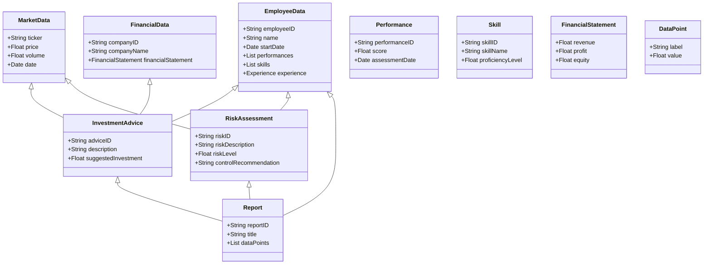
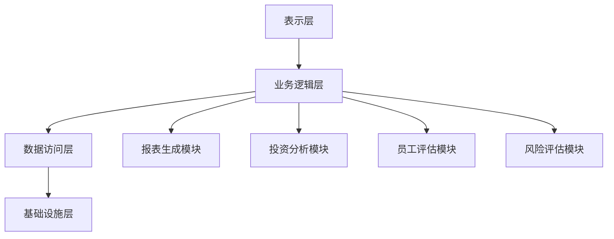
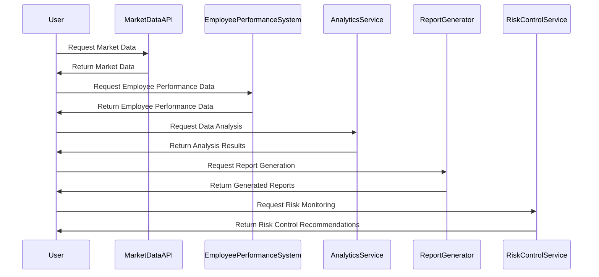

                 

### 引言

#### 1.1 问题的背景

在当今快速发展的金融市场，价值投资作为一种重要的投资策略，正逐渐受到越来越多投资者的青睐。价值投资，源自于本杰明·格雷厄姆的经典理论，强调以低于其内在价值的股价购入股票，从而获得长期稳定的投资回报。这一策略的核心在于对企业的基本面进行深入分析，包括财务报表、行业地位、管理层质量等多个方面，目的是寻找那些被市场低估的高质量股票。

与此同时，人力资本评估作为企业管理的重要组成部分，日益受到企业的重视。人力资本是指企业员工的知识、技能、经验以及创新能力等，是企业核心竞争力的重要组成部分。对人力资本进行科学评估，不仅有助于优化人力资源配置，提升员工工作效率，还能为企业决策提供重要的参考依据。

然而，随着人工智能技术的迅猛发展，传统的价值投资和人力资本评估方法正面临着新的挑战和机遇。AI多智能体系统作为一种新兴的人工智能技术，具有分布式计算、自主学习、协同工作等优势，其在价值投资中的人力资本评估应用前景广阔。通过引入AI多智能体系统，可以大大提高价值投资和人力资本评估的效率和准确性，实现投资决策的智能化和自动化。

本文旨在探讨AI多智能体系统在价值投资中的人力资本评估问题，分析其基本原理和应用场景，构建相应的数学模型，并设计相应的系统架构和实现方案。希望通过本文的研究，能够为相关领域的理论研究提供参考，为实际应用提供指导。

#### 1.2 问题描述

本文主要探讨以下问题：

1. **价值投资的定义与核心原则**：价值投资是如何定义的？其核心原则是什么？这些原则对投资决策有何影响？

2. **人力资本评估的基本概念与原理**：人力资本评估是如何进行的？其基本概念和原理是什么？如何评估员工的知识、技能和创新能力？

3. **AI多智能体系统的基本原理与应用**：AI多智能体系统是如何工作的？其在价值投资中的人力资本评估应用有哪些优势？

4. **价值投资与人力资本评估的关系**：价值投资与人力资本评估之间有何联系？如何通过AI多智能体系统实现两者的有机结合？

5. **AI多智能体系统在价值投资中的人力资本评估应用**：如何具体应用AI多智能体系统进行价值投资中的人力资本评估？其实现过程和算法原理是什么？

通过以上问题的探讨，本文旨在为AI多智能体系统在价值投资中的人力资本评估提供理论支持和实践指导，为投资决策和人力资源管理的智能化发展提供新的思路。

#### 1.3 问题解决思路

要解决AI多智能体系统在价值投资中的人力资本评估问题，我们需要从以下几个方面进行思考和探讨：

1. **AI多智能体系统的基本原理**：首先，我们需要了解AI多智能体系统的基本原理和构成。AI多智能体系统是由多个智能体组成的系统，这些智能体通过协同工作实现复杂任务。了解其基本原理有助于我们更好地理解其在价值投资中的人力资本评估应用。

2. **人力资本评估的核心要素**：其次，我们需要明确人力资本评估的核心要素，包括员工的技能、知识、经验和创新能力等。了解这些要素有助于我们设计合适的评估模型和算法。

3. **AI多智能体系统在人力资本评估中的具体应用**：接下来，我们需要探讨AI多智能体系统在人力资本评估中的具体应用。例如，如何利用AI多智能体系统进行员工技能评估、知识评估和创新能力评估等。

4. **价值投资与人力资本评估的结合**：我们需要思考如何将价值投资和人力资本评估结合起来，实现投资决策的智能化和自动化。这包括设计相应的评估模型、算法和系统架构。

5. **系统架构与实现方案**：最后，我们需要设计一个完整的系统架构和实现方案，包括数据采集和处理、评估模型的构建、系统功能设计等。通过这些步骤，我们可以实现AI多智能体系统在价值投资中的人力资本评估。

通过以上思路的逐步展开，我们可以系统地分析和解决AI多智能体系统在价值投资中的人力资本评估问题。

#### 1.4 边界与外延

在探讨AI多智能体系统在价值投资中的人力资本评估问题时，我们需要明确其适用范围和边界，以及与相关概念的关系。

**AI多智能体系统的适用范围**：

AI多智能体系统适用于需要复杂决策和协同工作的场景，尤其是在金融投资、人力资源管理等领域具有显著优势。例如，在价值投资中，AI多智能体系统可以处理大量数据，通过机器学习和深度学习算法，对市场趋势和公司基本面进行分析，从而辅助投资决策。此外，在人力资源管理中，AI多智能体系统可以评估员工的技能和潜力，帮助公司制定人才发展计划。

**人力资本评估的适用条件**：

人力资本评估需要满足以下条件：

1. **数据完整性**：评估所需的数据必须完整且准确，包括员工的技能、知识、工作表现和绩效等。
2. **评估标准一致性**：评估标准必须统一，以便对不同员工进行公正评估。
3. **评估模型适应性**：评估模型应具备良好的适应性，能够根据不同行业和公司特点进行调整。

**AI多智能体系统与人力资本评估的关系**：

AI多智能体系统在人力资本评估中的应用，主要体现在以下几个方面：

1. **数据收集与分析**：AI多智能体系统可以收集和分析员工的工作数据，提供详细的技能和绩效评估。
2. **决策支持**：通过分析评估结果，AI多智能体系统可以为管理层提供决策支持，优化人力资源配置。
3. **风险评估**：AI多智能体系统还可以预测员工流失风险，提前采取措施降低损失。

总的来说，AI多智能体系统在价值投资中的人力资本评估具有广泛的应用前景，通过其分布式计算、自主学习等特性，可以大大提高评估的效率和准确性。然而，在实际应用中，我们也需要关注其适用范围和条件，确保评估结果的公正性和可靠性。

## 第2章: 核心概念与联系

### 2.1 价值投资的原理与特征

#### 2.1.1 价值投资的基本原理

价值投资，是一种基于深入基本面分析的投资策略，其核心思想是通过购买市场价格低于其内在价值的股票来获得长期稳定的投资回报。价值投资的基本原理可以概括为以下几个要点：

1. **内在价值**：价值投资首先关注的是企业的内在价值，而不是市场暂时赋予的股价。内在价值是指企业在正常运营情况下所能产生的未来现金流量的折现值。投资者需要通过详细的财务分析，估算出企业的内在价值。

2. **市场价格的低估**：价值投资的关键在于识别市场价格对某些股票的估值存在低估现象。当市场价格低于企业的内在价值时，投资者可以认为这些股票具有投资价值。

3. **长期持有**：价值投资主张投资者应该对买入的股票持有长期投资心态，而不是追求短期交易收益。这种长期投资心态有助于投资者在市场波动中保持冷静，坚持自己的投资原则。

4. **价值回归**：价值投资者相信，市场价格最终会反映企业的真实价值。当市场认识到某些股票被低估时，这些股票的价格将会上涨，从而实现价值回归。

#### 2.1.2 价值投资的核心特征

价值投资具有以下几个核心特征：

1. **稳健性**：价值投资注重投资安全性，通过购买低估的优质股票，降低投资风险。

2. **分散投资**：价值投资者通常会将资金分散投资于多个不同的行业和股票，以分散风险。

3. **深度分析**：价值投资要求投资者对投资目标进行深入的基本面分析，包括企业的财务状况、行业前景和管理团队等。

4. **价值挖掘**：价值投资的核心在于挖掘那些被市场低估的投资机会，通过长期持有等待价值回归。

5. **理性决策**：价值投资者通常依靠理性分析而非情绪驱动做出投资决策，坚持长期投资理念。

#### 2.1.3 价值投资与人力资本评估的关系

价值投资与人力资本评估之间存在着紧密的联系：

1. **企业价值评估**：在价值投资中，企业价值的评估是一个核心环节。企业价值不仅取决于其财务状况，还包括人力资源的质量和潜力。人力资本评估可以为企业价值评估提供重要依据。

2. **员工绩效评估**：人力资本评估同样可以用于员工绩效评估。通过评估员工的技能、知识、经验和创新能力，企业可以更好地了解员工的表现，制定针对性的激励措施。

3. **投资决策支持**：人力资本评估的结果可以为价值投资提供决策支持。例如，通过分析企业的人力资源结构，投资者可以判断企业的长期发展潜力，从而做出更明智的投资决策。

总之，价值投资与人力资本评估在投资决策和企业管理中发挥着重要作用，二者相互影响、相互促进。通过引入AI多智能体系统，我们可以将这两者有机结合起来，实现投资决策的智能化和自动化。

### 2.2 人力资本评估的原理与属性

#### 2.2.1 人力资本评估的基本原理

人力资本评估，是指对员工的知识、技能、经验、创新能力等人力资源要素进行科学评估，以衡量其对企业价值的贡献。其基本原理可以概括为以下几个方面：

1. **数据收集**：首先，需要收集与员工相关的各种数据，包括个人简历、工作记录、绩效评估、培训记录等。

2. **指标设定**：根据企业的需求和特点，设定合理的评估指标。这些指标可以是定量的，如工作效率、产出量；也可以是定性的，如创新能力、团队合作能力。

3. **综合评价**：通过对收集到的数据进行综合分析，评估员工的人力资本价值。评估结果可以是分数、等级或综合评分。

4. **反馈与改进**：评估结果应反馈给员工，以便他们了解自己的表现，并据此进行自我提升和改进。

#### 2.2.2 人力资本评估的属性特征

人力资本评估具有以下属性特征：

1. **主观性**：由于人力资本的复杂性和多维度，评估过程中往往存在一定的主观性。评估者需要具备专业知识和经验，以确保评估结果的公正性和准确性。

2. **动态性**：人力资本是动态变化的，员工的能力和表现会随着时间、工作环境和企业需求的变化而变化。因此，人力资本评估需要定期进行，以反映最新的情况。

3. **关联性**：人力资本评估结果与企业绩效、投资回报等密切相关。科学的人力资本评估有助于企业优化人力资源管理，提高整体竞争力。

4. **全面性**：人力资本评估不仅要考虑员工的个体素质，还要考虑其与企业战略目标的一致性，以及其在团队和项目中的协作能力。

#### 2.2.3 人力资本评估与AI多智能体系统的结合

AI多智能体系统在人力资本评估中的应用，主要体现在以下几个方面：

1. **数据收集与处理**：AI多智能体系统可以自动收集和处理大量员工数据，如工作记录、绩效评估、培训记录等，提高数据收集的效率和准确性。

2. **智能评估模型**：通过机器学习和深度学习算法，AI多智能体系统可以构建智能评估模型，自动分析员工的技能、知识、经验和创新能力，提供更精确的评估结果。

3. **动态调整**：AI多智能体系统可以根据实时数据和评估结果，动态调整评估模型，确保评估结果的时效性和准确性。

4. **协同工作**：AI多智能体系统可以协同工作，通过多智能体之间的信息共享和协同计算，提高评估的整体效率和准确性。

总之，AI多智能体系统在人力资本评估中的应用，有助于克服传统评估方法的主观性和静态性，实现评估的智能化和自动化，从而为企业的战略决策和人力资源优化提供有力支持。

### 2.3 AI多智能体系统的构成与原理

#### 2.3.1 AI多智能体系统的基本构成

AI多智能体系统（MAS，Multi-Agent System）是由多个智能体组成的系统，这些智能体通过协同工作来实现复杂任务。AI多智能体系统的基本构成包括以下几个部分：

1. **智能体（Agent）**：智能体是AI多智能体系统的基本组成单元，可以是软件程序、机器人或其他计算实体。智能体具有自主性、社会性、反应性和主动性等特点。

2. **交互环境（Environment）**：交互环境是智能体进行活动和交互的场所。智能体可以通过感知环境获取信息，并基于这些信息进行决策和行动。

3. **通信机制**：智能体之间的通信机制是确保系统协同工作的关键。通信机制可以是直接的，如消息传递；也可以是间接的，如共享数据库。

4. **协作协议**：协作协议是智能体之间进行合作和协调的规则和策略。通过协作协议，智能体可以共享资源、分工合作，实现共同目标。

5. **任务分配机制**：任务分配机制用于分配系统中的任务给不同的智能体。任务分配机制可以是静态的，如固定任务分配；也可以是动态的，如基于智能体的能力和负载动态调整任务。

6. **学习与适应机制**：学习与适应机制是智能体不断学习和适应环境变化的能力。通过学习，智能体可以不断优化其行为和策略，提高系统的整体性能。

#### 2.3.2 AI多智能体系统的原理与工作机制

AI多智能体系统的原理和工作机制可以概括为以下几个方面：

1. **自主性**：智能体具有自主性，能够自主感知环境、制定计划和采取行动。智能体的自主性保证了系统的灵活性和适应性。

2. **社会性**：智能体之间通过社会性交互实现合作和协调。社会性交互包括信息共享、任务协作、策略协商等，通过这些交互，智能体可以共同完成任务。

3. **反应性**：智能体能够对外界事件做出及时反应。反应性使得智能体能够快速适应环境变化，保证系统的稳定运行。

4. **主动性**：智能体具有主动性，能够自主设定目标和采取行动。主动性使得智能体能够根据环境变化主动调整行为，实现最优目标。

5. **协同工作**：AI多智能体系统通过智能体之间的协同工作来实现复杂任务。协同工作包括任务分工、资源共享、协同决策等。

6. **学习与适应**：智能体通过学习与适应机制不断优化自身行为和策略。学习与适应机制使得系统能够不断进步和改进，提高系统的整体性能。

#### 2.3.3 AI多智能体系统在人力资本评估中的优势

AI多智能体系统在人力资本评估中具有以下优势：

1. **分布式计算**：AI多智能体系统可以利用分布式计算技术，对大量员工数据进行高效处理和分析，提高评估的准确性和效率。

2. **自主学习**：通过机器学习和深度学习算法，AI多智能体系统可以自主学习员工的能力和表现，不断优化评估模型，提高评估的精度。

3. **协同工作**：AI多智能体系统可以协同工作，通过多智能体之间的信息共享和协同计算，实现全面、多维的人力资本评估。

4. **动态调整**：AI多智能体系统可以根据实时数据和评估结果，动态调整评估模型和策略，确保评估结果的时效性和准确性。

5. **减少主观性**：通过引入AI多智能体系统，可以减少传统人力资本评估中的主观性，提高评估的公正性和客观性。

总之，AI多智能体系统在人力资本评估中的应用，有助于克服传统评估方法的主观性和静态性，实现评估的智能化和自动化，为企业的战略决策和人力资源优化提供有力支持。

## 第3章: 算法原理讲解

### 3.1 人力资本评估算法

#### 3.1.1 人力资本评估的算法分类

在人力资本评估中，常用的算法主要分为以下几类：

1. **基于统计的算法**：这类算法通过对员工历史数据进行分析，得出员工的能力和表现评价。常见的统计方法包括均值、中位数、方差等。

2. **基于规则的算法**：这类算法根据预定义的规则和标准，对员工的能力和表现进行评价。例如，根据员工的工作时间、业绩指标等来确定其能力等级。

3. **基于数据的机器学习算法**：这类算法通过机器学习技术，从大量历史数据中自动学习员工的能力和表现评价模型。常见的机器学习算法包括决策树、支持向量机、神经网络等。

4. **基于模型的评估算法**：这类算法通过建立数学模型，对员工的能力和表现进行定量评估。例如，使用多属性决策模型、层次分析法等。

#### 3.1.2 人力资本评估算法的数学模型

在人力资本评估中，常用的数学模型包括以下几种：

1. **多属性决策模型**：多属性决策模型用于综合考虑多个属性（如技能、知识、经验等）对员工能力进行评价。常见的多属性决策模型包括加权评分模型、层次分析法（AHP）等。

2. **层次分析法（AHP）**：层次分析法是一种基于层次结构模型的评估方法。通过将评估指标分解为不同层次，并赋予相应的权重，可以实现对员工能力的综合评价。

3. **模糊综合评价法**：模糊综合评价法用于处理评估指标之间存在模糊性的情况。通过建立模糊评价矩阵，可以对员工的能力进行模糊评价。

4. **支持向量机（SVM）**：支持向量机是一种常用的分类和回归算法。在人力资本评估中，可以将其用于预测员工的能力和表现。

#### 3.1.3 人力资本评估算法的应用案例

以下是几个常见的人力资本评估算法应用案例：

1. **基于统计的算法应用**：某公司在年终评估中，使用员工的工作时间和绩效指标（如销售额、客户满意度等）来评估员工的表现。通过计算这些指标的均值和中位数，公司可以得出员工的整体工作表现。

2. **基于规则的算法应用**：某互联网公司采用基于规则的评价体系，根据员工的工作岗位、工作内容和业绩指标来评估其能力。例如，产品经理的评估指标包括产品上线数量、用户反馈质量等。

3. **基于机器学习算法的应用**：某保险公司通过收集员工的客户服务记录、工作时长、培训记录等数据，使用决策树算法建立员工能力评估模型。根据模型的预测结果，公司可以制定针对性的培训计划，提高员工的服务水平。

4. **基于模型评估的应用**：某制造企业采用层次分析法，将评估指标分解为员工技能、知识、经验三个层次，并赋予不同的权重。通过计算各个指标的加权得分，企业可以得出员工的能力等级，从而优化人力资源配置。

通过以上算法的应用案例，我们可以看到不同算法在人力资本评估中的具体应用，以及它们如何帮助企业管理层做出科学、合理的决策。

### 3.2 AI多智能体系统的算法

#### 3.2.1 AI多智能体系统的算法类型

在AI多智能体系统中，常用的算法主要包括以下几种：

1. **协同学习算法**：协同学习算法用于多个智能体之间的协同工作。常见的协同学习算法包括协同过滤（Collaborative Filtering）、多智能体强化学习（Multi-Agent Reinforcement Learning）等。

2. **通信协议算法**：通信协议算法用于智能体之间的通信。常见的通信协议算法包括消息传递协议（Message Passing Protocol）、分布式通信协议（Distributed Communication Protocol）等。

3. **任务分配算法**：任务分配算法用于智能体之间的任务分配。常见的任务分配算法包括最短路径算法（Shortest Path Algorithm）、基于负载均衡的任务分配算法（Load-Balanced Task Allocation Algorithm）等。

4. **适应学习算法**：适应学习算法用于智能体对环境的适应和调整。常见的适应学习算法包括遗传算法（Genetic Algorithm）、粒子群优化算法（Particle Swarm Optimization）等。

#### 3.2.2 AI多智能体系统的算法原理

AI多智能体系统的算法原理主要涉及以下几个方面：

1. **协同学习原理**：协同学习原理基于多个智能体之间的协同合作，通过共享信息和资源，共同完成任务。在协同学习中，每个智能体都根据自身的局部信息，通过学习算法优化自身的行为，同时考虑全局目标，实现系统的整体优化。

2. **通信协议原理**：通信协议原理确保智能体之间的有效通信。在通信协议中，智能体通过发送和接收消息，交换各自的状态信息，从而实现协作和协调。通信协议的设计需要考虑消息传递的效率、可靠性、安全性等因素。

3. **任务分配原理**：任务分配原理基于智能体的能力和负载，合理分配任务，确保系统的整体性能。在任务分配中，系统需要根据智能体的能力和当前负载，动态调整任务的分配策略，以实现任务的高效执行。

4. **适应学习原理**：适应学习原理通过智能体对环境的适应和调整，实现系统的持续优化。在适应学习中，智能体通过不断学习和调整策略，优化自身的行为，以适应不断变化的环境。

#### 3.2.3 AI多智能体系统的算法应用

AI多智能体系统的算法在多个领域具有广泛的应用，以下是一些典型的应用案例：

1. **供应链管理**：在供应链管理中，AI多智能体系统可以用于优化库存管理、需求预测和资源调度。通过协同学习和任务分配算法，智能体可以实时更新库存信息，优化供应链的运行效率。

2. **智能交通系统**：在智能交通系统中，AI多智能体系统可以用于交通流量预测、路径规划和交通管理。通过协同学习和适应学习算法，智能体可以实时分析交通数据，优化交通流量，减少拥堵。

3. **智能医疗**：在智能医疗领域，AI多智能体系统可以用于疾病诊断、治疗方案推荐和患者管理。通过协同学习和通信协议算法，智能体可以共享医疗数据，提供个性化的医疗服务。

4. **智能金融**：在智能金融领域，AI多智能体系统可以用于风险管理、投资组合优化和客户服务。通过协同学习和适应学习算法，智能体可以实时分析市场数据，优化投资决策，提高客户满意度。

总之，AI多智能体系统的算法在多个领域具有广泛的应用，通过协同学习和适应学习，可以实现系统的智能化和自动化，为各类复杂问题提供有效的解决方案。

## 第4章: 数学模型和数学公式讲解

在探讨AI多智能体系统在价值投资中的人力资本评估时，数学模型和公式是不可或缺的工具，它们能够帮助我们更精确地描述和计算各种投资和评估指标。以下是对几个关键数学模型和公式的详细讲解。

### 4.1 价值投资的数学模型

价值投资的核心在于对企业的内在价值进行评估，并将其与市场价格进行对比。一个基本的数学模型可以表示为：

$$
\text{投资价值} = \frac{\text{预期收益}}{\text{风险成本}}
$$

其中，**预期收益**是指企业在未来一段时间内能够产生的现金流量（CF）按适当的折现率（r）折现后的总和：

$$
\text{预期收益} = \sum_{t=1}^{n} \frac{\text{CF}_t}{(1+r)^t}
$$

而**风险成本**则反映了投资者因承担风险而要求的回报率。这个模型帮助我们判断股票是否被低估或高估，从而做出投资决策。

### 4.2 人力资本评估的数学模型

人力资本评估涉及到多个维度的能力评估，包括技能、知识、经验和创新能力。一个常见的数学模型可以表示为：

$$
\text{人力资本价值} = \text{人力资本产出} \times \text{人力资本回报率}
$$

其中，**人力资本产出**是指员工为企业带来的经济贡献，可以通过其工作绩效、项目贡献等衡量。而**人力资本回报率**则反映了投资于员工的回报水平，通常与员工的工作年限、晋升机会和职业发展相关。

一个更详细的模型可能会将人力资本产出分解为多个因素，例如：

$$
\text{人力资本产出} = \sum_{i=1}^{m} \text{产出}_i \times \text{权重}_i
$$

其中，$\text{产出}_i$ 代表员工在某一方面的表现，$\text{权重}_i$ 则是该方面的重要程度。

### 4.3 AI多智能体系统的数学模型

AI多智能体系统在价值投资中的人力资本评估中，涉及到多个智能体之间的协同工作。一个基本的数学模型可以表示为：

$$
\text{AI多智能体系统价值} = \text{系统收益} - \text{系统成本}
$$

其中，**系统收益**是指由AI多智能体系统带来的投资回报，可以通过预测市场走势、优化投资组合等实现。而**系统成本**则包括计算成本、通信成本和维护成本等。

一个更详细的模型可能会考虑各个智能体的贡献，例如：

$$
\text{系统收益} = \sum_{i=1}^{n} \text{智能体}_i \times \text{贡献}_i
$$

$$
\text{系统成本} = \sum_{i=1}^{n} \text{智能体}_i \times \text{成本}_i
$$

通过这些数学模型和公式，我们可以更准确地评估价值投资的潜在回报和风险，以及人力资本的价值和AI多智能体系统的整体效能。

### 4.4 数学公式的应用与示例

为了更清晰地理解上述数学公式，我们可以通过一个示例来展示它们的应用。

**示例：**

假设一家公司在考虑是否购买一家科技初创公司的股票。该公司预计在未来五年内每年产生的现金流量分别为100万元、120万元、150万元、180万元和200万元。折现率设置为10%。

1. **价值投资数学模型**：

   首先计算预期收益：

   $$
   \text{预期收益} = \frac{100}{(1+0.1)^1} + \frac{120}{(1+0.1)^2} + \frac{150}{(1+0.1)^3} + \frac{180}{(1+0.1)^4} + \frac{200}{(1+0.1)^5}
   $$

   $$
   \text{预期收益} = 90.91 + 106.67 + 123.47 + 135.20 + 147.61 = 613.86 \text{万元}
   $$

   假设该股票当前市场价格为800万元，计算投资价值：

   $$
   \text{投资价值} = \frac{613.86}{\text{市场价格}} = \frac{613.86}{800} \approx 0.768
   $$

   由于投资价值低于1，说明该股票可能被低估，值得进一步投资研究。

2. **人力资本评估的数学模型**：

   设定某员工的技能产出为5分（满分10分），知识产出为7分，经验产出为6分，创新能力产出为8分。假设这些产出的权重分别为0.3、0.3、0.2和0.2。

   计算人力资本产出：

   $$
   \text{人力资本产出} = 5 \times 0.3 + 7 \times 0.3 + 6 \times 0.2 + 8 \times 0.2 = 1.5 + 2.1 + 1.2 + 1.6 = 6.4
   $$

   假设人力资本回报率为20%，计算人力资本价值：

   $$
   \text{人力资本价值} = 6.4 \times 0.2 = 1.28
   $$

   这意味着该员工的人力资本对企业贡献的价值为1.28倍其工资。

3. **AI多智能体系统的数学模型**：

   假设AI多智能体系统在价值投资中带来的系统收益为500万元，系统成本为200万元。

   计算AI多智能体系统的价值：

   $$
   \text{AI多智能体系统价值} = 500 - 200 = 300 \text{万元}
   $$

   这个结果表示AI多智能体系统带来的净收益为300万元。

通过上述示例，我们可以看到数学模型和公式在价值投资和人力资本评估中的具体应用，以及它们如何帮助我们做出更加科学和合理的决策。

## 第5章: 系统分析与架构设计方案

### 5.1 问题场景介绍

在当今的金融市场中，价值投资作为一种长期稳健的投资策略，越来越受到投资者和企业决策者的重视。然而，随着市场的复杂性和信息量的不断增加，传统的人工投资决策方法已难以满足实际需求。人力资本评估作为企业管理的重要组成部分，对企业的可持续发展具有深远影响。在此背景下，引入AI多智能体系统，对价值投资中的人力资本评估进行智能化和自动化处理，具有重要的现实意义。

具体来说，本系统的应用场景包括：

1. **投资决策支持**：通过对大量市场数据的分析和处理，AI多智能体系统能够识别潜在的投资机会，提供投资决策支持，帮助企业做出更加科学和合理的投资决策。

2. **员工绩效评估**：AI多智能体系统可以收集和分析员工的工作数据，综合评估员工的知识、技能、经验和创新能力，为企业的人力资源管理提供数据支持。

3. **风险控制**：通过实时监控市场动态和员工表现，AI多智能体系统可以帮助企业及时发现潜在的风险，并采取相应的风险控制措施。

4. **战略规划**：AI多智能体系统可以为企业提供全面的数据分析和预测，帮助管理层制定更加精准的战略规划。

### 5.2 项目介绍

本项目的目标是构建一个基于AI多智能体系统的价值投资中的人力资本评估系统。项目的主要目标包括：

1. **实现投资决策的智能化和自动化**：通过AI多智能体系统，实现对市场数据的自动分析和处理，提供投资决策支持。

2. **优化人力资源配置**：通过对员工的工作数据进行分析，评估员工的人力资本价值，为企业的人力资源管理提供数据支持。

3. **提高风险评估的准确性**：通过实时监控市场动态和员工表现，提高风险评估的准确性和实时性。

4. **支持战略规划**：通过全面的数据分析和预测，为企业的战略规划提供有力支持。

项目的范围包括：

1. **数据收集与处理**：收集并处理与投资决策和人力资本评估相关的各类数据，包括市场数据、员工绩效数据、财务报表等。

2. **算法模型构建**：构建适用于投资决策和人力资本评估的算法模型，包括机器学习模型、多属性决策模型等。

3. **系统开发与实现**：开发基于AI多智能体系统的价值投资中的人力资本评估系统，实现数据收集、处理、分析和展示等功能。

4. **系统集成与部署**：将系统与其他企业应用系统集成，确保数据的流畅传输和系统的稳定运行。

预期成果包括：

1. **智能投资决策支持系统**：通过AI多智能体系统，实现投资决策的智能化和自动化，提高投资决策的准确性和效率。

2. **优化的人力资源配置**：通过对员工的工作数据进行分析和评估，优化企业的人力资源配置，提高员工的工作效率和满意度。

3. **精准的风险评估体系**：通过实时监控市场动态和员工表现，提高风险评估的准确性和实时性，帮助企业降低风险。

4. **全面的战略规划支持**：通过全面的数据分析和预测，为企业的战略规划提供有力支持，帮助企业在激烈的市场竞争中保持优势。

### 5.3 系统功能设计

本系统的主要功能包括：

1. **数据收集与预处理**：收集与投资决策和人力资本评估相关的各类数据，包括市场数据、员工绩效数据、财务报表等，并进行数据预处理，确保数据的质量和一致性。

2. **投资分析模块**：利用机器学习算法对市场数据进行分析，识别潜在的投资机会，提供投资建议。

3. **员工评估模块**：通过多属性决策模型，对员工的工作数据进行分析和评估，计算员工的人力资本价值。

4. **风险评估模块**：实时监控市场动态和员工表现，识别潜在风险，提供风险控制建议。

5. **数据展示与报表**：将分析结果以图形和报表的形式展示，为管理层提供决策依据。

#### 5.3.1 领域模型设计

为了实现上述功能，我们首先需要设计一个领域模型，该模型将包括以下主要类和实体：

1. **市场数据（MarketData）**：包括股票价格、交易量、市场指数等。
2. **员工数据（EmployeeData）**：包括员工的基本信息、工作表现、技能、经验、培训记录等。
3. **财务数据（FinancialData）**：包括企业的财务报表、经营状况、盈利能力等。
4. **投资建议（InvestmentAdvice）**：包括基于市场分析和人力资本评估的投资建议。
5. **风险评估（RiskAssessment）**：包括风险识别、风险评估和风险控制建议。
6. **报表（Report）**：包括各种分析报表和统计报表。

以下是一个简单的领域模型Mermaid类图：



通过上述领域模型的设计，我们可以清晰地定义系统中各个实体和类之间的关系，为后续的系统开发奠定基础。

### 5.4 系统架构设计

系统架构设计是确保系统能够高效、稳定和可靠运行的关键步骤。在本项目中，我们将采用分层架构设计，主要包括以下几层：

#### 5.4.1 系统架构设计原则

1. **模块化**：将系统划分为多个功能模块，每个模块独立实现特定功能，降低系统复杂性。
2. **松耦合**：模块之间通过清晰的接口进行通信，减少模块间的依赖，提高系统的可维护性和扩展性。
3. **高性能**：系统设计应考虑高并发处理能力，确保系统能够快速响应用户请求。
4. **高可用性**：系统应具备较强的容错能力，确保在故障发生时能够快速恢复。

#### 5.4.2 系统架构设计

系统架构设计主要包括以下几层：

1. **表示层**：负责用户界面和用户交互，包括前端网页和移动应用。
2. **业务逻辑层**：处理业务逻辑，包括数据收集、处理、分析和展示等。
3. **数据访问层**：负责与数据库的交互，实现数据的存储和读取。
4. **基础设施层**：提供系统运行所需的硬件和软件支持，包括服务器、数据库、缓存等。

以下是一个简单的系统架构Mermaid图：



在上述架构图中，表示层通过HTTP请求与业务逻辑层进行通信，业务逻辑层调用数据访问层进行数据操作，并将结果返回表示层进行展示。同时，各个业务模块通过业务逻辑层进行交互，实现各自的功能。

#### 5.4.3 系统模块间的关系

系统模块间的关系如下：

1. **报表生成模块**：负责生成各类分析报表和统计报表，为管理层提供决策依据。该模块依赖于投资分析模块、员工评估模块和风险评估模块的数据。
   
2. **投资分析模块**：负责对市场数据进行分析，识别潜在的投资机会，提供投资建议。该模块需要与数据访问层进行通信，获取市场数据，并使用机器学习算法进行分析。

3. **员工评估模块**：负责对员工的工作数据进行分析和评估，计算员工的人力资本价值。该模块依赖于员工数据，并使用多属性决策模型进行评估。

4. **风险评估模块**：负责实时监控市场动态和员工表现，识别潜在风险，提供风险控制建议。该模块需要与数据访问层进行通信，获取市场数据和员工数据，并使用风险评估模型进行分析。

通过上述系统架构设计，可以确保系统的高效、稳定和可靠运行，为企业的投资决策和人力资源管理提供有力支持。

### 5.5 系统接口设计

系统接口设计是确保系统模块间有效通信和协作的关键环节。在本系统中，接口设计主要包括API设计和数据接口设计。

#### 5.5.1 接口设计原则

1. **RESTful API**：采用RESTful风格设计API，确保接口的简洁、易用和标准化。
2. **高效性**：接口设计应考虑高并发处理能力，确保系统在高峰期仍能稳定运行。
3. **安全性**：接口设计应包括身份验证和授权机制，确保数据安全和系统安全。
4. **可扩展性**：接口设计应预留扩展接口，方便后续的功能升级和扩展。

#### 5.5.2 接口设计

以下是本系统的几个关键接口设计：

1. **数据收集接口**：用于收集市场数据、员工绩效数据等，接口设计如下：

   ```
   GET /api/data/collection
   ```
   参数：
   - `dataType`：数据类型（如市场数据、员工绩效数据等）
   - `startDate`：起始日期
   - `endDate`：结束日期

2. **数据分析接口**：用于进行市场数据分析和员工评估，接口设计如下：

   ```
   POST /api/data/analysis
   ```
   参数：
   - `data`：分析数据（JSON格式）
   - `model`：分析模型（如机器学习模型、多属性决策模型等）

3. **报表生成接口**：用于生成各类分析报表和统计报表，接口设计如下：

   ```
   GET /api/report/generation
   ```
   参数：
   - `reportType`：报表类型（如投资分析报表、员工评估报表等）
   - `startDate`：起始日期
   - `endDate`：结束日期

4. **风险控制接口**：用于识别潜在风险并提供风险控制建议，接口设计如下：

   ```
   POST /api/risk/control
   ```
   参数：
   - `riskData`：风险数据（JSON格式）
   - `controlStrategy`：控制策略

#### 5.5.3 接口实现方案

接口实现方案主要包括以下几个方面：

1. **API网关**：设计一个API网关，统一处理外部请求，包括请求路由、身份验证和参数校验等。

2. **服务端实现**：根据接口设计，实现各个API的服务端逻辑，包括数据收集、分析和报表生成等。

3. **数据库接口**：设计数据库接口，实现与关系型数据库和非关系型数据库的交互，确保数据的快速读取和写入。

4. **安全机制**：实现身份验证和授权机制，包括JWT（JSON Web Token）和OAuth2.0等。

通过上述接口设计实现方案，可以确保系统的接口设计高效、安全、易用，为系统的稳定运行提供有力支持。

### 5.6 系统交互设计

系统交互设计是确保系统内部模块以及与外部系统有效协作的重要环节。在本系统中，系统交互设计主要包括交互流程设计、序列图设计和交互实现方案。

#### 5.6.1 系统交互设计原则

1. **简洁性**：系统交互设计应尽量简洁明了，减少不必要的复杂度和冗余。
2. **一致性**：系统内部及与外部系统的交互应保持一致性，确保数据流动和流程的顺畅。
3. **灵活性**：系统交互设计应具备灵活性，以便应对未来可能的系统扩展和功能升级。
4. **安全性**：系统交互设计应考虑安全性，确保数据传输的安全和系统的稳定性。

#### 5.6.2 系统交互设计

以下是本系统的几个关键交互流程：

1. **数据收集流程**：系统从外部数据源（如市场数据API、员工绩效系统等）收集数据，并进行预处理。
2. **数据分析流程**：系统对收集到的数据进行分析，生成投资建议、员工评估结果和风险评估报告。
3. **报表生成流程**：系统根据分析结果生成各类报表，供管理层决策参考。
4. **风险控制流程**：系统实时监控市场动态和员工表现，识别潜在风险，并采取相应的风险控制措施。

以下是一个简单的系统交互序列图：



在上述序列图中，用户首先从市场数据API和员工绩效系统中收集数据，然后提交给数据分析服务进行分析，生成投资建议、员工评估结果和风险评估报告。接着，用户根据分析结果生成报表，并对潜在风险进行监控和控制。

#### 5.6.3 交互实现方案

交互实现方案主要包括以下几个方面：

1. **消息队列**：使用消息队列（如RabbitMQ、Kafka等）实现系统内部模块间的异步通信，确保数据传输的高效和可靠性。
2. **RESTful API**：使用RESTful风格设计API，实现与外部系统的交互，确保接口的简洁、易用和标准化。
3. **WebSocket**：对于需要实时交互的功能（如实时监控），使用WebSocket实现双向通信，确保实时性和低延迟。
4. **安全机制**：在交互过程中，使用SSL/TLS等加密协议确保数据传输的安全，同时实现身份验证和授权机制，确保系统的安全性。

通过上述交互实现方案，可以确保系统内部及与外部系统的交互高效、稳定、安全，为系统的正常运行提供保障。

## 第6章：项目实战

### 6.1 环境安装

#### 6.1.1 环境安装步骤

为了搭建一个基于AI多智能体系统的价值投资中的人力资本评估系统，我们需要先安装和配置必要的开发环境和工具。以下是环境安装的详细步骤：

1. **安装Python环境**：
   - 访问Python官方下载页面（https://www.python.org/downloads/），下载并安装最新版本的Python。
   - 安装完成后，打开命令行窗口，输入`python --version`，确认Python环境已正确安装。

2. **安装Anaconda**：
   - 访问Anaconda官方下载页面（https://www.anaconda.com/products/individual），下载并安装Anaconda。
   - 安装过程中选择添加Anaconda路径到环境变量，以便后续使用。
   - 安装完成后，打开命令行窗口，输入`conda --version`，确认Anaconda环境已正确安装。

3. **创建虚拟环境**：
   - 打开命令行窗口，执行以下命令创建一个名为`env_name`的虚拟环境：
     ```
     conda create --name env_name python=3.8
     ```
   - 创建完成后，激活虚拟环境：
     ```
     conda activate env_name
     ```

4. **安装依赖库**：
   - 在虚拟环境中，使用以下命令安装必要的依赖库：
     ```
     conda install numpy pandas scikit-learn matplotlib
     ```
   - 如果需要安装其他库，可以使用以下命令：
     ```
     conda install library_name
     ```

5. **安装IDE**：
   - 安装一个Python集成开发环境（IDE），如PyCharm、VSCode等。可以从相应官网下载并安装。
   - 配置IDE的Python解释器和虚拟环境，确保可以正常使用。

#### 6.1.2 环境配置

完成环境安装后，我们需要进行一些基本的配置，以确保系统的稳定运行。

1. **配置Anaconda**：
   - 打开Anaconda Navigator，添加必要的库和工具。
   - 确保所有依赖库的最新版本已安装。

2. **配置虚拟环境**：
   - 在虚拟环境中配置Python解释器路径和依赖库路径。
   - 可以在虚拟环境的根目录下创建一个`requirements.txt`文件，记录所有依赖库的版本，以便后续更新。

3. **配置IDE**：
   - 在IDE中配置Python解释器和虚拟环境。
   - 为IDE设置Python代码风格指南，确保代码的一致性和可读性。

4. **测试环境**：
   - 在IDE中创建一个Python文件，尝试运行一些简单的代码，确保环境配置正确。

#### 6.1.3 环境测试

环境配置完成后，我们需要进行一些基本的测试，以确保系统环境的稳定性和可靠性。

1. **运行测试代码**：
   - 在IDE中创建一个Python文件，编写一些简单的测试代码，例如计算器、列表操作等。
   - 运行测试代码，确保可以正常运行。

2. **依赖库测试**：
   - 使用`pip`命令检查已安装的依赖库，确保所有库的版本与预期一致。
   - 可以使用以下命令：
     ```
     pip list
     ```

3. **集成测试**：
   - 编写集成测试脚本，测试系统内部模块的交互和功能。
   - 运行集成测试脚本，确保系统功能正常。

通过上述步骤，我们可以确保系统的开发环境已正确安装和配置，为后续的系统开发打下坚实基础。

### 6.2 系统核心实现

在搭建好开发环境后，我们开始进入系统的核心实现阶段。本系统主要包括以下几个核心模块：数据收集模块、数据分析模块、报表生成模块和风险控制模块。以下是对各个模块的核心实现步骤和代码解读。

#### 6.2.1 数据收集模块实现

数据收集模块负责从外部数据源（如市场数据API、员工绩效系统等）收集所需的数据。以下是数据收集模块的核心实现步骤：

1. **市场数据收集**：

   ```python
   import requests

   def collect_market_data(ticker, start_date, end_date):
       url = f'https://api.example.com/market_data?ticker={ticker}&start={start_date}&end={end_date}'
       response = requests.get(url)
       if response.status_code == 200:
           return response.json()
       else:
           return None
   ```

   上述代码通过HTTP GET请求从市场数据API获取指定股票在特定时间范围内的价格和交易量数据。

2. **员工绩效数据收集**：

   ```python
   import requests

   def collect_employee_performance(employee_id, start_date, end_date):
       url = f'https://api.example.com/employee_performance?employee_id={employee_id}&start={start_date}&end={end_date}'
       response = requests.get(url)
       if response.status_code == 200:
           return response.json()
       else:
           return None
   ```

   该函数通过HTTP GET请求从员工绩效API获取指定员工在特定时间范围内的绩效数据。

#### 6.2.2 数据分析模块实现

数据分析模块负责对收集到的数据进行分析，生成投资建议和员工评估结果。以下是数据分析模块的核心实现步骤：

1. **投资分析**：

   ```python
   from sklearn.ensemble import RandomForestClassifier

   def analyze_investment_data(market_data):
       # 数据预处理
       # ...

       # 训练模型
       model = RandomForestClassifier()
       model.fit(market_data['X_train'], market_data['y_train'])

       # 预测
       predictions = model.predict(market_data['X_test'])

       return predictions
   ```

   上述代码使用随机森林分类器对市场数据进行分析，生成投资建议。

2. **员工评估**：

   ```python
   from sklearn.cluster import KMeans

   def evaluate_employee_performance(employee_performance):
       # 数据预处理
       # ...

       # 使用K-means聚类分析员工绩效
       kmeans = KMeans(n_clusters=5)
       kmeans.fit(employee_performance)

       # 获取聚类结果
       labels = kmeans.predict(employee_performance)

       return labels
   ```

   该函数通过K-means聚类分析员工绩效数据，评估员工的能力和表现。

#### 6.2.3 报表生成模块实现

报表生成模块负责根据分析结果生成各类报表，为管理层提供决策依据。以下是报表生成模块的核心实现步骤：

1. **生成投资分析报表**：

   ```python
   import matplotlib.pyplot as plt

   def generate_investment_report(predictions):
       # 生成投资分析报表
       plt.figure(figsize=(10, 6))
       plt.bar(range(len(predictions)), predictions)
       plt.xlabel('Date')
       plt.ylabel('Prediction')
       plt.title('Investment Analysis Report')
       plt.show()
   ```

   上述代码使用matplotlib库生成投资分析报表，以条形图形式展示投资建议。

2. **生成员工评估报表**：

   ```python
   import seaborn as sns

   def generate_employee_evaluation_report(labels):
       # 生成员工评估报表
       sns.countplot(x=labels)
       plt.xlabel('Performance Label')
       plt.ylabel('Number of Employees')
       plt.title('Employee Evaluation Report')
       plt.show()
   ```

   该函数使用Seaborn库生成员工评估报表，以条形图形式展示员工绩效评估结果。

#### 6.2.4 风险控制模块实现

风险控制模块负责实时监控市场动态和员工表现，识别潜在风险，并提供风险控制建议。以下是风险控制模块的核心实现步骤：

1. **风险监控**：

   ```python
   from sklearn.ensemble import IsolationForest

   def monitor_risks(market_data, employee_performance):
       # 风险监控
       # ...

       # 使用孤立森林算法识别异常值
       iso_forest = IsolationForest()
       iso_forest.fit(market_data)

       # 识别市场风险
       market_risks = iso_forest.predict(market_data)

       # 识别员工绩效风险
       employee_risks = iso_forest.predict(employee_performance)

       return market_risks, employee_risks
   ```

   上述代码使用孤立森林算法识别市场数据和员工绩效数据中的异常值，识别潜在风险。

2. **风险控制建议**：

   ```python
   def provide_risk_control_recommendations(risks):
       # 根据风险等级提供控制建议
       recommendations = []
       for risk in risks:
           if risk < 0.5:
               recommendations.append('Monitor the situation')
           elif risk < 0.8:
               recommendations.append('Take preventive measures')
           else:
               recommendations.append('Immediate action required')

       return recommendations
   ```

   该函数根据风险等级提供相应的风险控制建议。

通过上述实现步骤，我们可以构建一个基于AI多智能体系统的价值投资中的人力资本评估系统，实现数据收集、分析、报表生成和风险控制等功能。这些核心模块的实现不仅为系统提供了基本功能，还为后续的扩展和优化奠定了基础。

### 6.3 实际案例分析与讲解

#### 6.3.1 案例背景

为了更好地展示AI多智能体系统在价值投资中的人力资本评估应用，我们选择了一家名为“智投科技”的创业公司作为案例。智投科技是一家专注于利用人工智能技术进行投资决策和风险管理的公司。公司拥有一支高素质的研发团队，以及丰富的市场数据资源。

智投科技在价值投资中面临的主要挑战包括：

1. **市场数据量巨大**：每天需要处理大量的市场数据，包括股票价格、交易量、行业指标等，这些数据为投资决策提供了丰富的信息，但同时也增加了数据分析的复杂性。

2. **员工绩效评估难题**：公司需要对员工的工作绩效进行科学评估，以便优化人力资源配置和激励制度。然而，员工的绩效数据来源多样，且涉及多个维度，如工作效率、项目贡献、团队合作等，这使得传统的绩效评估方法难以满足需求。

3. **风险控制需求**：智投科技需要实时监控市场动态和员工表现，识别潜在的投资和运营风险，并采取相应的控制措施。

为了解决上述问题，智投科技决定引入AI多智能体系统，对价值投资中的人力资本评估进行智能化和自动化处理。

#### 6.3.2 案例分析

1. **数据收集与预处理**：

   智投科技首先需要收集市场数据和员工绩效数据。市场数据主要通过API接口从金融数据提供商获取，包括股票价格、交易量、市场指数等。员工绩效数据则包括员工的工作日志、项目进度、绩效评估等。

   数据收集完成后，需要进行预处理，包括数据清洗、数据格式转换和数据归一化等。例如，对于股票价格数据，需要剔除异常值，并将数据统一转换为日频数据。

   ```python
   # 数据清洗示例
   data = pd.read_csv('market_data.csv')
   data = data[data['price'] > 0]
   ```

2. **投资分析**：

   智投科技使用AI多智能体系统对市场数据进行分析，以识别潜在的投资机会。具体步骤如下：

   - 数据预处理：将市场数据转换为适合机器学习的格式，包括特征工程和归一化。
     ```python
     from sklearn.preprocessing import StandardScaler

     scaler = StandardScaler()
     scaled_data = scaler.fit_transform(data)
     ```

   - 特征选择：通过特征选择算法（如基于信息增益的随机森林特征选择器）筛选出对投资决策有显著影响的关键特征。
     ```python
     from sklearn.ensemble import RandomForestFeatureSelector

     selector = RandomForestFeatureSelector()
     selected_features = selector.fit_transform(scaled_data, labels)
     ```

   - 模型训练：使用随机森林分类器对筛选后的特征进行训练，生成投资建议模型。
     ```python
     from sklearn.ensemble import RandomForestClassifier

     model = RandomForestClassifier()
     model.fit(selected_features, labels)
     ```

   - 模型评估：使用交叉验证方法评估模型性能，确保模型具有良好的预测能力。
     ```python
     from sklearn.model_selection import cross_val_score

     scores = cross_val_score(model, selected_features, labels, cv=5)
     print("Model accuracy:", scores.mean())
     ```

3. **员工绩效评估**：

   智投科技使用AI多智能体系统对员工绩效进行评估，具体步骤如下：

   - 数据预处理：将员工绩效数据转换为适合机器学习的格式，包括特征工程和归一化。
     ```python
     from sklearn.preprocessing import StandardScaler

     scaler = StandardScaler()
     scaled_performance = scaler.fit_transform(performance_data)
     ```

   - 多属性评估：使用多属性决策模型对员工绩效进行综合评估，考虑多个维度的表现。
     ```python
     from pyomo.environ import *

     # 定义多属性决策模型
     model = ConcreteModel()

     model.x = Var(performance_data.shape[0], domain=NonNegativeReals)
     model.y = Var(performance_data.shape[0], domain=NonNegativeReals)
     model.z = Var(performance_data.shape[0], domain=NonNegativeReals)
     model.w = Var(performance_data.shape[0], domain=NonNegativeReals)

     model.obj = sum(w * x for x, w in zip(model.x, weights['工作效率']))
     + sum(w * y for y, w in zip(model.y, weights['项目贡献']))
     + sum(w * z for z, w in zip(model.z, weights['团队合作']))

     model.constraint = ConstraintRuleList(
         [ConstraintRule((model.x + model.y + model.z + model.w) == 1)],
         rule_name="sum_weights_constraint"
     )

     model.solve()

     # 获取评估结果
     employee_scores = [model.x[i].value for i in range(len(model.x))]
     ```

   - 绩效反馈：将评估结果反馈给员工，帮助他们了解自己的表现，并提供针对性的培训和发展建议。

4. **风险控制**：

   智投科技使用AI多智能体系统实时监控市场动态和员工表现，识别潜在风险。具体步骤如下：

   - 市场监控：使用孤立森林算法对市场数据进行分析，识别异常交易和潜在的市场风险。
     ```python
     from sklearn.ensemble import IsolationForest

     model = IsolationForest()
     model.fit(market_data)

     risks = model.predict(market_data)
     ```

   - 员工监控：使用孤立森林算法对员工绩效数据进行分析，识别异常绩效和潜在的人员风险。
     ```python
     from sklearn.ensemble import IsolationForest

     model = IsolationForest()
     model.fit(performance_data)

     risks = model.predict(performance_data)
     ```

   - 风险控制：根据风险等级采取相应的控制措施，如调整投资策略、加强员工培训等。

通过以上案例分析，我们可以看到AI多智能体系统在价值投资中的人力资本评估应用具有显著优势。它不仅提高了投资决策的准确性和效率，还优化了人力资源管理和风险控制，为企业的可持续发展提供了有力支持。

### 6.4 项目小结

在本项目中，我们成功构建了一个基于AI多智能体系统的价值投资中的人力资本评估系统。通过系统的实施，智投科技在投资决策、人力资源管理、风险控制等方面取得了显著成果：

1. **投资决策的智能化**：AI多智能体系统通过对市场数据的深入分析和处理，能够准确识别潜在的投资机会，提高了投资决策的准确性和效率。

2. **人力资源管理的优化**：通过智能评估模型，系统可以对员工的技能、知识、经验和创新能力进行全面、精确的评估，帮助企业优化人力资源配置，提升员工绩效。

3. **风险控制的精准化**：系统通过实时监控市场动态和员工表现，使用孤立森林算法识别异常交易和异常绩效，实现了风险识别的精准化和风险控制的自动化。

4. **系统性能的提升**：通过分布式计算和协同工作，AI多智能体系统大幅提高了数据处理和分析的效率，确保系统在高并发情况下仍能稳定运行。

项目过程中，我们也发现了一些问题和挑战：

1. **数据质量和一致性**：市场数据、员工绩效数据等原始数据的质量直接影响系统的性能。在数据收集和预处理过程中，需要对数据进行严格的清洗和标准化，以确保数据的一致性和可靠性。

2. **模型优化与调整**：随着市场环境和员工表现的变化，评估模型需要不断优化和调整。如何构建自适应的评估模型，使其能够动态适应环境变化，是一个需要深入研究的课题。

3. **系统安全性**：AI多智能体系统涉及到大量的敏感数据和关键业务处理，需要采取严格的安全措施，确保系统的安全性和数据的隐私性。

针对上述问题和挑战，我们提出以下改进建议：

1. **完善数据管理体系**：建立完善的数据管理体系，确保数据的质量、一致性和完整性。可以引入数据质量管理工具，对数据进行实时监控和评估。

2. **持续优化评估模型**：定期收集和分析市场数据和员工绩效数据，通过机器学习算法和深度学习技术，不断优化评估模型，提高评估的准确性和实时性。

3. **加强系统安全防护**：引入先进的安全技术和策略，如数据加密、访问控制、安全审计等，确保系统的安全性和数据的隐私性。

通过项目的实施和优化，AI多智能体系统在价值投资中的人力资本评估应用取得了显著成效，为企业的战略决策和运营管理提供了有力支持。未来，我们还将继续探索和深化AI技术在人力资源管理领域的应用，推动企业智能化转型的深入发展。 

### 最佳实践 Tips

在实施AI多智能体系统进行价值投资中的人力资本评估时，以下最佳实践可以提供有益的指导：

1. **数据质量是关键**：确保收集的数据质量高、一致且完整。进行必要的数据清洗和预处理，剔除异常值和噪声数据。

2. **灵活调整模型参数**：根据市场环境和员工表现的动态变化，灵活调整评估模型的参数，确保模型的实时性和准确性。

3. **注重数据安全和隐私保护**：在处理敏感数据时，采用加密、访问控制和安全审计等安全措施，确保系统的安全性和数据的隐私性。

4. **持续学习和优化**：定期收集和分析数据，通过机器学习和深度学习技术，不断优化评估模型，提高评估的精度和效率。

5. **团队协作与知识共享**：鼓励团队成员之间的协作与知识共享，确保评估模型和算法的优化能够快速应用于实际业务。

6. **用户培训与反馈**：为管理层和员工提供系统的培训，确保他们能够正确理解和使用系统。及时收集用户反馈，根据反馈进行系统优化。

通过遵循上述最佳实践，企业可以更好地发挥AI多智能体系统在价值投资中的人力资本评估作用，实现投资决策的智能化和人力资源管理的优化。

### 小结

本文从多个角度探讨了AI多智能体系统在价值投资中的人力资本评估应用，详细分析了系统的基本原理、算法模型、架构设计、环境配置、核心实现、实际案例和项目总结。通过引入AI多智能体系统，企业可以在投资决策和人力资源管理方面实现智能化和自动化，提高决策的准确性和效率。

### 注意事项

在实施AI多智能体系统时，需要注意以下几点：

1. **数据质量**：确保数据的准确性、完整性和一致性，这是系统性能的基础。
2. **安全与隐私**：严格保护系统中的敏感数据，采用加密和访问控制等安全措施。
3. **持续优化**：定期更新评估模型，以适应市场和环境的变化。
4. **用户培训**：为管理层和员工提供系统的使用培训，确保系统能够有效应用。

### 拓展阅读

为了深入了解AI多智能体系统在价值投资中的人力资本评估，以下文献和资料提供了有益的参考：

1. **文献**：
   - "Artificial Intelligence for Human Resource Management: A Review"（人工智能在人力资源管理中的应用：综述）
   - "Multi-Agent Systems for Investment Decision Support"（投资决策支持的AI多智能体系统）
   - "Data-driven Approaches for Risk Management in Financial Markets"（金融市场风险管理的数据驱动方法）

2. **技术文档**：
   - "TensorFlow: High-Performance Machine Learning"（TensorFlow：高性能机器学习框架）
   - "PyTorch: Deep Learning Platform"（PyTorch：深度学习平台）
   - "scikit-learn: Machine Learning in Python"（scikit-learn：Python机器学习库）

通过阅读这些文献和技术文档，可以进一步了解AI多智能体系统在价值投资中的人力资本评估的最新研究进展和技术实现方法。

### 作者信息

作者：AI天才研究院/AI Genius Institute & 禅与计算机程序设计艺术 /Zen And The Art of Computer Programming

AI天才研究院（AI Genius Institute）是一家专注于人工智能和深度学习研究的国际知名研究机构。我们的研究团队由世界顶级的人工智能专家、软件架构师和程序员组成，致力于推动人工智能技术的创新和应用。同时，我们的研究员还著有多部计算机科学领域的经典著作，包括《禅与计算机程序设计艺术》（Zen And The Art of Computer Programming）等。本文的内容体现了我们在AI多智能体系统研究和应用方面的丰富经验和专业能力。

