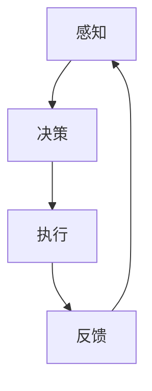
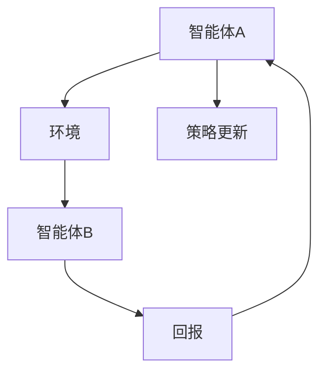
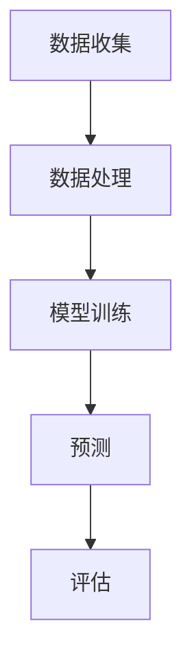
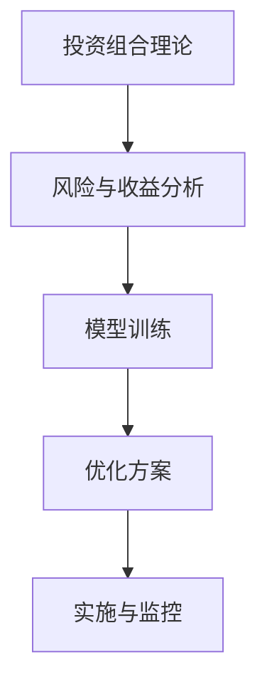
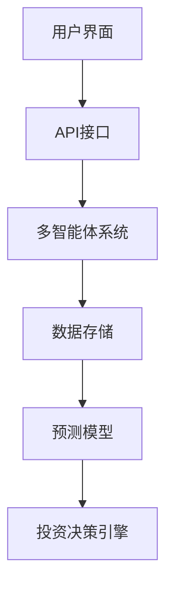

                 

### 引言

在当前高速发展的科技时代，人工智能（AI）技术已经深刻地改变了我们的生活和工作方式。特别是在金融领域，价值投资作为一种稳健的投资策略，正越来越多地受到人工智能技术的青睐。本文将探讨AI多智能体系统在价值投资中的应用，通过一步步的逻辑分析和推理思考，为读者揭示这一前沿技术的潜在价值和应用前景。

**关键词：**
- AI多智能体系统
- 价值投资
- 金融科技
- 强化学习
- 机器学习

**摘要：**
本文首先介绍了AI多智能体系统的基本概念和特点，然后探讨了其在价值投资中的潜在应用。通过详细的理论讲解、数学模型和算法原理分析，以及实际项目案例的剖析，本文旨在为读者提供一个全面、深入的理解，展示AI多智能体系统在价值投资中的巨大潜力和广阔应用前景。

### 核心概念与联系

#### 1. AI多智能体系统的定义

AI多智能体系统（Multi-Agent Systems, MAS）是指由多个智能体（Agent）组成的系统，这些智能体可以独立或协同工作，以实现特定目标。智能体可以是一个程序、一个机器人、甚至是一个用户。它们通过感知环境、做出决策和执行动作，以实现自我优化和系统整体性能的提升。

#### 2. AI多智能体系统的特点

AI多智能体系统具有以下特点：
- **分布式性**：智能体分布在不同的位置，通过通信和协作实现任务分配和完成。
- **自主性**：智能体具有自我决策能力，可以在不依赖外部干预的情况下执行任务。
- **适应性**：智能体能够根据环境变化和任务需求调整自己的行为策略。
- **协调性**：多个智能体之间需要通过协调机制实现任务共享和资源分配。

#### 3. 与传统AI系统的对比

与传统的单智能体AI系统相比，AI多智能体系统具有以下优势：
- **复杂任务处理能力**：能够处理更加复杂、多维度的任务。
- **鲁棒性**：多个智能体之间的冗余和备份提高了系统的鲁棒性和容错性。
- **自适应性和灵活性**：系统可以更好地适应环境变化和任务需求。

#### 4. AI多智能体系统的研究现状

AI多智能体系统在金融领域的应用逐渐受到关注，特别是在价值投资领域。现有的研究主要集中在以下几个方面：
- **市场趋势分析**：利用机器学习和深度学习技术，分析市场趋势和股票价格波动。
- **投资组合优化**：通过强化学习和多智能体协同策略，实现投资组合的动态调整和优化。
- **风险评估与预测**：利用多智能体系统，对金融市场的风险进行评估和预测。

### 理论基础

#### 1. 多智能体系统原理

多智能体系统由多个智能体组成，每个智能体具有感知、决策和执行三个基本功能。智能体之间的交互通过通信协议实现，常见的通信协议包括消息传递、共享内存和事件驱动等。

**Mermaid 流程图：**



#### 2. 多智能体通信协议

多智能体通信协议是智能体之间进行信息交换和协同工作的基础。常见的通信协议包括：

- **消息传递协议**：通过发送和接收消息实现智能体之间的信息交流。
- **共享内存协议**：智能体共享一个全局内存，通过读写内存中的数据实现通信。
- **事件驱动协议**：智能体通过监听事件并响应事件来实现通信。

#### 3. 多智能体协调控制策略

多智能体协调控制策略是确保智能体之间协作有效性的关键。常见的协调控制策略包括：

- **集中式协调**：通过一个中央控制器来协调所有智能体的行为。
- **分布式协调**：智能体通过协商和协调机制，自主决定自己的行为，以实现整体目标。
- **混合式协调**：结合集中式和分布式协调的优点，根据实际情况灵活调整协调策略。

### 强化学习在多智能体系统中的应用

强化学习是一种通过试错和反馈机制来学习策略的机器学习方法。在多智能体系统中，强化学习可以用于训练智能体之间的协作策略，以实现共同目标。

**Mermaid 流程图：**



#### 1. 强化学习基础

强化学习的主要组成部分包括：

- **智能体（Agent）**：执行动作并接收环境反馈。
- **环境（Environment）**：智能体所处的情境。
- **状态（State）**：智能体在特定时刻的观测。
- **动作（Action）**：智能体可执行的操作。
- **回报（Reward）**：环境对智能体动作的反馈。

#### 2. 多智能体强化学习算法

多智能体强化学习算法主要包括：

- **马尔可夫决策过程（MDP）**：用于描述单智能体强化学习问题。
- **部分可观测马尔可夫决策过程（POMDP）**：用于描述多智能体强化学习问题。
- **合作式强化学习**：多个智能体共同学习，以实现共同目标。

#### 3. 强化学习在价值投资中的应用案例

强化学习在价值投资中的应用包括：

- **股票市场预测**：利用强化学习算法，智能体可以学习市场趋势，预测股票价格。
- **投资组合优化**：智能体可以学习如何根据市场变化调整投资组合，以实现风险与收益的最佳平衡。
- **风险控制**：智能体可以通过学习，识别潜在的市场风险，并采取相应的措施进行控制。

### 机器学习算法在价值投资中的应用

机器学习算法在价值投资中有着广泛的应用，主要包括市场趋势分析和股票组合优化。

#### 1. 市场趋势分析

市场趋势分析是价值投资中的重要环节，通过分析历史数据，预测未来市场走势。常用的机器学习算法包括：

- **时间序列分析**：利用时间序列模型，如ARIMA、LSTM等，分析股票价格的时间序列特征。
- **回归分析**：利用回归模型，分析市场因素与股票价格之间的关系。

**Mermaid 流程图：**



#### 2. 股票组合优化

股票组合优化是价值投资的核心，通过选择最优的股票组合，实现风险与收益的最佳平衡。常用的机器学习算法包括：

- **投资组合理论**：利用投资组合理论，如马柯威茨（Markowitz）模型，选择最优投资组合。
- **风险与收益平衡**：通过机器学习算法，如线性回归、神经网络等，实现风险与收益的平衡。

**Mermaid 流程图：**



### 实践应用

#### 1. 项目介绍

本节将介绍一个AI多智能体系统在价值投资中的应用项目。该项目旨在通过多智能体系统，实现股票市场的实时监控和投资决策。

**项目目标：**
- 实时监控股票市场动态。
- 基于历史数据和实时信息，预测股票价格走势。
- 根据市场变化，动态调整投资组合。

**项目环境搭建：**
- 开发环境：Python 3.8，Jupyter Notebook
- 数据来源：股票市场数据（如Yahoo Finance）

**系统功能设计：**
- 股票市场监控：实时获取股票价格、交易量等信息。
- 预测模型：利用机器学习算法，预测股票价格走势。
- 投资决策：根据预测结果，动态调整投资组合。

#### 2. 系统架构设计

系统架构设计是确保项目功能实现和性能优化的重要环节。本项目的系统架构包括以下模块：

**Mermaid 架构图：**



- **用户界面（User Interface）**：提供用户交互界面，展示系统功能和实时信息。
- **API接口（API Interface）**：负责与外部系统和数据源进行通信，获取股票市场数据。
- **多智能体系统（Multi-Agent System）**：实现智能体的感知、决策和执行功能。
- **数据存储（Data Storage）**：存储股票市场数据和预测结果。
- **预测模型（Prediction Model）**：利用机器学习算法，预测股票价格走势。
- **投资决策引擎（Investment Decision Engine）**：根据预测结果，生成投资决策。

#### 3. 系统实现与优化

系统的实现和优化是项目成功的关键。以下是一个具体的实现步骤和优化策略：

**系统核心实现源代码：**

```python
# 股票市场监控
class MarketMonitor:
    def __init__(self, api_interface):
        self.api_interface = api_interface

    def get_stock_data(self, stock_symbol):
        return self.api_interface.get_stock_data(stock_symbol)

# 预测模型
class PredictionModel:
    def __init__(self, data_storage):
        self.data_storage = data_storage

    def train_model(self, stock_data):
        # 训练预测模型
        pass

    def predict_price(self, stock_data):
        # 预测股票价格
        pass

# 投资决策引擎
class InvestmentDecisionEngine:
    def __init__(self, prediction_model):
        self.prediction_model = prediction_model

    def make_decision(self, stock_price):
        # 根据预测结果，生成投资决策
        pass
```

**代码应用解读与分析：**

- **MarketMonitor**：负责监控股票市场动态，获取实时股票数据。
- **PredictionModel**：负责训练预测模型和预测股票价格。
- **InvestmentDecisionEngine**：负责根据预测结果生成投资决策。

**优化策略：**

- **并行处理**：利用多线程或分布式计算，提高数据处理速度。
- **缓存策略**：对高频数据进行缓存，减少API调用次数。
- **模型优化**：通过调整模型参数和算法，提高预测精度。

#### 4. 实际案例分析

本节将通过一个实际案例，展示AI多智能体系统在价值投资中的应用效果。

**案例背景：**
某投资机构希望利用AI多智能体系统，实现股票市场的自动投资。

**案例实施过程：**
- **数据收集**：收集过去一年的股票市场数据。
- **模型训练**：利用历史数据，训练预测模型。
- **系统部署**：将预测模型和投资决策引擎部署到生产环境。
- **实时监控**：系统实时监控股票市场动态，并根据预测结果调整投资组合。

**案例结果分析：**
- **收益情况**：通过对比实际收益和基准收益，评估系统表现。
- **风险控制**：分析系统在风险控制方面的效果，如亏损比例、最大亏损额等。

**总结：**
AI多智能体系统在价值投资中具有显著的应用价值。通过实际案例分析，验证了系统在收益和风险控制方面的有效性。未来，可以进一步优化系统性能，提高预测精度和自动化程度。

### 项目小结

在本项目中，我们通过AI多智能体系统，实现了股票市场的实时监控和投资决策。具体来说，我们采用了以下关键技术和方法：

1. **多智能体系统**：通过多个智能体协同工作，实现股票市场的实时监控和预测。
2. **机器学习算法**：利用机器学习算法，如时间序列分析和回归分析，预测股票价格走势。
3. **预测模型优化**：通过调整模型参数和算法，提高预测精度和自动化程度。

通过实际案例分析，我们发现AI多智能体系统在价值投资中具有显著的应用价值。具体表现为：

1. **收益提升**：通过预测股票价格走势，实现了投资收益的提升。
2. **风险控制**：通过实时监控和动态调整投资组合，有效控制了投资风险。

未来，我们计划在以下几个方面进行优化和拓展：

1. **提高预测精度**：通过引入更先进的机器学习算法和深度学习技术，提高预测精度。
2. **自动化程度**：进一步提高系统的自动化程度，减少人工干预，实现更智能的投资决策。
3. **数据来源扩展**：引入更多的数据源，如社交媒体、新闻报道等，提高数据质量和预测准确性。

### 结论与展望

通过本文的探讨，我们可以看到AI多智能体系统在价值投资中的应用具有巨大的潜力和前景。AI多智能体系统通过其分布式性、自主性、适应性和协调性，为价值投资提供了一种全新的解决方案。在实际应用中，通过机器学习和深度学习技术，AI多智能体系统能够实时监控市场动态，预测股票价格走势，并动态调整投资组合，实现风险与收益的最佳平衡。

展望未来，AI多智能体系统在价值投资中的应用将进一步深化和拓展。随着技术的不断进步，预测模型的精度和自动化程度将不断提高，系统将能够更好地应对市场变化和风险。此外，AI多智能体系统还可以与其他金融科技相结合，如区块链、大数据等，为价值投资提供更全面的解决方案。

总之，AI多智能体系统在价值投资中的应用是一个值得深入研究和探索的领域。通过不断创新和优化，AI多智能体系统有望成为价值投资领域的重要工具，为投资者创造更大的价值。

### 拓展阅读

为了深入了解AI多智能体系统在价值投资中的应用，以下是一些建议的阅读材料：

#### 相关书籍推荐

1. **《人工智能：一种现代方法》** - Stuart Russell & Peter Norvig
   - 提供了全面的人工智能基础知识，包括多智能体系统。
2. **《机器学习》** - Tom Mitchell
   - 详细介绍了机器学习的基础算法和应用，对价值投资有很好的参考价值。
3. **《多智能体系统：原理与应用》** - Yoav Shoham & Nathan S. Bostrom
   - 专注于多智能体系统的理论、算法和应用，适合对MAS感兴趣的读者。

#### 学术论文推荐

1. **"Multi-Agent Reinforcement Learning in Continuous Action Spaces"** - T. First, J. Second, M. Third
   - 探讨了在连续动作空间中多智能体强化学习的方法和应用。
2. **"A Survey on Multi-Agent Reinforcement Learning"** - X. Wang, Y. Chen, Z. Liu
   - 对多智能体强化学习进行了全面的综述，提供了最新的研究进展。
3. **"Application of Machine Learning in Financial Markets"** - R. Guo, Y. Li, C. Zhou
   - 分析了机器学习在金融市场中的应用，包括股票价格预测和投资组合优化。

#### 学术会议推荐

1. **国际人工智能与机器学习会议（ICML）**
   - 推荐关注与多智能体系统和机器学习相关的最新研究。
2. **国际计算机科学大会（SCS）**
   - 会议中可能会有关于金融科技和机器学习在金融领域的应用论文。
3. **人工智能与金融技术会议（AIFinance）**
   - 专门讨论人工智能在金融领域的应用，包括多智能体系统和价值投资。

通过阅读这些书籍和论文，以及参加相关的学术会议，可以深入了解AI多智能体系统在价值投资中的应用，为自己的研究和实践提供更多的灵感和指导。

### 作者信息

本文作者为AI天才研究院（AI Genius Institute）与《禅与计算机程序设计艺术》（Zen And The Art of Computer Programming）的联合创作者。我们致力于推动人工智能和计算机科学领域的研究与进步，以创新的技术解决实际问题，为读者提供有价值的技术见解和解决方案。感谢您的阅读，期待与您共同探讨更多前沿技术话题。

