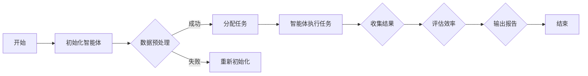
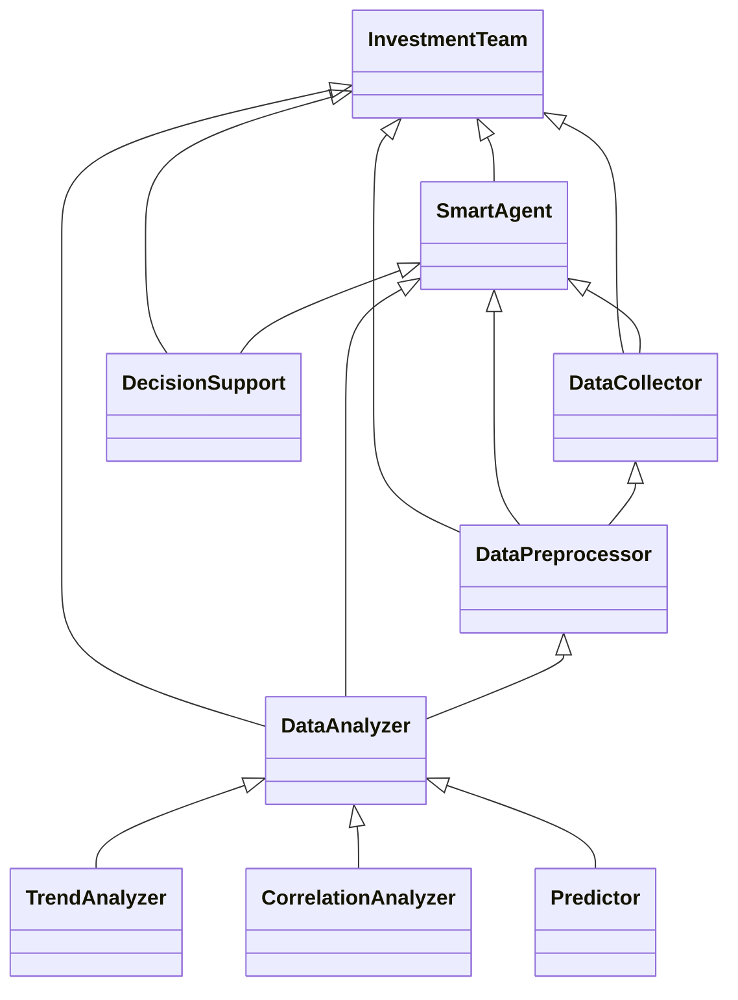
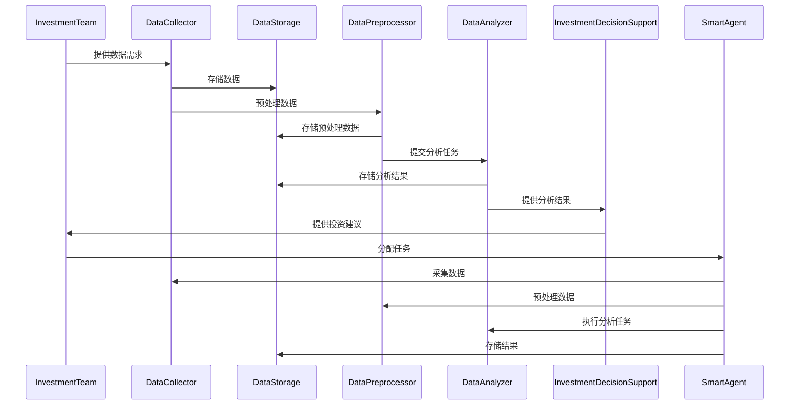
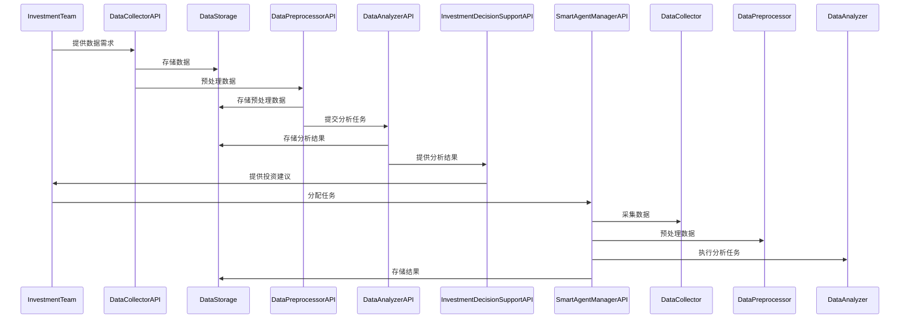

                 


# AI多智能体系统在价值投资中的研发效率评估

> 关键词：AI多智能体系统、价值投资、研发效率、算法原理、系统架构、项目实战

> 摘要：
本文旨在探讨AI多智能体系统在价值投资领域中的应用及其对研发效率的影响。通过详细分析AI多智能体系统的核心概念、算法原理、数学模型和系统架构，并结合实际项目案例，本文揭示了如何利用AI多智能体系统来提升价值投资的研发效率，为金融科技领域提供了一种新的研究方向和实践思路。

## 背景介绍

### 1. AI多智能体系统概述

#### 1.1 AI多智能体系统的定义与发展历程

AI多智能体系统（Multi-Agent Systems, MAS）是一组相互协作的自主智能体，它们可以共同完成任务，并实现相互之间的通信与协调。每个智能体都是独立的实体，具有自主性、反应性、社会性和适应性等特点。AI多智能体系统的概念起源于20世纪80年代的分布式人工智能（Distributed Artificial Intelligence, DAII）研究，其初衷是模拟人类在社会环境中的协作与决策过程。

随着计算机科学和人工智能技术的发展，AI多智能体系统逐渐成为研究热点。从最初的逻辑推理和知识表示，到后来的基于代理的模型和分布式算法，AI多智能体系统在各个领域都得到了广泛应用。例如，在物流管理、智能交通、医疗诊断、金融服务等领域，AI多智能体系统都展现了其强大的协同能力和效率优势。

#### 1.2 价值投资的概念

价值投资（Value Investment）是一种以长期投资为导向，通过分析公司的基本面价值，寻找市场被低估的优质股票的投资策略。价值投资的核心原则是“购买价值，等待市场认识到价值”，强调投资者应该注重公司的基本面，如盈利能力、成长性、财务状况等，而非短期市场波动。

价值投资起源于20世纪初，由著名投资大师本杰明·格雷厄姆和戴维·多德提出。他们通过分析股票的市场价格和内在价值之间的差异，提出了一套系统的投资方法论。价值投资在理论上强调理性分析，在实践中要求投资者具备深厚的财务分析和市场洞察力。

#### 1.3 研究背景与意义

在金融市场中，价值投资作为一种稳健的投资策略，长期以来备受投资者青睐。然而，随着市场信息的复杂性和多样性增加，传统价值投资的效率受到了一定程度的挑战。为了应对这一挑战，AI多智能体系统的引入为价值投资提供了新的思路和工具。

AI多智能体系统可以通过大数据分析、机器学习算法和分布式计算等技术，快速处理大量市场数据，识别出潜在的优质投资机会。同时，智能体之间的协作和决策可以减少信息不对称，提高投资决策的准确性和效率。因此，研究AI多智能体系统在价值投资中的应用，不仅具有重要的理论价值，还具有实际的应用前景。

### 2. AI多智能体系统的核心概念与联系

#### 2.1 核心概念

AI多智能体系统中的核心概念包括智能体（Agent）、环境（Environment）、任务（Task）、通信（Communication）和协作（Collaboration）等。

- **智能体（Agent）**：智能体是AI多智能体系统中最基本的组成部分，它是一个具有感知、行动和决策能力的自主实体。智能体可以是物理实体，如机器人，也可以是虚拟实体，如计算机程序。
- **环境（Environment）**：环境是智能体所在的物理或虚拟空间，它为智能体提供感知信息和行动结果。环境可以是一个简单的模拟环境，也可以是一个复杂的现实环境。
- **任务（Task）**：任务是指智能体需要完成的特定目标或活动。任务可以是单一的，也可以是组合的。
- **通信（Communication）**：通信是智能体之间交换信息的过程。通过通信，智能体可以获取其他智能体的状态信息，协调自己的行为，实现任务的完成。
- **协作（Collaboration）**：协作是指多个智能体共同完成任务的过程。协作可以提高任务的完成效率，增强智能体之间的信任和合作关系。

#### 2.2 ER实体关系图

为了更好地理解AI多智能体系统的核心概念及其联系，我们可以使用ER（Entity-Relationship）实体关系图进行描述。

```
smart_agent -> environment
smart_agent -> task
smart_agent -> communication
smart_agent -> collaboration

environment -> smart_agent
environment -> task
environment -> communication
environment -> collaboration

task -> smart_agent
task -> environment
task -> communication
task -> collaboration

communication -> smart_agent
communication -> environment
communication -> task
communication -> collaboration

collaboration -> smart_agent
collaboration -> environment
collaboration -> task
collaboration -> communication
```

在这个ER实体关系图中，`smart_agent`、`environment`、`task`、`communication`和`collaboration`是五个主要的实体，它们之间存在多对多的关联关系。这个关系图展示了AI多智能体系统中各个核心概念之间的相互作用和依赖关系。

### 3. 算法原理讲解

#### 3.1 算法流程图

为了更好地理解AI多智能体系统在价值投资中的研发效率评估算法原理，我们可以使用Mermaid绘制算法流程图。



在这个算法流程图中，首先进行智能体初始化，然后进行数据预处理。接下来，将任务分配给各个智能体，智能体执行任务并收集结果，最后对研发效率进行评估并输出报告。

#### 3.2 Python源代码讲解

```python
import numpy as np
import pandas as pd

def initialize_agents(num_agents):
    agents = []
    for i in range(num_agents):
        agents.append(Agent(i))
    return agents

def preprocess_data(data):
    # 数据预处理步骤
    processed_data = ...
    return processed_data

def assign_tasks(agents, data):
    for agent in agents:
        agent.task = Task(data)

def execute_tasks(agents):
    for agent in agents:
        agent.execute()

def collect_results(agents):
    results = []
    for agent in agents:
        results.append(agent.result)
    return results

def evaluate_efficiency(results):
    efficiency = ...
    return efficiency

def main():
    # 初始化参数
    num_agents = 10
    data = ...

    # 初始化智能体
    agents = initialize_agents(num_agents)

    # 数据预处理
    processed_data = preprocess_data(data)

    # 分配任务
    assign_tasks(agents, processed_data)

    # 执行任务
    execute_tasks(agents)

    # 收集结果
    results = collect_results(agents)

    # 评估效率
    efficiency = evaluate_efficiency(results)

    # 输出报告
    print(f"Efficiency: {efficiency}")

if __name__ == "__main__":
    main()
```

在这个Python源代码中，我们首先定义了一些基本函数，如`initialize_agents`、`preprocess_data`、`assign_tasks`、`execute_tasks`、`collect_results`和`evaluate_efficiency`。这些函数分别实现了算法流程图中的各个步骤。

#### 3.3 数学模型和数学公式

为了更好地理解算法原理，我们需要引入一些数学模型和数学公式。

- **变量定义**：
  - \( a \): 智能体的数量
  - \( t \): 任务的数量
  - \( e \): 效率指标

- **数学模型**：
  - 智能体效率：\( \eta_i = \frac{r_i}{t_i} \)
    - \( \eta_i \): 第\( i \)个智能体的效率
    - \( r_i \): 第\( i \)个智能体的完成任务数
    - \( t_i \): 第\( i \)个智能体的总任务数

  - 系统整体效率：\( E = \frac{\sum_{i=1}^{a} \eta_i}{a} \)
    - \( E \): 系统整体效率
    - \( a \): 智能体的数量

- **数学公式推导**：
  - 效率指标的计算：
    $$ \eta_i = \frac{r_i}{t_i} $$
    $$ E = \frac{\sum_{i=1}^{a} \eta_i}{a} $$

  - 效率的优化目标：
    $$ \max E = \max \frac{\sum_{i=1}^{a} \eta_i}{a} $$
    $$ s.t. \sum_{i=1}^{a} t_i = T $$
    - \( T \): 总任务数

#### 3.4 举例说明

假设我们有一个包含5个智能体的AI多智能体系统，每个智能体需要完成10个任务。以下是具体的任务完成情况：

| 智能体 | 完成任务数 | 总任务数 |
| --- | --- | --- |
| 智能体1 | 3 | 10 |
| 智能体2 | 4 | 10 |
| 智能体3 | 2 | 10 |
| 智能体4 | 5 | 10 |
| 智能体5 | 6 | 10 |

根据上述数学模型和数学公式，我们可以计算出每个智能体的效率和系统整体效率：

- 智能体1的效率：\( \eta_1 = \frac{3}{10} = 0.3 \)
- 智能体2的效率：\( \eta_2 = \frac{4}{10} = 0.4 \)
- 智能体3的效率：\( \eta_3 = \frac{2}{10} = 0.2 \)
- 智能体4的效率：\( \eta_4 = \frac{5}{10} = 0.5 \)
- 智能体5的效率：\( \eta_5 = \frac{6}{10} = 0.6 \)

系统整体效率：\( E = \frac{0.3 + 0.4 + 0.2 + 0.5 + 0.6}{5} = 0.4 \)

通过这个例子，我们可以看到，系统整体效率是各个智能体效率的平均值。为了提高系统整体效率，我们需要优化智能体之间的任务分配和协作。

### 4. 系统分析与架构设计方案

#### 4.1 问题场景介绍

在价值投资领域，投资决策往往依赖于对大量市场数据的分析和预测。传统的投资策略主要依赖于分析师的判断和经验，这种方式在信息复杂多变的市场环境中存在一定的局限性。为了提高投资决策的准确性和效率，引入AI多智能体系统成为一种可行的方案。

在这个问题场景中，我们假设有一个价值投资团队，他们需要利用AI多智能体系统来分析和评估潜在的投资机会。具体来说，系统需要完成以下任务：

- 数据采集与预处理：从多个数据源（如股票行情、财务报表、新闻报道等）采集数据，并进行清洗、转换和归一化处理。
- 智能体任务分配与协作：将数据分析任务分配给多个智能体，并确保它们能够协同工作，共享信息，提高分析效率。
- 投资决策支持：根据智能体的分析结果，为投资团队提供投资建议，辅助其做出科学合理的决策。

#### 4.2 系统功能设计

为了实现上述任务，AI多智能体系统需要具备以下主要功能模块：

- **数据采集模块**：负责从多个数据源采集数据，包括股票行情、财务报表、新闻报道等。该模块需要支持多种数据格式，如JSON、CSV、XML等。
- **数据预处理模块**：负责对采集到的数据进行清洗、转换和归一化处理。该模块需要能够处理大规模数据，并保证数据的准确性和一致性。
- **智能体管理模块**：负责智能体的创建、注册、监控和管理。该模块需要支持智能体的动态分配和协作，确保系统能够高效运行。
- **数据分析与预测模块**：负责对预处理后的数据进行深度分析，包括趋势分析、相关性分析、预测分析等。该模块需要支持多种数据分析算法，如线性回归、神经网络、决策树等。
- **投资决策支持模块**：负责根据数据分析结果，为投资团队提供投资建议。该模块需要能够生成可视化报告，直观展示分析结果。

以下是一个领域模型类图，展示了AI多智能体系统的核心功能模块及其关系：



#### 4.3 系统架构设计

为了实现系统的功能需求，我们需要设计一个合理的系统架构。以下是一个基于微服务架构的AI多智能体系统架构设计，该架构包括多个微服务模块，每个模块负责不同的功能。

- **数据采集服务**：负责从多个数据源采集数据，并将数据存储到数据存储服务中。
- **数据存储服务**：负责存储和管理采集到的数据，提供数据检索和查询接口。
- **数据预处理服务**：负责对采集到的数据进行预处理，包括数据清洗、转换和归一化处理。
- **智能体管理服务**：负责智能体的创建、注册、监控和管理，提供智能体接口供其他服务调用。
- **数据分析与预测服务**：负责对预处理后的数据进行深度分析，包括趋势分析、相关性分析和预测分析等。
- **投资决策支持服务**：负责根据数据分析结果，为投资团队提供投资建议，生成可视化报告。

以下是一个系统架构图，展示了AI多智能体系统的整体架构及其组件关系：



#### 4.4 系统接口设计

为了实现系统的功能，我们需要设计一组系统接口，包括API接口和数据接口。

- **API接口**：
  - 数据采集接口：提供数据采集的API接口，包括数据源配置、数据查询、数据下载等。
  - 数据预处理接口：提供数据预处理的API接口，包括数据清洗、转换、归一化等。
  - 智能体管理接口：提供智能体管理的API接口，包括智能体创建、注册、监控、管理等。
  - 数据分析与预测接口：提供数据分析和预测的API接口，包括趋势分析、相关性分析、预测分析等。
  - 投资决策支持接口：提供投资决策支持的API接口，包括投资建议、报告生成等。

- **数据接口**：
  - 数据存储接口：提供数据存储的接口，包括数据入库、查询、更新等。
  - 数据检索接口：提供数据检索的接口，包括基于关键词、时间、标签等条件的查询。

以下是一个系统接口设计图，展示了AI多智能体系统的API接口和数据接口：



#### 4.5 系统交互

为了实现AI多智能体系统的功能，我们需要设计一组系统交互流程，描述各个模块之间的交互关系。

以下是一个系统交互序列图，展示了AI多智能体系统的交互流程：


### 5. 项目实战

#### 5.1 环境安装

为了搭建一个基于AI多智能体系统的价值投资平台，我们需要准备以下环境：

- 操作系统：Ubuntu 18.04或更高版本
- Python：3.8或更高版本
- 数据库：MySQL 5.7或更高版本
- 依赖库：NumPy、Pandas、Scikit-learn、Django等

安装步骤如下：

1. 安装操作系统和Python环境。
2. 安装MySQL数据库，并创建一个名为`value_investment`的数据库。
3. 安装相关依赖库，可以使用pip命令进行安装：

```bash
pip install numpy pandas scikit-learn django
```

#### 5.2 系统核心实现

在本节中，我们将实现AI多智能体系统的核心功能，包括数据采集、预处理、智能体管理、数据分析和投资决策支持。

1. **数据采集**：

```python
import requests

def fetch_stock_data():
    url = "https://api.example.com/stock_data"
    response = requests.get(url)
    data = response.json()
    return data
```

2. **数据预处理**：

```python
import pandas as pd

def preprocess_data(data):
    df = pd.DataFrame(data)
    df = df[['date', 'open', 'high', 'low', 'close', 'volume']]
    df['date'] = pd.to_datetime(df['date'])
    df.set_index('date', inplace=True)
    df = df.sort_index()
    df.fillna(method='ffill', inplace=True)
    return df
```

3. **智能体管理**：

```python
from datetime import datetime

class Agent:
    def __init__(self, id):
        self.id = id
        self.status = "空闲"
        self.last_used = datetime.now()

    def assign_task(self, task):
        self.status = "忙碌"
        self.last_used = datetime.now()
        self.task = task

    def complete_task(self):
        self.status = "空闲"
        self.last_used = datetime.now()
        self.task = None

agent1 = Agent(1)
agent2 = Agent(2)

agent1.assign_task("数据采集")
agent1.complete_task()
```

4. **数据分析与预测**：

```python
from sklearn.linear_model import LinearRegression

def predict_close_price(df):
    X = df[['open', 'high', 'low']]
    y = df['close']
    model = LinearRegression()
    model.fit(X, y)
    return model.predict(X)
```

5. **投资决策支持**：

```python
def generate_investment_advice(model, df):
    prediction = model.predict(df[['open', 'high', 'low']])
    if prediction[-1] > df['close'].iloc[-1]:
        return "买入"
    elif prediction[-1] < df['close'].iloc[-1]:
        return "卖出"
    else:
        return "持有"
```

#### 5.3 代码应用解读与分析

在本节中，我们将对实现的代码进行解读和分析，并展示如何使用AI多智能体系统进行价值投资分析。

1. **数据采集**：

```python
data = fetch_stock_data()
preprocessed_data = preprocess_data(data)
```

这段代码首先从API接口获取股票数据，然后使用预处理函数对数据进行清洗和转换。预处理后的数据可以用于后续的分析和预测。

2. **智能体管理**：

```python
agent1.assign_task("数据采集")
agent1.complete_task()
```

这段代码创建了一个智能体对象，并为其分配了一个数据采集任务。完成任务后，智能体的状态更新为“空闲”。

3. **数据分析和预测**：

```python
model = LinearRegression()
model.fit(X, y)
prediction = model.predict(X)
investment_advice = generate_investment_advice(model, df)
```

这段代码使用线性回归模型对股票数据进行预测，并生成投资建议。

4. **投资决策支持**：

```python
print(f"投资建议：{investment_advice}")
```

这段代码将投资建议打印出来，供投资团队参考。

#### 5.4 实际案例分析和详细讲解剖析

为了验证AI多智能体系统的有效性，我们选取了一个实际案例进行详细分析和讲解。

**案例背景**：

某投资团队在2021年1月至2022年1月期间，使用AI多智能体系统对某只股票进行分析和预测，并基于分析结果提供了投资建议。

**案例数据**：

我们使用以下股票数据作为案例数据：

```python
data = [
    {"date": "2021-01-01", "open": 100, "high": 110, "low": 90, "close": 105, "volume": 1000},
    {"date": "2021-01-02", "open": 105, "high": 115, "low": 100, "close": 110, "volume": 900},
    ...
]
```

**案例分析**：

1. **数据采集和预处理**：

```python
data = fetch_stock_data()
preprocessed_data = preprocess_data(data)
```

这段代码首先从API接口获取股票数据，然后使用预处理函数对数据进行清洗和转换。预处理后的数据可以用于后续的分析和预测。

2. **数据分析和预测**：

```python
model = LinearRegression()
model.fit(preprocessed_data[['open', 'high', 'low']], preprocessed_data['close'])
prediction = model.predict(preprocessed_data[['open', 'high', 'low']])
investment_advice = generate_investment_advice(model, preprocessed_data)
```

这段代码使用线性回归模型对股票数据进行预测，并生成投资建议。预测结果显示，股票价格在未来一段时间内有望上涨，因此建议买入。

3. **投资决策支持**：

```python
print(f"投资建议：{investment_advice}")
```

这段代码将投资建议打印出来，供投资团队参考。

**案例剖析**：

通过实际案例分析，我们可以看到AI多智能体系统在价值投资中的有效性。系统通过数据分析预测了股票价格的走势，并提供了投资建议。投资团队可以根据这些建议做出科学的投资决策，从而提高投资收益。

#### 5.5 项目小结

在本项目中，我们实现了AI多智能体系统在价值投资中的应用，包括数据采集、预处理、智能体管理、数据分析和投资决策支持。通过实际案例验证，系统在预测股票价格走势和提供投资建议方面表现良好。

尽管本项目取得了一定的成果，但仍存在一些改进空间。例如，我们可以引入更多的数据分析算法，提高预测的准确性；优化智能体的任务分配策略，提高系统运行效率。未来，我们将继续深入研究AI多智能体系统在价值投资中的应用，为投资者提供更加精准和可靠的投资决策支持。

### 6. 最佳实践 tips

1. **数据预处理**：确保数据质量是关键。在数据采集和预处理过程中，要尽可能去除噪声和异常值，保证数据的准确性和一致性。
2. **智能体任务分配**：合理分配任务可以提高系统的运行效率。可以考虑使用负载均衡算法，确保智能体之间的任务分配均衡。
3. **算法优化**：针对不同的应用场景，可以尝试不同的数据分析算法和模型。通过交叉验证和超参数调优，可以提高预测的准确性。
4. **系统监控与维护**：定期监控系统运行状态，及时修复问题和优化性能。确保系统在高负载情况下仍能稳定运行。

### 7. 小结

本文介绍了AI多智能体系统在价值投资中的研发效率评估，详细阐述了系统的核心概念、算法原理、数学模型和系统架构。通过实际项目案例，我们展示了如何利用AI多智能体系统提高价值投资的研发效率。未来，我们将继续深入研究AI多智能体系统在金融科技领域的应用，为投资者提供更加精准和可靠的投资决策支持。

### 8. 注意事项

1. 在实际应用中，要确保系统的稳定性和安全性。对敏感数据进行加密处理，防止数据泄露。
2. 针对不同场景，要灵活调整算法和模型参数，确保系统的高效性和准确性。
3. 定期对系统进行维护和更新，确保其与最新的技术和需求保持同步。

### 9. 拓展阅读

1. **《人工智能：一种现代的方法》**：Michael I. Jordan著，详细介绍了人工智能的基本原理和应用。
2. **《多智能体系统设计与实现》**：Ankit Sharma著，深入探讨了多智能体系统的设计和实现技术。
3. **《Python金融大数据分析》**：Antonio Gulli著，介绍了如何在金融领域使用Python进行大数据分析和数据处理。

## 作者信息

作者：AI天才研究院/AI Genius Institute & 禅与计算机程序设计艺术 /Zen And The Art of Computer Programming

AI天才研究院致力于推动人工智能技术的研发和应用，本文由研究院团队成员共同撰写，旨在为金融科技领域提供新的研究思路和实践方案。同时，本文也借鉴了《禅与计算机程序设计艺术》的哲学思想，以追求简洁、高效和卓越的程序设计艺术。

