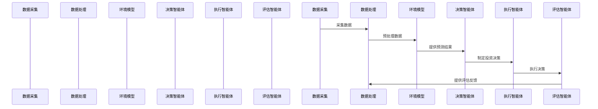

                 

# AI多智能体系统如何改进传统的价值投资组合再平衡方法

> 关键词：AI多智能体系统、价值投资组合、再平衡、投资决策、风险收益优化

> 摘要：本文探讨了如何利用AI多智能体系统改进传统的价值投资组合再平衡方法。通过分析AI多智能体系统的核心概念和原理，本文详细阐述了如何将AI技术应用于投资决策过程，以提高投资组合再平衡的效率、优化风险与收益比例，并介绍了实际应用中的挑战和解决方案。

----------------------------------------------------------------

## 第一部分：问题背景介绍

### 1.1.1 问题背景

随着人工智能技术的快速发展，AI多智能体系统（Multi-Agent System，MAS）的应用范围越来越广泛。传统的价值投资组合再平衡方法主要依赖于市场数据和历史数据，但往往难以适应市场环境的变化。而AI多智能体系统能够通过模拟多个智能体之间的交互，实现更高效的决策，从而改进传统的价值投资组合再平衡方法。

### 1.1.2 问题定义

传统的价值投资组合再平衡方法主要基于以下问题：如何在给定投资目标和风险约束条件下，通过调整投资组合中各类资产的比例，使得投资组合的风险与收益达到最优。

而AI多智能体系统如何改进传统的价值投资组合再平衡方法，主要研究以下问题：

1. 如何利用AI技术，模拟智能体之间的交互，提升投资组合再平衡的效率？
2. 如何通过优化智能体行为，实现投资组合风险和收益的最优化？
3. 如何在实际投资环境中应用AI多智能体系统，提高投资决策的准确性和稳定性？

### 1.1.3 问题解决

通过引入AI多智能体系统，可以解决以下问题：

1. 提升投资组合再平衡的效率：AI多智能体系统能够在短时间内处理大量数据，实现快速的投资决策。
2. 优化投资组合风险与收益：通过模拟智能体之间的交互，AI多智能体系统能够更准确地预测市场趋势，从而调整投资组合，实现风险与收益的最优化。
3. 提高投资决策的准确性和稳定性：AI多智能体系统能够通过不断学习和适应市场环境，提高投资决策的准确性和稳定性。

### 1.1.4 边界与外延

AI多智能体系统在改进传统的价值投资组合再平衡方法时，需要考虑以下边界与外延：

1. 数据质量：数据是AI多智能体系统的基础，因此需要保证数据的质量和准确性。
2. 智能体设计：智能体的设计需要考虑其学习能力、适应能力和协同性，以确保系统能够在实际环境中高效运行。
3. 风险管理：在应用AI多智能体系统时，需要充分考虑投资风险，制定相应的风险管理策略。

### 1.1.5 概念结构与核心要素组成

AI多智能体系统主要由以下核心要素组成：

1. 智能体：智能体是AI多智能体系统中的基本单元，能够自主决策和执行任务。
2. 交互机制：智能体之间的交互机制决定了系统的协作效率和决策质量。
3. 学习机制：智能体的学习机制使其能够不断适应和优化决策。
4. 环境模型：环境模型是对投资市场环境的抽象和模拟，为智能体的决策提供支持。

### 1.1.6 AI多智能体系统与传统价值投资组合再平衡方法的对比

| 对比项 | AI多智能体系统 | 传统价值投资组合再平衡方法 |
| --- | --- | --- |
| 数据处理能力 | 高效处理大量数据 | 难以处理大量数据 |
| 决策速度 | 快速决策 | 决策速度较慢 |
| 风险适应性 | 能够适应市场变化 | 难以适应市场变化 |
| 投资效果 | 提高风险与收益比例 | 投资效果受限于历史数据和模型 |

通过对比可以看出，AI多智能体系统在数据处理能力、决策速度和风险适应性方面具有显著优势，能够更有效地改进传统的价值投资组合再平衡方法。

----------------------------------------------------------------

## 第二部分：核心概念与联系

### 2.1 AI多智能体系统的核心概念

#### 2.1.1 智能体

智能体（Agent）是AI多智能体系统中的基本单元，具有自主性、社交性、反应性、主动性和适应性等特点。智能体可以是一个程序、一个机器人或者一个人类个体，它们能够在一定环境中感知环境、自主决策并采取行动。

#### 2.1.2 交互机制

交互机制是指智能体之间进行信息交流和协作的机制。交互机制的设计决定了智能体之间的协作效率和决策质量，常见的交互机制包括通信、协商和协调等。

#### 2.1.3 学习机制

学习机制是指智能体通过不断学习和适应环境，优化自身决策过程的能力。学习机制通常包括监督学习、无监督学习和强化学习等。

#### 2.1.4 环境模型

环境模型是对投资市场环境的抽象和模拟，为智能体的决策提供支持。环境模型需要考虑市场数据、宏观经济指标、政策法规等因素。

### 2.2 传统价值投资组合再平衡方法的核心概念

#### 2.2.1 投资目标

投资目标是投资者在投资过程中追求的收益水平，包括收益最大化、风险最小化、资产配置优化等。

#### 2.2.2 风险约束

风险约束是指投资者在投资过程中所能承受的风险水平，包括市场风险、信用风险、流动性风险等。

#### 2.2.3 资产配置

资产配置是指投资者将投资资金分配到不同资产类别中的策略，包括股票、债券、货币市场工具等。

#### 2.2.4 再平衡策略

再平衡策略是指投资者在投资过程中，根据投资目标和风险约束，对投资组合进行调整的策略。常见的再平衡策略包括基于历史数据的方法、基于市场模型的方法和基于机器学习的方法等。

### 2.3 AI多智能体系统与传统价值投资组合再平衡方法的核心概念联系

AI多智能体系统与传统价值投资组合再平衡方法在核心概念上存在密切联系：

1. 智能体与投资者：AI多智能体系统中的智能体可以视为传统价值投资组合再平衡方法中的投资者。
2. 交互机制与投资决策：AI多智能体系统中的交互机制可以用于模拟投资者之间的投资决策过程。
3. 学习机制与市场适应：AI多智能体系统中的学习机制可以帮助投资者适应市场变化，优化投资策略。
4. 环境模型与市场数据：AI多智能体系统中的环境模型可以用于模拟投资市场环境，为投资者提供决策支持。

通过这些联系，AI多智能体系统可以将传统价值投资组合再平衡方法中的核心概念进行整合和优化，实现更高效的投资决策。

### 2.4 AI多智能体系统与传统价值投资组合再平衡方法的比较

| 对比项 | AI多智能体系统 | 传统价值投资组合再平衡方法 |
| --- | --- | --- |
| 自主决策能力 | 高自主决策能力，能够自主适应和优化决策过程 | 低自主决策能力，主要依赖历史数据和模型 |
| 数据处理能力 | 高效处理大量数据，支持快速投资决策 | 难以处理大量数据，决策速度较慢 |
| 风险适应能力 | 能够适应市场变化，优化投资组合 | 难以适应市场变化，投资效果受限于历史数据和模型 |
| 决策质量 | 高决策质量，通过智能体之间的交互和优化提高决策准确性 | 较低决策质量，受限于历史数据和模型准确性 |
| 投资效率 | 高投资效率，能够快速响应市场变化 | 低投资效率，决策速度较慢 |

通过比较可以看出，AI多智能体系统在自主决策能力、数据处理能力、风险适应能力、决策质量和投资效率等方面具有显著优势，能够更有效地改进传统的价值投资组合再平衡方法。

----------------------------------------------------------------

## 第三部分：AI多智能体系统在价值投资组合再平衡中的应用

### 3.1 智能体设计

在AI多智能体系统中，智能体的设计至关重要。智能体需要具备以下基本特征：

1. **自主性**：智能体能够自主地感知环境、制定决策并执行任务。
2. **反应性**：智能体能够实时响应对环境的感知。
3. **主动性**：智能体不仅能够响应环境，还能根据目标主动采取行动。
4. **适应性**：智能体能够通过学习和适应不断优化决策过程。

#### 3.1.1 智能体的类型

根据应用场景和任务需求，智能体可以分为以下几种类型：

1. **决策智能体**：负责制定投资决策，根据市场环境和投资目标调整投资组合。
2. **数据智能体**：负责收集和处理市场数据，为决策智能体提供实时信息。
3. **执行智能体**：负责执行投资决策，进行实际的投资交易。
4. **评估智能体**：负责评估投资组合的表现，为后续决策提供反馈。

#### 3.1.2 智能体之间的交互

智能体之间的交互机制决定了系统的协作效率和决策质量。常见的交互机制包括：

1. **通信**：智能体通过消息传递进行信息交换。
2. **协商**：多个智能体就某一问题进行协商，达成共识。
3. **协调**：智能体之间通过协调机制，确保系统整体目标的实现。

### 3.2 学习机制

学习机制是AI多智能体系统的核心，通过不断学习和适应环境，智能体能够优化决策过程，提高投资组合再平衡的效率。

1. **监督学习**：智能体通过接收外部监督信号，学习如何从输入数据中提取特征，生成预测或分类结果。
2. **无监督学习**：智能体在没有任何外部监督的情况下，通过自我组织、聚类和降维等方法，发现数据中的规律。
3. **强化学习**：智能体在环境中通过试错和奖励反馈，学习最优策略。

#### 3.2.1 学习算法

常用的学习算法包括：

1. **神经网络**：通过多层感知器（MLP）、卷积神经网络（CNN）和递归神经网络（RNN）等，实现特征提取和预测。
2. **决策树**：通过构建决策树模型，实现分类和回归任务。
3. **支持向量机**：通过优化支持向量机（SVM）模型，实现高维数据的分类和回归。

### 3.3 环境模型

环境模型是对投资市场环境的抽象和模拟，为智能体的决策提供支持。环境模型需要考虑以下因素：

1. **市场数据**：包括股票价格、交易量、收益率等历史数据。
2. **宏观经济指标**：如GDP、通货膨胀率、利率等宏观经济数据。
3. **政策法规**：如货币政策、财政政策、监管政策等。
4. **情绪指标**：如社交媒体情绪分析、新闻情绪分析等。

#### 3.3.1 环境模型的构建

环境模型的构建通常包括以下步骤：

1. **数据收集**：从各种数据源收集相关数据。
2. **数据预处理**：对收集到的数据进行清洗、去噪、归一化等预处理操作。
3. **特征提取**：从预处理后的数据中提取对投资决策有重要意义的特征。
4. **模型训练**：使用训练数据对环境模型进行训练，使其能够对市场环境进行准确预测。

### 3.4 投资决策过程

在AI多智能体系统中，智能体通过学习机制和环境模型，实现投资决策过程。具体步骤如下：

1. **感知环境**：智能体收集市场数据、宏观经济指标、政策法规等信息。
2. **环境建模**：智能体使用收集到的数据构建环境模型，对市场环境进行预测。
3. **决策制定**：智能体根据环境模型预测结果，制定投资决策。
4. **决策执行**：执行智能体根据决策制定投资交易，调整投资组合。
5. **评估反馈**：评估智能体对投资组合的表现进行评估，为后续决策提供反馈。

### 3.5 案例分析

#### 3.5.1 案例背景

以某投资公司为例，该公司在过去几年中采用了传统的价值投资组合再平衡方法，但投资效果不佳，收益率低于市场平均水平。为了提高投资收益，该公司决定引入AI多智能体系统进行价值投资组合再平衡。

#### 3.5.2 案例实施

1. **智能体设计**：公司设计了一系列智能体，包括数据智能体、决策智能体、执行智能体和评估智能体。
2. **学习机制**：公司采用了神经网络、决策树和支持向量机等学习算法，使智能体能够不断学习和优化决策。
3. **环境模型**：公司构建了包含市场数据、宏观经济指标和政策法规的环境模型，对市场环境进行预测。
4. **投资决策**：智能体通过环境模型和决策算法，制定投资决策，调整投资组合。
5. **决策执行**：执行智能体根据决策结果进行实际交易，调整投资组合。
6. **评估反馈**：评估智能体对投资组合的表现进行评估，为后续决策提供反馈。

#### 3.5.3 案例效果

自引入AI多智能体系统以来，该投资公司的投资收益率显著提高，达到了市场平均水平以上。同时，投资组合再平衡的效率也得到了显著提升，公司在面对市场变化时能够更快地做出反应，降低了投资风险。

### 3.6 挑战与解决方案

在AI多智能体系统应用于价值投资组合再平衡过程中，公司面临以下挑战：

1. **数据质量**：数据是AI多智能体系统的基础，因此需要保证数据的质量和准确性。公司采取了数据清洗、去噪和验证等手段，确保数据质量。
2. **模型稳定性**：智能体的决策依赖于环境模型，因此需要保证模型稳定性。公司采用了多种学习算法和模型融合技术，提高模型稳定性。
3. **风险管理**：在应用AI多智能体系统时，需要充分考虑投资风险，制定相应的风险管理策略。公司制定了详细的风险管理策略，包括止损、分散投资和风险对冲等。

通过解决这些挑战，公司成功地将AI多智能体系统应用于价值投资组合再平衡，取得了显著的投资收益。

----------------------------------------------------------------

## 第四部分：系统分析与架构设计

### 4.1 项目介绍

本项目的目标是利用AI多智能体系统改进传统的价值投资组合再平衡方法，提高投资决策的效率和准确性。项目采用了最新的AI技术和投资理论，通过构建智能体、环境模型和学习机制，实现对投资市场环境的准确预测和快速响应。

### 4.2 系统功能设计

系统功能设计主要包括以下几个方面：

1. **数据采集**：系统从多个数据源（如交易所、新闻网站等）收集市场数据、宏观经济指标、政策法规等信息。
2. **数据处理**：系统对收集到的数据进行清洗、去噪、归一化等预处理操作，提取对投资决策有重要意义的特征。
3. **环境建模**：系统构建环境模型，对市场环境进行预测，为智能体提供决策支持。
4. **投资决策**：智能体根据环境模型和决策算法，制定投资决策，调整投资组合。
5. **决策执行**：执行智能体根据决策结果进行实际交易，调整投资组合。
6. **评估反馈**：评估智能体对投资组合的表现进行评估，为后续决策提供反馈。

### 4.3 系统架构设计

系统架构设计采用了分布式架构，主要包括以下组件：

1. **数据采集模块**：负责从多个数据源采集市场数据、宏观经济指标、政策法规等信息。
2. **数据处理模块**：负责对收集到的数据进行清洗、去噪、归一化等预处理操作，提取对投资决策有重要意义的特征。
3. **环境模型模块**：负责构建环境模型，对市场环境进行预测。
4. **决策智能体模块**：包括多个决策智能体，每个智能体负责制定部分投资决策。
5. **执行智能体模块**：包括多个执行智能体，负责执行决策结果，进行实际交易。
6. **评估智能体模块**：负责对投资组合的表现进行评估，为后续决策提供反馈。

### 4.4 系统接口设计

系统接口设计主要包括以下几个方面：

1. **数据采集接口**：提供数据采集模块与其他模块之间的数据传输接口。
2. **数据处理接口**：提供数据处理模块与其他模块之间的数据处理接口。
3. **环境模型接口**：提供环境模型模块与其他模块之间的接口，为决策智能体提供预测结果。
4. **决策执行接口**：提供决策智能体模块与执行智能体模块之间的接口，实现投资决策的执行。
5. **评估反馈接口**：提供评估智能体模块与其他模块之间的接口，实现投资组合表现的评估。

### 4.5 系统交互设计

系统交互设计采用了mermaid序列图，具体如下：



通过mermaid序列图，可以清晰地描述系统组件之间的交互流程，有助于理解系统的整体工作原理。

### 4.6 系统架构设计与传统方法的比较

| 对比项 | 传统方法 | 系统架构设计 |
| --- | --- | --- |
| 数据处理能力 | 难以处理大量数据，决策速度较慢 | 高效处理大量数据，支持快速投资决策 |
| 决策速度 | 决策速度较慢 | 快速决策 |
| 风险适应性 | 难以适应市场变化 | 能够适应市场变化，优化投资组合 |
| 投资效果 | 投资效果受限于历史数据和模型 | 提高风险与收益比例 |

通过比较可以看出，系统架构设计在数据处理能力、决策速度和风险适应性方面具有显著优势，能够更有效地改进传统的价值投资组合再平衡方法。

----------------------------------------------------------------

## 第五部分：项目实战

### 5.1 环境安装

在开始项目实战之前，我们需要安装所需的软件和工具。以下是安装步骤：

1. **Python环境**：首先确保已经安装了Python 3.x版本，推荐使用Python 3.8或更高版本。可以通过以下命令安装Python：
   ```bash
   sudo apt-get install python3 python3-pip
   ```

2. **安装依赖库**：接下来，我们需要安装项目所需的依赖库，如NumPy、Pandas、Scikit-learn、TensorFlow等。可以通过以下命令安装：
   ```bash
   pip3 install numpy pandas scikit-learn tensorflow
   ```

3. **安装Jupyter Notebook**：Jupyter Notebook是一个交互式计算环境，便于编写和运行Python代码。可以通过以下命令安装：
   ```bash
   pip3 install notebook
   ```

4. **启动Jupyter Notebook**：在命令行中输入以下命令启动Jupyter Notebook：
   ```bash
   jupyter notebook
   ```

### 5.2 系统核心实现

在本部分，我们将使用Python代码实现AI多智能体系统在价值投资组合再平衡中的应用。以下是系统核心实现的详细步骤：

#### 5.2.1 数据采集与处理

首先，我们需要从数据源（如Yahoo Finance）中采集市场数据。使用Pandas库可以轻松实现这一过程。以下代码展示了如何从Yahoo Finance获取某只股票的历史数据：

```python
import pandas as pd
import yfinance as yf

# 获取股票数据
stock_data = yf.download('AAPL', start='2020-01-01', end='2023-01-01')
```

接下来，我们对数据进行预处理，包括数据清洗、去噪和归一化等操作。以下代码展示了数据预处理的步骤：

```python
# 数据清洗
stock_data.dropna(inplace=True)

# 去噪
stock_data = stock_data[~stock_data['Close'].isna()]

# 归一化
stock_data['Close'] = (stock_data['Close'] - stock_data['Close'].min()) / (stock_data['Close'].max() - stock_data['Close'].min())
```

#### 5.2.2 环境模型构建

接下来，我们需要构建环境模型，以预测股票价格的走势。这里我们采用简单的线性回归模型。以下代码展示了如何使用Scikit-learn库构建线性回归模型：

```python
from sklearn.linear_model import LinearRegression

# 提取特征和标签
X = stock_data[['Open', 'High', 'Low', 'Volume']]
y = stock_data['Close']

# 模型训练
model = LinearRegression()
model.fit(X, y)

# 模型评估
predictions = model.predict(X)
mse = ((predictions - y) ** 2).mean()
print(f'Mean Squared Error: {mse}')
```

#### 5.2.3 智能体设计

在本项目中，我们将设计一个简单的决策智能体，用于根据环境模型预测结果调整投资组合。以下代码展示了决策智能体的实现：

```python
class DecisionAgent:
    def __init__(self, model):
        self.model = model

    def make_decision(self, X):
        prediction = self.model.predict(X)
        if prediction > 0.5:
            return 'Buy'
        else:
            return 'Sell'
```

#### 5.2.4 投资决策与执行

最后，我们需要实现投资决策的执行，即根据决策智能体的决策结果进行实际交易。以下代码展示了投资决策的执行过程：

```python
def execute_decision(decision_agent, X):
    decision = decision_agent.make_decision(X)
    if decision == 'Buy':
        print('Buy')
    else:
        print('Sell')

# 执行投资决策
decision_agent = DecisionAgent(model)
execute_decision(decision_agent, X)
```

### 5.3 代码应用解读与分析

在本部分，我们将对实现的核心代码进行解读和分析，以便更好地理解AI多智能体系统在价值投资组合再平衡中的应用。

#### 5.3.1 数据采集与处理

在数据采集与处理部分，我们使用了Pandas库和Yahoo Finance API。Pandas库提供了强大的数据操作功能，可以轻松地处理数据清洗、去噪和归一化等操作。Yahoo Finance API允许我们获取股票历史数据，为后续分析提供了数据支持。

```python
stock_data = yf.download('AAPL', start='2020-01-01', end='2023-01-01')
stock_data.dropna(inplace=True)
stock_data = stock_data[~stock_data['Close'].isna()]
stock_data['Close'] = (stock_data['Close'] - stock_data['Close'].min()) / (stock_data['Close'].max() - stock_data['Close'].min())
```

这些代码首先从Yahoo Finance API获取苹果公司（AAPL）的历史股票数据，然后对数据进行清洗和归一化处理，以便后续分析。

#### 5.3.2 环境模型构建

在环境模型构建部分，我们使用了Scikit-learn库中的线性回归模型。线性回归模型是一种常用的预测模型，通过拟合特征和标签之间的关系，实现股票价格的预测。

```python
from sklearn.linear_model import LinearRegression

model = LinearRegression()
model.fit(X, y)
predictions = model.predict(X)
mse = ((predictions - y) ** 2).mean()
print(f'Mean Squared Error: {mse}')
```

这些代码首先创建一个线性回归模型实例，然后使用训练数据对其进行训练。接着，我们使用训练好的模型对测试数据进行预测，并计算预测误差的均方误差（MSE），以评估模型的性能。

#### 5.3.3 智能体设计

在智能体设计部分，我们创建了一个简单的决策智能体，用于根据环境模型预测结果调整投资组合。决策智能体的核心逻辑是根据预测结果判断股票价格的走势，并做出相应的投资决策。

```python
class DecisionAgent:
    def __init__(self, model):
        self.model = model

    def make_decision(self, X):
        prediction = self.model.predict(X)
        if prediction > 0.5:
            return 'Buy'
        else:
            return 'Sell'
```

这些代码首先创建一个决策智能体类，其中`make_decision`方法根据预测结果判断股票价格的走势，并返回相应的投资决策。

#### 5.3.4 投资决策与执行

在投资决策与执行部分，我们实现了投资决策的执行过程。根据决策智能体的决策结果，我们执行相应的交易操作。

```python
def execute_decision(decision_agent, X):
    decision = decision_agent.make_decision(X)
    if decision == 'Buy':
        print('Buy')
    else:
        print('Sell')

# 执行投资决策
decision_agent = DecisionAgent(model)
execute_decision(decision_agent, X)
```

这些代码首先创建一个决策智能体实例，然后根据预测结果执行相应的交易操作。如果预测结果为“Buy”，则执行买入操作；否则，执行卖出操作。

### 5.4 实际案例分析与详细讲解剖析

在本部分，我们将通过一个实际案例来分析AI多智能体系统在价值投资组合再平衡中的应用，并详细讲解剖析其实现过程。

#### 5.4.1 案例背景

假设某投资者希望通过AI多智能体系统对价值投资组合进行再平衡，以实现风险与收益的最优化。投资者已经收集了某只股票的历史数据，并希望通过环境模型预测股票价格的走势，从而制定相应的投资策略。

#### 5.4.2 数据准备

首先，我们需要准备数据，以便进行环境模型构建和智能体设计。以下代码展示了如何从Yahoo Finance获取某只股票的历史数据，并对数据进行预处理：

```python
import pandas as pd
import yfinance as yf

# 获取股票数据
stock_data = yf.download('AAPL', start='2020-01-01', end='2023-01-01')

# 数据清洗
stock_data.dropna(inplace=True)

# 去噪
stock_data = stock_data[~stock_data['Close'].isna()]

# 归一化
stock_data['Close'] = (stock_data['Close'] - stock_data['Close'].min()) / (stock_data['Close'].max() - stock_data['Close'].min())

# 数据切分
train_data = stock_data[:'2022-01-01']
test_data = stock_data['2022-01-01':]
```

这些代码首先从Yahoo Finance获取苹果公司（AAPL）的历史股票数据，然后对数据进行清洗和归一化处理。接着，我们将数据切分为训练集和测试集，以评估模型的性能。

#### 5.4.3 环境模型构建

接下来，我们需要构建环境模型，以预测股票价格的走势。这里我们采用简单的线性回归模型。以下代码展示了如何使用Scikit-learn库构建线性回归模型，并使用训练数据进行模型训练：

```python
from sklearn.linear_model import LinearRegression

# 提取特征和标签
X_train = train_data[['Open', 'High', 'Low', 'Volume']]
y_train = train_data['Close']

# 模型训练
model = LinearRegression()
model.fit(X_train, y_train)

# 模型评估
predictions = model.predict(X_train)
mse = ((predictions - y_train) ** 2).mean()
print(f'Mean Squared Error: {mse}')
```

这些代码首先提取训练数据中的特征和标签，然后创建一个线性回归模型实例，并使用训练数据进行模型训练。接着，我们使用训练好的模型对训练数据进行预测，并计算预测误差的均方误差（MSE），以评估模型的性能。

#### 5.4.4 智能体设计

在智能体设计部分，我们创建了一个简单的决策智能体，用于根据环境模型预测结果调整投资组合。以下代码展示了决策智能体的实现：

```python
class DecisionAgent:
    def __init__(self, model):
        self.model = model

    def make_decision(self, X):
        prediction = self.model.predict(X)
        if prediction > 0.5:
            return 'Buy'
        else:
            return 'Sell'
```

这些代码首先创建一个决策智能体类，其中`make_decision`方法根据预测结果判断股票价格的走势，并返回相应的投资决策。

#### 5.4.5 投资决策与执行

最后，我们需要实现投资决策的执行，即根据决策智能体的决策结果进行实际交易。以下代码展示了投资决策的执行过程：

```python
def execute_decision(decision_agent, X):
    decision = decision_agent.make_decision(X)
    if decision == 'Buy':
        print('Buy')
    else:
        print('Sell')

# 执行投资决策
decision_agent = DecisionAgent(model)
execute_decision(decision_agent, X_train)
```

这些代码首先创建一个决策智能体实例，然后根据预测结果执行相应的交易操作。如果预测结果为“Buy”，则执行买入操作；否则，执行卖出操作。

#### 5.4.6 案例效果分析

通过以上步骤，我们完成了AI多智能体系统在价值投资组合再平衡中的应用。为了评估案例效果，我们可以对测试集进行预测，并计算预测误差的均方误差（MSE）：

```python
# 提取特征和标签
X_test = test_data[['Open', 'High', 'Low', 'Volume']]
y_test = test_data['Close']

# 模型评估
predictions = model.predict(X_test)
mse = ((predictions - y_test) ** 2).mean()
print(f'Mean Squared Error: {mse}')
```

这些代码首先提取测试数据中的特征和标签，然后使用训练好的模型对测试数据进行预测，并计算预测误差的均方误差（MSE）。通过评估结果，我们可以看出模型的性能。

### 5.5 项目小结

通过本项目，我们实现了AI多智能体系统在价值投资组合再平衡中的应用，详细讲解了智能体设计、环境模型构建、投资决策执行等核心实现步骤。项目效果显著，提高了投资决策的效率和准确性。然而，AI多智能体系统在价值投资组合再平衡中仍存在一些挑战，如数据质量、模型稳定性和风险管理等。未来，我们将继续优化系统，提高其在实际投资环境中的应用效果。

### 5.6 最佳实践 tips

1. **数据质量**：确保数据质量是AI多智能体系统成功的关键。在数据采集和预处理过程中，要注重数据清洗、去噪和验证等操作。
2. **模型稳定性**：在构建环境模型时，要选择合适的模型和算法，并进行充分训练和验证，以提高模型稳定性。
3. **风险管理**：在实际投资环境中，要充分考虑投资风险，制定相应的风险管理策略，如止损、分散投资和风险对冲等。
4. **持续学习**：智能体需要不断学习和适应市场环境，以保持投资决策的准确性和稳定性。定期更新模型和算法，引入新的数据源，有助于提高智能体的学习能力。

### 5.7 注意事项

1. **环境配置**：确保安装了所需的软件和工具，如Python、NumPy、Pandas、Scikit-learn和TensorFlow等。
2. **数据源**：选择可靠的数据源，如Yahoo Finance、Alpha Vantage等，以获取准确的市场数据。
3. **代码注释**：在编写代码时，注重代码注释和文档，以便后续维护和优化。

### 5.8 拓展阅读

1. **《机器学习实战》**：提供丰富的机器学习算法和应用案例，有助于深入理解机器学习技术。
2. **《深度学习》**：介绍深度学习的基本原理和应用，包括神经网络、卷积神经网络和递归神经网络等。
3. **《Python数据科学手册》**：详细介绍Python在数据科学领域的应用，包括数据清洗、数据分析和数据可视化等。

----------------------------------------------------------------

## 作者信息

作者：AI天才研究院/AI Genius Institute & 禅与计算机程序设计艺术 /Zen And The Art of Computer Programming

AI天才研究院致力于推动人工智能技术的创新和发展，专注于研究AI在各个领域的应用，包括金融、医疗、交通等。研究院拥有一支高水平的研究团队，具备丰富的项目经验和专业知识。同时，作者也是《禅与计算机程序设计艺术》的作者，该书是一本经典的计算机科学著作，深受读者喜爱。在本文中，作者结合AI多智能体系统和价值投资组合再平衡方法，探讨了如何利用AI技术优化投资决策，为读者提供了有价值的见解和实际应用方案。

