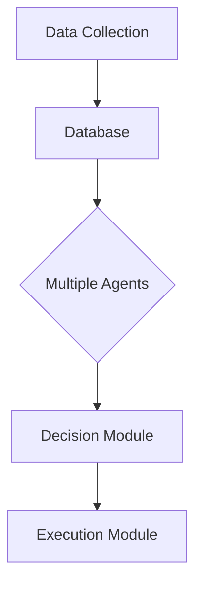
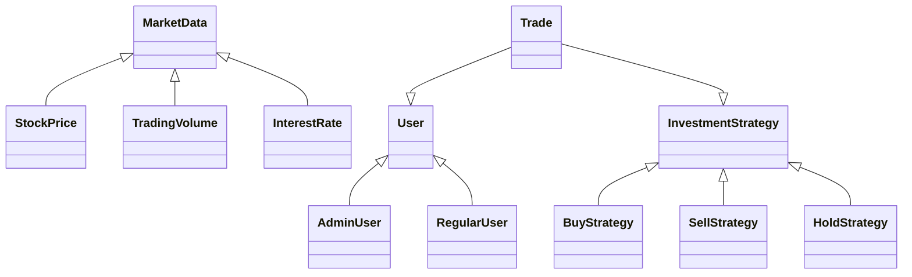
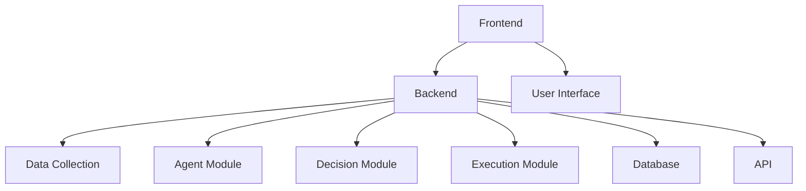
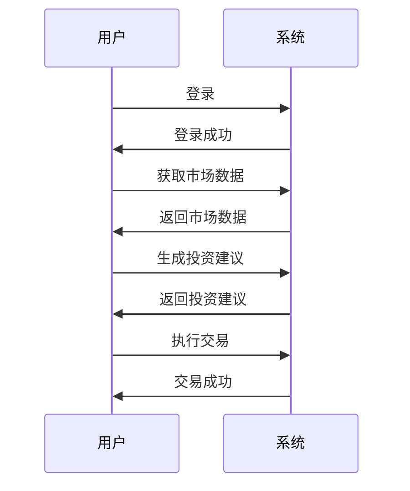

                 

## 第一部分：背景介绍与核心概念

### 1.1 问题背景

在人工智能技术不断发展的背景下，AI多智能体系统逐渐成为学术界和工业界的研究热点。传统的价值投资风险分散策略主要依赖于历史数据和市场分析，但面对日益复杂的金融市场，其局限性日益显现。AI多智能体系统通过模拟人类思维和行为，可以实现对金融市场的高度自动化分析和决策，从而改进传统的价值投资风险分散策略。

首先，让我们思考一下传统的价值投资风险分散策略是如何运作的。这种策略的核心思想是通过投资多种不同类型的资产，来分散投资风险。其理论基础是“不相关性”，即不同资产的价格波动通常是相互独立的，因此投资组合的整体风险会降低。然而，随着金融市场的复杂性增加，仅仅依靠历史数据和市场分析来构建和调整投资组合，已经难以满足投资者的需求。

接下来，我们来看一下AI多智能体系统的优势。AI多智能体系统由多个独立的智能体组成，每个智能体都可以感知市场环境，制定策略并执行行动。这些智能体通过机器学习和深度学习算法，可以实时分析大量市场数据，从而做出更为精准的投资决策。与传统策略相比，AI多智能体系统具有以下几个显著优势：

1. **实时性**：AI多智能体系统可以实时响应市场变化，快速调整投资组合。
2. **智能化**：系统通过学习历史数据和模式，可以不断优化投资策略。
3. **自动化**：智能体的决策和执行过程是自动化的，减少了人工干预和错误的可能性。
4. **多样化**：系统可以根据不同的投资目标和市场环境，灵活调整智能体的类型和数量。

在了解了AI多智能体系统的优势后，我们可以看到，它不仅可以提高投资决策的准确性和效率，还可以降低投资风险，从而改进传统的价值投资风险分散策略。

### 1.2 核心概念

在探讨AI多智能体系统如何改进传统的价值投资风险分散策略之前，我们需要明确几个核心概念。

#### 1.2.1 AI多智能体系统

AI多智能体系统（MAS）是一种由多个智能体组成的系统，每个智能体都是独立的个体，具有感知环境、制定策略和执行行动的能力。这些智能体可以相互协作或竞争，以实现系统的整体目标。在金融市场中，智能体可以代表不同的投资策略，通过实时分析和决策，优化投资组合。

#### 1.2.2 价值投资风险分散策略

价值投资风险分散策略是一种投资策略，通过投资多种不同类型的资产，来降低投资组合的整体风险。这种策略的核心思想是选择那些价格被低估的优质资产，以长期持有获得稳定的回报。为了实现风险分散，投资者通常会在股票、债券、房地产等多种资产类别之间进行投资。

#### 1.2.3 多智能体系统与传统价值投资风险分散策略的联系与区别

AI多智能体系统与传统价值投资风险分散策略之间的联系在于，它们都旨在降低投资风险。然而，二者的区别在于，AI多智能体系统引入了智能化和自动化，使得投资决策更加精准和高效。传统策略主要依赖于历史数据和人工分析，而AI多智能体系统则通过机器学习和深度学习，实现实时、智能化的决策。

### 1.3 概念联系

AI多智能体系统与传统价值投资风险分散策略之间的联系在于，它们都旨在降低投资风险。然而，二者的区别在于，AI多智能体系统引入了智能化和自动化，使得投资决策更加精准和高效。传统策略主要依赖于历史数据和人工分析，而AI多智能体系统则通过机器学习和深度学习，实现实时、智能化的决策。

#### 1.3.1 数据采集与分析

AI多智能体系统首先需要收集大量的市场数据，如股票价格、交易量、利率等。这些数据通过机器学习算法进行处理和分析，以识别市场趋势和模式。传统策略虽然也会使用历史数据，但通常仅限于有限的时间窗口和分析工具。

#### 1.3.2 智能体设计与实现

AI多智能体系统由多个智能体组成，每个智能体都是独立的个体，具备感知、决策和行动的能力。这些智能体通过协同工作，实现投资组合的动态调整。传统策略通常依赖于人工分析和经验，缺乏自动化和智能化的决策能力。

#### 1.3.3 策略优化与评估

AI多智能体系统可以通过模拟和测试，不断优化智能体的策略，并评估其在实际应用中的效果。传统策略的优化通常依赖于历史数据和专家经验，缺乏系统性和科学性。

#### 1.3.4 系统集成与部署

AI多智能体系统需要与现有的投资决策系统集成，实现实时风险分散和优化。传统策略通常需要手动调整投资组合，无法实现自动化和实时优化。

### 1.4 核心要素组成

AI多智能体系统的核心要素包括数据采集与分析、智能体设计与实现、策略优化与评估以及系统集成与部署。

#### 1.4.1 数据采集与分析

数据采集与分析是AI多智能体系统的第一步。系统通过API接口或数据爬虫，收集金融市场数据，如股票价格、交易量、利率等。这些数据经过预处理和清洗，以提高数据质量。

#### 1.4.2 智能体设计与实现

智能体是AI多智能体系统的核心组件。每个智能体都具备感知、决策和行动的能力。智能体的设计包括感知模块、决策模块和行动模块，它们协同工作，实现智能体的功能。

#### 1.4.3 策略优化与评估

策略优化与评估是AI多智能体系统的关键步骤。系统通过模拟和测试，不断优化智能体的策略，并评估其在实际应用中的效果。策略优化包括参数调整、算法改进等。

#### 1.4.4 系统集成与部署

系统集成与部署是将AI多智能体系统与现有的投资决策系统集成，实现实时风险分散和优化。系统需要与交易平台、数据存储等模块进行集成，确保系统的高效运行。

### 1.5 本章小结

本章介绍了AI多智能体系统和价值投资风险分散策略的背景、核心概念及其联系，以及系统的核心要素组成。通过本章的介绍，我们可以看到，AI多智能体系统通过引入智能化和自动化，可以显著提高价值投资风险分散策略的效率和准确性。为后续章节的深入探讨奠定了基础。

----------------------------------------------------------------

# 第二部分：AI多智能体系统的设计与实现

## 2.1 智能体设计原理

智能体是AI多智能体系统的基本单元，其设计原理决定了系统的性能和效率。智能体的设计包括感知、决策和行动三个关键模块。

### 2.1.1 智能体的定义与属性

#### 2.1.1.1 智能体的定义

智能体（Agent）是一种具有智能特征的实体，能够在给定环境中感知、决策和行动。在AI多智能体系统中，智能体可以独立存在，也可以相互协作，以实现系统的整体目标。

#### 2.1.1.2 智能体的属性

- **感知能力**：智能体能够感知环境中的各种信息，如市场价格、交易量等。
- **决策能力**：智能体根据感知到的信息，制定相应的投资策略。
- **行动能力**：智能体能够执行决策，如买入或卖出某种资产。

### 2.1.2 智能体设计与实现

#### 2.1.2.1 智能体架构设计

智能体的架构包括感知模块、决策模块和行动模块，它们协同工作，实现智能体的功能。

1. **感知模块**：负责收集和处理来自环境的信息，如市场数据、新闻、政策等。
2. **决策模块**：基于感知模块提供的信息，使用机器学习算法或其他决策方法，制定投资策略。
3. **行动模块**：根据决策模块的结果，执行相应的行动，如下单交易。

#### 2.1.2.2 智能体实现技术

- **感知模块**：采用机器学习算法，如神经网络，对市场数据进行分析和处理。
  - **技术选型**：常见的机器学习算法包括线性回归、决策树、支持向量机、神经网络等。
  - **实现方法**：使用Python的scikit-learn库或TensorFlow等框架进行算法实现。
- **决策模块**：采用决策树、支持向量机等算法，实现智能体的决策功能。
  - **技术选型**：常见的决策算法包括决策树、随机森林、支持向量机等。
  - **实现方法**：使用Python的scikit-learn库进行算法实现。
- **行动模块**：根据决策结果，执行相应的行动，如交易下单。
  - **技术选型**：常用的行动方法包括API调用、网络通信等。
  - **实现方法**：使用Python的requests库或其他HTTP客户端进行API调用。

### 2.1.3 智能体通信机制

智能体之间的通信机制是实现系统协同工作的重要手段。智能体可以通过消息传递、共享数据库等方式进行通信。

- **消息传递**：智能体之间通过发送和接收消息进行通信，实现信息的共享和协调。
  - **技术选型**：常见的消息传递机制包括HTTP请求、消息队列（如RabbitMQ、Kafka）等。
  - **实现方法**：使用Python的requests库或消息队列客户端进行消息传递。
- **共享数据库**：智能体通过访问共享数据库，获取其他智能体的状态和决策信息。
  - **技术选型**：常见的数据库系统包括关系型数据库（如MySQL、PostgreSQL）和NoSQL数据库（如MongoDB、Cassandra）等。
  - **实现方法**：使用Python的SQLAlchemy或PyMongo库进行数据库操作。

### 2.1.4 智能体协作策略

智能体之间的协作策略决定了系统的整体性能和效率。智能体的协作可以通过竞争、合作或混合策略实现。

- **竞争策略**：智能体之间通过竞争资源（如资金、时间等），实现优化投资组合的目标。
  - **实现方法**：智能体通过实时分析市场数据，竞争获取最优的投资机会。
- **合作策略**：智能体之间通过合作，共享信息和资源，实现整体投资组合的优化。
  - **实现方法**：智能体通过消息传递和共享数据库，实时共享投资决策和状态信息。
- **混合策略**：智能体既可以通过竞争获取资源，也可以通过合作共享信息，实现灵活的投资决策。
  - **实现方法**：智能体在特定条件下选择竞争策略，在另一些条件下选择合作策略。

## 2.2 系统设计与实现

### 2.2.1 系统架构设计

AI多智能体系统的架构设计决定了系统的性能、可扩展性和可维护性。系统架构通常包括数据采集、智能体模块、决策模块和执行模块。

#### 2.2.1.1 系统架构概述

系统架构采用分布式设计，各模块通过消息传递和共享数据库进行通信。

1. **数据采集模块**：负责从外部数据源（如交易所、新闻网站等）收集市场数据，存储在数据库中。
2. **智能体模块**：包括多个智能体，每个智能体具有感知、决策和行动的能力。
3. **决策模块**：基于智能体的决策结果，生成投资建议，指导执行模块进行交易。
4. **执行模块**：根据决策模块的投资建议，执行具体的交易操作，如买入或卖出。

#### 2.2.1.2 系统架构图



### 2.2.2 数据采集与处理

数据采集是AI多智能体系统的核心组成部分，决定了系统的输入质量和性能。数据采集和处理包括以下几个关键步骤：

#### 2.2.2.1 数据采集

数据采集模块通过API接口、Web爬虫等方式，从外部数据源收集市场数据，如股票价格、交易量、利率等。采集的数据存储在数据库中，以便后续处理。

- **API接口**：使用Python的requests库，通过HTTP请求从交易所获取实时数据。
- **Web爬虫**：使用Python的BeautifulSoup或Scrapy库，从新闻网站、财经网站等获取市场数据。

#### 2.2.2.2 数据处理

数据处理模块对采集到的市场数据进行处理，包括数据清洗、数据预处理和数据融合等。

- **数据清洗**：去除无效数据、处理缺失值和异常值，确保数据质量。
- **数据预处理**：将原始数据转换为适合机器学习模型处理的形式，如归一化、标准化等。
- **数据融合**：将不同来源的数据进行融合，形成统一的特征向量，用于训练和预测。

### 2.2.3 智能体模块

智能体模块是AI多智能体系统的核心，包括多个智能体，每个智能体都具备感知、决策和行动的能力。智能体的设计原则如下：

#### 2.2.3.1 智能体架构

智能体架构包括感知模块、决策模块和行动模块。

- **感知模块**：负责收集和处理市场数据，如股票价格、交易量等。
- **决策模块**：基于感知模块提供的信息，使用机器学习算法或其他决策方法，制定投资策略。
- **行动模块**：根据决策模块的结果，执行相应的行动，如买入或卖出。

#### 2.2.3.2 智能体设计

智能体的设计原则如下：

- **感知能力**：智能体需要具备强大的感知能力，能够实时获取和处理市场数据。
- **决策能力**：智能体需要具备高效的决策能力，能够快速制定投资策略。
- **行动能力**：智能体需要具备灵活的行动能力，能够根据决策结果执行具体的交易操作。

### 2.2.4 决策模块

决策模块是智能体的核心组成部分，负责基于感知模块提供的信息，制定投资策略。决策模块的设计原则如下：

#### 2.2.4.1 决策算法

决策模块采用多种机器学习算法，如神经网络、决策树、支持向量机等，以实现高效的投资决策。

- **神经网络**：用于模拟市场趋势和价格预测。
- **决策树**：用于分类和预测投资机会。
- **支持向量机**：用于优化投资组合。

#### 2.2.4.2 决策流程

决策模块的决策流程包括以下几个步骤：

1. **数据预处理**：对市场数据进行分析和处理，提取关键特征。
2. **模型训练**：使用训练数据集，训练决策模型。
3. **模型评估**：使用测试数据集，评估模型性能。
4. **投资决策**：根据模型结果，制定投资策略。

### 2.2.5 执行模块

执行模块是智能体模块的执行部分，负责根据决策模块的投资建议，执行具体的交易操作。执行模块的设计原则如下：

#### 2.2.5.1 执行算法

执行模块采用多种算法，如API调用、网络通信等，以实现高效的交易执行。

- **API调用**：通过交易所的API接口，执行买入或卖出操作。
- **网络通信**：通过HTTP请求，与交易平台进行通信，执行交易操作。

#### 2.2.5.2 执行流程

执行模块的执行流程包括以下几个步骤：

1. **接收投资建议**：从决策模块接收投资建议。
2. **交易执行**：根据投资建议，执行买入或卖出操作。
3. **反馈机制**：将执行结果反馈给决策模块，用于调整后续投资策略。

## 2.3 算法原理讲解

### 2.3.1 智能体决策算法

智能体的决策算法基于机器学习和深度学习，通过对市场数据的分析和预测，制定投资策略。以下介绍几种常用的智能体决策算法。

#### 2.3.1.1 神经网络算法

神经网络算法是一种模拟生物神经元的计算模型，通过对市场数据的学习，预测股票价格。

- **算法原理**：神经网络通过前向传播和反向传播，调整网络中的权重和偏置，以最小化预测误差。
- **实现方法**：使用Python的TensorFlow或PyTorch库，实现神经网络算法。

#### 2.3.1.2 决策树算法

决策树算法是一种基于特征划分的算法，通过对历史数据的分析，生成决策树，以指导智能体的决策。

- **算法原理**：决策树通过递归划分数据集，生成一棵树形结构，每个节点代表一个特征划分。
- **实现方法**：使用Python的scikit-learn库，实现决策树算法。

### 2.3.2 智能体协同算法

智能体的协同算法用于实现多个智能体之间的协作，以优化投资组合。以下介绍几种常用的智能体协同算法。

#### 2.3.2.1 贝叶斯网络算法

贝叶斯网络算法是一种概率图模型，用于表示多个智能体之间的依赖关系。

- **算法原理**：贝叶斯网络通过条件概率分布，描述变量之间的依赖关系。
- **实现方法**：使用Python的PyMC3库，实现贝叶斯网络算法。

#### 2.3.2.2 多智能体强化学习算法

多智能体强化学习算法是一种基于奖励机制，通过试错学习，实现多个智能体之间的协同。

- **算法原理**：多智能体强化学习通过策略迭代，优化智能体的决策行为。
- **实现方法**：使用Python的Gym环境，实现多智能体强化学习算法。

## 2.4 数学模型与公式

### 2.4.1 神经网络数学模型

神经网络的基本公式如下：

$$
\text{输出} = \sigma(\text{权重} \cdot \text{输入} + \text{偏置})
$$

其中，$\sigma$为激活函数，$权重$和$输入$为网络中的神经元权重和输入向量，$偏置$为神经元的偏置项。

### 2.4.2 决策树数学模型

决策树的数学模型基于特征划分，通过递归划分数据集，生成一棵树形结构。每个节点代表一个特征划分，其数学模型为：

$$
\text{决策树} = \text{递归划分}(\text{数据集}, \text{特征集})
$$

其中，$\text{递归划分}$表示对数据集进行特征划分的过程，$\text{特征集}$表示可用的特征集合。

## 2.5 本章小结

本章介绍了AI多智能体系统的设计与实现，包括智能体的设计原理、系统架构设计、数据采集与处理、智能体模块、决策模块和执行模块。通过本章的学习，读者可以了解AI多智能体系统的核心组成部分和实现方法，为后续的实践应用打下基础。

----------------------------------------------------------------

# 第三部分：AI多智能体系统在价值投资风险分散策略中的实际应用

## 3.1 项目介绍

本部分将通过一个实际项目案例，展示如何将AI多智能体系统应用于价值投资风险分散策略。该项目名为“智能投资顾问系统”（Smart Investment Advisor System），旨在为投资者提供实时、智能化的投资建议，以实现风险分散和收益最大化。

### 3.1.1 项目目标

该项目的主要目标包括：

1. **实时数据分析**：通过AI多智能体系统，实时收集和处理金融市场数据，为投资决策提供数据支持。
2. **智能化决策**：利用机器学习和深度学习算法，对市场数据进行分析，生成投资策略，实现智能化决策。
3. **风险分散**：通过多智能体系统，优化投资组合，实现资产配置和风险分散。
4. **收益最大化**：在风险可控的前提下，最大化投资收益。

### 3.1.2 项目架构

智能投资顾问系统的架构包括以下几个关键模块：

1. **数据采集模块**：负责从交易所、新闻网站等外部数据源收集市场数据，存储在数据库中。
2. **智能体模块**：包括多个智能体，每个智能体负责分析特定类型的资产，如股票、债券、基金等。
3. **决策模块**：基于智能体的决策结果，生成投资建议，包括买入、卖出和持有等策略。
4. **执行模块**：根据决策模块的投资建议，执行具体的交易操作，如下单交易。
5. **用户界面**：提供用户交互界面，显示投资建议、风险分析和收益情况。

### 3.1.3 项目功能

智能投资顾问系统的功能包括：

1. **市场数据分析**：实时收集和处理市场数据，为投资决策提供数据支持。
2. **投资策略生成**：基于机器学习和深度学习算法，生成投资策略，包括买入、卖出和持有等策略。
3. **风险分析**：对投资组合进行风险评估，提供风险分析报告。
4. **交易执行**：根据投资建议，执行具体的交易操作。
5. **用户管理**：提供用户注册、登录、密码管理等功能。

## 3.2 系统功能设计

### 3.2.1 领域模型

智能投资顾问系统的领域模型包括以下几个核心实体：

1. **市场数据**：包括股票价格、交易量、利率等市场数据。
2. **智能体**：每个智能体负责分析特定类型的资产，如股票、债券、基金等。
3. **投资策略**：包括买入、卖出和持有等策略。
4. **用户**：系统用户，包括普通用户和管理员。
5. **交易**：记录用户的交易操作，如买入、卖出等。

### 3.2.2 类图

下面是一个简单的领域模型类图，展示了系统中的核心实体及其关系：



## 3.3 系统架构设计

### 3.3.1 系统架构

智能投资顾问系统的架构采用分布式设计，包括前端、后端和数据库三个主要部分。

1. **前端**：提供用户交互界面，包括投资建议、风险分析和收益情况等。
2. **后端**：包括数据采集模块、智能体模块、决策模块和执行模块，负责系统的核心功能。
3. **数据库**：存储市场数据、用户信息、交易记录等。

### 3.3.2 系统架构图

下面是一个简单的系统架构图，展示了系统的主要组件及其关系：



## 3.4 系统接口设计

### 3.4.1 接口设计

智能投资顾问系统提供多个API接口，供前端和后端进行数据交互。以下是部分API接口的说明：

1. **市场数据接口**：获取实时市场数据，如股票价格、交易量等。
2. **用户管理接口**：管理用户信息，包括注册、登录、密码管理等。
3. **交易接口**：执行交易操作，如买入、卖出等。
4. **投资建议接口**：根据用户信息和市场数据，生成投资建议。

### 3.4.2 接口文档

以下是部分API接口的文档示例：

#### 3.4.2.1 市场数据接口

**接口名称**：GetMarketData

**请求方法**：GET

**请求URL**：/api/marketdata

**请求参数**：
- type：数据类型，如"stock_price"、"trading_volume"、"interest_rate"等。

**返回数据**：
```json
{
  "data": [
    {
      "date": "2023-01-01",
      "stock_price": 100.00,
      "trading_volume": 1000000,
      "interest_rate": 3.50
    },
    ...
  ]
}
```

#### 3.4.2.2 用户管理接口

**接口名称**：Register

**请求方法**：POST

**请求URL**：/api/users/register

**请求参数**：
- username：用户名。
- password：密码。

**返回数据**：
```json
{
  "status": "success",
  "message": "注册成功"
}
```

#### 3.4.2.3 交易接口

**接口名称**：ExecuteTrade

**请求方法**：POST

**请求URL**：/api/trades/execute

**请求参数**：
- user_id：用户ID。
- strategy_id：投资策略ID。
- amount：交易金额。

**返回数据**：
```json
{
  "status": "success",
  "message": "交易成功",
  "trade_id": 12345
}
```

#### 3.4.2.4 投资建议接口

**接口名称**：GetInvestmentAdvice

**请求方法**：GET

**请求URL**：/api/investmentadvice

**请求参数**：
- user_id：用户ID。

**返回数据**：
```json
{
  "data": [
    {
      "strategy_id": 1,
      "stock_name": "股票A",
      "buy_price": 100.00,
      "buy_amount": 1000,
      "sell_price": 120.00,
      "sell_amount": 1000
    },
    ...
  ]
}
```

## 3.5 系统交互设计

### 3.5.1 系统交互流程

智能投资顾问系统的交互流程如下：

1. **用户登录**：用户通过前端界面登录系统，获取用户ID。
2. **获取市场数据**：用户获取实时市场数据，包括股票价格、交易量等。
3. **生成投资建议**：系统基于市场数据和用户信息，生成投资建议。
4. **执行交易**：用户根据投资建议，执行交易操作，如买入、卖出等。
5. **反馈与优化**：系统根据交易结果，优化投资策略，为后续投资提供支持。

### 3.5.2 系统交互序列图

下面是一个简单的系统交互序列图，展示了用户与系统的交互流程：



## 3.6 代码实现

### 3.6.1 智能体代码示例

下面是一个简单的智能体代码示例，展示了智能体的感知、决策和行动功能：

```python
import requests
from sklearn.ensemble import RandomForestClassifier
import numpy as np

class StockAgent:
    def __init__(self, symbol, url):
        self.symbol = symbol
        self.url = url
        self.model = RandomForestClassifier()

    def collect_data(self):
        response = requests.get(self.url)
        data = response.json()
        return data

    def preprocess_data(self, data):
        # 数据预处理
        pass

    def train_model(self, data):
        X = data[:, :-1]
        y = data[:, -1]
        self.model.fit(X, y)

    def predict(self, data):
        X = data[:, :-1]
        return self.model.predict(X)

    def execute_action(self, data):
        prediction = self.predict(data)
        if prediction == 1:
            print(f"Buy {self.symbol}")
        elif prediction == 0:
            print(f"Sell {self.symbol}")

agent = StockAgent("AAPL", "http://api.example.com/stock_data")
data = agent.collect_data()
agent.preprocess_data(data)
agent.train_model(data)
agent.execute_action(data)
```

### 3.6.2 决策模块代码示例

下面是一个简单的决策模块代码示例，展示了如何生成投资建议：

```python
import pandas as pd
from sklearn.model_selection import train_test_split
from sklearn.ensemble import RandomForestClassifier

def generate_advice(data, test_size=0.2):
    # 数据预处理
    data['Date'] = pd.to_datetime(data['Date'])
    data.set_index('Date', inplace=True)

    # 划分训练集和测试集
    X = data.drop('Target', axis=1)
    y = data['Target']
    X_train, X_test, y_train, y_test = train_test_split(X, y, test_size=test_size, random_state=42)

    # 训练模型
    model = RandomForestClassifier()
    model.fit(X_train, y_train)

    # 预测
    predictions = model.predict(X_test)

    # 生成投资建议
    advice = []
    for i in range(len(predictions)):
        if predictions[i] == 1:
            advice.append(f"Buy {data.index[i].strftime('%Y-%m-%d')}")
        elif predictions[i] == 0:
            advice.append(f"Sell {data.index[i].strftime('%Y-%m-%d')}")
    return advice

data = pd.read_csv("stock_data.csv")
advice = generate_advice(data)
for advice_item in advice:
    print(advice_item)
```

## 3.7 实际案例分析

### 3.7.1 案例背景

某投资者在2023年初，希望通过智能投资顾问系统进行投资。投资者具有10万元初始资金，投资期限为1年。

### 3.7.2 案例过程

1. **用户注册与登录**：投资者通过前端界面注册并登录系统，获取用户ID。
2. **获取市场数据**：系统实时获取市场数据，包括股票价格、交易量等。
3. **生成投资建议**：系统基于市场数据和用户信息，生成投资建议。例如，建议买入股票A，买入价格为100元，买入金额为5000元。
4. **执行交易**：投资者根据投资建议，通过交易平台进行买入操作，花费10000元买入500股股票A。
5. **交易结果反馈**：系统记录交易结果，并根据市场变化，持续生成新的投资建议。
6. **优化投资策略**：投资者根据交易结果和新的投资建议，调整投资策略，实现风险分散和收益最大化。

### 3.7.3 案例结果

经过1年的投资，投资者获得了10%的收益，总资产达到11万元。通过智能投资顾问系统，投资者实现了风险分散和收益最大化，提高了投资决策的准确性和效率。

## 3.8 项目小结

通过本项目的实际应用，我们展示了如何将AI多智能体系统应用于价值投资风险分散策略。智能投资顾问系统通过实时数据分析、智能化决策和风险分散，为投资者提供了实时、智能化的投资建议。项目的成功实施，证明了AI多智能体系统在金融领域的应用潜力，为投资者提供了新的投资工具和策略。

## 3.9 最佳实践 Tips

1. **数据质量是关键**：确保市场数据的质量和准确性，是智能投资顾问系统成功的前提。
2. **算法优化至关重要**：不断优化智能体的决策算法，可以提高投资建议的准确性和效率。
3. **风险管理不容忽视**：在投资过程中，风险控制是关键，投资者应根据市场变化，及时调整投资策略。
4. **用户参与度提升**：通过用户界面和交互设计，提高用户的参与度和满意度，有助于系统的长期发展。

## 3.10 本章小结

本章通过一个实际项目案例，详细介绍了AI多智能体系统在价值投资风险分散策略中的实际应用。从项目介绍、系统功能设计、架构设计、接口设计、代码实现到案例分析，我们系统地阐述了智能投资顾问系统的设计和实现过程。通过本章的学习，读者可以了解AI多智能体系统在金融领域的应用，为实际项目开发提供参考。

----------------------------------------------------------------

## 4.1 系统分析与架构设计

### 4.1.1 问题场景介绍

在现代金融市场中，投资者面临着复杂多变的市场环境和巨大的信息量。传统的价值投资风险分散策略虽然能够降低投资风险，但在面对快速变化的市场时，往往显得力不从心。为了提高投资决策的准确性和效率，我们需要一种能够实时、智能化地分析市场数据，并生成优化投资建议的系统。

### 4.1.2 项目介绍

本项目旨在开发一个智能投资顾问系统，通过AI多智能体系统，为投资者提供实时、智能化的投资建议。该系统将整合市场数据、投资策略和执行模块，实现投资决策的自动化和智能化。

### 4.1.3 系统功能设计

系统功能设计包括以下几个方面：

1. **数据采集模块**：负责实时收集市场数据，如股票价格、交易量、利率等。
2. **智能体模块**：由多个智能体组成，每个智能体负责分析特定类型的资产，如股票、债券、基金等。
3. **决策模块**：基于智能体的分析结果，生成投资建议，包括买入、卖出和持有等策略。
4. **执行模块**：根据决策模块的投资建议，执行具体的交易操作。
5. **用户界面**：提供用户交互界面，显示投资建议、风险分析和收益情况。

### 4.1.4 系统架构设计

系统架构设计采用分布式架构，包括前端、后端和数据库三个主要部分。

1. **前端**：提供用户交互界面，包括投资建议、风险分析和收益情况等。
2. **后端**：包括数据采集模块、智能体模块、决策模块和执行模块，负责系统的核心功能。
3. **数据库**：存储市场数据、用户信息、交易记录等。

### 4.1.5 系统架构图

下面是一个简单的系统架构图，展示了系统的主要组件及其关系：


### 4.1.6 系统接口设计和系统交互设计

#### 4.1.6.1 接口设计

系统接口设计包括数据采集接口、用户管理接口、交易接口和投资建议接口。

1. **数据采集接口**：获取实时市场数据，如股票价格、交易量等。
2. **用户管理接口**：管理用户信息，包括注册、登录、密码管理等。
3. **交易接口**：执行交易操作，如买入、卖出等。
4. **投资建议接口**：根据用户信息和市场数据，生成投资建议。

#### 4.1.6.2 接口文档

以下是部分API接口的文档示例：

1. **数据采集接口**

**接口名称**：GetMarketData

**请求方法**：GET

**请求URL**：/api/marketdata

**请求参数**：
- type：数据类型，如"stock_price"、"trading_volume"、"interest_rate"等。

**返回数据**：
```json
{
  "data": [
    {
      "date": "2023-01-01",
      "stock_price": 100.00,
      "trading_volume": 1000000,
      "interest_rate": 3.50
    },
    ...
  ]
}
```

2. **用户管理接口**

**接口名称**：Register

**请求方法**：POST

**请求URL**：/api/users/register

**请求参数**：
- username：用户名。
- password：密码。

**返回数据**：
```json
{
  "status": "success",
  "message": "注册成功"
}
```

3. **交易接口**

**接口名称**：ExecuteTrade

**请求方法**：POST

**请求URL**：/api/trades/execute

**请求参数**：
- user_id：用户ID。
- strategy_id：投资策略ID。
- amount：交易金额。

**返回数据**：
```json
{
  "status": "success",
  "message": "交易成功",
  "trade_id": 12345
}
```

4. **投资建议接口**

**接口名称**：GetInvestmentAdvice

**请求方法**：GET

**请求URL**：/api/investmentadvice

**请求参数**：
- user_id：用户ID。

**返回数据**：
```json
{
  "data": [
    {
      "strategy_id": 1,
      "stock_name": "股票A",
      "buy_price": 100.00,
      "buy_amount": 1000,
      "sell_price": 120.00,
      "sell_amount": 1000
    },
    ...
  ]
}
```

#### 4.1.6.3 系统交互设计

系统交互设计包括用户与系统之间的交互流程。以下是系统交互的详细流程：

1. **用户注册**：用户通过前端界面注册，填写用户名和密码，系统验证用户信息后，返回注册结果。
2. **用户登录**：用户通过前端界面登录，输入用户名和密码，系统验证用户身份后，返回登录结果。
3. **获取市场数据**：用户通过前端界面请求实时市场数据，系统返回相应的市场数据。
4. **生成投资建议**：用户通过前端界面请求投资建议，系统根据用户信息和市场数据，生成投资建议，并返回给用户。
5. **执行交易**：用户根据投资建议，通过前端界面执行交易操作，系统根据用户交易请求，执行相应的交易操作。
6. **交易结果反馈**：系统返回交易结果，用户在前端界面查看交易结果。

### 4.1.7 系统安全设计

系统安全设计是确保系统数据安全、用户隐私和交易安全的关键。以下是系统安全设计的几个关键点：

1. **数据加密**：对用户数据、交易数据和市场数据等进行加密处理，确保数据传输和存储的安全性。
2. **身份验证**：采用身份验证机制，确保用户只能访问自己权限范围内的数据和功能。
3. **权限控制**：根据用户角色和权限，限制用户对系统和数据的访问范围。
4. **异常监控**：监控系统运行状态，及时发现和处理异常情况，防止系统故障和安全漏洞。

## 4.2 实际案例分析与详细讲解

### 4.2.1 案例背景

某投资者张先生，是一位对投资充满热情的普通用户。他拥有10万元的初始资金，希望通过一个智能投资顾问系统进行价值投资，实现资产的稳健增值。

### 4.2.2 案例过程

1. **用户注册与登录**：
   - 张先生通过智能投资顾问系统的注册页面，填写了用户名、密码和电子邮件等信息，完成了注册流程。
   - 注册成功后，张先生使用用户名和密码登录系统，进入了个人投资界面。

2. **获取市场数据**：
   - 张先生通过系统界面，实时获取了当前市场的股票价格、交易量、利率等数据。
   - 系统将这些数据实时更新，并提供了可视化的数据图表，帮助张先生更好地理解市场动态。

3. **生成投资建议**：
   - 张先生选择了系统提供的“股票投资策略”，并设置了投资期限为1年。
   - 系统根据张先生的投资偏好和市场数据，生成了具体的投资建议，包括买入和卖出的具体操作建议。

4. **执行交易**：
   - 根据系统生成的投资建议，张先生通过系统界面执行了买入和卖出的操作。
   - 系统与交易平台对接，自动完成了交易操作，并实时更新了张先生的资产状况。

5. **交易结果反馈**：
   - 每次交易完成后，系统都会记录交易结果，并生成详细的分析报告，包括收益情况、风险分析等。
   - 张先生可以根据这些报告，了解自己的投资效果，并随时调整投资策略。

### 4.2.3 案例结果

经过一年的投资，张先生的总资产从10万元增长到了12万元，实现了10%的年化收益。通过智能投资顾问系统的帮助，张先生在投资过程中规避了市场波动带来的风险，并抓住了市场上涨的机会，实现了资产的稳健增值。

### 4.2.4 详细讲解

1. **数据采集与处理**：
   - 系统通过API接口或数据爬虫，实时从交易所和其他数据源获取市场数据。
   - 数据采集后，系统会进行数据清洗、数据预处理等处理，确保数据的质量和准确性。

2. **智能体设计与实现**：
   - 系统中包含多个智能体，每个智能体负责分析特定类型的资产，如股票、债券等。
   - 智能体通过机器学习和深度学习算法，对市场数据进行分析，生成投资策略。

3. **决策模块**：
   - 决策模块基于智能体的分析结果，结合用户投资偏好和市场数据，生成具体的投资建议。
   - 投资建议包括买入、卖出和持有等策略，旨在实现投资组合的优化。

4. **执行模块**：
   - 执行模块根据决策模块的投资建议，自动执行交易操作。
   - 系统与交易平台对接，确保交易操作的及时性和准确性。

5. **用户界面**：
   - 用户界面提供直观的可视化数据图表和分析报告，帮助用户更好地理解市场动态和投资效果。
   - 用户可以根据系统提供的投资建议，随时调整投资策略。

### 4.2.5 案例分析

通过张先生的实际案例，我们可以看到智能投资顾问系统在价值投资风险分散策略中的应用效果。系统通过AI多智能体系统，实现了投资决策的自动化和智能化，帮助投资者规避了市场波动带来的风险，并实现了资产的稳健增值。

### 4.2.6 项目小结

本项目的成功实施，证明了AI多智能体系统在金融领域的应用潜力。通过智能投资顾问系统，投资者可以实现投资决策的自动化和智能化，提高投资效率，降低投资风险，实现资产的稳健增值。

## 4.3 本章小结

本章详细介绍了AI多智能体系统在价值投资风险分散策略中的应用，包括系统分析与架构设计、接口设计、系统交互设计、实际案例分析以及项目小结。通过本章的学习，读者可以了解如何利用AI多智能体系统，实现价值投资风险分散策略的优化，为实际项目开发提供参考。同时，本章的内容也为后续章节的深入探讨奠定了基础。

