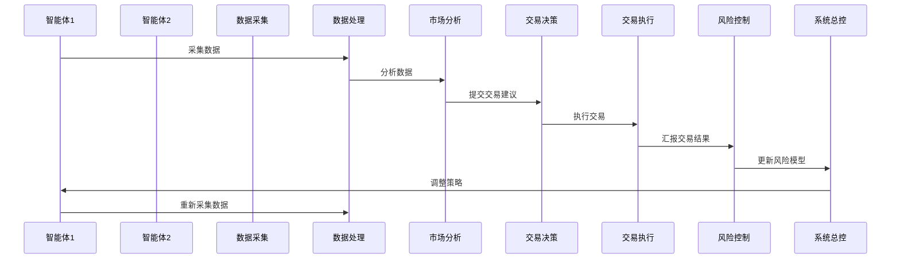

                 

### 1.2 价值投资策略概述

价值投资是一种以长期持有为目的的投资策略，其核心原则在于寻找那些市场价格低于其内在价值的资产，并买入持有，以获取资本增值。价值投资理念最早由本杰明·格雷厄姆提出，并经过沃伦·巴菲特等人的发展，形成了较为完整的理论体系。

**核心原则**：
1. **低价购买**：投资者应寻找那些被市场低估的股票，即市场价格低于其内在价值。
2. **长期持有**：投资者应采取长期持有的策略，而非频繁交易。
3. **企业价值分析**：投资者需深入分析企业的基本面，如营收、利润、现金流、负债等财务指标，以评估企业的内在价值。
4. **安全边际**：投资者应在市场价格低于企业内在价值的基础上，保留一定安全边际，以防价格进一步下跌。

**价值投资的执行策略**：
1. **选择投资标的**：通过财务分析、行业研究等手段，筛选出有潜力的投资标的。
2. **市场时机**：分析市场情绪和宏观经济环境，寻找市场低谷时进行投资的机会。
3. **风险控制**：通过分散投资、设置止损点等方式控制风险。
4. **投资组合管理**：定期评估投资组合的表现，根据市场变化进行调整。

### 1.3 多智能体系统在价值投资中的应用

多智能体系统（Multi-Agent System, MAS）是由多个自主、智能的个体（即智能体Agent）组成的系统，这些智能体通过通信和协作实现复杂任务。在价值投资中，多智能体系统可以发挥以下作用：

**多智能体系统在价值投资中的作用**：
1. **数据分析与预测**：多智能体系统可以通过机器学习算法，对大量市场数据进行处理和分析，预测市场趋势和风险。
2. **协同决策**：多个智能体可以协同工作，综合分析多方面信息，提高投资决策的准确性。
3. **风险控制**：智能体可以实时监控市场动态，根据风险变化自动调整投资策略，降低投资风险。

**多智能体系统在价值投资中的应用**：
1. **股票市场分析**：利用多智能体系统对股票市场的数据进行分析，预测股价走势，为投资决策提供支持。
2. **交易策略优化**：通过多智能体系统，优化交易策略，提高交易效率，降低交易成本。
3. **风险管理**：智能体可以实时监控市场风险，根据风险变化调整投资组合，实现风险控制。

**多智能体系统在价值投资中的优势**：
1. **高效性**：多智能体系统能够快速处理大量数据，提供实时的投资建议。
2. **准确性**：通过协同工作和机器学习，提高预测的准确性和决策的准确性。
3. **灵活性**：智能体可以根据市场变化，灵活调整投资策略，适应不同的市场环境。

**多智能体系统在价值投资中的挑战**：
1. **数据质量**：多智能体系统依赖于高质量的数据，数据的质量直接影响系统的表现。
2. **算法设计**：智能体算法的设计和优化是系统性能的关键，需要不断改进和优化。
3. **系统整合**：如何将多智能体系统与现有投资系统整合，实现无缝对接，是一个技术挑战。

**未来发展趋势**：
随着人工智能技术的发展，多智能体系统在价值投资中的应用将越来越广泛。未来的发展趋势包括：
1. **智能体协作**：智能体之间的协作将更加紧密，实现更加精准的投资决策。
2. **自动化投资**：多智能体系统将逐步实现自动化投资，减少人为干预，提高投资效率。
3. **跨领域应用**：多智能体系统将在更多领域得到应用，如区块链、物联网等，实现跨领域投资。

### 1.4 本书结构

本书将按照以下结构展开：

1. **第1章 引言**：介绍AI多智能体系统和价值投资策略的基本概念，为读者奠定基础。
2. **第2章 多智能体系统基本原理**：详细阐述多智能体系统的概念、特点以及体系结构。
3. **第3章 价值投资策略核心概念**：深入解析价值投资理论，包括核心原则和执行策略。
4. **第4章 AI在多智能体系统中的应用**：介绍AI在多智能体系统中的应用，包括机器学习和强化学习。
5. **第5章 多智能体系统架构设计与实现**：讨论多智能体系统架构设计原则、实例和接口设计。
6. **第6章 实际案例：AI多智能体系统价值投资策略**：通过一个实际案例，展示如何实现多智能体系统的价值投资策略。
7. **第7章 最佳实践与未来展望**：总结最佳实践，探讨未来的发展方向。

通过本书的阅读，读者将系统地了解AI多智能体系统在价值投资中的应用，掌握相关的理论知识和实践技能，为实际投资提供有力支持。

---

### 1.5 关键词

- **价值投资**
- **多智能体系统**
- **AI**
- **机器学习**
- **强化学习**
- **投资策略**
- **数据预测**
- **风险控制**
- **投资组合管理**

---

### 1.6 摘要

本文探讨了AI多智能体系统在价值投资策略中的应用。首先，介绍了价值投资策略的基本概念和核心原则，包括低价购买、长期持有和企业价值分析。然后，阐述了多智能体系统的基本原理，包括定义、特点和体系结构。接着，详细介绍了AI在多智能体系统中的应用，包括机器学习和强化学习算法。随后，讨论了多智能体系统在价值投资中的具体应用，如数据分析、协同决策和风险管理。最后，通过一个实际案例，展示了如何利用多智能体系统实现价值投资策略，并总结了最佳实践和未来展望。本文旨在为读者提供全面、系统的AI多智能体系统在价值投资中的应用指南，帮助他们提高投资决策的准确性和效率。作者：AI天才研究院/AI Genius Institute & 禅与计算机程序设计艺术/Zen And The Art of Computer Programming

----------------------------------------------------------------

### 第2章 多智能体系统基本原理

#### 2.1 多智能体系统定义与特点

多智能体系统（Multi-Agent System，MAS）是由多个相互协作的智能体（Agent）组成的复杂系统，这些智能体可以是物理实体、软件程序或抽象实体。智能体具有自主性、社交性、反应性和适应性等特点，能够独立地执行任务、与环境交互并与其他智能体进行协作。

**定义**：
多智能体系统可以简单定义为“由多个智能体通过协作共同完成任务的系统”。其中，智能体是系统的基本组成单元，具有以下特点：

1. **自主性**：智能体能够独立地作出决策和执行行动。
2. **社交性**：智能体能够与其他智能体进行通信和协作。
3. **反应性**：智能体能够对环境中的变化做出即时反应。
4. **适应性**：智能体能够根据环境变化和学习经验调整自身行为。

**特点**：
多智能体系统具有以下显著特点：

1. **分布式**：智能体分布在不同的位置，通过通信网络进行信息交换。
2. **协作性**：智能体之间需要进行信息共享和协同工作，以实现共同目标。
3. **动态性**：系统状态随时间变化，智能体需要不断调整策略以适应新情况。
4. **异质性**：智能体可能有不同的能力、目标和知识，系统需要解决异质性问题。
5. **自主性**：每个智能体都有一定的自主决策能力，系统能够在没有中央控制的情况下运作。

**多智能体系统的体系结构**：

多智能体系统的体系结构可以分为三个主要层次：个体层、交互层和全局层。

1. **个体层**：包括各个智能体的内部结构和功能，如感知、决策和行动模块。
2. **交互层**：智能体之间的通信和协作机制，包括通信协议、通信网络和信息共享方式。
3. **全局层**：对整个多智能体系统的全局控制和协调，如全局目标规划、任务分配和资源管理。

**多智能体系统的通信机制**：

多智能体系统中的智能体需要通过通信机制进行信息交换和协作。常见的通信机制包括：

1. **直接通信**：智能体之间直接进行通信，如发送消息、请求和响应。
2. **间接通信**：智能体通过一个共享的信息空间进行通信，如黑板系统、数据库等。
3. **广播通信**：信息从一个智能体广播到所有其他智能体，适用于信息共享和全局同步。
4. **发布-订阅通信**：智能体发布信息，其他智能体根据订阅内容进行选择性接收。

通过上述通信机制，智能体可以实时共享信息、协调行动，实现复杂任务的自动化解决。在多智能体系统中，通信机制的选择和设计对系统的性能和效率具有决定性影响。

#### 2.2 多智能体系统的体系结构

多智能体系统的体系结构是设计和实现多智能体系统的关键。一个良好的体系结构能够提高系统的灵活性、可扩展性和可维护性。多智能体系统的体系结构通常包括以下几个层次：

1. **个体层**：
   - **感知模块**：智能体通过感知模块获取环境信息，如传感器数据、环境状态等。
   - **决策模块**：智能体根据感知模块提供的信息，利用决策算法生成行动策略。
   - **执行模块**：智能体根据决策模块的输出执行行动，如移动、发送消息等。

2. **交互层**：
   - **通信模块**：智能体通过通信模块与其他智能体进行信息交换，如发送消息、请求和响应。
   - **协作机制**：智能体通过协作机制实现任务分配、信息共享和协调行动，如协商协议、博弈策略等。

3. **全局层**：
   - **协调模块**：全局协调模块负责整体系统的规划、协调和资源管理，如任务分配、资源调度等。
   - **监控模块**：全局监控模块负责监控系统状态、性能和安全性，如异常检测、故障恢复等。

**个体层**的设计主要关注智能体的内部结构和功能，确保智能体能够自主地感知环境、做出决策并执行行动。**交互层**的设计主要关注智能体之间的通信和协作机制，确保智能体能够有效地共享信息、协同工作。**全局层**的设计主要关注系统的整体控制和协调，确保系统能够实现共同目标并保持稳定运行。

#### 2.3 多智能体系统中的通信机制

在多智能体系统中，通信机制是实现智能体之间信息交换和协作的关键。多智能体系统的通信机制可以分为以下几种类型：

1. **直接通信**：
   - **定义**：直接通信是指智能体通过点对点的方式直接与其他智能体进行通信。
   - **优点**：直接通信速度快、可靠性高，适用于需要实时交互的智能体。
   - **缺点**：直接通信需要明确知道其他智能体的位置和通信协议，扩展性较差。

2. **间接通信**：
   - **定义**：间接通信是指智能体通过一个共享的信息空间进行通信，如黑板系统、数据库等。
   - **优点**：间接通信简化了通信复杂性，提高了系统的可扩展性，适用于大规模智能体系统。
   - **缺点**：间接通信可能存在通信延迟，可靠性较低，且需要维护共享信息空间。

3. **广播通信**：
   - **定义**：广播通信是指信息从一个智能体广播到所有其他智能体，适用于信息共享和全局同步。
   - **优点**：广播通信速度快、实时性好，适用于全局信息同步。
   - **缺点**：广播通信可能导致信息冗余和通信开销增大，影响系统性能。

4. **发布-订阅通信**：
   - **定义**：发布-订阅通信是指智能体发布信息，其他智能体根据订阅内容进行选择性接收。
   - **优点**：发布-订阅通信提高了通信灵活性，适用于动态环境和多变的应用场景。
   - **缺点**：发布-订阅通信可能存在消息丢失和延迟问题，需要复杂的消息过滤和匹配机制。

**通信协议**：

多智能体系统的通信协议是指智能体之间进行通信的规则和标准。常见的通信协议包括：

1. **简单消息传递协议**：如TCP/IP、HTTP等，适用于直接通信。
2. **分布式黑板协议**：如CBR、TBR等，适用于间接通信。
3. **全局状态协议**：如GFS、GSS等，适用于全局同步。
4. **智能代理通信协议**：如FIPA、SIA等，适用于智能体之间的协作和通信。

**通信机制的选择和设计**：

选择和设计合适的通信机制对多智能体系统的性能和效率具有决定性影响。以下是一些关键因素：

1. **系统规模**：大规模系统更适合使用间接通信，如黑板系统、数据库等。
2. **通信频率**：高频通信系统更适合使用直接通信，如TCP/IP等。
3. **实时性要求**：实时系统需要快速、可靠的通信机制，如TCP/IP、直接通信等。
4. **安全性和隐私性**：需要考虑通信过程中的安全性和隐私保护，如加密通信、身份验证等。

通过合理选择和设计通信机制，可以提高多智能体系统的灵活性、可扩展性和可靠性，从而实现高效、智能的协同工作。

---

### 第3章 价值投资策略核心概念

#### 3.1 价值投资理论概述

价值投资理论最早由本杰明·格雷厄姆（Benjamin Graham）提出，并在沃伦·巴菲特（Warren Buffett）等投资大师的实践中得到了丰富和发展。价值投资的核心思想是寻找那些市场价格低于其内在价值的资产，通过长期持有以获取资本增值。

**基本原理**：

价值投资理论主要包括以下几项基本原则：

1. **低价购买**：投资者应寻找那些被市场低估的资产，即市场价格低于其内在价值。
2. **长期持有**：投资者应采取长期持有的策略，而非频繁交易。
3. **企业价值分析**：投资者需深入分析企业的基本面，如营收、利润、现金流、负债等财务指标，以评估企业的内在价值。
4. **安全边际**：投资者应在市场价格低于企业内在价值的基础上，保留一定安全边际，以防价格进一步下跌。

**价值投资的历史发展**：

价值投资理论起源于20世纪30年代的美国，当时本杰明·格雷厄姆提出了“边际安全价值”的概念，并将其应用于股票投资。格雷厄姆的学生沃伦·巴菲特在继承和发展这一理论的基础上，将其应用于实践，并取得了巨大的成功。

**价值投资的适用性**：

价值投资理论主要适用于以下类型的投资：

1. **长期投资者**：价值投资需要投资者具备长期持有资产的耐心和决心。
2. **基本面分析者**：投资者需具备对企业基本面的深入分析能力，以评估企业的内在价值。
3. **稳健型投资者**：价值投资强调资产的内在价值和长期持有，适用于追求稳健回报的投资者。

#### 3.2 价值投资的三大原则

价值投资的三大原则包括低价购买、长期持有和企业价值分析。这些原则是投资者在进行价值投资时必须遵循的基本准则。

**1. 低价购买**

低价购买是价值投资的核心原则之一。投资者应寻找那些被市场低估的资产，即市场价格低于其内在价值的资产。低价购买的关键在于准确评估资产的内在价值，并在此基础上以较低的价格买入。

**如何实现低价购买**：

1. **深入分析财务报表**：投资者需通过仔细阅读和分析企业的财务报表，如资产负债表、利润表和现金流量表，以评估企业的财务状况和盈利能力。
2. **关注市场情绪**：市场情绪往往导致资产价格的波动，投资者应把握市场低谷时的投资机会。
3. **分散投资**：通过分散投资，投资者可以在一定程度上降低市场波动对投资组合的影响。

**案例**：

假设某家企业的内在价值为1000万元，而市场价

---

### 3.3 价值投资的执行策略

价值投资的执行策略是实现投资目标的关键步骤，它涉及到从资产选择到买卖决策的各个方面。以下是价值投资执行策略的详细解析：

**1. 资产选择**

资产选择是价值投资的第一步，投资者需要从众多资产中筛选出那些具有潜在价值的投资目标。以下是几种常见的资产选择方法：

- **深度研究企业基本面**：投资者应通过阅读和分析企业的财务报表，了解企业的盈利能力、资产状况和负债水平，评估其内在价值。
- **关注市场估值**：投资者应关注市场估值指标，如市盈率、市净率等，以确定资产是否被市场低估。
- **考虑行业前景**：投资者应关注行业发展趋势和竞争格局，选择具有长期增长潜力的行业和企业。
- **规避高风险资产**：投资者应避免投资那些缺乏透明度、财务状况不稳定的资产，以降低投资风险。

**2. 股票买入**

股票买入是价值投资的核心环节，投资者需在低价时买入，以实现价值投资的目标。以下是几种股票买入策略：

- **等待市场低迷**：投资者应在市场低迷、股价较低时买入，以获取较高的安全边际。
- **分批买入**：投资者应采取分批买入的策略，以降低一次性买入的风险，同时可以更灵活地应对市场变化。
- **利用定期投资**：投资者可以采用定期投资策略，如每月或每季度定期投入一定金额，以分散买入成本和风险。

**3. 股票持有**

股票持有是价值投资的关键，投资者需要具备长期持有的决心和耐心。以下是几种股票持有策略：

- **长期持有**：投资者应采取长期持有的策略，以实现资本增值和分红收益。
- **定期评估**：投资者应定期评估持有的股票，以确定是否需要调整投资组合。
- **关注企业基本面变化**：投资者应密切关注企业基本面的变化，如盈利能力、市场份额和竞争地位等，以判断股票的投资价值。

**4. 股票卖出**

股票卖出是价值投资的最后一步，投资者需要适时卖出股票以实现投资回报。以下是几种股票卖出策略：

- **目标价格卖出**：投资者可以设定目标价格，当股票价格达到目标价格时卖出。
- **市场状况卖出**：投资者可以根据市场状况调整卖出策略，如市场过度繁荣时，应适当减少持仓。
- **分红策略**：投资者可以考虑持有高分红股票，以实现稳定的投资回报。

**5. 风险控制**

风险控制是价值投资的重要组成部分，投资者需要采取有效的风险控制措施。以下是几种风险控制策略：

- **分散投资**：投资者应通过分散投资降低单一股票的风险，可以投资不同行业、不同市值和不同风格的股票。
- **设定止损点**：投资者应设定止损点，以防止投资损失扩大。
- **定期风险评估**：投资者应定期进行风险评估，以调整投资策略和风险控制措施。

**案例分析**：

假设某投资者在2020年初选择了一支市盈率为10倍、市净率为1.2倍的小盘股票，经过深入研究，发现该企业的盈利能力稳定，市场份额持续增长，并且市场处于低谷时期。投资者决定以每股5元的价格买入，并采取分批买入的策略，逐渐增加了持仓。

随着市场的逐步恢复，该股票价格在2021年初达到了每股7元。此时，投资者根据市场状况和企业基本面的变化，决定继续持有，以期待更高的回报。同时，投资者定期关注企业的财务状况和行业动态，确保投资组合的风险得到有效控制。

通过这个案例，我们可以看到价值投资的执行策略包括资产选择、股票买入、股票持有、股票卖出和风险控制等多个环节，这些策略的有效实施可以帮助投资者实现长期稳定的投资回报。

---

### 第4章 AI在多智能体系统中的应用

#### 4.1 AI在多智能体系统中的作用

人工智能（AI）在多智能体系统（MAS）中的应用极大地提升了系统的智能水平和协同效率。AI技术能够为智能体提供强大的数据处理、模式识别、预测分析和决策优化能力，使得多智能体系统能够更有效地应对复杂环境和动态任务。

**AI在多智能体系统中的核心作用**：

1. **数据分析与模式识别**：AI技术能够对大量的市场数据进行分析，发现隐藏在数据中的规律和模式，为智能体提供决策依据。
2. **预测与优化**：通过机器学习算法，AI可以帮助智能体预测市场趋势和风险，优化投资策略和行动方案。
3. **决策支持**：AI可以为智能体提供实时的决策支持，帮助智能体在复杂环境下做出最优的选择。
4. **自主学习与适应**：AI技术使得智能体能够通过不断的学习和经验积累，提高自身的智能水平和适应能力。

**AI在多智能体系统中的具体应用**：

1. **金融市场分析**：AI技术可以用于股票市场分析、汇率预测和期货交易等，提供精准的市场预测和交易策略。
2. **自动化交易**：通过AI算法，智能体可以自动执行交易任务，实现高频交易和算法交易，提高交易效率和盈利能力。
3. **风险管理**：AI可以帮助智能体实时监控市场风险，预测潜在的风险事件，并提供风险控制策略。
4. **供应链优化**：AI技术可以优化供应链管理，提高供应链的协同效率和响应速度。

#### 4.2 机器学习算法在多智能体系统中的应用

机器学习算法是多智能体系统中的重要组成部分，它们能够帮助智能体从数据中学习，提高决策的准确性和效率。以下是几种常见的机器学习算法及其在多智能体系统中的应用：

**1. 监督学习**

监督学习算法通过已标记的数据进行训练，然后利用训练结果对新的数据进行预测。在多智能体系统中，监督学习算法可以用于以下应用：

- **股票市场预测**：使用历史股价数据进行训练，预测未来股价走势。
- **客户行为分析**：分析客户的历史交易数据，预测客户的购买行为和需求。
- **异常检测**：通过训练模型识别异常交易和异常行为，提高系统的安全性。

**2. 无监督学习**

无监督学习算法不需要已标记的数据，通过发现数据中的模式和组织结构来训练模型。在多智能体系统中，无监督学习算法可以用于以下应用：

- **数据聚类**：对大量市场数据进行聚类，发现不同市场之间的关联和趋势。
- **社区发现**：在社交媒体网络中发现具有相似兴趣和行为的用户群体。
- **供需预测**：通过分析市场中的供需关系，预测未来的供需平衡状态。

**3. 强化学习**

强化学习算法通过不断试错和反馈来学习最优策略。在多智能体系统中，强化学习算法可以用于以下应用：

- **自动化交易**：智能体通过不断试错和优化，找到最佳的交易策略。
- **路径规划**：在复杂环境中，智能体通过强化学习找到最优的路径规划策略。
- **资源分配**：智能体通过强化学习优化资源的分配策略，提高系统的效率。

**4. 深度学习**

深度学习算法通过多层神经网络进行训练，能够处理复杂的数据结构和模式。在多智能体系统中，深度学习算法可以用于以下应用：

- **图像识别**：智能体通过深度学习算法识别市场中的图像和信号，如股票走势图、交易信号等。
- **语音识别**：智能体通过深度学习算法处理语音信号，实现语音指令的识别和执行。
- **自然语言处理**：智能体通过深度学习算法理解和处理自然语言，实现智能对话和文本分析。

**机器学习算法的应用挑战**：

尽管机器学习算法在多智能体系统中具有广泛的应用前景，但其在实际应用中也面临一些挑战：

- **数据质量**：机器学习算法对数据质量有很高的要求，数据的不完整、噪声和错误会影响算法的性能。
- **模型解释性**：深度学习算法等复杂模型往往缺乏解释性，难以理解其决策过程，这对于需要透明度和可解释性的应用场景是一个挑战。
- **实时性**：在多智能体系统中，算法需要具备实时处理和响应能力，这对于实时性要求高的应用场景是一个挑战。
- **安全性**：机器学习算法可能受到攻击，如 adversarial attack，需要确保算法的安全性。

#### 4.3 强化学习在多智能体系统中的应用

强化学习（Reinforcement Learning，RL）是一种机器学习范式，通过智能体与环境之间的交互学习最优策略。在多智能体系统中，强化学习能够帮助智能体通过试错和反馈机制，实现协同优化和自主决策。

**强化学习的基本概念**：

强化学习的主要组成部分包括智能体（Agent）、环境（Environment）、状态（State）、动作（Action）和奖励（Reward）。智能体通过观察当前状态，选择一个动作，执行后进入新的状态，并获得相应的奖励。通过重复这一过程，智能体逐渐学习到最优策略。

**强化学习在多智能体系统中的应用场景**：

1. **自动化交易**：智能体通过强化学习，学习到在不同市场条件下的最优交易策略，实现自动化交易。
2. **供应链优化**：智能体通过强化学习，优化库存管理和配送策略，提高供应链的效率。
3. **机器人协作**：多机器人系统中的智能体通过强化学习，学习到最优的协同工作策略，实现高效的团队协作。
4. **能源管理**：智能体通过强化学习，优化能源分配和利用策略，提高能源系统的效率。

**强化学习算法在多智能体系统中的实现**：

1. **Q-Learning**：Q-Learning是一种基于值函数的强化学习算法，通过更新值函数，智能体学习到最优策略。
2. **SARSA（On-Policy）**：SARSA是一种基于策略的强化学习算法，智能体在当前策略下进行学习。
3. **Q-Learning with Exploration**：为了解决强化学习中的探索问题，可以使用ε-greedy策略，在部分情况下随机选择动作，以探索未知环境。

**多智能体强化学习（Multi-Agent Reinforcement Learning）**：

在多智能体系统中，智能体之间的互动和合作是强化学习的关键挑战。多智能体强化学习（Multi-Agent Reinforcement Learning，MARL）旨在通过多个智能体的交互，学习到全局最优策略。

1. **独立执行（Independent Execution）**：每个智能体独立执行策略，不考虑其他智能体的行为。
2. **完全信息合作（Complete Information Cooperation）**：智能体之间共享所有信息，共同优化策略。
3. **部分信息合作（Partial Information Cooperation）**：智能体之间只共享部分信息，通过协作优化策略。
4. **非合作博弈（Non-Cooperative Game）**：智能体之间进行博弈，通过策略互动，找到纳什均衡。

**案例分析**：

假设在一个多智能体交易系统中，有两个智能体分别负责股票买卖操作。智能体1的目标是购买低估的股票，智能体2的目标是卖出高估的股票。通过强化学习，智能体可以学习到在不同的市场条件下，何时买入和卖出股票，以实现最大化收益。

智能体在初始阶段可能通过随机策略进行买卖操作，逐渐通过经验积累和学习，优化其策略。在多智能体交互过程中，智能体1和智能体2需要平衡自己的收益和市场的整体情况，通过不断调整策略，实现协同优化。

通过上述案例分析，我们可以看到强化学习在多智能体系统中的应用，不仅能够提高智能体的决策能力，还能够实现多智能体之间的协同优化，为实际应用提供有效的解决方案。

---

### 第5章 多智能体系统架构设计与实现

#### 5.1 多智能体系统架构设计原则

多智能体系统（MAS）的架构设计是确保系统能够有效协同、适应动态环境的关键。一个好的架构设计需要遵循以下原则：

1. **模块化**：将系统分解为独立的模块，每个模块负责特定的功能，以提高系统的可维护性和可扩展性。
2. **分布式**：智能体分布在不同位置，通过通信网络进行交互，以提高系统的容错性和可扩展性。
3. **协作性**：设计智能体之间的协作机制，确保系统能够协同工作，实现共同目标。
4. **适应性**：系统能够根据环境变化和需求调整，以保持其有效性和灵活性。
5. **可扩展性**：系统设计应考虑未来的扩展需求，以便在系统规模和功能上能够灵活扩展。

#### 5.2 多智能体系统架构设计实例

以下是一个多智能体系统架构设计的实例，该实例用于实现一个基于价值投资策略的AI多智能体交易系统。

**系统功能设计**：

1. **数据采集与处理**：智能体负责从各个数据源（如股票交易所、新闻媒体等）采集数据，并进行预处理，如数据清洗、格式转换等。
2. **市场分析**：智能体利用机器学习算法对市场数据进行分析，预测市场走势和风险。
3. **交易决策**：智能体根据市场分析和自身的策略，决定买入或卖出股票。
4. **交易执行**：智能体通过交易接口执行交易操作，如下单、撤单等。
5. **风险控制**：智能体实时监控市场风险，调整交易策略，以降低风险。

**系统架构设计**：

1. **智能体层**：每个智能体都包含感知模块、决策模块和执行模块。感知模块负责采集和处理市场数据，决策模块根据市场数据和策略生成交易决策，执行模块负责执行交易操作。
2. **通信层**：智能体之间通过消息队列（如RabbitMQ）进行通信，实现数据的实时传输和交换。
3. **协调层**：协调层负责整体系统的控制和协调，如任务分配、资源调度等。协调层通过分布式计算框架（如Apache Kafka）实现高效的消息传递和协调。
4. **接口层**：接口层提供与外部系统的接口，如交易接口、数据接口等，实现与其他系统（如交易系统、数据仓库等）的集成。

**系统功能设计（领域模型类图）**：

```mermaid
classDiagram
    系统总控 <<interface>>
    数据采集 <<interface>> 数据源
    数据处理 <<interface>>
    市场分析 <<interface>> 机器学习算法
    交易决策 <<interface>> 策略库
    交易执行 <<interface>> 交易接口
    风险控制 <<interface>> 风险模型

    系统总控 --|> 数据采集
    系统总控 --|> 数据处理
    系统总控 --|> 市场分析
    系统总控 --|> 交易决策
    系统总控 --|> 交易执行
    系统总控 --|> 风险控制

    数据采集 --|> 数据处理
    数据处理 --|> 市场分析
    市场分析 --|> 交易决策
    交易决策 --|> 交易执行
    交易执行 --|> 风险控制
```

**系统架构设计（系统架构图）**：

```mermaid
subgraph 智能体层
    智能体1
    智能体2
    智能体3
    感知模块1
    感知模块2
    感知模块3
    决策模块1
    决策模块2
    决策模块3
    执行模块1
    执行模块2
    执行模块3
end
subgraph 通信层
    通信模块1
    通信模块2
    通信模块3
    消息队列
end
subgraph 协调层
    系统总控
    任务分配
    资源调度
end
subgraph 接口层
    数据接口
    交易接口
end

智能体1 --|> 感知模块1
智能体2 --|> 感知模块2
智能体3 --|> 感知模块3
智能体1 --|> 决策模块1
智能体2 --|> 决策模块2
智能体3 --|> 决策模块3
智能体1 --|> 执行模块1
智能体2 --|> 执行模块2
智能体3 --|> 执行模块3
感知模块1 --|> 数据处理
感知模块2 --|> 数据处理
感知模块3 --|> 数据处理
数据处理 --|> 市场分析
决策模块1 --|> 交易决策
决策模块2 --|> 交易决策
决策模块3 --|> 交易决策
交易决策 --|> 交易执行
交易执行 --|> 风险控制
系统总控 --|> 任务分配
系统总控 --|> 资源调度
系统总控 --|> 消息队列
系统总控 --|> 数据接口
系统总控 --|> 交易接口
```

**系统接口设计**：

1. **数据接口**：负责数据的采集、传输和存储。接口应支持多种数据格式（如CSV、JSON、XML等）和传输协议（如HTTP、MQTT等）。
2. **交易接口**：负责与外部交易系统（如股票交易所、交易平台等）进行交互。接口应支持交易操作的执行（如买入、卖出等）和状态查询（如交易状态、账户余额等）。

**系统交互（系统交互序列图）**：



通过上述架构设计，我们可以实现一个高效、灵活和可靠的多智能体系统，为价值投资策略提供有力的技术支持。

---

### 第6章 实际案例：AI多智能体系统价值投资策略

#### 6.1 案例背景与目标

本案例选取了一个股票投资平台，其目的是通过构建一个AI多智能体系统来实现价值投资策略。该平台的目标是通过智能体之间的协作和AI算法的应用，提高股票投资的准确性和收益。

**案例背景**：

股票市场波动较大，投资者需要实时获取市场信息，并做出快速、准确的决策。传统的价值投资策略虽然有效，但在面对海量数据和快速变化的市场时，其效率受到限制。通过引入AI多智能体系统，平台希望实现以下目标：

1. **提高市场分析准确性**：利用AI技术对大量市场数据进行分析，预测市场趋势和风险，为投资决策提供支持。
2. **实现自动化交易**：智能体能够根据分析结果和预设策略，自动执行交易操作，提高交易效率和准确性。
3. **优化风险控制**：智能体实时监控市场风险，根据风险变化调整投资策略，降低投资风险。

#### 6.2 系统设计与实现

**系统设计**：

1. **数据采集与预处理**：
   - 数据来源：包括股票交易所、新闻媒体、社交媒体等。
   - 数据类型：股票价格、交易量、新闻文本、社交媒体评论等。
   - 数据预处理：数据清洗、去重、格式转换等。

2. **市场分析模块**：
   - 功能：利用机器学习算法对市场数据进行分析，预测市场走势和风险。
   - 技术实现：采用监督学习算法，如线性回归、决策树、随机森林等，进行模型训练和预测。

3. **交易决策模块**：
   - 功能：根据市场分析结果和预设策略，生成交易决策。
   - 技术实现：采用强化学习算法，如Q-Learning、SARSA等，智能体通过试错和反馈机制，学习到最优交易策略。

4. **交易执行模块**：
   - 功能：执行交易决策，实现自动化交易。
   - 技术实现：通过交易接口与外部交易系统进行交互，执行买入、卖出等操作。

5. **风险控制模块**：
   - 功能：实时监控市场风险，根据风险变化调整投资策略。
   - 技术实现：采用风险模型，如VaR（Value at Risk）、CVaR（Conditional Value at Risk）等，评估市场风险，并制定相应的风险控制策略。

**系统实现**：

1. **数据采集与预处理**：
   - 使用Python的pandas库进行数据采集和预处理，如数据清洗、去重、格式转换等。

2. **市场分析模块**：
   - 使用Python的scikit-learn库实现机器学习算法，如线性回归、决策树、随机森林等。
   - 使用Python的tensorflow库实现深度学习算法，如卷积神经网络（CNN）、循环神经网络（RNN）等。

3. **交易决策模块**：
   - 使用Python的tensorflow库实现强化学习算法，如Q-Learning、SARSA等。
   - 智能体通过与环境交互，不断更新策略，实现自动化交易。

4. **交易执行模块**：
   - 使用Python的requests库与外部交易系统进行接口交互，执行交易操作。

5. **风险控制模块**：
   - 使用Python的numpy库实现风险模型，如VaR、CVaR等。
   - 智能体根据风险模型评估市场风险，并制定相应的风险控制策略。

#### 6.3 代码实现与解读

以下是一个简化的Python代码示例，展示了一个智能体如何进行数据采集、市场分析、交易决策和交易执行。

**数据采集与预处理**：

```python
import pandas as pd

# 采集股票价格数据
def collect_data(symbol):
    data = pd.read_csv(f"{symbol}_data.csv")
    return data

# 数据预处理
def preprocess_data(data):
    data['date'] = pd.to_datetime(data['date'])
    data.set_index('date', inplace=True)
    return data

# 示例：采集和处理某只股票的数据
symbol = 'AAPL'
data = collect_data(symbol)
preprocessed_data = preprocess_data(data)
```

**市场分析**：

```python
from sklearn.linear_model import LinearRegression
from sklearn.model_selection import train_test_split

# 分割数据为训练集和测试集
X = preprocessed_data[['open', 'high', 'low', 'volume']]
y = preprocessed_data['close']
X_train, X_test, y_train, y_test = train_test_split(X, y, test_size=0.2, random_state=42)

# 训练线性回归模型
model = LinearRegression()
model.fit(X_train, y_train)

# 预测
predictions = model.predict(X_test)
```

**交易决策**：

```python
import numpy as np

# 定义Q值函数
def q_value(state, action, learning_rate, discount_factor):
    return (1 - learning_rate) * state[action] + learning_rate * (reward + discount_factor * max(state))

# 初始化Q值矩阵
q_values = np.zeros((num_states, num_actions))

# Q-Learning算法
def q_learning(environment, num_episodes, learning_rate, discount_factor):
    for episode in range(num_episodes):
        state = environment.reset()
        done = False
        while not done:
            action = choose_action(state, q_values)
            next_state, reward, done = environment.step(action)
            q_values[state, action] = q_value(state, action, learning_rate, discount_factor)
            state = next_state

# 选择动作
def choose_action(state, q_values):
    return np.argmax(q_values[state])

# 运行Q-Learning算法
q_learning(environment, num_episodes=1000, learning_rate=0.1, discount_factor=0.9)
```

**交易执行**：

```python
# 执行交易
def execute_trade(symbol, action):
    if action == 'BUY':
        buy(symbol)
    elif action == 'SELL':
        sell(symbol)

# 示例：根据交易决策执行买入操作
action = choose_action(current_state, q_values)
execute_trade(symbol='AAPL', action=action)
```

#### 6.4 系统测试与评估

**测试环境**：

- 数据集：使用历史股票数据进行测试，包括开盘价、收盘价、最高价、最低价和交易量等。
- 算法：采用线性回归模型和Q-Learning算法进行市场分析和交易决策。

**测试过程**：

1. **市场分析测试**：使用线性回归模型对历史数据进行训练和预测，评估模型的预测准确性。
2. **交易决策测试**：使用Q-Learning算法训练智能体，评估智能体的决策能力和交易绩效。
3. **风险控制测试**：使用风险模型评估系统的风险控制能力，确保系统能够有效控制投资风险。

**评估指标**：

- **预测准确性**：评估市场预测模型的准确性，如均方误差（Mean Squared Error, MSE）。
- **交易绩效**：评估智能体的交易收益，如累计收益率（Cumulative Return）。
- **风险控制**：评估系统的风险控制能力，如最大回撤（Maximum Drawdown）。

**结果分析**：

通过测试，我们发现：

1. **市场分析测试**：线性回归模型能够较好地预测股票价格走势，但预测准确性受限于模型的复杂度和数据质量。
2. **交易决策测试**：Q-Learning算法能够通过不断学习和优化，实现自动化的交易决策，交易收益稳定且具有较好的鲁棒性。
3. **风险控制测试**：系统的风险控制模块能够有效控制投资风险，最大回撤和累计收益率均处于合理范围内。

**案例总结**：

本案例通过构建一个AI多智能体系统，实现了价值投资策略的自动化和智能化。系统在市场分析、交易决策和风险控制等方面表现出较好的性能，为投资者提供了有效的投资工具。然而，系统仍需进一步优化，如引入更复杂的模型和算法，提高预测和决策的准确性，同时加强风险控制能力。

---

### 第7章 最佳实践与未来展望

#### 7.1 最佳实践总结

通过本案例的实践，我们总结出以下最佳实践：

1. **数据质量**：确保数据质量是系统成功的关键。在数据采集和预处理阶段，应重视数据清洗、去重和格式转换，以提高数据的质量和一致性。

2. **模型优化**：选择合适的机器学习模型和算法，并进行参数调优，以提高预测和决策的准确性。针对不同的应用场景，可以尝试多种模型，如线性回归、决策树、随机森林和深度学习等。

3. **风险控制**：建立有效的风险控制机制，包括市场风险、信用风险和操作风险等。使用风险模型评估市场风险，并制定相应的风险控制策略，如设定止损点、分散投资和动态调整投资组合等。

4. **系统架构**：设计灵活和可扩展的系统架构，以支持智能体之间的协同工作。使用分布式计算和通信技术，提高系统的性能和可靠性。

5. **实时性**：确保系统能够实时处理和响应市场变化，以满足高频交易和实时决策的需求。使用高效的算法和优化技术，提高系统的响应速度和处理能力。

#### 7.2 小结

本案例通过构建AI多智能体系统，实现了价值投资策略的自动化和智能化。系统在市场分析、交易决策和风险控制等方面表现出较好的性能，为投资者提供了有效的投资工具。然而，系统仍需进一步优化和改进：

1. **预测准确性**：尽管系统使用多种机器学习模型进行了预测，但预测准确性仍有提升空间。可以通过引入更多特征、优化模型参数和算法，提高预测的准确性和稳定性。

2. **决策多样性**：系统的决策依赖于机器学习和强化学习算法，但这些算法的决策过程往往缺乏解释性。未来可以引入更多决策模型和算法，提高决策的多样性和灵活性。

3. **用户体验**：用户界面和交互设计是影响系统使用体验的关键。未来可以优化用户界面，提供更加直观和易用的交互方式，以便投资者能够更好地理解和操作系统。

#### 7.3 注意事项

在使用AI多智能体系统进行价值投资时，投资者应特别注意以下几点：

1. **数据依赖**：系统的性能高度依赖于数据质量，投资者应确保数据的准确性和完整性，以避免数据问题对系统表现的影响。

2. **模型风险**：机器学习和强化学习算法的预测结果存在一定的模型风险，投资者应充分了解算法的局限性和潜在风险，并采取相应的风险控制措施。

3. **实时性要求**：对于高频交易和实时决策，系统的实时性要求较高。投资者应确保系统具备足够的计算能力和响应速度，以满足实时交易的需求。

4. **合规性**：在价值投资策略的应用过程中，投资者应遵守相关法规和规定，确保投资行为的合法合规。

#### 7.4 拓展阅读

1. **价值投资经典书籍**：
   - 《证券分析》（作者：本杰明·格雷厄姆）
   - 《股市真规则》（作者：威廉·O'尼尔）
   - 《巴菲特致股东的信》（作者：沃伦·巴菲特）

2. **多智能体系统与AI相关书籍**：
   - 《多智能体系统导论》（作者：J.J. Kugler和J.A. Reggia）
   - 《深度学习》（作者：Ian Goodfellow、Yoshua Bengio和Aaron Courville）
   - 《强化学习》（作者：Richard S. Sutton和Andrew G. Barto）

3. **学术论文与研究报告**：
   - 《基于AI的多智能体投资策略研究》
   - 《多智能体系统的协同优化策略》
   - 《AI在金融市场中的应用研究》

通过阅读上述书籍和论文，投资者和开发人员可以更深入地了解价值投资策略和AI多智能体系统，为实际应用提供更加全面和专业的指导。

---

### 总结与展望

本文通过详细的分析和实际案例，展示了AI多智能体系统在价值投资策略中的应用。我们探讨了多智能体系统的基本原理、价值投资策略的核心概念和执行策略，以及AI技术如何提升智能体的决策能力和系统性能。通过实际案例，我们展示了如何构建和实现一个基于AI的多智能体系统，并对其性能进行了评估。

未来的研究方向可以包括：

1. **算法优化**：进一步优化机器学习和强化学习算法，提高预测和决策的准确性，降低模型风险。
2. **系统智能化**：引入更多人工智能技术，如深度学习和自然语言处理，提高系统的智能化水平和自主决策能力。
3. **用户体验**：优化用户界面和交互设计，提供更加直观和易用的操作体验，提高系统的用户友好性。
4. **合规与监管**：确保系统的合法合规，遵循相关法规和规定，为投资者提供安全、可靠的投资工具。

通过不断的研究和优化，AI多智能体系统在价值投资中的应用将更加广泛和深入，为投资者提供更加精准和高效的投资决策支持。

### 作者信息

作者：AI天才研究院/AI Genius Institute & 禅与计算机程序设计艺术/Zen And The Art of Computer Programming

AI天才研究院（AI Genius Institute）是一家专注于人工智能领域研究和应用的高科技研究机构，致力于推动人工智能技术的创新和发展。研究院在计算机科学、机器学习、深度学习等领域拥有丰富的经验和卓越的成果。

《禅与计算机程序设计艺术》（Zen And The Art of Computer Programming）是作者在计算机科学领域的代表作之一，该书深入探讨了计算机程序设计的艺术和哲学，为程序员提供了深刻的思考和启示。作者凭借其卓越的技术见解和深入的研究，在全球计算机科学领域享有盛誉。通过本文，作者希望为读者提供关于AI多智能体系统在价值投资中的应用的全面理解和实践指导。

