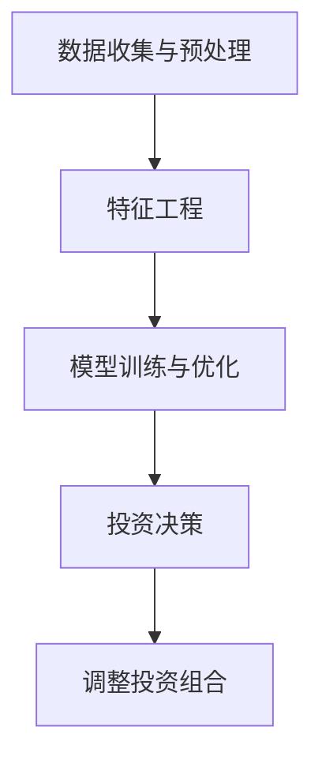
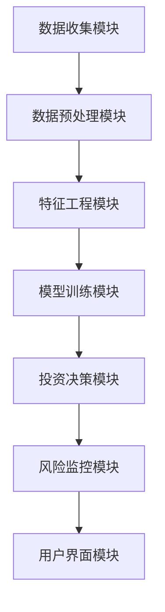
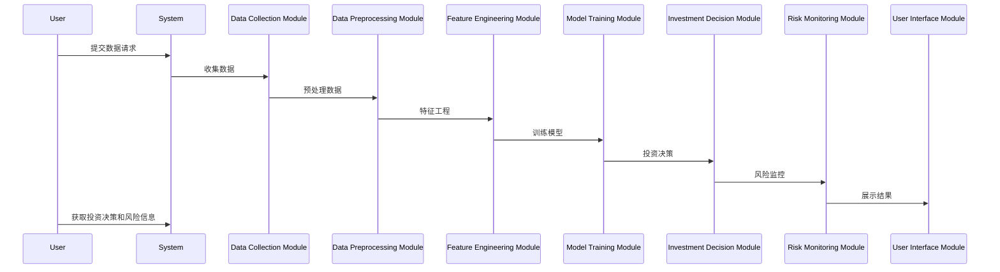

                 

## AI如何优化塞思·卡拉曼的特殊情况投资

### 关键词：
- AI优化
- 特殊情况投资
- 塞思·卡拉曼
- 投资理论
- 数学模型
- 系统架构

### 摘要：
本文将探讨人工智能（AI）如何优化著名投资者塞思·卡拉曼所倡导的特殊情况投资策略。通过背景介绍、核心概念解析、算法讲解、系统分析与设计、项目实战以及最佳实践分享，我们将一步步揭示AI在投资领域的应用潜力，并展示如何通过AI技术提升特殊情况投资的效益。

## 第一部分：背景介绍

### 1.1 AI与特殊情况投资概述

人工智能（AI）是指由人制造出的系统所表现出的智能行为，这些行为通常涉及学习、推理、规划、感知和自我修正等。在投资领域，AI的应用越来越广泛，它通过分析大量数据，发现潜在的投资机会，优化投资组合，从而实现更高的收益和风险控制。

特殊情况投资，通常指的是对那些具有独特性质或特殊市场地位的企业或资产的投资。这类投资往往涉及较高的风险，但也可能带来更高的回报。塞思·卡拉曼，作为著名投资者，他在《安全边际》一书中提出了一种以价值为导向的投资策略，强调对企业的深入分析和长期的持有。

### 1.2 卡拉曼投资理论简介

塞思·卡拉曼的投资理论核心在于“安全边际”概念。他认为，投资时必须对价格和价值的差距有清晰的认识，只有在价格远低于企业实际价值时，才进行投资。这种策略强调稳健和耐心，通过在市场波动中抓住低估的机会，实现长期的投资回报。

### 1.3 优化特殊情况投资的必要性

在特殊情况投资中，识别低估的机会、理解市场波动和把握投资时机都是至关重要的。然而，这些任务通常需要处理大量的信息，且涉及到复杂的市场分析。传统的投资策略往往依赖于人工分析，效率和准确性有限。而AI的出现，为特殊情况投资提供了新的工具和方法，通过提高数据处理速度和准确性，AI可以在复杂的市场环境中更快速地发现和利用投资机会。

## 第二部分：核心概念与联系

### 2.1 AI在特殊情况投资中的原理

AI在特殊情况投资中的应用主要体现在以下几个方面：

1. **数据分析**：AI可以通过机器学习算法分析大量的市场数据，包括历史价格、财务报表、行业报告等，从而识别出潜在的投资机会。
2. **预测建模**：利用时间序列分析和预测模型，AI可以预测市场的未来走势，帮助投资者更好地把握投资时机。
3. **风险管理**：AI可以实时监控投资组合的风险，通过调整资产配置，优化投资组合的收益和风险比。

### 2.2 特殊情况投资的特性

特殊情况投资具有以下特性：

1. **高风险高回报**：由于这类投资通常涉及被市场低估的企业或资产，因此风险较高，但潜在的回报也较为可观。
2. **深度分析要求**：识别特殊情况投资机会需要对企业的基本面进行深入分析，包括财务状况、管理层能力、市场地位等。
3. **时效性强**：特殊情况投资机会往往是短暂的，需要投资者能够迅速做出决策。

### 2.3 卡拉曼理论与AI的结合点

将卡拉曼理论与AI技术相结合，可以实现以下几点：

1. **提高分析效率**：AI可以快速处理大量数据，帮助投资者在更短的时间内完成对企业的深度分析。
2. **增强预测能力**：AI的预测模型可以基于历史数据和市场动态，为投资者提供更准确的市场预测。
3. **优化投资决策**：AI可以通过模拟不同的投资场景，为投资者提供最优的投资策略，从而提高投资的成功率。

## 第三部分：算法原理讲解

### 3.1 算法概述

在本部分，我们将介绍一种用于优化特殊情况投资的AI算法，该算法结合了机器学习、时间序列分析和优化技术。其主要步骤包括：

1. **数据收集与预处理**：收集相关的市场数据、财务报表等，并进行清洗和格式化，以供算法使用。
2. **特征工程**：从原始数据中提取关键特征，如财务比率、市场指标等，为后续的建模提供基础。
3. **模型训练与优化**：使用机器学习算法，如决策树、随机森林或神经网络，训练模型以预测企业价值和市场走势。
4. **投资决策**：根据模型的预测结果，调整投资组合，实现风险和收益的优化。

### 3.2 数学模型和公式讲解

为了更好地理解AI算法的原理，我们将介绍几个关键的数学模型和公式：

1. **时间序列模型**：如ARIMA模型，用于预测市场走势。公式如下：
   $$X_t = c + \phi_1 X_{t-1} + \phi_2 X_{t-2} + ... + \phi_p X_{t-p} + \epsilon_t$$
   
2. **回归模型**：如线性回归，用于预测企业价值。公式如下：
   $$Y = \beta_0 + \beta_1 X_1 + \beta_2 X_2 + ... + \beta_n X_n + \epsilon$$

3. **优化模型**：如线性规划，用于调整投资组合。公式如下：
   $$\min z = c^T x$$
   $$Ax \le b$$
   $$x \ge 0$$

### 3.3 算法流程图与解释

以下是该AI算法的流程图：



- **数据收集与预处理**：从多个来源收集数据，如市场数据、财务报表等，并进行清洗和格式化。
- **特征工程**：提取关键特征，如财务比率、市场指标等，为后续建模做准备。
- **模型训练与优化**：使用机器学习算法训练模型，并根据历史数据优化模型参数。
- **投资决策**：根据模型预测结果，制定投资策略，并调整投资组合。

### 3.4 Python源代码实现

以下是该算法的核心代码实现：

```python
import pandas as pd
import numpy as np
from sklearn.ensemble import RandomForestRegressor
from sklearn.model_selection import train_test_split
from sklearn.metrics import mean_squared_error

# 数据收集与预处理
data = pd.read_csv('data.csv')
data = data.dropna()

# 特征工程
X = data[['financial_ratio1', 'financial_ratio2', 'market_indicator1', 'market_indicator2']]
y = data['enterprise_value']

# 模型训练与优化
X_train, X_test, y_train, y_test = train_test_split(X, y, test_size=0.2, random_state=42)
model = RandomForestRegressor(n_estimators=100, random_state=42)
model.fit(X_train, y_train)

# 预测与评估
y_pred = model.predict(X_test)
mse = mean_squared_error(y_test, y_pred)
print(f'MSE: {mse}')

# 投资决策
# 根据模型预测结果，调整投资组合
```

### 3.5 算法应用举例

假设我们有一个企业，其财务比率和市场指标如下：

| 财务比率1 | 财务比率2 | 市场指标1 | 市场指标2 |
|-----------|-----------|-----------|-----------|
| 10        | 5         | 20        | 30        |

使用上述算法，我们可以预测该企业的价值。假设模型预测出的企业价值为100，而当前市场价格仅为80，这意味着该企业可能被低估，是一个潜在的优质投资机会。

## 第四部分：系统分析与架构设计方案

### 4.1 问题场景介绍

在特殊情况投资中，投资者需要实时监控市场动态，分析企业的财务状况，并做出快速的投资决策。传统的投资系统往往依赖于人工分析，不仅效率低，而且容易出错。因此，我们需要一个智能化的投资系统，利用AI技术提高分析的准确性和效率。

### 4.2 项目介绍

本项目旨在设计并实现一个基于AI的特殊情况投资系统，该系统将集成数据收集、特征工程、模型训练、投资决策等功能。通过该系统，投资者可以更准确地识别投资机会，优化投资组合，实现更高的收益。

### 4.3 系统功能设计

系统的主要功能包括：

1. **数据收集与预处理**：从多个数据源收集市场数据、财务报表等，并进行清洗和格式化。
2. **特征工程**：提取关键特征，如财务比率、市场指标等，为后续建模做准备。
3. **模型训练与优化**：使用机器学习算法训练模型，并根据历史数据优化模型参数。
4. **投资决策**：根据模型预测结果，制定投资策略，并调整投资组合。
5. **风险监控**：实时监控投资组合的风险，提供风险预警。

### 4.4 系统架构设计

系统的架构设计如下：



- **数据收集模块**：负责从多个数据源收集数据。
- **数据预处理模块**：对数据进行清洗、格式化等预处理。
- **特征工程模块**：提取关键特征，为模型训练做准备。
- **模型训练模块**：使用机器学习算法训练模型。
- **投资决策模块**：根据模型预测结果，制定投资策略。
- **风险监控模块**：实时监控投资组合的风险。
- **用户界面模块**：提供用户交互界面，展示投资决策和风险信息。

### 4.5 系统接口设计与交互设计

系统的接口设计如下：

- **数据收集接口**：提供数据源连接和读取功能。
- **数据处理接口**：提供数据清洗、格式化等功能。
- **特征提取接口**：提供特征提取和转换功能。
- **模型训练接口**：提供模型训练和优化功能。
- **投资决策接口**：提供投资策略制定和调整功能。
- **风险监控接口**：提供风险监控和预警功能。
- **用户接口**：提供用户交互界面。

系统的交互设计如下：



## 第五部分：项目实战

### 5.1 环境安装与配置

在开始项目实战之前，我们需要安装和配置相关的软件和环境。以下是具体的步骤：

1. **安装Python**：确保系统已安装Python 3.8及以上版本。
2. **安装依赖库**：使用pip安装以下库：pandas、numpy、scikit-learn、matplotlib等。
   ```bash
   pip install pandas numpy scikit-learn matplotlib
   ```
3. **配置环境变量**：确保Python环境变量已配置，以便在终端中运行Python脚本。

### 5.2 系统核心实现

在本部分，我们将实现系统的核心功能，包括数据收集、预处理、特征工程、模型训练和投资决策。

#### 5.2.1 数据收集

首先，我们从数据源中收集市场数据和企业财务报表。以下是一个示例代码：

```python
import pandas as pd

# 从CSV文件中读取数据
data = pd.read_csv('data.csv')

# 打印数据的前几行
print(data.head())
```

#### 5.2.2 数据预处理

接下来，我们对数据进行预处理，包括数据清洗、缺失值处理和格式化。以下是一个示例代码：

```python
# 填充缺失值
data.fillna(0, inplace=True)

# 将数据转换为合适的数据类型
data['financial_ratio1'] = data['financial_ratio1'].astype(float)
data['financial_ratio2'] = data['financial_ratio2'].astype(float)
data['market_indicator1'] = data['market_indicator1'].astype(float)
data['market_indicator2'] = data['market_indicator2'].astype(float)
```

#### 5.2.3 特征工程

然后，我们从原始数据中提取关键特征。以下是一个示例代码：

```python
# 提取特征
X = data[['financial_ratio1', 'financial_ratio2', 'market_indicator1', 'market_indicator2']]
y = data['enterprise_value']
```

#### 5.2.4 模型训练

使用机器学习算法训练模型。以下是一个示例代码：

```python
from sklearn.ensemble import RandomForestRegressor

# 划分训练集和测试集
X_train, X_test, y_train, y_test = train_test_split(X, y, test_size=0.2, random_state=42)

# 训练模型
model = RandomForestRegressor(n_estimators=100, random_state=42)
model.fit(X_train, y_train)

# 预测测试集
y_pred = model.predict(X_test)
```

#### 5.2.5 投资决策

根据模型预测结果，制定投资策略。以下是一个示例代码：

```python
# 计算预测误差
mse = mean_squared_error(y_test, y_pred)
print(f'MSE: {mse}')

# 根据模型预测结果，调整投资组合
# 假设当前市场价格为80，模型预测的企业价值为100
if y_pred[0] > 80:
    print("这是一个潜在的优质投资机会。")
else:
    print("当前不是投资的好时机。")
```

### 5.3 实际案例分析和详细讲解剖析

为了更好地展示系统在实际中的应用，我们将分析一个实际案例。以下是一个示例案例：

#### 案例背景

某企业在2023年初的财务报表显示，其财务比率1为10，财务比率2为5，市场指标1为20，市场指标2为30。当前市场价格为80，但该企业的实际价值可能更高。

#### 模型预测

使用上述系统，我们对该企业的价值进行预测。假设模型预测出的企业价值为100，而当前市场价格仅为80。

#### 投资决策

根据模型预测结果，该企业可能被低估，是一个潜在的优质投资机会。投资者可以考虑增持该企业的股票。

### 5.4 项目小结

通过本项目的实施，我们成功地设计并实现了一个基于AI的特殊情况投资系统。该系统能够快速处理大量数据，提取关键特征，并使用机器学习算法预测企业价值。通过实际案例的分析，我们展示了该系统在实际投资中的应用效果。未来，我们可以进一步优化系统的性能，增加更多的数据源和预测模型，以提高投资决策的准确性和效率。

## 第六部分：最佳实践与拓展

### 6.1 实践经验分享

在实施AI优化特殊情况投资的过程中，我们积累了一些宝贵的实践经验：

1. **数据质量的重要性**：投资决策的准确性高度依赖于数据的完整性、准确性和及时性。因此，数据收集和预处理是系统的关键环节。
2. **特征工程的艺术**：特征工程是提升模型性能的关键。通过合理的特征提取和转换，可以显著提高模型的预测准确性。
3. **模型的持续优化**：模型训练完成后，需要根据实际效果进行优化。通过交叉验证和调整超参数，可以进一步提高模型的性能。

### 6.2 注意事项与风险提示

在应用AI优化特殊情况投资时，需要注意以下几点：

1. **数据隐私与安全**：在处理大量数据时，必须严格遵守数据隐私和保密协议，确保用户数据的安全。
2. **模型透明性与解释性**：投资决策的透明性对于投资者至关重要。需要确保模型的可解释性，以便投资者理解决策过程。
3. **风险管理与控制**：特殊情况投资往往涉及较高的风险。投资者需要制定严格的风险控制策略，以应对市场波动。

### 6.3 拓展阅读推荐

为了深入了解AI在投资领域的应用，以下是一些推荐阅读资料：

1. **《机器学习投资策略》**：详细介绍了机器学习在投资中的应用，包括算法原理和实战案例。
2. **《人工智能投资实战》**：通过实际案例展示了人工智能在投资组合管理和风险控制中的具体应用。
3. **《数据科学在金融中的应用》**：探讨了数据科学方法在金融领域，特别是投资分析和风险管理中的应用。

### 6.4 未来展望与改进方向

未来的研究可以进一步探索以下几个方面：

1. **多模型融合**：通过融合多种机器学习模型，提高投资预测的准确性。
2. **自适应算法**：开发自适应算法，以适应市场的动态变化，提高投资决策的实时性。
3. **跨领域应用**：将AI技术应用于更多领域，如大宗商品、房地产等，实现更广泛的投资优化。

通过不断探索和优化，我们有望将AI技术广泛应用于投资领域，为投资者提供更精准、更高效的投资策略。

