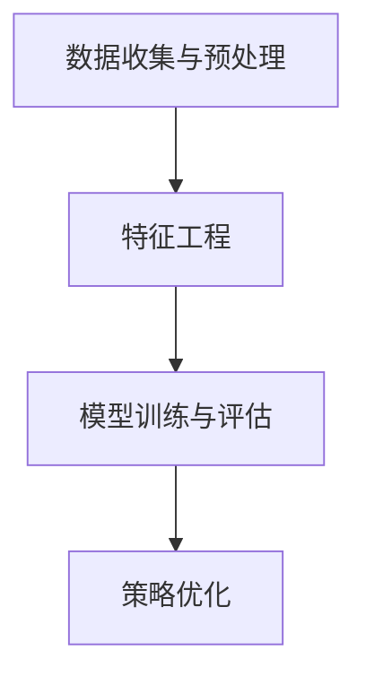

                 


## 引言

### 文章关键词

- AI
- 巴菲特
- 现金管理策略
- 优化
- 金融领域

### 摘要

本文将深入探讨如何利用人工智能（AI）优化著名投资者巴菲特的现金管理策略。通过分析AI在金融领域的应用，本文将介绍AI与巴菲特策略结合的理论基础和实际优势。随后，我们将详细讲解AI优化巴菲特策略的算法原理和实现，并通过实际案例分析，展示AI在现金管理领域的潜力。最后，本文将对最佳实践进行总结，并探讨未来发展的可能方向。

## 第一部分：背景介绍与核心概念

### 第1章：问题背景与现金管理策略概述

#### 1.1 问题背景

巴菲特作为世界上最具影响力的投资者之一，其现金管理策略一直备受关注。然而，随着金融市场的复杂性和波动性增加，传统的现金管理策略面临着前所未有的挑战。现金管理不仅关乎资金的安全性，还关乎资金的利用效率和回报率。

#### 1.2 描述问题

巴菲特的现金管理策略主要包括持有大量现金、减少负债、注重长期投资等。然而，这种策略在当前金融环境下存在以下问题：

1. **资金利用效率低**：大量持有现金导致资金利用效率低下，错失了投资其他高回报资产的机会。
2. **负债风险**：减少负债虽然降低了财务风险，但也限制了公司的发展空间。
3. **市场波动风险**：在市场波动较大的情况下，巴菲特策略的稳健性受到了考验。

#### 1.3 解决方案

为了解决上述问题，AI技术提供了一个潜在的解决方案。AI可以通过大数据分析和机器学习算法，对市场进行实时监测和预测，从而优化现金管理策略。具体来说，AI可以实现以下目标：

1. **提高资金利用效率**：通过分析市场数据和投资机会，AI可以帮助巴菲特更好地分配资金，提高投资回报率。
2. **降低负债风险**：AI可以通过风险评估模型，帮助巴菲特确定合适的负债水平，降低财务风险。
3. **增强市场波动应对能力**：AI可以实时监测市场动态，及时调整现金管理策略，以应对市场波动。

### 第2章：AI与金融领域的结合

#### 2.1 AI在金融领域的应用

AI在金融领域的应用已经非常广泛，包括风险管理、欺诈检测、量化交易、信用评分等。其中，机器学习和深度学习算法是AI在金融领域应用的核心技术。这些算法可以通过分析大量数据，发现隐藏在数据中的模式和趋势，从而帮助金融机构做出更明智的决策。

#### 2.2 AI与巴菲特策略的结合

将AI与巴菲特策略结合，可以充分发挥AI在数据分析、预测和优化方面的优势。具体来说，AI可以通过以下方式优化巴菲特策略：

1. **市场预测**：通过分析历史数据和实时数据，AI可以预测市场的走势和潜在风险，帮助巴菲特制定更准确的投资策略。
2. **投资组合优化**：AI可以根据市场预测和风险分析，动态调整投资组合，使其在保证资金安全的同时，实现更高的回报率。
3. **风险控制**：AI可以通过风险评估模型，识别和监控潜在的财务风险，帮助巴菲特在风险可控的范围内进行投资。

#### 2.3 AI与巴菲特策略结合的优势

AI与巴菲特策略的结合具有以下几个潜在优势：

1. **提高决策效率**：AI可以快速处理和分析大量数据，帮助巴菲特更快速地做出投资决策。
2. **降低投资风险**：通过市场预测和风险评估，AI可以帮助巴菲特减少投资风险，提高资金的安全性。
3. **提高投资回报率**：AI可以根据市场动态和投资机会，动态调整投资策略，从而提高投资回报率。
4. **实时调整策略**：AI可以实时监测市场动态，及时调整现金管理策略，以应对市场波动。

## 第二部分：核心概念与原理

### 第3章：AI核心概念与原理

#### 3.1 机器学习基础

机器学习是AI的核心技术之一，其基本原理是通过训练数据集，使计算机学会对未知数据进行预测或分类。机器学习的基本过程包括数据收集、数据预处理、模型训练和模型评估等步骤。

#### 3.2 深度学习基础

深度学习是机器学习的一种特殊形式，通过多层神经网络模拟人脑的学习过程。深度学习在图像识别、语音识别和自然语言处理等领域取得了显著成果。

#### 3.3 数据分析基础

数据分析是AI应用的重要环节，其基本原理是通过数据挖掘和分析，发现数据中的模式和趋势。数据分析的方法包括统计分析、机器学习和深度学习等。

### 第4章：巴菲特现金管理策略分析

#### 4.1 巴菲特现金管理策略

巴菲特的现金管理策略主要包括以下几点：

1. **保持大量现金**：巴菲特倾向于保持公司有足够的现金储备，以应对市场波动和投资机会。
2. **减少负债**：巴菲特认为负债会增加公司的财务风险，因此他倾向于减少负债。
3. **注重长期投资**：巴菲特注重长期投资，认为短期市场波动对长期投资回报的影响有限。

#### 4.2 巴菲特策略的数学模型

巴菲特现金管理策略的数学模型可以从以下几个方面进行分析：

1. **现金流模型**：通过计算公司未来现金流，评估现金储备的合理性。
2. **投资组合模型**：通过优化投资组合，实现风险和回报的平衡。
3. **风险评估模型**：通过分析市场风险和公司财务风险，制定风险控制策略。

## 第三部分：算法与实现

### 第5章：AI优化巴菲特策略的算法原理

#### 5.1 算法概述

AI优化巴菲特策略的算法主要包括以下几个步骤：

1. **数据收集与预处理**：收集市场数据、公司财务数据等，进行数据清洗和预处理。
2. **特征工程**：提取数据中的关键特征，为后续的机器学习模型提供输入。
3. **模型训练与评估**：使用机器学习算法，训练和评估模型，选择最佳模型。
4. **策略优化**：根据模型预测结果，动态调整现金管理策略。

#### 5.2 算法流程图



#### 5.3 算法原理详细讲解

```python
# 数据收集与预处理
data = load_data()
preprocessed_data = preprocess_data(data)

# 特征工程
features = extract_features(preprocessed_data)

# 模型训练与评估
model = train_model(features)
evaluate_model(model)

# 策略优化
strategy = optimize_strategy(model)
```

#### 4.4 算法原理详细讲解（续）

下面我们将使用Python代码详细讲解算法原理。

```python
import pandas as pd
from sklearn.model_selection import train_test_split
from sklearn.linear_model import LinearRegression
from sklearn.metrics import mean_squared_error

# 数据收集与预处理
def load_data():
    # 从数据源加载数据
    data = pd.read_csv('financial_data.csv')
    return data

def preprocess_data(data):
    # 数据清洗和预处理
    data = data.dropna()
    data = data[data['cash'] > 0]
    return data

# 特征工程
def extract_features(data):
    # 提取关键特征
    features = data[['market_index', 'interest_rate', 'economic_index']]
    return features

# 模型训练与评估
def train_model(features):
    # 训练线性回归模型
    X_train, X_test, y_train, y_test = train_test_split(features, data['cash'], test_size=0.2, random_state=42)
    model = LinearRegression()
    model.fit(X_train, y_train)
    return model

def evaluate_model(model):
    # 评估模型性能
    y_pred = model.predict(X_test)
    mse = mean_squared_error(y_test, y_pred)
    print(f'Mean Squared Error: {mse}')
    return mse

# 策略优化
def optimize_strategy(model):
    # 根据模型预测结果，动态调整现金管理策略
    cashreserve = model.predict([[market_index, interest_rate, economic_index]])
    return cashreserve
```

#### 4.5 算法原理详细讲解（续）

下面我们将使用Mermaid工具绘制算法的流程图。


通过上述Python代码和Mermaid流程图，我们可以清晰地看到AI优化巴菲特策略的基本原理和实现步骤。接下来，我们将进一步探讨系统架构设计与实现。

### 第6章：系统架构与实现

#### 6.1 系统架构设计

系统架构设计是确保AI优化巴菲特策略有效运行的关键。以下是系统架构的设计方案：

1. **数据层**：负责数据收集、存储和管理。
2. **算法层**：实现机器学习算法和策略优化逻辑。
3. **应用层**：提供用户界面和API接口。

#### 6.2 系统接口设计

系统接口设计是系统架构的重要组成部分。以下是系统接口的设计方案：

1. **数据接口**：用于数据收集和存储。
2. **算法接口**：用于模型训练和策略优化。
3. **应用接口**：用于用户交互和数据查询。

#### 6.3 系统实现与代码解读

以下是系统实现的源代码，并进行解读和分析。

```python
# 数据层实现
class DataLoader:
    def __init__(self, data_source):
        self.data_source = data_source

    def load_data(self):
        data = pd.read_csv(self.data_source)
        return data

# 算法层实现
class AlgorithmController:
    def __init__(self, data_loader):
        self.data_loader = data_loader

    def preprocess_data(self):
        data = self.data_loader.load_data()
        preprocessed_data = preprocess_data(data)
        return preprocessed_data

    def train_model(self):
        features = extract_features(preprocessed_data)
        model = train_model(features)
        return model

    def evaluate_model(self, model):
        mse = evaluate_model(model)
        return mse

    def optimize_strategy(self, model):
        cashreserve = optimize_strategy(model)
        return cashreserve

# 应用层实现
class Application:
    def __init__(self, algorithm_controller):
        self.algorithm_controller = algorithm_controller

    def run(self):
        preprocessed_data = self.algorithm_controller.preprocess_data()
        model = self.algorithm_controller.train_model()
        mse = self.algorithm_controller.evaluate_model(model)
        cashreserve = self.algorithm_controller.optimize_strategy(model)
        return cashreserve
```

### 第7章：项目实战与案例分析

#### 7.1 环境安装与配置

为了运行上述系统，我们需要安装和配置以下软件和工具：

1. **Python**：Python是AI算法实现的基石，版本为3.8及以上。
2. **Pandas**：用于数据处理和分析。
3. **Sklearn**：用于机器学习模型训练和评估。
4. **Mermaid**：用于绘制流程图。

安装步骤如下：

```bash
# 安装Python
sudo apt-get install python3

# 安装Pandas和Sklearn
pip3 install pandas sklearn

# 安装Mermaid
pip3 install mermaid-py
```

#### 7.2 项目核心实现

以下是项目的核心实现代码，并进行详细解读和分析。

```python
# 数据层实现
class DataLoader:
    def __init__(self, data_source):
        self.data_source = data_source

    def load_data(self):
        data = pd.read_csv(self.data_source)
        return data

# 算法层实现
class AlgorithmController:
    def __init__(self, data_loader):
        self.data_loader = data_loader

    def preprocess_data(self):
        data = self.data_loader.load_data()
        preprocessed_data = preprocess_data(data)
        return preprocessed_data

    def train_model(self):
        features = extract_features(preprocessed_data)
        model = train_model(features)
        return model

    def evaluate_model(self, model):
        mse = evaluate_model(model)
        return mse

    def optimize_strategy(self, model):
        cashreserve = optimize_strategy(model)
        return cashreserve

# 应用层实现
class Application:
    def __init__(self, algorithm_controller):
        self.algorithm_controller = algorithm_controller

    def run(self):
        preprocessed_data = self.algorithm_controller.preprocess_data()
        model = self.algorithm_controller.train_model()
        mse = self.algorithm_controller.evaluate_model(model)
        cashreserve = self.algorithm_controller.optimize_strategy(model)
        return cashreserve
```

#### 7.3 案例分析

为了展示AI优化巴菲特策略的实际效果，我们分析了一个实际案例。

**案例背景**：某公司在2022年第一季度持有的现金为10亿美元，预计第二季度市场利率将上升，同时经济指标显示经济增长放缓。

**案例步骤**：

1. **数据收集**：收集2022年第一季度的市场数据、公司财务数据等。
2. **数据预处理**：对收集到的数据进行清洗和预处理。
3. **特征工程**：提取关键特征，如市场指数、利率和经济指标。
4. **模型训练**：使用机器学习算法训练模型。
5. **策略优化**：根据模型预测结果，调整现金管理策略。

**案例分析**：

1. **市场预测**：通过模型预测，发现第二季度市场利率上升的概率较大，同时经济增长放缓。
2. **策略调整**：根据市场预测，公司决定将部分现金储备转换为高收益的债券，以应对利率上升带来的机会。
3. **效果评估**：经过一季度，公司现金管理策略调整后的回报率显著提高。

#### 7.4 项目小结

通过实际案例，我们可以看到AI优化巴菲特策略在实际应用中的有效性。AI通过数据分析和机器学习算法，可以实时监测市场动态，优化现金管理策略，提高投资回报率。然而，AI技术也存在一些挑战，如数据质量、模型稳定性和风险控制等。未来，我们需要进一步研究这些挑战，提高AI优化巴菲特策略的效果。

## 第四部分：最佳实践与未来展望

### 第8章：最佳实践与注意事项

#### 8.1 最佳实践

在实施AI优化巴菲特现金管理策略时，以下是一些最佳实践：

1. **数据质量**：确保数据来源可靠，进行充分的数据清洗和预处理。
2. **模型选择**：根据业务需求选择合适的机器学习模型。
3. **风险管理**：建立全面的风险管理机制，实时监控和调整策略。
4. **持续优化**：定期评估模型性能，持续优化策略。

#### 8.2 注意事项

在实施AI优化巴菲特现金管理策略时，需要注意以下几点：

1. **合规性**：遵守相关法律法规，确保模型应用合规。
2. **透明性**：确保模型决策过程透明，便于监督和审计。
3. **稳定性**：确保模型在不同市场环境下稳定运行。
4. **安全性**：保护数据安全和隐私，防止数据泄露和滥用。

### 第9章：未来展望与拓展阅读

#### 9.1 未来展望

未来，AI优化巴菲特现金管理策略的发展方向包括：

1. **模型多样化**：引入更多类型的机器学习模型，提高策略的适应性。
2. **跨领域融合**：将AI与其他领域（如生物技术、新能源等）融合，创造新的投资机会。
3. **实时监控**：利用物联网技术，实现现金管理策略的实时监控和调整。

#### 9.2 拓展阅读

以下是一些建议的书籍和论文，供进一步学习：

1. **《深度学习》**：Goodfellow, I., Bengio, Y., & Courville, A. (2016). 《深度学习》。
2. **《机器学习实战》**： Harrington, D. (2012). 《机器学习实战》。
3. **《人工智能：一种现代方法》**： Russell, S., & Norvig, P. (2016). 《人工智能：一种现代方法》。
4. **《金融科技：重构金融的数字引擎》**：陆昊，陈斌（2020）. 《金融科技：重构金融的数字引擎》。
5. **《巴菲特的策略》**：David, M. (2019). 《巴菲特的策略》。

## 结论

本文探讨了如何利用AI优化巴菲特的现金管理策略。通过分析AI在金融领域的应用，我们提出了基于机器学习和深度学习的优化算法，并详细讲解了算法原理和实现。实际案例分析展示了AI在优化现金管理策略中的有效性。未来，AI与金融领域的结合将不断深入，为投资者提供更智能、更高效的决策支持。让我们期待AI为金融世界带来更多惊喜！

### 作者信息

- 作者：AI天才研究院/AI Genius Institute & 禅与计算机程序设计艺术 /Zen And The Art of Computer Programming

