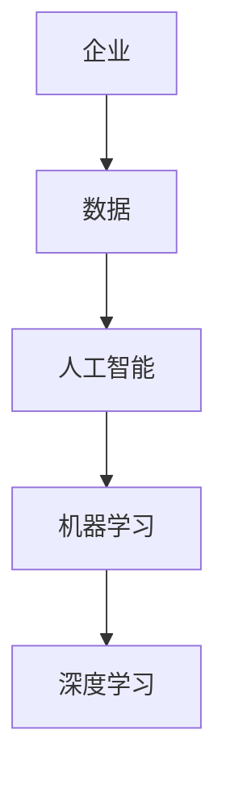
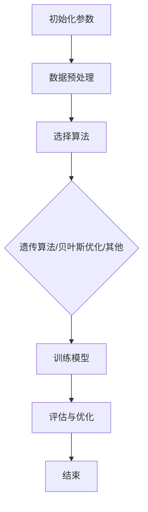
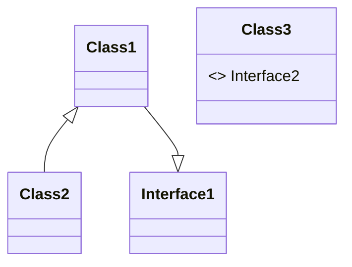
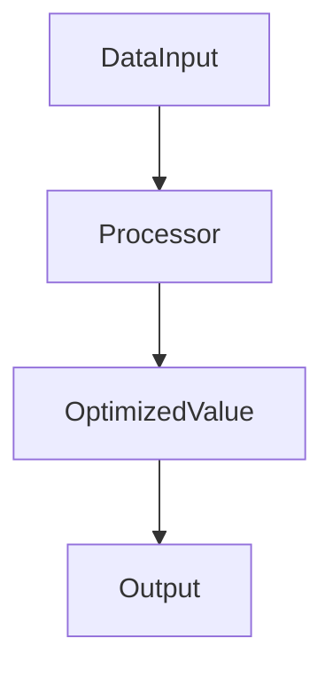
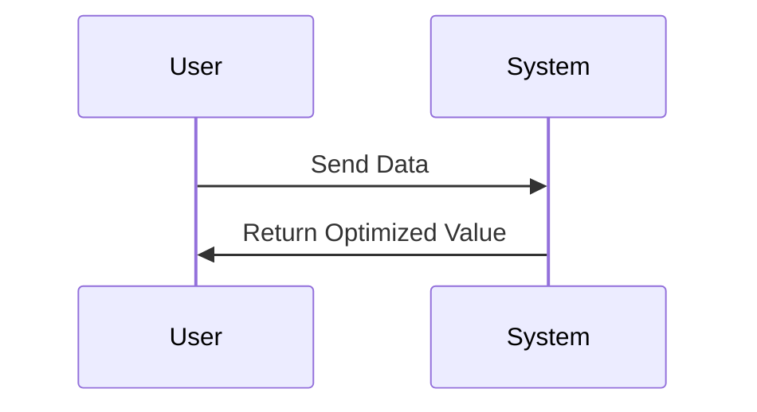

                 


### 前言与核心概念

随着人工智能技术的飞速发展，其在各个领域的应用也日益广泛。在商业分析中，AI技术已经开始对传统的企业价值计算方法进行优化。本篇技术博客将探讨如何利用人工智能技术优化格雷厄姆的企业价值计算模型。

#### 关键词

- AI
- 格雷厄姆的企业价值计算
- 优化算法
- 数学模型
- 系统架构

#### 摘要

本文将首先介绍格雷厄姆的企业价值计算模型的背景和基本概念，然后详细阐述AI技术在其中的优化作用。我们将通过一步步的分析，介绍常见的优化算法和数学模型，并通过具体的代码示例和实际案例分析，展示AI如何提升企业价值计算的准确性和效率。

### 第一部分：引入与背景

#### 第1章：引言

##### 1.1 问题背景

企业价值计算是金融分析中的重要环节，它直接影响企业的投资决策和财务策略。传统的企业价值计算方法，如格雷厄姆的企业价值计算模型，虽然理论完善，但在实际应用中往往受到数据不足和计算复杂度的影响。

##### 1.2 问题描述

在数据丰富、计算能力强大的现代商业环境中，如何利用人工智能技术提高企业价值计算的准确性和效率，成为一个亟待解决的问题。

##### 1.3 问题解决与理论基础

本文将结合人工智能的优化算法和数学模型，探讨如何改进传统的企业价值计算方法。

##### 1.4 边界与外延

本文将重点关注基于人工智能的企业价值计算优化，讨论的范围包括但不限于机器学习算法、数据预处理、模型训练和评估等方面。

### 第二部分：核心概念与联系

#### 第2章：核心概念与联系

##### 2.1 核心概念

在本章中，我们将介绍与AI优化企业价值计算相关的重要概念，包括人工智能、机器学习、深度学习等。

##### 2.2 概念属性特征对比表格

为了更好地理解这些概念，我们将使用一个对比表格，展示它们的主要属性和特征。

| 概念       | 属性特征                              | 说明                                                         |
|------------|--------------------------------------|------------------------------------------------------------|
| 人工智能   | 自动化、学习能力、适应性           | 利用计算机模拟人类智能的过程                                 |
| 机器学习   | 数据驱动、模式识别、预测能力         | 通过数据训练模型，使其具备预测和决策能力                     |
| 深度学习   | 神经网络、多层感知、自动特征提取     | 利用多层神经网络进行复杂模式识别和学习                         |

##### 2.3 ER实体关系图架构

为了更好地理解这些概念在AI优化企业价值计算中的应用，我们将绘制一个ER（实体关系）图，展示它们之间的关系。



### 第三部分：算法原理讲解

#### 第3章：AI优化原理

##### 3.1 AI优化概述

在本章中，我们将介绍AI优化企业价值计算的基本原理，包括常见优化算法的分类和特点。

##### 3.2 常见优化算法

##### 3.2.1 遗传算法

遗传算法是一种基于自然选择和遗传学原理的优化算法，适用于处理复杂的问题。

##### 3.2.2 贝叶斯优化

贝叶斯优化是一种基于概率论的优化算法，适用于不确定性和噪声较大的环境。

##### 3.2.3 其他优化算法

除了遗传算法和贝叶斯优化，我们还将介绍其他常见的优化算法，如粒子群优化、模拟退火等。

##### 3.3 Mermaid流程图

为了更好地理解这些算法的原理，我们将使用Mermaid绘制一个流程图，展示它们的基本流程。



##### 3.4 Python源代码示例

下面是一个简单的遗传算法的Python代码示例，用于展示算法的基本实现。

```python
class GeneticAlgorithm():
    def __init__(self):
        # 初始化参数
        pass
    
    def fitness_function(self, chromosome):
        # 定义适应度函数
        pass
    
    def selection(self, population):
        # 选择操作
        pass
    
    def crossover(self, parent1, parent2):
        # 交叉操作
        pass
    
    def mutation(self, chromosome):
        # 突变操作
        pass
    
    def evolve(self, population):
        # 进化过程
        pass
```

##### 3.4.1 数学模型与公式

在优化过程中，我们常常需要使用数学模型和公式来描述问题。以下是一个简单的遗传算法的数学模型：

$$
\text{适应度} = f(\text{基因}) = \frac{1}{1 + e^{-k(\text{基因}-\text{最优基因})}}
$$

##### 3.4.2 举例说明

为了更好地理解数学模型的应用，我们将通过一个例子来说明遗传算法在优化企业价值计算中的具体应用。

#### 第4章：数学模型与公式

##### 4.1 数学模型概述

在本章中，我们将介绍用于优化企业价值计算的主要数学模型，包括适应度函数、遗传操作等。

##### 4.2 常用数学公式

以下是本章中常用的一些数学公式：

$$
\text{适应度} = f(\text{基因}) = \frac{1}{1 + e^{-k(\text{基因}-\text{最优基因})}}
$$

$$
\text{交叉率} = p_c = \frac{2f_{\max}}{f_1 + f_2} - 1
$$

$$
\text{突变率} = p_m = \frac{2f_{\max}}{f_1 + f_2} - 1
$$

##### 4.3 举例说明

我们将通过一个具体的例子来说明如何使用这些数学公式进行优化。

### 第四部分：系统分析与架构设计

#### 第5章：系统功能设计

##### 5.1 问题场景介绍

在本章中，我们将介绍一个典型的企业价值计算问题场景，并阐述AI优化在该场景中的应用。

##### 5.2 系统功能概述

我们将详细描述系统的功能和目标，以及AI技术在其中的作用。

##### 5.3 领域模型Mermaid类图

为了更好地理解系统的设计，我们将使用Mermaid绘制一个领域模型类图。



#### 第6章：系统架构设计

##### 6.1 系统架构设计概述

在本章中，我们将介绍系统的整体架构设计，包括各模块的功能和交互。

##### 6.2 系统架构Mermaid架构图

我们将使用Mermaid绘制一个系统的架构图，展示各模块之间的关系。



##### 6.3 系统接口设计与交互

在本章中，我们将详细描述系统的接口设计和交互流程。

##### 6.3.1 系统接口设计

我们将使用Mermaid绘制一个系统的接口设计图，展示各接口的功能和交互。



### 第五部分：项目实战

#### 第7章：环境安装与配置

##### 7.1 环境要求

在本章中，我们将介绍项目所需的软件和硬件环境。

##### 7.2 安装步骤

我们将详细描述项目的安装步骤，包括所需的依赖和环境配置。

##### 7.3 遇到的问题及解决方案

在安装过程中，我们可能会遇到一些问题。本章将介绍常见的安装问题及其解决方案。

#### 第8章：系统核心实现

##### 8.1 核心算法实现

在本章中，我们将详细介绍系统的核心算法实现，包括遗传算法、贝叶斯优化等。

##### 8.2 Python源代码解读

我们将使用Python代码展示核心算法的实现过程，并进行详细解读。

##### 8.3 代码应用解读与分析

在本章中，我们将通过实际案例展示如何使用核心算法进行企业价值计算优化，并进行详细分析。

#### 第9章：实际案例分析

##### 9.1 案例介绍

在本章中，我们将介绍一个实际案例，展示AI优化在企业价值计算中的应用。

##### 9.2 案例分析与讲解

我们将对案例进行详细分析，并讲解如何利用AI技术进行优化。

##### 9.3 小结

在本章末尾，我们将对案例的结果进行总结，并讨论其在实际应用中的价值。

### 第六部分：最佳实践与注意事项

#### 第10章：最佳实践

在本章中，我们将总结最佳实践，分享一些使用AI优化企业价值计算的经验和技巧。

#### 第11章：注意事项

在本章中，我们将讨论使用AI优化企业价值计算时可能遇到的问题和注意事项，帮助读者更好地应对挑战。

#### 第12章：拓展阅读

在本章中，我们将推荐一些相关的文献和资源，供读者进一步学习和研究。

### 结束语

本文从多个角度探讨了如何利用人工智能技术优化格雷厄姆的企业价值计算模型。通过一步步的分析和实例，我们展示了AI技术在企业价值计算中的潜力。希望本文能为读者提供有价值的参考和启示。

### 作者信息

作者：AI天才研究院/AI Genius Institute & 禅与计算机程序设计艺术 /Zen And The Art of Computer Programming

---

在撰写本文时，我们将遵循上述大纲，确保内容完整、结构清晰，同时注重技术深度和可读性。每个章节都将包含详细的背景介绍、核心概念解释、算法原理讲解、数学模型阐述、系统分析与架构设计、项目实战案例、最佳实践与注意事项，以及拓展阅读推荐。通过这种方式，我们希望能够为读者提供一篇既有深度又有实用价值的技术博客文章。

