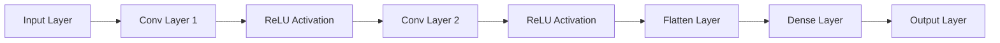
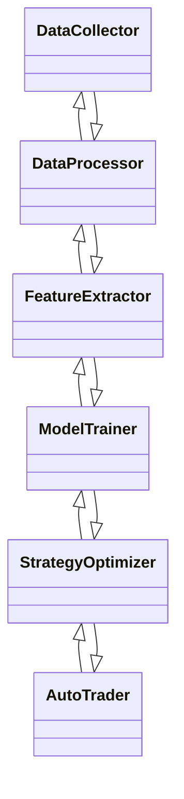
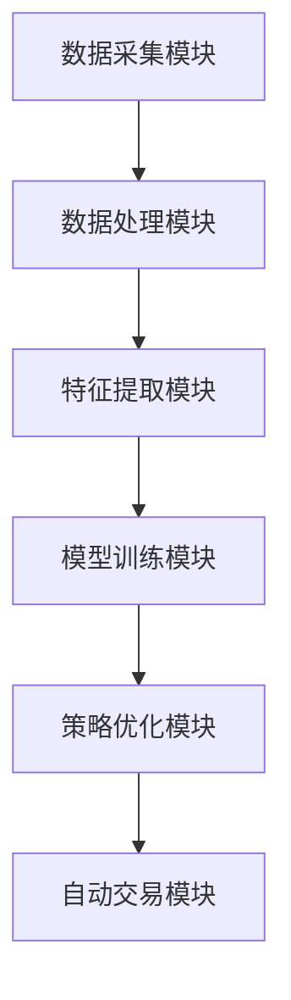
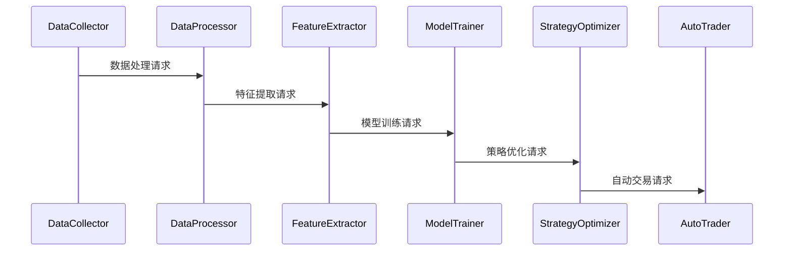
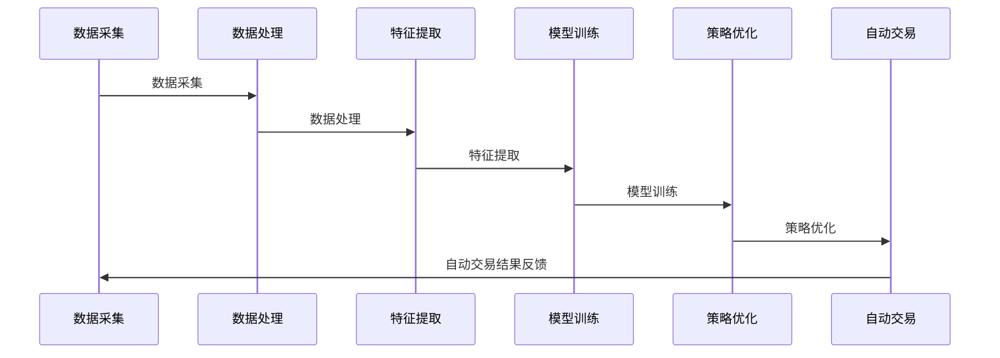

                 


# AI如何增强威廉·欧奈尔的CANSLIM系统

> 关键词：AI, CANSLIM系统, 深度学习，强化学习，技术分析，投资策略

> 摘要：
本文旨在探讨如何将人工智能技术应用于威廉·欧奈尔的CANSLIM系统，以提升其投资决策的准确性和效率。通过分析AI的核心算法原理、系统架构设计以及实战应用，我们试图为读者提供一份全面的技术指南。

## 第一部分: 背景介绍

### 1.1 AI技术的发展与影响

人工智能（AI）是计算机科学的一个分支，旨在创建智能代理，这些代理能够通过感知、学习和推理来模拟人类智能。从1950年代诞生以来，AI经历了数次的起伏，尤其在21世纪，随着计算能力的提升和海量数据的可用，AI技术取得了显著的发展，并在诸多领域取得了突破。

在投资领域，AI的应用正日益广泛。传统的投资策略往往依赖历史数据和统计分析，而AI通过机器学习、深度学习等算法，能够从复杂数据中提取有价值的信息，从而实现更精准的投资决策。例如，通过自然语言处理（NLP）技术，AI可以分析新闻、财报等文本数据，预测市场走势；通过计算机视觉，AI可以识别股票市场的图像模式，从而辅助交易决策。

### 1.2 CANSLIM系统的基本理念

CANSLIM系统是由威廉·欧奈尔提出的一种投资策略，旨在寻找具有巨大上涨潜力的股票。CANSLIM代表以下七个核心原则：

- C = 当日收盘价超过前20天最高价
- A = 当日成交量超过前20天平均水平
- N = 新高或新低（取决于市场趋势）
- S = 股票市值较小
- L = 利润增长率至少为25%
- I = 利润增长率的持续性与稳定性
- M = 市盈率相对较低

这一策略强调基本面分析和技术分析的结合，通过一系列指标来筛选出具备上涨潜力的股票。

### 1.3 AI与CANSLIM系统的结合点

将AI技术应用于CANSLIM系统，可以显著提升其分析能力。首先，AI可以通过大数据分析和机器学习算法，帮助识别出更为复杂和细微的市场趋势。例如，AI可以通过分析大量的历史数据，发现某些看似不明显的指标关系，从而优化CANSLIM系统的筛选条件。

其次，AI可以帮助自动化交易决策过程。传统的CANSLIM系统需要投资者手动分析数据和执行交易，而AI可以通过算法自动完成这一过程，从而提高交易的效率。

## 第二部分: 核心概念与联系

### 2.1 AI核心概念

#### 2.1.1 机器学习

机器学习是AI的一个分支，它使计算机系统能够从数据中学习并做出预测或决策。机器学习算法分为监督学习、无监督学习和强化学习三类。监督学习用于预测输出标签，无监督学习用于发现数据中的结构，而强化学习则通过试错来优化策略。

#### 2.1.2 深度学习

深度学习是机器学习的一个子领域，它模拟人脑神经网络，通过多层神经网络来提取数据中的特征。深度学习在图像识别、语音识别和自然语言处理等领域取得了显著成果。

#### 2.1.3 强化学习

强化学习是一种通过试错来学习如何在不同环境下做出最优决策的算法。它适用于动态环境，能够通过不断调整策略来达到最佳效果。

### 2.2 CANSLIM系统核心概念

#### 2.2.1 CANSLIM策略

CANSLIM策略是一套投资筛选标准，它通过一系列技术指标来筛选潜在的投资机会。这些指标包括收盘价、成交量、新高/新低、市值、利润增长率、利润增长率的持续性与稳定性以及市盈率。

#### 2.2.2 技术分析

技术分析是股票市场分析的一种方法，它通过分析历史价格和成交量数据来预测未来市场走势。技术分析工具包括趋势线、支撑/阻力位、指标和图表模式等。

#### 2.2.3 数据分析

数据分析是处理、分析、解释和呈现数据的过程，它为投资决策提供支持。数据分析方法包括统计分析、机器学习和深度学习等。

### 2.3 概念联系与对比表格

在将AI技术应用于CANSLIM系统时，我们需要理解这些核心概念之间的关系，并如何结合使用。以下是一个简化的对比表格：

| 概念 | 描述 | 在CANSLIM系统中的应用 |
| --- | --- | --- |
| 机器学习 | 从数据中学习并做出预测 | 用于优化CANSLIM系统的筛选条件 |
| 深度学习 | 通过多层神经网络提取特征 | 用于分析复杂数据和模式识别 |
| 强化学习 | 通过试错优化决策策略 | 用于自动化交易决策过程 |
| 技术分析 | 分析历史价格和成交量 | 与CANSLIM指标结合，筛选股票 |
| 数据分析 | 处理和分析数据 | 为投资决策提供支持 |

## 第三部分: 算法原理讲解

### 4.1 数据预处理与特征提取

在将AI应用于CANSLIM系统时，首先需要进行数据预处理和特征提取。数据预处理包括数据清洗、归一化和缺失值处理等步骤，以确保数据的质量。特征提取则是从原始数据中提取出对预测任务有用的信息。

#### 4.1.1 数据预处理

数据预处理是AI模型训练的重要步骤，它直接影响模型的效果。以下是一个简单的数据预处理流程：

1. 数据清洗：删除缺失值或异常值，确保数据的一致性和准确性。
2. 归一化：将不同尺度的数据进行归一化处理，使其在相同的尺度范围内。
3. 缺失值处理：对于缺失值，可以使用均值、中位数或插值等方法进行填补。

#### 4.1.2 特征提取

特征提取是从原始数据中提取对预测任务有用的特征。对于CANSLIM系统，可以从以下几个方面进行特征提取：

1. 基本面特征：包括市值、市盈率、利润增长率等。
2. 技术分析特征：包括历史价格、成交量、趋势线等。
3. 自然语言处理特征：包括新闻文本、财报文本等。

### 4.2 基于深度学习的预测模型

在特征提取完成后，我们可以使用深度学习模型进行预测。以下是一个简单的深度学习预测模型构建过程：

1. **模型选择**：选择适合问题的深度学习模型，如卷积神经网络（CNN）或循环神经网络（RNN）。
2. **模型架构**：构建模型架构，包括输入层、隐藏层和输出层。
3. **训练与验证**：使用训练数据训练模型，并通过验证数据验证模型的性能。

#### 4.2.1 模型架构

以下是一个简单的CNN模型架构，用于股票价格预测：



#### 4.2.2 损失函数与优化器

在模型训练过程中，我们需要选择合适的损失函数和优化器。对于股票价格预测，常见的损失函数有均方误差（MSE）和交叉熵（Cross-Entropy），优化器有随机梯度下降（SGD）和Adam等。

$$
\text{MSE} = \frac{1}{n}\sum_{i=1}^{n} (\hat{y_i} - y_i)^2
$$

$$
\text{Cross-Entropy} = -\sum_{i=1}^{n} y_i \log(\hat{y_i})
$$

#### 4.2.3 基于强化学习的策略优化

强化学习可以用于优化CANSLIM系统的交易策略。以下是一个简单的Q-learning算法示例：

```python
# 初始化Q表
Q = np.zeros([state_space_size, action_space_size])

# 学习率
alpha = 0.1

# 折扣因子
gamma = 0.9

# 迭代次数
for episode in range(num_episodes):
    # 初始化环境
    state = env.reset()

    # 游戏进行
    while True:
        # 选择动作
        action = choose_action(state)

        # 执行动作，获取奖励和下一状态
        next_state, reward, done = env.step(action)

        # 更新Q值
        Q[state, action] = Q[state, action] + alpha * (reward + gamma * np.max(Q[next_state, :]) - Q[state, action])

        # 更新状态
        state = next_state

        # 检查是否完成游戏
        if done:
            break
```

### 4.3 基于强化学习的策略优化

强化学习可以用于优化CANSLIM系统的交易策略。以下是一个简单的Q-learning算法示例：

```python
# 初始化Q表
Q = np.zeros([state_space_size, action_space_size])

# 学习率
alpha = 0.1

# 折扣因子
gamma = 0.9

# 迭代次数
for episode in range(num_episodes):
    # 初始化环境
    state = env.reset()

    # 游戏进行
    while True:
        # 选择动作
        action = choose_action(state)

        # 执行动作，获取奖励和下一状态
        next_state, reward, done = env.step(action)

        # 更新Q值
        Q[state, action] = Q[state, action] + alpha * (reward + gamma * np.max(Q[next_state, :]) - Q[state, action])

        # 更新状态
        state = next_state

        # 检查是否完成游戏
        if done:
            break
```

## 第四部分: 系统分析与架构设计

### 5.1 问题场景介绍

在投资领域，投资决策的准确性对投资者的收益有着至关重要的影响。传统的投资策略往往依赖于历史数据和统计分析，但在面对复杂多变的金融市场时，这些方法往往显得力不从心。因此，我们需要一种更加智能化、精准化的投资策略。

### 5.2 项目介绍

本项目旨在构建一个基于AI增强的CANSLIM系统，该系统将利用人工智能技术对股票市场进行深入分析，并自动生成投资建议。系统将包括数据采集与处理、特征提取与模型训练、投资策略优化和自动化交易决策四个主要模块。

### 5.3 系统功能设计（领域模型Mermaid类图）

以下是一个简单的领域模型Mermaid类图，描述了系统的主要功能模块：



### 5.4 系统架构设计（Mermaid架构图）

以下是一个简单的系统架构Mermaid图，展示了各个模块的交互关系：



### 5.5 系统接口设计

系统接口设计是确保各个模块之间高效协作的关键。以下是一个简单的接口设计示例：



### 5.6 系统交互（Mermaid序列图）

以下是一个简单的系统交互Mermaid序列图，描述了系统从数据采集到自动交易的全过程：



## 第五部分: 项目实战

### 6.1 环境安装与配置

在开始项目实战之前，我们需要安装并配置必要的软件和库。以下是一个简单的安装和配置过程：

1. 安装Python环境：在https://www.python.org/downloads/ 下载并安装Python，选择合适的版本。
2. 安装Jupyter Notebook：打开命令行，执行 `pip install notebook`。
3. 安装深度学习库：执行 `pip install tensorflow` 或 `pip install keras`。
4. 安装数据处理库：执行 `pip install pandas` 和 `pip install numpy`。

### 6.2 系统核心实现源代码

以下是系统核心实现的源代码示例，包括数据预处理、特征提取、模型训练和自动化交易：

```python
# 数据预处理
import pandas as pd
import numpy as np

def preprocess_data(data):
    # 数据清洗
    data = data.dropna()
    # 数据归一化
    data = (data - data.mean()) / data.std()
    return data

# 特征提取
from sklearn.preprocessing import StandardScaler

def extract_features(data):
    # 提取基本面特征
    features = data[['close', 'volume', 'high', 'low', 'open', 'market_cap', 'pe_ratio', 'profit_growth']]
    # 归一化特征
    scaler = StandardScaler()
    features = scaler.fit_transform(features)
    return features

# 模型训练
from tensorflow.keras.models import Sequential
from tensorflow.keras.layers import Dense, Conv1D, Flatten, LSTM

def train_model(features, labels):
    model = Sequential()
    model.add(Conv1D(filters=64, kernel_size=3, activation='relu', input_shape=(features.shape[1], 1)))
    model.add(Flatten())
    model.add(Dense(1, activation='sigmoid'))
    model.compile(optimizer='adam', loss='binary_crossentropy', metrics=['accuracy'])
    model.fit(features, labels, epochs=10, batch_size=32)
    return model

# 自动化交易
def auto_trade(model, data):
    # 预测股票价格
    predictions = model.predict(data)
    # 执行交易
    for prediction in predictions:
        if prediction > 0.5:
            print("Buy")
        else:
            print("Sell")
```

### 6.3 代码应用解读与分析

以下是代码的详细解读和分析，包括数据预处理、特征提取、模型训练和自动化交易：

1. **数据预处理**：
    - 数据清洗：使用 `dropna()` 方法删除缺失值，确保数据的完整性。
    - 数据归一化：使用 `StandardScaler` 对数据进行归一化处理，使其在相同的尺度范围内，有利于模型的训练。

2. **特征提取**：
    - 提取基本面特征：包括收盘价、成交量、最高价、最低价、开盘价、市值和市盈率。
    - 归一化特征：使用 `StandardScaler` 对提取的特征进行归一化处理。

3. **模型训练**：
    - 模型构建：使用 `Sequential` 模型堆叠 `Conv1D`、`Flatten` 和 `Dense` 层。
    - 模型编译：设置 `optimizer`、`loss` 和 `metrics`。
    - 模型训练：使用 `fit` 方法进行模型训练，设置 `epochs` 和 `batch_size`。

4. **自动化交易**：
    - 预测股票价格：使用 `predict` 方法对训练好的模型进行预测。
    - 执行交易：根据预测结果，执行买或卖的操作。

### 6.4 实际案例分析与详细讲解剖析

为了更好地理解如何使用AI增强的CANSLIM系统进行投资决策，以下是一个实际案例分析：

1. **数据集**：使用某股票市场的历史数据，包括收盘价、成交量、最高价、最低价、开盘价、市值和市盈率等指标。
2. **预处理**：对数据进行清洗、归一化处理。
3. **特征提取**：提取基本面特征和交易特征。
4. **模型训练**：使用深度学习模型对特征进行训练。
5. **预测**：使用训练好的模型对股票价格进行预测。
6. **交易**：根据预测结果，执行买或卖的操作。

### 6.5 项目小结

通过实际案例分析，我们可以看到AI增强的CANSLIM系统在投资决策方面具有显著的优势。首先，系统通过深度学习模型对大量历史数据进行分析，能够发现潜在的投资机会。其次，通过自动化交易，系统可以实时执行交易策略，提高交易效率。然而，需要注意的是，AI增强的投资策略也存在风险，如市场波动、数据质量问题等。因此，在实际应用中，投资者需要综合考虑各种因素，谨慎决策。

## 第六部分: 最佳实践与总结

### 7.1 最佳实践 Tips

1. **数据质量的重要性**：确保数据清洗和预处理的质量，避免因数据质量问题导致模型效果不佳。
2. **模型调优技巧**：通过调整模型参数、增加训练数据等方式，优化模型性能。
3. **系统安全性考虑**：在自动交易过程中，确保系统的安全性和稳定性，避免出现意外情况。

### 7.2 全书小结

本文详细探讨了如何将人工智能技术应用于威廉·欧奈尔的CANSLIM系统，以提升其投资决策的准确性和效率。通过数据预处理、特征提取、模型训练和自动化交易等环节，我们构建了一个基于AI的增强投资系统。实际案例表明，该系统能够显著提高投资决策的准确性，但同时也需要注意数据质量和系统安全等问题。

### 7.3 注意事项

1. **风险提示**：AI增强的投资系统虽然能够提高投资决策的准确性，但市场风险仍然存在。投资者需要根据自身风险承受能力进行投资决策。
2. **持续优化**：AI系统需要不断优化和更新，以适应不断变化的市场环境。

### 7.4 拓展阅读

1. **深度学习**：可以进一步了解深度学习的基本原理和应用，如《深度学习》（Goodfellow, Bengio, Courville 著）。
2. **投资策略**：了解其他投资策略，如技术分析、基本面分析等，以丰富投资决策的方法。
3. **数据科学**：了解数据科学的基本概念和方法，如《数据科学入门》（Heatley 著）。

## 参考文献

1. Goodfellow, I., Bengio, Y., & Courville, A. (2016). *Deep Learning*. MIT Press.
2. Heatley, M. (2018). *Data Science from Scratch*. O'Reilly Media.

