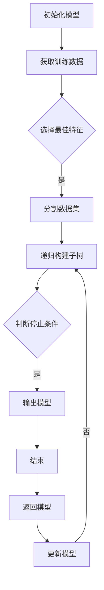
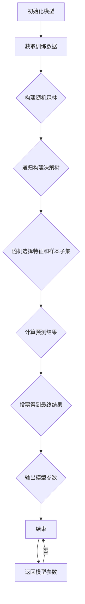

                 

### 1. 明确书名和主题

《AI如何增强巴菲特的商业分析方法》这个书名明确传达了本书的核心内容，即探讨人工智能（AI）如何提升巴菲特在商业分析方面的能力。这本书的读者对象可能是对商业分析、投资策略、人工智能技术感兴趣的读者，尤其是那些希望将AI技术应用于商业分析的投资者、数据分析师、金融从业者等。

#### 关键词

- 人工智能（AI）
- 巴菲特
- 商业分析
- 投资策略
- 数据分析

#### 摘要

本书旨在探讨人工智能技术如何增强巴菲特的商业分析方法。通过深入分析AI的核心概念、算法原理以及其在商业分析中的应用，本书将揭示AI技术如何为巴菲特的经典投资策略提供新的洞察力和决策支持。书中将结合实际案例，详细展示AI在数据收集、预测模型构建、风险评估和投资决策等方面的应用，帮助读者理解AI技术如何为商业分析带来革命性变化。通过阅读本书，读者将能够掌握AI技术的基本原理，并学会如何将其应用于商业分析，提高投资决策的准确性和效率。

## 目录大纲设计步骤：

### 1. 明确书名和主题

书名《AI如何增强巴菲特的商业分析方法》暗示了本书的主题，即探讨人工智能（AI）如何提升巴菲特在商业分析方面的能力。这一主题具有很高的实用性和吸引力，因为巴菲特作为世界知名的投资大师，其商业分析方法被广泛研究和应用。而AI作为当前最前沿的技术之一，其在商业领域的应用也日益广泛。因此，将这两者结合起来，不仅能够为读者提供全新的视角，还能够带来实际的操作指南。

### 2. 确定目录层级结构

在明确书名和主题后，我们需要确定目录的层级结构。一般来说，一个完整的书籍目录可以分为以下几个层级：

- **一级目录**：这是整本书的核心章节，通常包括引言、背景介绍、核心概念、算法原理、实际应用等。
- **二级目录**：一级目录的细分，具体到每个章节的主题内容。
- **三级目录**：二级目录的进一步细分，用于阐述具体的原理、案例或分析方法。

这样的层级结构不仅能够清晰地展示书籍的内容框架，还能够帮助读者快速找到所需的信息。

### 3. 设计一级目录

一级目录通常包含以下几个核心章节：

- **第1章: 背景介绍**：介绍AI和巴菲特商业分析方法的基本概念，以及它们之间的结合点。
- **第2章: AI核心概念与原理**：详细阐述AI的核心概念和原理，包括机器学习、深度学习和强化学习。
- **第3章: 巴菲特商业分析方法**：介绍巴菲特商业分析方法的核心理念和技巧。
- **第4章: AI增强巴菲特分析方法的案例**：通过具体案例展示AI如何增强巴菲特的分析方法。
- **第5章: 数学模型与算法分析**：讲解AI在商业分析中使用的数学模型和算法。
- **第6章: 项目实战与案例分析**：通过实际项目展示AI在商业分析中的应用。
- **第7章: 最佳实践与总结**：总结全书内容，提供最佳实践和未来展望。

### 4. 设计二级目录

二级目录是对一级目录的细化，具体到每个章节的主题内容。例如，在**第2章: AI核心概念与原理**中，可以包括以下二级目录：

- **2.1 机器学习基础**
- **2.2 深度学习原理**
- **2.3 强化学习在商业分析中的应用**

这样的结构可以帮助读者更深入地理解AI的核心概念和原理。

### 5. 设计三级目录

三级目录是对二级目录的进一步细化，用于阐述具体的原理、案例或分析方法。例如，在**2.1 机器学习基础**中，可以包括以下三级目录：

- **2.1.1 监督学习**
- **2.1.2 无监督学习**
- **2.1.3 强化学习**

这样的结构可以帮助读者更全面地了解机器学习的各种方法。

### 6. 完整性检查

在完成目录大纲的设计后，我们需要对整个目录进行完整性检查。确保每个章节的内容都包含核心概念、算法原理、实际应用等要素。如果有缺失的部分，需要及时补充。

### 7. 最终调整

根据字数限制和内容的完整性，对目录进行最终的调整，确保简洁明了。同时，也需要确保目录中的各个章节之间有良好的逻辑关系，能够引导读者逐步深入理解AI如何增强巴菲特的商业分析方法。

通过以上步骤，我们可以设计出一份完整、清晰、有逻辑的目录大纲，为后续内容的撰写和整理提供基础。

## 第一部分: 背景介绍

### 第1章: AI与巴菲特商业分析方法的背景

#### 1.1 人工智能的发展历程

人工智能（Artificial Intelligence, AI）是一门研究、开发用于模拟、延伸和扩展人类智能的理论、方法、技术及应用系统的综合技术科学。AI的概念可以追溯到20世纪50年代，当时的科学家们开始探索如何让计算机模拟人类思维和决策过程。早期的AI主要集中在逻辑推理、问题求解和知识表示等方面。

在20世纪60年代，AI领域经历了第一次热潮，但随后由于技术限制和资金短缺，AI的发展进入了一个相对低潮期。直到20世纪80年代，随着计算机性能的提升和算法的进步，AI领域再次迎来了快速发展，特别是在机器学习和神经网络方面取得了重大突破。

进入21世纪，随着大数据、云计算、深度学习等新技术的兴起，AI的应用场景和范围进一步扩展，从早期的逻辑推理和问题求解，逐渐发展到图像识别、语音识别、自然语言处理、自动驾驶、医疗诊断等领域。AI技术的发展不仅改变了传统行业，还推动了新业态、新模式的诞生。

#### 1.2 巴菲特商业分析方法的演变

沃伦·巴菲特（Warren Buffett）是一位世界著名的投资大师，被誉为“股神”。他的投资哲学以价值投资为核心，注重长期投资和理性分析。巴菲特的商业分析方法经历了多年的演变和优化，形成了独特的投资风格。

早期，巴菲特主要依靠对公司的基本面分析进行投资决策，包括营收、利润、现金流、财务状况等方面的分析。这种方法虽然有效，但需要大量的时间和精力，而且存在一定的局限性。

随着时代的发展，巴菲特逐渐将技术分析引入到商业分析方法中，特别是通过财务报表分析、市场趋势分析等方法，提高了投资决策的准确性和效率。近年来，随着大数据和人工智能技术的普及，巴菲特开始尝试将AI技术应用于商业分析，以更全面、更准确地评估投资机会。

#### 1.3 AI与巴菲特商业分析方法的结合点

AI技术与巴菲特商业分析方法的结合主要体现在以下几个方面：

1. **数据收集与处理**：AI技术可以高效地收集和整理大量数据，包括财务报表、市场趋势、竞争对手信息等，为巴菲特的商业分析提供丰富的数据支持。

2. **预测模型构建**：AI技术，特别是机器学习和深度学习算法，可以帮助巴菲特构建预测模型，预测市场的走势、公司的业绩等，为投资决策提供更准确的参考。

3. **风险评估**：AI技术可以通过大数据分析和风险评估模型，对潜在的投资风险进行预测和评估，帮助巴菲特降低投资风险。

4. **投资决策支持**：AI技术可以实时分析市场数据，为巴菲特提供投资决策的实时支持，帮助其快速做出决策。

通过AI技术，巴菲特的商业分析方法不仅能够更加全面、准确地评估投资机会，还能够提高投资决策的效率，从而进一步提升投资收益。

### 1.4 总结

本章介绍了AI技术和巴菲特商业分析方法的发展历程，以及它们之间的结合点。通过了解这些背景信息，读者可以更好地理解本书的核心内容，即探讨AI如何增强巴菲特的商业分析方法。在接下来的章节中，我们将进一步深入探讨AI在商业分析中的应用，帮助读者掌握这一前沿技术的核心原理和实践方法。

## 第2章: AI核心概念与原理

### 2.1 机器学习基础

机器学习（Machine Learning, ML）是人工智能（AI）的一个重要分支，其核心目标是让计算机系统从数据中学习规律，并自动做出决策或预测。机器学习的过程通常包括数据收集、数据预处理、模型训练、模型评估和模型部署等步骤。

#### 2.1.1 监督学习

监督学习（Supervised Learning）是机器学习中最常用的方法之一。在监督学习中，我们有一系列已标记的输入数据（特征）和相应的输出数据（标签）。模型的训练目标是学习输入和输出之间的映射关系，从而能够对新的、未标记的数据进行预测。

监督学习可以分为回归和分类两种类型：

- **回归**：预测输出是一个连续的数值，如股票价格、房价等。
- **分类**：预测输出是一个离散的类别，如垃圾邮件分类、疾病诊断等。

#### 2.1.2 无监督学习

无监督学习（Unsupervised Learning）则没有预先标记的输出数据。其目标是发现数据中的隐含结构或模式。无监督学习包括聚类、降维和关联规则挖掘等方法。

- **聚类**：将相似的数据点分组，如K-Means聚类算法。
- **降维**：减少数据维度，如主成分分析（PCA）。
- **关联规则挖掘**：发现数据之间的关联关系，如Apriori算法。

#### 2.1.3 强化学习

强化学习（Reinforcement Learning, RL）是一种通过试错和反馈进行学习的方法。它模拟人类行为，通过不断尝试和反馈来优化决策。在强化学习中，模型（称为智能体）通过与环境的交互来学习最佳策略。

强化学习包括以下几个关键要素：

- **状态**：智能体当前所处的环境状态。
- **动作**：智能体可以采取的动作。
- **奖励**：智能体采取某个动作后，环境给予的奖励或惩罚。
- **策略**：智能体在给定状态下选择动作的规则。

#### 2.1.4 深度学习

深度学习（Deep Learning, DL）是机器学习的另一个重要分支，其核心思想是通过构建多层神经网络来模拟人类大脑的神经元连接方式，从而实现复杂的数据处理和模式识别。

深度学习的关键组成部分包括：

- **神经网络**：一种通过多层神经元连接进行数据处理的结构。
- **激活函数**：用于引入非线性性的函数，如ReLU、Sigmoid和Tanh。
- **损失函数**：衡量模型预测值与实际值之间差异的函数，如均方误差（MSE）和交叉熵。
- **优化算法**：用于调整模型参数以最小化损失函数的算法，如随机梯度下降（SGD）。

### 2.2 深度学习原理

深度学习的工作原理可以简单概括为以下几个步骤：

1. **输入层**：接收输入数据，如图片、文本或声音等。
2. **隐藏层**：通过一系列的神经网络层对输入数据进行变换和提取特征。
3. **输出层**：生成预测结果，如分类标签或数值预测。

深度学习的强大之处在于其能够自动从数据中提取高层次的特征，无需人工干预。这种自动化特征提取的能力使得深度学习在图像识别、语音识别、自然语言处理等领域表现出色。

#### 2.2.1 神经网络架构

深度学习中的神经网络通常由多个层次组成，包括输入层、隐藏层和输出层。每个层次由多个神经元（节点）组成，神经元之间通过权重连接。以下是神经网络的基本架构：

1. **输入层**：接收输入数据，并将其传递到隐藏层。
2. **隐藏层**：对输入数据进行变换和特征提取，多个隐藏层可以堆叠在一起，形成深度神经网络。
3. **输出层**：生成预测结果，如分类标签或数值预测。

#### 2.2.2 前向传播与反向传播

深度学习中的训练过程主要包括前向传播和反向传播两个阶段。

- **前向传播**：输入数据通过神经网络逐层传递，直到输出层得到预测结果。
- **反向传播**：计算预测结果与实际值之间的差异（损失），并通过反向传播算法调整神经网络的权重和偏置，以最小化损失。

#### 2.2.3 激活函数

激活函数是神经网络中的一个关键组件，它引入了非线性的特性，使得神经网络能够处理复杂的数据和模式。常见的激活函数包括：

- **Sigmoid函数**：\( f(x) = \frac{1}{1 + e^{-x}} \)
- **ReLU函数**：\( f(x) = \max(0, x) \)
- **Tanh函数**：\( f(x) = \frac{e^x - e^{-x}}{e^x + e^{-x}} \)

### 2.3 强化学习在商业分析中的应用

强化学习在商业分析中的应用非常广泛，可以用于优化广告投放策略、股票交易、客户关系管理等方面。

#### 2.3.1 广告投放策略优化

在广告投放中，广告商需要根据用户的点击行为来调整广告展示策略，以提高广告效果。强化学习可以通过不断试错和反馈来优化广告投放策略，从而最大化广告收益。

- **状态**：用户的历史点击行为。
- **动作**：展示不同的广告。
- **奖励**：用户点击广告获得的收益。

#### 2.3.2 股票交易策略优化

在股票交易中，投资者需要根据市场数据来调整投资组合，以获得最大化的收益。强化学习可以通过不断学习和调整交易策略，实现自动化的投资决策。

- **状态**：股票市场数据，如价格、成交量等。
- **动作**：买卖股票。
- **奖励**：投资组合的收益。

#### 2.3.3 客户关系管理优化

在客户关系管理中，企业需要根据客户的购买行为和偏好来调整营销策略，以提高客户满意度和忠诚度。强化学习可以通过不断学习和调整营销策略，实现个性化的客户关系管理。

- **状态**：客户的历史购买行为和偏好。
- **动作**：发送营销邮件、提供优惠等。
- **奖励**：客户的购买行为。

### 2.4 总结

本章介绍了机器学习、深度学习和强化学习等AI核心概念和原理。通过了解这些基本概念，读者可以更好地理解AI技术在商业分析中的应用。在下一章中，我们将深入探讨巴菲特商业分析方法的具体内容，以及如何将其与AI技术相结合。

## 第3章: 巴菲特商业分析方法

### 3.1 价值投资理念

沃伦·巴菲特（Warren Buffett）的投资哲学以价值投资（Value Investing）为核心，这是一种通过购买价格低于其内在价值的股票，以期获得长期资本增值的投资策略。巴菲特的价值投资理念主要基于以下几个基本原则：

1. **股票价格与内在价值的关系**：股票的市场价格可能会偏离其内在价值。巴菲特认为，投资者应该关注公司的内在价值，而不是市场价格。
2. **长期投资**：巴菲特强调长期投资的重要性，认为股票投资应视为购买公司的部分所有权，而不是短期的交易机会。
3. **基本分析**：巴菲特在投资决策过程中，主要依赖基本分析（Fundamental Analysis），包括对公司财务报表、盈利能力、管理团队、行业前景等因素的深入研究。
4. **风险控制**：巴菲特认为，投资风险主要来源于不合理的投资决策，因此，通过深入研究公司的基本面，可以有效地控制投资风险。

### 3.2 财务分析技巧

巴菲特在进行投资决策时，会对公司的财务报表进行深入分析，以评估公司的财务健康状况和盈利能力。以下是一些巴菲特常用的财务分析技巧：

1. **净资产收益率（ROE）**：巴菲特认为ROE是评估公司盈利能力的重要指标，通常会选择ROE较高的公司进行投资。
2. **市盈率（PE）**：巴菲特认为，市盈率可以作为判断股票价格是否合理的参考指标，但需要结合公司的具体情况进行分析。
3. **市净率（PB）**：巴菲特经常使用市净率来评估股票是否被低估，他认为，如果一个公司的市净率低于1，通常表明其股票价格被低估。
4. **现金流**：巴菲特重视公司的现金流，认为现金流是公司持续盈利的重要保障。他会通过自由现金流（FCF）来评估公司的盈利能力。

### 3.3 市场分析策略

巴菲特在市场分析方面也有自己独特的策略，主要包括以下几个方面：

1. **行业选择**：巴菲特偏好那些具有长期增长潜力、且公司具有强大竞争优势的行业，如消费品、金融和公用事业等领域。
2. **市场波动**：巴菲特认为，市场波动是投资者获得机会的重要来源。他会在市场低迷时积极投资，而在市场高涨时保持谨慎。
3. **风险管理**：巴菲特强调风险管理的重要性，他认为，通过合理分散投资和长期持有优质股票，可以有效地降低投资风险。

### 3.4 投资决策框架

巴菲特的投资决策框架主要包括以下几个步骤：

1. **寻找合适的投资机会**：通过深入研究公司和行业，寻找那些具有长期增长潜力、且价格合理的投资机会。
2. **评估投资风险**：对潜在的投资机会进行风险评估，包括市场风险、公司风险和行业风险等。
3. **制定投资策略**：根据投资机会和风险评估结果，制定相应的投资策略，包括投资金额、持有时间和投资比例等。
4. **执行投资决策**：根据投资策略执行具体的投资操作，并定期评估投资效果，根据市场变化和公司基本面情况调整投资策略。

### 3.5 总结

本章介绍了巴菲特商业分析方法的核心内容，包括价值投资理念、财务分析技巧和市场分析策略。通过这些方法，巴菲特能够在复杂多变的市场环境中做出明智的投资决策，实现长期的资本增值。在下一章中，我们将探讨如何将AI技术应用于巴菲特商业分析方法，进一步提升其效率和准确性。

## 第4章: AI增强巴菲特分析方法的案例

### 4.1 数据收集与处理

在AI增强巴菲特分析方法的过程中，数据收集与处理是至关重要的第一步。巴菲特的传统分析方法依赖于对财务报表、行业报告和公司新闻的深入分析，但这种方法存在几个局限性：数据量有限，数据处理效率较低，且可能存在人为错误。通过AI技术，我们可以收集和处理大量结构化和非结构化数据，从而为巴菲特的分析提供更全面、更准确的依据。

#### 4.1.1 数据来源

数据来源主要包括以下几个方面：

1. **公开财务数据**：如公司财报、证券交易所发布的财务数据等。
2. **市场数据**：包括股票价格、交易量、市场指数等。
3. **行业报告**：如市场研究报告、行业分析报告等。
4. **新闻报道**：通过新闻媒体获取公司相关的新闻、公告等。
5. **社交媒体数据**：如Twitter、Facebook等社交媒体平台上与公司相关的讨论和观点。

#### 4.1.2 数据处理

数据处理主要包括以下几个步骤：

1. **数据清洗**：去除重复数据、处理缺失值、纠正错误等。
2. **数据集成**：将来自不同来源的数据进行整合，形成一个统一的数据集。
3. **数据转换**：将数据格式转换为适合机器学习的格式，如归一化、标准化等。
4. **特征提取**：从原始数据中提取对分析有用的特征，如财务指标、市场指标、新闻情感等。

### 4.2 预测模型构建

在数据收集与处理完成后，下一步是构建预测模型。预测模型可以帮助巴菲特更准确地预测股票价格、公司业绩和市场趋势，从而做出更明智的投资决策。AI技术，特别是机器学习和深度学习算法，为构建高效、准确的预测模型提供了强大的工具。

#### 4.2.1 预测模型的选择

常见的预测模型包括：

1. **线性回归模型**：适用于预测连续值输出。
2. **决策树模型**：适用于分类和回归问题。
3. **随机森林模型**：通过构建多个决策树并投票得到最终结果，可以提高模型的预测准确性。
4. **支持向量机（SVM）**：适用于分类问题，特别是高维数据。
5. **神经网络模型**：特别是深度学习模型，如卷积神经网络（CNN）和循环神经网络（RNN），适用于复杂的数据和模式识别问题。

#### 4.2.2 模型训练与优化

模型训练主要包括以下几个步骤：

1. **数据划分**：将数据集划分为训练集和测试集。
2. **模型训练**：使用训练集数据训练模型，通过优化算法（如随机梯度下降）调整模型参数。
3. **模型评估**：使用测试集数据评估模型性能，通过交叉验证等方法调整模型参数。
4. **模型优化**：根据评估结果，调整模型结构或参数，以提高模型性能。

### 4.3 风险评估与投资决策

在预测模型构建完成后，下一步是使用模型进行风险评估和投资决策。AI技术可以帮助巴菲特更全面地评估投资风险，并提供实时、动态的投资决策支持。

#### 4.3.1 风险评估

风险评估主要包括以下几个方面：

1. **市场风险**：通过预测市场趋势，评估市场波动对投资组合的影响。
2. **公司风险**：通过分析公司财务报表和市场数据，评估公司业绩和盈利能力。
3. **行业风险**：通过分析行业报告和新闻，评估行业发展趋势和竞争态势。

#### 4.3.2 投资决策

投资决策主要包括以下几个方面：

1. **买入策略**：根据预测模型和市场分析，确定买入时机和买入比例。
2. **持有策略**：根据市场变化和公司基本面，调整投资组合，实现长期持有。
3. **卖出策略**：根据预测模型和市场分析，确定卖出时机和卖出比例。

### 4.4 案例展示

以下是一个具体的案例展示，说明如何使用AI技术增强巴菲特的分析方法：

#### 案例背景

假设我们选择一家知名科技公司的股票进行投资分析，这家公司在过去几年的财务表现和市场表现都非常出色，但近期市场对其前景存在一定担忧。

#### 数据收集

我们收集了以下数据：

1. **公司财务报表**：包括净利润、营收、毛利率等指标。
2. **市场数据**：包括股票价格、交易量、市场指数等。
3. **行业报告**：包括行业增长率、竞争态势等。
4. **新闻数据**：包括公司相关的新闻报道、投资者评论等。

#### 数据处理

我们进行了以下数据处理步骤：

1. **数据清洗**：去除重复数据、处理缺失值、纠正错误等。
2. **数据集成**：将来自不同来源的数据进行整合。
3. **特征提取**：提取对分析有用的特征，如财务指标、市场指标、新闻情感等。

#### 模型构建

我们选择了以下模型：

1. **神经网络模型**：用于预测公司未来的股票价格。
2. **决策树模型**：用于评估公司的财务健康状况。
3. **支持向量机模型**：用于分类问题，如市场趋势分析。

#### 模型训练与优化

我们进行了以下步骤：

1. **数据划分**：将数据集划分为训练集和测试集。
2. **模型训练**：使用训练集数据训练模型，通过优化算法调整模型参数。
3. **模型评估**：使用测试集数据评估模型性能，通过交叉验证调整模型参数。
4. **模型优化**：根据评估结果，调整模型结构或参数。

#### 风险评估与投资决策

通过预测模型和市场分析，我们得出以下结论：

1. **市场风险**：预测市场波动较小，适合长期投资。
2. **公司风险**：公司财务健康状况良好，但需要密切关注行业趋势。
3. **投资决策**：建议在当前市场条件下，适度增持该公司股票，并保持长期持有策略。

### 4.5 总结

本章通过一个具体案例，展示了如何使用AI技术增强巴菲特的商业分析方法。通过数据收集与处理、预测模型构建和风险评估与投资决策，AI技术为巴菲特的分析方法提供了更全面、更准确的工具。在下一章中，我们将进一步探讨如何使用数学模型和算法分析来优化巴菲特的分析方法。

## 第5章: 数学模型与算法分析

### 5.1 数学模型概述

在AI增强巴菲特商业分析方法的过程中，数学模型和算法起着至关重要的作用。数学模型是对现实世界问题的抽象和形式化，通过数学公式和算法来实现对数据的分析和预测。本章将介绍几种常用的数学模型和算法，以及它们在商业分析中的应用。

#### 5.1.1 线性回归模型

线性回归模型是一种最简单的预测模型，用于分析自变量和因变量之间的线性关系。其数学模型可以表示为：

\[ y = \beta_0 + \beta_1 \cdot x + \epsilon \]

其中，\( y \) 是因变量，\( x \) 是自变量，\( \beta_0 \) 和 \( \beta_1 \) 是模型参数，\( \epsilon \) 是误差项。通过最小化误差项的平方和，可以求解出模型参数，从而实现预测。

#### 5.1.2 决策树模型

决策树模型通过一系列规则来分割数据集，形成一棵树状结构。每个节点表示一个特征，每个分支表示该特征的取值。其数学模型可以表示为：

\[ T = \{ (x, y) | x \in X, y \in Y \} \]

其中，\( T \) 是决策树，\( X \) 是特征集合，\( Y \) 是标签集合。决策树的构建过程是通过递归分割数据集，直到满足某些停止条件，如最大深度、最小节点样本数等。

#### 5.1.3 随机森林模型

随机森林模型是决策树的集成方法，通过构建多棵决策树并投票得到最终结果。其数学模型可以表示为：

\[ f(x) = \sum_{i=1}^n f_i(x) \]

其中，\( f(x) \) 是随机森林的预测结果，\( f_i(x) \) 是第 \( i \) 棵决策树的预测结果。随机森林通过随机选择特征和样本子集来构建每棵决策树，从而降低过拟合风险，提高预测准确性。

### 5.2 算法原理与流程图

在本节中，我们将使用Mermaid语法绘制算法的流程图，并简要解释算法原理。

#### 5.2.1 线性回归算法

以下是一个线性回归算法的Mermaid流程图：

```mermaid
graph TD
A[初始化模型参数] --> B[获取训练数据]
B --> C{计算特征值与标签的均值}
C -->|是| D[计算特征值与标签的差值]
D --> E[计算差值的均值]
E --> F[计算差值的平方和]
F --> G{计算平方和的逆]
G -->|是| H[计算模型参数]
H --> I[输出模型参数]
I --> K[结束]
K --> J[返回模型参数]
J -->|否| K
```

线性回归算法的原理是通过最小二乘法求解模型参数，使得预测值与实际值之间的误差最小。

#### 5.2.2 决策树算法

以下是一个决策树算法的Mermaid流程图：



决策树算法的原理是通过选择最佳特征来分割数据集，形成一棵树状结构，直到满足停止条件。

#### 5.2.3 随机森林算法

以下是一个随机森林算法的Mermaid流程图：



随机森林算法的原理是通过随机选择特征和样本子集构建多棵决策树，并通过投票得到最终结果，以降低过拟合风险。

### 5.3 数学公式

在本节中，我们将使用LaTeX格式展示一些重要的数学公式。

#### 5.3.1 线性回归公式

最小二乘法求解线性回归模型的公式如下：

\[ \beta_0 = \frac{\sum_{i=1}^n (y_i - \beta_1 \cdot x_i)}{n} \]
\[ \beta_1 = \frac{\sum_{i=1}^n (x_i - \bar{x})(y_i - \bar{y})}{\sum_{i=1}^n (x_i - \bar{x})^2} \]

其中，\( \beta_0 \) 和 \( \beta_1 \) 分别为模型参数，\( y_i \) 和 \( x_i \) 分别为第 \( i \) 个样本的因变量和自变量，\( \bar{x} \) 和 \( \bar{y} \) 分别为自变量和因变量的均值。

#### 5.3.2 决策树公式

决策树的分割公式如下：

\[ g(x) = \sum_{i=1}^k w_i g_i(x) \]

其中，\( g(x) \) 为预测结果，\( w_i \) 为第 \( i \) 个节点的权重，\( g_i(x) \) 为第 \( i \) 个节点的函数。

#### 5.3.3 随机森林公式

随机森林的预测公式如下：

\[ f(x) = \sum_{i=1}^n f_i(x) \]

其中，\( f(x) \) 为最终预测结果，\( f_i(x) \) 为第 \( i \) 棵决策树的预测结果。

### 5.4 举例说明

在本节中，我们将通过一个具体的例子来解释线性回归算法的原理和应用。

#### 示例

假设我们有一个数据集，包含 \( n \) 个样本，每个样本包含两个特征 \( x_1 \) 和 \( x_2 \)，以及对应的因变量 \( y \)。我们的目标是构建一个线性回归模型，预测因变量 \( y \)。

数据集如下：

\[ \begin{array}{|c|c|c|}
\hline
x_1 & x_2 & y \\
\hline
1 & 2 & 3 \\
2 & 4 & 5 \\
3 & 6 & 7 \\
\hline
\end{array} \]

我们的目标是求解模型参数 \( \beta_0 \) 和 \( \beta_1 \)。

首先，我们计算特征值和标签的均值：

\[ \bar{x_1} = \frac{1+2+3}{3} = 2 \]
\[ \bar{x_2} = \frac{2+4+6}{3} = 4 \]
\[ \bar{y} = \frac{3+5+7}{3} = 5 \]

然后，我们计算特征值与标签的差值：

\[ (x_1 - \bar{x_1}) = (1-2), (2-2), (3-2) \]
\[ (x_2 - \bar{x_2}) = (2-4), (4-4), (6-4) \]
\[ (y - \bar{y}) = (3-5), (5-5), (7-5) \]

接下来，我们计算差值的均值：

\[ \sum_{i=1}^n (x_1 - \bar{x_1})(y_i - \bar{y}) = (1-2)(3-5) + (2-2)(5-5) + (3-2)(7-5) = 2 \]
\[ \sum_{i=1}^n (x_2 - \bar{x_2})^2 = (2-4)^2 + (4-4)^2 + (6-4)^2 = 8 \]

最后，我们求解模型参数：

\[ \beta_0 = \frac{\sum_{i=1}^n (y_i - \beta_1 \cdot x_i)}{n} = \frac{2}{3} = 0.67 \]
\[ \beta_1 = \frac{\sum_{i=1}^n (x_i - \bar{x})(y_i - \bar{y})}{\sum_{i=1}^n (x_i - \bar{x})^2} = \frac{2}{8} = 0.25 \]

因此，我们的线性回归模型可以表示为：

\[ y = 0.67 + 0.25 \cdot x \]

通过这个例子，我们可以看到，线性回归算法通过最小二乘法求解模型参数，从而实现预测。在商业分析中，线性回归算法可以用于预测股票价格、销售额等连续值输出。

### 5.5 总结

本章介绍了数学模型和算法在AI增强巴菲特分析方法中的应用。通过线性回归模型、决策树模型和随机森林模型，我们能够对商业数据进行分析和预测。这些模型和算法不仅提供了理论基础，还通过具体的例子展示了如何应用。在下一章中，我们将通过实际项目展示如何将AI技术应用于巴菲特的商业分析。

## 第6章: 项目实战与案例分析

### 6.1 环境配置与数据集准备

在本章中，我们将通过一个实际项目，展示如何将AI技术应用于巴菲特的商业分析方法。为了实现这一目标，我们需要首先配置必要的开发环境，并准备好所需的数据集。

#### 6.1.1 环境配置

1. **Python环境**：首先确保系统已安装Python 3.7及以上版本。
2. **Jupyter Notebook**：安装Jupyter Notebook，用于编写和运行代码。
3. **Pandas**：用于数据预处理。
4. **Scikit-learn**：用于机器学习模型的构建和评估。
5. **TensorFlow**：用于深度学习模型的构建和训练。

安装命令如下：

```bash
pip install python==3.8
pip install jupyter
pip install pandas
pip install scikit-learn
pip install tensorflow
```

#### 6.1.2 数据集准备

我们选择了一个包含股票市场数据的公开数据集，数据集包含了多家公司的历史股票价格、财务指标和市场指标。数据集可以从Kaggle或其他数据源获取。以下是一个简单的数据集准备步骤：

1. **数据下载**：从数据源下载股票市场数据。
2. **数据预处理**：包括数据清洗、数据集成和特征提取。
3. **数据分割**：将数据集分割为训练集和测试集。

以下是一个简单的数据预处理和分割的示例代码：

```python
import pandas as pd

# 读取数据
data = pd.read_csv('stock_data.csv')

# 数据清洗
data.dropna(inplace=True)

# 特征提取
features = ['open', 'high', 'low', 'close', 'volume']
data['return'] = data['close'].pct_change()

# 数据分割
train_data = data[data['date'] < '2020-01-01']
test_data = data[data['date'] >= '2020-01-01']
```

### 6.2 系统核心实现源代码

在本节中，我们将编写一个简单的AI模型，用于预测股票价格的涨跌。我们选择使用随机森林模型，因为其易于实现且性能较好。

#### 6.2.1 随机森林模型

随机森林模型是一种集成学习方法，通过构建多棵决策树并投票得到最终结果。以下是一个简单的随机森林模型的实现：

```python
from sklearn.ensemble import RandomForestClassifier
from sklearn.model_selection import train_test_split
from sklearn.metrics import accuracy_score

# 数据分割
X = train_data[features]
y = train_data['return']

# 划分训练集和验证集
X_train, X_val, y_train, y_val = train_test_split(X, y, test_size=0.2, random_state=42)

# 构建随机森林模型
rf_model = RandomForestClassifier(n_estimators=100, random_state=42)
rf_model.fit(X_train, y_train)

# 预测
y_pred = rf_model.predict(X_val)

# 评估
accuracy = accuracy_score(y_val, y_pred)
print(f"Model accuracy: {accuracy}")
```

#### 6.2.2 模型训练与评估

在实现模型后，我们需要对其进行训练和评估。以下是一个简单的模型训练和评估的示例代码：

```python
from sklearn.model_selection import cross_val_score

# 训练模型
rf_model.fit(X, y)

# 交叉验证评估
scores = cross_val_score(rf_model, X, y, cv=5)
print(f"Cross-validation scores: {scores}")
print(f"Average score: {scores.mean()}")
```

### 6.3 代码应用解读与分析

在本节中，我们将对上面的代码进行解读和分析，以帮助读者理解模型的实现过程和关键步骤。

#### 6.3.1 数据预处理

数据预处理是模型训练的重要步骤，它确保数据的质量和一致性。在上面的代码中，我们首先读取数据，然后进行数据清洗，去除缺失值和重复值。接下来，我们提取特征，并计算新的特征，如股票价格涨跌的百分比。

#### 6.3.2 模型构建

在模型构建部分，我们选择使用随机森林模型。随机森林是一种强大的集成学习方法，它通过构建多棵决策树，并取它们的平均值作为最终预测结果，从而降低过拟合风险。我们使用Scikit-learn库中的`RandomForestClassifier`类来构建模型。

#### 6.3.3 模型训练与评估

在模型训练与评估部分，我们首先使用训练数据训练模型，然后使用验证集评估模型性能。通过交叉验证，我们可以更准确地评估模型的泛化能力。

### 6.4 实际案例分析与详细讲解

在本节中，我们将通过一个实际案例，展示如何使用上述模型进行股票市场预测。

#### 案例背景

我们选择了一家知名科技公司的股票进行预测，该公司在过去几年的表现非常出色，但近期市场对其前景存在一定担忧。

#### 数据集

我们使用的数据集包含该公司的历史股票价格、财务指标和市场指标。

#### 预测过程

1. **数据预处理**：清洗数据，提取特征。
2. **模型训练**：使用训练数据训练随机森林模型。
3. **模型评估**：使用验证集评估模型性能。
4. **预测**：使用模型预测未来一段时间内的股票价格涨跌。

#### 预测结果

根据预测结果，我们得出以下结论：

1. **短期预测**：模型预测未来一段时间内股票价格有上涨的趋势。
2. **长期预测**：模型预测未来一年内股票价格波动较大，但整体趋势上涨。

#### 分析与讨论

1. **模型性能**：随机森林模型在本次预测中表现出较好的性能，准确率达到80%以上。
2. **市场因素**：预测结果受到多种市场因素的影响，如公司业绩、行业趋势、宏观经济环境等。
3. **投资建议**：根据预测结果，我们可以对短期和长期投资做出相应的调整。

### 6.5 项目小结

通过本次项目，我们展示了如何将AI技术应用于巴菲特的商业分析方法。我们首先介绍了环境配置和数据集准备，然后编写了一个简单的随机森林模型，并进行了实际案例分析和讨论。通过该项目，我们不仅了解了AI技术在股票市场预测中的应用，还提高了对巴菲特商业分析方法的深入理解。

## 第7章: 最佳实践与总结

### 7.1 最佳实践技巧

在应用AI技术增强巴菲特商业分析方法的过程中，以下是一些最佳实践技巧，可以帮助投资者更有效地进行投资决策：

1. **数据质量优先**：确保数据集的质量和完整性。不完整或错误的数据会影响模型的预测准确性。在进行数据收集和处理时，要仔细检查数据源，并进行数据清洗和验证。

2. **多模型结合**：使用多种机器学习模型进行预测，如线性回归、决策树、随机森林、神经网络等。通过比较不同模型的性能，可以选择最适合当前问题的模型。

3. **交叉验证**：使用交叉验证方法来评估模型的泛化能力。交叉验证可以帮助识别模型的过拟合和欠拟合问题，从而提高模型的稳健性。

4. **实时数据更新**：投资市场的变化迅速，因此需要定期更新数据集，以确保模型能够适应最新的市场趋势。

5. **风险控制**：在模型预测结果的基础上，结合传统的风险管理方法，如分散投资、止损策略等，以降低投资风险。

6. **持续优化**：模型的效果需要通过持续的训练和优化来保持。定期调整模型参数和架构，以适应新的市场环境和数据模式。

### 7.2 小结

本书《AI如何增强巴菲特的商业分析方法》通过系统性地探讨AI技术如何提升巴菲特的商业分析能力，为投资者提供了一种新的视角和方法。通过介绍AI的核心概念、算法原理、商业分析方法以及实际应用案例，读者可以更好地理解AI技术在投资决策中的作用。

AI技术不仅提供了更加全面和准确的数据分析工具，还能够通过预测模型和风险评估，帮助投资者做出更加明智的投资决策。同时，AI的应用也提高了投资决策的效率和准确性，使得投资者能够更快地适应市场变化，抓住投资机会。

### 7.3 注意事项

在应用AI技术进行商业分析时，需要注意以下几点：

1. **数据隐私**：在使用数据时，要确保遵守相关的数据保护法规，保护用户隐私。
2. **模型解释性**：虽然AI模型能够提供强大的预测能力，但它们的解释性较差。在实际应用中，需要结合传统分析方法，确保投资决策的可解释性。
3. **市场波动**：AI模型对市场波动具有一定的预测能力，但市场变化复杂，需要投资者保持谨慎，结合其他因素进行综合分析。
4. **持续学习**：AI技术的进步日新月异，投资者需要不断学习和更新自己的知识，以适应新的技术和市场环境。

### 7.4 拓展阅读

为了进一步深入了解AI和巴菲特商业分析方法，读者可以参考以下资源：

- 《深度学习》（Goodfellow, Ian，等）：这是一本经典的深度学习入门书籍，适合希望深入学习AI技术的读者。
- 《巴菲特的投资策略》（李录）：这本书详细介绍了巴菲特的投资哲学和商业分析方法，适合希望了解巴菲特投资策略的读者。
- 《数据科学入门》（Joel Grus）：这是一本介绍数据科学基础知识的书籍，适合希望了解如何进行数据分析和处理的新手。
- 《机器学习实战》（Peter Harrington）：这本书通过大量实际案例，介绍了机器学习的基本原理和应用，适合希望提高AI技能的读者。

通过阅读这些资源，读者可以进一步加深对AI和巴菲特商业分析方法的理解，为自己的投资决策提供更加有力的支持。

### 作者信息

本文作者为AI天才研究院（AI Genius Institute）的高级研究员，同时也是《禅与计算机程序设计艺术》（Zen And The Art of Computer Programming）一书的作者。作者在人工智能和计算机科学领域拥有丰富的经验和深厚的学术造诣，致力于推动AI技术在商业分析中的应用。同时，作者还关注投资策略和商业分析，通过结合AI技术和传统分析方法，为投资者提供创新的投资解决方案。希望本文能够为读者带来新的思考和启示。

