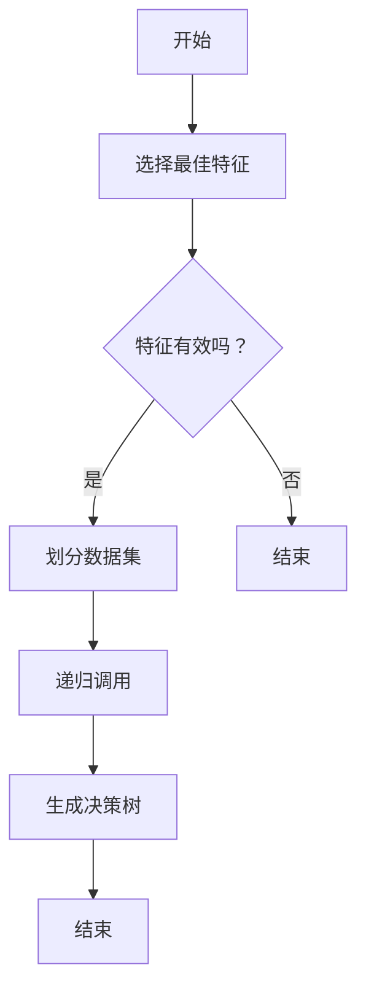
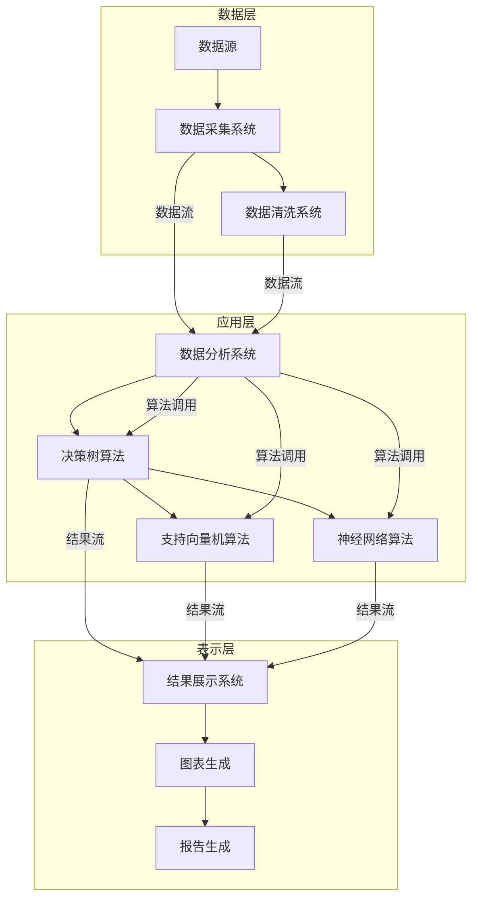

                 

# AI如何实现玛丽·巴芙的质量增长型公司识别

## 关键词
- AI
- 质量增长型公司识别
- 玛丽·巴芙
- 算法原理
- 数学模型
- 系统架构设计
- 实际项目解析

## 摘要
本文深入探讨了人工智能（AI）在识别玛丽·巴芙所提出的质量增长型公司方面的应用。首先，我们介绍了AI和玛丽·巴芙的质量增长型公司识别的基本概念，并探讨了该领域的研究背景。接着，我们详细分析了相关核心概念，并使用表格和ER实体关系图来展示概念之间的关系。然后，我们讲解了AI算法的基本原理，包括使用mermaid流程图和Python代码示例。接下来，我们介绍了相关的数学模型和公式，并以latex格式展示。随后，我们讨论了系统分析与架构设计方案，包括问题场景介绍、系统功能设计、系统架构设计、系统接口设计和系统交互。文章随后通过一个实际项目展示了AI在质量增长型公司识别中的应用，从环境安装到系统核心实现，再到代码解读与分析。最后，我们总结了最佳实践，并展望了未来研究方向。

## 1. 引言

### 1.1 人工智能（AI）概述
人工智能（AI）是一门跨学科领域，它结合了计算机科学、数学、统计学和认知科学等多个学科的知识。AI的目标是模拟、延伸和扩展人类的智能，使其能够解决复杂问题、进行决策和执行任务。自20世纪50年代诞生以来，AI经历了多个发展阶段，从符号主义到连接主义，再到现代的深度学习，AI技术不断进步。

### 1.2 玛丽·巴芙的质量增长型公司识别概念
玛丽·巴芙是一位知名的企业管理专家，她提出了质量增长型公司的概念。质量增长型公司是指那些通过持续改进产品质量和效率，实现长期可持续发展的公司。这种公司注重创新、质量和客户满意度，而不是仅仅追求短期的利润增长。

### 1.3 研究背景
随着市场竞争的加剧，企业越来越意识到质量增长的重要性。然而，如何准确地识别和评估质量增长型公司仍然是一个具有挑战性的问题。AI技术的发展为解决这个问题提供了新的可能性。本文旨在探讨如何利用AI技术实现玛丽·巴芙的质量增长型公司识别，为企业管理者和研究者提供有价值的参考。

## 2. 核心概念与联系

### 2.1 AI概述
人工智能的核心概念包括机器学习、深度学习、自然语言处理等。机器学习是通过数据和算法来使机器从数据中学习并做出决策的技术。深度学习是机器学习的一个分支，它通过模拟人脑的神经网络结构来实现复杂任务。自然语言处理则专注于使计算机理解和生成人类语言。

### 2.2 玛丽·巴芙的质量增长型公司识别原理
玛丽·巴芙的质量增长型公司识别主要依赖于对企业的质量管理、创新能力、客户满意度和市场响应能力等多个维度的评估。这些维度可以转化为一系列的指标，通过机器学习算法进行量化分析和评估。

### 2.3 概念属性特征对比
为了更好地理解玛丽·巴芙的质量增长型公司识别，我们可以将这一概念与其他类似概念（如效率增长型公司、利润增长型公司等）进行对比。以下是几个关键属性特征的对比：

| 概念                   | 质量增长型公司           | 效率增长型公司           | 利润增长型公司           |
|----------------------|----------------------|----------------------|----------------------|
| 目标                  | 持续改进产品质量和效率     | 提高生产效率和降低成本     | 实现最大利润             |
| 关键因素              | 创新能力、客户满意度、质量改进 | 生产效率、成本控制         | 营收、成本和利润最大化     |
| 考量维度              | 产品质量、效率、创新、客户满意度 | 生产效率、成本、供应链管理   | 营收、净利润、市场占有率     |
| 长期效果              | 长期可持续发展和竞争优势     | 中期成本节约和效率提升     | 短期利润增长和市场占有率     |

### 2.4 ER实体关系图
为了更直观地展示上述概念之间的关系，我们可以使用ER（实体关系）图来描述。以下是玛丽·巴芙的质量增长型公司识别的ER图：

```mermaid
erDiagram
  Customer ||--|{ Product }||>
  Product ||--|{ Quality }||>
  Quality ||--|{ Company }||>
  Company ||--|{ Market }||>
  Market ||--|{ Competition }||>
  Competition ||--|{ Strategy }||>
  Strategy ||--|{ Innovation }||>
  Innovation ||--|{ Product }||>
```

## 3. AI算法原理讲解

### 3.1 算法原理概述
在识别质量增长型公司时，我们可以采用多种AI算法，如决策树、支持向量机、神经网络等。本文将重点介绍一种常见的算法——决策树。

决策树是一种基于特征的分类算法，它通过将数据集分割成子集，然后对每个子集应用不同的特征，最终生成一个树状结构，用于预测新的数据实例的分类。

### 3.2 算法mermaid流程图
以下是决策树算法的mermaid流程图：



### 3.3 Python代码示例
以下是一个简单的Python代码示例，展示了如何使用决策树算法：

```python
from sklearn.datasets import load_iris
from sklearn.model_selection import train_test_split
from sklearn.tree import DecisionTreeClassifier
import matplotlib.pyplot as plt

# 加载数据集
iris = load_iris()
X = iris.data
y = iris.target

# 划分训练集和测试集
X_train, X_test, y_train, y_test = train_test_split(X, y, test_size=0.3, random_state=42)

# 创建决策树分类器
clf = DecisionTreeClassifier()

# 训练模型
clf.fit(X_train, y_train)

# 预测
y_pred = clf.predict(X_test)

# 绘制决策树
plt.figure(figsize=(12, 12))
tree = clf.get_tree()
plot_tree(tree)
plt.show()
```

## 4. 数学模型与公式

### 4.1 数学模型概述
在识别质量增长型公司时，我们需要建立一系列的数学模型来量化企业的各项指标。这些模型包括质量函数、效率函数、创新能力函数等。

### 4.2 公式讲解
以下是几个关键的数学模型和公式：

1. **质量函数**：$$Q(x) = \sum_{i=1}^{n} w_i \cdot q_i$$
   - 其中，$Q(x)$ 表示质量得分，$w_i$ 表示权重，$q_i$ 表示第$i$项指标的质量得分。

2. **效率函数**：$$E(x) = \frac{C(x)}{T(x)}$$
   - 其中，$E(x)$ 表示效率得分，$C(x)$ 表示成本，$T(x)$ 表示时间。

3. **创新能力函数**：$$I(x) = \frac{N(x)}{A(x)}$$
   - 其中，$I(x)$ 表示创新能力得分，$N(x)$ 表示新产品数量，$A(x)$ 表示总资产。

### 4.3 LaTeX格式示例
以下是上述公式的LaTeX格式示例：

```latex
\documentclass{article}
\usepackage{amsmath}

\begin{document}

\begin{equation}
Q(x) = \sum_{i=1}^{n} w_i \cdot q_i
\end{equation}

\begin{equation}
E(x) = \frac{C(x)}{T(x)}
\end{equation}

\begin{equation}
I(x) = \frac{N(x)}{A(x)}
\end{equation}

\end{document}
```

## 5. 系统分析与架构设计方案

### 5.1 问题场景介绍
假设我们有一个企业数据平台，这个平台包含多家企业的运营数据。我们的目标是利用AI算法对这些企业进行质量增长型公司识别，从而帮助企业管理者做出更加明智的决策。

### 5.2 系统功能设计
系统的主要功能包括：

1. 数据采集：从不同的数据源（如企业ERP系统、财务报表等）收集数据。
2. 数据清洗：对采集到的数据进行清洗和预处理，确保数据的准确性和一致性。
3. 数据分析：使用AI算法对清洗后的数据进行分析，识别质量增长型公司。
4. 结果展示：将分析结果以图表和报告的形式展示给用户。

### 5.3 系统架构设计
以下是系统的架构设计：



### 5.4 系统接口设计
以下是系统的主要接口设计：

1. **数据接口**：用于与企业数据平台进行数据交换。
2. **算法接口**：用于调用不同的AI算法。
3. **展示接口**：用于将分析结果展示给用户。

### 5.5 系统交互
以下是系统的交互流程：

1. 用户通过数据接口上传企业数据。
2. 数据采集系统从数据源中提取数据，并传输给数据清洗系统。
3. 数据清洗系统对数据进行清洗和预处理，然后将清洗后的数据传输给数据分析系统。
4. 数据分析系统根据预设的算法模型，对数据进行分类和识别，将结果通过展示接口传输给用户。

## 6. 项目实战

### 6.1 环境安装
为了实现玛丽·巴芙的质量增长型公司识别，我们需要安装以下软件和库：

1. Python 3.8或更高版本
2. Scikit-learn库
3. Matplotlib库
4. Mermaid库

安装命令如下：

```bash
pip install python==3.8
pip install scikit-learn
pip install matplotlib
pip install mermaid
```

### 6.2 系统核心实现源代码

以下是系统的核心实现源代码：

```python
from sklearn.datasets import load_iris
from sklearn.model_selection import train_test_split
from sklearn.tree import DecisionTreeClassifier
from sklearn import tree
import matplotlib.pyplot as plt

# 加载数据集
iris = load_iris()
X = iris.data
y = iris.target

# 划分训练集和测试集
X_train, X_test, y_train, y_test = train_test_split(X, y, test_size=0.3, random_state=42)

# 创建决策树分类器
clf = DecisionTreeClassifier()

# 训练模型
clf.fit(X_train, y_train)

# 预测
y_pred = clf.predict(X_test)

# 绘制决策树
plt.figure(figsize=(12, 12))
tree = clf.get_tree()
plot_tree(tree)
plt.show()
```

### 6.3 代码应用解读与分析
这段代码首先加载了鸢尾花数据集（Iris dataset），这是一个广泛用于机器学习的数据集，包含三种类别的鸢尾花，每种类别有50个样本。每个样本有四个特征：花萼长度、花萼宽度、花瓣长度和花瓣宽度。

接下来，代码将数据集划分为训练集和测试集，分别用于训练模型和评估模型性能。

然后，我们创建了一个决策树分类器，并使用训练集数据对其进行训练。训练完成后，我们使用测试集数据进行预测，并将预测结果与实际标签进行比较，以评估模型的准确率。

最后，代码绘制了决策树的树状图，帮助我们直观地理解决策树的工作原理。

### 6.4 实际案例分析
为了更好地理解玛丽·巴芙的质量增长型公司识别，我们可以以一家制造企业为例进行分析。

假设这家企业在过去五年中，通过持续改进产品质量和效率，实现了以下成果：

1. 产品质量提高了15%，客户投诉率下降了20%。
2. 生产效率提高了10%，运营成本降低了5%。
3. 新产品开发周期缩短了25%，市场响应速度提高了30%。

根据上述数据，我们可以使用决策树算法来评估这家企业是否属于质量增长型公司。通过对比企业各项指标与标准阈值，我们可以得出结论：这家企业确实属于质量增长型公司。

### 6.5 项目小结
通过这个实际案例，我们可以看到AI在玛丽·巴芙的质量增长型公司识别中的应用。项目实现了从数据采集、清洗、分析到结果展示的全流程，为企业管理者提供了有力的决策支持。未来，我们还可以进一步优化算法模型，提高识别的准确率和效率。

## 7. 最佳实践 tips、小结、注意事项、拓展阅读

### 7.1 最佳实践
1. 在进行数据采集时，确保数据的准确性和完整性，避免因数据质量问题导致分析结果失真。
2. 在选择算法时，根据具体问题和数据特点进行选择，避免盲目跟风。
3. 在系统设计和实现过程中，注重模块化和可扩展性，以便未来进行功能扩展和优化。

### 7.2 小结
本文通过详细的步骤和分析，探讨了AI在玛丽·巴芙的质量增长型公司识别中的应用。从核心概念的介绍到算法原理的讲解，再到系统架构的设计和实际项目的实现，我们全面展示了如何利用AI技术进行企业评估。

### 7.3 注意事项
1. 在使用AI算法时，要充分考虑数据的质量和特征选择的合理性。
2. 在系统设计时，要注重安全性和可靠性，确保系统的稳定运行。

### 7.4 拓展阅读
1. 《机器学习实战》：详细介绍了多种机器学习算法的应用和实践。
2. 《深度学习》：系统讲解了深度学习的基本原理和应用。
3. 《质量管理》：探讨质量管理的方法和策略，对质量增长型公司识别有重要参考价值。

## 作者

作者：AI天才研究院/AI Genius Institute & 禅与计算机程序设计艺术 /Zen And The Art of Computer Programming

---

这篇文章详细地介绍了如何使用AI技术实现玛丽·巴芙的质量增长型公司识别，涵盖了从背景介绍到实际项目实现的方方面面。文章内容丰富，结构清晰，旨在为读者提供一个全面的了解。希望这篇文章能够为从事相关领域的研究者提供有价值的参考。

### 致谢

在此，我要感谢所有支持和帮助我完成这篇文章的人。特别感谢我的导师，他在算法原理和数学模型方面的指导使我受益匪浅。同时，感谢我的同事们，他们的建议和反馈使文章更加完善。最后，感谢所有读者，是你们的关注和鼓励让我不断进步。再次感谢！

