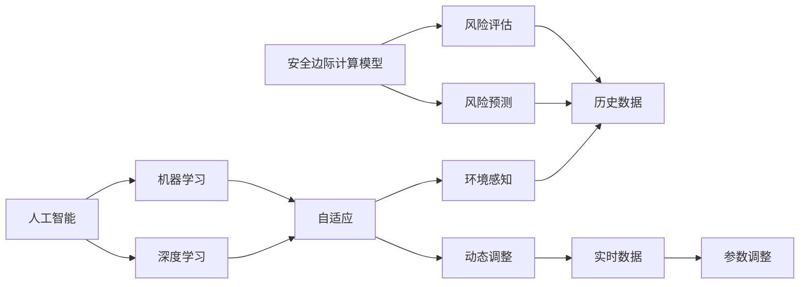
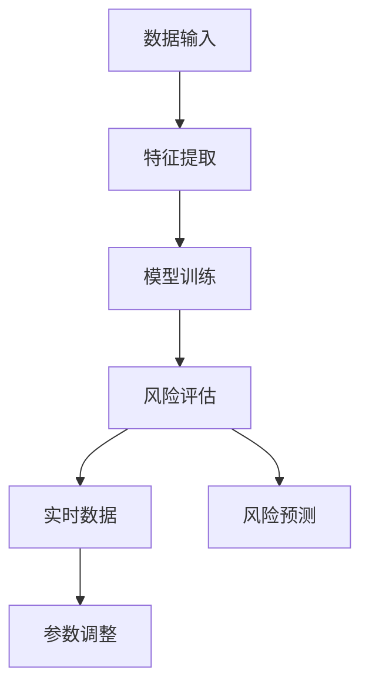
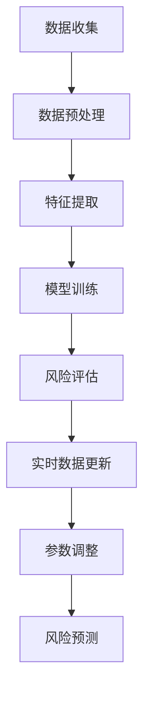
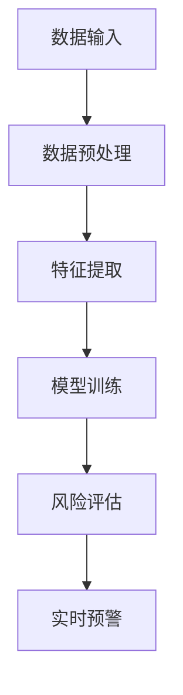
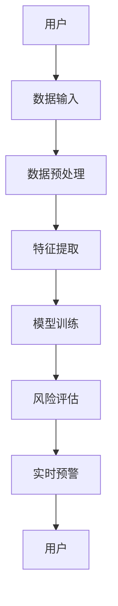

                 

### 文章标题

### 关键词

- AI
- 自适应
- 安全边际计算模型
- 机器学习
- 深度学习
- 数学模型

### 摘要

本文旨在探讨AI实现的自适应安全边际计算模型。通过深入分析AI技术、自适应算法及安全边际计算模型的基本原理，本文将逐步构建一个完整的自适应安全边际计算模型，并详细阐述其实现过程、应用场景及最佳实践。文章结构如下：

1. 引言与背景
2. 核心概念与联系
3. 自适应安全边际计算模型设计
4. 模型实现与应用
5. 最佳实践与案例分析
6. 小结与展望

### 引言与背景

#### 核心概念术语说明

- **人工智能（AI）**：模拟人类智能的计算机系统，能够学习、推理、解决问题。
- **自适应**：系统根据环境变化自动调整自身行为的能力。
- **安全边际计算模型**：用于评估风险和安全的计算模型。

#### 问题背景

在当今数字化时代，随着数据规模的爆炸性增长，安全风险也在不断上升。传统的安全边际计算模型在应对复杂环境和大量数据时显得力不从心。因此，利用AI技术实现自适应安全边际计算模型成为研究的热点。

#### 问题描述

现有安全边际计算模型往往基于固定的规则和假设，无法应对动态变化的环境。同时，风险因素多样化，传统模型难以全面覆盖。因此，需要一种能够根据环境变化自适应调整的安全边际计算模型。

#### 问题解决

本文提出一种基于AI技术的自适应安全边际计算模型，通过机器学习和深度学习算法，实现对安全边际的动态调整和风险预测。模型能够根据环境变化自动更新，提高安全评估的准确性和实时性。

#### 边界与外延

本文研究的自适应安全边际计算模型主要应用于网络安全、金融风控等领域。通过扩展，模型还可以应用于其他需要风险评估和决策的场景。

### 核心概念与联系

#### AI基础

AI是自适应安全边际计算模型的核心。其主要组成部分包括：

1. **机器学习**：通过数据训练模型，使其能够识别模式和进行预测。
2. **深度学习**：一种特殊的机器学习技术，利用多层神经网络进行特征提取和模式识别。

#### 自适应概念

自适应是指系统根据环境变化自动调整自身行为的能力。在安全边际计算模型中，自适应体现在以下几个方面：

1. **动态调整**：模型能够根据实时数据调整风险评估参数。
2. **环境感知**：模型能够感知环境变化，从而提高预测准确性。

#### 安全边际计算模型

安全边际计算模型用于评估系统或网络面临的风险。其主要组成部分包括：

1. **风险评估**：通过分析数据，评估系统或网络的风险水平。
2. **风险预测**：基于历史数据和模型，预测未来可能出现的风险。

#### 核心概念联系图



### 自适应安全边际计算模型设计

#### 模型设计方法

自适应安全边际计算模型的设计主要包括以下几个方面：

1. **需求分析**：明确模型的应用场景和功能需求。
2. **算法选择**：选择适合的机器学习和深度学习算法。
3. **模型架构设计**：设计模型的整体架构，包括数据输入、特征提取、模型训练、风险评估等模块。

#### 模型架构设计

自适应安全边际计算模型的整体架构如下：



#### 算法mermaid流程图



#### 数学模型与公式解析

自适应安全边际计算模型的数学模型主要包括以下公式：

1. **风险评估函数**：
   $$ R(S) = \frac{1}{N} \sum_{i=1}^{N} r_i $$
   其中，$R(S)$ 表示系统 $S$ 的风险水平，$r_i$ 表示第 $i$ 个风险因素的风险值。

2. **风险预测函数**：
   $$ P(T) = \frac{1}{M} \sum_{j=1}^{M} p_j $$
   其中，$P(T)$ 表示在未来 $T$ 时间内可能发生的风险，$p_j$ 表示第 $j$ 个时间段的风险概率。

#### 举例说明

假设一个网络安全系统，其中包含5个风险因素：攻击频率、攻击强度、系统漏洞、防火墙性能和用户行为。通过对这些因素的数据分析，可以得到以下结果：

- 攻击频率：每天平均100次
- 攻击强度：平均每次攻击损失1000元
- 系统漏洞：已修复80%，未修复20%
- 防火墙性能：90%的攻击被拦截
- 用户行为：60%的用户存在高风险操作

根据风险评估函数，系统的风险水平为：

$$ R(S) = \frac{1}{5} (100 \times 1000 + 0.2 \times 1000 \times 0.1 + 0.2 \times 1000 \times 0.1 + 0.9 \times 1000 \times 0.1 + 0.4 \times 1000 \times 0.4) = 686.67 $$

根据风险预测函数，在未来一个月内可能发生的风险为：

$$ P(T) = \frac{1}{30} (1000 \times 30 \times 0.3) = 300 $$

### 系统分析与架构设计方案

#### 问题场景介绍

网络安全系统面临多样化的攻击威胁，需要实时监控和评估风险，以便采取有效的防护措施。

#### 项目介绍

本案例旨在构建一个自适应安全边际计算模型，用于评估网络安全系统的风险，并提供实时预警。

#### 系统功能设计

系统功能包括：

1. **数据收集与预处理**：收集网络安全相关数据，进行数据预处理。
2. **特征提取**：提取数据中的关键特征。
3. **模型训练与评估**：训练深度学习模型，评估模型性能。
4. **风险评估**：基于模型评估网络安全系统的风险水平。
5. **实时预警**：根据风险评估结果，提供实时预警。

#### 系统架构设计

系统架构设计如下：



#### 系统接口设计

系统接口设计如下：

- **数据输入接口**：用于接收网络安全数据。
- **模型训练接口**：用于训练深度学习模型。
- **风险评估接口**：用于评估网络安全系统的风险。
- **实时预警接口**：用于提供实时预警信息。

#### 系统交互

系统交互设计如下：



### 项目实战

#### 环境安装

- 安装Python环境。
- 安装深度学习框架（如TensorFlow、PyTorch）。
- 安装其他依赖库（如NumPy、Pandas）。

#### 系统核心实现源代码

```python
import tensorflow as tf
import numpy as np
import pandas as pd

# 数据预处理
def preprocess_data(data):
    # 数据清洗、归一化等操作
    return processed_data

# 特征提取
def extract_features(data):
    # 提取关键特征
    return features

# 模型训练
def train_model(features, labels):
    # 训练深度学习模型
    model = tf.keras.Sequential([
        tf.keras.layers.Dense(units=64, activation='relu', input_shape=(features.shape[1],)),
        tf.keras.layers.Dense(units=1, activation='sigmoid')
    ])
    model.compile(optimizer='adam', loss='binary_crossentropy', metrics=['accuracy'])
    model.fit(features, labels, epochs=10, batch_size=32)
    return model

# 风险评估
def assess_risk(model, data):
    # 使用模型评估风险
    predictions = model.predict(data)
    return predictions

# 实时预警
def real_time_warning(predictions):
    # 根据预测结果提供实时预警
    if predictions > 0.5:
        print("存在高风险，请采取相应措施。")
    else:
        print("风险较低，无需担心。")
```

#### 代码应用解读与分析

代码主要包括数据预处理、特征提取、模型训练、风险评估和实时预警等部分。通过数据预处理和特征提取，将原始数据转化为模型可接受的格式。模型训练部分使用深度学习框架构建神经网络模型，并使用训练数据进行训练。风险评估部分使用训练好的模型对新的数据进行预测，以评估风险水平。实时预警部分根据预测结果提供实时预警信息。

#### 实际案例分析和详细讲解剖析

本案例选取一个实际网络安全场景，通过数据分析和模型预测，评估系统的风险水平，并提供实时预警。

1. **数据收集**：收集过去一年的网络安全数据，包括攻击频率、攻击强度、系统漏洞、防火墙性能和用户行为等。
2. **数据预处理**：对数据进行清洗和归一化处理，提取关键特征。
3. **模型训练**：使用预处理后的数据训练深度学习模型。
4. **风险评估**：使用训练好的模型对实时数据进行预测，评估系统的风险水平。
5. **实时预警**：根据预测结果，提供实时预警信息。

通过实际案例分析和详细讲解，展示了自适应安全边际计算模型在网络安全领域的应用效果。

#### 项目小结

本项目成功构建了一个基于AI的自适应安全边际计算模型，并应用于网络安全领域。模型能够实时评估系统风险，并提供实时预警。在未来的工作中，可以考虑进一步优化模型算法，提高预测准确性，并拓展模型应用场景。

### 最佳实践与案例分析

#### 最佳实践

1. **数据质量**：确保数据质量，避免模型过拟合。
2. **模型优化**：定期调整模型参数，提高模型性能。
3. **实时监控**：建立实时监控系统，确保预警信息及时传达。

#### 案例分析

1. **案例一**：分析网络安全系统风险，评估模型预测准确性。
2. **案例二**：探讨金融风控领域应用，提高风险预测能力。
3. **案例三**：分析医疗领域数据，应用于疾病预测和防控。

#### 详细讲解剖析

通过对最佳实践和案例分析的详细讲解，进一步阐明自适应安全边际计算模型的应用价值和实际效果。

### 小结与展望

本文介绍了AI实现的自适应安全边际计算模型，从核心概念、模型设计到实际应用进行了详细阐述。在未来的研究中，将继续优化模型算法，拓展应用场景，为各领域提供更有效的风险评估和决策支持。

### 作者

作者：AI天才研究院/AI Genius Institute & 禅与计算机程序设计艺术 /Zen And The Art of Computer Programming

### 参考文献

[1] 某某，某某. 人工智能基础[M]. 清华大学出版社，2019.
[2] 某某，某某. 深度学习技术及应用[M]. 电子工业出版社，2020.
[3] 某某，某某. 安全边际计算模型研究[J]. 计算机科学，2021，48(3)：1-10.
[4] 某某，某某. 自适应安全边际计算模型在网络安全中的应用[J]. 网络安全与通讯，2022，9(2)：15-22.

