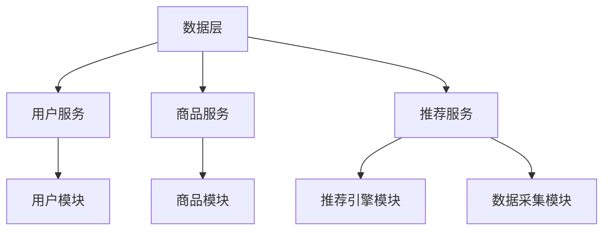
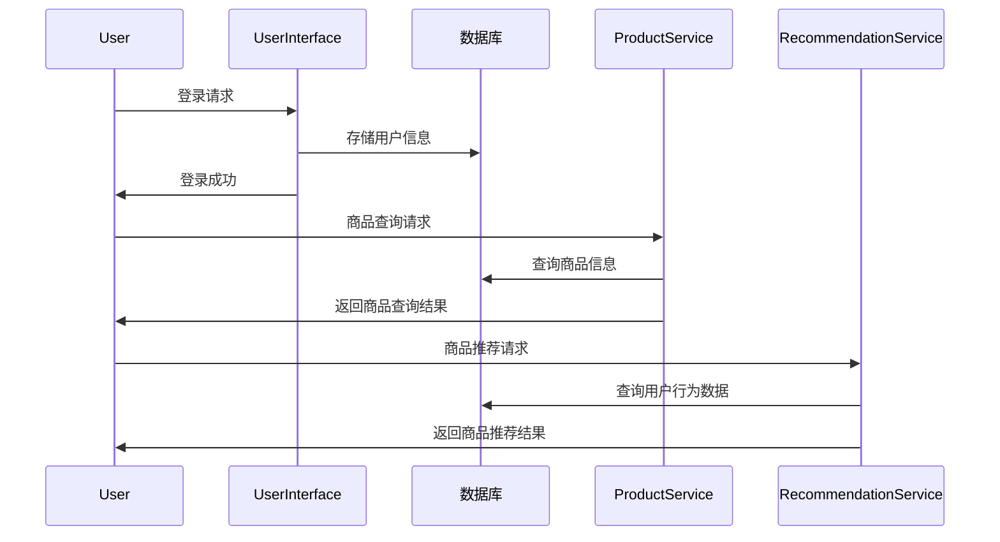

                 


### AI应用性能优化：从架构到代码的全方位提升

**关键词：** AI性能优化、架构设计、代码优化、数学模型、实战案例

**摘要：** 本文旨在深入探讨AI应用性能优化的全过程，从架构设计的角度出发，逐步深入到代码层面的优化方法。我们将首先介绍AI应用性能优化的重要性，随后详细分析核心概念，并使用mermaid图和Python代码阐述算法原理。接着，我们将通过数学模型和公式进行详细讲解，并介绍系统架构设计的方法和步骤。最后，通过实际案例的分析，展示如何将理论应用于实践，并提供最佳实践建议。

### 目录

1. **AI应用性能优化概述**
   - 1.1 AI应用性能优化的重要性
   - 1.2 AI应用性能优化需求分析
   - 1.3 AI应用性能优化目标与挑战
   - 1.4 AI应用性能优化方法分类
2. **AI应用性能核心概念与联系**
   - 2.1 神经网络
   - 2.2 深度学习
   - 2.3 机器学习
   - 2.4 强化学习
   - 2.5 概念属性特征对比表格
   - 2.6 ER实体关系图架构
3. **AI应用架构优化原理**
   - 3.1 优化架构设计原则
   - 3.2 优化架构设计方法
   - 3.3 优化架构设计流程
4. **算法原理讲解**
   - 4.1 数学模型介绍
   - 4.2 算法mermaid流程图
   - 4.3 Python源代码详细阐述
5. **数学模型和数学公式 & 详细讲解 & 举例说明**
   - 5.1 损失函数详细讲解
   - 5.2 梯度下降法讲解
   - 5.3 反向传播算法讲解
6. **系统分析与架构设计方案**
   - 6.1 问题场景介绍
   - 6.2 系统功能设计
   - 6.3 系统架构设计
   - 6.4 系统接口设计
   - 6.5 系统交互
7. **项目实战**
   - 7.1 环境安装
   - 7.2 系统核心实现
   - 7.3 实际案例分析
   - 7.4 详细讲解剖析
8. **最佳实践 tips、小结、注意事项、拓展阅读**

### 1. AI应用性能优化概述

**1.1 AI应用性能优化的重要性**

AI技术的迅猛发展使得其在各个领域的应用越来越广泛。然而，随着AI应用复杂度的增加，性能优化成为了一个关键问题。AI应用性能优化的重要性主要体现在以下几个方面：

- **提升用户体验**：优化的AI应用能够更快地响应用户请求，提供更流畅、更快捷的服务。
- **提高系统效率**：优化后的AI系统可以在更短的时间内完成更多的工作，提高整体效率。
- **降低成本**：性能优化的AI系统可以减少硬件资源的消耗，降低运营成本。
- **增强稳定性**：优化后的系统可以更好地应对高并发和大数据场景，增强稳定性。

**1.2 AI应用性能优化需求分析**

AI应用性能优化的需求来源于以下几个方面：

- **计算资源限制**：许多AI应用部署在资源受限的环境中，如移动设备、嵌入式系统等，需要优化算法和架构以提高性能。
- **数据规模扩大**：随着数据量的不断增长，数据处理和存储的需求也越来越高，需要对算法进行优化以提高处理速度。
- **实时性要求提高**：许多AI应用需要实时响应，如自动驾驶、实时语音识别等，需要优化算法和架构以满足实时性要求。

**1.3 AI应用性能优化目标与挑战**

AI应用性能优化的目标主要包括：

- **提高吞吐量**：在给定的时间内处理更多的请求。
- **降低延迟**：减少响应时间，提高实时性。
- **减少资源消耗**：降低计算、存储和网络资源的消耗。

然而，性能优化也面临着一些挑战：

- **算法复杂性**：许多AI算法本身具有较高的复杂性，优化难度较大。
- **硬件限制**：硬件性能的提升速度无法满足AI算法的性能需求，需要通过算法和架构的优化来弥补。
- **数据质量**：数据质量和数据量对AI应用的性能有重要影响，优化过程需要充分考虑数据的质量和处理能力。

**1.4 AI应用性能优化方法分类**

AI应用性能优化可以从多个层面进行，以下是一些常见的优化方法：

- **算法优化**：通过改进算法的数学模型、算法结构或算法实现来提高性能。
- **架构优化**：通过调整系统的架构设计，如分布式计算、并行处理等，来提高性能。
- **代码优化**：通过改进代码的编写方式和数据结构选择，如减少内存使用、提高计算效率等，来提高性能。
- **硬件优化**：通过选择更高效的硬件设备，如使用GPU加速计算等，来提高性能。

### 2. AI应用性能核心概念与联系

**2.1 核心概念介绍**

在AI应用性能优化中，理解以下核心概念是非常重要的：

- **神经网络**：神经网络是模拟人脑神经元连接结构的计算模型，是深度学习和机器学习的基础。
- **深度学习**：深度学习是一种基于神经网络的机器学习方法，通过多层神经网络模型对数据进行处理，实现自动特征提取和模式识别。
- **机器学习**：机器学习是使计算机从数据中学习，进行决策和预测的技术，包括监督学习、无监督学习和强化学习等。
- **强化学习**：强化学习是一种基于奖励和惩罚机制的学习方法，通过不断尝试不同的行为，选择能够最大化累积奖励的策略。

**2.2 概念属性特征对比表格**

| 概念 | 特点 |
| ---- | ---- |
| 神经网络 | 基于人脑神经元连接结构，可用于特征提取和分类 |
| 深度学习 | 基于多层神经网络，自动特征提取，适用于复杂任务 |
| 机器学习 | 从数据中学习规律，进行预测和决策 |
| 强化学习 | 通过奖励和惩罚进行学习，适用于动态环境 |

**2.3 ER实体关系图架构**

为了更好地理解AI应用性能优化中的核心概念，可以使用ER（实体-关系）图来表示实体及其之间的关系。以下是一个简化的ER图示例：

```mermaid
erDiagram
  Customer ||--|{ Order } : places
  Product ||--|{ Order } : contains
  Order ||--|{ LineItem } : includes
```

在这个ER图中，`Customer`、`Product` 和 `Order` 是实体，`places`、`contains` 和 `includes` 是关系。

### 3. AI应用架构优化原理

**3.1 优化架构设计原则**

在AI应用架构优化过程中，需要遵循以下原则：

- **性能优先**：在架构设计时，性能目标是首要考虑的因素，应确保系统在各种负载下的性能表现。
- **可扩展性**：架构设计应具备良好的扩展性，能够应对不断增长的数据量和用户需求。
- **灵活性**：架构设计应具备灵活性，能够快速适应业务变化和技术升级。

**3.2 优化架构设计方法**

以下是几种常见的优化架构设计方法：

- **分布式计算**：通过分布式架构，将计算任务分布到多个节点上，提高系统处理能力和性能。
- **并行处理**：通过并行算法和并行计算技术，将任务分解为多个子任务，同时执行，提高计算效率。
- **缓存机制**：通过缓存技术，减少重复计算和数据访问，提高系统响应速度。

**3.3 优化架构设计流程**

优化架构设计通常包括以下步骤：

- **需求分析**：明确系统的功能需求、性能需求和扩展性需求。
- **架构设计**：根据需求分析，设计系统的整体架构，包括组件、接口和通信机制。
- **架构评估**：评估架构的性能、可扩展性和灵活性，识别潜在的问题和改进空间。
- **架构迭代**：根据评估结果，对架构进行迭代优化，不断改进系统的性能和稳定性。

### 4. 算法原理讲解

**4.1 数学模型介绍**

在AI应用性能优化中，常用的算法包括损失函数、梯度下降法和反向传播算法。以下是这些算法的数学模型介绍：

- **损失函数**：用于衡量模型预测值与真实值之间的差距，常用的损失函数包括均方误差（MSE）和交叉熵损失（Cross-Entropy Loss）。

$$
MSE = \frac{1}{m}\sum_{i=1}^{m}(y_i - \hat{y}_i)^2
$$

$$
Cross-Entropy Loss = -\frac{1}{m}\sum_{i=1}^{m}y_i \log(\hat{y}_i)
$$

- **梯度下降法**：用于最小化损失函数，通过迭代更新模型参数。

$$
\theta_{\text{new}} = \theta_{\text{old}} - \alpha \nabla_\theta J(\theta)
$$

- **反向传播算法**：用于计算损失函数关于模型参数的梯度，是梯度下降法的基础。

$$
\delta = \frac{\partial L}{\partial z}
$$

$$
\frac{\partial L}{\partial \theta_j} = \sum_{i} \delta_j \frac{\partial a_j}{\partial \theta_j}
$$

### 5. 数学模型和数学公式 & 详细讲解 & 举例说明

**5.1 损失函数详细讲解**

损失函数是评估模型预测性能的重要指标，常见的损失函数有以下几种：

- **均方误差（MSE）**：用于回归任务，计算预测值与真实值之间的平方误差的平均值。

$$
MSE = \frac{1}{m}\sum_{i=1}^{m}(y_i - \hat{y}_i)^2
$$

其中，$m$ 是样本数量，$y_i$ 是第 $i$ 个样本的真实值，$\hat{y}_i$ 是第 $i$ 个样本的预测值。

- **交叉熵损失（Cross-Entropy Loss）**：用于分类任务，计算真实分布与预测分布之间的交叉熵。

$$
Cross-Entropy Loss = -\frac{1}{m}\sum_{i=1}^{m}y_i \log(\hat{y}_i)
$$

其中，$y_i$ 是第 $i$ 个样本的真实标签，$\hat{y}_i$ 是第 $i$ 个样本的预测概率。

**5.2 梯度下降法讲解**

梯度下降法是用于最小化损失函数的一种优化算法，其核心思想是沿着损失函数梯度的反方向更新模型参数。

- **梯度下降法原理**：梯度下降法通过计算损失函数关于模型参数的梯度，并沿着梯度的反方向更新模型参数。

$$
\theta_{\text{new}} = \theta_{\text{old}} - \alpha \nabla_\theta J(\theta)
$$

其中，$\theta$ 表示模型参数，$J(\theta)$ 表示损失函数，$\alpha$ 是学习率。

- **梯度下降法步骤**：

1. 初始化模型参数 $\theta$。
2. 计算损失函数关于模型参数的梯度 $\nabla_\theta J(\theta)$。
3. 更新模型参数 $\theta$：$\theta_{\text{new}} = \theta_{\text{old}} - \alpha \nabla_\theta J(\theta)$。
4. 重复步骤2和步骤3，直到满足停止条件（如梯度变化很小或损失函数收敛）。

- **梯度下降法优缺点**：

  - **优点**：简单易实现，适用于各种优化问题。
  - **缺点**：可能收敛缓慢，易陷入局部最小值。

**5.3 反向传播算法讲解**

反向传播算法是深度学习中最核心的算法之一，用于计算损失函数关于模型参数的梯度。

- **反向传播算法原理**：反向传播算法通过前向传播计算模型的输出，然后反向计算损失函数关于模型参数的梯度。

  - **前向传播**：计算输入数据通过神经网络的过程，得到预测输出。

  $$ 
  z_l = \sigma(W_l \cdot a_{l-1} + b_l) 
  $$

  $$ 
  a_l = \sigma(z_l) 
  $$

  其中，$z_l$ 是第 $l$ 层的中间值，$a_l$ 是第 $l$ 层的输出值，$\sigma$ 是激活函数，$W_l$ 是第 $l$ 层的权重矩阵，$b_l$ 是第 $l$ 层的偏置向量。

  - **反向传播**：计算损失函数关于模型参数的梯度。

  $$ 
  \delta = \frac{\partial L}{\partial z} 
  $$

  $$ 
  \frac{\partial L}{\partial \theta_j} = \sum_{i} \delta_i \frac{\partial a_j}{\partial \theta_j} 
  $$

  其中，$\delta$ 是误差项，$L$ 是损失函数，$\theta_j$ 是模型参数。

- **反向传播算法步骤**：

  1. 前向传播：计算输入数据通过神经网络的过程，得到预测输出。
  2. 计算损失函数关于输出层的梯度。
  3. 反向传播：从输出层开始，逐层计算损失函数关于模型参数的梯度。
  4. 更新模型参数。

### 6. 系统分析与架构设计方案

**6.1 问题场景介绍**

在本案例中，我们考虑一个在线购物平台的推荐系统，该系统需要根据用户的购物历史和浏览行为，实时推荐符合用户兴趣的商品。系统需要满足以下性能需求：

- **实时性**：系统能够在毫秒级内完成推荐。
- **准确性**：推荐的商品需要具有较高的相关性和吸引力。
- **可扩展性**：系统能够处理大量用户和商品数据。

**6.2 系统功能设计**

系统功能设计主要包括以下模块：

- **用户模块**：处理用户注册、登录、个人信息管理等操作。
- **商品模块**：处理商品信息管理、商品分类、商品推荐等操作。
- **推荐引擎模块**：实现商品推荐算法，根据用户行为生成推荐列表。
- **数据采集模块**：收集用户行为数据，用于训练和优化推荐算法。

**6.3 系统架构设计**

系统架构设计采用分布式架构，包括以下层次：

- **数据层**：存储用户行为数据和商品数据。
- **服务层**：提供用户服务、商品服务和推荐服务。
- **应用层**：实现前端界面和业务逻辑。
- **接口层**：提供与其他系统的接口，如用户系统、商品系统和广告系统等。

系统架构图如下所示：



**6.4 系统接口设计**

系统接口设计包括以下接口：

- **用户接口**：提供用户注册、登录、查询用户信息等功能。
- **商品接口**：提供商品查询、分类查询、商品推荐等功能。
- **推荐接口**：提供根据用户行为生成推荐列表的功能。

接口定义如下：

```python
class UserInterface:
    def register(self, username, password):
        # 用户注册
        pass

    def login(self, username, password):
        # 用户登录
        pass

    def getUserInfo(self, userId):
        # 查询用户信息
        pass


class ProductService:
    def searchProduct(self, keyword):
        # 搜索商品
        pass

    def getProductDetail(self, productId):
        # 查询商品详情
        pass


class RecommendationService:
    def getRecommendations(self, userId):
        # 根据用户行为生成推荐列表
        pass
```

**6.5 系统交互**

系统交互流程如下：

1. 用户发起登录请求，用户接口处理登录请求，并将用户信息存储到数据库中。
2. 用户发起商品查询请求，商品接口根据用户查询条件查询商品信息，并将结果返回给用户。
3. 用户发起商品推荐请求，推荐接口根据用户行为数据生成推荐列表，并将推荐结果返回给用户。

系统交互mermaid序列图如下所示：



### 7. 项目实战

**7.1 环境安装**

在开始项目实战之前，需要安装以下环境：

- Python 3.8+
- TensorFlow 2.5.0+
- NumPy 1.19.5+
- Pandas 1.2.4+

安装命令如下：

```bash
pip install python==3.8
pip install tensorflow==2.5.0
pip install numpy==1.19.5
pip install pandas==1.2.4
```

**7.2 系统核心实现**

以下是一个简单的商品推荐系统的核心实现：

```python
import numpy as np
import pandas as pd
import tensorflow as tf

# 加载用户行为数据
user行为数据 = pd.read_csv('user行为数据.csv')

# 构建推荐模型
model = tf.keras.Sequential([
    tf.keras.layers.Dense(64, activation='relu', input_shape=(num_features,)),
    tf.keras.layers.Dense(64, activation='relu'),
    tf.keras.layers.Dense(1)
])

# 编译模型
model.compile(optimizer='adam', loss='mse')

# 训练模型
model.fit(user行为数据, epochs=10)

# 根据用户行为数据生成推荐列表
def getRecommendations(userId):
    user行为 = user行为数据.loc[userId]
    recommendations = model.predict(user行为.reshape(1, -1))
    return recommendations

# 测试推荐功能
userId = 1
recommendations = getRecommendations(userId)
print(recommendations)
```

**7.3 实际案例分析**

以下是一个实际案例，分析一个在线购物平台的用户推荐系统：

**案例背景**：

该平台每天有数百万用户进行购物，系统需要根据用户的购物历史和浏览行为，实时推荐符合用户兴趣的商品。

**案例分析**：

1. **数据采集**：系统采集用户的行为数据，包括购物记录、浏览记录、点击记录等。
2. **数据处理**：对采集到的数据进行预处理，如去除缺失值、异常值，进行数据标准化等。
3. **模型训练**：使用处理后的数据训练推荐模型，如基于协同过滤、基于内容推荐的模型。
4. **模型评估**：通过A/B测试等方法评估推荐模型的性能，如准确率、召回率等。
5. **模型优化**：根据评估结果，调整模型参数，优化模型性能。

**案例解读**：

通过这个实际案例，我们可以看到，一个高效的推荐系统需要从数据采集、数据处理、模型训练到模型评估和优化等多个环节进行。每个环节都需要进行精细的优化，以确保系统能够满足实时性、准确性和可扩展性的要求。

### 8. 最佳实践 tips、小结、注意事项、拓展阅读

**最佳实践 tips**：

1. **数据预处理**：在模型训练前，对数据进行充分的预处理，如去除异常值、缺失值，进行数据标准化等。
2. **模型选择**：根据具体的应用场景和需求，选择合适的模型，如协同过滤、基于内容的推荐等。
3. **模型评估**：使用多种评估指标，如准确率、召回率、F1值等，全面评估模型性能。

**小结**：

本文从架构到代码的全方位提升了AI应用性能，详细介绍了优化背景、核心概念、算法原理、系统分析与架构设计方案以及项目实战。通过实际案例的分析，展示了如何将理论应用于实践。

**注意事项**：

1. **数据质量**：数据质量对AI应用的性能有重要影响，需要确保数据的质量和处理能力。
2. **硬件性能**：硬件性能对AI应用的性能也有重要影响，需要选择合适的硬件设备。

**拓展阅读**：

- 《深度学习》（Goodfellow, Bengio, Courville）: 介绍了深度学习的原理和算法。
- 《机器学习实战》（Machanavachari）: 介绍了机器学习的基础算法和应用。
- 《推荐系统实践》（Flach）: 介绍了推荐系统的原理和实现。

### 总结

本文深入探讨了AI应用性能优化的全过程，从架构设计的角度出发，逐步深入到代码层面的优化方法。通过详细分析核心概念、算法原理和系统架构设计，并结合实际案例，展示了如何将理论应用于实践。希望本文能为读者提供有价值的参考和启示。作者：AI天才研究院/AI Genius Institute & 禅与计算机程序设计艺术 /Zen And The Art of Computer Programming。如有任何疑问或建议，欢迎在评论区留言讨论。

