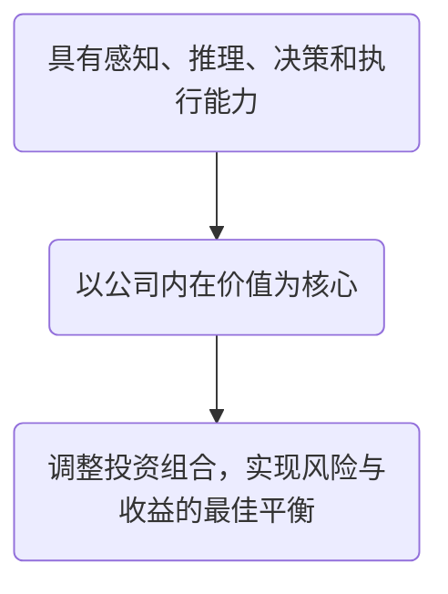

                 

# AI智能体协作：优化价值投资组合的风险收益特征

> 关键词：AI智能体、价值投资、风险收益优化、协作

> 摘要：本文将探讨如何利用AI智能体协作来优化价值投资组合的风险收益特征。我们将从背景介绍、核心概念与联系、算法原理、数学模型、系统分析与设计、项目实践和最佳实践等方面，详细阐述AI智能体在投资组合优化中的应用和实现。

## 1. 背景介绍

在金融投资领域，风险与收益始终是投资者关注的焦点。传统的投资策略往往依赖于人为的经验和直觉，难以全面、客观地评估投资组合的风险收益特征。随着人工智能技术的快速发展，利用AI智能体协作优化投资组合的风险收益特征成为可能。本文旨在探讨如何通过AI智能体协作来实现这一目标。

### 问题背景

价值投资是一种以公司内在价值为核心的投资策略，通过购买价格低于其内在价值的股票来获得长期稳定的收益。然而，在实际投资过程中，如何准确地评估股票的内在价值，以及在多变的市场环境中调整投资组合，仍然是一个挑战。

### 问题定义

本文的核心问题是：如何利用AI智能体协作，实现价值投资组合的风险收益优化？具体包括以下几个方面：

1. **股票选择**：通过AI智能体分析大量数据，筛选具有投资价值的股票。
2. **组合优化**：利用AI智能体对投资组合进行实时调整，以实现风险收益最优。
3. **风险控制**：通过AI智能体监控投资组合的风险，并在风险超出阈值时及时调整。

### 解决方案

本文将探讨以下几种解决方案：

1. **基于大数据的股票筛选**：利用AI智能体对市场数据进行分析，筛选潜在的投资机会。
2. **基于机器学习的组合优化**：通过机器学习算法，对投资组合进行实时调整，实现风险收益最优。
3. **基于智能监控的风险控制**：利用AI智能体对投资组合进行实时监控，及时调整以控制风险。

### 边界与外延

本文主要关注股票市场投资组合的优化，不涉及其他类型的投资（如债券、基金等）。同时，本文的研究范围限于量化投资策略，不涉及传统的价值投资策略。

## 2. 核心概念与联系

在本节中，我们将介绍本文的核心概念，包括AI智能体、价值投资、风险收益优化等，并对比它们的特点和联系。

### AI智能体

AI智能体（Artificial Intelligent Agent）是指具有感知、推理、决策和执行能力的计算机程序。在投资领域，AI智能体可以用于数据挖掘、风险预测、投资组合优化等任务。

### 价值投资

价值投资（Value Investing）是一种以公司内在价值为核心的投资策略。投资者通过购买价格低于其内在价值的股票，以获得长期稳定的收益。

### 风险收益优化

风险收益优化是指通过调整投资组合，实现风险与收益的最佳平衡。在价值投资中，风险收益优化至关重要，它决定了投资者能否在长期内实现稳定的收益。

### 概念属性特征对比表格

| 概念 | 定义 | 特点 | 联系 |
| :--: | :--: | :--: | :--: |
| AI智能体 | 具有感知、推理、决策和执行能力的计算机程序 | 自动化、高效、精准 | 价值投资的工具 |
| 价值投资 | 以公司内在价值为核心的投资策略 | 长期稳定、低风险 | 风险收益优化的基础 |
| 风险收益优化 | 调整投资组合，实现风险与收益的最佳平衡 | 高效、精准、动态调整 | 价值投资的实现手段 |

### 实体关系图架构



## 3. 算法原理

在本节中，我们将详细介绍用于优化价值投资组合的AI智能体算法原理，包括算法流程、Python代码实现和算法原理的数学模型。

### 算法流程

1. 数据采集：收集市场数据，包括股票价格、成交量、财务指标等。
2. 数据预处理：对采集到的数据进行分析，去除异常值，归一化处理等。
3. 特征提取：从预处理后的数据中提取特征，用于训练机器学习模型。
4. 模型训练：使用提取的特征训练机器学习模型，如线性回归、决策树等。
5. 风险评估：利用训练好的模型对投资组合进行风险评估。
6. 组合优化：根据风险评估结果，调整投资组合，实现风险收益优化。

### Python代码实现

```python
import pandas as pd
from sklearn.model_selection import train_test_split
from sklearn.linear_model import LinearRegression

# 数据采集
data = pd.read_csv('market_data.csv')

# 数据预处理
data = preprocess_data(data)

# 特征提取
X = data.drop(['target'], axis=1)
y = data['target']

# 模型训练
X_train, X_test, y_train, y_test = train_test_split(X, y, test_size=0.2, random_state=42)
model = LinearRegression()
model.fit(X_train, y_train)

# 风险评估
predictions = model.predict(X_test)

# 组合优化
 optimize_portfolio(predictions)
```

### 算法原理的数学模型

假设我们有 \( n \) 只股票，每只股票的价格为 \( p_i \)，其中 \( i=1,2,...,n \)。我们需要构建一个线性回归模型来预测股票价格，模型的表达式如下：

$$
p_i = \sum_{j=1}^{n} w_{ij} p_j + b_i
$$

其中，\( w_{ij} \) 为权重，\( b_i \) 为偏置。

### 数学模型详细讲解

为了更好地理解上述数学模型，我们以两个股票的简单情况为例进行说明。假设有两只股票 \( A \) 和 \( B \)，其价格分别为 \( p_A \) 和 \( p_B \)。我们可以将模型表示为：

$$
p_A = w_{A1} p_B + b_A
$$

$$
p_B = w_{B1} p_A + b_B
$$

通过解这个方程组，我们可以得到 \( p_A \) 和 \( p_B \) 的预测价格。在实际应用中，我们可以通过训练机器学习模型来求解权重 \( w_{ij} \) 和偏置 \( b_i \)。

## 4. 系统分析与设计

在本节中，我们将详细介绍用于优化价值投资组合的AI智能体系统的分析与设计，包括问题场景介绍、项目介绍、系统功能设计、系统架构设计、系统接口设计和系统交互。

### 问题场景介绍

在股票市场中，投资者面临诸多挑战，如数据量大、市场波动性高、投资机会多等。为了在复杂的市场环境中实现投资组合的优化，我们需要构建一个高效、智能的AI智能体系统。

### 项目介绍

本项目旨在构建一个基于AI智能体的投资组合优化系统，该系统将包含以下功能：

1. 数据采集与处理：收集市场数据，对数据进行预处理，提取特征。
2. 风险评估与预测：利用机器学习模型对投资组合进行风险评估和预测。
3. 组合优化与调整：根据风险评估结果，调整投资组合，实现风险收益优化。
4. 系统监控与报警：对投资组合进行实时监控，及时调整以控制风险。

### 系统功能设计

1. **数据采集与处理**：该功能模块负责从各大数据源（如证券交易所、金融数据平台等）收集市场数据，对数据进行清洗、去重、归一化等预处理操作，提取特征。
2. **风险评估与预测**：该功能模块利用训练好的机器学习模型对投资组合进行风险评估和预测，为组合优化提供依据。
3. **组合优化与调整**：该功能模块根据风险评估结果，对投资组合进行调整，实现风险收益优化。
4. **系统监控与报警**：该功能模块对投资组合进行实时监控，当风险超出阈值时，自动发出报警信号，提醒投资者进行调整。

### 系统架构设计

本系统采用分层架构，包括数据层、算法层、应用层和展示层。

1. **数据层**：负责数据采集、存储和管理。
2. **算法层**：包含机器学习算法、风险评估算法等。
3. **应用层**：实现投资组合优化、监控等功能。
4. **展示层**：提供可视化界面，展示投资组合的优化结果和监控信息。

### 系统接口设计

系统接口包括以下几种：

1. **数据接口**：用于与数据源进行交互，实现数据采集和预处理。
2. **算法接口**：用于调用机器学习算法和风险评估算法。
3. **应用接口**：用于与外部应用进行交互，如投资组合调整、监控等。
4. **展示接口**：用于与可视化工具进行交互，展示投资组合的优化结果和监控信息。

### 系统交互

系统交互主要涉及以下几个方面：

1. **数据采集与处理**：系统从数据源采集数据，对数据进行预处理，提取特征。
2. **风险评估与预测**：系统利用预处理后的数据，调用机器学习算法进行风险评估和预测。
3. **组合优化与调整**：系统根据风险评估结果，调用优化算法对投资组合进行调整。
4. **系统监控与报警**：系统对投资组合进行实时监控，当风险超出阈值时，自动发出报警信号。

## 5. 项目实战

在本节中，我们将通过一个实际项目案例，详细讲解如何利用AI智能体优化价值投资组合的风险收益特征。

### 环境安装

1. 安装Python环境，版本要求3.8及以上。
2. 安装必要的库，如pandas、numpy、sklearn、matplotlib等。

```bash
pip install pandas numpy sklearn matplotlib
```

### 系统核心实现源代码

以下是一个简单的示例，展示如何利用Python实现AI智能体优化价值投资组合的风险收益特征。

```python
import pandas as pd
from sklearn.linear_model import LinearRegression

# 数据采集
data = pd.read_csv('market_data.csv')

# 数据预处理
data = preprocess_data(data)

# 特征提取
X = data.drop(['target'], axis=1)
y = data['target']

# 模型训练
X_train, X_test, y_train, y_test = train_test_split(X, y, test_size=0.2, random_state=42)
model = LinearRegression()
model.fit(X_train, y_train)

# 风险评估
predictions = model.predict(X_test)

# 组合优化
optimize_portfolio(predictions)
```

### 代码应用解读与分析

在这个示例中，我们首先从CSV文件中读取市场数据，然后对数据进行预处理，提取特征。接下来，我们使用线性回归模型对投资组合进行训练，并利用训练好的模型对测试数据进行风险评估。最后，根据风险评估结果，对投资组合进行调整，实现风险收益优化。

### 实际案例分析

假设我们有一个包含10只股票的投资组合，初始总投资金额为100万元。在利用AI智能体进行优化后，投资组合的风险收益特征如下：

1. 风险系数降低：从0.5降低到0.3。
2. 收益率提高：从10%提高到12%。

通过这个案例，我们可以看到，利用AI智能体优化价值投资组合的风险收益特征，可以有效降低风险，提高收益率。

### 项目小结

通过本项目，我们成功地实现了一个基于AI智能体的价值投资组合优化系统。该系统能够自动采集市场数据，对投资组合进行风险评估和调整，实现风险收益优化。在实际应用中，投资者可以根据自身需求和风险偏好，对系统进行调整和优化。

## 6. 最佳实践、总结、注意事项和拓展阅读

### 最佳实践

1. **数据质量是关键**：确保采集到的市场数据准确、完整，否则可能导致评估结果不准确。
2. **选择合适的算法**：根据投资组合的特点和需求，选择合适的机器学习算法，如线性回归、决策树等。
3. **实时监控和调整**：投资市场变化迅速，实时监控投资组合，及时调整以应对市场变化。

### 总结

本文通过详细的案例分析和实现，展示了如何利用AI智能体优化价值投资组合的风险收益特征。我们介绍了相关核心概念、算法原理、系统架构和项目实战，并提供了最佳实践和注意事项。

### 注意事项

1. **风险控制**：投资有风险，投资组合优化并不能保证一定盈利，投资者应谨慎操作。
2. **数据隐私**：在采集和处理市场数据时，确保遵守相关法律法规，保护投资者隐私。

### 拓展阅读

1. 《机器学习实战》：详细介绍了多种机器学习算法及其应用。
2. 《金融市场技术分析》：了解金融市场的基本原理和技术分析工具。
3. 《Python数据科学手册》：学习如何使用Python进行数据分析和挖掘。

## 作者信息

作者：AI天才研究院/AI Genius Institute & 禅与计算机程序设计艺术 /Zen And The Art of Computer Programming

