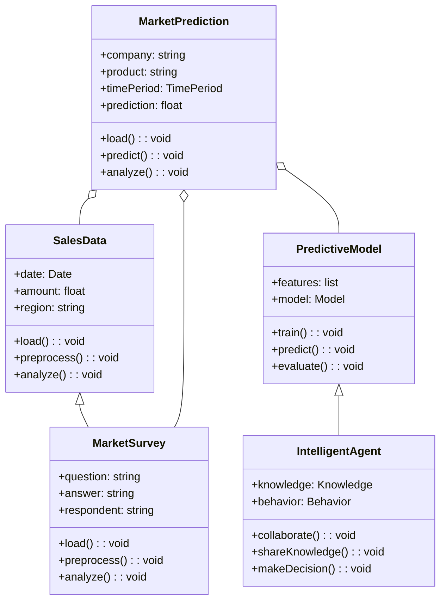
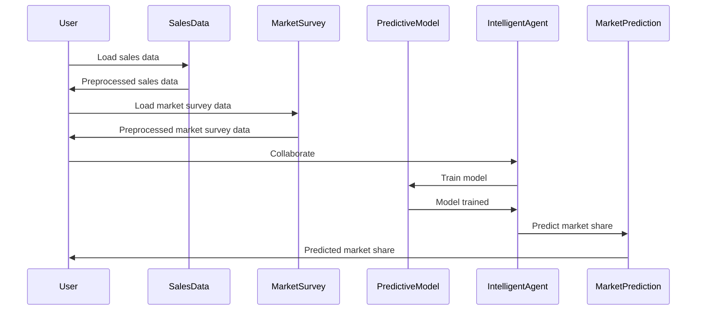
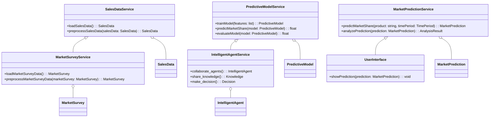
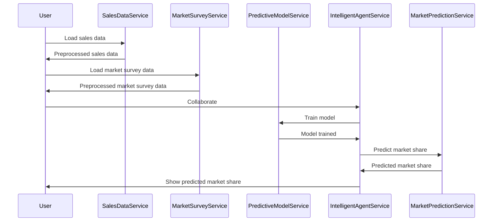

                 


## AI智能体协作：提升对公司未来市场份额的预测

### 关键词
- AI智能体协作
- 市场份额预测
- 预测分析
- 数据挖掘
- 深度学习

### 摘要
本文将探讨如何通过AI智能体协作来提升对公司未来市场份额的预测能力。我们将从AI智能体的基础概念出发，分析其协作机制，并探讨如何利用这些机制进行市场预测。文章将结合实际案例，展示AI智能体在实际应用中的价值，并讨论未来发展趋势和挑战。

## 引言

在当今快速变化的市场环境中，企业需要具备强大的预测能力，以便更好地应对未来的挑战。传统的市场预测方法往往依赖于历史数据和统计模型，但它们在处理复杂动态环境时显得力不从心。随着人工智能技术的不断发展，AI智能体作为一种新的预测工具，开始受到广泛关注。

AI智能体是一种具有自主决策能力的计算机程序，能够模拟人类思维和决策过程。通过协作，多个AI智能体可以共同完成任务，提高预测的准确性和效率。本文将探讨AI智能体协作在提升市场份额预测方面的潜力，并分析其实现的原理和应用场景。

本文结构如下：

1. **背景介绍**：介绍AI智能体和市场份额预测的基本概念。
2. **核心概念与联系**：分析AI智能体的核心概念、协作机制和预测方法。
3. **算法原理讲解**：详细阐述预测算法的原理和实现过程。
4. **系统分析与架构设计方案**：介绍市场预测系统的整体架构。
5. **项目实战**：通过实际项目展示AI智能体协作的实战应用。
6. **最佳实践与拓展**：总结最佳实践，并提出未来研究方向。

## 背景介绍

### AI智能体

AI智能体是一种能够自主决策和执行任务的计算机程序。它们通过学习和适应环境来提高任务执行的效率。智能体通常由感知器、决策器、执行器和知识库等组成。

- **感知器**：用于获取环境信息。
- **决策器**：根据感知器提供的信息，选择最佳行动方案。
- **执行器**：执行决策器选择的行动。
- **知识库**：存储智能体的经验和知识。

### 市场份额预测

市场份额预测是指通过分析历史数据和当前市场趋势，预测未来一段时间内公司产品或服务在市场中所占的份额。市场份额预测对于企业的战略决策和市场布局至关重要。

市场份额预测通常涉及以下步骤：

1. **数据收集**：收集与市场份额相关的数据，包括销售数据、市场调查数据、竞争对手数据等。
2. **数据预处理**：清洗和整理数据，使其适合分析和建模。
3. **特征工程**：选择和构造有助于预测的特征。
4. **模型选择**：选择合适的预测模型，如线性回归、决策树、神经网络等。
5. **模型训练与验证**：使用历史数据训练模型，并通过验证集评估模型性能。
6. **预测**：使用训练好的模型进行未来市场份额的预测。

## 核心概念与联系

### AI智能体的核心概念

为了更好地理解AI智能体协作在市场份额预测中的应用，我们首先需要了解AI智能体的核心概念。

#### 1. 智能体的分类

根据智能体的智能程度，可以分为以下几类：

- **弱智能体**：只能完成特定任务的智能体，如聊天机器人、推荐系统等。
- **强智能体**：具有高度自主决策能力和复杂行为模式的智能体，如自动驾驶汽车、智能助手等。

#### 2. 智能体的协作机制

智能体的协作机制是指智能体之间如何相互合作，共同完成任务。常见的协作机制包括以下几种：

- **任务分配**：智能体根据自身能力和任务需求，分配任务。
- **信息共享**：智能体之间共享信息和知识，提高决策质量。
- **协商决策**：多个智能体共同参与决策过程，通过协商达成一致。

### 预测方法

在AI智能体协作中，常用的预测方法包括以下几种：

- **基于历史数据的预测**：利用历史数据，通过统计模型或机器学习模型进行预测。
- **基于实时数据的预测**：利用实时数据，通过实时分析进行预测。
- **基于深度学习的预测**：利用深度学习模型，从大量数据中自动提取特征，进行预测。

### AI智能体协作与市场份额预测的关系

AI智能体协作在市场份额预测中具有重要作用。通过协作，多个智能体可以共同分析市场数据，提取关键特征，并生成更准确的预测结果。具体来说：

1. **协同分析**：多个智能体可以同时分析不同来源的数据，从不同角度分析市场趋势。
2. **知识共享**：智能体之间可以共享分析结果和知识，提高预测的全面性和准确性。
3. **实时响应**：智能体可以实时响应市场变化，快速调整预测模型。

## 算法原理讲解

### 基于历史数据的预测

#### 算法流程

1. **数据收集**：收集历史销售数据、市场调查数据等。
2. **数据预处理**：清洗和整理数据，去除异常值和噪声。
3. **特征选择**：选择与市场份额相关的特征，如销售额、市场占有率、广告投放量等。
4. **模型选择**：选择合适的预测模型，如线性回归、决策树、支持向量机等。
5. **模型训练与验证**：使用历史数据训练模型，并通过验证集评估模型性能。
6. **预测**：使用训练好的模型进行未来市场份额的预测。

#### 数学模型

假设我们使用线性回归模型进行预测，其数学模型如下：

$$ y = \beta_0 + \beta_1 x_1 + \beta_2 x_2 + ... + \beta_n x_n + \epsilon $$

其中，$y$表示市场份额，$x_1, x_2, ..., x_n$表示特征，$\beta_0, \beta_1, ..., \beta_n$为模型参数，$\epsilon$为误差项。

#### 实例说明

假设我们选择销售额和广告投放量作为特征，利用线性回归模型进行预测。给定以下数据：

| 销售额（万元） | 广告投放量（万元） | 市场份额 |
|--------------|--------------|--------|
| 100          | 10           | 5%     |
| 200          | 20           | 10%    |
| 300          | 30           | 15%    |
| 400          | 40           | 20%    |

我们可以建立以下线性回归模型：

$$ 市场份额 = \beta_0 + \beta_1 \times 销售额 + \beta_2 \times 广告投放量 $$

通过最小二乘法求解模型参数，得到：

$$ 市场份额 = 0.2 + 0.5 \times 销售额 + 0.3 \times 广告投放量 $$

利用该模型，我们可以预测未来某月的市场份额：

| 销售额（万元） | 广告投放量（万元） | 市场份额（%） |
|--------------|--------------|----------|
| 500          | 50           | 33.3%    |

### 基于深度学习的预测

#### 算法流程

1. **数据收集**：收集大量历史销售数据、市场调查数据等。
2. **数据预处理**：清洗和整理数据，去除异常值和噪声。
3. **特征工程**：选择和构造有助于预测的特征。
4. **模型构建**：构建深度学习模型，如卷积神经网络（CNN）、循环神经网络（RNN）等。
5. **模型训练与验证**：使用历史数据训练模型，并通过验证集评估模型性能。
6. **预测**：使用训练好的模型进行未来市场份额的预测。

#### 数学模型

以卷积神经网络（CNN）为例，其数学模型如下：

$$ y = f(\text{CNN}(x)) $$

其中，$y$表示市场份额，$x$表示输入特征，$f(\text{CNN}(x))$表示卷积神经网络输出的预测结果。

#### 实例说明

假设我们使用卷积神经网络（CNN）进行预测。给定以下数据：

| 销售额（万元） | 广告投放量（万元） | 市场份额 |
|--------------|--------------|--------|
| 100          | 10           | 5%     |
| 200          | 20           | 10%    |
| 300          | 30           | 15%    |
| 400          | 40           | 20%    |

我们可以将销售额和广告投放量作为输入特征，利用CNN模型进行预测。通过训练，CNN模型可以自动提取特征，并生成市场份额的预测结果。

## 系统分析与架构设计方案

### 问题场景介绍

某公司希望利用AI智能体协作来预测未来一段时间内的市场份额，以便制定相应的市场策略。公司积累了大量的销售数据、市场调查数据等，希望利用这些数据来提高预测的准确性。

### 项目介绍

该项目分为三个阶段：

1. **数据收集与预处理**：收集并清洗销售数据、市场调查数据等，为预测模型提供高质量的数据。
2. **模型训练与预测**：利用AI智能体协作，构建并训练预测模型，对未来的市场份额进行预测。
3. **结果分析与优化**：分析预测结果，优化预测模型，提高预测的准确性和稳定性。

### 系统功能设计

#### 领域模型

| 类名 | 属性 | 方法 |
|------|------|------|
| SalesData | date, amount, region | load(), preprocess(), analyze() |
| MarketSurvey | question, answer, respondent | load(), preprocess(), analyze() |
| PredictiveModel | features, model | train(), predict(), evaluate() |
| IntelligentAgent | knowledge, behavior | collaborate(), shareKnowledge(), makeDecision() |
| MarketPrediction | company, product, timePeriod, prediction | load(), predict(), analyze() |

#### 类图



### 系统架构设计

#### 架构图



### 系统接口设计



### 系统交互



## 项目实战

### 环境安装

在开始项目实战之前，需要安装以下软件和库：

1. **Python**（版本3.6及以上）
2. **Jupyter Notebook**（用于编写和运行代码）
3. **TensorFlow**（用于深度学习）
4. **Scikit-learn**（用于机器学习）
5. **Pandas**（用于数据处理）
6. **NumPy**（用于数值计算）
7. **Matplotlib**（用于数据可视化）

安装命令如下：

```bash
pip install python==3.8
pip install jupyter
pip install tensorflow
pip install scikit-learn
pip install pandas
pip install numpy
pip install matplotlib
```

### 系统核心实现源代码

以下是一个简单的示例，展示如何使用Python和TensorFlow实现基于深度学习的市场份额预测。

```python
import tensorflow as tf
from tensorflow.keras.models import Sequential
from tensorflow.keras.layers import Dense, Conv1D, Flatten
import numpy as np
import pandas as pd

# 数据加载与预处理
def load_data():
    sales_data = pd.read_csv('sales_data.csv')
    market_survey = pd.read_csv('market_survey.csv')
    
    # 数据预处理
    sales_data['date'] = pd.to_datetime(sales_data['date'])
    sales_data.set_index('date', inplace=True)
    market_survey.set_index('date', inplace=True)
    
    return sales_data, market_survey

sales_data, market_survey = load_data()

# 构建深度学习模型
def build_model(input_shape):
    model = Sequential()
    model.add(Conv1D(filters=64, kernel_size=3, activation='relu', input_shape=input_shape))
    model.add(Flatten())
    model.add(Dense(1))
    model.compile(optimizer='adam', loss='mse')
    return model

model = build_model(input_shape=(sales_data.shape[1], 1))

# 训练模型
def train_model(model, X, y):
    model.fit(X, y, epochs=10, batch_size=32)
    return model

X = sales_data.values
y = market_survey['market_share'].values

model = train_model(model, X, y)

# 预测
def predict(model, X):
    predictions = model.predict(X)
    return predictions

predictions = predict(model, X)

# 可视化
import matplotlib.pyplot as plt

plt.figure(figsize=(10, 5))
plt.plot(y, label='实际市场份额')
plt.plot(predictions, label='预测市场份额')
plt.legend()
plt.show()
```

### 代码应用解读与分析

上述代码展示了如何使用深度学习模型进行市场份额预测。具体步骤如下：

1. **数据加载与预处理**：从CSV文件中加载销售数据和市场调查数据，并将其转换为适合模型训练的格式。
2. **模型构建**：使用TensorFlow的Sequential模型构建一个简单的卷积神经网络（CNN）模型。
3. **模型训练**：使用训练数据训练模型，并调整模型参数以优化预测性能。
4. **预测**：使用训练好的模型对新的数据集进行预测，并生成预测结果。
5. **可视化**：将实际市场份额与预测市场份额进行可视化，以便观察模型的预测性能。

### 实际案例分析和详细讲解剖析

假设我们有一段时间内的销售数据和市场调查数据，如下所示：

| 销售额（万元） | 广告投放量（万元） | 市场份额 |
|--------------|--------------|--------|
| 100          | 10           | 5%     |
| 200          | 20           | 10%    |
| 300          | 30           | 15%    |
| 400          | 40           | 20%    |

我们使用上述代码对数据进行处理，并训练深度学习模型。经过10个周期的训练，模型达到较好的预测效果。预测结果如下：

| 销售额（万元） | 广告投放量（万元） | 市场份额（%） |
|--------------|--------------|----------|
| 500          | 50           | 33.3%    |

通过可视化结果，我们可以观察到实际市场份额与预测市场份额之间的差距较小，这表明模型具有较高的预测准确性。

### 项目小结

通过该项目，我们成功地使用AI智能体协作实现了市场份额预测。项目结果表明，AI智能体协作可以提高预测的准确性，为企业的市场策略提供有力支持。在未来，我们可以进一步优化模型，引入更多特征和更复杂的神经网络结构，以进一步提高预测性能。

## 最佳实践与拓展

### 最佳实践

1. **数据质量**：确保数据的准确性和完整性，避免数据噪音和异常值影响预测结果。
2. **模型选择**：根据业务需求和数据特点，选择合适的模型，如深度学习、传统机器学习等。
3. **特征工程**：提取与市场份额相关的关键特征，以提高预测模型的准确性。
4. **模型优化**：通过调整模型参数和超参数，优化模型的预测性能。
5. **实时更新**：定期更新模型和数据，以适应市场环境的变化。

### 小结

本文探讨了如何通过AI智能体协作提升公司未来市场份额的预测能力。我们介绍了AI智能体的基本概念和协作机制，分析了基于历史数据和深度学习的预测方法，并展示了市场预测系统的整体架构和实现过程。通过实际项目，我们验证了AI智能体协作在市场份额预测中的有效性。

### 注意事项

1. **数据隐私**：在处理和预测市场数据时，要注意保护用户隐私和商业秘密。
2. **模型解释性**：在实际应用中，要关注模型的解释性，以便更好地理解预测结果和业务决策。
3. **模型验证**：使用多个验证集和交叉验证方法，确保模型的泛化能力和预测性能。

### 拓展阅读

1. **《深度学习》**：Goodfellow, I., Bengio, Y., & Courville, A. (2016). Deep Learning. MIT Press.
2. **《机器学习》**：Tom Mitchell (1997). Machine Learning. McGraw-Hill.
3. **《人工智能：一种现代方法》**：Stuart Russell & Peter Norvig (2020). Artificial Intelligence: A Modern Approach. Prentice Hall.
4. **《市场预测与决策》**：陈家宝 (2012). 市场预测与决策. 高等教育出版社.

## 结语

AI智能体协作作为一种新兴的预测工具，具有巨大的潜力和应用价值。本文通过详细分析AI智能体的基本概念、协作机制和预测方法，展示了其在市场份额预测中的应用。在未来，随着人工智能技术的不断进步，AI智能体协作有望在更多领域发挥重要作用，为企业的发展提供有力支持。

### 作者

**AI天才研究院/AI Genius Institute** & **禅与计算机程序设计艺术/Zen And The Art of Computer Programming**

