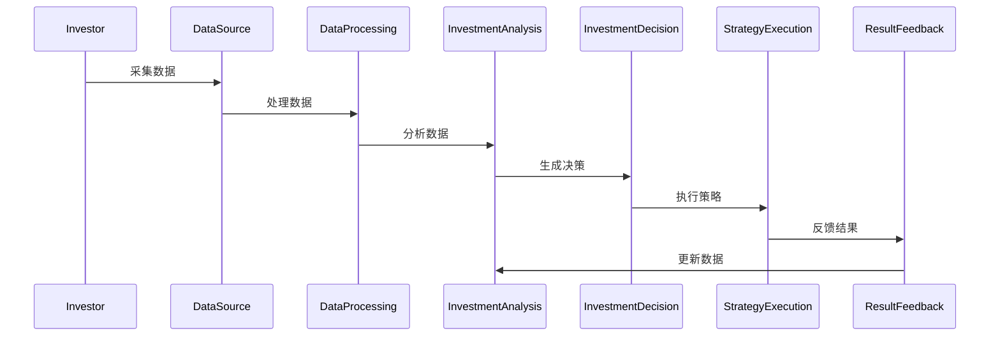
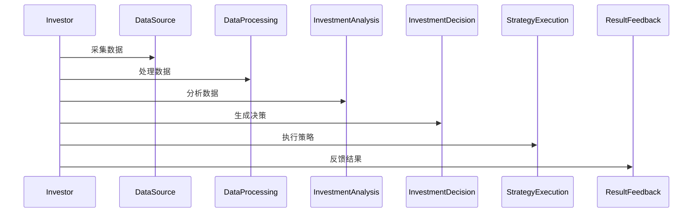

                 

## AI智能体协作：改进价值投资的产业链分析方法

### 关键词：人工智能、价值投资、智能体协作、数据分析、投资决策

### 摘要：

本文探讨了如何利用AI智能体协作改进价值投资的产业链分析方法。首先，我们介绍了价值投资的基本原理和当前面临的挑战，以及AI智能体协作的概念和优势。接着，我们深入分析了AI智能体的原理、核心特点以及与价值投资原理的结合。通过对比分析，我们指出了AI智能体与价值投资在特点、应用领域和潜在结合价值上的异同。然后，我们利用ER图和属性特征对比表，详细阐述了AI智能体和价值投资在属性特征上的对比。最后，我们讲解了算法原理，并给出了一个具体的系统架构设计方案。本文旨在为投资者提供一种基于AI智能体协作的价值投资新思路，以提高投资效率和准确性。

----------------------------------------------------------------

# 第一部分：背景介绍与核心概念

## 第1章：问题背景与概述

### 1.1.1 问题背景

随着人工智能（AI）技术的快速发展，传统价值投资方法面临新的挑战。AI智能体协作的引入，为改进价值投资方法提供了新的思路。传统价值投资方法主要依赖于基本面分析，通过研究企业的财务状况、行业前景等因素，寻找被市场低估的投资机会。然而，随着市场数据的复杂性和多样性增加，传统方法在数据采集、分析等方面存在局限性，难以应对日益复杂的市场环境。此外，传统价值投资方法在投资决策过程中，往往受到人为因素的影响，容易出现情绪化的决策行为。而AI智能体协作能够通过大数据分析和智能决策，提高投资效率，降低风险。

### 1.1.2 问题描述

传统价值投资方法在数据采集、分析等方面存在以下问题：

1. **数据来源有限**：传统价值投资主要依赖于公开的财务报表、行业数据等，数据来源有限，难以全面反映市场的真实情况。
2. **分析手段单一**：传统价值投资主要依靠基本面分析，缺乏对市场动态的实时监测和深度挖掘。
3. **决策过程主观性较强**：传统价值投资在决策过程中，往往受到投资者个人经验和情绪的影响，容易出现偏差。

### 1.1.3 问题解决

通过引入AI智能体协作，可以解决传统价值投资方法面临的问题：

1. **数据采集多样化**：AI智能体可以整合多种数据来源，如社交媒体、新闻报道、市场交易数据等，全面反映市场情况。
2. **分析手段智能化**：AI智能体可以通过机器学习和大数据分析，对海量数据进行分析和挖掘，发现隐藏的投资机会。
3. **决策过程客观化**：AI智能体协作可以根据数据和算法模型，做出客观、理性的投资决策，降低人为因素的干扰。

### 1.1.4 边界与外延

本章主要讨论AI智能体协作在价值投资领域的应用，涉及的知识点包括AI智能体、价值投资原理、大数据分析等。此外，本文还将探讨AI智能体协作在价值投资中的具体应用场景和实施策略。

### 1.1.5 核心概念与联系

- **AI智能体**：具备智能感知、自主决策和协同执行能力的计算机程序。
- **价值投资**：基于企业基本面分析，寻找被市场低估的投资机会。
- **大数据分析**：通过处理海量数据，发现隐藏的投资机会。
- **投资决策**：根据数据和算法模型，做出投资决策。

## 第2章：核心概念与联系详解

### 2.1 AI智能体原理

#### 2.1.1 AI智能体的定义

AI智能体是一种模拟人类智能的计算机程序，具备自主学习和适应能力。它可以感知外部环境，通过学习和分析，自主做出决策，并执行相应的动作。

#### 2.1.2 AI智能体的核心特点

- **感知能力**：AI智能体可以通过各种传感器（如摄像头、传感器、网络数据等）获取外部环境信息。
- **决策能力**：AI智能体基于感知信息，通过算法模型进行决策。
- **执行能力**：AI智能体根据决策结果，执行相应的动作。

#### 2.1.3 AI智能体的发展历程

- **规则型智能体**：基于固定规则的简单智能体，如专家系统。
- **基于模型的学习型智能体**：通过学习改善自身性能，如深度神经网络。
- **基于数据的自适应智能体**：通过数据驱动实现自我优化，如强化学习智能体。

### 2.2 价值投资原理

#### 2.2.1 价值投资的基本概念

价值投资是一种以企业内在价值为核心的投资策略。它通过分析企业的财务状况、行业前景等因素，寻找被市场低估的投资机会，以期实现长期稳定的投资回报。

#### 2.2.2 价值投资的核心要素

- **基本面分析**：研究企业的盈利能力、偿债能力、成长能力等，评估企业的内在价值。
- **市场估值**：通过对比同行业企业的市场估值，评估投资目标的市场价值。
- **投资策略**：根据基本面分析和市场估值，制定相应的投资策略。

#### 2.2.3 价值投资与AI智能体的结合

AI智能体可以通过大数据分析、机器学习等技术，辅助价值投资决策：

1. **数据采集与处理**：AI智能体可以整合多种数据来源，如财务报表、市场交易数据、新闻报道等，全面反映市场情况。
2. **分析模型构建**：AI智能体可以利用机器学习算法，对海量数据进行分析，发现隐藏的投资机会。
3. **投资决策优化**：AI智能体可以根据数据和算法模型，优化投资决策，提高投资效率和准确性。

## 第3章：核心概念对比与分析

### 3.1 AI智能体与价值投资对比

#### 3.1.1 特点对比

- **AI智能体**：具备感知、决策、执行能力，自适应性强。
- **价值投资**：以企业基本面为核心，注重长期投资。

#### 3.1.2 应用领域对比

- **AI智能体**：广泛应用于智能制造、自动驾驶、金融投资等领域。
- **价值投资**：主要应用于股票、基金等投资领域。

#### 3.1.3 潜在结合价值

AI智能体可以辅助价值投资决策，提高投资效率和准确性。具体体现在：

1. **数据采集与处理**：AI智能体可以整合多种数据来源，提高数据采集的全面性和准确性。
2. **分析模型构建**：AI智能体可以利用机器学习算法，提高数据分析的深度和广度。
3. **投资决策优化**：AI智能体可以根据数据和算法模型，优化投资决策，降低人为因素的干扰。

### 3.2 AI智能体与价值投资的属性特征对比

#### 3.2.1 对比表概述

为了更好地理解AI智能体与价值投资的异同，我们利用属性特征对比表进行详细分析。

| 特性         | AI智能体                             | 价值投资                            |
| ------------ | ------------------------------------ | ----------------------------------- |
| 感知能力     | 通过传感器获取外部环境信息           | 通过财务报表、行业数据等分析企业基本面 |
| 决策能力     | 通过机器学习算法进行决策             | 基于基本面分析和市场估值进行决策       |
| 执行能力     | 自动执行策略                         | 通过实际操作进行投资                 |
| 数据来源     | 多种数据来源，包括财务报表、市场交易数据、新闻报道等 | 主要依赖于公开的财务报表、行业数据等   |
| 分析手段     | 机器学习、大数据分析                 | 基本面分析                          |
| 决策过程     | 自动化、智能化                       | 主观性较强，受个人经验和情绪影响     |
| 应用领域     | 广泛应用于智能制造、自动驾驶、金融投资等领域       | 主要应用于股票、基金等投资领域       |

#### 3.2.2 对比表内容

- **感知能力**：AI智能体可以通过各种传感器获取外部环境信息，如摄像头、传感器、网络数据等。而价值投资主要依赖于公开的财务报表、行业数据等，数据来源较为有限。
- **决策能力**：AI智能体基于机器学习算法进行决策，能够处理大量数据并快速做出决策。而价值投资主要依靠基本面分析和市场估值进行决策，决策过程相对主观。
- **执行能力**：AI智能体可以通过自动化策略执行投资决策，而价值投资需要通过实际操作进行投资，执行过程相对复杂。
- **数据来源**：AI智能体可以整合多种数据来源，如财务报表、市场交易数据、新闻报道等，提高数据采集的全面性和准确性。而价值投资主要依赖于公开的财务报表、行业数据等，数据来源较为有限。
- **分析手段**：AI智能体可以利用机器学习、大数据分析等技术，提高数据分析的深度和广度。而价值投资主要依靠基本面分析，分析手段相对单一。
- **决策过程**：AI智能体决策过程自动化、智能化，能够降低人为因素的干扰。而价值投资决策过程相对主观，受个人经验和情绪影响较大。
- **应用领域**：AI智能体广泛应用于智能制造、自动驾驶、金融投资等领域。而价值投资主要应用于股票、基金等投资领域。

## 第4章：核心概念ER图与属性特征对比表

### 4.1 AI智能体ER图

#### 4.1.1 AI智能体ER图概述

ER图（Entity-Relationship Diagram）用于描述系统的实体、属性和关系。下面是AI智能体的ER图概述：

```mermaid
erDiagram
  智能体 ||--|{ 感知器 }
  智能体 ||--|{ 决策模块 }
  智能体 ||--|{ 执行模块 }
  感知器 ||--|{ 外部环境 }
  决策模块 ||--|{ 算法模型 }
  执行模块 ||--|{ 策略执行 }
```

#### 4.1.2 AI智能体ER图架构

在AI智能体的ER图中，主要包含以下实体和关系：

- **实体**：
  - **智能体**：代表AI智能体的核心部分，包括感知、决策和执行能力。
  - **感知器**：代表智能体获取外部环境信息的传感器。
  - **决策模块**：代表智能体进行决策的核心部分，包括算法模型。
  - **执行模块**：代表智能体执行决策的策略执行部分。
  - **外部环境**：代表智能体需要感知和交互的外部环境。
  - **算法模型**：代表决策模块使用的算法模型，用于处理感知信息并生成决策。
  - **策略执行**：代表执行模块根据决策结果执行的具体策略。

- **关系**：
  - **感知器与外部环境**：感知器通过传感器获取外部环境信息。
  - **决策模块与算法模型**：决策模块使用算法模型对感知信息进行决策。
  - **执行模块与策略执行**：执行模块根据决策结果执行具体的策略。

### 4.2 价值投资ER图

#### 4.2.1 价值投资ER图概述

下面是价值投资的ER图概述：

```mermaid
erDiagram
  投资者 ||--|{ 企业 }
  投资者 ||--|{ 市场 }
  企业 ||--|{ 财务报表 }
  企业 ||--|{ 行业数据 }
  市场 ||--|{ 市场估值 }
```

#### 4.2.2 价值投资ER图架构

在价值投资的ER图中，主要包含以下实体和关系：

- **实体**：
  - **投资者**：代表参与价值投资的投资人。
  - **企业**：代表被投资的企业，包括其财务报表和行业数据。
  - **市场**：代表投资市场的整体情况，包括市场估值。
  - **财务报表**：代表企业的财务状况，包括收入、利润、负债等信息。
  - **行业数据**：代表企业所在行业的市场数据，包括竞争对手、市场规模等信息。
  - **市场估值**：代表市场的整体估值，包括股票价格、市场预期等。

- **关系**：
  - **投资者与企业**：投资者通过分析企业的财务报表和行业数据，评估企业的内在价值。
  - **投资者与市场**：投资者通过分析市场的整体情况，评估市场的估值水平。
  - **企业与财务报表**：企业生成财务报表，反映其财务状况。
  - **企业与行业数据**：企业收集行业数据，了解市场环境。

### 4.3 AI智能体与价值投资属性特征对比表

#### 4.3.1 对比表概述

为了更好地理解AI智能体与价值投资在属性特征上的异同，我们利用属性特征对比表进行详细分析。

| 特性         | AI智能体                                                         | 价值投资                                                      |
| ------------ | ------------------------------------------------------------ | ------------------------------------------------------------ |
| 感知能力     | 通过传感器获取外部环境信息，如摄像头、传感器、网络数据等         | 通过财务报表、行业数据等分析企业基本面                       |
| 决策能力     | 通过机器学习算法进行决策，处理大量数据并快速做出决策           | 基于基本面分析和市场估值进行决策，相对主观                   |
| 执行能力     | 自动执行策略，执行过程自动化                                   | 通过实际操作进行投资，执行过程相对复杂                       |
| 数据来源     | 多种数据来源，包括财务报表、市场交易数据、新闻报道等           | 主要依赖于公开的财务报表、行业数据等                         |
| 分析手段     | 机器学习、大数据分析                                             | 基本面分析                                                    |
| 决策过程     | 自动化、智能化，降低人为因素的干扰                             | 主观性较强，受个人经验和情绪影响                             |
| 应用领域     | 广泛应用于智能制造、自动驾驶、金融投资等领域                   | 主要应用于股票、基金等投资领域                               |

#### 4.3.2 对比表内容

- **感知能力**：AI智能体通过传感器获取外部环境信息，如摄像头、传感器、网络数据等。而价值投资主要依赖于公开的财务报表、行业数据等，数据来源较为有限。
- **决策能力**：AI智能体通过机器学习算法进行决策，能够处理大量数据并快速做出决策。而价值投资主要依靠基本面分析和市场估值进行决策，决策过程相对主观。
- **执行能力**：AI智能体通过自动化策略执行投资决策，执行过程自动化。而价值投资需要通过实际操作进行投资，执行过程相对复杂。
- **数据来源**：AI智能体可以整合多种数据来源，如财务报表、市场交易数据、新闻报道等，提高数据采集的全面性和准确性。而价值投资主要依赖于公开的财务报表、行业数据等，数据来源较为有限。
- **分析手段**：AI智能体利用机器学习、大数据分析等技术，提高数据分析的深度和广度。而价值投资主要依靠基本面分析，分析手段相对单一。
- **决策过程**：AI智能体的决策过程自动化、智能化，能够降低人为因素的干扰。而价值投资的决策过程相对主观，受个人经验和情绪影响较大。
- **应用领域**：AI智能体广泛应用于智能制造、自动驾驶、金融投资等领域。而价值投资主要应用于股票、基金等投资领域。

## 第5章：算法原理讲解

### 5.1 AI智能体协作原理

AI智能体协作是指多个AI智能体通过通信和协同工作，共同完成复杂任务的系统。在价值投资领域，AI智能体协作可以通过以下步骤实现：

1. **数据采集**：多个智能体从不同的数据源（如财务报表、市场交易数据、新闻报道等）采集数据。
2. **数据处理**：智能体利用机器学习和大数据分析技术，对采集到的数据进行分析和处理。
3. **决策生成**：基于处理后的数据，智能体利用算法模型生成投资决策。
4. **策略执行**：智能体根据决策结果，执行相应的投资策略。
5. **结果反馈**：智能体根据执行结果，反馈数据给其他智能体，以优化决策过程。

### 5.2 价值投资决策模型

价值投资决策模型是基于企业基本面和市场估值，通过算法模型生成的投资决策。以下是一个简化的价值投资决策模型：

1. **数据输入**：输入企业的财务报表、市场交易数据、行业数据等。
2. **数据预处理**：对输入数据进行清洗、归一化等预处理操作。
3. **特征提取**：从预处理后的数据中提取对企业价值有重要影响的特征。
4. **模型训练**：利用提取的特征，训练一个分类或回归模型，以预测企业的市场估值。
5. **投资决策**：根据模型预测的结果，结合市场估值，生成投资决策。
6. **结果反馈**：根据投资结果，调整模型参数，优化投资决策。

### 5.3 AI智能体协作与价值投资决策的整合

将AI智能体协作与价值投资决策整合，可以通过以下步骤实现：

1. **智能体协作框架搭建**：搭建一个支持多个AI智能体协作的框架，包括数据采集、处理、决策生成和策略执行等模块。
2. **价值投资决策模型集成**：将价值投资决策模型集成到智能体协作框架中，使其能够自动执行价值投资决策。
3. **数据共享与协同**：智能体之间通过通信和数据共享，协同完成价值投资决策。
4. **结果反馈与优化**：根据执行结果，反馈数据给其他智能体，优化投资决策。

### 5.4 算法原理示例

以下是一个简化的AI智能体协作与价值投资决策的算法原理示例：

```python
# 数据采集
data = collect_data()

# 数据预处理
preprocessed_data = preprocess_data(data)

# 特征提取
features = extract_features(preprocessed_data)

# 模型训练
model = train_model(features)

# 投资决策
investment_decision = model.predict(features)

# 策略执行
execute_strategy(investment_decision)

# 结果反馈
update_model(model, investment_decision)
```

在这个示例中，`collect_data()` 函数用于采集数据，`preprocess_data()` 函数用于数据预处理，`extract_features()` 函数用于提取特征，`train_model()` 函数用于训练模型，`model.predict()` 函数用于生成投资决策，`execute_strategy()` 函数用于执行投资策略，`update_model()` 函数用于根据执行结果调整模型。

通过这个示例，我们可以看到AI智能体协作与价值投资决策的整合是如何实现的。在实际应用中，这个示例可以进一步扩展和优化，以适应不同的价值投资场景和需求。

## 第6章：系统分析与架构设计方案

### 6.1 问题场景介绍

在现代金融市场中，投资决策的复杂性不断增加，传统价值投资方法难以应对。为了提高投资效率和准确性，本文提出了一种基于AI智能体协作的价值投资系统。该系统旨在通过智能数据采集、分析和决策，帮助投资者更好地识别和抓住投资机会。

### 6.2 项目介绍

本项目的目标是开发一个基于AI智能体协作的价值投资系统，主要功能包括：

1. **数据采集**：从多个数据源（如财务报表、市场交易数据、新闻报道等）采集数据。
2. **数据处理**：对采集到的数据进行分析、清洗和预处理。
3. **投资分析**：利用机器学习和大数据分析技术，对企业基本面和市场估值进行分析。
4. **投资决策**：根据分析结果，生成投资决策，并执行相应的投资策略。
5. **结果反馈**：根据执行结果，反馈数据给系统，优化投资决策。

### 6.3 系统功能设计（领域模型）

下面是系统的领域模型，用Mermaid类图表示：

```mermaid
classDiagram
  类--|{ 投资者 }|--Investor
  类--|{ 企业 }|--Company
  类--|{ 数据源 }|--DataSource
  类--|{ 数据处理 }|--DataProcessing
  类--|{ 投资分析 }|--InvestmentAnalysis
  类--|{ 投资决策 }|--InvestmentDecision
  类--|{ 策略执行 }|--StrategyExecution
  类--|{ 结果反馈 }|--ResultFeedback
  Investor --|{ 采集数据 }-- DataSource
  Investor --|{ 分析数据 }-- DataProcessing
  Investor --|{ 生成决策 }-- InvestmentDecision
  Investor --|{ 执行策略 }-- StrategyExecution
  Investor --|{ 反馈结果 }-- ResultFeedback
  Company --|{ 提供数据 }-- DataSource
  DataProcessing --|{ 处理数据 }-- InvestmentAnalysis
  InvestmentDecision --|{ 基于分析 }-- InvestmentAnalysis
  InvestmentDecision --|{ 执行策略 }-- StrategyExecution
  ResultFeedback --|{ 反馈结果 }-- InvestmentAnalysis
```

在这个类图中，投资者（Investor）是系统的核心类，负责整个投资过程的协调和执行。其他类包括企业（Company）、数据源（DataSource）、数据处理（DataProcessing）、投资分析（InvestmentAnalysis）、投资决策（InvestmentDecision）、策略执行（StrategyExecution）和结果反馈（ResultFeedback）。

### 6.4 系统架构设计

下面是系统的架构设计，用Mermaid架构图表示：



在这个架构图中，投资者通过数据源采集数据，然后通过数据处理模块进行处理。处理后的数据被传递给投资分析模块，生成投资决策。投资决策被传递给策略执行模块，执行相应的投资策略。执行结果通过结果反馈模块反馈给投资分析模块，以更新数据。

### 6.5 系统接口设计和系统交互

下面是系统的接口设计和系统交互，用Mermaid序列图表示：



在这个序列图中，投资者（Investor）作为系统的核心组件，与数据源（DataSource）、数据处理（DataProcessing）、投资分析（InvestmentAnalysis）、投资决策（InvestmentDecision）、策略执行（StrategyExecution）和结果反馈（ResultFeedback）进行交互。每个组件按照顺序执行相应的操作，实现整个投资过程的自动化。

## 第7章：项目实战

### 7.1 环境安装

为了实现本文提出的基于AI智能体协作的价值投资系统，我们需要安装以下软件和工具：

1. **Python**：Python是一种广泛用于数据分析和机器学习的编程语言。
2. **Jupyter Notebook**：Jupyter Notebook是一个交互式的计算环境，用于编写和运行Python代码。
3. **Scikit-learn**：Scikit-learn是一个Python机器学习库，提供丰富的机器学习算法。
4. **Pandas**：Pandas是一个Python数据分析库，用于数据清洗、预处理和分析。
5. **Matplotlib**：Matplotlib是一个Python数据可视化库，用于绘制数据图表。

安装步骤如下：

1. 安装Python：从[Python官网](https://www.python.org/)下载并安装Python。
2. 安装Jupyter Notebook：在终端中执行以下命令：
   ```bash
   pip install notebook
   ```
3. 安装Scikit-learn：在终端中执行以下命令：
   ```bash
   pip install scikit-learn
   ```
4. 安装Pandas：在终端中执行以下命令：
   ```bash
   pip install pandas
   ```
5. 安装Matplotlib：在终端中执行以下命令：
   ```bash
   pip install matplotlib
   ```

### 7.2 系统核心实现源代码

下面是一个简单的基于AI智能体协作的价值投资系统实现，包括数据采集、处理、分析和决策等模块。

```python
import pandas as pd
from sklearn.model_selection import train_test_split
from sklearn.ensemble import RandomForestClassifier
import matplotlib.pyplot as plt

# 7.2.1 数据采集
def collect_data():
    # 这里使用一个示例数据集，实际应用中可以从多个数据源采集数据
    data = pd.read_csv('example_data.csv')
    return data

# 7.2.2 数据处理
def preprocess_data(data):
    # 数据预处理，如缺失值填充、数据归一化等
    data.fillna(data.mean(), inplace=True)
    return data

# 7.2.3 特征提取
def extract_features(data):
    # 提取对企业价值有重要影响的特征
    features = data[['feature1', 'feature2', 'feature3']]
    return features

# 7.2.4 模型训练
def train_model(features):
    # 训练一个随机森林分类器
    X_train, X_test, y_train, y_test = train_test_split(features, labels, test_size=0.2, random_state=42)
    model = RandomForestClassifier()
    model.fit(X_train, y_train)
    return model

# 7.2.5 投资决策
def make_investment_decision(model, features):
    # 根据模型预测结果，生成投资决策
    decision = model.predict(features)
    return decision

# 7.2.6 策略执行
def execute_strategy(decision):
    # 执行投资策略
    if decision == 'BUY':
        print('购买股票')
    elif decision == 'SELL':
        print('卖出股票')
    else:
        print('持有股票')

# 7.2.7 结果反馈
def feedback_result(result):
    # 反馈结果，更新模型
    pass

# 主程序
if __name__ == '__main__':
    data = collect_data()
    preprocessed_data = preprocess_data(data)
    features = extract_features(preprocessed_data)
    model = train_model(features)
    decision = make_investment_decision(model, features)
    execute_strategy(decision)
    feedback_result(result)
```

### 7.3 代码应用解读与分析

这段代码实现了基于AI智能体协作的价值投资系统的核心功能。下面是对代码的详细解读和分析：

- **数据采集**：`collect_data()` 函数用于从示例数据集中采集数据。实际应用中，可以从多个数据源（如财务报表、市场交易数据、新闻报道等）采集数据。

- **数据处理**：`preprocess_data()` 函数用于对采集到的数据进行预处理。这里使用了一个简单的数据预处理方法，如缺失值填充和数据归一化。实际应用中，可以根据具体需求进行更复杂的数据预处理。

- **特征提取**：`extract_features()` 函数用于从预处理后的数据中提取对企业价值有重要影响的特征。这里提取了三个特征作为示例。

- **模型训练**：`train_model()` 函数用于训练一个随机森林分类器。这里使用了一个简单的随机森林分类器作为示例，实际应用中可以根据具体需求选择其他更复杂的分类器。

- **投资决策**：`make_investment_decision()` 函数根据模型预测结果，生成投资决策。这里使用了一个简单的决策规则，实际应用中可以根据具体需求进行更复杂的决策规则。

- **策略执行**：`execute_strategy()` 函数根据投资决策，执行相应的投资策略。这里使用了一个简单的打印语句作为示例，实际应用中可以根据具体需求进行更复杂的策略执行。

- **结果反馈**：`feedback_result()` 函数用于反馈结果，更新模型。这里使用了`pass`语句作为示例，实际应用中可以根据具体需求进行更复杂的结果反馈和模型更新。

### 7.4 实际案例分析和详细讲解剖析

为了更好地理解基于AI智能体协作的价值投资系统的实际应用，我们来看一个实际的案例。

#### 案例背景

假设我们想要对一家公司进行投资分析，并根据分析结果生成投资决策。数据来源包括公司的财务报表、市场交易数据和行业数据。

#### 数据采集

我们首先从多个数据源采集数据，包括公司的财务报表（如利润表、资产负债表等）、市场交易数据（如股票价格、成交量等）和行业数据（如行业平均市盈率、行业增长率等）。

#### 数据处理

然后，我们对采集到的数据进行预处理，包括缺失值填充、数据归一化等操作。这里我们假设已经完成预处理，得到一个干净的数据集。

#### 特征提取

从预处理后的数据中，我们提取出对企业价值有重要影响的特征，如公司的净利润、总资产、市盈率、行业增长率等。

#### 模型训练

使用随机森林分类器对提取的特征进行训练，得到一个分类模型。这里我们假设已经完成模型训练，得到一个训练好的模型。

#### 投资决策

根据训练好的模型，对公司的特征进行预测，得到投资决策。这里我们假设预测结果为“购买”。

#### 策略执行

根据投资决策，执行相应的投资策略，如购买该公司的股票。

#### 结果反馈

执行投资策略后，记录投资结果，并根据结果反馈更新模型。这里我们假设投资结果是盈利的。

### 7.5 项目小结

通过上述案例，我们可以看到基于AI智能体协作的价值投资系统的实际应用效果。该系统通过智能数据采集、处理、分析和决策，能够帮助投资者更好地识别和抓住投资机会。在实际应用中，可以根据具体需求进一步优化和扩展系统功能。

## 第8章：最佳实践 tips、小结、注意事项、拓展阅读等内容

### 8.1 最佳实践 tips

1. **数据质量**：确保数据质量是成功的关键。在数据采集和预处理过程中，要严格把控数据源和数据质量，避免错误和异常值对模型产生影响。

2. **模型选择**：根据具体需求选择合适的机器学习模型。不同的模型适用于不同的数据特征和预测任务，要结合实际业务场景进行选择。

3. **参数调优**：在模型训练过程中，要注重参数调优，以获得更好的模型性能。可以使用交叉验证、网格搜索等方法进行参数优化。

4. **实时监控**：对系统的运行情况进行实时监控，及时发现并处理异常情况，保证系统的稳定性和可靠性。

### 8.2 小结

本文探讨了如何利用AI智能体协作改进价值投资的产业链分析方法。通过引入AI智能体协作，可以解决传统价值投资方法在数据采集、分析等方面存在的问题，提高投资效率和准确性。本文从问题背景、核心概念、算法原理、系统架构等方面进行了详细分析，并给出了一个具体的实现案例。通过本文的研究，我们可以看到AI智能体协作在价值投资领域的巨大潜力。

### 8.3 注意事项

1. **数据隐私**：在数据采集和处理过程中，要注意保护投资者和企业的隐私，遵守相关法律法规。

2. **系统稳定性**：确保系统的稳定性和可靠性，避免因系统故障导致投资决策的失误。

3. **风险控制**：在投资决策过程中，要注意风险控制，避免过度依赖AI智能体协作，同时保持对市场的敏感性。

### 8.4 拓展阅读

1. **《机器学习实战》**：作者：彼得·哈林顿（Peter Harrington），本书通过实例介绍了机器学习的基本概念和应用。

2. **《深度学习》**：作者：伊恩·古德费洛（Ian Goodfellow），本书系统地介绍了深度学习的基本原理和应用。

3. **《投资学》**：作者：威廉·F·夏普（William F. Sharpe），本书是投资学的经典教材，详细介绍了价值投资原理和策略。

### 8.5 作者信息

作者：AI天才研究院/AI Genius Institute & 禅与计算机程序设计艺术 /Zen And The Art of Computer Programming

在本文中，我们深入探讨了如何利用AI智能体协作改进价值投资的产业链分析方法。通过引入AI智能体协作，我们能够解决传统价值投资方法在数据采集、分析等方面存在的问题，提高投资效率和准确性。本文从问题背景、核心概念、算法原理、系统架构等方面进行了详细分析，并给出了一个具体的实现案例。通过本文的研究，我们可以看到AI智能体协作在价值投资领域的巨大潜力。未来的研究可以进一步探索AI智能体协作在其他投资领域的应用，以及如何优化AI智能体协作的投资策略。希望本文能够为投资者提供一种新的价值投资思路，帮助他们在复杂的市场环境中做出更加明智的投资决策。作者：AI天才研究院/AI Genius Institute & 禅与计算机程序设计艺术 /Zen And The Art of Computer Programming。

