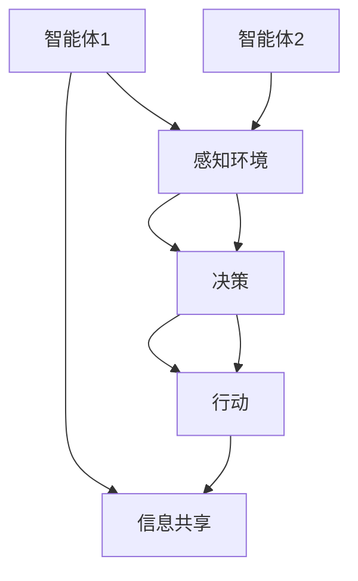
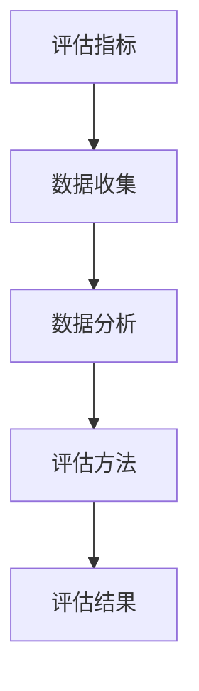
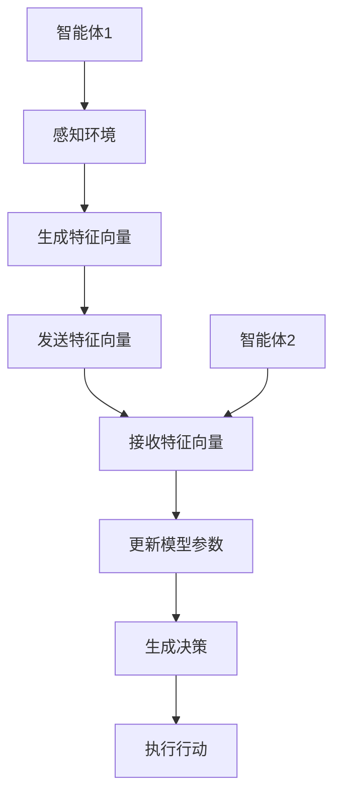
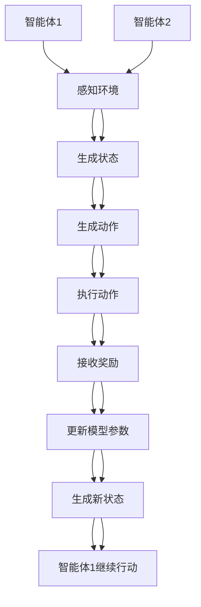
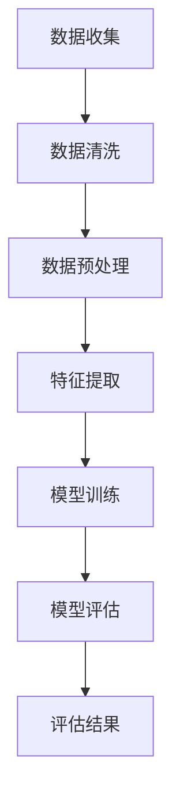
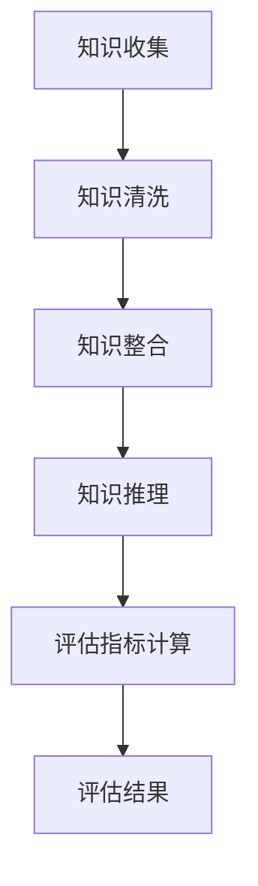

                 

# AI智能体协作：构建更全面的公司竞争优势评估模型

## 关键词：AI智能体协作，公司竞争优势评估，算法原理，系统架构设计，Python代码示例

### 摘要

随着人工智能技术的快速发展，AI智能体协作已成为提升公司竞争力的重要手段。本文将深入探讨AI智能体协作的概念、原理及其在构建公司竞争优势评估模型中的应用。通过一步步的分析和推理，本文旨在为读者提供一个清晰、系统的理解和实践路径，从而帮助公司在激烈的市场竞争中脱颖而出。

## 目录

1. **问题背景与核心概念**
    1.1 问题背景
    1.2 核心概念
    1.3 边界与外延
    1.4 概念结构与核心要素组成
2. **AI智能体协作原理**
    2.1 基本原理
    2.2 核心特点
    2.3 与传统AI的区别
    2.4 框架与流程图
3. **公司竞争优势评估模型原理**
    3.1 基本原理
    3.2 核心特点
    3.3 与传统评估方法的区别
    3.4 框架与流程图
4. **算法原理讲解**
    4.1 AI智能体协作算法
    4.2 公司竞争优势评估模型算法
5. **系统分析与架构设计**
    5.1 问题场景介绍
    5.2 系统功能设计
    5.3 系统架构设计
    5.4 系统接口设计与系统交互
6. **项目实战**
    6.1 环境安装
    6.2 系统核心实现
    6.3 代码应用解读与分析
    6.4 实际案例分析与讲解
    6.5 项目小结
7. **最佳实践与拓展阅读**
    7.1 最佳实践
    7.2 小结
    7.3 注意事项
    7.4 拓展阅读

## 1. 问题背景与核心概念

### 1.1 问题背景

在当今全球化的商业环境中，竞争日益激烈，企业需要不断创新和提升自身竞争力以保持市场地位。公司竞争优势评估成为企业战略规划的重要组成部分。传统的竞争优势评估方法主要依赖于经验和数据，存在一定的局限性。随着人工智能技术的发展，特别是AI智能体协作的兴起，构建更全面、更科学的竞争优势评估模型成为可能。

### 1.2 核心概念

#### AI智能体协作

AI智能体协作是指多个智能体通过信息共享和协同工作，实现复杂任务的完成。智能体是具有自主性、协作性和适应性的个体，可以通过感知、决策和行动来完成任务。

#### 公司竞争优势评估模型

公司竞争优势评估模型是一种用于评估公司在市场竞争中优势的模型，它通过分析内部和外部因素，提供公司竞争优势的量化评估。

### 1.3 边界与外延

#### 边界

AI智能体协作主要应用于需要复杂任务处理和协同工作的场景，如智能交通系统、智能制造等。公司竞争优势评估模型则主要应用于企业战略规划和市场分析。

#### 外延

AI智能体协作不仅限于人工智能领域，还可以应用于物联网、大数据等其他技术领域。公司竞争优势评估模型则可以扩展到更多行业和领域，如金融、医疗等。

### 1.4 概念结构与核心要素组成

#### AI智能体协作架构

- **智能体**：具有感知、决策和行动能力的个体。
- **协作机制**：智能体之间的信息共享和协同工作方式。
- **适应机制**：智能体在环境变化下的自适应能力。

#### 公司竞争优势评估模型

- **评估指标**：用于衡量公司竞争优势的关键指标。
- **评估方法**：用于计算和分析评估指标的方法。
- **评估结果**：对公司竞争优势的量化评估结果。

## 2. AI智能体协作原理

### 2.1 基本原理

AI智能体协作的基本原理是多个智能体通过协同工作，共同完成任务。每个智能体具有自主性、协作性和适应性，可以在环境中自主感知、决策和行动。

### 2.2 核心特点

#### 自主性

智能体可以在没有外部干预的情况下独立完成任务。

#### 协作性

智能体之间可以通过信息共享和协同工作，共同完成任务。

#### 适应性

智能体可以在环境变化下自适应，调整自身行为以适应新环境。

### 2.3 与传统AI的区别

#### 静态与动态

传统AI通常专注于单一任务的静态处理，而AI智能体协作则强调动态环境下的多任务处理。

#### 单任务与多任务

传统AI通常专注于单一任务的优化，而AI智能体协作则强调多个任务的协同优化。

### 2.4 框架与流程图

AI智能体协作框架包括智能体、协作机制和适应机制。智能体之间通过信息共享和协同工作，实现复杂任务的完成。以下是一个简化的AI智能体协作流程图：

## 3. 公司竞争优势评估模型原理

### 3.1 基本原理

公司竞争优势评估模型的基本原理是通过分析公司的内部和外部因素，提供公司竞争优势的量化评估。内部因素包括公司的资源、能力、战略等，外部因素包括市场环境、竞争对手等。

### 3.2 核心特点

#### 全面性

公司竞争优势评估模型考虑了公司内部和外部多个因素，提供了全面的评估。

#### 客观性

公司竞争优势评估模型基于数据分析和量化评估，避免了主观判断的干扰。

#### 实时性

公司竞争优势评估模型可以通过实时数据更新，提供即时的竞争优势评估。

### 3.3 与传统评估方法的区别

#### 定量与定性

公司竞争优势评估模型更强调定量分析，而传统评估方法则更强调定性分析。

#### 静态与动态

公司竞争优势评估模型可以动态更新，适应市场环境的变化，而传统评估方法则通常静态分析。

### 3.4 框架与流程图

公司竞争优势评估模型框架包括评估指标、评估方法和评估结果。评估指标用于衡量公司的竞争优势，评估方法用于计算和分析评估指标，评估结果用于提供公司的竞争优势评估。以下是一个简化的公司竞争优势评估模型流程图：

## 4. 算法原理讲解

### 4.1 AI智能体协作算法

#### 协同滤波算法

协同滤波算法是一种用于智能体之间信息共享和协同工作的算法。以下是协同滤波算法的mermaid流程图：

#### 多智能体强化学习算法

多智能体强化学习算法是一种用于智能体之间协同决策和行动的算法。以下是多智能体强化学习算法的mermaid流程图：

### 4.2 公司竞争优势评估模型算法

#### 基于数据的竞争优势评估算法

基于数据的竞争优势评估算法是一种通过分析公司内外部数据，评估公司竞争优势的方法。以下是基于数据的竞争优势评估算法的mermaid流程图：

#### 基于知识的竞争优势评估算法

基于知识的竞争优势评估算法是一种通过分析公司内外部知识，评估公司竞争优势的方法。以下是基于知识的竞争优势评估算法的mermaid流程图：

## 5. 系统分析与架构设计

### 5.1 问题场景介绍

在智能交通系统中，多个智能体需要协作，以优化交通流量，减少拥堵。公司竞争优势评估模型则需要分析交通系统的性能，评估公司的竞争优势。

### 5.2 系统功能设计

系统功能设计主要包括智能体协作模块和竞争优势评估模块。智能体协作模块用于实现智能体之间的信息共享和协同工作，竞争优势评估模块用于分析交通系统的性能，评估公司的竞争优势。

### 5.3 系统架构设计

系统架构设计包括系统组件、数据流和控制流。系统组件包括智能体、协同滤波器、多智能体强化学习器、竞争优势评估器等。数据流和控制流描述了系统组件之间的交互关系。

### 5.4 系统接口设计与系统交互

系统接口设计包括外部接口和内部接口。外部接口用于智能体与其他系统（如交通管理系统）的交互，内部接口用于智能体之间的交互。系统交互描述了系统组件之间的交互过程。

## 6. 项目实战

### 6.1 环境安装

在开始项目实战之前，需要安装相关的软件和库，如Python、TensorFlow、Scikit-learn等。

### 6.2 系统核心实现

系统核心实现包括智能体协作模块和竞争优势评估模块。智能体协作模块实现协同滤波算法和多智能体强化学习算法，竞争优势评估模块实现基于数据和基于知识的评估算法。

### 6.3 代码应用解读与分析

代码应用解读与分析包括对智能体协作模块和竞争优势评估模块的代码进行解读和分析，理解其工作原理和实现细节。

### 6.4 实际案例分析与讲解

通过实际案例，分析智能体协作和竞争优势评估在实际应用中的效果和问题，提供解决方案和改进建议。

### 6.5 项目小结

项目小结总结项目实施过程，分析项目的成功经验和不足之处，提出改进措施和未来研究方向。

## 7. 最佳实践与拓展阅读

### 7.1 最佳实践

分享项目实施过程中的最佳实践，如代码优化、性能调优、安全性保障等。

### 7.2 小结

总结文章的核心观点和主要结论，强调AI智能体协作在构建公司竞争优势评估模型中的重要性。

### 7.3 注意事项

提醒读者在实施AI智能体协作和竞争优势评估模型时需要注意的事项，如数据安全、模型可解释性等。

### 7.4 拓展阅读

推荐相关领域的拓展阅读，帮助读者深入了解AI智能体协作和竞争优势评估模型的理论和实践。

