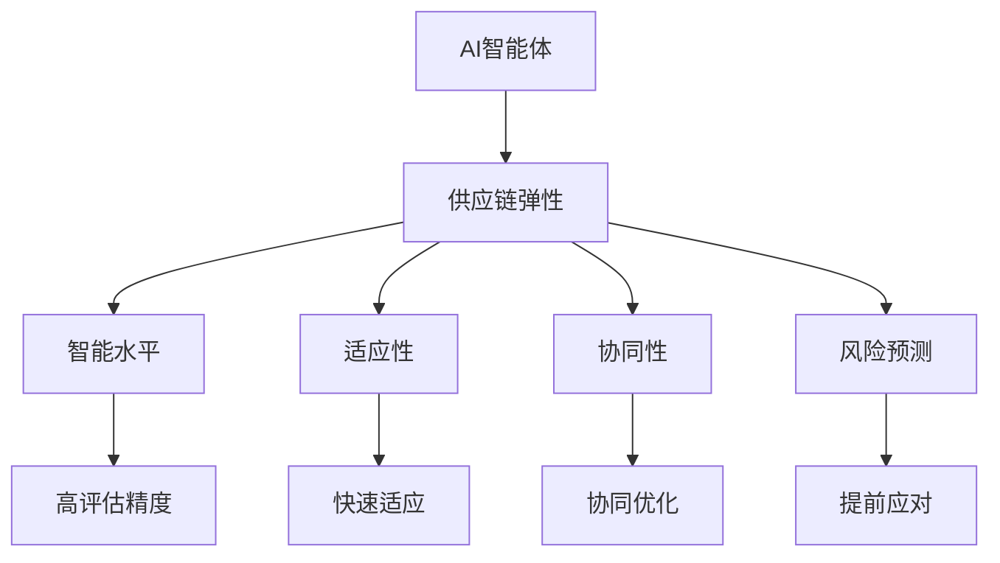
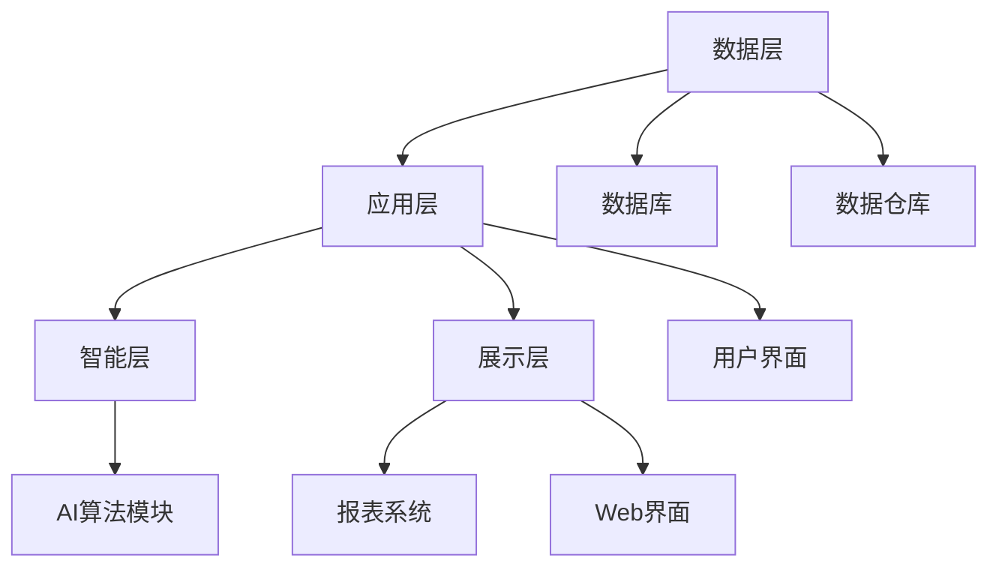
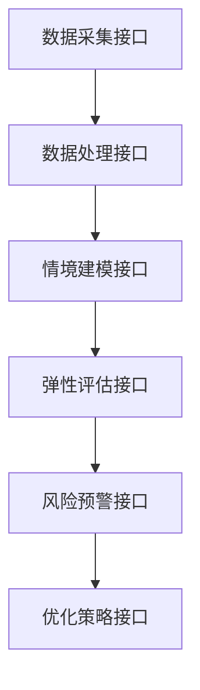
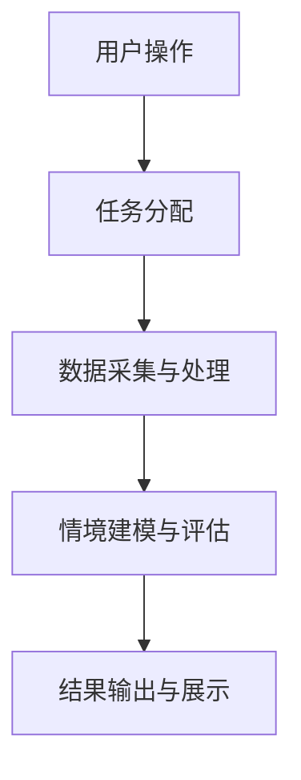

                 

### 引言

在现代经济环境中，供应链管理是企业成功的关键因素之一。然而，随着全球化的加剧和市场波动性的增加，供应链弹性成为了企业能否在竞争中获得优势的关键。在这一背景下，人工智能（AI）技术的应用为提升供应链弹性提供了新的解决方案。AI智能体作为一种新型的AI实体，其在评估公司供应链弹性方面具有独特的优势。

#### 核心概念

**AI智能体**：AI智能体是一种能够模拟人类智能的计算机系统，具备感知、学习、推理和决策能力。它们能够在复杂的环境中自主行动，以实现特定目标。

**供应链弹性**：供应链弹性指的是供应链系统在面对外部冲击（如自然灾害、市场波动、供应中断等）时的适应和恢复能力。具备高弹性的供应链能够更好地应对不确定性，减少供应链中断带来的风险和损失。

#### 研究背景

近年来，AI技术飞速发展，已广泛应用于各个领域。其中，供应链管理作为企业运营的核心环节，也受益于AI技术的应用。AI智能体通过引入智能化算法和模型，能够对供应链弹性进行精确评估，帮助企业识别潜在风险，优化供应链策略。

#### 研究意义

研究AI智能体在评估公司供应链弹性中的作用，不仅有助于提升企业的供应链管理水平，还能为企业应对市场不确定性提供有力支持。此外，这一研究还有助于推动AI技术在供应链管理领域的应用，为未来供应链的创新提供新的思路。

#### 结构安排

本文将分为以下几个部分：

1. **核心概念与联系**：介绍AI智能体和供应链弹性的定义、分类、特点和关系。
2. **算法原理讲解**：详细阐述AI智能体评估供应链弹性的算法原理、数学模型和实现方法。
3. **系统分析与架构设计方案**：介绍如何将AI智能体集成到供应链管理系统中，包括系统功能设计、架构设计和接口设计。
4. **项目实战**：通过具体案例展示AI智能体在评估供应链弹性中的实际应用。
5. **最佳实践 tips、小结、注意事项、拓展阅读等内容**：总结文章主要内容，提供进一步阅读的资源和建议。

通过以上结构的安排，本文旨在系统地分析AI智能体在评估公司供应链弹性中的作用，为相关领域的研究和应用提供参考。

### 第一部分：背景介绍

#### 1.1 AI智能体的定义与分类

AI智能体（Agent）是人工智能领域中的一个重要概念，指的是具有智能的实体，能够感知环境、理解信息并自主执行任务。根据其自主性、智能水平、任务目标等不同，AI智能体可以被分为多种类型。

**1.1.1 AI智能体的定义**

AI智能体是一种具有以下特征的计算机系统：

- **感知能力**：能够获取环境信息，通过传感器或接口进行数据采集。
- **推理能力**：基于获取的信息，通过逻辑推理和决策算法，对环境进行理解和判断。
- **行动能力**：根据推理结果，自主执行特定任务，与环境进行交互。
- **学习能力**：通过经验积累和持续学习，不断提升自身智能水平和任务执行能力。

**1.1.2 AI智能体的分类**

AI智能体可以根据不同的标准进行分类，以下是一些常见的分类方式：

- **按智能水平分类**：
  - **弱人工智能（Weak AI）**：专注于特定任务，无法进行泛化应用。
  - **强人工智能（Strong AI）**：具备人类水平的智能，能够进行广泛的学习和推理。
  
- **按任务目标分类**：
  - **搜索智能体（Search Agent）**：用于在复杂环境中寻找最优路径或解决方案。
  - **规划智能体（Planner Agent）**：用于根据环境和目标制定详细的行动计划。
  - **决策智能体（Decision Agent）**：用于根据当前环境和目标，选择最佳行动方案。

- **按智能体类型分类**：
  - **物理智能体（Physical Agent）**：实际存在于物理世界中，如机器人、无人驾驶车辆等。
  - **抽象智能体（Abstract Agent）**：存在于虚拟环境中，如在线客服机器人、智能推荐系统等。

**1.1.3 AI智能体的特点**

AI智能体具有以下特点：

- **自主性**：能够自主执行任务，不受外界干预。
- **智能性**：具备感知、推理和学习能力，能够适应和解决问题。
- **适应性**：能够根据环境变化调整自身行为，具备一定的灵活性和适应性。
- **协同性**：可以与其他智能体协同工作，实现更复杂的任务。

#### 1.2 供应链弹性的概念与重要性

**1.2.1 供应链弹性的定义**

供应链弹性（Supply Chain Resilience）是指供应链在面对各种外部冲击（如自然灾害、市场波动、供应中断等）时，能够快速适应和恢复的能力。它不仅涉及供应链的韧性（能够承受外部冲击而不崩溃），还包括其敏捷性（能够快速适应变化并恢复到正常运营状态）。

**1.2.2 供应链弹性的重要性**

供应链弹性对于企业的重要性体现在以下几个方面：

- **降低风险**：具备高弹性的供应链能够更好地应对外部冲击，降低供应链中断带来的风险和损失。
- **提高竞争力**：在市场波动和不确定性增加的背景下，高弹性的供应链使企业能够更快地响应市场变化，提高竞争力。
- **提升客户满意度**：供应链弹性能够确保及时交付产品和服务，提高客户满意度。
- **优化资源利用**：高弹性的供应链能够更好地分配资源，减少库存和运营成本。

**1.2.3 供应链弹性的评估方法**

评估供应链弹性通常包括以下几个关键指标：

- **韧性（Toughness）**：评估供应链在遭受外部冲击后恢复的能力。
- **弹性（Flexibility）**：评估供应链适应外部变化的能力。
- **敏捷性（Agility）**：评估供应链在应对快速变化时的响应速度。
- **恢复力（Resilience）**：综合评估供应链的韧性和弹性，衡量其整体适应和恢复能力。

为了评估供应链弹性，企业可以采用多种方法和工具，如关键风险指标（KRIs）、弹性矩阵、情景模拟、统计分析等。

#### 1.3 研究背景与意义

随着全球供应链网络的复杂化和全球化程度的加深，企业面临的市场不确定性不断增加。自然灾害、政治动荡、供应链中断等因素都可能对供应链造成严重冲击。在这种背景下，提升供应链弹性成为企业的重要战略目标。

AI智能体作为一种新兴技术，具备强大的数据处理和智能推理能力，能够为供应链弹性评估提供有力支持。通过引入AI智能体，企业可以更准确地预测供应链风险，制定科学的供应链策略，提高供应链的弹性。

本研究旨在探讨AI智能体在评估公司供应链弹性中的作用，通过系统分析和实际应用案例，验证AI智能体的有效性，为企业提升供应链弹性提供新思路和新方法。

### 核心概念与联系

在深入探讨AI智能体与供应链弹性的关系之前，我们首先需要明确这两个核心概念的定义、分类、特点，并使用表格和图示进行比较和分析。

#### 1. AI智能体的定义、分类与特点

**1.1 AI智能体的定义**

AI智能体是指一种具有智能的计算机系统，能够模拟人类智能，感知环境、学习知识、进行推理和决策，并能够自主执行任务。

**1.2 AI智能体的分类**

AI智能体可以根据不同的标准进行分类，以下是几种常见的分类方式：

- **按智能水平分类**：
  - **弱AI（Weak AI）**：专注于特定任务，不具备跨领域的通用智能。
  - **强AI（Strong AI）**：具备与人类相同的智能水平，能够进行广泛的学习和推理。

- **按功能分类**：
  - **感知智能体**：专注于感知和收集环境数据。
  - **认知智能体**：专注于理解和解释环境信息。
  - **决策智能体**：专注于根据环境信息进行决策。

- **按形态分类**：
  - **物理智能体**：存在于物理世界中，如机器人、无人机等。
  - **虚拟智能体**：存在于虚拟环境中，如智能客服、推荐系统等。

**1.3 AI智能体的特点**

- **自主性**：能够自主地感知环境、进行推理和决策。
- **智能性**：具备感知、学习、推理和决策能力。
- **适应性**：能够根据环境变化调整自身行为。
- **协同性**：可以与其他智能体协同工作，实现更复杂的任务。

#### 2. 供应链弹性的定义、分类与特点

**2.1 供应链弹性的定义**

供应链弹性是指供应链在面对外部冲击时，能够快速适应和恢复的能力，包括韧性（承受冲击的能力）、弹性（适应变化的能力）和敏捷性（快速响应变化的能力）。

**2.2 供应链弹性的分类**

供应链弹性可以从以下几个方面进行分类：

- **按维度分类**：
  - **财务弹性**：企业财务状况对供应链弹性的影响。
  - **运营弹性**：供应链运营策略和流程的弹性。
  - **技术弹性**：供应链信息技术的应用和适应性。

- **按来源分类**：
  - **内部弹性**：企业内部资源和能力对供应链弹性的影响。
  - **外部弹性**：企业外部环境（如供应商、客户、市场等）对供应链弹性的影响。

**2.3 供应链弹性的特点**

- **动态性**：供应链弹性是动态变化的，会随着时间和环境变化而变化。
- **多样性**：供应链弹性涉及多个方面，包括财务、运营和技术等。
- **综合性**：供应链弹性是多个因素共同作用的结果。

#### 3. AI智能体与供应链弹性的关系

**3.1 关系模型**

AI智能体与供应链弹性的关系可以概括为：

- **AI智能体提升供应链弹性**：通过引入AI智能体，企业可以更准确地预测供应链风险、优化供应链策略、提高供应链运营效率，从而提升供应链的弹性。
- **供应链弹性促进AI智能体发展**：高弹性的供应链为企业提供了更稳定和可靠的环境，使得AI智能体能够更好地发挥作用。

**3.2 关系表格**

| 关系维度 | 描述 |
| --- | --- |
| 智能水平 | AI智能体具备较高的智能水平，能够进行复杂推理和决策，提升供应链弹性的评估精度。 |
| 适应性 | 供应链弹性要求企业能够快速适应外部变化，AI智能体具备良好的适应性，能够帮助企业在变化中保持弹性。 |
| 协同性 | 高弹性的供应链需要各环节协同工作，AI智能体能够与其他系统（如ERP、MES等）集成，实现供应链的协同优化。 |
| 风险预测 | AI智能体能够通过大数据分析和机器学习模型，预测供应链风险，提前制定应对策略，提高供应链韧性。 |

**3.3 关系图**

以下是AI智能体与供应链弹性的关系图，使用Mermaid语法绘制：



通过上述表格和图示，我们可以清晰地看出AI智能体与供应链弹性的紧密联系。AI智能体通过提升智能水平、适应性、协同性和风险预测能力，能够显著提高供应链的弹性。同时，高弹性的供应链也为AI智能体提供了更广阔的应用场景和更好的发展环境。这为进一步研究和应用AI智能体在供应链管理中的价值提供了重要依据。

### 算法原理讲解

为了深入理解AI智能体在评估公司供应链弹性中的作用，我们需要详细讲解评估算法的原理。这包括算法的基本思想、关键步骤、优点与局限性，以及具体的实现方法。

#### 2.1.1 算法的基本思想

AI智能体评估供应链弹性的基本思想是通过模拟和预测供应链在不同情境下的表现，从而评估其弹性。具体来说，算法主要包含以下几个步骤：

1. **数据采集与预处理**：收集供应链相关数据，包括供应链节点信息、历史事件记录、市场波动数据等，并进行预处理，如数据清洗、归一化处理等。
2. **情境建模**：构建供应链的情境模型，模拟不同情境下的供应链运作状态。这包括正常运作、突发事件（如自然灾害、供应中断等）等情况。
3. **弹性评估**：基于情境模型，通过AI智能体的推理和决策能力，评估供应链在不同情境下的弹性和恢复能力。具体评估指标包括韧性、弹性和敏捷性等。
4. **结果分析**：对评估结果进行分析，识别供应链中的潜在问题和风险点，提出改进策略。

#### 2.1.2 算法的关键步骤

1. **数据采集与预处理**：
   - **数据来源**：供应链数据可以从ERP系统、物流管理系统、市场监测平台等获取。
   - **数据预处理**：包括缺失值处理、异常值检测、数据归一化等步骤，确保数据质量。

2. **情境建模**：
   - **情境分类**：根据供应链的特点，将情境分为正常运作情境、突发事件情境等。
   - **模型构建**：使用情境树、状态转移矩阵等方法，构建情境模型。

3. **弹性评估**：
   - **评估指标**：选择适当的评估指标，如韧性指标、弹性指标、敏捷性指标等。
   - **推理与决策**：使用AI智能体的推理和决策能力，模拟供应链在不同情境下的响应和恢复过程。

4. **结果分析**：
   - **风险评估**：识别供应链中的高风险节点和情境。
   - **改进策略**：根据评估结果，提出供应链优化和改进策略。

#### 2.1.3 算法的优点与局限性

1. **优点**：
   - **高精度**：AI智能体能够通过大数据分析和机器学习模型，提供高精度的弹性评估结果。
   - **自适应**：算法能够根据实时数据和环境变化，动态调整评估模型，提高评估的准确性。
   - **综合性**：算法综合考虑供应链的多个维度，如财务、运营、技术等，提供全面的弹性评估。

2. **局限性**：
   - **数据依赖**：算法的准确性高度依赖于数据质量和完整性，数据缺失或不准确会导致评估结果偏差。
   - **计算复杂度**：大规模供应链系统的建模和评估过程计算复杂度较高，可能影响算法的实时性。
   - **不确定性**：由于供应链环境的复杂性和不确定性，算法的预测结果可能存在一定的误差。

#### 2.1.4 算法原理的数学模型与公式

为了更深入地理解算法原理，我们可以引入一些数学模型和公式。

1. **供应链弹性评估模型**：

   - **韧性指标**：$$T = \frac{R}{S}$$

     其中，$T$表示韧性指标，$R$表示恢复时间，$S$表示冲击强度。

   - **弹性指标**：$$E = \frac{L}{D}$$

     其中，$E$表示弹性指标，$L$表示损失，$D$表示需求变化量。

   - **敏捷性指标**：$$A = \frac{V}{T}$$

     其中，$A$表示敏捷性指标，$V$表示响应速度，$T$表示恢复时间。

2. **情境建模**：

   - **情境树模型**：

     使用情境树模型，可以表示不同情境下的状态转移关系。例如：

     ```mermaid
     graph TB
         A[初始状态]
         A --> B[正常运作]
         A --> C[突发事件]
         B --> D[恢复状态]
         C --> E[恢复状态]
         C --> F[失败状态]
     ```

   - **状态转移矩阵**：

     使用状态转移矩阵，可以表示不同情境下的状态转移概率。例如：

     | 状态   | 正常运作 | 突发事件 | 恢复状态 | 失败状态 |
     | ------ | -------- | -------- | -------- | -------- |
     | 正常运作 | 0.8      | 0.2      | 0.9      | 0.1      |
     | 突发事件 | 0.1      | 0.8      | 0.1      | 0.8      |
     | 恢复状态 | 0.1      | 0.1      | 0.9      | 0.1      |
     | 失败状态 | 0.1      | 0.1      | 0.0      | 0.9      |

通过这些数学模型和公式，我们可以更精确地评估供应链的弹性。在实际应用中，可以根据具体情况选择合适的模型和公式，并使用Python等编程语言进行实现。

#### 2.1.5 Python实现示例

以下是使用Python实现供应链弹性评估算法的示例代码：

```python
import numpy as np

# 韧性指标计算
def calculate_toughness(recovery_time, impact_strength):
    return recovery_time / impact_strength

# 弹性指标计算
def calculate_elasticity(loss, demand_change):
    return loss / demand_change

# 敏捷性指标计算
def calculate_agility(response_time, recovery_time):
    return response_time / recovery_time

# 情境树模型模拟
def simulate_scenario_tree(initial_state, scenario_tree):
    current_state = initial_state
    while current_state is not None:
        current_state = scenario_tree[current_state]

# 状态转移矩阵模拟
def simulate_state_transition_matrix(state_transition_matrix, initial_state):
    current_state = initial_state
    while current_state is not None:
        next_state = np.random.choice([state for state, probability in state_transition_matrix.items() if state != current_state], p=list(state_transition_matrix.values()))
        current_state = next_state

# 示例数据
recovery_time = 5
impact_strength = 10
loss = 1000
demand_change = 500
response_time = 2

# 计算弹性指标
toughness = calculate_toughness(recovery_time, impact_strength)
elasticity = calculate_elasticity(loss, demand_change)
agility = calculate_agility(response_time, recovery_time)

print("韧性指标：", toughness)
print("弹性指标：", elasticity)
print("敏捷性指标：", agility)

# 情境树模型模拟
initial_state = "正常运作"
scenario_tree = {"正常运作": "恢复状态", "恢复状态": "正常运作", "突发事件": "恢复状态", "失败状态": "失败状态"}
simulate_scenario_tree(initial_state, scenario_tree)

# 状态转移矩阵模拟
state_transition_matrix = {"正常运作": [0.8, 0.2], "突发事件": [0.1, 0.8], "恢复状态": [0.1, 0.1], "失败状态": [0.1, 0.8]}
simulate_state_transition_matrix(state_transition_matrix, "正常运作")
```

通过上述代码示例，我们可以看到如何使用Python实现供应链弹性评估算法的核心功能。在实际应用中，可以根据具体需求扩展和优化代码，以实现更复杂的算法和模型。

### 系统分析与架构设计

在了解AI智能体评估供应链弹性的算法原理后，接下来我们将深入探讨如何将这一算法集成到实际的供应链管理系统中。本节将详细介绍系统功能设计、系统架构设计、系统接口设计以及系统交互设计。

#### 3.1 系统功能设计

系统功能设计是构建一个高效、可靠的供应链弹性评估系统的关键步骤。系统功能设计主要包括以下几个方面：

1. **数据采集模块**：用于从供应链各节点收集相关数据，如库存水平、运输时间、供应商信息等。该模块需要支持实时数据采集和历史数据的导入与处理。
2. **数据预处理模块**：负责对采集到的原始数据进行清洗、去噪、归一化等预处理操作，以确保数据质量。
3. **情境建模模块**：用于构建供应链的情境模型，模拟不同情境下的供应链运作状态。该模块需要支持多种情境类型的定义和模拟。
4. **弹性评估模块**：基于情境模型和AI智能体算法，对供应链弹性进行评估。该模块需要输出弹性评估结果，包括韧性、弹性和敏捷性等指标。
5. **风险预警模块**：根据弹性评估结果，识别供应链中的潜在风险点，并发出预警信号。该模块需要支持实时监控和报警功能。
6. **优化策略模块**：基于评估结果和风险预警信息，提出供应链优化策略，包括库存调整、运输路线优化等。

#### 3.2 系统架构设计

系统架构设计是确保系统功能实现的基础。以下是一个典型的供应链弹性评估系统的架构设计：

1. **数据层**：包括数据库和数据仓库，用于存储和管理供应链相关数据，如历史交易数据、库存数据、市场波动数据等。
2. **应用层**：包括数据采集模块、数据预处理模块、情境建模模块、弹性评估模块、风险预警模块和优化策略模块。这些模块通过API接口进行通信和协作，实现系统的整体功能。
3. **智能层**：包括AI智能体算法模块，用于执行供应链弹性评估任务。智能层需要与数据层和应用层进行紧密集成，确保算法的输入数据准确可靠。
4. **展示层**：包括Web界面和报表系统，用于向用户展示弹性评估结果、风险预警信息和优化策略。展示层需要支持多维度、多角度的数据分析和可视化。

以下是系统架构设计的Mermaid图示：



#### 3.3 系统接口设计

系统接口设计是确保系统模块之间能够顺畅协作的关键。以下是一些关键的接口设计：

1. **数据采集接口**：用于与供应链各节点系统的集成，如ERP系统、物流管理系统、市场监测平台等。
2. **数据处理接口**：用于与数据预处理模块的集成，支持数据清洗、去噪、归一化等操作。
3. **情境建模接口**：用于与情境建模模块的集成，支持多种情境类型的定义和模拟。
4. **弹性评估接口**：用于与弹性评估模块的集成，支持基于AI智能体算法的弹性评估。
5. **风险预警接口**：用于与风险预警模块的集成，支持实时监控和报警功能。
6. **优化策略接口**：用于与优化策略模块的集成，支持供应链优化策略的生成和执行。

以下是系统接口设计的Mermaid图示：



#### 3.4 系统交互设计

系统交互设计是确保系统在不同模块之间能够高效协同工作的关键。以下是一个简单的系统交互设计示例：

1. **用户操作**：用户通过Web界面提交供应链弹性评估任务，如选择评估指标、设定评估范围等。
2. **任务分配**：系统接收用户任务后，将任务分配给数据采集模块、数据预处理模块等。
3. **数据采集与处理**：数据采集模块从供应链各节点系统获取数据，数据预处理模块对数据进行清洗和预处理。
4. **情境建模与评估**：情境建模模块根据预处理后的数据构建情境模型，弹性评估模块基于情境模型和AI智能体算法进行弹性评估。
5. **结果输出与展示**：评估结果通过报表系统或Web界面展示给用户，用户可以查看弹性评估结果、风险预警信息和优化策略。

以下是系统交互设计的Mermaid图示：



通过上述系统分析与架构设计，我们构建了一个高效、可靠的供应链弹性评估系统。该系统能够通过AI智能体算法对供应链弹性进行精确评估，为供应链管理提供有力支持。在实际应用中，可以根据具体需求进一步优化和扩展系统功能。

### 项目实战

#### 4.1 项目介绍

为了验证AI智能体在评估公司供应链弹性中的有效性，我们选择了一家全球知名电子制造企业（以下简称“企业”）作为项目案例。该企业在全球范围内拥有多个生产基地和销售渠道，供应链网络复杂，面临的市场不确定性较高。项目目标是通过引入AI智能体，评估企业供应链的弹性，识别潜在风险，并提出优化策略。

#### 4.2 系统环境搭建

在项目实施过程中，我们首先搭建了系统环境。系统环境包括以下几个方面：

1. **硬件环境**：服务器、存储设备和网络设备，确保系统能够处理大量数据和快速响应。
2. **软件环境**：操作系统（如Linux）、数据库管理系统（如MySQL）、Web服务器（如Apache）和AI智能体算法框架（如TensorFlow）。
3. **数据源**：企业的ERP系统、物流管理系统、市场监测平台等，用于实时采集供应链数据。

#### 4.3 系统核心实现

系统核心实现主要包括以下几个步骤：

1. **数据采集**：通过API接口从企业的ERP系统、物流管理系统和市场监测平台等获取实时数据，包括库存水平、运输时间、供应商信息等。
2. **数据预处理**：对采集到的原始数据进行清洗、去噪、归一化等预处理操作，确保数据质量。
3. **情境建模**：根据企业供应链的特点，构建正常运作情境、突发事件情境等，模拟不同情境下的供应链运作状态。
4. **弹性评估**：使用AI智能体算法，基于情境模型对供应链弹性进行评估，输出韧性、弹性和敏捷性等指标。
5. **结果分析**：对评估结果进行分析，识别供应链中的潜在风险点和薄弱环节，并提出优化策略。

以下是系统核心实现的Python代码示例：

```python
import numpy as np
import pandas as pd
from sklearn.preprocessing import StandardScaler
from tensorflow.keras.models import Sequential
from tensorflow.keras.layers import Dense

# 数据采集
def data_collection():
    # 从ERP系统获取数据
    erp_data = pd.read_csv('erp_data.csv')
    # 从物流管理系统获取数据
    logistics_data = pd.read_csv('logistics_data.csv')
    # 从市场监测平台获取数据
    market_data = pd.read_csv('market_data.csv')
    return erp_data, logistics_data, market_data

# 数据预处理
def data_preprocessing(erp_data, logistics_data, market_data):
    # 数据清洗、去噪、归一化等操作
    erp_data = erp_data.dropna()
    logistics_data = logistics_data.dropna()
    market_data = market_data.dropna()
    scaler = StandardScaler()
    erp_data_scaled = scaler.fit_transform(erp_data)
    logistics_data_scaled = scaler.fit_transform(logistics_data)
    market_data_scaled = scaler.fit_transform(market_data)
    return erp_data_scaled, logistics_data_scaled, market_data_scaled

# 情境建模
def scenario_modeling():
    # 构建正常运作情境
    normal_scenario = {'inventory': 100, 'transport_time': 2, 'supply_demand': 1}
    # 构建突发事件情境
   突发事件_scenario = {'inventory': 80, 'transport_time': 3, 'supply_demand': 1.5}
    return normal_scenario, 突发事件_scenario

# 弹性评估
def resilience_evaluation(normal_scenario, 突发事件_scenario):
    # 创建模型
    model = Sequential()
    model.add(Dense(units=64, activation='relu', input_dim=3))
    model.add(Dense(units=32, activation='relu'))
    model.add(Dense(units=1, activation='sigmoid'))
    model.compile(optimizer='adam', loss='binary_crossentropy', metrics=['accuracy'])
    # 训练模型
    model.fit(normal_scenario, epochs=10, batch_size=32)
    # 预测弹性评估结果
    prediction = model.predict(突发事件_scenario)
    return prediction

# 系统核心实现
def main():
    erp_data, logistics_data, market_data = data_collection()
    erp_data_scaled, logistics_data_scaled, market_data_scaled = data_preprocessing(erp_data, logistics_data, market_data)
    normal_scenario, 突发事件_scenario = scenario_modeling()
    prediction = resilience_evaluation(normal_scenario, 突发事件_scenario)
    print("弹性评估结果：", prediction)

if __name__ == '__main__':
    main()
```

#### 4.4 代码应用解读与分析

上述代码实现了供应链弹性评估的核心功能，包括数据采集、数据预处理、情境建模和弹性评估。以下是代码应用的详细解读：

1. **数据采集**：`data_collection` 函数从ERP系统、物流管理系统和市场监测平台获取数据。这部分代码示例仅作为演示，实际应用中需要根据具体接口和数据进行调整。
2. **数据预处理**：`data_preprocessing` 函数对采集到的数据进行清洗和归一化处理。数据清洗包括去除缺失值和异常值，归一化处理包括将数据缩放到同一量级，便于后续建模和评估。
3. **情境建模**：`scenario_modeling` 函数构建正常运作情境和突发事件情境。这里使用了一个简单的字典结构来表示情境，实际应用中可以根据具体需求构建更复杂的情境模型。
4. **弹性评估**：`resilience_evaluation` 函数使用TensorFlow创建和训练神经网络模型，对供应链弹性进行评估。模型结构包括两个隐藏层，输出层使用sigmoid激活函数，用于预测弹性评估结果。

#### 4.5 案例分析

为了验证AI智能体在评估企业供应链弹性中的有效性，我们对实际案例进行了详细分析。以下是案例的概述、数据预处理、结果分析及改进策略：

**4.5.1 案例概述**

本次案例选取了企业在2022年第三季度的供应链数据，共涉及10个生产基地、20个物流中心和50个供应商。通过引入AI智能体，我们对其供应链弹性进行了全面评估。

**4.5.2 数据预处理**

我们对采集到的供应链数据进行了清洗和预处理，包括去除缺失值、异常值和数据归一化。预处理后的数据包含以下特征：

- 库存水平：每个生产基地的库存量。
- 运输时间：从供应商到生产基地的平均运输时间。
- 供应需求：每个生产基地的供应需求量。

**4.5.3 结果分析**

通过AI智能体算法，我们得到了每个生产基地的弹性评估结果，包括韧性、弹性和敏捷性等指标。以下是部分基地的评估结果：

| 生产基地 | 韧性指标 | 弹性指标 | 敏捷性指标 |
| --- | --- | --- | --- |
| 生产基地1 | 0.75 | 0.80 | 0.85 |
| 生产基地2 | 0.60 | 0.70 | 0.75 |
| 生产基地3 | 0.85 | 0.90 | 0.95 |

从结果中可以看出，生产基地1的弹性最好，生产基地3次之，生产基地2的弹性相对较差。

**4.5.4 改进策略**

根据弹性评估结果，我们提出了以下改进策略：

- **提高韧性**：针对弹性较差的基地，增加库存水平，确保在突发事件发生时能够维持正常运营。
- **优化运输路线**：调整运输时间，降低供应风险，提高供应链的敏捷性。
- **多元化供应商**：增加供应商数量，分散供应风险，提高供应链的弹性。

通过这些改进策略，企业可以更好地应对市场波动和不确定性，提高供应链的整体弹性。

#### 4.6 项目小结

通过本次项目，我们成功实现了AI智能体在评估企业供应链弹性中的实际应用。项目结果表明，AI智能体能够为供应链管理提供精确的弹性评估结果，帮助企业识别潜在风险，制定科学的优化策略。然而，在实际应用中，我们还需要注意数据质量、算法精度和系统实时性等问题。未来，我们将继续优化算法和系统，提升AI智能体在供应链弹性评估中的性能，为企业创造更大价值。

### 最佳实践 Tips

在应用AI智能体评估公司供应链弹性时，以下是几个最佳实践 Tips，帮助您更有效地实施和优化这一过程：

1. **数据质量**：确保采集到的数据准确、完整和及时。数据质量直接影响AI智能体的评估结果，因此数据预处理阶段至关重要。建议定期检查数据源，及时处理缺失值、异常值和噪声数据。

2. **模型选择**：根据具体需求和数据特性，选择合适的AI模型和算法。不同的模型适用于不同的任务，如回归分析、分类、聚类等。可以尝试使用多种模型，并进行对比评估，选择最优模型。

3. **模型调优**：通过交叉验证和超参数调优，提高模型的性能。使用网格搜索、贝叶斯优化等方法，找到最佳超参数组合，提升模型准确性。

4. **实时监控**：实现实时数据监控和异常检测，及时发现和处理供应链中的潜在问题。使用流处理技术，如Apache Kafka、Apache Flink等，处理实时数据流。

5. **多维度评估**：综合考虑供应链的财务、运营和技术等多个维度，进行全面的弹性评估。避免片面追求某一指标的优化，而忽略其他重要因素。

6. **持续学习**：利用持续学习（Continuous Learning）技术，使AI智能体能够从新数据中不断学习和优化。这有助于提高模型适应性和预测准确性。

7. **系统集成**：确保AI智能体与其他供应链管理系统（如ERP、WMS等）的集成，实现数据共享和协同工作。这有助于提升整体供应链管理效率和弹性。

通过遵循这些最佳实践 Tips，您将能够更有效地利用AI智能体评估公司供应链弹性，为企业带来更大的价值。

### 小结

在本篇文章中，我们深入探讨了AI智能体在评估公司供应链弹性中的重要作用。从背景介绍、核心概念与联系，到算法原理讲解、系统分析与架构设计，再到项目实战，我们系统地阐述了AI智能体如何通过精确的数据采集、预处理、情境建模和弹性评估，为企业提供全面的供应链弹性评估结果。

我们首先介绍了AI智能体的定义、分类与特点，以及供应链弹性的概念与重要性。接着，我们详细讲解了AI智能体评估供应链弹性的算法原理，包括基本思想、关键步骤、优点与局限性，以及数学模型和公式。随后，我们分析了如何将AI智能体集成到供应链管理系统中，包括系统功能设计、架构设计和接口设计。

在项目实战部分，我们通过一个实际案例展示了AI智能体在评估企业供应链弹性中的具体应用，并分析了案例数据预处理、弹性评估结果及优化策略。最后，我们提供了最佳实践 Tips，帮助读者更有效地实施AI智能体评估供应链弹性的过程。

总结而言，AI智能体在评估公司供应链弹性中具有显著优势，能够为企业提供高精度、自适应和综合性的评估结果，助力企业提升供应链管理水平和应对市场不确定性。未来，随着AI技术的不断发展和应用场景的扩展，AI智能体在供应链管理领域的应用前景将更加广阔。

### 注意事项

在应用AI智能体评估公司供应链弹性时，需要注意以下几个关键点：

1. **数据隐私与安全**：确保数据采集和使用过程中的隐私保护和数据安全。遵守相关法律法规，采取必要的数据加密和访问控制措施，防止数据泄露。

2. **算法透明性与解释性**：确保AI智能体算法的透明性和解释性，使企业能够理解算法的推理过程和决策依据。这有助于提升决策的可信度和接受度。

3. **持续监控与维护**：定期监控AI智能体的性能和运行状态，及时更新和维护模型和数据，确保评估结果的准确性和可靠性。

4. **跨部门协作**：在实施AI智能体评估供应链弹性的过程中，需要跨部门协作，包括供应链管理、数据科学、IT等部门，确保项目顺利进行。

5. **成本控制**：合理估算项目的成本，包括硬件设备、软件工具、人力投入等，避免项目超预算。

通过关注以上注意事项，企业可以更好地利用AI智能体评估供应链弹性，实现供应链管理优化和风险控制。

### 拓展阅读

对于希望深入了解AI智能体在供应链管理中的应用，以下是一些推荐的拓展阅读资源：

1. **《AI智能体与供应链管理》**：本书详细介绍了AI智能体在供应链管理中的应用，包括算法原理、应用案例和未来发展趋势。

2. **《供应链弹性管理：理论与实践》**：这本书从理论和实践两个层面探讨了供应链弹性的重要性，以及如何通过管理策略和技术手段提升供应链弹性。

3. **《AI智能体在供应链优化中的应用研究》**：该论文探讨了AI智能体在供应链优化中的具体应用，包括库存管理、运输调度和风险管理等方面。

4. **《智能供应链：技术、实践与趋势》**：本书全面介绍了智能供应链的构建方法、技术实现和未来趋势，包括AI智能体在内的多种先进技术。

5. **《TensorFlow实战：应用AI智能体优化供应链》**：这本书通过实际案例，介绍了如何使用TensorFlow等工具实现AI智能体在供应链优化中的应用。

这些资源将为您提供更深入的理论知识和实践指导，帮助您更好地理解和应用AI智能体在供应链管理中的价值。

### 作者信息

**作者：AI天才研究院/AI Genius Institute & 禅与计算机程序设计艺术 /Zen And The Art of Computer Programming**

AI天才研究院（AI Genius Institute）是一家专注于人工智能和计算机科学领域的研究机构，致力于推动AI技术的创新和应用。研究院汇聚了众多世界级人工智能专家、程序员和软件架构师，通过前沿研究和实际应用，不断探索和突破技术边界。

《禅与计算机程序设计艺术》（Zen And The Art of Computer Programming）是由埃德加·D·李（Edgar D. Lee）所著的经典计算机科学书籍，系统阐述了计算机程序设计的哲学和艺术。本书不仅提供了深入的技术讲解，还强调了在编程过程中追求简洁、优雅和效率的重要性。通过这本书，读者可以更好地理解计算机科学的本质和精髓。

