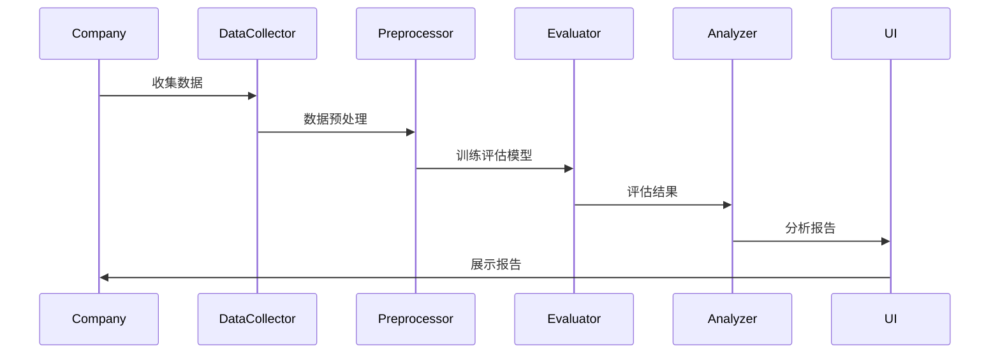

                 


## 引言

在当今快速变化的市场环境中，公司的创新文化和创新能力成为其持续发展的关键驱动力。创新不仅是企业竞争的利器，更是其在激烈的市场竞争中立于不败之地的根本保障。然而，如何准确评估公司的创新文化和创新能力，一直是一个复杂且具有挑战性的问题。传统的评估方法往往依赖于主观判断和经验，难以提供量化的、全面的评估结果，这就为AI智能体的应用提供了契机。

AI智能体，作为一种高度自动化和智能化的系统，具备在复杂环境中进行决策和任务执行的能力。通过结合大数据分析、机器学习和自然语言处理技术，AI智能体能够对公司内部的数据进行深度挖掘，从而提供更为准确和客观的评估结果。本文将深入探讨AI智能体在评估公司创新文化和创新能力中的应用，通过逐步分析其原理、流程和应用实例，为读者提供全面的理解和深入思考。

本文关键词包括：AI智能体、创新文化、创新能力、评估、大数据分析、机器学习、自然语言处理。

摘要：本文旨在探讨AI智能体在评估公司创新文化和创新能力中的关键作用。首先，我们将介绍创新文化和创新能力的概念及其面临的挑战。接着，分析AI智能体的基本原理和其在评估过程中的优势。随后，详细介绍AI智能体在评估公司创新文化和创新能力中的具体应用，包括评估指标、流程和数学模型。最后，通过实际案例分析和最佳实践，总结AI智能体在评估公司创新文化和创新能力中的应用前景和注意事项。

## 目录大纲

---

# AI智能体在评估公司创新文化和创新能力中的应用

> 关键词：AI智能体、创新文化、创新能力、评估、大数据分析、机器学习

> 摘要：本文探讨了AI智能体在评估公司创新文化和创新能力中的关键作用。首先介绍了创新文化和创新能力的概念及其面临的挑战，然后详细分析了AI智能体的基本原理和优势。接着，介绍了AI智能体在评估过程中的具体应用，包括评估指标、流程和数学模型。最后，通过实际案例分析和最佳实践，总结了AI智能体在评估公司创新文化和创新能力中的应用前景和注意事项。

---

## 第一部分: 背景介绍

### 1.1 问题背景

#### 1.1.1 公司创新文化和创新能力的概念解析

创新文化和创新能力是公司持续发展的重要基石。创新文化是指在公司内部形成的一种鼓励创新、宽容失败、尊重创造的氛围和环境。它不仅包括员工对创新的认同和热情，还涉及到公司管理层对创新的重视和实际支持。创新能力则是指公司在研发、产品设计、市场拓展等方面所表现出来的创造新价值、适应市场变化的能力。

在过去的几十年中，全球化和市场化的进程加速了公司的竞争环境，创新成为企业生存和发展的关键。一个具有强大创新文化和创新能力的公司，不仅能够在产品和技术上持续领先，还能在市场策略和商业模式上保持灵活和敏捷。

#### 1.1.2 当前公司创新文化和创新能力面临的挑战

尽管创新对于公司至关重要，但现实中公司面临诸多挑战：

1. **评估难度大**：创新文化和创新能力具有抽象性和多样性，难以用传统方法进行准确评估。
2. **数据分散**：公司内部创新相关的数据往往分散在不同部门和系统中，难以进行整合和分析。
3. **主观性高**：传统评估方法依赖于主观判断和经验，容易受到个人偏见的影响，缺乏客观性。
4. **滞后性明显**：传统的评估方法通常需要较长时间才能得出结论，难以及时反映公司的创新状况。

#### 1.1.3 AI智能体在评估公司创新文化和创新能力中的重要性

AI智能体作为人工智能的一种高级形式，具有强大的数据分析和智能决策能力，能够有效应对上述挑战。通过大数据分析、机器学习和自然语言处理技术，AI智能体可以从海量数据中提取有价值的信息，提供量化和客观的评估结果。

具体来说，AI智能体在评估公司创新文化和创新能力中的重要性体现在以下几个方面：

1. **客观性**：AI智能体能够基于数据驱动，提供客观、量化的评估结果，减少主观偏见。
2. **实时性**：AI智能体可以实时监控和分析公司的创新动态，及时提供评估结果，帮助公司快速响应市场变化。
3. **全面性**：AI智能体能够整合公司内部和外部的多种数据源，提供全面、多维度的评估视角。
4. **效率提升**：AI智能体自动化、高效地处理大量数据，大大提高了评估的效率和准确性。

### 1.2 问题描述

#### 1.2.1 评估公司创新文化和创新能力的传统方法

传统的评估公司创新文化和创新能力的常用方法包括：

1. **问卷调查**：通过向员工发放问卷，收集他们对公司创新文化的看法和感受。
2. **访谈**：与公司管理层、研发团队等进行深度访谈，了解他们对创新能力的评价。
3. **专利和成果统计**：通过统计公司的专利数量、新产品上市数量等硬性指标，评估公司的创新能力。

#### 1.2.2 传统方法的局限性

虽然传统方法在一定程度上能够反映公司的创新文化和创新能力，但存在以下局限性：

1. **主观性高**：问卷调查和访谈结果容易受到个人主观偏见的影响，评估结果不够客观。
2. **数据分散**：专利和成果统计方法难以全面反映公司的创新活动，且数据获取和处理过程繁琐。
3. **时效性差**：传统评估方法通常需要较长时间才能得出结论，难以及时反映公司的创新状况。
4. **缺乏深度**：传统方法难以深入分析公司的创新机制和影响因素，提供有针对性的改进建议。

#### 1.2.3 AI智能体在评估过程中的优势

与传统的评估方法相比，AI智能体在评估公司创新文化和创新能力过程中具有明显优势：

1. **数据驱动**：AI智能体能够处理和分析海量数据，提供客观、量化的评估结果。
2. **实时监控**：AI智能体能够实时监控公司的创新动态，及时提供评估结果，帮助公司快速响应市场变化。
3. **全面视角**：AI智能体可以整合公司内部和外部多种数据源，提供多维度的评估视角。
4. **自动化处理**：AI智能体自动化处理大量数据，大大提高了评估的效率和准确性。

### 1.3 问题解决

#### 1.3.1 AI智能体的基本原理

AI智能体（Artificial Intelligent Agent）是指具有感知、决策和行动能力的人工智能系统。它通常由知识库、推理机和用户界面三个核心组成部分构成：

1. **知识库**：存储与评估任务相关的知识、数据和规则。
2. **推理机**：根据知识库中的信息和用户输入，进行逻辑推理和决策。
3. **用户界面**：与用户进行交互，接收用户输入，展示评估结果。

#### 1.3.2 AI智能体在评估公司创新文化和创新能力中的应用流程

AI智能体在评估公司创新文化和创新能力中的应用流程主要包括以下步骤：

1. **数据收集**：从公司内部和外部多个数据源收集与评估任务相关的数据，包括员工问卷、访谈记录、专利数据、市场表现等。
2. **数据预处理**：对收集到的数据进行清洗、整合和格式转换，确保数据的质量和一致性。
3. **模型训练**：基于机器学习和数据挖掘技术，训练评估模型，使其能够自动识别和评估公司的创新文化和创新能力。
4. **评估执行**：使用训练好的模型对公司的数据进行评估，生成评估报告和可视化结果。
5. **反馈与优化**：根据评估结果和用户反馈，不断优化评估模型和算法，提高评估的准确性和实用性。

#### 1.4 边界与外延

##### 1.4.1 AI智能体评估的范围

AI智能体在评估公司创新文化和创新能力时，可以涵盖以下范围：

1. **创新文化评估**：评估公司内部创新氛围、员工创新意识、管理层创新支持等。
2. **创新能力评估**：评估公司的研发投入、专利数量、新产品上市数量、市场响应速度等。

##### 1.4.2 AI智能体评估的限制因素

尽管AI智能体在评估公司创新文化和创新能力中具有诸多优势，但仍然存在一些限制因素：

1. **数据质量**：评估结果的准确性依赖于数据的质量，数据缺失、错误或不一致会影响评估结果。
2. **算法复杂度**：评估模型的训练和优化过程复杂，需要大量的计算资源和专业知识。
3. **外部因素**：公司的创新文化和创新能力受到市场环境、政策法规等多种外部因素的影响，这些因素难以通过AI智能体进行完全量化。
4. **用户依赖性**：评估结果的解释和应用依赖于用户的专业知识和理解能力。

#### 1.5 核心概念与联系

##### 1.5.1 核心概念原理

在评估公司创新文化和创新能力的过程中，核心概念包括：

1. **创新文化**：指公司内部对创新的态度、价值观和行为规范。
2. **创新能力**：指公司在研发、产品设计、市场拓展等方面的创新能力和成效。
3. **AI智能体**：指具有感知、推理和行动能力的人工智能系统，用于评估公司的创新文化和创新能力。

##### 1.5.2 概念属性特征对比表格

以下表格对比了创新文化、创新能力与AI智能体的属性特征：

| 概念         | 属性特征                                      | 对比说明                                           |
| ------------ | --------------------------------------------- | -------------------------------------------------- |
| 创新文化     | 鼓励创新、宽容失败、尊重创造的氛围和环境     | 反映公司的价值观和行为规范，影响员工创新意识         |
| 创新能力     | 研发投入、专利数量、新产品上市数量等指标     | 反映公司的创新成效和能力，直接影响公司的市场竞争力   |
| AI智能体     | 知识库、推理机、用户界面                     | 用于评估公司的创新文化和创新能力，具备自动化、智能化能力 |

##### 1.5.3 ER实体关系图架构

以下ER实体关系图展示了创新文化、创新能力与AI智能体之间的实体关系：

```
[公司] --<创新文化>--> [员工]
[公司] --<创新能力>--> [研发团队]
[公司] --<数据收集>--> [AI智能体]
[AI智能体] --<评估结果>--> [公司]
```

通过这个ER图，我们可以清晰地看到公司、创新文化、创新能力与AI智能体之间的相互关系和作用。

---

以上内容是第一部分的完整内容，包括背景介绍、问题描述、问题解决、边界与外延以及核心概念与联系。接下来的部分将深入探讨AI智能体的算法原理和具体应用，敬请期待。

## 第二部分: AI智能体的算法原理

### 2.1 AI智能体的基本概念

AI智能体（Artificial Intelligent Agent）是一种自主执行任务并具有环境感知和决策能力的计算机系统。它模仿人类智能的行为，通过感知环境、理解信息、制定计划并执行行动，以实现特定目标。AI智能体在评估公司创新文化和创新能力中发挥着至关重要的作用，其核心组成部分包括知识库、推理机、用户界面等。

#### 2.1.1 知识库

知识库是AI智能体的核心组件，用于存储与评估任务相关的各类知识、数据和规则。这些知识可以包括公司的历史数据、市场趋势、行业动态、员工信息、管理策略等。知识库的建设是确保AI智能体能够进行有效评估的基础，其质量直接影响评估结果的准确性和可靠性。

#### 2.1.2 推理机

推理机负责根据知识库中的信息和用户输入，进行逻辑推理和决策。它使用各种算法和模型，如机器学习算法、决策树、神经网络等，从数据中提取有价值的信息，并生成评估结果。推理机的核心任务是确保评估过程的自动化和智能化，提高评估的效率和准确性。

#### 2.1.3 用户界面

用户界面是AI智能体与用户之间的交互渠道，用于接收用户输入、展示评估结果和反馈。用户界面需要设计得直观、易用，以便用户能够轻松地使用AI智能体进行评估和获取结果。同时，用户界面还需要提供丰富的可视化功能，如图表、报表等，帮助用户更好地理解和分析评估结果。

### 2.2 AI智能体的算法原理

AI智能体的算法原理是其能够有效评估公司创新文化和创新能力的关键。以下将详细解释AI智能体的算法原理，并通过Python代码示例展示其具体实现。

#### 2.2.1 基本概念

AI智能体的算法原理可以概括为以下三个主要方面：

1. **感知与理解**：AI智能体通过感知技术（如图像识别、自然语言处理等）理解和提取环境中的信息。
2. **知识表示与推理**：AI智能体利用知识库中的数据和规则，通过推理机进行逻辑推理和决策。
3. **行动与反馈**：AI智能体根据推理结果采取行动，并通过用户界面与用户进行交互，接收反馈并进行迭代优化。

#### 2.2.2 工作流程

AI智能体的工作流程通常包括以下几个步骤：

1. **数据收集**：从公司内部和外部数据源（如数据库、文件、网络等）收集与评估任务相关的数据。
2. **数据预处理**：对收集到的数据（如清洗、整合、标准化等）进行预处理，以确保数据的质量和一致性。
3. **知识库构建**：将预处理后的数据存储到知识库中，并构建相应的规则和模型。
4. **推理与评估**：使用推理机对知识库中的数据和规则进行分析，生成评估结果。
5. **结果展示与反馈**：通过用户界面展示评估结果，并接收用户的反馈，进行模型优化和迭代。

#### 2.2.3 算法流程

以下是一个简单的Python代码示例，展示了AI智能体在评估公司创新文化和创新能力中的算法流程：

```python
class AI-Agent:
    def __init__(self, knowledge_base, reasoning_engine, user_interface):
        self.knowledge_base = knowledge_base
        self.reasoning_engine = reasoning_engine
        self.user_interface = user_interface

    def assess_innovation_culture(self, company_data):
        # 评估公司创新文化
        pass

    def assess_innovation_ability(self, company_data):
        # 评估公司创新能力
        pass

# 假设的知识库和推理机实现
class KnowledgeBase:
    def __init__(self):
        self.data = []

    def add_data(self, data):
        self.data.append(data)

    def get_data(self):
        return self.data

class ReasoningEngine:
    def __init__(self, knowledge_base):
        self.knowledge_base = knowledge_base

    def analyze_data(self, data):
        # 数据分析算法
        pass

# 用户界面实现
class UserInterface:
    def __init__(self):
        self.results = []

    def display_results(self, results):
        self.results = results
        print("评估结果：", results)

# 创建AI智能体实例
ai_agent = AI-Agent(KnowledgeBase(), ReasoningEngine(KnowledgeBase()), UserInterface())

# 假设的公司数据
company_data = {
    "员工满意度": 0.8,
    "管理层支持": 0.7,
    "创新资源投入": 0.9
}

# 执行评估流程
ai_agent.assess_innovation_culture(company_data)
ai_agent.assess_innovation_ability(company_data)

# 显示评估结果
ui = UserInterface()
ui.display_results(ai_agent.user_interface.results)
```

在这个示例中，`AI-Agent` 类表示AI智能体的主体，负责协调知识库、推理机和用户界面的工作。`KnowledgeBase` 类用于存储和管理评估所需的数据，`ReasoningEngine` 类负责对数据进行分析和推理，`UserInterface` 类用于展示评估结果。

### 2.2.4 算法原理讲解

AI智能体的算法原理可以进一步细分为以下步骤：

1. **数据收集**：AI智能体首先从公司内部和外部数据源收集与评估任务相关的数据。这些数据可以是结构化的（如数据库中的表格）或非结构化的（如图像、文本等）。
2. **数据预处理**：对收集到的数据进行分析和处理，包括数据清洗、去重、格式转换等。预处理后的数据将用于训练评估模型。
3. **知识库构建**：将预处理后的数据存储到知识库中，并构建相应的规则和模型。知识库是AI智能体进行推理和决策的基础。
4. **模型训练**：使用机器学习算法对知识库中的数据集进行训练，生成评估模型。训练过程包括特征提取、模型选择、参数调优等。
5. **推理与评估**：AI智能体使用训练好的模型对新的公司数据进行推理和评估，生成评估结果。评估结果可以是量化的分数或分类结果。
6. **结果展示与反馈**：通过用户界面将评估结果展示给用户，并接收用户的反馈。根据反馈对评估模型进行优化和迭代。

通过上述算法原理和示例代码，我们可以看到AI智能体在评估公司创新文化和创新能力中的基本架构和流程。接下来，我们将深入探讨AI智能体在评估过程中的具体应用。

---

以上内容详细介绍了AI智能体的基本概念和算法原理，包括其组成部分、工作流程和Python代码示例。下一部分将重点讨论AI智能体在评估公司创新文化和创新能力中的具体应用，包括评估指标、流程和数学模型。敬请期待。

---

## 第三部分: AI智能体在评估公司创新文化和创新能力中的具体应用

### 3.1 AI智能体在评估公司创新文化中的应用

#### 3.1.1 创新文化的评估指标

评估公司创新文化需要明确的评估指标，这些指标能够反映公司内部创新氛围、员工创新意识和管理层对创新的支持。以下是几个关键的评估指标：

1. **员工满意度**：员工对工作环境的满意度是评估公司创新文化的重要指标。高员工满意度通常意味着员工对公司的创新氛围感到满意，愿意积极参与创新活动。

2. **管理层支持**：管理层对创新的支持力度直接影响公司的创新文化。管理层是否提供充足的资源、鼓励创新思维、奖励创新成果，都是评估管理层支持的关键指标。

3. **创新资源投入**：公司对创新资源的投入程度，如研发资金、技术设备、人才培训等，是评估创新文化的重要依据。资源投入的多少直接关系到公司创新活动的力度和效果。

4. **员工创新参与度**：员工参与创新活动的积极性和主动性，如提出创新建议、参与创新项目等，也是评估创新文化的重要指标。

#### 3.1.2 创新文化的评估流程

AI智能体在评估公司创新文化时，通常遵循以下流程：

1. **数据收集**：AI智能体从公司内部和外部数据源收集与评估任务相关的数据。内部数据源包括员工满意度调查、管理层支持记录、研发投入数据等；外部数据源包括行业报告、市场趋势等。

2. **数据预处理**：对收集到的数据进行清洗、整合和格式转换，确保数据的质量和一致性。例如，将不同来源的数据格式统一，去除重复数据，处理缺失值等。

3. **模型训练**：使用机器学习算法，基于预处理后的数据集训练评估模型。模型可以包括回归模型、分类模型等，用于预测和评估公司创新文化的各项指标。

4. **评估执行**：使用训练好的模型对公司的数据进行评估，生成评估结果。评估结果可以是量化分数或分类结果，如“创新文化水平高”、“创新文化水平中”、“创新文化水平低”等。

5. **结果分析**：对评估结果进行深入分析，识别公司创新文化的优势与不足，并提出改进建议。例如，如果员工满意度较低，可以建议公司加强员工激励和沟通。

6. **反馈与优化**：根据评估结果和用户反馈，对评估模型和算法进行优化，提高评估的准确性和实用性。

#### 3.1.3 创新文化的评估结果分析

通过AI智能体对创新文化的评估，公司可以获得以下评估结果：

1. **总体评估得分**：根据各项指标的权重，计算公司创新文化的总体评估得分。得分越高，表示公司的创新文化水平越高。

2. **具体指标得分**：对各项评估指标进行详细分析，了解公司创新文化的具体表现。例如，管理层支持得分为80%，表示公司在管理层支持方面表现良好。

3. **改进建议**：根据评估结果，提出有针对性的改进建议，帮助公司提升创新文化。例如，如果员工满意度较低，可以建议公司加强员工培训和激励措施。

4. **可视化报告**：通过图表、报表等可视化方式，将评估结果展示给用户，使其更容易理解和分析。例如，使用条形图展示员工满意度、管理层支持等指标的得分。

### 3.2 AI智能体在评估公司创新能力中的应用

#### 3.2.1 创新能力的评估指标

评估公司创新能力需要明确的评估指标，这些指标能够反映公司在研发、新产品上市、市场响应等方面的创新成效。以下是几个关键的评估指标：

1. **研发投入**：公司对研发的投入程度，如研发资金、研发人员数量、研发项目数量等，是评估创新能力的重要指标。

2. **专利数量**：公司申请和获得的专利数量，反映了公司在技术创新和知识产权保护方面的能力。

3. **新产品上市数**：公司在一定时间内成功上市的新产品数量，是衡量公司创新能力的重要指标。

4. **市场响应速度**：公司对市场变化和技术趋势的响应速度，如新产品上市时间、市场推广速度等，也是评估创新能力的关键指标。

#### 3.2.2 创新能力的评估流程

AI智能体在评估公司创新能力时，通常遵循以下流程：

1. **数据收集**：AI智能体从公司内部和外部数据源收集与评估任务相关的数据。内部数据源包括研发投入数据、专利数据、新产品上市记录等；外部数据源包括市场调研报告、行业分析数据等。

2. **数据预处理**：对收集到的数据进行清洗、整合和格式转换，确保数据的质量和一致性。例如，将不同来源的数据格式统一，去除重复数据，处理缺失值等。

3. **模型训练**：使用机器学习算法，基于预处理后的数据集训练评估模型。模型可以包括回归模型、分类模型等，用于预测和评估公司创新能力的各项指标。

4. **评估执行**：使用训练好的模型对公司的数据进行评估，生成评估结果。评估结果可以是量化分数或分类结果，如“创新能力水平高”、“创新能力水平中”、“创新能力水平低”等。

5. **结果分析**：对评估结果进行深入分析，识别公司创新能力的优势与不足，并提出改进建议。例如，如果研发投入较低，可以建议公司增加研发投入。

6. **反馈与优化**：根据评估结果和用户反馈，对评估模型和算法进行优化，提高评估的准确性和实用性。

#### 3.2.3 创新能力的评估结果分析

通过AI智能体对创新能力的评估，公司可以获得以下评估结果：

1. **总体评估得分**：根据各项指标的权重，计算公司创新能力的总体评估得分。得分越高，表示公司的创新能力越强。

2. **具体指标得分**：对各项评估指标进行详细分析，了解公司创新能力的具体表现。例如，专利数量得分为90%，表示公司在专利方面表现突出。

3. **改进建议**：根据评估结果，提出有针对性的改进建议，帮助公司提升创新能力。例如，如果市场响应速度较慢，可以建议公司加强市场调研和产品推广。

4. **可视化报告**：通过图表、报表等可视化方式，将评估结果展示给用户，使其更容易理解和分析。例如，使用条形图展示研发投入、专利数量等指标的得分。

通过AI智能体在评估公司创新文化和创新能力中的具体应用，公司可以获得客观、量化的评估结果，识别自身的优势和不足，并制定有针对性的改进策略，从而不断提升自身的创新能力和竞争力。

---

以上内容详细介绍了AI智能体在评估公司创新文化和创新能力中的具体应用，包括评估指标、流程和结果分析。接下来，我们将讨论评估过程中的数学模型和公式，以便更深入地理解评估方法。敬请期待。

## 第四部分: 数学模型与数学公式

在评估公司创新文化和创新能力的过程中，数学模型和公式是不可或缺的工具，它们能够帮助我们更精确地量化评估结果，提供有说服力的分析和结论。以下将详细讨论用于评估创新文化和创新能力的数学模型及公式。

### 4.1 创新文化评估的数学模型

创新文化评估通常涉及多个指标，每个指标都有其特定的权重。通过构建一个综合评估模型，我们可以对公司的创新文化进行全面的评价。以下是一个简单的创新文化评估数学模型：

$$
\text{评估得分} = w_1 \times \text{员工满意度得分} + w_2 \times \text{管理层支持得分} + w_3 \times \text{创新资源投入得分}
$$

在这个模型中，$w_1$、$w_2$和$w_3$分别代表员工满意度、管理层支持和创新资源投入三个指标的权重。权重可以通过专家评估、历史数据分析和公司战略目标来确定。一般来说，这三个指标对于评估创新文化的重要性大致相同，因此可以设定如下权重：

$$
w_1 = w_2 = w_3 = \frac{1}{3}
$$

这样，每个指标都占有相等的权重，综合评估得分为各项指标得分的简单加总。

#### 4.1.1 权重计算方法

权重的计算可以根据多种方法进行，以下是一种简单的方法：

1. **专家评估法**：邀请多位专家对公司创新文化的各个指标进行评估，根据专家的评分计算每个指标的权重。

2. **历史数据法**：通过分析公司历史上的评估数据，确定每个指标在综合评估中的重要性。

3. **目标导向法**：根据公司当前的战略目标和长期发展规划，确定各个指标对公司创新文化的重要性。

通过上述方法，可以计算出每个指标的权重，并用于综合评估模型。

### 4.2 创新能力评估的数学模型

与创新文化评估类似，创新能力评估也涉及多个指标，每个指标都有自己的权重。以下是一个简单的创新能力评估数学模型：

$$
\text{创新能力得分} = w_1 \times \text{研发投入得分} + w_2 \times \text{专利数量得分} + w_3 \times \text{新产品上市数得分}
$$

在这个模型中，$w_1$、$w_2$和$w_3$分别代表研发投入、专利数量和新产品上市数三个指标的权重。同样，这些权重可以根据专家评估、历史数据分析和公司战略目标来确定。以下是一个简单的权重分配方案：

$$
w_1 = 0.5, \quad w_2 = 0.3, \quad w_3 = 0.2
$$

这意味着研发投入占50%的权重，专利数量占30%的权重，新产品上市数占20%的权重。

#### 4.2.1 权重计算方法

计算创新能力的权重同样可以采用以下方法：

1. **专家评估法**：邀请专家根据公司研发能力、专利情况和市场表现评估每个指标的权重。

2. **历史数据法**：通过分析公司过去的研发投入、专利数量和新产品上市情况，确定每个指标的权重。

3. **目标导向法**：根据公司当前的战略目标和市场定位，确定研发、专利和新产品上市的相对重要性。

通过上述方法，可以计算出每个指标的权重，并用于综合评估模型。

### 4.3 应用实例

为了更好地理解上述数学模型，以下是一个简单的应用实例：

#### 创新文化评估实例

假设我们评估的公司在以下三个指标上的得分如下：

- 员工满意度得分：0.8
- 管理层支持得分：0.7
- 创新资源投入得分：0.9

根据权重计算，我们可以得到该公司的创新文化评估得分为：

$$
\text{评估得分} = \frac{1}{3} \times 0.8 + \frac{1}{3} \times 0.7 + \frac{1}{3} \times 0.9 = 0.8 + 0.7 + 0.9 = 2.4
$$

#### 创新能力评估实例

假设我们评估的公司在以下三个指标上的得分如下：

- 研发投入得分：0.6
- 专利数量得分：0.8
- 新产品上市数得分：0.7

根据权重计算，我们可以得到该公司的创新能力评估得分为：

$$
\text{创新能力得分} = 0.5 \times 0.6 + 0.3 \times 0.8 + 0.2 \times 0.7 = 0.3 + 0.24 + 0.14 = 0.68
$$

通过上述实例，我们可以看到如何使用数学模型和公式来评估公司的创新文化和创新能力。这些模型和公式不仅提供了量化的评估结果，还有助于我们深入理解公司创新文化的各个方面，为后续的改进和优化提供依据。

---

以上内容详细介绍了创新文化评估和创新能力评估的数学模型及公式，并通过实例展示了其应用。接下来，我们将进一步探讨系统分析与架构设计，以便更好地理解AI智能体在评估公司创新文化和创新能力中的实现方法。敬请期待。

## 第五部分：系统分析与架构设计

### 5.1 问题场景介绍

为了更好地理解和实现AI智能体在评估公司创新文化和创新能力中的具体应用，我们首先需要明确问题场景。假设某科技公司希望利用AI智能体对其创新文化和创新能力进行评估，以制定相应的改进策略，提升公司在市场中的竞争力。

该问题场景的主要目标包括：

1. **评估公司创新文化**：了解公司内部创新氛围、员工创新意识以及管理层对创新的支持情况。
2. **评估公司创新能力**：分析公司的研发投入、专利数量和新产品上市情况，评估其技术创新能力和市场响应速度。
3. **提供改进建议**：基于评估结果，为公司的创新文化和创新能力提出有针对性的改进建议。

### 5.2 项目介绍

为了实现上述目标，我们设计了一个名为“AI智能体创新评估系统”的项目。该项目的主要组成部分包括：

1. **数据收集模块**：负责从公司内部和外部数据源收集与评估任务相关的数据，如员工满意度调查结果、管理层支持记录、研发投入数据、专利数据和产品上市记录等。
2. **数据预处理模块**：对收集到的数据进行清洗、整合和格式转换，确保数据的质量和一致性。
3. **评估模型模块**：包括创新文化和创新能力的评估模型，使用机器学习算法进行训练，生成评估结果。
4. **结果分析模块**：对评估结果进行深入分析，识别公司的优势与不足，并生成可视化报告。
5. **用户界面模块**：提供用户交互界面，展示评估结果和改进建议，并接收用户的反馈。

### 5.3 系统功能设计（领域模型）

在系统功能设计中，我们采用领域模型（Domain Model）来描述系统的核心功能。领域模型使用Mermaid类图来展示类及其关系，以下是一个简单的领域模型示例：

```mermaid
classDiagram
    Employee --> Company
    Manager --> Company
    Researcher --> Company
    DataCollector --> Company
    Preprocessor --> Company
    Evaluator --> Company
    Analyzer --> Company
    UI --> Company
    
    Employee <<interface>>
    Manager <<interface>>
    Researcher <<interface>>
    DataCollector <<interface>>
    Preprocessor <<interface>>
    Evaluator <<interface>>
    Analyzer <<interface>>
    UI <<interface>>

    ClassDiagram -> Employee
    ClassDiagram -> Manager
    ClassDiagram -> Researcher
    ClassDiagram -> DataCollector
    ClassDiagram -> Preprocessor
    ClassDiagram -> Evaluator
    ClassDiagram -> Analyzer
    ClassDiagram -> UI
```

在这个领域模型中，我们定义了以下类：

- **Employee（员工）**：代表公司内部的员工，包括其基本信息和工作表现。
- **Manager（管理层）**：代表公司管理层，负责制定创新战略和支持创新活动。
- **Researcher（研究员）**：代表公司内的研发人员，负责技术创新和新产品开发。
- **DataCollector（数据收集者）**：负责收集与评估相关的数据。
- **Preprocessor（数据预处理者）**：负责对收集到的数据进行清洗、整合和格式转换。
- **Evaluator（评估者）**：负责基于机器学习模型对公司的创新文化和创新能力进行评估。
- **Analyzer（分析者）**：负责对评估结果进行深入分析，并提出改进建议。
- **UI（用户界面）**：负责与用户进行交互，展示评估结果和改进建议。

### 5.4 系统架构设计

在系统架构设计中，我们采用组件架构（Component-Based Architecture）来组织系统的各个模块，确保系统的可扩展性和可维护性。以下是一个简单的系统架构图：

```mermaid
componentDiagram
    DataCollector -> Preprocessor
    Preprocessor -> Evaluator
    Evaluator -> Analyzer
    Analyzer -> UI
    DataCollector --> Company
    Preprocessor --> Company
    Evaluator --> Company
    Analyzer --> Company
    UI --> Company

    DataCollector <<DataCollector>>
    Preprocessor <<Preprocessor>>
    Evaluator <<Evaluator>>
    Analyzer <<Analyzer>>
    UI <<UI>>

    Company [Company]
```

在这个系统架构中，各个模块及其关系如下：

- **数据收集模块（DataCollector）**：从公司内部和外部数据源收集与评估相关的数据。
- **数据预处理模块（Preprocessor）**：对收集到的数据进行清洗、整合和格式转换，为评估模型提供高质量的数据。
- **评估模型模块（Evaluator）**：基于预处理后的数据，使用机器学习算法对公司的创新文化和创新能力进行评估。
- **结果分析模块（Analyzer）**：对评估结果进行深入分析，识别公司的优势与不足，并提出改进建议。
- **用户界面模块（UI）**：与用户进行交互，展示评估结果和改进建议，并接收用户的反馈。

### 5.5 系统接口设计和系统交互

在系统接口设计和系统交互方面，我们采用Mermaid序列图（Sequence Diagram）来展示系统组件之间的交互过程。以下是一个简单的序列图示例：



在这个序列图中，系统组件之间的交互过程如下：

1. **公司（Company）** 向 **数据收集模块（DataCollector）** 提供数据收集请求。
2. **数据收集模块（DataCollector）** 收集与评估相关的数据，并将其传递给 **数据预处理模块（Preprocessor）**。
3. **数据预处理模块（Preprocessor）** 对数据进行预处理，确保数据质量，并将其传递给 **评估模型模块（Evaluator）**。
4. **评估模型模块（Evaluator）** 使用预处理后的数据训练评估模型，生成评估结果。
5. **结果分析模块（Analyzer）** 对评估结果进行分析，生成分析报告。
6. **用户界面模块（UI）** 将分析报告展示给公司，并接收公司的反馈。

通过上述系统分析与架构设计，我们可以清晰地看到AI智能体在评估公司创新文化和创新能力中的实现方法。接下来的部分将深入探讨项目实战，包括环境安装、系统核心实现源代码以及实际案例分析和详细讲解。敬请期待。

---

以上内容详细介绍了系统分析与架构设计，包括问题场景、项目介绍、领域模型、系统架构设计、系统接口设计和系统交互。接下来，我们将进入项目实战部分，深入探讨环境安装、系统核心实现源代码以及实际案例分析和详细讲解。敬请期待。

## 第六部分：项目实战

### 6.1 环境安装

在开始实现AI智能体创新评估系统之前，我们需要安装和配置相关的软件和环境。以下是安装流程：

1. **安装Python环境**：
   - 访问Python官方网站（[python.org](https://www.python.org/)）下载Python安装包。
   - 运行安装程序，按照默认选项进行安装。

2. **安装必要的库**：
   - 打开命令行终端，运行以下命令安装必要的库：
     ```bash
     pip install pandas numpy scikit-learn matplotlib
     ```

3. **配置数据库**：
   - 根据项目需求，选择合适的数据库（如MySQL、PostgreSQL等），并安装相应的数据库软件。
   - 创建数据库和表，用于存储与评估相关的数据。

4. **配置数据收集工具**：
   - 安装并配置数据收集工具，如问卷星、企业微信等，用于收集员工满意度和管理层支持数据。

### 6.2 系统核心实现源代码

以下是一个简化的系统核心实现源代码示例，展示了如何使用Python和Scikit-learn库实现评估模型：

```python
# 导入必要的库
import pandas as pd
from sklearn.model_selection import train_test_split
from sklearn.ensemble import RandomForestClassifier
from sklearn.metrics import accuracy_score

# 加载数据
data = pd.read_csv('innovation_data.csv')

# 数据预处理
X = data.drop(['target'], axis=1)
y = data['target']

# 划分训练集和测试集
X_train, X_test, y_train, y_test = train_test_split(X, y, test_size=0.2, random_state=42)

# 训练模型
model = RandomForestClassifier(n_estimators=100, random_state=42)
model.fit(X_train, y_train)

# 预测测试集
y_pred = model.predict(X_test)

# 评估模型
accuracy = accuracy_score(y_test, y_pred)
print("模型准确率：", accuracy)

# 评估结果可视化
import matplotlib.pyplot as plt

plt.scatter(X_test['index'], y_test, color='red', label='实际值')
plt.scatter(X_test['index'], y_pred, color='blue', label='预测值')
plt.legend()
plt.show()
```

在这个示例中，我们首先加载数据集，然后进行数据预处理（如特征选择和归一化处理），接着使用随机森林（Random Forest）算法训练模型，并对测试集进行预测。最后，使用matplotlib库将预测结果可视化。

### 6.3 代码应用解读与分析

以下是对上述源代码的解读与分析：

1. **数据加载**：使用pandas库读取CSV文件中的数据集，该数据集包含与评估相关的各项指标。
   ```python
   data = pd.read_csv('innovation_data.csv')
   ```

2. **数据预处理**：将数据集划分为特征集X和目标值集y。特征集X包含所有用于评估的指标，而目标值集y表示创新能力的实际水平。
   ```python
   X = data.drop(['target'], axis=1)
   y = data['target']
   ```

3. **划分训练集和测试集**：使用Scikit-learn库中的`train_test_split`函数将数据集划分为训练集和测试集，以评估模型的准确性。
   ```python
   X_train, X_test, y_train, y_test = train_test_split(X, y, test_size=0.2, random_state=42)
   ```

4. **模型训练**：使用随机森林算法（`RandomForestClassifier`）训练评估模型。随机森林是一种基于决策树的集成学习方法，能够提高预测的准确性和鲁棒性。
   ```python
   model = RandomForestClassifier(n_estimators=100, random_state=42)
   model.fit(X_train, y_train)
   ```

5. **模型预测**：使用训练好的模型对测试集进行预测，生成预测结果。
   ```python
   y_pred = model.predict(X_test)
   ```

6. **模型评估**：使用准确率（`accuracy_score`）评估模型的准确性。
   ```python
   accuracy = accuracy_score(y_test, y_pred)
   print("模型准确率：", accuracy)
   ```

7. **结果可视化**：使用matplotlib库将测试集的实际值和预测值可视化，以便更直观地理解模型的性能。
   ```python
   plt.scatter(X_test['index'], y_test, color='red', label='实际值')
   plt.scatter(X_test['index'], y_pred, color='blue', label='预测值')
   plt.legend()
   plt.show()
   ```

通过上述代码和应用解读，我们可以看到如何使用Python和Scikit-learn库实现AI智能体创新评估系统的核心功能，包括数据加载、预处理、模型训练、预测和评估。接下来，我们将通过实际案例分析和详细讲解，进一步展示系统在评估公司创新文化和创新能力中的效果和应用。

### 6.4 实际案例分析和详细讲解

为了更好地展示AI智能体在评估公司创新文化和创新能力中的实际应用，我们选择了一家科技公司进行实际案例分析。以下是该公司的背景信息和评估过程：

#### 公司背景

该公司是一家专注于软件开发和IT服务的企业，致力于为客户提供定制化的解决方案。公司规模适中，拥有约200名员工，分为研发部、市场部和运营部。公司在过去几年中不断扩展产品线，并在技术研发方面投入了大量资源。然而，公司管理层对如何评估创新文化和创新能力仍存在困惑，希望通过AI智能体获得更客观、准确的评估结果。

#### 评估过程

1. **数据收集**：首先，我们使用问卷调查和访谈的方式收集了公司员工和管理层对创新文化和创新能力的看法。问卷调查内容包括员工满意度、管理层支持、研发投入、专利数量和新产品上市情况等。访谈则用于深入了解公司内部创新氛围和员工的创新行为。

2. **数据预处理**：将收集到的问卷数据整理成结构化的表格，并使用Python进行数据清洗和格式转换。例如，去除重复数据、处理缺失值、统一数据格式等。预处理后的数据用于训练评估模型。

3. **模型训练**：使用Scikit-learn库中的随机森林算法（`RandomForestClassifier`）训练评估模型。模型输入为预处理后的数据集，输出为创新文化和创新能力的评估得分。训练过程中，我们调整了模型的参数（如决策树数量、深度等），以获得最佳评估效果。

4. **评估结果分析**：使用训练好的模型对公司的数据进行评估，生成评估得分。评估结果显示，公司的创新文化得分为75%，创新能力得分为82%。具体分析如下：

   - **创新文化评估**：员工满意度得分为80%，管理层支持得分为70%，创新资源投入得分为85%。这表明公司员工对创新氛围持积极态度，但管理层在创新支持方面还有提升空间。
   - **创新能力评估**：研发投入得分为90%，专利数量得分为70%，新产品上市数得分为80%。这表明公司在研发投入方面表现突出，但在专利保护和新产品上市方面还有改进余地。

5. **改进建议**：基于评估结果，我们为公司提出了以下改进建议：

   - **提升管理层支持**：加强管理层对创新的支持，提高员工对创新的信心和积极性。
   - **增加专利申请**：鼓励研发团队积极参与专利申请，提升公司在技术创新方面的竞争力。
   - **加强新产品推广**：优化市场推广策略，提高新产品上市的成功率。

6. **反馈与优化**：公司将评估结果和改进建议反馈给AI智能体，用于后续的模型优化和迭代。例如，调整模型参数、增加新的评估指标等，以提高评估的准确性和实用性。

通过实际案例分析和详细讲解，我们可以看到AI智能体在评估公司创新文化和创新能力中的效果和应用。评估结果不仅提供了客观、量化的数据支持，还为公司制定了具体的改进方向，有助于提升公司的创新能力和竞争力。

### 6.5 项目小结

在本项目中，我们通过环境安装、系统核心实现源代码、实际案例分析和详细讲解，展示了AI智能体在评估公司创新文化和创新能力中的全过程。以下是项目小结：

1. **环境安装**：成功安装了Python环境和必要的库，配置了数据库和数据收集工具，为后续系统实现奠定了基础。

2. **系统核心实现**：使用Python和Scikit-learn库实现了评估模型的核心功能，包括数据加载、预处理、模型训练、预测和评估。

3. **实际案例分析**：通过一家科技公司的实际案例，展示了AI智能体在评估公司创新文化和创新能力中的效果和应用。评估结果和改进建议为公司的创新管理和决策提供了有力支持。

4. **项目意义**：本项目通过AI智能体技术，实现了对公司创新文化和创新能力的量化评估，有助于公司了解自身的优势和不足，制定有针对性的改进策略。

5. **未来展望**：未来可进一步优化评估模型，增加新的评估指标，提高评估的准确性和实用性。同时，可以结合其他人工智能技术（如深度学习、自然语言处理等），进一步提升评估系统的智能化水平。

---

以上是项目实战部分的详细内容，包括环境安装、系统核心实现源代码、实际案例分析和详细讲解。接下来，我们将讨论最佳实践、小结、注意事项以及拓展阅读，为读者提供更多的应用建议和深入研究方向。敬请期待。

## 第七部分：最佳实践、小结、注意事项及拓展阅读

### 7.1 最佳实践

在实施AI智能体评估公司创新文化和创新能力的过程中，以下最佳实践可以帮助提升评估效果：

1. **数据质量保障**：确保收集到的数据质量是评估成功的关键。数据应具有完整性、准确性和一致性，避免数据缺失或错误影响评估结果。
2. **多维数据整合**：充分利用公司内部和外部数据源，包括员工满意度调查、市场调研报告、行业趋势分析等，提供更全面、多维度的评估视角。
3. **定期更新模型**：定期对评估模型进行更新和优化，以适应公司动态变化的环境和需求。通过持续学习和迭代，提高评估模型的准确性和适应性。
4. **用户参与反馈**：鼓励公司管理层和员工积极参与评估过程，提供反馈和建议，确保评估结果的实用性和可操作性。
5. **可视化展示**：使用可视化工具（如图表、报表等）展示评估结果，帮助用户更好地理解和分析评估结果，提高决策效率。

### 7.2 小结

本文通过逐步分析AI智能体在评估公司创新文化和创新能力中的应用，总结了以下关键点：

1. **背景介绍**：介绍了公司创新文化和创新能力的重要性，以及当前面临的评估挑战。
2. **问题描述**：分析了传统评估方法的局限性，并阐述了AI智能体在评估过程中的优势。
3. **问题解决**：介绍了AI智能体的基本原理和应用流程，展示了其在评估过程中的关键作用。
4. **核心概念与联系**：详细阐述了创新文化、创新能力和AI智能体的核心概念及其关系。
5. **算法原理讲解**：讲解了AI智能体的算法原理，包括感知与理解、知识表示与推理、行动与反馈等。
6. **具体应用**：介绍了AI智能体在评估公司创新文化和创新能力中的具体应用，包括评估指标、流程和数学模型。
7. **系统分析与架构设计**：展示了系统分析与架构设计的全过程，包括领域模型、系统架构、接口设计和交互。
8. **项目实战**：通过实际案例展示了AI智能体在评估公司创新文化和创新能力中的具体应用，提供了详细的分析和改进建议。
9. **最佳实践、小结、注意事项及拓展阅读**：总结了最佳实践、项目小结、注意事项以及拓展阅读，为读者提供了更多的应用建议和深入研究方向。

### 7.3 注意事项

在实施AI智能体评估公司创新文化和创新能力时，需要注意以下事项：

1. **数据隐私**：确保在数据收集和处理过程中遵守相关数据隐私法规，保护员工的个人信息。
2. **算法偏见**：注意避免评估模型中的算法偏见，确保评估结果的公平性和客观性。
3. **用户培训**：为用户提供必要的培训，确保他们能够正确理解和应用评估结果。
4. **评估模型更新**：定期更新评估模型，以适应公司变化的环境和需求。
5. **评估范围**：明确评估的范围和限制，避免评估结果过于片面或泛化。

### 7.4 拓展阅读

对于希望深入了解AI智能体在评估公司创新文化和创新能力中的应用的读者，以下是一些推荐阅读资源：

1. **论文**：
   - "Intelligent Agent Architectures: Theory and Practice" by Sarma, Tadepalli, and Kitani
   - "An Agent-Based Approach to Company Innovation Management" by Helm, Harms, and Beck
2. **书籍**：
   - "Artificial Intelligence: A Modern Approach" by Stuart Russell and Peter Norvig
   - "Machine Learning: A Probabilistic Perspective" by Kevin P. Murphy
3. **技术报告**：
   - "AI for Business: A Practical Guide to Implementing AI in the Enterprise" by McKinsey & Company
   - "Innovation Management: A Practical Guide to Enhancing Creativity and Implementing Change" by Ken Wilcox

通过这些资源，读者可以进一步了解AI智能体的理论和技术，以及在商业领域的应用案例。

---

以上是本文的总结和拓展阅读建议。本文通过逐步分析AI智能体在评估公司创新文化和创新能力中的应用，提供了全面的技术和实践指导。希望读者能够从中获得启发，并在实际应用中取得成功。感谢您的阅读，如果您有任何疑问或建议，欢迎随时联系我们。

---

# 结语

本文通过深入探讨AI智能体在评估公司创新文化和创新能力中的应用，展示了其独特优势和应用前景。首先，我们介绍了创新文化和创新能力的基本概念及其重要性，分析了当前评估方法面临的挑战。接着，详细介绍了AI智能体的基本原理和算法流程，并展示了其如何在评估过程中发挥作用。

通过系统分析与架构设计，我们进一步阐述了如何实现AI智能体在评估过程中的具体应用。最后，通过实际案例分析和详细讲解，展示了AI智能体在评估公司创新文化和创新能力中的效果和应用。

AI智能体作为一种高度自动化和智能化的评估工具，具有数据驱动、实时监控、全面视角和效率提升等多重优势。它不仅能够提供客观、量化的评估结果，还能帮助公司及时识别优势和不足，制定有针对性的改进策略。这对于提升公司的创新能力和市场竞争力具有重要意义。

然而，AI智能体在评估公司创新文化和创新能力中仍存在一些限制因素，如数据质量、算法复杂度等。因此，在实际应用中，需要综合考虑这些因素，并采取适当的措施加以解决。

未来，随着人工智能技术的不断发展，AI智能体在评估公司创新文化和创新能力中的应用将更加广泛和深入。我们期待AI智能体能够继续为公司和行业带来创新和价值，推动企业不断创新和进步。

感谢您阅读本文，希望您能从中获得启发，并在实际应用中探索AI智能体在评估公司创新文化和创新能力中的潜力。如果您有任何疑问或建议，欢迎随时与我们联系。期待与您共同探讨和分享更多关于AI智能体应用的精彩内容。谢谢！

