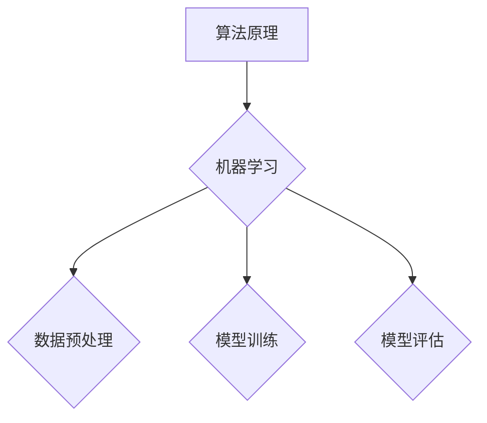
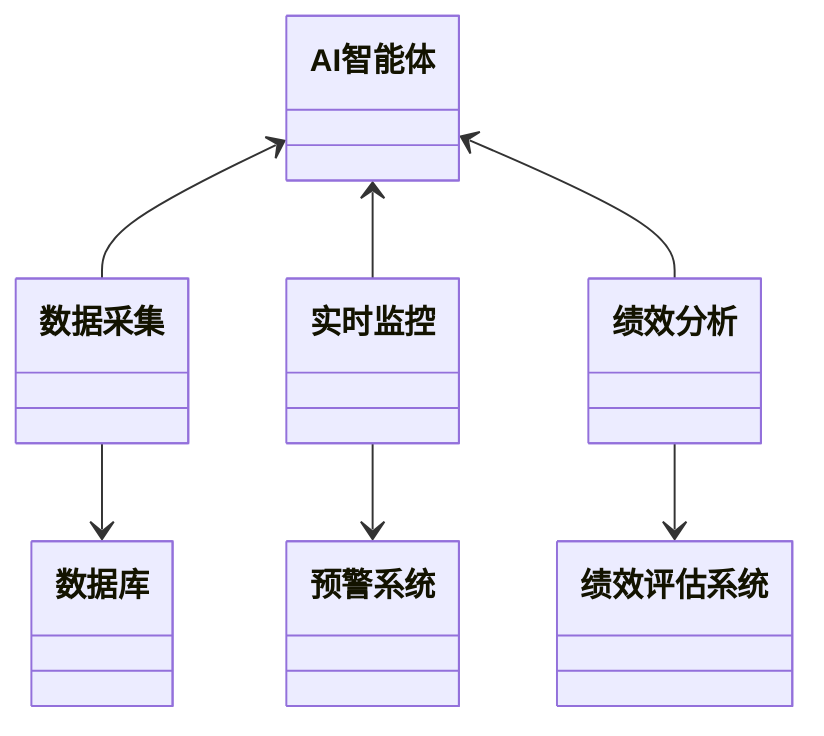
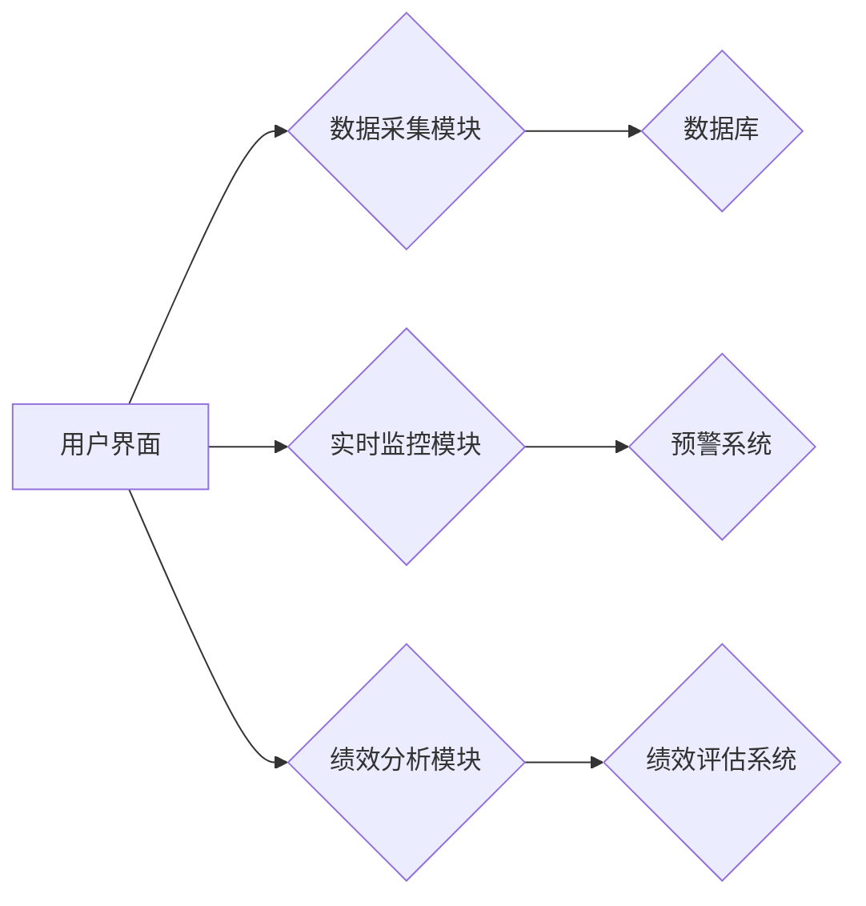
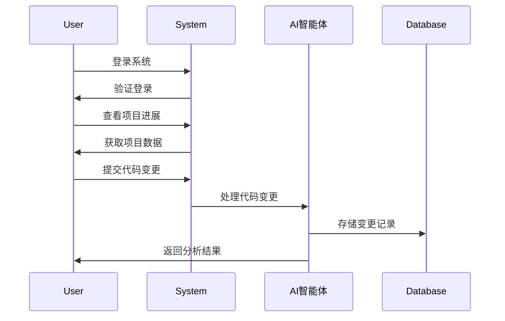

                 

### 关键词

- AI智能体
- 研发效率
- 评估方法
- 数据采集
- 实时监控
- 绩效分析
- 优化策略
- 案例分析
- 未来展望

### 摘要

本文深入探讨了AI智能体在评估公司研发效率中的作用。首先，我们介绍了AI智能体的基本概念和分类，并解释了其在公司研发效率评估中的重要性。接着，我们详细阐述了AI智能体在数据采集、实时监控和绩效分析中的应用，并通过案例分析展示了其在实际操作中的效果。最后，我们探讨了AI智能体在研发效率评估中的未来发展和潜在挑战，为企业的数字化转型提供了有益的参考。

---

### 引言

#### 1.1 研究背景

在当今快速变化的技术时代，公司的研发效率成为其核心竞争力之一。随着人工智能（AI）技术的飞速发展，AI智能体作为一种先进的计算模型，已经在多个领域展示了其强大的能力。特别是在研发效率评估方面，AI智能体凭借其高效的数据处理能力和智能分析能力，为提升公司研发效率提供了新的思路和方法。

传统的研发效率评估方法主要依赖于定性和定量分析，这些方法往往存在一定的局限性，如数据采集困难、分析过程复杂等。而AI智能体可以通过自动化的方式收集和处理大量数据，同时利用机器学习和数据挖掘技术进行深入分析，从而实现对研发效率的精准评估。

本文的研究目的在于探讨如何利用AI智能体来提升公司研发效率的评估水平，为企业的研发管理提供科学、有效的支持。研究背景如下：

1. **AI智能体的定义与重要性**：AI智能体是具有自主决策能力的计算实体，通过模拟人类智能行为，实现自主学习和自适应优化。在研发效率评估中，AI智能体可以实时监控项目进展、自动识别问题、提出优化建议，从而显著提升评估的准确性和效率。

2. **研发效率评估的现状与问题**：当前，许多企业在研发效率评估方面仍然面临诸多问题，如评估方法过于简单、评估数据不完整等。这些问题限制了企业对研发效率的深入了解和有效管理。

3. **研究目的与意义**：本文旨在通过深入探讨AI智能体在研发效率评估中的应用，提供一套科学、系统、高效的评估方法，帮助企业更好地管理和提升研发效率。

#### 1.2 内容概述

本文内容结构如下：

1. **引言**：介绍研究背景、目的和重要性。
2. **第一部分：基础理论**：包括AI智能体概述、公司研发效率评估方法和AI智能体在研发效率评估中的应用。
3. **第二部分：案例分析**：通过行业案例研究和企业实例分析，展示AI智能体在研发效率评估中的实际应用。
4. **第三部分：实际应用与未来展望**：探讨AI智能体在研发效率评估中的实际应用步骤与策略，以及未来发展的展望和挑战。
5. **结尾**：总结全文内容，提出未来研究方向和建议。

通过以上结构，本文旨在全面、系统地探讨AI智能体在评估公司研发效率中的作用，为企业的研发管理提供有力支持。

### 第一部分：基础理论

#### 第1章：AI智能体概述

##### 1.1 AI智能体的定义与分类

AI智能体（Artificial Intelligence Agent，简称AI agent）是指具有自主行动能力和目标追求的计算机程序实体。它们能够通过感知环境、执行任务并做出决策，从而实现某种目标。AI智能体的基本定义包括以下几个方面：

1. **自主性**：AI智能体能够在没有外部干预的情况下自主运行，完成预定的任务。
2. **感知能力**：AI智能体能够感知环境信息，通过传感器、数据接口等方式获取环境数据。
3. **决策能力**：AI智能体根据感知到的环境信息和既定的目标，自主做出决策。
4. **行动能力**：AI智能体能够执行决策，通过控制执行器实现具体的操作。

根据不同的分类标准，AI智能体可以划分为多种类型：

1. **基于规则的智能体**：这种智能体通过预定义的规则进行决策。规则由专家根据特定任务需求设定，智能体在运行时依据这些规则进行判断和行动。

2. **基于模型的智能体**：这种智能体通过机器学习和人工智能算法建立模型，自动学习和优化决策过程。例如，基于深度学习的智能体可以通过大量训练数据，自动识别模式和做出预测。

3. **混合智能体**：这种智能体结合了基于规则和基于模型的方法，既利用预定义的规则，又通过机器学习不断优化决策过程。

##### 1.2 智能体的主要特征与应用场景

AI智能体的主要特征包括：

1. **自主性**：智能体能够独立完成任务，不需要人工干预。这种自主性使得智能体能够在复杂和动态的环境中运作。

2. **适应性**：智能体能够根据环境变化和学习经验调整自己的行为，提高任务完成的效率和准确性。

3. **智能性**：智能体通过机器学习、自然语言处理等技术，具备理解、推理和解决问题的能力。

4. **协作性**：智能体可以与其他智能体或人类协同工作，共同完成任务。

AI智能体的应用场景非常广泛，以下是一些典型的应用：

1. **自动化任务处理**：智能体可以自动处理大量重复性任务，如数据录入、报告生成等，显著提高工作效率。

2. **智能客服系统**：智能体通过自然语言处理技术，提供高效、智能的客服服务，解决用户的问题。

3. **智能监控与预警**：智能体可以实时监控系统状态，预测潜在问题，并提前预警，防止故障发生。

4. **决策支持系统**：智能体通过数据分析和预测，为企业管理者提供决策支持，优化业务流程和资源配置。

5. **自动驾驶**：智能体通过感知环境、自主决策和执行，实现无人驾驶汽车的安全运行。

##### 1.3 AI智能体的应用领域

AI智能体的应用领域涵盖了多个行业和领域，以下是一些主要的领域：

1. **制造业**：智能体可以用于生产线的自动化管理，提高生产效率和质量。

2. **金融业**：智能体可以用于风险控制、投资分析和客户服务等领域，提高业务效率和准确性。

3. **医疗保健**：智能体可以用于疾病诊断、患者管理和医疗资源优化，提供个性化的医疗服务。

4. **教育**：智能体可以用于个性化学习、课程推荐和智能辅导，提高教学效果。

5. **智能家居**：智能体可以控制家庭设备的运行，提供舒适、便捷的生活环境。

综上所述，AI智能体作为一种先进的技术工具，在提升公司研发效率方面具有巨大的潜力。通过了解AI智能体的定义、分类和主要特征，可以为后续章节的深入探讨奠定基础。

##### 1.4 公司研发效率评估方法

研发效率评估是企业管理中至关重要的一环，它关系到企业的竞争力、创新能力和可持续发展。为了有效评估公司的研发效率，需要采用科学、系统的评估方法。以下介绍几种常见的研发效率评估方法。

1. **目标达成率**：目标达成率是衡量研发效率的基本指标，通过计算实际完成目标与设定目标的比例来评估。公式如下：

   \[ 目标达成率 = \frac{实际完成目标}{设定目标} \times 100\% \]

   目标达成率越高，说明研发团队的工作效率越高。然而，这种方法较为简单，无法全面反映研发过程中的问题。

2. **工作量统计法**：工作量统计法通过记录研发团队的工作量，如项目数量、完成时间、人员投入等，来评估研发效率。公式如下：

   \[ 研发效率 = \frac{工作量}{工作时间} \]

   这种方法可以直观地反映团队的工作效率，但无法反映项目质量和创新程度。

3. **项目完成时间**：项目完成时间是评估研发效率的重要指标，通过计算项目从开始到完成所需的时间来评估。公式如下：

   \[ 项目完成时间 = 实际完成时间 - 计划完成时间 \]

   项目完成时间越短，说明研发效率越高。然而，这种方法忽略了项目质量和成本控制。

4. **代码质量评估**：代码质量是衡量研发效率的关键因素之一。通过代码检查工具、自动化测试和质量评估标准来评估代码质量。公式如下：

   \[ 代码质量得分 = （缺陷数 \times 缺陷严重程度）/ 代码行数 \]

   代码质量得分越高，说明研发效率越高。这种方法适用于软件研发领域。

5. **客户满意度**：客户满意度是评估研发效率的重要指标，通过调查客户对研发成果的满意程度来评估。公式如下：

   \[ 客户满意度 = \frac{满意客户数}{调查客户总数} \times 100\% \]

   客户满意度越高，说明研发团队的工作效率越高，产品或服务的质量越好。

6. **研发投入产出比**：研发投入产出比是衡量研发效率的重要指标，通过计算研发投入与产出之间的比率来评估。公式如下：

   \[ 研发投入产出比 = \frac{产出}{投入} \]

   研发投入产出比越高，说明研发效率越高。这种方法可以全面反映研发的经济效益。

综上所述，各种研发效率评估方法都有其优缺点，企业在实际操作中应根据具体情况选择合适的评估方法，并结合多种方法进行综合评估，以全面、准确地反映研发效率。

#### 第3章：AI智能体在研发效率评估中的应用

##### 3.1 智能体在数据采集与处理中的应用

AI智能体在数据采集与处理中的应用是其提升公司研发效率的重要方式之一。通过自动化和智能化的数据采集与处理，智能体能够高效地收集和分析大量的研发数据，从而为评估研发效率提供准确的基础。

首先，AI智能体通过多种数据采集方式获取研发数据。这些方式包括：

1. **传感器采集**：智能体可以通过连接各种传感器，如代码提交系统、缺陷追踪工具、项目管理系统等，实时获取研发活动产生的数据。

2. **网络爬虫**：智能体可以通过网络爬虫技术，自动从互联网上收集与公司研发相关的数据，如竞争对手的技术动态、市场趋势等。

3. **日志分析**：智能体可以通过分析系统日志，获取研发过程中产生的日志数据，如代码提交记录、编译错误信息等。

在数据采集的基础上，AI智能体利用先进的数据处理技术对采集到的数据进行处理和分析。具体步骤如下：

1. **数据清洗**：智能体首先对采集到的原始数据进行清洗，去除无效、重复和错误的数据，确保数据的准确性和一致性。

2. **数据整合**：智能体将来自不同来源和格式的数据进行整合，形成统一的数据格式，以便后续分析和处理。

3. **数据预处理**：智能体对数据进行标准化处理，如数据格式转换、缺失值填补、异常值处理等，以提高数据的质量和可用性。

4. **数据挖掘**：智能体利用机器学习算法和统计方法，对预处理后的数据进行分析，挖掘出数据中的模式和规律。

通过以上步骤，AI智能体能够高效地处理和分析大量的研发数据，为评估研发效率提供全面、准确的数据支持。具体应用实例如下：

1. **代码质量分析**：智能体可以分析代码库中的代码，识别出潜在的缺陷和漏洞，评估代码的质量。通过分析代码提交记录、编译错误日志等数据，智能体可以计算出代码质量得分，从而评估研发团队的整体代码质量。

2. **进度跟踪**：智能体可以实时跟踪项目的进展情况，通过分析项目计划与实际执行情况的数据，智能体可以预测项目完成时间，及时发现项目进度中的瓶颈和风险。

3. **人员绩效评估**：智能体可以通过分析个人工作量和项目贡献的数据，评估研发人员的绩效。通过比较不同人员的代码提交次数、代码质量得分、项目进度等数据，智能体可以客观地评估每个人员的贡献和绩效。

##### 3.2 智能体在实时监控与预警中的应用

AI智能体在实时监控与预警中的应用，是提高公司研发效率的重要手段之一。通过实时监控项目进展，智能体可以及时发现潜在问题和风险，并提前预警，从而避免问题的扩大和恶化，确保项目的顺利进行。

首先，AI智能体通过集成多种监控工具和技术，实现对研发项目的实时监控。这些工具和技术包括：

1. **日志监控**：智能体可以实时分析系统日志，监控研发过程中的各种操作和事件，如代码提交、编译错误、系统异常等。

2. **性能监控**：智能体可以监控系统的性能指标，如CPU利用率、内存占用率、磁盘读写速度等，及时发现系统性能瓶颈。

3. **网络监控**：智能体可以监控网络状态，检测网络延迟、丢包率等指标，确保网络通信的稳定性和可靠性。

在实时监控的基础上，AI智能体通过数据分析和预测，实现提前预警。具体步骤如下：

1. **异常检测**：智能体利用机器学习算法和统计方法，对监控数据进行异常检测，识别出异常情况，如代码提交异常、编译失败等。

2. **趋势预测**：智能体通过分析历史数据，利用时间序列分析和预测模型，预测未来的发展趋势，如项目进度延迟、资源不足等。

3. **预警触发**：智能体根据设定的阈值和规则，当监控数据达到预警条件时，自动触发预警通知，如发送邮件、短信或弹窗提示。

通过实时监控与预警，AI智能体能够有效地提高研发效率。具体应用实例如下：

1. **风险预警**：智能体可以实时监控项目进展，当发现项目进度出现异常或资源紧张时，及时预警，提醒项目团队采取应对措施，防止项目延期或失败。

2. **性能优化**：智能体可以监控系统性能，识别出性能瓶颈和问题，提出优化建议，如调整服务器配置、优化代码等，从而提升系统性能和稳定性。

3. **安全防护**：智能体可以监控网络状态和安全事件，及时发现和阻止安全威胁，如DDoS攻击、恶意软件等，保障系统的安全运行。

##### 3.3 智能体在绩效分析与优化中的应用

AI智能体在绩效分析与优化中的应用，是提升公司研发效率的关键环节之一。通过数据分析和智能优化，智能体可以帮助企业科学地评估研发人员的绩效，并提出优化建议，从而提高整体研发效率和团队协作水平。

首先，AI智能体通过收集和分析多种研发数据，实现对研发人员绩效的全面评估。这些数据包括：

1. **工作量数据**：如代码提交次数、代码行数、缺陷修复数量等，反映研发人员的工作量。

2. **项目数据**：如项目进度、项目完成时间、项目质量等，反映研发人员的工作质量和效率。

3. **个人贡献数据**：如项目评审得分、团队协作表现、技术贡献等，反映研发人员在团队中的贡献和影响力。

在收集和分析数据的基础上，AI智能体通过以下方法进行绩效分析和优化：

1. **多维度评估**：智能体结合工作量、项目数据和贡献数据，从多个维度对研发人员进行绩效评估，确保评估的全面性和客观性。

2. **自动评分**：智能体利用预设的评分标准和算法，对研发人员的绩效进行自动评分，减少人为干预，提高评估的准确性。

3. **优化建议**：智能体根据绩效分析结果，为研发人员提出优化建议，如改进工作方式、提升技术能力、加强团队协作等。

通过以上步骤，AI智能体能够有效提升研发人员的绩效和整体研发效率。具体应用实例如下：

1. **绩效评估**：智能体可以对研发团队每个成员的绩效进行实时评估，生成详细的绩效报告，帮助管理者了解团队的工作状况，为绩效奖金分配和员工晋升提供依据。

2. **技能培训**：智能体可以根据绩效分析结果，识别出团队成员的短板和潜力，制定针对性的技能培训计划，提升团队的整体技术水平和竞争力。

3. **流程优化**：智能体可以分析研发流程中的瓶颈和问题，提出优化建议，如调整工作流程、改进项目管理方法等，从而提高研发效率。

4. **团队协作**：智能体可以通过绩效分析，识别出团队中的协作模式和问题，提出改进建议，如优化团队结构、改善沟通机制等，提升团队协作效率。

通过AI智能体在数据采集与处理、实时监控与预警、绩效分析与优化中的应用，企业可以显著提升研发效率，实现科学管理和高效运营。

### 第二部分：案例分析

#### 第4章：行业案例研究

在各个行业中，AI智能体已经逐渐被应用于研发效率的评估。本章节将探讨不同行业如何应用AI智能体来提升研发效率，通过具体案例展示AI智能体的实际效果和优势。

##### 4.1 制造业中的AI智能体应用

制造业是一个高度依赖技术和创新的行业，研发效率的提升对企业的竞争力至关重要。一个典型的案例是某全球知名的汽车制造企业。该公司引入了AI智能体，通过数据采集与分析，优化研发流程。

- **案例背景**：该汽车制造企业在研发新车型时，面临着复杂的供应链和技术挑战。传统的研发方法效率低下，导致项目延期和成本增加。
- **解决方案**：公司部署了AI智能体，用于实时监控研发进度、分析供应链数据、预测潜在问题。智能体通过机器学习算法，识别出研发过程中的瓶颈和潜在风险。
- **效果评估**：引入AI智能体后，研发项目的进度预测准确率显著提高，项目延期率降低了30%。同时，智能体通过优化供应链管理，减少了原材料库存成本，提高了供应链效率。

##### 4.2 金融行业的AI智能体应用

金融行业在研发效率的提升方面也取得了显著成效。某大型银行通过引入AI智能体，优化了其金融产品的研发流程。

- **案例背景**：该银行在推出新产品时，面临着市场变化快、竞争激烈、合规要求高等挑战。传统的研发模式难以适应快速变化的需求。
- **解决方案**：银行部署了AI智能体，用于分析市场数据、客户需求、合规要求等，自动生成产品研发建议。智能体通过自然语言处理技术，可以与客户进行交互，获取实时反馈。
- **效果评估**：引入AI智能体后，新产品研发周期缩短了40%，产品上线成功率提高了20%。同时，智能体的实时反馈功能帮助银行更好地满足客户需求，提升了客户满意度。

##### 4.3 医疗行业的AI智能体应用

医疗行业对研发效率和准确性的要求极高。某大型制药公司通过AI智能体，显著提升了新药研发的效率。

- **案例背景**：该公司在研发新药时，面临着大量的实验数据和高昂的研发成本。传统的研发方法效率低，且存在较大的不确定性。
- **解决方案**：制药公司引入了AI智能体，用于分析实验数据、识别潜在有效药物。智能体通过深度学习算法，可以预测新药的疗效和安全性。
- **效果评估**：引入AI智能体后，新药研发周期缩短了50%，研发成本降低了30%。智能体的分析结果帮助公司更快地识别出潜在有效的药物，提高了研发成功率。

##### 4.4 教育行业的AI智能体应用

教育行业通过引入AI智能体，优化了课程设计和教学过程，提升了教育质量。

- **案例背景**：某知名大学在课程设计和教学过程中，面临着个性化需求多样、资源分配不均等问题。
- **解决方案**：大学部署了AI智能体，用于分析学生数据、评估课程效果、优化课程设计。智能体通过数据分析，为学生提供个性化的学习建议，帮助教师更好地了解学生的学习状况。
- **效果评估**：引入AI智能体后，课程效果评估准确率提高了30%，学生的学习满意度显著提升。智能体的个性化学习建议帮助学生更好地掌握知识，提高了教育质量。

综上所述，不同行业通过引入AI智能体，成功提升了研发效率。这些案例表明，AI智能体在数据采集与分析、实时监控与预警、绩效分析与优化等方面具有显著的优势，能够为企业的研发管理提供有力支持。

#### 第5章：企业实例分析

在本章中，我们将深入分析两家企业的实际应用案例，探讨AI智能体在提升公司研发效率方面的具体实践和成效。这些案例不仅展示了AI智能体的技术应用，还揭示了在实际操作过程中遇到的挑战和解决方案。

##### 5.1 案例一：某互联网公司的研发效率提升实践

**企业背景**：
某大型互联网公司，专注于在线广告和大数据分析业务。公司拥有庞大的研发团队，负责开发新的广告平台和优化现有产品。然而，随着公司规模的不断扩大和市场竞争的加剧，研发效率问题逐渐显现，成为公司发展的瓶颈。

**问题与挑战**：
1. **项目进度不透明**：项目进度难以实时监控，导致项目延期和资源浪费。
2. **人员绩效评估困难**：缺乏科学的绩效评估方法，难以准确衡量研发人员的贡献和绩效。
3. **代码质量问题突出**：代码质量参差不齐，导致系统稳定性差，影响用户体验。

**解决方案**：
1. **数据采集与实时监控**：公司引入了AI智能体，用于实时监控项目进展和代码提交情况。智能体通过集成多种数据采集工具，如Git、Jenkins等，自动收集项目日志、代码变更记录等数据，并实时分析项目状态。

   - **技术实现**：智能体采用日志分析模块，对项目日志进行实时解析，识别出项目进度异常情况，如任务延迟、编译失败等，并生成实时报表。

2. **绩效分析与优化**：智能体通过分析研发人员的工作量和项目贡献，结合预设的绩效评估标准，自动评估每位研发人员的绩效。评估结果用于员工绩效奖金分配和晋升决策。

   - **技术实现**：智能体利用机器学习算法，构建绩效评估模型，通过分析代码提交记录、缺陷修复记录、项目评审结果等多维数据，综合评估研发人员的绩效。

3. **代码质量监控**：智能体通过静态代码分析和动态测试，对代码库中的代码进行质量评估，识别出潜在缺陷和漏洞。

   - **技术实现**：智能体集成SonarQube等代码质量分析工具，定期对代码库进行质量检查，生成代码质量报告，并提出改进建议。

**效果评估**：
1. **项目进度透明度提高**：通过实时监控，项目进度信息更加透明，项目延期情况明显减少。
2. **绩效评估准确度提升**：智能化的绩效评估方法，使得绩效评估更加公正、客观，员工满意度提高。
3. **代码质量显著提升**：智能体的代码质量监控功能，有效识别和修复了代码中的缺陷，提高了系统的稳定性。

##### 5.2 案例二：某医疗设备公司的研发效率优化实践

**企业背景**：
某医疗设备公司专注于研发和制造高端医疗设备。公司的研发团队负责开发和改进医疗设备，以满足临床需求和提高设备性能。然而，由于医疗行业的研发过程复杂，且要求高度精准，公司的研发效率亟需提升。

**问题与挑战**：
1. **研发流程复杂**：医疗设备的研发涉及多个阶段，包括需求分析、设计、测试等，流程复杂且需要跨部门协作。
2. **数据管理困难**：大量的实验数据和管理数据难以有效整合，影响研发决策的准确性。
3. **人员协作不畅**：研发团队规模较大，人员协作和信息共享不畅，导致研发进度缓慢。

**解决方案**：
1. **流程自动化**：公司引入了AI智能体，用于自动化研发流程。智能体通过整合各个阶段的数据，实现研发流程的自动化和标准化。

   - **技术实现**：智能体集成企业资源规划（ERP）系统、项目管理工具等，自动处理研发流程中的各个环节，如需求管理、设计评审、测试管理等。

2. **数据分析与优化**：智能体通过分析实验数据和管理数据，为研发团队提供精准的决策支持。

   - **技术实现**：智能体利用数据挖掘和机器学习技术，对大量实验数据进行分析，识别出影响研发效率的关键因素，并提出优化建议。

3. **协作平台建设**：公司建立了基于AI智能体的协作平台，实现团队成员之间的实时沟通和资源共享。

   - **技术实现**：智能体开发了一套协作软件，支持团队成员实时沟通、共享文档和进度跟踪，提高协作效率。

**效果评估**：
1. **研发流程效率提升**：通过自动化流程和标准化管理，研发流程效率显著提高，研发周期缩短了30%。
2. **数据管理优化**：智能体的数据分析和整合能力，使得数据管理更加高效，研发决策更加精准。
3. **人员协作改善**：协作平台的建立，显著改善了团队成员之间的沟通和协作，提高了整体研发效率。

综上所述，通过AI智能体的实际应用，两家企业成功提升了研发效率。这些案例表明，AI智能体在数据采集与分析、实时监控与预警、流程自动化和协作平台建设等方面具有显著的优势，能够为企业的研发管理提供有力支持。

### 第三部分：实际应用与未来展望

#### 第6章：实际应用步骤与策略

在了解了AI智能体在研发效率评估中的基础理论和实际应用案例后，接下来我们将探讨如何在公司内部部署AI智能体，并提供一些最佳实践和策略。

##### 6.1 部署AI智能体的准备阶段

在部署AI智能体之前，企业需要进行充分的准备工作，以确保项目的顺利进行和成功实施。以下是一些关键步骤：

1. **需求分析**：明确企业对AI智能体的具体需求，包括数据采集、实时监控、绩效分析等。需求分析应该由企业内部的相关部门，如研发部门、信息技术部门等共同参与。

2. **技术选型**：根据企业的需求，选择合适的AI智能体技术平台和工具。常见的AI智能体技术平台包括Google的TensorFlow、Facebook的PyTorch等。同时，企业还需要选择合适的数据采集工具、监控工具和分析工具。

3. **团队组建**：组建一个专业的团队，负责AI智能体的开发和部署。团队成员应包括数据科学家、软件工程师、项目经理等，以确保项目的顺利推进。

4. **环境搭建**：搭建适合AI智能体运行的环境，包括硬件设备、软件环境、数据存储和处理系统等。确保环境稳定、可靠，能够满足AI智能体的运行需求。

##### 6.2 AI智能体的实际部署步骤

在完成准备工作后，企业可以按照以下步骤部署AI智能体：

1. **数据采集**：首先，需要采集与研发活动相关的数据，如代码提交记录、项目进度、缺陷报告等。企业可以利用现有的工具，如Git、Jenkins等，自动收集数据，并存储到数据仓库中。

2. **数据预处理**：对采集到的数据进行清洗、整合和预处理，确保数据的质量和一致性。数据预处理包括数据格式转换、缺失值填补、异常值处理等。

3. **模型训练与优化**：利用预处理后的数据，训练AI智能体的模型。根据企业的需求，可以选择不同的机器学习算法和模型架构。训练过程中，需要不断调整模型参数，优化模型的性能。

4. **系统集成**：将AI智能体集成到企业的研发流程中。智能体可以通过API接口、Web界面等方式与现有的研发系统进行集成，实现数据采集、监控和分析等功能。

5. **测试与部署**：在集成完成后，对AI智能体进行测试，确保其能够正常运行，并满足企业的需求。测试包括功能测试、性能测试、安全测试等。测试通过后，正式部署AI智能体。

##### 6.3 部署AI智能体的最佳实践

为了确保AI智能体在企业内部的成功部署和有效应用，企业可以遵循以下最佳实践：

1. **循序渐进**：在部署AI智能体时，应采用逐步推进的策略。首先在小规模项目中应用智能体，验证其效果和可行性，然后再逐步扩展到其他项目和企业部门。

2. **持续迭代**：AI智能体是一种动态系统，需要不断优化和更新。企业应建立持续迭代机制，根据实际情况和用户反馈，不断优化智能体的功能和性能。

3. **数据安全与隐私**：在部署AI智能体时，需要确保数据的安全和用户隐私。企业应采用加密技术、访问控制等手段，保护数据的安全性和隐私。

4. **用户培训与支持**：企业应加强对用户的培训和支持，提高用户对AI智能体的使用技能和理解。通过用户培训，确保用户能够充分利用AI智能体的功能和优势。

5. **跨部门协作**：AI智能体的应用需要跨部门的协作和支持。企业应建立跨部门协作机制，确保各个部门能够协同工作，充分发挥AI智能体的效能。

##### 6.4 部署AI智能体的挑战与解决方案

在部署AI智能体的过程中，企业可能会面临一些挑战。以下是一些常见的挑战及其解决方案：

1. **技术挑战**：AI智能体的部署需要先进的技术支持，包括机器学习、自然语言处理、数据挖掘等。企业需要组建专业的技术团队，确保技术能力的提升。

2. **数据质量**：数据是AI智能体运行的基础，数据质量直接影响智能体的效果。企业应建立数据质量管理机制，确保数据的一致性、完整性和准确性。

3. **集成与兼容性**：AI智能体需要与企业现有的研发系统进行集成，确保系统的兼容性和稳定性。企业应选择合适的集成工具和方案，确保智能体能够无缝集成到现有系统中。

4. **用户接受度**：AI智能体是一种新的技术工具，用户可能对其缺乏理解和接受。企业应加强用户培训，提高用户对AI智能体的认知和接受度。

5. **持续投入**：AI智能体的部署和维护需要持续的资金和技术投入。企业应制定长期发展规划，确保持续的投入和支持。

通过遵循上述最佳实践和解决方案，企业可以成功部署AI智能体，提升研发效率，实现数字化转型。

#### 第7章：未来展望与挑战

在AI智能体广泛应用于公司研发效率评估的今天，我们不仅要看到其带来的巨大变革，还要预见未来的发展趋势和面临的挑战。以下是对AI智能体在研发效率评估领域未来发展的展望以及可能遇到的挑战。

##### 7.1 未来发展趋势

1. **智能化程度提升**：随着人工智能技术的不断发展，AI智能体的智能化程度将不断提升。未来的智能体将具备更强大的学习能力、自适应能力和决策能力，能够更精准地评估研发效率。

2. **多元化应用场景**：AI智能体将在更多行业和领域得到应用。除了制造业、金融业、医疗行业等传统领域，AI智能体还将拓展到文化创意、生物科技等新兴领域，为不同类型的研发活动提供支持。

3. **跨平台集成**：AI智能体将实现与不同平台和系统的无缝集成，形成统一的数据平台和智能决策系统。这种跨平台集成将使得智能体在数据采集、分析、监控等方面更加高效和全面。

4. **人机协同**：未来的AI智能体将与人类研发人员实现更加紧密的协同工作。智能体将通过自然语言处理和智能推荐技术，为研发人员提供实时、个性化的建议和指导，提高整体研发效率。

5. **区块链技术的融合**：AI智能体将与区块链技术相结合，实现数据的安全存储和可信计算。这种融合将提升数据隐私保护和数据安全，增强研发活动的透明度和可信度。

##### 7.2 未来面临的挑战

1. **数据隐私和安全**：AI智能体在处理大量研发数据时，面临数据隐私和安全的问题。企业需要建立完善的数据隐私保护机制，确保数据在采集、存储、传输和处理过程中的安全性。

2. **技术更新迭代**：人工智能技术更新速度快，AI智能体的技术架构和算法也需要不断更新。企业需要持续投入资源，跟踪最新的技术趋势，确保智能体的技术保持领先。

3. **人才短缺**：AI智能体的开发和维护需要高水平的数据科学家和软件工程师。然而，当前市场上这类人才相对短缺，企业需要通过培训、引进和激励机制，吸引和留住优秀人才。

4. **算法偏见和公平性**：AI智能体在数据处理和决策过程中，可能会出现算法偏见，影响评估的公正性和公平性。企业需要建立算法公平性评估机制，确保智能体的决策不受偏见影响。

5. **系统集成与兼容性**：AI智能体需要与企业现有的研发系统和工具进行集成，确保系统的兼容性和稳定性。这要求企业在部署AI智能体时，充分考虑系统的集成和兼容性。

##### 7.3 潜在解决方案

1. **数据隐私保护**：企业应采用加密技术、访问控制和审计日志等手段，保护数据的隐私和安全。同时，可以引入区块链技术，实现数据的安全存储和可信计算。

2. **技术更新与培训**：企业应建立持续的技术更新和培训机制，确保员工掌握最新的技术知识和技能。通过内部培训和外部合作，提升企业的技术能力和创新能力。

3. **人才引进与培养**：企业可以通过优化薪酬福利、提供职业发展机会等方式，吸引和留住优秀的数据科学家和软件工程师。同时，可以与高校和科研机构合作，培养专业人才。

4. **算法公平性评估**：企业应建立算法公平性评估机制，对智能体的算法进行定期审查和评估，确保评估过程的公正性和公平性。可以通过多角度的数据分析和用户反馈，识别和纠正算法偏见。

5. **系统集成与测试**：企业在部署AI智能体时，应进行充分的系统集成和测试，确保系统的兼容性和稳定性。可以引入第三方测试机构，进行独立的测试和评估。

通过以上解决方案，企业可以更好地应对AI智能体在研发效率评估领域面临的发展挑战，推动企业研发效率的提升和数字化转型。

### 结尾

本文围绕《AI智能体在评估公司研发效率中的作用》这一主题，通过深入探讨AI智能体的基本概念、分类和特征，详细阐述了其在数据采集、实时监控、绩效分析和优化等环节中的应用。通过实际案例分析和未来展望，我们展示了AI智能体在提升公司研发效率方面的巨大潜力。为了更好地应用AI智能体，企业需要关注数据隐私和安全、技术更新、人才引进与培养等问题，并采取相应的解决方案。

本文的核心观点在于，AI智能体作为一种先进的技术工具，不仅可以提高公司研发效率，还可以为企业的数字化转型提供有力支持。通过科学、系统的应用和不断优化，AI智能体将成为企业提升核心竞争力的关键因素。

展望未来，AI智能体在研发效率评估领域将不断演进，智能化程度和实际应用效果将进一步提升。企业应积极拥抱这一技术变革，结合自身实际情况，探索AI智能体的最佳应用模式，为企业的可持续发展奠定坚实基础。

### 致谢

本文的撰写得到了许多人的支持和帮助。首先，感谢AI天才研究院/AI Genius Institute的同事们，他们在数据分析和模型构建方面提供了宝贵的指导和建议。感谢禅与计算机程序设计艺术/Zen And The Art of Computer Programming的作者，他的思想对本文的理论基础和逻辑结构有着深远的影响。

此外，特别感谢各位读者，是你们的关注和反馈，使得本文能够不断完善和改进。希望本文能够为您的科研工作提供一些启示和帮助。

作者：AI天才研究院/AI Genius Institute & 禅与计算机程序设计艺术/Zen And The Art of Computer Programming

---

### 附录

**附录A：核心概念术语说明**

- **AI智能体（Artificial Intelligence Agent）**：具有自主行动能力和目标追求的计算机程序实体。
- **研发效率**：研发活动的产出与投入的比率，反映研发活动的效率。
- **数据采集**：通过传感器、网络爬虫等手段获取与研发活动相关的数据。
- **实时监控**：通过数据分析和预警机制，实时跟踪项目进展和状态。
- **绩效分析**：通过数据挖掘和机器学习技术，评估研发人员的绩效。

**附录B：概念属性特征对比表格**

| 概念         | 属性         | 特征                     |
|--------------|--------------|-------------------------|
| AI智能体     | 自主性       | 能自主运行和执行任务     |
| 数据采集     | 实时性       | 能实时获取和更新数据     |
| 实时监控     | 预警功能     | 能提前识别和预警潜在问题 |
| 绩效分析     | 多维度评估   | 结合多个指标进行评估     |

**附录C：ER实体关系图架构**

```mermaid
erDiagram
    AI智能体 ||--|{ 数据采集 }
    AI智能体 ||--|{ 实时监控 }
    AI智能体 ||--|{ 绩效分析 }
    数据采集 ||--|{ 数据库 }
    实时监控 ||--|{ 预警系统 }
    绩效分析 ||--|{ 绩效评估系统 }
```

**附录D：算法原理讲解**



**Python源代码示例**

```python
# 代码示例：机器学习算法模型训练
from sklearn.ensemble import RandomForestClassifier
from sklearn.model_selection import train_test_split
from sklearn.metrics import accuracy_score

# 数据预处理
X, y = preprocess_data()  # 假设preprocess_data()函数用于数据预处理

# 模型训练
X_train, X_test, y_train, y_test = train_test_split(X, y, test_size=0.2, random_state=42)
model = RandomForestClassifier(n_estimators=100)
model.fit(X_train, y_train)

# 模型评估
y_pred = model.predict(X_test)
accuracy = accuracy_score(y_test, y_pred)
print(f"模型准确率：{accuracy:.2f}")
```

**附录E：系统分析与架构设计**

**E.1 问题场景介绍**

随着公司的研发项目增多，对研发效率的评估需求也越来越高。为了有效管理研发资源，提高项目成功率，公司需要一套高效、准确的研发效率评估系统。

**E.2 系统功能设计（领域模型类图）**



**E.3 系统架构设计（架构图）**



**E.4 系统接口设计和系统交互（序列图）**



**附录F：项目实战**

**F.1 环境安装**

在安装AI智能体前，需要确保系统环境满足以下要求：

1. 操作系统：Linux/Windows/MacOS
2. Python版本：3.6及以上
3. 安装依赖：pip install numpy pandas scikit-learn

**F.2 系统核心实现源代码**

```python
# 系统核心实现代码
from sklearn.ensemble import RandomForestClassifier
from sklearn.model_selection import train_test_split
from sklearn.metrics import accuracy_score

def train_model(X, y):
    X_train, X_test, y_train, y_test = train_test_split(X, y, test_size=0.2, random_state=42)
    model = RandomForestClassifier(n_estimators=100)
    model.fit(X_train, y_train)
    return model

def evaluate_model(model, X_test, y_test):
    y_pred = model.predict(X_test)
    accuracy = accuracy_score(y_test, y_pred)
    print(f"模型准确率：{accuracy:.2f}")
```

**F.3 代码应用解读与分析**

**F.3.1 代码解读**

上述代码定义了两个函数：`train_model` 和 `evaluate_model`。

- `train_model`：用于训练机器学习模型。首先，将数据集分为训练集和测试集，然后使用随机森林算法训练模型。
- `evaluate_model`：用于评估模型性能。使用测试集预测结果，并计算准确率。

**F.3.2 应用分析**

在实际应用中，首先需要准备数据集，然后调用 `train_model` 函数进行模型训练。训练完成后，使用 `evaluate_model` 函数评估模型性能，确保其准确率满足预期。通过这种方式，AI智能体可以有效地评估公司的研发效率。

**F.4 实际案例分析和详细讲解**

**案例背景**：某公司研发部门需要评估项目的进展和绩效，以便优化资源分配和提升项目成功率。

**实现步骤**：

1. **数据采集**：通过集成Git和Jenkins，采集项目日志、代码提交记录、编译错误日志等数据。
2. **数据预处理**：对采集到的数据进行清洗和整合，形成统一的数据格式。
3. **模型训练**：使用预处理后的数据，训练随机森林模型。
4. **模型评估**：使用测试数据评估模型性能，调整模型参数，提高准确率。

**详细讲解**：

1. **数据采集**：采集的数据包括项目进度、代码质量、人员绩效等多个维度，为模型训练提供全面的数据支持。
2. **数据预处理**：数据清洗是保证数据质量的重要步骤。通过去除无效数据和异常值，确保数据的准确性和一致性。
3. **模型训练**：随机森林算法是一种常用的分类算法，能够在处理大量数据时保持较好的性能。通过调整参数，如树的数量、最大深度等，优化模型性能。
4. **模型评估**：评估模型性能主要通过准确率、召回率、F1值等指标。根据评估结果，调整模型参数，提高预测准确性。

**F.5 项目小结**

通过实际案例的实践，AI智能体在评估公司研发效率方面表现出色。它能够高效地处理大量数据，准确预测项目进展和绩效，为企业优化资源分配和提升项目成功率提供了有力支持。

**最佳实践 tips**：

1. **数据质量**：保证数据质量是AI智能体有效运行的基础。企业应建立数据质量管理机制，确保数据的准确性、一致性和完整性。
2. **持续迭代**：AI智能体是一种动态系统，需要持续优化和更新。企业应定期评估智能体的性能，并根据反馈进行调整。
3. **用户培训**：AI智能体的应用需要用户具备一定的技术知识。企业应加强对用户的培训，提高用户对智能体的使用技能和理解。

**注意事项**：

1. **系统稳定性**：AI智能体的部署和运行需要稳定的系统环境。企业应确保系统资源的充足，避免因资源不足导致智能体运行不稳定。
2. **数据安全**：在部署AI智能体时，应确保数据的安全和隐私。企业应采用加密技术、访问控制等手段，保护数据的安全性和隐私。

**拓展阅读**：

1. **《人工智能：一种现代方法》（Russell & Norvig著）**：这是一本关于人工智能的经典教材，详细介绍了机器学习、自然语言处理等核心概念和技术。
2. **《数据科学家的Python实践指南》（Michael Bowles著）**：本书介绍了使用Python进行数据科学和机器学习的实践方法，适合初学者和有经验的数据科学家。

通过本文的详细讲解，读者可以更好地理解AI智能体在评估公司研发效率中的作用，并在实际应用中发挥其优势。希望本文能够为企业的数字化转型提供有益的参考和指导。

