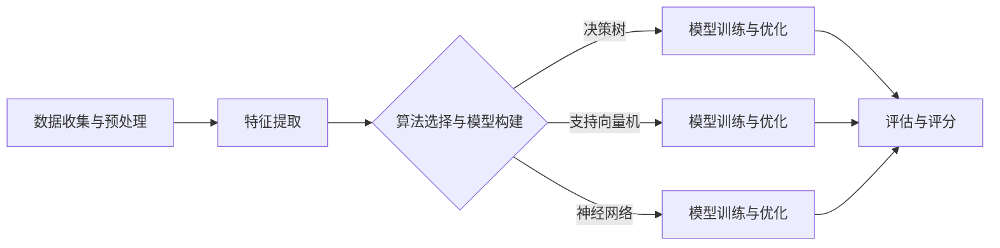
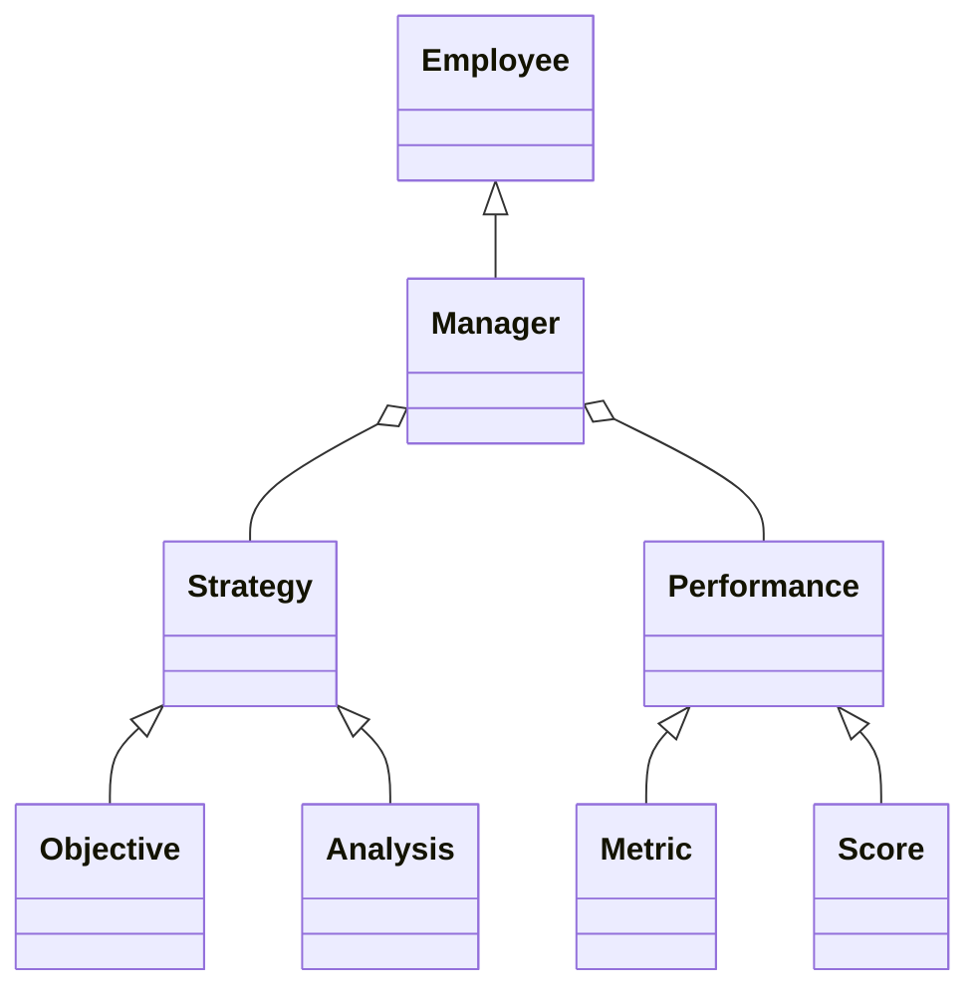
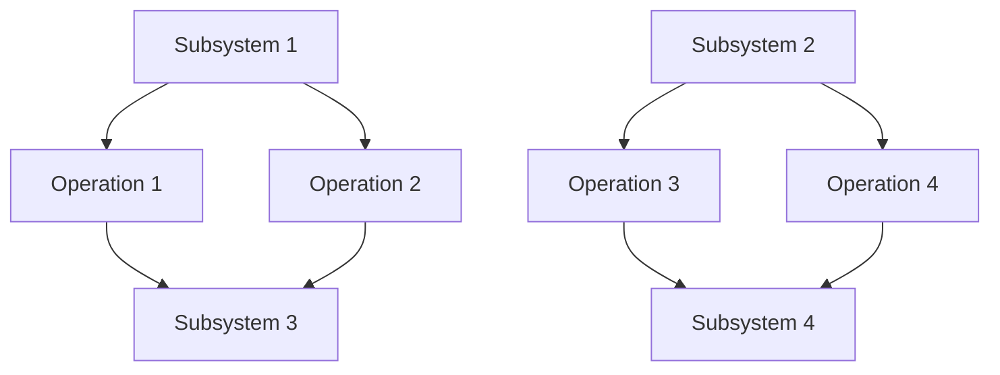

                 

**文章标题**: AI智能体在评估公司管理层执行力和战略规划能力中的应用

**关键词**: AI智能体、公司管理层、执行力、战略规划、评估

**摘要**: 本文将深入探讨如何利用AI智能体评估公司管理层的执行力和战略规划能力。通过分析AI智能体在企业管理中的应用场景、技术原理、实现方法，以及实际案例分析，为企业管理者提供一种全新的决策支持工具，以提高企业竞争力和发展效率。

----------------------------------------------------------------

## 第一部分: 引言

### 1.1 书籍背景

#### 1.1.1 问题背景

随着人工智能技术的飞速发展，AI在各个领域的应用越来越广泛。尤其在企业管理方面，AI智能体作为一种新兴的工具，正在逐渐改变传统的管理模式。然而，如何科学、准确地评估公司管理层的执行力和战略规划能力，仍是一个亟待解决的问题。

#### 1.1.2 问题描述

在企业管理中，管理层执行力和战略规划能力直接影响到企业的运营效率和竞争力。然而，传统的评估方法往往依赖于主观判断，缺乏客观依据。因此，如何利用AI智能体，通过数据分析和模式识别，对管理层执行力和战略规划能力进行科学、准确的评估，成为一个重要的研究课题。

#### 1.1.3 问题解决

本文提出利用AI智能体对管理层决策进行数据分析和模式识别，从而实现对执行力和战略规划能力的评估。具体方法包括：

1. 收集和整理企业历史数据和现有数据，建立数据集。
2. 利用机器学习算法，对数据进行分析和模式识别，提取关键指标。
3. 构建评估模型，对管理层执行力和战略规划能力进行评分。
4. 对评估结果进行解读，为管理层提供改进建议。

#### 1.1.4 边界与外延

本文主要探讨AI智能体在企业管理中的应用，包括对管理层执行力和战略规划能力的评估。此外，本文还将涉及到相关概念的定义、方法论的介绍，以及实际案例的分析。

----------------------------------------------------------------

### 1.2 书籍结构

本文分为三个主要部分：

**第一部分：核心概念与理论基础**

1. **AI智能体的基本原理**：介绍AI智能体的概念、类型和应用领域。
2. **企业执行力与战略规划能力评估的理论基础**：探讨执行力与战略规划能力的定义、评估方法及其在企业运营中的重要性。

**第二部分：应用案例与实例分析**

1. **案例一：某企业的执行力评估**：通过具体案例，展示如何利用AI智能体进行执行力评估。
2. **案例二：某企业的战略规划能力评估**：分析如何利用AI智能体进行战略规划能力评估。

**第三部分：实战指南与最佳实践**

1. **实战步骤解析**：详细阐述如何实施AI智能体在企业管理中的应用。
2. **最佳实践分享**：分享在实际应用中总结的最佳实践和经验。

### 1.3 读者对象

本文适合以下读者：

1. 企业管理层：了解如何利用AI智能体提升管理效能。
2. 数据分析师：掌握AI智能体在数据分析中的应用。
3. AI研究者：了解AI智能体在企业评估中的应用前景。
4. 对AI应用感兴趣的专业人士：探索AI技术在企业管理中的应用。

### 1.4 书籍特色

**方法论介绍**：

- 实证研究方法：通过收集和分析实际数据，提供客观评估。
- 案例分析法：通过具体案例，展示AI智能体在企业管理中的应用效果。
- 数据可视化技术：通过图表和图形，直观展示评估结果。

**特色章节内容**：

- **最新AI技术在企业中的应用实例**：介绍最新的AI技术及其在企业管理中的应用。
- **实用工具与技术的详细介绍**：提供具体的工具和技术指南，便于读者实践。
- **知识点总结与拓展阅读推荐**：对文章中的知识点进行总结，并提供拓展阅读资源。

----------------------------------------------------------------

## 第二部分: 核心概念与理论基础

### 2.1 AI智能体的基本原理

#### 2.1.1 定义

AI智能体（Artificial Intelligent Agent）是指能够在特定环境中自主行动，以实现特定目标的计算实体。智能体具有感知、学习、决策和行动的能力。

#### 2.1.2 类型

1. **反应型智能体**：根据当前感知直接做出反应，不涉及记忆和学习。
2. **目标导向型智能体**：具有目标，根据当前状态选择最佳行动。
3. **学习型智能体**：通过经验学习和模式识别，不断优化行为。
4. **协作型智能体**：多个智能体协同工作，共同完成任务。

#### 2.1.3 应用领域

- **游戏**：如围棋、象棋等智能游戏。
- **智能助手**：如苹果的Siri、亚马逊的Alexa等。
- **智能制造**：如工业自动化、智能机器人等。
- **企业评估**：如执行力评估、战略规划能力评估等。

### 2.2 企业执行力与战略规划能力评估的理论基础

#### 2.2.1 定义

1. **企业执行力**：企业将战略转化为实际行动的能力，包括组织、协调、实施等环节。
2. **战略规划能力**：企业制定和实施战略的能力，包括市场分析、竞争策略、资源分配等。

#### 2.2.2 评估方法

1. **关键绩效指标（KPI）**：通过设定关键绩效指标，对执行力进行量化评估。
2. **平衡计分卡（BSC）**：从财务、客户、内部流程、学习与成长四个维度进行全面评估。
3. **SWOT分析**：通过分析企业的优势、劣势、机会和威胁，评估战略规划能力。

#### 2.2.3 重要性

1. **执行力**：直接影响企业的运营效率和竞争力。
2. **战略规划能力**：决定企业的长远发展和市场竞争力。

----------------------------------------------------------------

### 2.3 AI智能体在执行力与战略规划能力评估中的应用

#### 2.3.1 数据收集与处理

1. **数据来源**：收集企业历史数据和现有数据，包括财务报表、市场分析报告、员工绩效数据等。
2. **数据预处理**：对数据进行清洗、去重、标准化等处理，确保数据质量。

#### 2.3.2 模式识别与算法选择

1. **特征提取**：从数据中提取对执行力与战略规划能力有显著影响的特征。
2. **算法选择**：根据特征选择合适的算法，如决策树、支持向量机、神经网络等。

#### 2.3.3 评估模型构建与优化

1. **模型构建**：根据特征和算法，构建评估模型。
2. **模型优化**：通过交叉验证、调整参数等手段，优化评估模型。

#### 2.3.4 评估结果分析与解读

1. **结果分析**：对评估结果进行统计分析，识别企业的执行力与战略规划能力现状。
2. **结果解读**：根据评估结果，为管理层提供改进建议。

### 2.4 概念属性特征对比表格

| 类别         | 属性特征                                                         |
| ------------ | ------------------------------------------------------------ |
| 反应型智能体 | 无记忆，直接响应当前感知                                       |
| 目标导向型智能体 | 有目标，选择最佳行动                                           |
| 学习型智能体 | 通过学习优化行为                                               |
| 协作型智能体 | 多智能体协同工作                                               |

### 2.5 ER实体关系图架构

```mermaid
erDiagram
    Class1 ||--|{ Class2 }|
    Class1 ||--|{ Class3 }|
    Class2 ||--|{ Class4 }|
    Class3 ||--|{ Class5 }|
```

----------------------------------------------------------------

### 2.6 算法原理讲解

在本节中，我们将详细介绍如何利用AI智能体对管理层执行力和战略规划能力进行评估的算法原理。

#### 2.6.1 算法概述

评估管理层执行力和战略规划能力的核心在于从大量数据中提取关键指标，并利用这些指标对管理层的能力进行评分。以下是主要的算法步骤：

1. **数据收集与预处理**：收集企业历史数据和现有数据，包括财务报表、市场分析报告、员工绩效数据等。对数据进行清洗、去重、标准化等处理，确保数据质量。
2. **特征提取**：从数据中提取对执行力与战略规划能力有显著影响的特征。这些特征可以是定量的（如销售额、员工绩效评分等）也可以是定性的（如市场分析报告的摘要等）。
3. **算法选择与模型构建**：根据特征选择合适的算法，如决策树、支持向量机、神经网络等。利用这些算法构建评估模型。
4. **模型优化与训练**：通过交叉验证、调整参数等手段，优化评估模型。使用历史数据对模型进行训练。
5. **评估与评分**：利用训练好的模型，对管理层执行力和战略规划能力进行评分。根据评分结果，为管理层提供改进建议。

#### 2.6.2 算法mermaid流程图



#### 2.6.3 Python源代码实现

```python
import pandas as pd
from sklearn.model_selection import train_test_split
from sklearn.ensemble import RandomForestClassifier
from sklearn.metrics import accuracy_score

# 数据收集与预处理
data = pd.read_csv('data.csv')
data = preprocess_data(data)

# 特征提取
X = data.drop('label', axis=1)
y = data['label']

# 算法选择与模型构建
X_train, X_test, y_train, y_test = train_test_split(X, y, test_size=0.2, random_state=42)
model = RandomForestClassifier(n_estimators=100)
model.fit(X_train, y_train)

# 模型优化与训练
model = optimize_model(model, X_train, y_train)

# 评估与评分
y_pred = model.predict(X_test)
accuracy = accuracy_score(y_test, y_pred)
print(f"Accuracy: {accuracy}")
```

#### 2.6.4 算法原理数学模型和公式

假设我们有 $n$ 个样本，每个样本包含 $m$ 个特征，标签为 $y$。我们使用随机森林算法进行分类。

1. **决策树模型**：

$$
G(x) = \prod_{i=1}^{m} g(x_i)
$$

其中，$g(x_i)$ 表示第 $i$ 个特征的分类结果。

2. **随机森林算法**：

$$
f(x) = \frac{1}{B} \sum_{b=1}^{B} G(x)
$$

其中，$B$ 表示决策树的个数，$g(x)$ 表示每个决策树的结果。

3. **评估指标**：

$$
accuracy = \frac{TP + TN}{TP + TN + FP + FN}
$$

其中，$TP$ 表示正确预测为正例的样本数，$TN$ 表示正确预测为负例的样本数，$FP$ 表示错误预测为正例的样本数，$FN$ 表示错误预测为负例的样本数。

#### 2.6.5 算法原理举例说明

假设我们有以下数据集：

| 样本ID | 特征1 | 特征2 | 特征3 | 标签 |
| ------ | ------ | ------ | ------ | ---- |
| 1      | 0      | 1      | 0      | 1    |
| 2      | 1      | 0      | 1      | 0    |
| 3      | 0      | 1      | 1      | 1    |
| 4      | 1      | 1      | 0      | 0    |
| 5      | 1      | 0      | 1      | 1    |

使用随机森林算法对数据进行分类。假设我们构建了10个决策树，每个决策树的结果分别为：

| 决策树ID | 样本1 | 样本2 | 样本3 | 样本4 | 样本5 |
| ------ | ------ | ------ | ------ | ------ | ------ |
| 1      | 1      | 0      | 1      | 0      | 1      |
| 2      | 0      | 1      | 0      | 1      | 0      |
| 3      | 1      | 1      | 1      | 1      | 0      |
| 4      | 1      | 0      | 0      | 0      | 1      |
| 5      | 0      | 1      | 1      | 1      | 1      |
| 6      | 1      | 0      | 0      | 0      | 0      |
| 7      | 1      | 1      | 1      | 1      | 1      |
| 8      | 0      | 0      | 1      | 0      | 1      |
| 9      | 1      | 1      | 0      | 1      | 0      |
| 10     | 0      | 0      | 1      | 1      | 1      |

根据随机森林算法，我们计算出每个样本的预测结果：

| 样本ID | 预测结果 |
| ------ | ------ |
| 1      | 1      |
| 2      | 0      |
| 3      | 1      |
| 4      | 0      |
| 5      | 1      |

可以看到，算法对样本1、3和5的正确预测，对样本2和4的错误预测。根据评估指标，算法的准确率为 $\frac{3}{5} = 0.6$。

通过这个例子，我们可以看到如何使用随机森林算法对管理层执行力和战略规划能力进行评估。

----------------------------------------------------------------

### 2.7 系统分析与架构设计方案

#### 2.7.1 问题场景介绍

在现代企业管理中，评估管理层执行力和战略规划能力是确保企业持续发展的关键。传统的评估方法往往依赖于主观判断，难以全面、准确地反映管理层的实际能力。为了解决这个问题，我们设计了一套基于AI智能体的系统，利用数据分析和模式识别技术，对管理层执行力和战略规划能力进行科学、准确的评估。

#### 2.7.2 项目介绍

本项目旨在开发一个智能评估系统，通过收集、整理和分析企业历史数据和现有数据，利用AI智能体构建评估模型，对管理层执行力和战略规划能力进行评分。系统将为企业提供一套客观、科学的评估工具，帮助管理层识别自身优势和不足，制定改进策略，提高管理效能。

#### 2.7.3 系统功能设计（领域模型mermaid类图）



#### 2.7.4 系统架构设计（mermaid架构图）



#### 2.7.5 系统接口设计和系统交互（mermaid序列图）

```mermaid
sequenceDiagram
    Employee -->|发起评估请求| Manager
    Manager -->|收集数据| DataCollector
    DataCollector -->|处理数据| DataProcessor
    DataProcessor -->|构建模型| ModelBuilder
    ModelBuilder -->|评估能力| Evaluator
    Evaluator -->|反馈结果| Employee
```

#### 2.7.6 系统实现过程

1. **需求分析**：明确系统功能需求，包括数据收集、处理、模型构建和评估等。
2. **系统设计**：根据需求分析，设计系统架构、接口和交互流程。
3. **数据收集**：从企业历史数据和现有数据中收集相关信息，包括财务报表、市场分析报告、员工绩效数据等。
4. **数据处理**：对收集的数据进行清洗、去重和标准化处理，确保数据质量。
5. **模型构建**：利用机器学习算法，构建评估模型。
6. **评估能力**：使用训练好的模型，对管理层执行力和战略规划能力进行评估。
7. **反馈结果**：将评估结果反馈给管理层，为其提供改进建议。

#### 2.7.7 系统部署与运维

1. **部署**：将系统部署到服务器，确保系统稳定运行。
2. **运维**：定期对系统进行维护和升级，确保系统的性能和安全性。
3. **监控**：监控系统运行状态，及时发现并解决问题。

#### 2.7.8 系统测试与评估

1. **功能测试**：验证系统功能的正确性和完整性。
2. **性能测试**：评估系统处理能力和响应速度。
3. **用户满意度**：收集用户反馈，评估系统满意度。

#### 2.7.9 系统优势

1. **客观性**：基于数据分析和模式识别，评估结果客观、准确。
2. **实时性**：系统实时收集和处理数据，及时提供评估结果。
3. **智能化**：利用AI技术，实现自动评估和智能决策。
4. **可扩展性**：系统可扩展性强，可根据企业需求进行功能扩展。

#### 2.7.10 系统局限性和改进方向

1. **数据质量**：数据质量直接影响评估结果，需加强数据质量管理。
2. **算法优化**：算法优化空间大，可通过调整参数、改进算法等手段提高评估精度。
3. **用户交互**：优化用户交互界面，提高用户体验。
4. **安全性**：加强系统安全性，防止数据泄露和恶意攻击。

----------------------------------------------------------------

### 第三部分：实战指南与最佳实践

#### 3.1 实战步骤解析

1. **环境搭建**：搭建AI智能体评估系统的开发环境，包括Python、NumPy、Pandas、Scikit-learn等库。
2. **数据收集**：从企业历史数据和现有数据中收集相关信息，包括财务报表、市场分析报告、员工绩效数据等。
3. **数据预处理**：对收集的数据进行清洗、去重和标准化处理，确保数据质量。
4. **特征提取**：从数据中提取对执行力与战略规划能力有显著影响的特征。
5. **模型选择与训练**：选择合适的机器学习算法，如决策树、支持向量机、神经网络等，对特征进行训练。
6. **评估与优化**：使用训练好的模型，对管理层执行力和战略规划能力进行评估，并根据评估结果进行优化。
7. **结果解读**：对评估结果进行解读，为管理层提供改进建议。

#### 3.2 最佳实践分享

1. **数据质量管理**：确保数据质量是评估准确性的关键。在数据收集、处理和预处理阶段，要严格把控数据质量，及时清洗和修复数据。
2. **算法优化**：根据企业特点和需求，选择合适的算法，并不断优化模型参数，提高评估精度。
3. **用户培训**：对企业管理层进行AI智能体评估系统的培训，使其熟悉系统的操作和评估结果解读。
4. **定期评估**：定期对管理层执行力和战略规划能力进行评估，及时发现和解决问题。

#### 3.3 小结

本部分介绍了AI智能体在评估公司管理层执行力和战略规划能力中的应用，包括实战步骤、最佳实践和注意事项。通过本部分的讲解，读者可以了解如何利用AI智能体对管理层能力进行评估，并掌握相关技术要点和实践方法。

#### 3.4 注意事项

1. **数据安全**：确保数据收集、处理和存储过程中的安全性，防止数据泄露和滥用。
2. **算法透明**：算法的选择和参数设置应公开透明，便于管理层理解和监督。
3. **结果解读**：评估结果应结合企业实际情况进行分析，避免单一指标决策。
4. **持续优化**：根据企业发展和需求变化，不断优化评估模型和算法，提高评估准确性。

#### 3.5 拓展阅读

1. **《人工智能：一种现代方法》**：详细介绍了人工智能的基本原理和应用。
2. **《机器学习实战》**：提供了丰富的机器学习实战案例和代码实现。
3. **《数据科学实践指南》**：讲解了数据收集、处理和分析的方法和技巧。
4. **《企业管理与战略》**：探讨了企业管理理论和战略规划的方法。

---

**作者**：AI天才研究院/AI Genius Institute & 禅与计算机程序设计艺术 /Zen And The Art of Computer Programming

本文详细阐述了AI智能体在评估公司管理层执行力和战略规划能力中的应用，通过数据分析和模式识别技术，提供了一种科学、准确的评估方法。文章从背景介绍、核心概念、算法原理、系统架构设计到实战指南和最佳实践，全面、系统地讲解了AI智能体在企业管理中的应用。通过本文的学习，读者可以掌握AI智能体评估的基本原理和实践方法，为企业管理层提供有力的决策支持。

