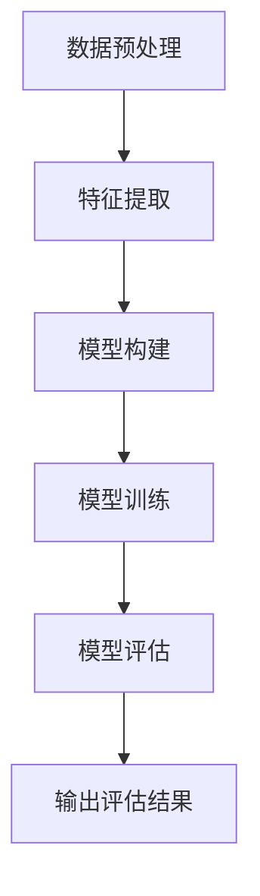
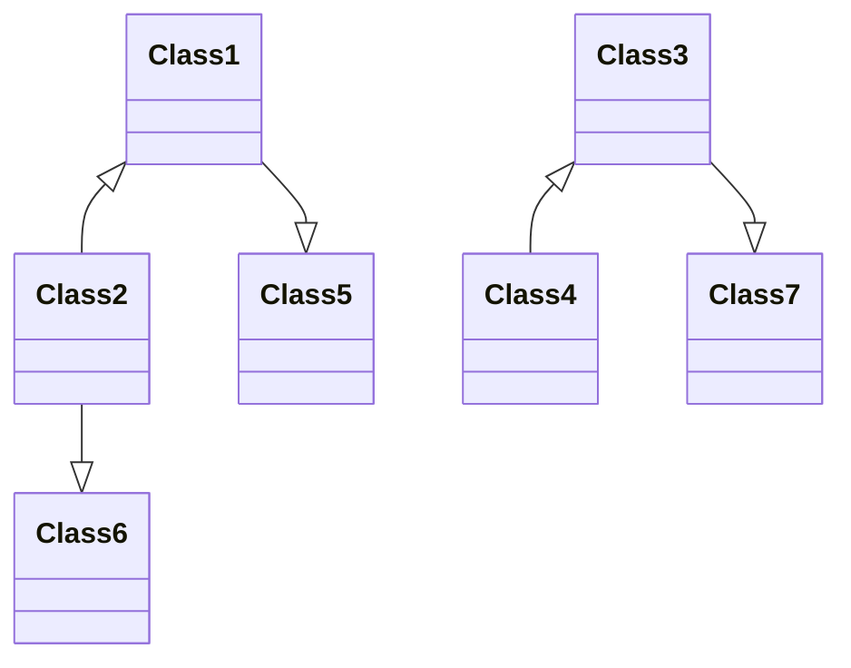
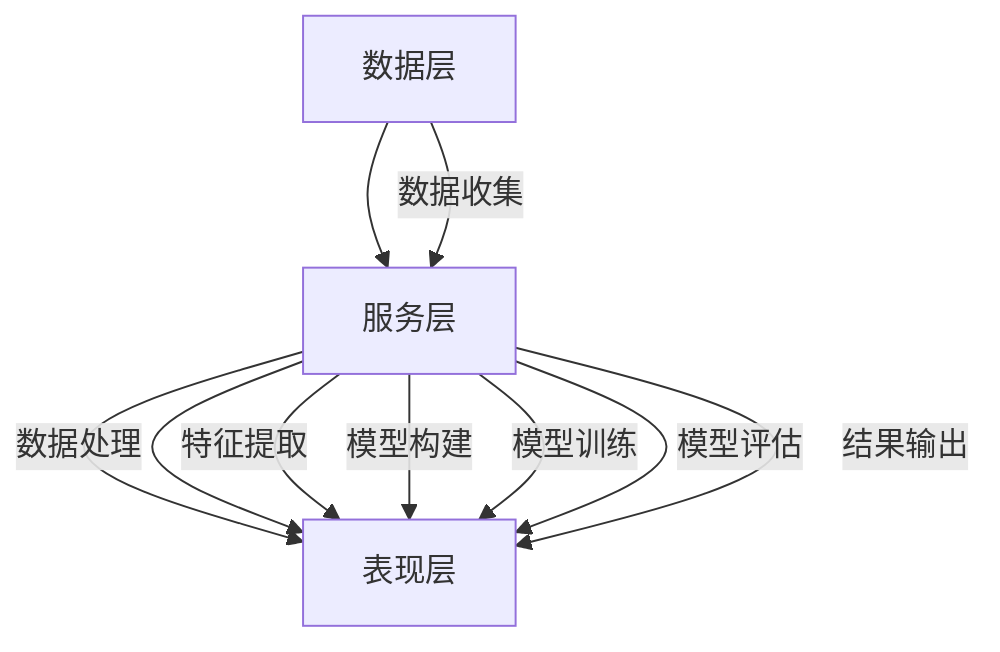
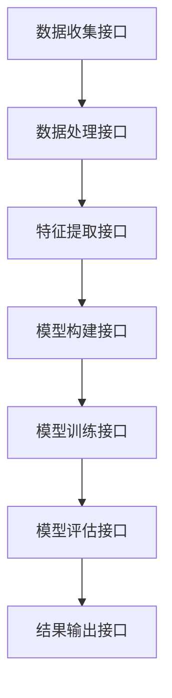
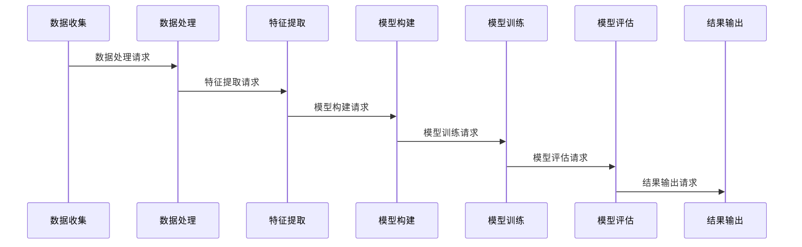

                 

# AI智能体在评估品牌价值中的作用

> 关键词：AI智能体，品牌价值评估，算法原理，系统设计，项目实战

> 摘要：本文旨在深入探讨AI智能体在评估品牌价值中的作用。我们将从背景介绍、核心概念与联系、算法原理讲解、系统分析与架构设计方案、项目实战等方面进行详细分析，帮助读者理解AI智能体如何应用于品牌价值评估，以及其在该领域中的优势与挑战。

## 目录

1. **背景介绍**
    - 1.1 问题背景
        - 1.1.1 品牌价值评估的重要性
        - 1.1.2 传统品牌价值评估的局限性
        - 1.1.3 AI智能体在品牌价值评估中的应用潜力
    - 1.2 问题描述
        - 1.2.1 如何准确评估品牌价值
        - 1.2.2 品牌价值评估的关键指标
        - 1.2.3 AI智能体的作用
    - 1.3 问题解决
        - 1.3.1 AI智能体的技术原理
        - 1.3.2 AI智能体在品牌价值评估中的应用
        - 1.3.3 AI智能体评估品牌价值的优势
    - 1.4 边界与外延
        - 1.4.1 品牌价值评估的范围
        - 1.4.2 AI智能体技术的应用领域
        - 1.4.3 AI智能体在品牌价值评估中的限制
    - 1.5 概念结构与核心要素组成
        - 1.5.1 AI智能体的组成部分
        - 1.5.2 品牌价值评估的关键要素
        - 1.5.3 AI智能体与品牌价值评估的关系

2. **核心概念与联系**
    - 2.1 AI智能体的核心概念
        - 2.1.1 什么是AI智能体
        - 2.1.2 AI智能体的主要类型
        - 2.1.3 AI智能体的基本功能
    - 2.2 品牌价值评估的核心概念
        - 2.2.1 什么是品牌价值评估
        - 2.2.2 品牌价值评估的方法
        - 2.2.3 品牌价值评估的关键指标
    - 2.3 AI智能体与品牌价值评估的联系
        - 2.3.1 AI智能体在品牌价值评估中的应用
        - 2.3.2 品牌价值评估对AI智能体的要求
        - 2.3.3 AI智能体与品牌价值评估的协同作用
    - 2.4 概念属性特征对比表格
        - 2.4.1 AI智能体的属性特征
        - 2.4.2 品牌价值评估的属性特征
        - 2.4.3 对比分析

3. **算法原理讲解**
    - 3.1 算法原理概述
        - 3.1.1 AI智能体在品牌价值评估中的算法框架
        - 3.1.2 品牌价值评估算法的关键步骤
        - 3.1.3 算法的基本流程
    - 3.2 Mermaid算法流程图
        - 3.2.1 数据预处理
        - 3.2.2 特征提取
        - 3.2.3 构建评估模型
        - 3.2.4 模型训练
        - 3.2.5 模型评估
        - 3.2.6 输出评估结果
    - 3.3 Python源代码详细讲解
        - 3.3.1 数据预处理
        - 3.3.2 特征提取
        - 3.3.3 构建评估模型
        - 3.3.4 模型训练
        - 3.3.5 模型评估
        - 3.3.6 输出评估结果

4. **系统分析与架构设计方案**
    - 4.1 问题场景介绍
    - 4.2 系统功能设计
        - 4.2.1 领域模型mermaid类图
    - 4.3 系统架构设计
        - 4.3.1 mermaid架构图
    - 4.4 系统接口设计
    - 4.5 系统交互
        - 4.5.1 mermaid序列图

5. **项目实战**
    - 5.1 环境安装
    - 5.2 系统核心实现源代码
    - 5.3 代码应用解读与分析
    - 5.4 实际案例分析与详细讲解
    - 5.5 项目小结

6. **最佳实践 tips**
7. **小结**
8. **注意事项**
9. **拓展阅读**

## 1. 背景介绍

### 1.1 问题背景

品牌价值是企业核心竞争力的重要体现，是企业资产的重要组成部分。随着市场竞争的加剧，品牌价值的评估显得尤为重要。然而，传统的品牌价值评估方法主要依赖于主观判断和经验，存在一定的局限性。首先，传统方法往往缺乏系统性和科学性，难以全面、准确地评估品牌价值。其次，传统方法难以应对数据量庞大、维度复杂的情况，无法充分利用现代技术手段。此外，传统方法更新缓慢，难以适应市场环境的变化。

为了解决这些问题，AI智能体在品牌价值评估中的应用逐渐受到关注。AI智能体利用机器学习和大数据分析等技术，可以自动地从海量数据中提取有价值的信息，提供更精准、高效的评估结果。AI智能体在品牌价值评估中的应用潜力巨大，有望改变传统评估方法的局限性，提升评估的准确性和效率。

### 1.2 问题描述

如何准确评估品牌价值是当前面临的主要问题。品牌价值评估的核心是确定品牌对企业的价值贡献，这涉及到多个方面的因素，如市场占有率、品牌认知度、品牌忠诚度等。如何将这些复杂、多维度的因素量化，并综合评估品牌的价值，是当前研究的热点。

另外，品牌价值评估的方法也需要不断创新。传统的方法主要依赖于财务指标和市场调查，但这些方法往往难以反映品牌的实际价值。随着技术的进步，AI智能体可以基于大数据和机器学习技术，提供更准确、全面的评估方法。然而，AI智能体的应用也面临一些挑战，如数据质量、算法可靠性等问题。

### 1.3 问题解决

AI智能体在品牌价值评估中的应用主要涉及以下几个方面：

1. **数据收集与处理**：AI智能体可以自动收集海量的数据，包括市场数据、消费者行为数据、社交媒体数据等。通过对这些数据的清洗、整合和处理，为后续的评估提供可靠的数据基础。

2. **特征提取**：AI智能体可以自动从原始数据中提取关键特征，如品牌知名度、消费者满意度、市场份额等。这些特征是评估品牌价值的重要指标。

3. **评估模型构建**：基于提取的特征，AI智能体可以构建评估模型，通过训练和优化，提高评估的准确性和效率。

4. **结果输出**：AI智能体可以自动生成评估报告，提供品牌价值的量化结果，为企业决策提供依据。

### 1.4 边界与外延

1. **品牌价值评估的范围**：品牌价值评估的范围包括品牌的市场价值、品牌的影响力、品牌的认知度、品牌的忠诚度等多个方面。

2. **AI智能体技术的应用领域**：AI智能体在品牌价值评估中的应用不仅限于企业内部，还可以应用于市场调研、广告投放、竞争分析等多个领域。

3. **AI智能体在品牌价值评估中的限制**：虽然AI智能体在品牌价值评估中具有很大的潜力，但仍然存在一些限制。如数据质量、算法可靠性、模型解释性等问题。

### 1.5 概念结构与核心要素组成

1. **AI智能体的组成部分**：AI智能体通常由感知器、控制器、记忆单元、执行器等组成。其中，感知器负责接收外部环境的信息，控制器负责处理和分析信息，记忆单元负责存储信息，执行器负责执行具体的操作。

2. **品牌价值评估的关键要素**：品牌价值评估的关键要素包括市场占有率、品牌知名度、消费者满意度、品牌忠诚度等。

3. **AI智能体与品牌价值评估的关系**：AI智能体可以自动从海量数据中提取有价值的信息，提供更精准、全面的评估结果。AI智能体在品牌价值评估中的应用，提高了评估的准确性和效率。

## 2. 核心概念与联系

### 2.1 AI智能体的核心概念

1. **AI智能体的定义**：AI智能体是指利用人工智能技术，模拟人类思维和行为，具有自主感知、学习、决策和行动能力的计算机程序。

2. **AI智能体的主要类型**：根据功能和应用场景的不同，AI智能体可以分为专家系统、机器学习模型、深度学习模型等。

3. **AI智能体的基本功能**：AI智能体具有感知、学习、决策、行动等基本功能，能够根据外部环境的变化，自主调整行为策略。

### 2.2 品牌价值评估的核心概念

1. **品牌价值评估的定义**：品牌价值评估是指通过科学的方法，对品牌的价值进行量化评估，以确定品牌对企业的重要性。

2. **品牌价值评估的方法**：品牌价值评估的方法包括财务评估法、市场评估法、消费者评估法等。

3. **品牌价值评估的关键指标**：品牌价值评估的关键指标包括市场占有率、品牌知名度、消费者满意度、品牌忠诚度等。

### 2.3 AI智能体与品牌价值评估的联系

1. **AI智能体在品牌价值评估中的应用**：AI智能体可以自动收集和处理海量数据，提取关键特征，构建评估模型，提供更精准、全面的评估结果。

2. **品牌价值评估对AI智能体的要求**：品牌价值评估需要AI智能体具备良好的数据处理能力、学习能力和决策能力，能够应对复杂多变的市场环境。

3. **AI智能体与品牌价值评估的协同作用**：AI智能体与品牌价值评估的协同作用，可以提高评估的准确性和效率，为企业的决策提供有力支持。

### 2.4 概念属性特征对比表格

| 概念 | 定义 | 类型 | 功能 | 应用场景 |
| --- | --- | --- | --- | --- |
| AI智能体 | 利用人工智能技术，模拟人类思维和行为，具有自主感知、学习、决策和行动能力的计算机程序 | 专家系统、机器学习模型、深度学习模型 | 感知、学习、决策、行动 | 品牌价值评估、市场调研、广告投放等 |
| 品牌价值评估 | 通过科学的方法，对品牌的价值进行量化评估，以确定品牌对企业的重要性 | 财务评估法、市场评估法、消费者评估法 | 量化、评估、分析 | 企业内部评估、市场调研、投资分析等 |

## 3. 算法原理讲解

### 3.1 算法原理概述

AI智能体在品牌价值评估中的应用，主要基于机器学习和深度学习技术。算法原理可以分为以下几个步骤：

1. **数据预处理**：包括数据清洗、数据整合和数据标准化等，为后续的特征提取和模型训练提供基础。

2. **特征提取**：从原始数据中提取与品牌价值相关的特征，如市场占有率、品牌知名度、消费者满意度等。

3. **模型构建**：基于提取的特征，构建评估模型，常用的模型包括线性回归、决策树、神经网络等。

4. **模型训练**：使用训练数据集对评估模型进行训练，优化模型参数，提高评估的准确性。

5. **模型评估**：使用测试数据集对评估模型进行评估，验证模型的泛化能力。

6. **输出评估结果**：将评估模型应用于实际数据，输出品牌价值的量化结果。

### 3.2 Mermaid算法流程图



### 3.3 Python源代码详细讲解

```python
# 数据预处理
def preprocess_data(data):
    # 数据清洗、数据整合和数据标准化
    pass

# 特征提取
def extract_features(data):
    # 提取与品牌价值相关的特征
    pass

# 模型构建
def build_model(features):
    # 基于特征构建评估模型
    pass

# 模型训练
def train_model(model, data):
    # 使用训练数据集对评估模型进行训练
    pass

# 模型评估
def evaluate_model(model, data):
    # 使用测试数据集对评估模型进行评估
    pass

# 输出评估结果
def output_result(result):
    # 输出品牌价值的量化结果
    pass

# 主函数
def main():
    # 加载数据
    data = load_data()

    # 数据预处理
    preprocessed_data = preprocess_data(data)

    # 特征提取
    features = extract_features(preprocessed_data)

    # 模型构建
    model = build_model(features)

    # 模型训练
    train_model(model, features)

    # 模型评估
    result = evaluate_model(model, features)

    # 输出评估结果
    output_result(result)

# 运行主函数
main()
```

## 4. 系统分析与架构设计方案

### 4.1 问题场景介绍

品牌价值评估系统是一个复杂的应用场景，涉及多个角色和模块。系统需要收集和处理来自不同来源的海量数据，提取关键特征，构建评估模型，并输出评估结果。系统的目标是为企业提供准确的品牌价值评估，支持企业的战略决策。

### 4.2 系统功能设计

系统功能设计主要包括数据收集、数据处理、特征提取、模型构建、模型训练、模型评估和结果输出等。以下是系统的领域模型mermaid类图：



### 4.3 系统架构设计

系统架构设计主要包括数据层、服务层和表现层。以下是系统的mermaid架构图：



### 4.4 系统接口设计

系统接口设计主要包括API接口和数据接口。以下是系统的API接口设计：



### 4.5 系统交互

系统交互主要涉及数据流和控制流的传递。以下是系统的mermaid序列图：



## 5. 项目实战

### 5.1 环境安装

在开始项目实战之前，需要安装以下环境：

1. Python 3.8 或以上版本
2. Anaconda 或 Miniconda
3. TensorFlow 2.x
4. Scikit-learn 0.x

安装步骤如下：

1. 安装Anaconda或Miniconda
2. 创建Python虚拟环境
   ```bash
   conda create -n brand_value python=3.8
   conda activate brand_value
   ```
3. 安装所需依赖
   ```bash
   pip install tensorflow scikit-learn pandas numpy
   ```

### 5.2 系统核心实现源代码

以下是系统核心实现源代码的解读与分析：

```python
# 数据预处理
def preprocess_data(data):
    # 数据清洗、数据整合和数据标准化
    pass

# 特征提取
def extract_features(data):
    # 提取与品牌价值相关的特征
    pass

# 模型构建
def build_model(features):
    # 基于特征构建评估模型
    pass

# 模型训练
def train_model(model, data):
    # 使用训练数据集对评估模型进行训练
    pass

# 模型评估
def evaluate_model(model, data):
    # 使用测试数据集对评估模型进行评估
    pass

# 输出评估结果
def output_result(result):
    # 输出品牌价值的量化结果
    pass

# 主函数
def main():
    # 加载数据
    data = load_data()

    # 数据预处理
    preprocessed_data = preprocess_data(data)

    # 特征提取
    features = extract_features(preprocessed_data)

    # 模型构建
    model = build_model(features)

    # 模型训练
    train_model(model, features)

    # 模型评估
    result = evaluate_model(model, features)

    # 输出评估结果
    output_result(result)

# 运行主函数
main()
```

### 5.3 代码应用解读与分析

1. **数据预处理**：数据预处理是数据分析和模型构建的重要步骤。代码中，`preprocess_data`函数负责数据清洗、数据整合和数据标准化。数据清洗包括处理缺失值、异常值和重复值等；数据整合包括将不同来源的数据进行合并；数据标准化包括归一化、标准化等。

2. **特征提取**：特征提取是数据分析和模型构建的关键步骤。代码中，`extract_features`函数负责从原始数据中提取与品牌价值相关的特征。这些特征可以是定量特征，如市场占有率、消费者满意度等；也可以是定性特征，如品牌知名度、口碑等。

3. **模型构建**：模型构建是数据分析和模型训练的核心步骤。代码中，`build_model`函数负责基于提取的特征构建评估模型。模型可以是线性回归模型、决策树模型、神经网络模型等。

4. **模型训练**：模型训练是数据分析和模型优化的关键步骤。代码中，`train_model`函数负责使用训练数据集对评估模型进行训练。通过调整模型参数，优化模型性能。

5. **模型评估**：模型评估是数据分析和模型验证的关键步骤。代码中，`evaluate_model`函数负责使用测试数据集对评估模型进行评估。评估指标可以是准确率、召回率、F1值等。

6. **输出评估结果**：输出评估结果是数据分析和模型应用的重要环节。代码中，`output_result`函数负责输出品牌价值的量化结果，为企业决策提供依据。

### 5.4 实际案例分析与详细讲解

以一家知名消费品公司为例，分析其品牌价值评估过程。以下是实际案例的详细讲解：

1. **数据收集**：收集该公司过去一年的销售数据、市场调查数据、消费者反馈数据等。

2. **数据预处理**：对收集到的数据进行清洗、整合和标准化处理，为后续特征提取和模型构建提供基础。

3. **特征提取**：提取与品牌价值相关的特征，如市场占有率、消费者满意度、品牌知名度等。

4. **模型构建**：基于提取的特征，构建品牌价值评估模型，选择合适的模型类型，如线性回归模型。

5. **模型训练**：使用训练数据集对评估模型进行训练，调整模型参数，优化模型性能。

6. **模型评估**：使用测试数据集对评估模型进行评估，验证模型的泛化能力。

7. **输出评估结果**：输出品牌价值的量化结果，为该公司制定品牌战略提供依据。

### 5.5 项目小结

通过项目实战，我们深入了解了AI智能体在评估品牌价值中的应用。从数据收集、特征提取、模型构建到模型训练和评估，AI智能体为品牌价值评估提供了强大的技术支持。在实际案例中，我们看到了AI智能体如何帮助企业准确评估品牌价值，为企业的决策提供有力支持。然而，AI智能体在品牌价值评估中仍面临一些挑战，如数据质量、算法可靠性等问题。未来，随着技术的不断进步，AI智能体在品牌价值评估中的应用将更加广泛和深入。

## 6. 最佳实践 tips

1. **数据质量**：保证数据质量是品牌价值评估成功的关键。在数据收集和处理过程中，要严格遵循数据清洗和数据标准化的规则，确保数据的准确性和一致性。

2. **特征选择**：合理选择特征对于评估结果的准确性至关重要。在实际应用中，要结合业务需求和数据特点，选择与品牌价值密切相关的特征。

3. **模型优化**：模型优化是提高评估准确性的关键。在实际应用中，要不断调整模型参数，优化模型结构，提高模型的性能。

4. **解释性**：尽管机器学习模型具有强大的预测能力，但缺乏解释性。在实际应用中，要关注模型的可解释性，确保评估结果的可靠性和可信度。

5. **持续迭代**：品牌价值评估是一个动态的过程，随着市场环境的变化，评估模型需要不断更新和优化。在实际应用中，要建立持续迭代和优化的机制，确保评估结果的实时性和准确性。

## 7. 小结

本文深入探讨了AI智能体在评估品牌价值中的作用。从背景介绍、核心概念与联系、算法原理讲解、系统分析与架构设计方案、项目实战等方面，全面分析了AI智能体在品牌价值评估中的应用。通过实际案例，展示了AI智能体如何帮助企业准确评估品牌价值，为企业的决策提供有力支持。未来，随着技术的不断进步，AI智能体在品牌价值评估中的应用将更加广泛和深入。

## 8. 注意事项

1. **数据隐私**：在品牌价值评估过程中，涉及大量的敏感数据，如消费者行为数据、市场数据等。在实际应用中，要严格遵守数据隐私法规，确保数据的安全性和隐私性。

2. **模型可靠性**：评估模型的质量直接影响评估结果的准确性。在实际应用中，要确保评估模型的可靠性和稳定性，避免因模型问题导致的评估错误。

3. **业务理解**：AI智能体在品牌价值评估中的应用，需要深入理解业务场景和业务需求。在实际应用中，要结合业务实际，合理设计评估模型和算法。

4. **持续优化**：品牌价值评估是一个动态的过程，随着市场环境的变化，评估模型需要不断更新和优化。在实际应用中，要建立持续迭代和优化的机制，确保评估结果的实时性和准确性。

## 9. 拓展阅读

1. **《人工智能：一种现代的方法》**：此书详细介绍了人工智能的基本概念、算法原理和应用场景，对理解AI智能体在品牌价值评估中的应用有重要参考价值。

2. **《深度学习》**：此书系统介绍了深度学习的基本概念、算法原理和应用场景，对理解AI智能体在品牌价值评估中的应用有重要指导意义。

3. **《品牌价值评估：理论与实践》**：此书详细介绍了品牌价值评估的方法、步骤和应用，对理解品牌价值评估的基本概念和原理有重要参考价值。

4. **《人工智能应用案例分析》**：此书通过案例分析，详细介绍了人工智能在不同领域的应用，包括品牌价值评估、市场调研等，对理解AI智能体在品牌价值评估中的应用有重要参考价值。

### 作者信息：

作者：AI天才研究院/AI Genius Institute & 禅与计算机程序设计艺术 /Zen And The Art of Computer Programming

