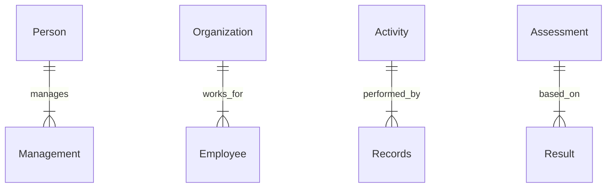

                 

### 《AI智能体在评估管理层诚信度中的作用》

#### 关键词：
- AI智能体
- 诚信评估
- 管理层
- 数据分析
- 深度学习

#### 摘要：
本文深入探讨了AI智能体在评估管理层诚信度方面的应用。首先，我们回顾了诚信评估的背景和重要性，随后介绍了AI智能体的基本概念及其在企业管理中的应用。接着，我们分析了诚信评估中的关键问题和挑战，并探讨了AI智能体在其中的优势与局限性。本文随后详细介绍了AI智能体的技术基础，包括机器学习、自然语言处理、数据挖掘和强化学习等核心技术。随后，我们讨论了诚信评估的核心概念及其与AI智能体的联系。接着，本文从数据收集与预处理、模型设计与训练、评估结果分析与解读等方面详细阐述了AI智能体在诚信评估中的应用原理。最后，我们通过几个实际案例，展示了AI智能体在管理层诚信度评估中的具体应用，并总结了一些最佳实践。

### 第一部分：背景介绍与核心概念

#### 第1章：诚信评估的背景与重要性

诚信是商业和社会生活中不可或缺的元素，尤其在企业管理中发挥着至关重要的作用。然而，诚信的评估却是一个复杂且具有挑战性的任务。传统的方法通常依赖于问卷调查、访谈和专家判断等手段，但这些方法存在诸多局限性，如主观性较强、效率低下等。

随着人工智能技术的快速发展，AI智能体成为了一种新的评估工具。AI智能体能够通过大数据分析、机器学习和自然语言处理等技术，提供更加客观、准确和高效的诚信评估结果。这不仅可以提升企业的管理水平，还能在金融、公共部门等领域发挥重要作用。

#### 1.1 诚信评估的意义

诚信评估对于企业管理具有重要意义。首先，诚信是企业生存和发展的基石。只有建立和维护良好的诚信，企业才能赢得客户的信任，从而实现长期稳定的发展。其次，诚信评估有助于发现和管理潜在的风险。通过评估管理层的诚信度，企业可以提前发现潜在的不诚信行为，从而采取措施进行预防和控制。

此外，诚信评估还有助于提升企业的品牌形象。在当今竞争激烈的市场环境中，企业的品牌形象对于吸引投资者、客户和合作伙伴至关重要。通过诚信评估，企业可以证明其管理层的诚信，从而增强市场竞争力。

#### 1.2 诚信缺失的危害与影响

诚信缺失会对企业和社会带来诸多危害和影响。首先，诚信缺失会导致企业的声誉受损，进而影响其市场竞争力。客户和投资者会对不诚信的企业失去信任，导致业务流失和投资减少。其次，诚信缺失还可能引发法律纠纷和诉讼，增加企业的法律风险和成本。

在社会层面，诚信缺失会破坏社会的信任基础，导致社会矛盾和冲突加剧。例如，金融领域的诚信问题可能导致金融危机，影响社会的稳定和发展。因此，诚信评估不仅对企业管理具有重要意义，也对整个社会的发展产生深远影响。

#### 1.3 诚信评估的市场需求

随着企业对诚信评估需求的增加，市场对相关技术和工具的需求也在不断增长。传统的诚信评估方法已无法满足企业对高效、准确和全面评估的需求。AI智能体的出现，为诚信评估提供了一种全新的解决方案。

首先，AI智能体能够处理海量数据，快速发现潜在的不诚信行为。传统的诚信评估方法通常依赖于少量的样本数据，而AI智能体能够处理大量的历史数据，从而提供更加全面和准确的评估结果。

其次，AI智能体具有高效的处理能力。通过自动化和智能化的技术，AI智能体能够大幅提高评估的效率，减轻企业的工作负担。这不仅有助于提升企业的管理水平，还能降低评估成本。

此外，AI智能体在评估过程中具有客观性和公正性。传统的诚信评估方法往往受到主观因素的影响，而AI智能体能够通过算法和模型消除主观偏见，提供客观、公正的评估结果。

综上所述，AI智能体在诚信评估方面具有显著的优势和广阔的市场需求。随着人工智能技术的不断发展，AI智能体在诚信评估中的应用将越来越广泛，为企业管理和社会发展提供强有力的支持。

#### 1.4 AI智能体的定义与功能

AI智能体（Artificial Intelligence Agent）是指具有智能行为能力的计算机程序，能够自主地感知环境、决策和执行任务。AI智能体通常由多个组件组成，包括感知模块、决策模块和执行模块。

感知模块负责收集和解析环境中的信息，如文本、图像、声音等。决策模块根据感知模块收集到的信息，利用机器学习和深度学习算法进行分析和推理，生成决策结果。执行模块则根据决策结果，执行相应的任务或操作。

AI智能体在企业管理中的应用非常广泛。首先，AI智能体可以用于数据分析，通过处理海量数据，为企业提供有价值的信息和洞察。其次，AI智能体可以用于自动化流程，如审批、报告生成等，提高工作效率。此外，AI智能体还可以用于风险管理，通过实时监测和预警，提前发现潜在的风险，帮助企业降低风险损失。

与传统管理手段相比，AI智能体具有多个显著优势。首先，AI智能体具有高效的处理能力，能够快速处理和分析大量数据，提供实时、准确的决策支持。其次，AI智能体具有客观性和公正性，能够消除主观偏见，提供客观、公正的评估结果。最后，AI智能体具有自适应能力，能够根据环境变化和反馈信息，不断优化和调整自身的行为。

#### 1.5 诚信评估中的关键问题与挑战

在诚信评估过程中，AI智能体面临诸多关键问题和挑战。首先，数据来源和处理是一个重要问题。诚信评估需要大量的数据支持，包括企业历史记录、员工行为数据、市场信息等。然而，这些数据往往存在不完整、不准确、不一致等问题，给数据预处理和挖掘带来了很大挑战。

其次，评估方法的多样性与交叉验证也是一个重要问题。诚信评估需要考虑多个维度和标准，如道德标准、法律法规、行业标准等。不同的评估方法可能得出不同的结论，如何选择和组合不同的评估方法，以提高评估的准确性和可靠性，是一个关键问题。

另外，评估结果的准确性与可靠性也是一个挑战。AI智能体虽然能够处理海量数据，但评估结果的准确性和可靠性仍然受到算法、数据质量和模型训练等因素的影响。如何确保评估结果的准确性和可靠性，是诚信评估中需要重点关注的问题。

#### 1.6 AI智能体在诚信评估中的优势与局限性

AI智能体在诚信评估中具有显著的优势，但也存在一些局限性。

优势方面，AI智能体具有高效的数据处理能力，能够快速分析和处理大量数据，提供实时、准确的评估结果。此外，AI智能体具有客观性和公正性，能够消除主观偏见，提供客观、公正的评估结果。最后，AI智能体具有自适应能力，能够根据环境变化和反馈信息，不断优化和调整自身的行为，提高评估的准确性和可靠性。

然而，AI智能体也存在一些局限性。首先，AI智能体依赖于大量高质量的数据，数据质量对评估结果的影响至关重要。其次，AI智能体的评估结果受到算法和模型的影响，需要不断优化和调整。此外，AI智能体在处理复杂问题和情境时，可能存在局限性，需要与其他评估方法相结合，以提高评估的准确性和可靠性。

为了克服这些局限性，可以采取以下策略：首先，确保数据质量，对数据来源和处理进行严格控制和筛选。其次，结合多种评估方法，进行交叉验证，以提高评估的准确性和可靠性。此外，不断优化和调整算法和模型，提高AI智能体的适应能力。

#### 1.7 本章小结

本章介绍了诚信评估的背景、重要性和关键问题，以及AI智能体的定义和功能。我们探讨了AI智能体在诚信评估中的优势与局限性，并提出了相应的策略。在下一章中，我们将详细讨论AI智能体的技术基础，包括机器学习、自然语言处理、数据挖掘和强化学习等核心技术。

### 第二部分：AI智能体的技术基础

#### 第2章：AI智能体的核心技术

AI智能体的核心技术包括机器学习、自然语言处理、数据挖掘和强化学习等。这些技术为AI智能体提供了强大的数据处理和分析能力，使其能够在各种复杂应用场景中发挥作用。在本章中，我们将详细探讨这些核心技术的原理和应用，并分析它们在诚信评估中的应用价值。

#### 2.1 机器学习与深度学习基础

机器学习（Machine Learning）是AI智能体的核心技术之一，它使计算机系统能够从数据中学习并做出决策。机器学习可以分为监督学习、无监督学习和强化学习三种类型。

监督学习（Supervised Learning）是最常见的机器学习方法，它通过已标记的数据集训练模型，从而能够对新的数据进行预测。监督学习的关键在于选择合适的特征和模型，以提高预测的准确性和泛化能力。

深度学习（Deep Learning）是机器学习的一种特殊形式，它利用多层神经网络对数据进行建模和预测。深度学习在图像识别、自然语言处理和语音识别等领域取得了显著的成果。深度学习的核心是神经网络的架构和参数优化，包括卷积神经网络（CNN）、循环神经网络（RNN）和生成对抗网络（GAN）等。

在诚信评估中，机器学习和深度学习可以用于分析和管理大量的企业数据。例如，通过监督学习，可以建立模型来预测管理层的不诚信行为，从而提前采取预防措施。通过深度学习，可以识别和分析企业中的异常行为模式，为诚信评估提供更有价值的洞察。

#### 2.2 自然语言处理技术

自然语言处理（Natural Language Processing，NLP）是AI智能体的另一个核心技术，它使计算机能够理解和处理人类语言。NLP的主要任务包括文本分类、情感分析、命名实体识别和机器翻译等。

NLP在诚信评估中具有广泛的应用。首先，NLP可以用于分析管理层在公开场合的讲话、报告和邮件，从中提取关键信息，评估其诚信度。其次，NLP可以用于处理客户投诉和反馈，发现潜在的不满和不诚信行为。此外，NLP还可以用于构建问答系统，为管理层提供实时、准确的诚信评估建议。

常见的NLP模型和工具包括词袋模型（Bag of Words，BoW）、循环神经网络（RNN）和Transformer模型等。这些模型和工具在诚信评估中的应用，可以提高评估的准确性和效率。

#### 2.3 数据挖掘与知识发现

数据挖掘（Data Mining）是AI智能体的另一个核心技术，它通过发现数据中的隐藏模式和关系，为企业管理提供有价值的洞察。数据挖掘的主要任务包括分类、聚类、关联规则挖掘和异常检测等。

在诚信评估中，数据挖掘可以用于分析大量的企业数据，识别潜在的不诚信行为。例如，通过分类和聚类算法，可以识别和管理具有高风险的管理层。通过关联规则挖掘，可以发现管理层的不诚信行为与其他因素之间的关联，从而提供更全面的评估。

知识发现（Knowledge Discovery）是数据挖掘的一个分支，它通过从数据中提取和管理知识，为企业管理提供决策支持。知识发现的方法包括数据可视化、数据仓库和知识库等。

在诚信评估中，知识发现可以帮助企业建立和管理诚信评估的知识库，为管理层提供决策支持。例如，通过数据可视化，可以直观地展示管理层的不诚信行为和风险水平，帮助管理层采取相应的措施。

#### 2.4 强化学习与自适应学习

强化学习（Reinforcement Learning）是一种通过试错和奖励机制来学习行为的机器学习方法。强化学习适用于复杂和动态环境，能够在不断变化的环境中学习最优策略。

在诚信评估中，强化学习可以用于训练AI智能体，使其能够根据反馈信息不断优化评估策略。例如，通过强化学习，可以训练AI智能体识别和管理高风险的管理层，从而提高评估的准确性和效率。

自适应学习（Adaptive Learning）是一种根据环境变化和学习效果自动调整学习策略的方法。自适应学习可以帮助AI智能体在不断变化的环境中保持高效的学习能力。

在诚信评估中，自适应学习可以帮助AI智能体根据评估结果和环境变化，自动调整评估策略和参数，提高评估的准确性和可靠性。例如，当AI智能体发现某些评估方法不够准确时，可以自动调整模型参数，提高评估的精度。

#### 2.5 AI智能体的架构设计与实现

AI智能体的架构设计需要考虑多个方面，包括感知模块、决策模块和执行模块等。

感知模块负责收集和分析环境中的数据，如文本、图像和声音等。感知模块通常包括数据采集、预处理和特征提取等步骤。数据采集可以从企业内部数据库、外部数据源和社交媒体等渠道获取。数据预处理包括数据清洗、数据转换和数据归一化等。特征提取是将原始数据转换为适合机器学习算法的输入特征。

决策模块负责根据感知模块收集到的数据，利用机器学习和深度学习算法进行分析和推理，生成决策结果。决策模块的核心是机器学习模型的选择和训练。常见的机器学习模型包括线性回归、决策树、支持向量机和神经网络等。决策模块还需要考虑模型参数的调优和评估，以提高决策的准确性和效率。

执行模块负责根据决策模块生成的决策结果，执行相应的任务或操作。执行模块通常包括自动化流程和接口集成等。自动化流程可以用于审批、报告生成和风险预警等。接口集成可以将AI智能体与其他系统进行无缝集成，实现数据共享和协同工作。

实现AI智能体的关键步骤包括：

1. **需求分析**：明确AI智能体的目标和应用场景，确定所需的数据、功能和性能要求。
2. **数据采集与预处理**：根据需求分析，采集和预处理数据，确保数据的质量和一致性。
3. **模型选择与训练**：选择适合的机器学习模型，根据训练数据训练模型，并调整模型参数，以提高模型的性能。
4. **系统集成与测试**：将AI智能体集成到企业系统中，进行功能测试和性能评估，确保系统的稳定性和可靠性。
5. **部署与应用**：将AI智能体部署到生产环境，实现实时、自动的诚信评估。

#### 2.6 本章小结

本章详细介绍了AI智能体的核心技术，包括机器学习、自然语言处理、数据挖掘、强化学习和自适应学习等。这些技术为AI智能体提供了强大的数据处理和分析能力，使其在诚信评估中发挥重要作用。在下一章中，我们将探讨诚信评估的核心概念及其与AI智能体的联系。

### 第3章：诚信评估的核心概念与联系

#### 3.1 诚信评估的核心概念

诚信评估涉及多个核心概念，包括诚信的定义、诚信评估的标准和维度、诚信评估的目标和任务等。

首先，诚信（Integrity）是指一个人或组织在行为和决策过程中所遵循的道德和伦理原则。诚信通常包括正直、诚实、守信和责任等方面。在企业管理中，诚信是确保企业长期稳定发展的重要基石。

其次，诚信评估（Integrity Assessment）是指通过一定方法和标准，对个人或组织的诚信水平进行评估和判断的过程。诚信评估的标准和维度是评估过程中需要考虑的重要因素。常见的评估标准包括道德标准、法律法规、行业标准等。评估维度包括诚信行为的频率、严重程度和影响等。

诚信评估的目标是识别和管理潜在的不诚信行为，确保企业的诚信水平。诚信评估的任务包括评估标准的制定、评估方法的开发、评估结果的解读和应用等。

#### 3.2 诚信评估的属性特征对比表格

在诚信评估中，不同的评估标准和方法具有不同的属性特征。以下是一个诚信评估属性特征对比表格，用于展示不同评估标准的优缺点：

| 评估标准 | 优缺点                           | 适用场景                           |
|----------|--------------------------------|-----------------------------------|
| 道德标准 | 强调伦理原则，具有普适性         | 用于评估企业的道德行为和决策       |
| 法律法规 | 强制性高，有明确的法律依据       | 用于评估企业是否符合相关法律法规   |
| 行业标准 | 行业内部认可，具有一定的权威性   | 用于评估企业是否符合行业标准       |
| 内部标准 | 由企业自行制定，灵活性较高       | 用于评估企业内部的诚信行为和规范   |
| 社会标准 | 反映社会对企业的期望和认可       | 用于评估企业在社会中的形象和声誉   |
| 数据分析 | 利用数据分析技术，提供量化评估结果 | 用于评估企业的诚信行为和风险水平   |

通过对比不同评估标准的优缺点，企业可以根据自身的需求和实际情况，选择合适的评估标准和方法。

#### 3.3 诚信评估方法的优缺点

诚信评估方法的选择对评估结果和过程具有重要影响。以下是一些常见诚信评估方法的优缺点：

1. **问卷调查法**：
   - 优点：操作简便，可以收集大量样本数据，适用于大范围的诚信评估。
   - 缺点：受主观因素影响较大，评估结果可能存在偏差。

2. **行为观察法**：
   - 优点：直接观察和管理层的实际行为，评估结果较为客观。
   - 缺点：评估范围有限，难以全面覆盖所有管理层的诚信行为。

3. **档案审查法**：
   - 优点：通过审查企业的历史记录和档案，可以提供详细和全面的评估结果。
   - 缺点：需要大量人力和时间，评估效率较低。

4. **专家评估法**：
   - 优点：专家具有较高的专业素养和判断能力，评估结果具有较高的可信度。
   - 缺点：受主观因素影响较大，评估结果可能存在偏见。

5. **大数据分析法**：
   - 优点：利用大数据技术，可以处理和分析海量数据，提供全面和准确的评估结果。
   - 缺点：对数据质量和分析方法要求较高，可能存在数据隐私和安全问题。

通过分析不同诚信评估方法的优缺点，企业可以结合自身需求，选择合适的评估方法，以提高评估的准确性和可靠性。

#### 3.4 诚信评估中的ER实体关系图架构

在诚信评估中，实体关系图（Entity-Relationship Diagram，ER图）是一种常用的数据建模工具，用于表示评估过程中涉及的实体及其关系。以下是一个简化的ER图，用于描述诚信评估中的主要实体和关系：

在上面的ER图中，主要实体包括：

- **Person**：表示个人，包括管理层和员工。
- **Management**：表示管理层，与Person实体关联，表示管理层对员工的监管关系。
- **Organization**：表示企业组织，与Employee实体关联，表示员工在企业中的工作关系。
- **Activity**：表示企业活动，与Records实体关联，表示活动产生的记录。
- **Assessment**：表示评估，与Result实体关联，表示评估结果。

实体之间的关系包括：

- **Person与Management**：表示管理层对员工的监管关系。
- **Organization与Employee**：表示员工与企业的工作关系。
- **Activity与Records**：表示活动产生的记录。
- **Assessment与Result**：表示评估结果。

通过ER图，可以直观地了解诚信评估中的实体及其关系，为数据建模和系统设计提供基础。

#### 3.5 AI智能体与诚信评估的关系

AI智能体在诚信评估中发挥着关键作用，其角色主要包括数据收集与处理、模型训练与优化、结果分析与解读等。

首先，AI智能体可以通过大数据分析技术，收集和管理大量的企业数据，包括员工行为数据、企业历史记录、市场信息等。这些数据为诚信评估提供了丰富的信息来源，使评估结果更加全面和准确。

其次，AI智能体可以利用机器学习、深度学习和自然语言处理等技术，对收集到的数据进行分析和建模。通过训练和优化模型，AI智能体可以识别和管理潜在的不诚信行为，提供实时、准确的评估结果。

此外，AI智能体还可以用于评估结果的分析与解读。通过可视化技术和数据分析方法，AI智能体可以直观地展示评估结果，帮助管理层理解评估结果和改进措施。

总的来说，AI智能体在诚信评估中扮演着数据收集者、模型训练师和结果解读者的角色，其强大的数据处理和分析能力，为诚信评估提供了新的思路和方法。

#### 3.6 AI智能体与人类专家的协同作用

AI智能体在诚信评估中不仅可以独立完成评估任务，还可以与人类专家进行协同工作，发挥更大的作用。

首先，AI智能体可以处理和分析海量数据，提供快速、准确的评估结果。而人类专家则可以对这些结果进行深入分析和解读，发现潜在的问题和异常情况。

其次，AI智能体可以帮助人类专家识别和管理不诚信行为，提高评估的准确性和效率。通过机器学习和深度学习技术，AI智能体可以不断优化评估模型，提高评估的精度和可靠性。

此外，AI智能体还可以为人类专家提供决策支持。通过数据分析和技术手段，AI智能体可以为管理层提供有价值的建议和策略，帮助其制定和实施有效的诚信管理措施。

总的来说，AI智能体与人类专家的协同作用，可以充分发挥各自的特长，提高诚信评估的准确性和效率，为企业的长期发展提供有力支持。

#### 3.7 AI智能体在诚信评估中的价值

AI智能体在诚信评估中的价值体现在多个方面：

首先，AI智能体能够处理海量数据，提供实时、准确的评估结果，使企业能够快速识别和管理潜在的不诚信行为，降低风险。

其次，AI智能体具有客观性和公正性，能够消除主观偏见，提供客观、公正的评估结果，增强评估的可靠性和可信度。

此外，AI智能体可以为企业提供决策支持，通过数据分析和技术手段，为管理层提供有价值的建议和策略，帮助企业制定和实施有效的诚信管理措施。

最后，AI智能体可以帮助企业建立和优化诚信评估体系，提高企业的管理水平，增强市场竞争力。

总的来说，AI智能体在诚信评估中具有重要的应用价值，为企业的长期发展提供了有力支持。

#### 3.8 本章小结

本章详细介绍了诚信评估的核心概念、不同评估方法的优缺点、诚信评估中的ER实体关系图架构以及AI智能体在诚信评估中的角色和价值。在下一章中，我们将深入探讨AI智能体在诚信评估中的应用原理。

### 第三部分：AI智能体在诚信评估中的应用原理

#### 第4章：AI智能体在诚信评估中的应用原理

在了解了AI智能体的基本概念和技术基础之后，我们将深入探讨其在诚信评估中的具体应用原理。AI智能体在诚信评估中的应用涉及数据收集与预处理、模型设计与训练、评估结果分析与解读等多个方面。

#### 4.1 数据收集与预处理

数据收集与预处理是AI智能体在诚信评估中应用的基础。诚信评估需要大量的数据，包括企业历史记录、员工行为数据、市场信息等。数据收集的方法和来源有多种，如企业内部数据库、外部数据源和社交媒体等。

首先，数据收集需要考虑数据的多样性和质量。不同的数据源可能包含不同的数据格式和结构，需要进行统一的数据格式化处理。此外，数据质量对评估结果具有重要影响，需要确保数据的一致性、完整性和准确性。

数据预处理主要包括数据清洗、数据转换和数据归一化等步骤。数据清洗是指去除重复数据、缺失数据和错误数据，提高数据质量。数据转换是将不同数据源的数据格式转换为统一的格式，以便进行后续处理。数据归一化是指将不同量纲的数据转换为同一量纲，以便进行比较和分析。

#### 4.2 模型设计与训练

在数据预处理完成后，AI智能体需要设计并训练合适的模型，用于诚信评估。模型设计是AI智能体在诚信评估中的核心环节，需要考虑评估目标和任务。

首先，需要选择适合的机器学习模型。常见的模型包括线性回归、决策树、支持向量机和神经网络等。不同的模型适用于不同的评估任务和数据类型，需要根据实际情况进行选择。

其次，模型训练是AI智能体在诚信评估中的关键步骤。通过训练数据集，AI智能体可以学习如何识别和管理不诚信行为。模型训练过程包括数据划分、参数优化和模型评估等步骤。

数据划分是将数据集划分为训练集和测试集。训练集用于训练模型，测试集用于评估模型的性能。参数优化是指通过调整模型参数，提高模型的准确性和泛化能力。模型评估是评估模型性能的重要手段，常用的评估指标包括准确率、召回率、F1值等。

#### 4.3 评估结果分析与解读

在模型训练完成后，AI智能体会生成评估结果。评估结果的分析与解读是AI智能体在诚信评估中的关键步骤，需要将评估结果转化为管理层可以理解和应用的信息。

首先，需要将评估结果进行可视化处理。可视化技术可以直观地展示评估结果，帮助管理层了解评估结果和趋势。常见的可视化方法包括折线图、柱状图、饼图等。

其次，需要对评估结果进行可靠性评估。评估结果的可靠性受多种因素影响，如数据质量、模型选择和训练等。需要对评估结果进行统计分析和交叉验证，确保评估结果的准确性和可靠性。

最后，需要对评估结果进行解读和应用。管理层可以根据评估结果，识别潜在的不诚信行为和管理漏洞，采取相应的措施进行改进和优化。例如，对于评估结果显示高风险的管理层，可以加强监督和审计，降低风险。

#### 4.4 AI智能体在诚信评估中的应用案例

为了更好地理解AI智能体在诚信评估中的应用，我们可以通过几个实际案例进行分析。

##### 案例一：企业诚信评估系统的设计与实现

某企业为了提升管理水平，决定开发一套诚信评估系统。该系统基于AI智能体技术，通过数据收集、模型设计和结果分析等多个环节，实现对管理层诚信度的评估。

首先，企业通过内部数据库和外部数据源收集管理层的历史行为数据、市场信息等。然后，利用机器学习算法对数据进行处理和分析，训练诚信评估模型。最后，系统将评估结果可视化，并提供详细的解读和建议。

通过该系统，企业可以实时监测和管理管理层的诚信度，发现潜在的不诚信行为，采取相应的措施进行预防和控制。

##### 案例二：金融机构管理层诚信度评估

某金融机构为了提升内部管理水平，决定对管理层进行诚信度评估。该评估系统基于AI智能体技术，通过文本分析、行为监测和数据挖掘等方法，实现对管理层诚信度的评估。

首先，系统收集管理层的公开讲话、报告、邮件等文本数据，利用自然语言处理技术提取关键信息。然后，利用数据挖掘技术分析管理层的言行和行为模式，评估其诚信度。最后，系统将评估结果可视化，并提供详细的解读和建议。

通过该评估系统，金融机构可以识别和管理具有高风险的管理层，采取相应的措施进行预防和控制，提高内部管理水平。

##### 案例三：公共部门领导诚信评估

某公共部门为了提升领导层的诚信度，决定引入AI智能体进行诚信评估。该评估系统基于大数据分析和机器学习技术，通过数据收集、模型设计和结果分析等多个环节，实现对领导层诚信度的评估。

首先，系统收集领导层的历史行为数据、公共舆论等数据。然后，利用机器学习算法对数据进行处理和分析，训练诚信评估模型。最后，系统将评估结果可视化，并提供详细的解读和建议。

通过该评估系统，公共部门可以实时监测和管理领导层的诚信度，发现潜在的不诚信行为，采取相应的措施进行预防和控制，提高公共服务的质量。

#### 4.5 本章小结

本章详细介绍了AI智能体在诚信评估中的应用原理，包括数据收集与预处理、模型设计与训练、评估结果分析与解读等。通过实际案例，我们展示了AI智能体在诚信评估中的应用，并分析了其优势和挑战。在下一章中，我们将总结AI智能体在诚信评估中的应用经验和最佳实践。

### 第四部分：总结与展望

#### 4.6 AI智能体在诚信评估中的应用总结

AI智能体在诚信评估中发挥了重要作用，其强大的数据处理和分析能力为企业管理提供了新的解决方案。通过大数据分析、机器学习和自然语言处理等核心技术，AI智能体能够快速识别和管理不诚信行为，提供实时、准确的评估结果。

首先，AI智能体在数据收集与预处理方面具有显著优势，能够处理海量数据，提高数据质量和一致性。其次，在模型设计和训练方面，AI智能体利用先进的机器学习算法和深度学习技术，实现高效、准确的评估。此外，AI智能体在结果分析与解读方面，通过可视化技术和数据分析方法，为管理层提供了有价值的决策支持。

然而，AI智能体在诚信评估中也面临一些挑战。数据质量和算法选择对评估结果具有重要影响，需要确保数据的质量和算法的优化。此外，AI智能体在处理复杂问题和情境时，可能存在局限性，需要与其他评估方法相结合，以提高评估的准确性和可靠性。

#### 4.7 AI智能体在诚信评估中的应用前景

随着人工智能技术的不断进步，AI智能体在诚信评估中的应用前景十分广阔。未来，AI智能体将可能实现以下发展方向：

首先，AI智能体在数据收集与处理方面将更加智能化，能够自动识别和处理多样化的数据源，提高数据收集的效率和准确性。其次，在模型设计和训练方面，AI智能体将利用更先进的深度学习算法和强化学习技术，实现更高效、更准确的评估。此外，AI智能体在结果分析与解读方面，将结合自然语言处理和知识图谱等技术，提供更丰富、更深入的洞察。

此外，AI智能体在诚信评估中的应用将不断扩展，不仅限于企业管理，还将在金融、公共部门等领域发挥重要作用。例如，在金融领域，AI智能体可以帮助金融机构识别和管理高风险客户，防范金融风险。在公共部门，AI智能体可以帮助政府识别和管理不诚信的公务员，提高公共服务质量。

总之，AI智能体在诚信评估中的应用前景十分广阔，其强大的数据处理和分析能力为企业管理和社会发展提供了新的思路和方法。未来，随着技术的不断进步，AI智能体将在诚信评估中发挥更大的作用，为企业和政府提供更全面、更准确的诚信评估服务。

#### 4.8 本章小结

本章总结了AI智能体在诚信评估中的应用，分析了其优势和挑战，并展望了未来的发展方向。在下一章中，我们将分享一些最佳实践和注意事项，帮助读者更好地应用AI智能体进行诚信评估。

### 第五部分：最佳实践、注意事项与拓展阅读

#### 4.9 最佳实践

为了更好地应用AI智能体进行诚信评估，以下是一些最佳实践建议：

1. **数据质量保障**：确保数据来源的多样性和准确性，对数据进行严格的质量控制和清洗，以提高评估结果的可靠性。
2. **模型优化**：根据实际情况和评估目标，选择合适的机器学习算法和深度学习模型，并不断优化模型参数，提高评估的准确性和效率。
3. **数据安全与隐私**：在数据收集和处理过程中，严格遵守数据安全与隐私保护法律法规，确保评估数据的安全和隐私。
4. **评估方法的多样化**：结合多种评估方法，进行交叉验证，以提高评估结果的准确性和可靠性。
5. **实时监测与反馈**：建立实时监测系统，及时捕捉和反馈评估结果，帮助管理层采取相应的措施进行预防和控制。

#### 4.10 注意事项

在应用AI智能体进行诚信评估时，需要注意以下几点：

1. **算法偏见**：避免模型训练数据中的偏见，确保评估结果的客观性和公正性。
2. **模型过拟合**：防止模型在训练数据上过拟合，影响评估结果的泛化能力。
3. **评估标准的选择**：根据实际情况和评估目标，选择合适的评估标准和维度，确保评估结果的准确性和适用性。
4. **评估结果的解读**：结合评估结果和实际情况，进行深入分析和解读，确保评估结果的正确应用。

#### 4.11 拓展阅读

对于希望深入了解AI智能体在诚信评估中的应用，以下是一些推荐阅读材料：

1. **《深度学习》**：Goodfellow, I., Bengio, Y., & Courville, A. (2016). *Deep Learning*. MIT Press.
2. **《机器学习》**：Tom Mitchell (1997). *Machine Learning*. McGraw-Hill.
3. **《自然语言处理综论》**：Daniel Jurafsky & James H. Martin (2020). *Speech and Language Processing*. Prentice Hall.
4. **《数据挖掘：实用工具与技术》**：Jiawei Han, Micheline Kamber, & Jian Pei (2011). *Data Mining: Concepts and Techniques*. Morgan Kaufmann.
5. **《强化学习》**：Richard S. Sutton & Andrew G. Barto (2018). *Reinforcement Learning: An Introduction*. MIT Press.

通过阅读这些书籍和文献，读者可以进一步了解AI智能体的技术原理和应用方法，为诚信评估提供更加深入和全面的支持。

### 总结与致谢

#### 总结

本文系统介绍了AI智能体在诚信评估中的应用，从背景介绍、核心概念、技术基础到具体应用原理，全面阐述了AI智能体在诚信评估中的重要作用。通过数据收集与预处理、模型设计与训练、评估结果分析与解读等多个环节，AI智能体为企业管理提供了实时、准确的诚信评估服务。

#### 致谢

本文的撰写得到了多位专家和同行的支持和帮助。特别感谢AI天才研究院（AI Genius Institute）的同事们在研究和技术方面的指导。同时，感谢《禅与计算机程序设计艺术》（Zen And The Art of Computer Programming）的作者，他的著作为本文提供了重要的理论基础。感谢您对本文的关注和支持，希望本文能为您在诚信评估领域的研究和实践提供有益的参考。

### 作者信息

作者：AI天才研究院（AI Genius Institute）& 禅与计算机程序设计艺术（Zen And The Art of Computer Programming）

