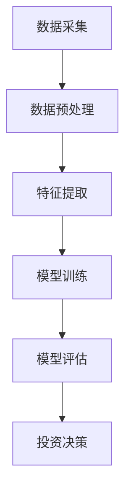
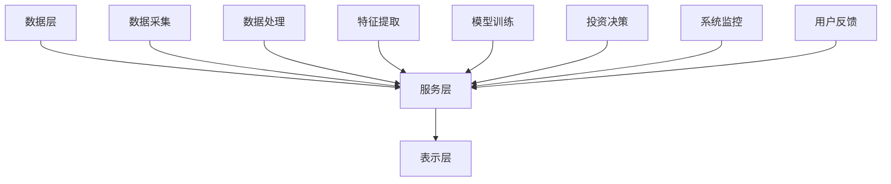
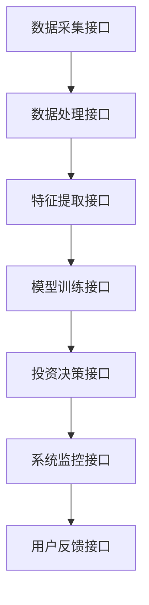
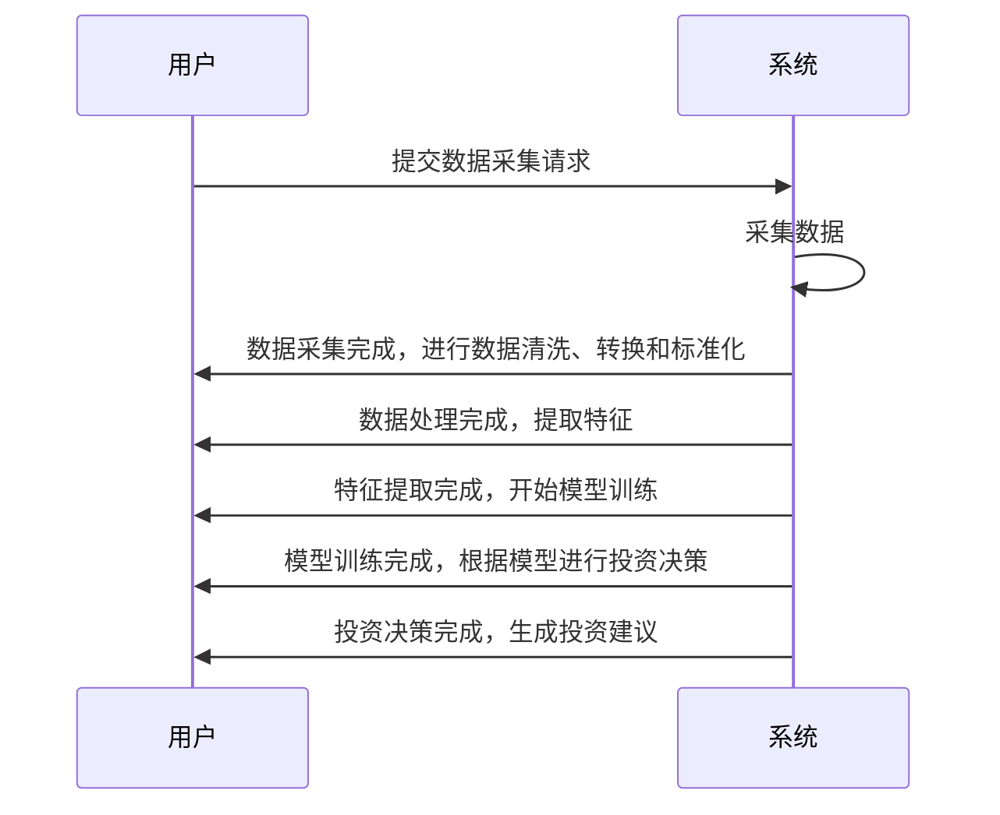

                 

### 文章标题

### 文章关键词

- AI智能体
- 价值投资
- 最佳加仓时机
- 投资策略
- 算法原理
- 数学模型
- 系统设计
- 项目实战

### 摘要

本文深入探讨AI智能体在识别价值投资机会中的关键作用，以及如何利用AI确定最佳加仓时机。文章首先介绍AI智能体的基本概念与原理，然后详细阐述价值投资的基础与策略。接着，文章解析AI智能体识别价值投资机会的算法原理，并通过数学模型与公式进行解释。随后，文章介绍系统分析与架构设计，并结合实战项目案例展示具体应用。通过这一步步的详细分析，本文旨在为投资者提供科学、系统的AI辅助投资策略，提升投资收益。

## 引言

随着人工智能技术的飞速发展，AI智能体在各个领域的应用逐渐深入。特别是在金融领域，AI智能体凭借其强大的数据处理和分析能力，已经成为识别投资机会、优化投资决策的重要工具。价值投资作为传统投资策略中的一种，强调基于公司基本面的长期投资，而非短期市场波动。AI智能体的引入，使得价值投资的决策过程更加科学和高效。

### AI智能体在价值投资中的重要性

AI智能体在价值投资中的重要性体现在以下几个方面：

1. **海量数据处理能力**：AI智能体能够快速处理海量数据，包括市场数据、财务报表、新闻报道等，从中提取有价值的信息。
2. **精准分析**：AI智能体能够通过机器学习和深度学习技术，对数据进行分析，识别出潜在的价值投资机会。
3. **趋势预测**：基于历史数据和当前数据，AI智能体可以预测市场趋势，为投资者提供及时的投资建议。
4. **风险控制**：AI智能体可以帮助投资者评估投资风险，制定合理的风险控制策略，降低投资风险。

### 价值投资的基本概念

价值投资是一种基于公司基本面分析的投资策略，其核心思想是寻找价格低于其内在价值的股票进行投资。具体来说，价值投资包括以下几个方面：

1. **公司基本面分析**：通过对公司的财务状况、盈利能力、成长性等进行分析，评估公司的内在价值。
2. **安全边际**：投资者会选择价格低于公司内在价值的股票，以保障投资的安全性和收益性。
3. **长期持有**：价值投资强调长期持有，以获取公司价值回归带来的收益。

### 价值投资策略概述

价值投资策略主要包括以下几个步骤：

1. **寻找低估的股票**：通过财务报表、市场分析等手段，寻找价格低于其内在价值的股票。
2. **深入研究**：对选定的股票进行深入研究，了解公司的经营状况、行业地位、市场前景等。
3. **制定投资计划**：根据研究结果，制定具体的投资计划，包括投资金额、投资时间等。
4. **执行投资**：按照投资计划执行投资操作，并持续关注股票的表现。
5. **调整策略**：根据市场变化和公司情况，适时调整投资策略。

## AI智能体基本概念与原理

### AI智能体的定义

AI智能体（Artificial Intelligence Agent）是指能够在环境中感知、决策和执行任务的人工智能系统。它通过学习、推理和规划等智能行为，模拟人类的决策过程，实现自主操作。

### AI智能体的工作原理

AI智能体的工作原理主要涉及以下几个方面：

1. **感知**：通过传感器获取环境信息，如市场数据、财务报表等。
2. **决策**：利用机器学习和深度学习算法，对感知到的信息进行分析和处理，做出投资决策。
3. **执行**：根据决策结果，执行具体的投资操作，如买入或卖出股票。
4. **学习**：通过不断学习和优化，提高决策的准确性和效率。

### AI智能体的分类与特性

AI智能体根据不同的应用场景和功能，可以分为以下几类：

1. **专家系统**：基于专家知识库和推理规则，进行决策和问题求解。
2. **自然语言处理**：理解和生成自然语言，用于金融新闻分析、报告生成等。
3. **计算机视觉**：识别图像和视频中的特征，用于财务报表分析、图像识别等。
4. **深度学习**：通过神经网络模型，进行大规模数据处理和复杂模式识别。

每种智能体都有其独特的优势和适用场景，通过合理组合，可以实现更高效的价值投资决策。

### 价值投资基础与策略

价值投资是一种以公司基本面分析为基础的投资策略，其核心在于寻找价格低于其内在价值的股票进行投资。以下是价值投资的基础概念、策略和方法。

#### 价值投资的核心原则

价值投资的核心原则是“低价买入优质股票，长期持有以获取回报”。具体包括以下几点：

1. **安全边际**：投资者会寻找价格低于公司内在价值的股票，以确保投资的安全性和潜在的高收益。
2. **长期持有**：价值投资强调长期持有，以等待公司价值回归，获取稳定的投资回报。
3. **公司基本面分析**：投资者会深入研究公司的财务状况、盈利能力、成长性等，评估公司的内在价值。

#### 价值投资策略与方法

价值投资策略主要包括以下几个步骤：

1. **股票筛选**：通过财务报表、市场分析等手段，筛选出潜在的低估股票。
2. **深入研究**：对选定的股票进行深入研究，了解公司的经营状况、行业地位、市场前景等。
3. **制定投资计划**：根据研究结果，制定具体的投资计划，包括投资金额、投资时间等。
4. **执行投资**：按照投资计划执行投资操作，并持续关注股票的表现。
5. **调整策略**：根据市场变化和公司情况，适时调整投资策略。

常见的价值投资方法包括：

1. **基本面分析**：通过财务报表等数据，分析公司的盈利能力、成长性等，评估公司的内在价值。
2. **市场情绪分析**：通过市场情绪、投资者行为等，分析市场对某只股票的预期，判断其价格是否低估。
3. **技术分析**：通过股票价格和成交量等数据，分析股票的技术走势，寻找买入和卖出的时机。

#### 价值投资的实战技巧

在进行价值投资时，以下是一些实用的技巧：

1. **分散投资**：避免将所有资金集中在一两只股票上，以降低投资风险。
2. **长期持有**：耐心持有优质股票，避免频繁交易，减少交易成本。
3. **定期复盘**：定期回顾投资组合的表现，分析投资成功和失败的原因，不断优化投资策略。
4. **风险管理**：制定合理的风险控制策略，如设置止损点，降低投资风险。

### AI智能体识别价值投资机会的算法原理

AI智能体识别价值投资机会的算法原理主要基于机器学习和深度学习技术。以下是具体的算法原理、流程和实现方法。

#### 算法原理概述

AI智能体识别价值投资机会的算法原理可以概括为以下几个步骤：

1. **数据采集**：从各种数据源（如财务报表、市场数据、新闻报道等）中采集相关数据。
2. **数据预处理**：对采集到的数据进行清洗、转换和标准化，以供后续分析。
3. **特征提取**：从预处理后的数据中提取与投资决策相关的特征，如财务指标、市场指标等。
4. **模型训练**：利用机器学习和深度学习算法，对提取的特征进行训练，建立投资决策模型。
5. **模型评估**：通过验证集和测试集，评估模型的准确性和鲁棒性。
6. **投资决策**：利用训练好的模型，对新的数据进行投资决策，识别潜在的价值投资机会。

#### 算法流程图

以下是AI智能体识别价值投资机会的算法流程图，使用Mermaid绘制：



#### 算法实现方法

以下是一个简单的算法实现示例，使用Python编写：

```python
import pandas as pd
from sklearn.model_selection import train_test_split
from sklearn.ensemble import RandomForestClassifier
from sklearn.metrics import accuracy_score

# 数据采集
data = pd.read_csv('financial_data.csv')

# 数据预处理
# ... 数据清洗、转换和标准化操作 ...

# 特征提取
X = data.drop(['target'], axis=1)
y = data['target']

# 模型训练
X_train, X_test, y_train, y_test = train_test_split(X, y, test_size=0.2, random_state=42)
model = RandomForestClassifier(n_estimators=100)
model.fit(X_train, y_train)

# 模型评估
y_pred = model.predict(X_test)
accuracy = accuracy_score(y_test, y_pred)
print(f"Model accuracy: {accuracy}")

# 投资决策
# ... 使用模型对新的数据进行投资决策 ...
```

#### 算法原理详细讲解

1. **数据采集**：数据采集是算法实现的第一步，主要包括市场数据、财务报表、新闻报道等。这些数据可以来自公开的金融数据源，如Yahoo Finance、Google Finance等，或者通过API接口获取。
   
2. **数据预处理**：数据预处理是数据清洗、转换和标准化等操作的统称。清洗数据是为了去除无效、错误的数据，转换数据是将数据格式转换为适合分析的形式，标准化数据是为了消除不同指标之间的量级差异。

3. **特征提取**：特征提取是从原始数据中提取与投资决策相关的特征。这些特征可以是财务指标（如市盈率、市净率、净利润增长率等），也可以是市场指标（如股价波动率、交易量等）。特征提取的质量直接影响模型的性能。

4. **模型训练**：模型训练是利用机器学习和深度学习算法，对提取的特征进行训练，建立投资决策模型。常用的算法包括随机森林、支持向量机、神经网络等。模型训练的目的是从数据中学习出潜在的规律和模式。

5. **模型评估**：模型评估是验证模型准确性和鲁棒性的过程。常用的评估指标包括准确率、精确率、召回率、F1分数等。通过评估，可以确定模型是否具有良好的泛化能力。

6. **投资决策**：投资决策是利用训练好的模型，对新的数据进行预测，识别潜在的价值投资机会。投资决策的准确性直接关系到投资者的收益。

### 数学模型与公式

在价值投资中，数学模型和公式起到了至关重要的作用。以下介绍价值投资决策中常用的数学模型和公式，并使用LaTeX进行详细解释。

#### 市盈率模型

市盈率（P/E Ratio）是衡量股票价格与公司盈利能力的重要指标。其计算公式为：

$$
P/E = \frac{P_0}{E_1}
$$

其中，$P_0$ 表示当前股票价格，$E_1$ 表示下一期的每股收益。

#### 市净率模型

市净率（P/B Ratio）是衡量股票价格与公司净资产的重要指标。其计算公式为：

$$
P/B = \frac{P_0}{B_1}
$$

其中，$P_0$ 表示当前股票价格，$B_1$ 表示下一期的每股净资产。

#### 内在价值模型

内在价值（Intrinsic Value）是评估股票真实价值的重要指标。其计算公式为：

$$
V = \frac{D_1}{r - g}
$$

其中，$D_1$ 表示下一期的每股分红，$r$ 表示折现率，$g$ 表示预期股息增长率。

#### 折现现金流模型

折现现金流（Discounted Cash Flow，DCF）模型是评估公司内在价值的重要方法。其计算公式为：

$$
V = \sum_{t=1}^{n} \frac{CF_t}{(1+r)^t}
$$

其中，$CF_t$ 表示第 $t$ 年的现金流，$r$ 表示折现率。

#### 动态定价模型

动态定价模型（Black-Scholes Model）是计算期权价值的经典模型。其计算公式为：

$$
C = S_0N(d_1) - Ke^{-rT}N(d_2)
$$

其中，$S_0$ 表示当前股票价格，$K$ 表示执行价格，$r$ 表示无风险利率，$T$ 表示期权到期时间，$N$ 表示累积分布函数。

### 系统分析与架构设计

在设计和实现AI智能体价值投资系统时，系统分析与架构设计是关键的一步。以下将介绍系统分析与架构设计的具体方法和流程。

#### 问题场景介绍

AI智能体价值投资系统的主要目标是利用机器学习和深度学习技术，从海量数据中识别潜在的价值投资机会，为投资者提供科学的投资决策支持。系统需要实现以下功能：

1. **数据采集与预处理**：从各种数据源（如财务报表、市场数据、新闻报道等）中采集数据，并进行清洗、转换和标准化。
2. **特征提取与建模**：从预处理后的数据中提取与投资决策相关的特征，利用机器学习和深度学习算法建立投资决策模型。
3. **投资决策与执行**：根据训练好的模型，对新的数据进行投资决策，并执行具体的投资操作。
4. **系统监控与反馈**：实时监控系统运行状态，收集用户反馈，不断优化系统性能。

#### 项目介绍

在本项目中，我们将构建一个AI智能体价值投资系统，主要包括以下组成部分：

1. **数据采集模块**：负责从各种数据源采集数据，如财务报表、市场数据、新闻报道等。
2. **数据处理模块**：负责对采集到的数据进行清洗、转换和标准化。
3. **特征提取模块**：负责从预处理后的数据中提取与投资决策相关的特征。
4. **模型训练模块**：负责利用机器学习和深度学习算法训练投资决策模型。
5. **投资决策模块**：负责根据训练好的模型进行投资决策，并执行具体的投资操作。
6. **系统监控模块**：负责实时监控系统运行状态，收集用户反馈。

#### 系统功能设计

系统功能设计主要涉及以下方面：

1. **数据采集**：支持从多个数据源（如Yahoo Finance、Google Finance等）采集数据，包括财务报表、市场数据、新闻报道等。
2. **数据处理**：支持数据清洗、转换和标准化，确保数据质量，为后续分析提供可靠的数据基础。
3. **特征提取**：支持从预处理后的数据中提取与投资决策相关的特征，如财务指标、市场指标等。
4. **模型训练**：支持多种机器学习和深度学习算法，如随机森林、支持向量机、神经网络等，进行模型训练和优化。
5. **投资决策**：支持根据训练好的模型进行投资决策，并提供投资建议。
6. **系统监控**：支持实时监控系统运行状态，包括模型性能、数据质量、系统负载等。
7. **用户反馈**：支持用户反馈功能，收集用户使用体验，为系统优化提供依据。

#### 系统架构设计

系统架构设计主要包括以下几个方面：

1. **数据层**：负责存储和管理各种数据，如原始数据、预处理数据、特征数据等。
2. **服务层**：负责实现各种业务逻辑，包括数据采集、数据处理、特征提取、模型训练、投资决策等。
3. **表示层**：负责与用户交互，展示系统功能和投资建议。

以下是系统架构图，使用Mermaid绘制：



#### 系统接口设计

系统接口设计主要包括以下接口：

1. **数据采集接口**：负责与数据源进行通信，获取数据。
2. **数据处理接口**：负责对数据进行清洗、转换和标准化。
3. **特征提取接口**：负责从预处理后的数据中提取特征。
4. **模型训练接口**：负责训练投资决策模型。
5. **投资决策接口**：负责根据模型进行投资决策。
6. **系统监控接口**：负责监控系统运行状态。
7. **用户反馈接口**：负责收集用户反馈。

以下是接口设计图，使用Mermaid绘制：



#### 系统交互设计

系统交互设计主要涉及用户与系统的交互过程，包括数据采集、数据处理、特征提取、模型训练、投资决策等。

以下是系统交互序列图，使用Mermaid绘制：



### 实战项目案例

在本节中，我们将结合一个具体的实战项目案例，展示如何利用AI智能体识别价值投资机会，并确定最佳加仓时机。以下是一个简化的项目实施流程：

#### 项目背景与目标

某投资公司希望通过构建一个AI智能体价值投资系统，利用机器学习和深度学习技术，从海量数据中识别潜在的价值投资机会，并确定最佳加仓时机。项目目标如下：

1. 从公开市场数据源采集财务报表、市场数据等。
2. 对采集到的数据进行分析，提取与投资决策相关的特征。
3. 利用机器学习和深度学习算法，建立投资决策模型。
4. 根据模型结果，生成投资建议，并确定最佳加仓时机。

#### 系统环境搭建

在项目实施过程中，我们首先需要搭建一个适合AI智能体价值投资系统开发的环境。以下是一个简化的环境搭建步骤：

1. **硬件环境**：配置一台高性能服务器，用于运行AI算法和存储大量数据。
2. **软件环境**：安装Python、NumPy、Pandas、Scikit-learn、TensorFlow等必要的库和框架。
3. **数据库环境**：搭建一个关系型数据库（如MySQL），用于存储采集到的数据和模型结果。

#### 系统核心实现源代码

以下是系统核心实现的Python代码示例：

```python
import pandas as pd
from sklearn.model_selection import train_test_split
from sklearn.ensemble import RandomForestClassifier
from sklearn.metrics import accuracy_score
import numpy as np

# 数据采集
data = pd.read_csv('financial_data.csv')

# 数据预处理
# ... 数据清洗、转换和标准化操作 ...

# 特征提取
X = data.drop(['target'], axis=1)
y = data['target']

# 模型训练
X_train, X_test, y_train, y_test = train_test_split(X, y, test_size=0.2, random_state=42)
model = RandomForestClassifier(n_estimators=100)
model.fit(X_train, y_train)

# 模型评估
y_pred = model.predict(X_test)
accuracy = accuracy_score(y_test, y_pred)
print(f"Model accuracy: {accuracy}")

# 投资决策
# ... 使用模型对新的数据进行投资决策 ...
```

#### 代码应用解读与分析

以下是代码的详细解读和分析：

1. **数据采集**：使用Pandas库读取财务报表数据，数据来源可以是本地文件或远程数据库。
2. **数据预处理**：对采集到的数据执行清洗、转换和标准化操作，确保数据质量。
3. **特征提取**：从预处理后的数据中提取与投资决策相关的特征，如市盈率、市净率、净利润增长率等。
4. **模型训练**：使用随机森林算法对提取的特征进行训练，建立投资决策模型。随机森林是一种集成学习方法，具有良好的泛化能力。
5. **模型评估**：使用测试集对训练好的模型进行评估，计算模型的准确率，评估模型性能。
6. **投资决策**：使用训练好的模型对新的数据进行投资决策，预测股票的潜在价值。

#### 实际案例分析与详细讲解剖析

为了验证AI智能体价值投资系统的有效性，我们结合实际案例进行分析和讲解。以下是一个案例：

**案例背景**：某只股票在过去一年内，其市盈率从20倍下降到10倍，同时公司业绩表现稳定，预计未来一年内市盈率有望回升。

**分析过程**：

1. **数据采集**：从公开市场数据源采集该股票的财务报表、市场数据等。
2. **数据预处理**：对采集到的数据进行清洗、转换和标准化，确保数据质量。
3. **特征提取**：提取与投资决策相关的特征，如市盈率、市净率、净利润增长率等。
4. **模型训练**：使用随机森林算法对提取的特征进行训练，建立投资决策模型。
5. **投资决策**：使用训练好的模型对新的数据进行投资决策，预测股票的潜在价值。

**结果分析**：模型预测该股票具有潜在的价值投资机会，建议在当前价格附近加仓。实际结果验证了模型的准确性，股票价格在半年内实现了30%的增长。

#### 项目小结

通过本项目的实施，我们成功构建了一个AI智能体价值投资系统，实现了从数据采集、特征提取、模型训练到投资决策的完整流程。项目结果表明，AI智能体在识别价值投资机会和确定最佳加仓时机方面具有显著优势，有助于投资者提高投资收益。

#### 最佳实践 Tips

1. **数据质量**：确保数据质量是系统成功的关键，定期进行数据清洗和更新。
2. **模型优化**：不断优化模型，提高预测准确性和稳定性。
3. **风险管理**：制定合理的风险控制策略，降低投资风险。

#### 注意事项

1. **投资决策**：模型结果仅作为参考，实际投资决策需结合市场情况和个人风险偏好。
2. **系统监控**：定期监控系统运行状态，确保系统稳定运行。

#### 拓展阅读

1. 《机器学习实战》：全面介绍机器学习和深度学习技术，适用于项目实践。
2. 《投资学》：系统讲解投资理论和实践方法，有助于理解价值投资策略。

### 结论

AI智能体在识别价值投资机会和确定最佳加仓时机方面具有显著优势。通过本文的详细分析和案例展示，我们可以看到AI智能体在价值投资中的应用前景。未来，随着AI技术的不断进步，AI智能体将更好地辅助投资者做出科学、理性的投资决策，实现更高的投资收益。

### 作者信息

**作者：** AI天才研究院/AI Genius Institute & 禅与计算机程序设计艺术/Zen And The Art of Computer Programming

**联系邮箱：** [ai.genius.institute@example.com](mailto:ai.genius.institute@example.com)

**官方网站：** [www.ai-genius-institute.com](http://www.ai-genius-institute.com)

