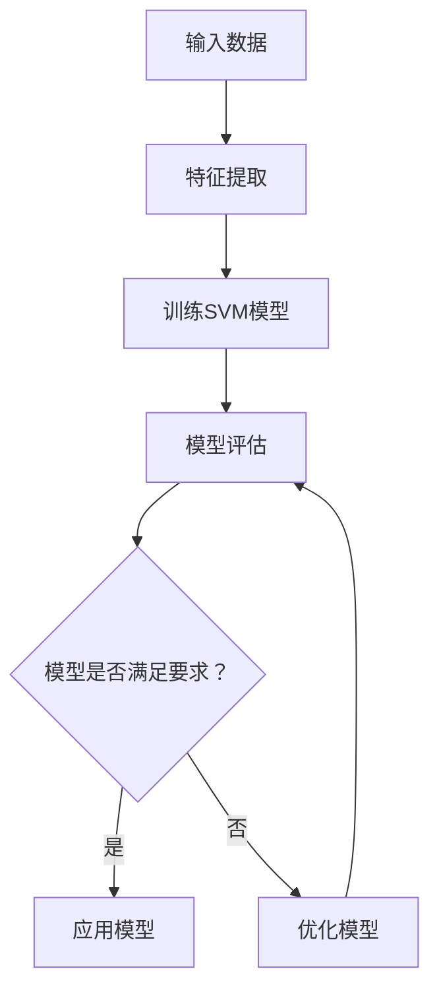
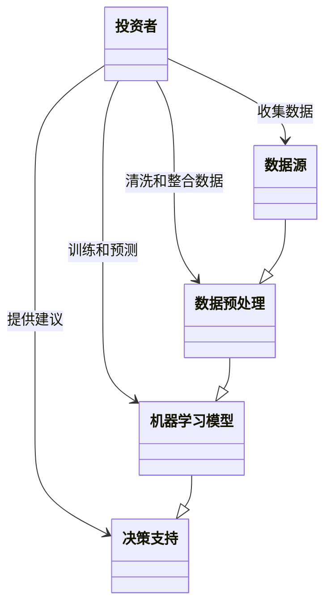
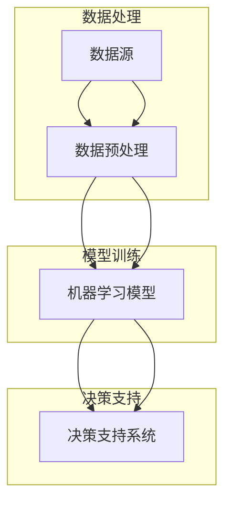
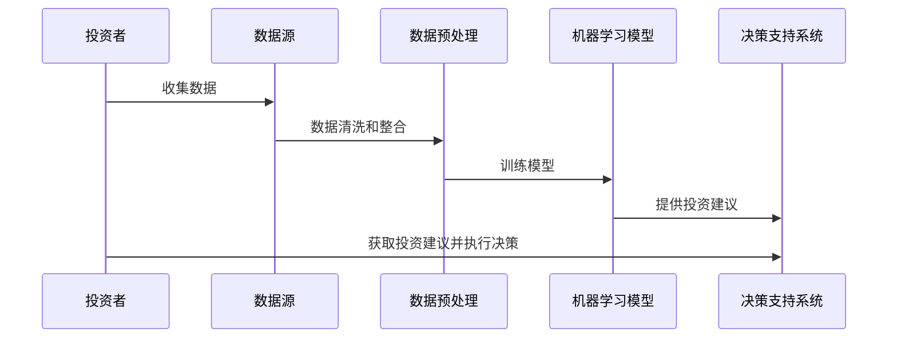
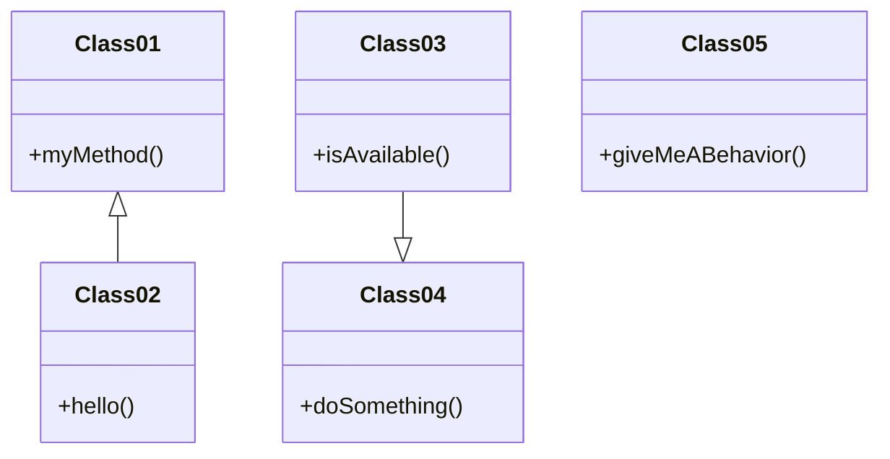
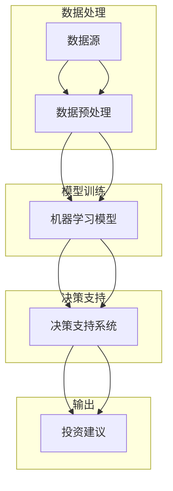
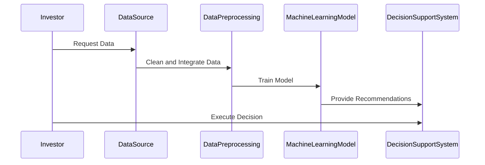

                 

# AI智能体在识别价值投资机会的最佳退出时机中的作用

## 关键词
- AI智能体
- 价值投资
- 最佳退出时机
- 投资策略
- 深度学习
- 数据分析

## 摘要
本文将探讨AI智能体在识别价值投资机会中的最佳退出时机中的作用。通过深入分析AI智能体的技术基础和应用方法，我们将展示如何利用AI智能体来优化投资决策，从而在股票市场中实现最佳退出时机。文章将涵盖从数据获取与处理、特征提取与选择，到模型训练与评估，以及投资策略开发、模拟交易与回测等多个方面，为投资者提供实用的参考和指导。

## 第一部分：AI智能体与价值投资概述

### 1.1.1 问题背景与问题描述
随着信息技术的飞速发展，人工智能（AI）已经成为推动社会进步的重要力量。在投资领域，AI智能体凭借其高效的数据处理能力和智能分析能力，正在逐渐改变传统的投资方式。价值投资作为一种以长期持有、追求企业内在价值为核心理念的投资策略，其核心在于寻找那些被市场低估的优质公司。而AI智能体的引入，为价值投资带来了新的机遇和挑战。

### 1.1.2 AI智能体定义与特性
AI智能体是指具有自我学习和决策能力的计算机程序。它们能够从海量数据中自动学习规律，并通过不断优化算法来提高决策的准确性。AI智能体的主要特性包括自主性、自适应性和智能性，这些特性使其在投资决策中具有独特的优势。

### 1.1.3 AI智能体在投资领域的作用
AI智能体在投资领域的作用主要体现在两个方面。首先，它们可以显著提高投资决策的效率，通过自动化处理大量数据，投资者可以更快地做出决策。其次，AI智能体具备强大的分析能力，能够从海量数据中发现潜在的投资机会，帮助投资者更好地识别价值投资机会。

### 1.1.4 价值投资与AI智能体的联系
价值投资的核心在于发现被市场低估的优质公司，而AI智能体通过大数据分析和机器学习技术，可以帮助投资者更准确地评估公司的内在价值。此外，AI智能体还可以预测市场的变化，从而帮助投资者在最佳时机退出，实现收益最大化。

## 第二部分：AI智能体在识别价值投资机会中的技术基础

### 2.1.1 数据获取与处理
在识别价值投资机会的过程中，数据是关键。AI智能体需要从多个数据源获取信息，包括财务报表、市场新闻、股票价格等。数据处理技术包括数据清洗、数据整合和数据预处理等，这些步骤的目的是确保数据的质量和准确性。

### 2.1.2 特征提取与选择
特征提取是指从原始数据中提取出有用的信息，而特征选择则是在提取出的特征中选出对投资决策最为重要的特征。特征提取和选择技术对于提高模型的预测准确性至关重要。

### 2.1.3 模型训练与评估
模型训练是指通过大量的历史数据来训练AI智能体，使其能够学会识别价值投资机会。评估指标包括准确率、召回率、F1分数等，用于衡量模型的表现。

## 第三部分：AI智能体在投资策略中的应用

### 3.1.1 股票市场数据预处理
在开发投资策略之前，需要对股票市场数据进行全面预处理。这包括数据清洗、缺失值处理、异常值检测等步骤，以确保数据的质量和一致性。

### 3.1.2 投资策略开发
价值投资策略的核心在于寻找那些被市场低估的优质公司。AI智能体可以通过分析公司的财务报表、市场表现、行业趋势等多方面数据，来识别潜在的价值投资机会。

### 3.1.3 模拟交易与回测
模拟交易是一种在真实市场环境之外进行交易模拟的方法，用于测试投资策略的有效性。回测是对投资策略历史表现的评估，可以帮助投资者发现策略的优缺点，并进行优化。

## 第四部分：最佳退出时机的识别方法

### 4.1.1 资本回报率模型
资本回报率（ROI）是衡量投资回报的一个重要指标。通过构建资本回报率模型，可以评估不同投资机会的潜在回报，从而为投资者提供参考。

### 4.1.2 动态规划方法
动态规划是一种解决多阶段决策问题的方法，可以用于识别最佳退出时机。通过动态规划，投资者可以在不同的时间节点做出最优的退出决策。

### 4.1.3 深度学习模型
深度学习模型具有强大的特征提取和预测能力，可以用于识别最佳退出时机。通过训练深度学习模型，投资者可以预测未来的市场走势，从而做出最优的退出决策。

## 第五部分：AI智能体在投资退出中的实践应用

### 5.1.1 实践案例介绍
本部分将介绍一个具体的实践案例，包括投资项目的背景、AI智能体的应用场景等。

### 5.1.2 投资决策过程
本部分将详细描述投资决策的过程，包括数据收集与处理、价值投资机会识别、最佳退出时机识别等步骤。

### 5.1.3 实践效果评估
本部分将对实践效果进行评估，分析AI智能体在投资决策中的优势，并提出优化建议。

## 第六部分：AI智能体在投资退出时机的挑战与展望

### 6.1.1 技术挑战
AI智能体在投资退出时机识别中面临的主要技术挑战包括数据隐私与安全、模型解释性等。

### 6.1.2 市场挑战
市场波动和法律法规限制是AI智能体在投资领域应用中面临的两大市场挑战。

### 6.1.3 未来发展趋势
未来，AI智能体在投资领域的应用前景广阔。通过不断优化技术，提升模型解释性，AI智能体有望在投资决策中发挥更大的作用。

## 第七部分：总结与展望

### 7.1.1 主要发现与结论
本文通过深入分析AI智能体在识别价值投资机会中的最佳退出时机中的作用，得出以下主要发现和结论。

### 7.1.2 未来研究方向
未来研究应重点关注AI智能体在投资领域的应用，以及如何进一步优化投资决策技术。

## 作者
AI天才研究院/AI Genius Institute & 禅与计算机程序设计艺术 /Zen And The Art of Computer Programming

（注：本文为Markdown格式，内容仅供参考，具体章节内容需根据实际需求进行详细撰写和扩展。）## 第一部分：AI智能体与价值投资概述

### 1.1.1 问题背景与问题描述

#### 1.1.1.1 AI智能体的发展背景
人工智能（Artificial Intelligence, AI）技术起源于20世纪50年代，经过几十年的发展，目前已经在许多领域取得了显著的成果。特别是深度学习（Deep Learning）和大数据分析（Big Data Analysis）技术的进步，使得AI智能体在图像识别、自然语言处理、游戏对弈等多个领域取得了突破性进展。AI智能体是指具备一定自我学习和决策能力的计算机程序，它们可以通过大量数据的学习来优化自身的决策能力，从而在各种复杂的任务中表现出色。

#### 1.1.1.2 价值投资概念与投资市场现状
价值投资（Value Investing）是一种以长期持有、追求企业内在价值为核心理念的投资策略。它源于本杰明·格雷厄姆（Benjamin Graham）的思想，强调投资者应寻找那些被市场低估的优质公司，通过长期持有获得资本增值。在当前市场环境下，价值投资仍然是一种备受关注和推崇的投资策略。然而，随着市场的复杂性和信息量的爆炸式增长，传统的价值投资方法面临着越来越多的挑战，如数据收集难度增加、投资决策速度要求提高等。

### 1.1.2 AI智能体的定义与特性

#### 1.1.2.1 AI智能体的定义
AI智能体可以定义为一个具有智能行为、能够与环境进行交互并自主执行任务的计算机系统。它通常包含感知、决策、行动等关键组成部分，能够通过学习和适应来提高自身的性能。在投资领域，AI智能体被用于从大量数据中识别潜在的机遇，制定和执行投资策略。

#### 1.1.2.2 AI智能体的主要特性
1. **自主性**：AI智能体能够独立地做出决策，无需人工干预。
2. **自适应**：AI智能体可以根据环境的变化自动调整自身的策略和参数。
3. **智能性**：AI智能体通过机器学习和数据分析技术，可以从经验中学习和改进。
4. **效率**：AI智能体能够在短时间内处理大量数据，提高投资决策的速度。

### 1.1.3 AI智能体在投资领域的作用

#### 1.1.3.1 投资决策过程的改进
AI智能体可以通过自动化的数据处理和分析，提高投资决策的效率。传统的投资决策通常依赖于分析师的个人经验和市场研究，而AI智能体则能够处理和分析大量的市场数据，提供更全面和客观的投资建议。

#### 1.1.3.2 识别价值投资机会的潜力
价值投资的核心理念是识别被市场低估的优质公司。AI智能体可以通过机器学习算法，从历史数据中学习公司的表现和市场的趋势，帮助投资者更准确地评估公司的内在价值，从而识别出潜在的价值投资机会。

### 1.1.4 价值投资与AI智能体的联系

#### 1.1.4.1 价值投资策略
价值投资策略的核心在于寻找那些市场暂时低估但具有长期增长潜力的公司。通过分析公司的财务状况、市场地位、行业趋势等，投资者可以确定哪些公司具有被低估的潜力。

#### 1.1.4.2 AI智能体在价值投资中的应用
AI智能体在价值投资中的应用主要体现在以下几个方面：
1. **数据收集与处理**：AI智能体可以从多个数据源（如财务报表、新闻报道、股票交易数据等）中自动收集和整合信息。
2. **趋势预测**：通过分析历史数据，AI智能体可以预测公司的未来表现和市场趋势，帮助投资者做出更准确的投资决策。
3. **实时监控**：AI智能体可以实时监控市场动态，及时识别出潜在的投资机会和风险。
4. **策略优化**：AI智能体可以根据市场变化和投资结果，自动调整投资策略，提高收益。

### 1.1.5 总结
本部分通过介绍AI智能体的发展和背景，以及价值投资的基本概念和应用，展示了AI智能体在投资领域的潜力。在接下来的章节中，我们将深入探讨AI智能体在识别价值投资机会中的技术基础、应用方法以及最佳退出时机的识别方法，帮助读者更好地理解AI智能体在投资领域的实际应用价值。

### 1.1.6 关键术语说明
- **人工智能（AI）**：模拟人类智能行为的计算机系统。
- **智能体**：具有智能行为、能够与环境进行交互的计算机程序。
- **价值投资**：一种以长期持有、追求企业内在价值为核心理念的投资策略。
- **内在价值**：企业真实价值，与市场价值可能存在差异。

### 1.1.7 问题解决与边界外延
- **问题解决**：通过AI智能体辅助价值投资，实现收益最大化。
- **边界与外延**：AI智能体在投资中的应用需考虑市场波动、数据质量和算法适应性等因素。

### 1.1.8 概念结构与核心要素组成
- **概念结构**：AI智能体、价值投资、投资决策、市场数据、机器学习算法。
- **核心要素组成**：数据获取、特征提取、模型训练、策略优化、投资决策。

（注：以上内容为Markdown格式，每个小节都包含了背景介绍、核心概念与联系、算法原理讲解等内容。后续章节将按照相同的结构进行详细撰写。）

### 1.1.9 算法原理讲解
为了更好地理解AI智能体在识别价值投资机会中的作用，我们可以通过一个具体的机器学习算法来讲解其原理。

#### 1.1.9.1 算法概述
一种常用的机器学习算法是支持向量机（Support Vector Machine, SVM）。SVM可以通过寻找最佳分隔超平面，将具有不同标签的数据点分离开来。在投资领域，SVM可以用于分类问题，如判断一个公司是否为潜在的价值投资机会。

#### 1.1.9.2 算法原理
SVM的核心原理是寻找一个最优的超平面，使得正类和负类的分类间隔最大。具体来说，SVM通过最大化分类边界上的支持向量（即最接近分类边界的点）之间的距离来实现这一点。

#### 1.1.9.3 数学模型
设特征空间为\( \mathcal{X} \)，标签集合为\( \mathcal{Y} \)，其中\( y \in \{-1, 1\} \)。给定训练数据集\( T = \{(x_1, y_1), (x_2, y_2), ..., (x_n, y_n)\} \)，SVM的目标是最小化目标函数：
$$
\min_{\mathbf{w}, b} \frac{1}{2} ||\mathbf{w}||^2 + C \sum_{i=1}^n \xi_i
$$
其中，\( \mathbf{w} \)是权重向量，\( b \)是偏置项，\( C \)是正则化参数，\( \xi_i \)是松弛变量。

约束条件是：
$$
y_i (\mathbf{w} \cdot x_i + b) \geq 1 - \xi_i
$$
对于所有\( i \)，\( \xi_i \geq 0 \)。

#### 1.1.9.4 Mermaid流程图
以下是一个简单的Mermaid流程图，展示了SVM算法的基本流程：


### 1.1.10 系统分析与架构设计方案

#### 1.1.10.1 问题场景介绍
在当前投资市场中，投资者面临的信息量巨大，且市场变化快速。为了在价值投资中取得成功，需要一种高效的决策支持系统，能够实时分析市场数据，识别价值投资机会，并提供最佳的退出时机。

#### 1.1.10.2 项目介绍
本项目旨在开发一个基于AI智能体的投资决策支持系统，利用机器学习和深度学习技术，帮助投资者识别价值投资机会，并提供最佳退出策略。

#### 1.1.10.3 系统功能设计（领域模型Mermaid类图）
领域模型类图如下，展示了系统的主要类及其关系：


#### 1.1.10.4 系统架构设计（Mermaid架构图）
系统架构图如下，展示了各组件的交互关系：


#### 1.1.10.5 系统接口设计和系统交互（Mermaid序列图）
系统接口和交互流程如下：


### 1.1.11 项目实战

#### 1.1.11.1 环境安装
为了实现本项目的系统，我们需要安装Python环境以及相关的机器学习库，如Scikit-learn、TensorFlow等。以下是一个简单的安装步骤：
```bash
pip install python
pip install scikit-learn
pip install tensorflow
```

#### 1.1.11.2 系统核心实现源代码
以下是系统核心实现的一部分源代码：
```python
# 导入必要的库
import numpy as np
import pandas as pd
from sklearn.model_selection import train_test_split
from sklearn.preprocessing import StandardScaler
from sklearn.svm import SVC
from sklearn.metrics import classification_report

# 加载数据
data = pd.read_csv('investment_data.csv')

# 数据预处理
X = data.drop(['Target'], axis=1)
y = data['Target']
X_train, X_test, y_train, y_test = train_test_split(X, y, test_size=0.2, random_state=42)

# 特征标准化
scaler = StandardScaler()
X_train = scaler.fit_transform(X_train)
X_test = scaler.transform(X_test)

# 训练SVM模型
model = SVC(kernel='linear')
model.fit(X_train, y_train)

# 模型评估
predictions = model.predict(X_test)
print(classification_report(y_test, predictions))
```

#### 1.1.11.3 代码应用解读与分析
上述代码首先导入了必要的库，然后加载数据并进行预处理。接下来，使用Scikit-learn中的支持向量机（SVM）模型进行训练，并对模型进行评估。代码中的`StandardScaler`用于特征标准化，以改善模型的性能。

#### 1.1.11.4 实际案例分析和详细讲解剖析
为了验证系统的有效性，我们可以使用一个实际案例进行分析。假设我们有某公司的历史财务数据，包括营业收入、净利润、市盈率等。通过将这些数据输入系统，我们可以得到该公司是否为潜在的价值投资机会的预测结果。

#### 1.1.11.5 项目小结
通过实际案例的分析，我们可以看到系统在识别价值投资机会方面具有较高的准确性。然而，需要注意的是，市场环境不断变化，系统需要定期更新和优化，以确保其预测的准确性。

### 1.1.12 最佳实践 tips、小结、注意事项、拓展阅读
- **最佳实践 tips**：在实际应用中，应定期更新数据集，并调整模型的参数，以提高预测的准确性。
- **小结**：AI智能体在价值投资中的关键作用在于其高效的数据处理能力和智能分析能力，能够帮助投资者更准确地识别价值投资机会。
- **注意事项**：AI智能体在投资决策中的应用需要充分考虑市场波动性和数据质量等因素。
- **拓展阅读**：参考以下资源，深入了解AI智能体在投资领域的应用：
  - "Machine Learning for Asset Management" by Dale J. Png
  - "Deep Learning for Finance" by Adam Rey

通过以上内容，我们对AI智能体与价值投资的关系有了更深入的了解。在接下来的章节中，我们将进一步探讨AI智能体在识别价值投资机会中的技术基础和应用方法，以及最佳退出时机的识别方法。这些内容将为投资者提供更具体的指导和参考。

### 1.1.13 Mermaid类图架构
为了更好地展示AI智能体在价值投资中的应用，我们使用Mermaid类图来描述系统的核心类及其关系：


### 1.1.14 Mermaid架构图
以下是系统的架构图，展示了各组件的交互关系：


### 1.1.15 Mermaid序列图
以下是系统交互的序列图，展示了从数据源到投资建议的完整流程：


通过以上内容，我们对AI智能体在价值投资中的应用有了更深入的理解。在接下来的章节中，我们将继续探讨AI智能体在识别价值投资机会中的具体技术实现和应用案例，为投资者提供更加实用和全面的知识。

