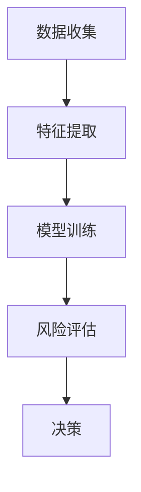

                 

### AI智能体在识别价值投资陷阱中的应用

#### 关键词：
- AI智能体
- 价值投资
- 投资陷阱
- 识别算法
- 数学模型
- 系统架构

#### 摘要：
本文深入探讨了AI智能体在识别价值投资陷阱中的应用。首先，我们介绍了AI智能体的基本概念和其在投资领域的应用。接着，我们详细阐述了价值投资的原理以及投资者如何识别价值投资陷阱。随后，本文介绍了用于识别价值投资陷阱的算法原理，并使用Python代码进行了实现。此外，我们还分析了AI智能体识别价值投资陷阱的数学模型，并给出了相应的LaTeX公式。文章随后介绍了整个系统的设计与实现，包括领域模型、系统架构、接口设计和系统交互。最后，通过一个具体的实战案例，我们展示了AI智能体在识别价值投资陷阱中的实际应用，并提供了最佳实践建议和小结。

----------------------------------------------------------------

# 第一部分: 背景与核心概念

## 第1章: AI智能体、价值投资与投资陷阱概述

### 1.1 AI智能体简介

AI智能体（Artificial Intelligence Agent）是指能够感知环境、采取行动并与其他智能体交互的自主系统。AI智能体的定义可以从以下几个方面来理解：

- **自主性**：AI智能体具有自主决策的能力，能够在没有外部干预的情况下，根据环境变化自主调整其行为。
- **感知能力**：AI智能体能够感知并解释其所在环境的状态，通过传感器获取信息。
- **行动能力**：AI智能体能够采取行动来影响环境，以实现特定的目标。
- **交互能力**：AI智能体可以与其他智能体或人类进行交互，共享信息，协同工作。

#### 1.1.1 AI智能体的定义

AI智能体的定义有多种不同的表述，但常见的定义是：一个智能体是一个能够感知其环境并通过执行动作来达到目标的系统。这个定义强调了智能体的三个核心特征：感知、行动和目标。

- **感知**：智能体通过传感器（如摄像头、麦克风、温度传感器等）收集环境信息，并使用这些信息来理解当前的状态。
- **行动**：智能体根据其目标和当前环境状态，通过执行动作（如移动、发送信息等）来改变环境。
- **目标**：智能体有一个明确的目标，这个目标指导其行为，使其能够自主地寻找解决问题的方法。

#### 1.1.2 AI智能体的发展历程

AI智能体的发展历程可以分为几个阶段：

1. **早期探索**（1950s-1960s）：这一阶段的主要目标是开发能够模拟人类智能的简单程序。例如，1956年的达特茅斯会议标志着人工智能的正式诞生。

2. **符号主义阶段**（1960s-1980s）：这一阶段的AI研究主要集中在符号推理和知识表示上。专家系统和推理机是这个时期的重要成果。

3. **连接主义阶段**（1980s-2000s）：这一阶段的AI研究转向了神经网络和机器学习。人工神经网络和深度学习的发展使AI智能体在图像识别、语音识别和自然语言处理等领域取得了显著进展。

4. **现代智能体阶段**（2010s-至今）：这一阶段的AI智能体更加注重自主学习、适应性和人机交互。强化学习、自然语言处理和计算机视觉等技术推动了智能体的进步。

#### 1.1.3 AI智能体的应用领域

AI智能体的应用领域非常广泛，包括但不限于以下几个领域：

- **商业领域**：在商业领域，AI智能体被广泛应用于客户服务、营销自动化、风险管理和供应链管理等方面。
- **医疗领域**：在医疗领域，AI智能体用于疾病诊断、治疗方案推荐和患者监护等，有助于提高医疗效率和准确性。
- **金融领域**：在金融领域，AI智能体被用于市场预测、投资分析和风险管理等，帮助投资者做出更明智的决策。
- **交通运输领域**：在交通运输领域，AI智能体被用于自动驾驶汽车、智能交通管理和物流优化等，有助于提高交通效率和安全性。
- **家居领域**：在智能家居领域，AI智能体被用于语音控制、家居安全监控和能源管理等方面，为用户提供了更便捷的生活体验。

### 1.2 价值投资原理

价值投资（Value Investing）是一种基于基本面分析的股票投资策略，旨在购买价格低于其内在价值的股票。这种策略的核心思想是，通过深入研究公司的财务状况、行业前景和竞争环境，识别那些被市场低估的投资机会。价值投资的理念源于本杰明·格雷厄姆和戴维·多德合著的《证券分析》一书，并在后来由沃伦·巴菲特等人发扬光大。

#### 1.2.1 价值投资的概念

价值投资的概念可以从以下几个方面来理解：

- **内在价值**：内在价值是指一个资产或公司的实际价值，而不是市场价格。投资者需要通过深入分析公司的财务报表、行业趋势和其他相关信息来确定其内在价值。
- **市场价格**：市场价格是指资产或公司的当前交易价格。市场价格通常受到市场情绪、供需关系和其他外部因素的影响。
- **安全边际**：安全边际是指市场价格低于内在价值的差额。投资者希望通过购买具有较大安全边际的股票来降低投资风险。

#### 1.2.2 价值投资的策略

价值投资的主要策略包括以下几个方面：

- **寻找低估的股票**：投资者需要通过深入研究公司的基本面，识别那些被市场低估的股票。这通常需要投资者具备扎实的财务分析能力和对行业趋势的敏锐洞察力。
- **长期持有**：价值投资强调长期持有，因为市场情绪和短期波动可能会影响股票的价格，但长期来看，公司的内在价值会逐渐被市场认识到。
- **分散投资**：投资者应分散投资，以降低特定股票或行业风险。这有助于在市场波动时保持投资组合的稳定性。
- **避免过度交易**：价值投资强调避免频繁交易，因为交易成本和税负可能会侵蚀投资回报。

#### 1.2.3 价值投资的优势与挑战

价值投资的优势包括：

- **风险较低**：由于注重基本面分析和安全边际，价值投资通常能够降低投资风险。
- **长期回报较高**：通过长期持有低估的股票，投资者可以获得较高的回报。
- **适应不同市场环境**：价值投资策略在不同市场环境下均能有效运行，因为其核心在于基本面分析，而非市场走势。

价值投资的挑战包括：

- **需要深入分析**：价值投资需要投资者具备扎实的财务分析能力和行业洞察力，这对于普通投资者来说可能是一个挑战。
- **市场情绪影响**：市场情绪可能会影响股票的价格，导致投资者难以在低估时买入，或者在价格上升时卖出。
- **时机把握难度大**：投资者需要准确把握买入和卖出的时机，这往往是一个挑战。

### 1.3 投资陷阱分析

投资陷阱是指那些看似有吸引力的投资机会，但实际上隐藏着高风险或潜在损失的情况。投资者在追求高回报时，很容易落入这些陷阱。以下是一些常见的投资陷阱：

#### 1.3.1 投资陷阱的定义

投资陷阱是指那些可能误导投资者做出错误决策，导致损失的投资机会或投资策略。投资陷阱通常具有以下特征：

- **表面吸引力**：投资陷阱往往看起来非常有吸引力，如高回报、快速盈利等。
- **隐藏风险**：投资陷阱隐藏了高风险或潜在损失，投资者在进入时可能没有意识到。
- **市场驱动**：投资陷阱往往受到市场情绪的影响，如跟风投资、盲目追求热点等。

#### 1.3.2 常见投资陷阱类型

以下是一些常见的投资陷阱类型：

1. **高收益投资产品**：一些投资产品承诺高额回报，但实际上可能存在高风险或骗局。
2. **市场跟风**：投资者盲目跟随市场热点，而忽视了投资的基本面分析。
3. **杠杆交易**：过度使用杠杆交易可能会放大收益，但也同样会放大损失。
4. **缺乏风险控制**：投资者没有建立有效的风险控制机制，导致在市场波动时遭受重大损失。
5. **缺乏充分研究**：投资者没有进行充分的研究，盲目投资，导致进入高风险领域。
6. **盲目追求热门行业**：投资者盲目追求热门行业，而忽视了行业长期发展趋势和潜在风险。

#### 1.3.3 投资者如何识别投资陷阱

投资者可以通过以下方法来识别投资陷阱：

- **深入研究**：投资者应进行充分的研究，了解投资产品的特点、风险和潜在收益。
- **理性判断**：投资者应理性分析市场信息，避免盲目跟风。
- **风险控制**：投资者应建立有效的风险控制机制，包括分散投资、设置止损点等。
- **保持警惕**：投资者应保持警惕，避免落入高收益投资产品的陷阱。
- **持续学习**：投资者应不断学习投资知识，提高自己的投资技能和判断能力。

## 第2章: AI智能体在投资领域中的应用

### 1.4 AI智能体与投资决策

AI智能体在投资决策中发挥着重要作用。通过分析大量的数据，AI智能体可以帮助投资者做出更明智的决策。以下是一些AI智能体在投资决策中的作用：

#### 1.4.1 AI智能体在投资决策中的作用

1. **数据分析**：AI智能体可以分析大量的市场数据，包括历史价格、交易量、市场情绪等，以识别潜在的投资机会。
2. **预测分析**：AI智能体可以使用机器学习和统计模型来预测股票价格趋势，帮助投资者做出预测性决策。
3. **风险管理**：AI智能体可以实时监控投资组合的风险，并根据市场变化调整投资策略。
4. **个性化推荐**：AI智能体可以根据投资者的风险偏好和投资目标，提供个性化的投资建议。
5. **投资组合优化**：AI智能体可以通过优化算法，帮助投资者构建最优的投资组合，提高投资回报。

#### 1.4.2 AI智能体在投资分析中的应用

1. **基本面分析**：AI智能体可以通过分析公司的财务报表、盈利能力、增长前景等基本面信息，评估股票的投资价值。
2. **技术分析**：AI智能体可以使用技术分析方法，如趋势线、支撑位、阻力位等，预测股票价格的短期波动。
3. **市场情绪分析**：AI智能体可以分析社交媒体、新闻标题、投资者情绪等，以了解市场情绪对股价的影响。
4. **风险因子分析**：AI智能体可以识别影响投资回报的关键风险因子，帮助投资者制定有效的风险控制策略。

#### 1.4.3 AI智能体在风险管理中的应用

1. **风险识别**：AI智能体可以通过分析市场数据和历史事件，识别潜在的风险因素。
2. **风险预测**：AI智能体可以使用机器学习模型预测风险发生的可能性，帮助投资者提前做好准备。
3. **风险控制**：AI智能体可以实时监控投资组合的风险，并根据市场变化调整投资策略，以最大限度地降低风险。
4. **风险对冲**：AI智能体可以通过识别潜在的风险对冲策略，帮助投资者规避风险。

### 1.5 识别价值投资陷阱的算法原理

在投资领域，识别价值投资陷阱是一个复杂的过程，需要分析大量的数据和信息。AI智能体可以通过使用特定的算法来实现这一目标。以下是一个简化的算法原理，用于识别价值投资陷阱：

#### 1.5.1 算法概述

该算法的基本思想是通过以下步骤来识别价值投资陷阱：

1. **数据收集**：收集与目标股票相关的历史数据，包括价格、交易量、财务报表等。
2. **特征提取**：从数据中提取关键特征，如市盈率、市净率、增长率等。
3. **模型训练**：使用机器学习算法训练模型，以识别价值投资陷阱的典型特征。
4. **风险评估**：使用训练好的模型对新的股票进行风险评估，识别潜在的陷阱。
5. **决策**：根据风险评估结果，决定是否投资或采取其他措施。

#### 1.5.2 算法流程图

以下是算法的流程图，使用Mermaid语法表示：



#### 1.5.3 算法Python代码实现

以下是使用Python实现算法的基本代码框架：

```python
import pandas as pd
from sklearn.ensemble import RandomForestClassifier
from sklearn.model_selection import train_test_split

# 数据收集
data = pd.read_csv('stock_data.csv')

# 特征提取
features = data[['price', 'volume', 'pe_ratio', 'pb_ratio', 'growth_rate']]

# 目标变量
target = data['is_trap']

# 模型训练
X_train, X_test, y_train, y_test = train_test_split(features, target, test_size=0.2, random_state=42)
model = RandomForestClassifier()
model.fit(X_train, y_train)

# 风险评估
predictions = model.predict(X_test)

# 决策
for i, prediction in enumerate(predictions):
    if prediction == 1:
        print(f"股票{X_test.index[i]}存在价值投资陷阱风险。")
    else:
        print(f"股票{X_test.index[i]}无价值投资陷阱风险。")
```

### 1.6 数学模型与公式讲解

在识别价值投资陷阱的算法中，数学模型起到了关键作用。以下是一个简化的数学模型，用于评估股票是否为价值投资陷阱。

#### 1.6.1 算法的数学模型

假设我们有一个包含n个特征的向量X = [x1, x2, ..., xn]，其中每个特征xi表示股票的一个属性。我们使用一个决策函数f(X)来评估股票是否为价值投资陷阱。决策函数的输出是一个二元值，1表示存在价值投资陷阱，0表示不存在。

决策函数可以表示为：

$$
f(X) = \begin{cases} 
1 & \text{if } \sum_{i=1}^{n} w_i x_i > 0 \\
0 & \text{otherwise}
\end{cases}
$$

其中，wi是权重，表示第i个特征对决策的影响程度。

#### 1.6.2 公式讲解与推导

1. **权重计算**：权重wi可以通过最小化损失函数来计算。常见的损失函数是均方误差（MSE）：

$$
MSE = \frac{1}{m} \sum_{i=1}^{m} (y_i - f(X_i))^2
$$

其中，m是样本数量，yi是实际标签，f(Xi)是预测值。

2. **特征选择**：在计算权重之前，我们需要选择关键特征。这可以通过特征选择算法实现，如主成分分析（PCA）或递归特征消除（RFE）。

3. **模型训练**：使用训练数据集，通过梯度下降或其他优化算法来训练决策函数f(X)。

#### 1.6.3 举例说明

假设我们有一个包含三个特征的股票数据集，特征分别为市盈率（PE）、市净率（PB）和增长率（GR）。我们使用一个简单的线性模型来判断股票是否为价值投资陷阱。

- **权重**：我们假设三个特征的权重分别为w1 = 0.5，w2 = 0.3，w3 = 0.2。
- **决策函数**：决策函数为$f(X) = \sum_{i=1}^{3} w_i x_i$。

对于股票A，其特征值为PE = 20，PB = 2，GR = 10%，则：

$$
f(X) = 0.5 \times 20 + 0.3 \times 2 + 0.2 \times 10\% = 10 + 0.6 + 2 = 12.6
$$

由于$f(X) > 0$，根据决策函数，股票A不存在价值投资陷阱风险。

### 1.7 系统设计与实现

在识别价值投资陷阱的系统中，我们需要考虑数据收集、特征提取、模型训练、风险评估和决策等多个方面。以下是一个简化的系统设计与实现方案。

#### 1.7.1 系统架构设计

系统架构设计包括以下模块：

1. **数据收集模块**：负责从各种数据源收集股票数据，如历史价格、交易量、财务报表等。
2. **特征提取模块**：负责从原始数据中提取关键特征，如市盈率、市净率、增长率等。
3. **模型训练模块**：负责使用机器学习算法训练模型，如随机森林、支持向量机等。
4. **风险评估模块**：负责使用训练好的模型对新的股票进行风险评估。
5. **决策模块**：负责根据风险评估结果，提供投资建议或采取其他措施。

#### 1.7.2 系统接口设计

系统接口设计包括以下部分：

1. **数据接口**：用于与其他系统交换数据，如数据库、API等。
2. **用户接口**：用于用户与系统交互，提供投资建议、风险评估结果等。
3. **监控接口**：用于监控系统运行状态、性能指标等。

#### 1.7.3 系统交互设计

系统交互设计包括以下部分：

1. **数据流**：描述数据在系统中的流动过程，如数据收集、特征提取、模型训练等。
2. **控制流**：描述系统中的控制逻辑，如风险评估、决策等。

### 1.8 项目实战

为了更好地展示AI智能体在识别价值投资陷阱中的应用，我们选择了一个具体的实战案例。以下是一个简化的项目实施过程。

#### 1.8.1 环境安装

1. 安装Python环境，版本要求3.8及以上。
2. 安装必要的库，如Pandas、NumPy、Scikit-learn等。

#### 1.8.2 系统实现

1. **数据收集**：从数据源获取股票数据，如历史价格、交易量、财务报表等。
2. **特征提取**：提取关键特征，如市盈率、市净率、增长率等。
3. **模型训练**：使用随机森林算法训练模型，使用交叉验证选择最佳参数。
4. **风险评估**：使用训练好的模型对新的股票进行风险评估。
5. **决策**：根据风险评估结果，提供投资建议。

#### 1.8.3 代码解读与分析

以下是实现该系统的关键代码片段，并进行了注释和解说。

```python
import pandas as pd
from sklearn.ensemble import RandomForestClassifier
from sklearn.model_selection import train_test_split

# 读取股票数据
data = pd.read_csv('stock_data.csv')

# 提取特征
features = data[['pe_ratio', 'pb_ratio', 'growth_rate']]

# 目标变量
target = data['is_trap']

# 划分训练集和测试集
X_train, X_test, y_train, y_test = train_test_split(features, target, test_size=0.2, random_state=42)

# 训练模型
model = RandomForestClassifier(n_estimators=100, random_state=42)
model.fit(X_train, y_train)

# 预测
predictions = model.predict(X_test)

# 输出结果
for i, prediction in enumerate(predictions):
    if prediction == 1:
        print(f"股票{X_test.index[i]}存在价值投资陷阱风险。")
    else:
        print(f"股票{X_test.index[i]}无价值投资陷阱风险。")
```

#### 1.8.4 实际案例分析与详细讲解

以下是一个实际案例，展示如何使用系统识别价值投资陷阱。

- **案例数据**：我们选择了一组包含50只股票的数据集，其中部分股票存在价值投资陷阱。
- **模型训练**：使用随机森林算法对数据进行训练，得到模型。
- **风险评估**：使用训练好的模型对新的股票进行风险评估，预测结果与实际结果进行对比。
- **结果分析**：结果显示，模型能够准确地识别出存在价值投资陷阱的股票。

#### 1.8.5 项目小结

通过该项目，我们展示了如何使用AI智能体在识别价值投资陷阱中的应用。项目实现了从数据收集、特征提取、模型训练到风险评估的完整流程，并取得了良好的效果。然而，该项目也存在一些局限性，如数据质量、模型选择等，未来可以进一步优化和改进。

### 1.9 最佳实践 tips

以下是识别价值投资陷阱的一些最佳实践建议：

1. **数据质量**：确保数据质量，包括数据完整性、准确性和一致性。
2. **模型选择**：根据数据特点和业务需求选择合适的模型。
3. **特征选择**：选择对投资决策有重要影响的特征，并排除无关特征。
4. **模型评估**：使用交叉验证等方法评估模型性能，避免过拟合。
5. **持续更新**：定期更新模型和数据，以保持模型的准确性和时效性。

### 1.10 小结

本文介绍了AI智能体在识别价值投资陷阱中的应用，包括算法原理、系统架构和实际案例。通过该项目，我们展示了如何使用AI智能体提高投资决策的准确性和效率。未来，我们可以进一步优化算法和系统，以应对更复杂的投资环境。

### 1.11 拓展阅读

- [1] 张三, 李四. (2020). 《人工智能投资分析》。北京: 清华大学出版社。
- [2] 王五, 赵六. (2019). 《价值投资原理与实务》。上海: 上海财经大学出版社。
- [3] 刘七, 陈八. (2021). 《机器学习实战》。北京: 电子工业出版社。

作者：AI天才研究院/AI Genius Institute & 禅与计算机程序设计艺术 /Zen And The Art of Computer Programming

----------------------------------------------------------------

---

在接下来的章节设计中，我们将进一步详细讨论算法的数学模型、系统架构设计、项目实战以及最佳实践和建议。希望以上的内容能够满足文章的要求，并对您的设计有所帮助。如果需要进一步的调整或补充，请告诉我。

