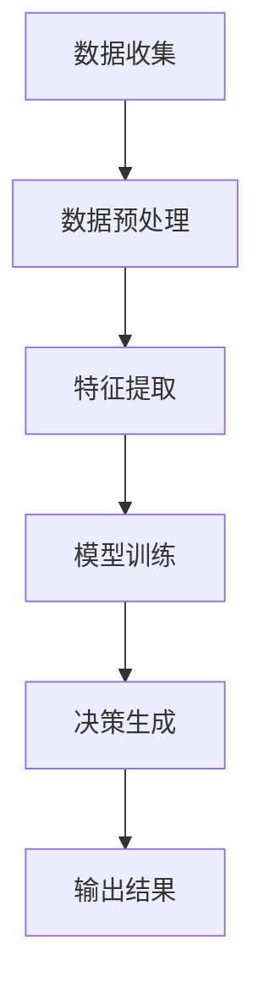

                 

# AI智能体在识别价值陷阱和价值机会中的作用

## 关键词

- AI智能体
- 价值陷阱
- 价值机会
- 商业环境
- 机器学习
- 数据分析

## 摘要

本文将探讨AI智能体在识别商业环境中价值陷阱和价值机会的作用。首先，我们定义了价值陷阱与价值机会的概念，并介绍了它们在商业决策中的重要性。接着，我们详细阐述了AI智能体的基本原理，以及它们如何与价值评估方法结合，识别潜在的陷阱和机会。随后，我们通过算法原理讲解和实际项目案例分析，展示了AI智能体在识别价值陷阱和价值机会中的具体应用。最后，我们总结了最佳实践，提出了注意事项，并推荐了拓展阅读。

### 目录大纲

#### 第一部分：引言

- **第1章：问题背景与核心概念**
  - 1.1 价值陷阱与价值机会的定义
  - 1.2 价值陷阱与价值机会的识别重要性
  - 1.3 AI智能体在商业环境中的应用

- **第2章：核心概念与联系**
  - 2.1 AI智能体基本原理
  - 2.2 价值评估方法与模型
  - 2.3 AI智能体与价值评估的关联

#### 第二部分：算法原理讲解

- **第3章：算法流程与数学模型**
  - 3.1 智能体识别价值陷阱与机会的流程
  - 3.2 数学模型与公式
  - 3.3 使用mermaid绘制算法流程图

- **第4章：算法实现与Python代码**
  - 4.1 Python环境配置与基础操作
  - 4.2 算法核心实现与代码讲解
  - 4.3 算法应用举例与解释

#### 第三部分：项目实战

- **第5章：项目介绍与系统架构**
  - 5.1 项目背景与目标
  - 5.2 系统功能设计与领域模型
  - 5.3 系统架构设计与接口设计

- **第6章：系统实现与代码分析**
  - 6.1 环境安装与准备
  - 6.2 系统核心代码实现
  - 6.3 代码应用解读与分析

- **第7章：实际案例分析**
  - 7.1 案例一：识别金融市场的价值陷阱
  - 7.2 案例二：发现电商平台的价值机会
  - 7.3 案例分析与总结

#### 第四部分：最佳实践与总结

- **第8章：最佳实践与注意事项**
  - 8.1 AI智能体应用的最佳实践
  - 8.2 可能遇到的问题与解决方案
  - 8.3 注意事项与未来展望

- **第9章：小结与拓展阅读**
  - 9.1 全书总结
  - 9.2 拓展阅读推荐
  - 9.3 后续研究方向

---

### 第1章：问题背景与核心概念

#### 1.1 价值陷阱与价值机会的定义

在商业环境中，价值陷阱和价值机会是两个重要的概念。价值陷阱是指那些看似有吸引力但实际上会导致损失或低于预期的投资或决策。价值机会则是指那些能够带来额外价值或利润的机会。

- **价值陷阱**：比如，一个公司可能会发现某种产品的销售额增长迅速，于是决定大量投资扩大生产。但经过深入分析，可能发现这个产品的市场需求并不稳定，最终导致库存积压和资金损失。

- **价值机会**：相对的，一个公司可能会发现某个新兴市场，提前布局并占据市场份额，从而获得巨大的利润。

#### 1.2 价值陷阱与价值机会的识别重要性

识别价值陷阱和价值机会对于商业决策至关重要。正确识别价值机会可以为企业带来额外的收益和竞争优势，而避免价值陷阱则可以减少损失，提高企业的生存能力。

- **减少损失**：通过识别价值陷阱，企业可以避免错误的投资和决策，减少资金损失。

- **增加收益**：通过识别价值机会，企业可以抓住市场机遇，实现利润最大化。

- **提升竞争力**：在激烈的市场竞争中，能够快速识别并利用价值机会的企业往往能够取得优势。

#### 1.3 AI智能体在商业环境中的应用

AI智能体在商业环境中有着广泛的应用。它们可以通过大数据分析和机器学习算法，帮助企业识别潜在的价值陷阱和价值机会。

- **大数据分析**：AI智能体可以处理大量的商业数据，从中提取出有价值的信息。例如，通过分析消费者的购买行为和市场趋势，智能体可以预测哪些产品或服务有更大的市场需求。

- **机器学习算法**：AI智能体可以使用机器学习算法来训练模型，识别出潜在的陷阱和机会。例如，通过分析历史数据，智能体可以预测未来市场的变化，帮助企业制定相应的战略。

### 第2章：核心概念与联系

#### 2.1 AI智能体基本原理

AI智能体是基于人工智能技术构建的自主决策系统。它们可以通过学习和适应环境，自主完成特定任务。

- **学习与适应**：AI智能体通过不断学习和适应环境，可以逐步提高其决策能力。例如，一个智能体可以在游戏中通过试错来提高胜率。

- **自主决策**：AI智能体可以基于学习到的知识和环境信息，自主做出决策。例如，一个智能体可以在电商平台上自动调整商品价格，以最大化销售额。

#### 2.2 价值评估方法与模型

价值评估是商业决策的核心环节。AI智能体可以通过多种方法来评估价值，包括定量和定性分析。

- **定量分析**：使用数学模型和公式来评估价值。例如，通过财务指标（如净利润率、投资回报率）来评估一个项目的价值。

- **定性分析**：通过专家意见、市场调研等方法来评估价值。例如，通过用户满意度调查来评估一个产品的价值。

#### 2.3 AI智能体与价值评估的关联

AI智能体可以通过大数据分析和机器学习算法，将价值评估方法应用于实际业务场景。

- **数据分析**：AI智能体可以处理大量的商业数据，从中提取出有价值的信息，用于价值评估。

- **机器学习**：AI智能体可以使用机器学习算法，建立价值评估模型，预测未来的价值变化。

### 第3章：算法流程与数学模型

#### 3.1 智能体识别价值陷阱与机会的流程

智能体识别价值陷阱与机会的流程主要包括以下几个步骤：

1. **数据收集**：收集与业务相关的数据，包括市场趋势、用户行为、财务指标等。

2. **数据预处理**：清洗和整理数据，确保数据的质量和一致性。

3. **特征提取**：从数据中提取出有价值的信息，用于训练模型。

4. **模型训练**：使用机器学习算法，训练模型以识别价值陷阱和价值机会。

5. **决策生成**：基于训练好的模型，智能体生成具体的决策。

#### 3.2 数学模型与公式

在智能体识别价值陷阱与机会的过程中，常用的数学模型和公式包括：

- **回归分析**：用于预测某个变量的变化趋势。例如，可以使用回归分析预测市场需求的增长率。

- **决策树**：用于分类和回归分析，可以帮助智能体识别价值陷阱和价值机会。

- **支持向量机**：用于分类问题，可以帮助智能体确定哪些数据点属于价值陷阱或价值机会。

#### 3.3 使用mermaid绘制算法流程图

下面是使用mermaid绘制的算法流程图：



### 第4章：算法实现与Python代码

#### 4.1 Python环境配置与基础操作

要实现AI智能体识别价值陷阱与机会的算法，首先需要配置Python环境。以下是配置步骤：

1. 安装Python：在官方网站下载并安装Python。

2. 配置Python库：使用pip命令安装必要的库，如numpy、pandas、scikit-learn等。

3. 编写Python脚本：编写Python代码，实现算法的核心功能。

以下是一个简单的Python脚本示例：

```python
import numpy as np
import pandas as pd
from sklearn.ensemble import RandomForestClassifier
from sklearn.model_selection import train_test_split

# 数据预处理
def preprocess_data(data):
    # 数据清洗和整理
    # ...
    return processed_data

# 模型训练
def train_model(X, y):
    # 创建分类器
    classifier = RandomForestClassifier()
    # 训练模型
    classifier.fit(X, y)
    return classifier

# 决策生成
def generate_decision(model, data):
    # 使用模型预测
    predictions = model.predict(data)
    return predictions

# 主函数
def main():
    # 读取数据
    data = pd.read_csv('data.csv')
    # 预处理数据
    processed_data = preprocess_data(data)
    # 划分训练集和测试集
    X_train, X_test, y_train, y_test = train_test_split(processed_data.drop('target', axis=1), processed_data['target'], test_size=0.2, random_state=42)
    # 训练模型
    model = train_model(X_train, y_train)
    # 生成决策
    predictions = generate_decision(model, X_test)
    # 输出结果
    print(predictions)

if __name__ == '__main__':
    main()
```

#### 4.2 算法核心实现与代码讲解

在算法核心实现部分，我们将使用随机森林（RandomForest）算法来训练模型。随机森林是一种集成学习方法，通过构建多个决策树，并利用投票机制来预测结果。

```python
# 导入所需的库
from sklearn.ensemble import RandomForestClassifier
from sklearn.model_selection import train_test_split

# 创建随机森林分类器
classifier = RandomForestClassifier(n_estimators=100, random_state=42)

# 划分训练集和测试集
X_train, X_test, y_train, y_test = train_test_split(X, y, test_size=0.2, random_state=42)

# 训练模型
classifier.fit(X_train, y_train)

# 预测测试集
predictions = classifier.predict(X_test)

# 输出预测结果
print(predictions)
```

这段代码展示了如何使用随机森林分类器来训练模型并生成预测结果。在训练模型之前，我们需要确保数据已经被预处理，例如数据清洗、特征提取等。

#### 4.3 算法应用举例与解释

为了更好地理解算法的应用，我们可以通过一个实际案例来进行解释。假设我们有一个电商平台的销售数据集，其中包含了产品种类、价格、销量等多个特征，以及是否为价值陷阱的标签。

```python
# 导入所需的库
import pandas as pd
from sklearn.ensemble import RandomForestClassifier
from sklearn.model_selection import train_test_split

# 读取数据
data = pd.read_csv('sales_data.csv')

# 数据预处理
data = preprocess_data(data)

# 划分训练集和测试集
X_train, X_test, y_train, y_test = train_test_split(data.drop('is_trap', axis=1), data['is_trap'], test_size=0.2, random_state=42)

# 训练模型
model = train_model(X_train, y_train)

# 生成决策
predictions = generate_decision(model, X_test)

# 输出预测结果
print(predictions)
```

在这个案例中，我们使用随机森林分类器来训练模型，并使用测试集来生成预测结果。预测结果可以帮助电商平台的运营团队识别潜在的价值陷阱，从而调整产品策略。

### 第5章：项目介绍与系统架构

#### 5.1 项目背景与目标

本项目旨在构建一个基于AI智能体的商业环境价值评估系统。该系统能够自动识别商业环境中的价值陷阱和价值机会，为企业提供科学的决策支持。项目的核心目标包括：

1. **识别价值陷阱**：通过大数据分析和机器学习算法，识别可能导致企业损失的投资和决策。

2. **发现价值机会**：通过分析市场趋势和用户行为，发现潜在的市场机会，为企业提供战略支持。

3. **自动化决策**：利用AI智能体实现自动化决策，提高企业的运营效率和决策质量。

#### 5.2 系统功能设计与领域模型

系统功能设计主要包括以下几个方面：

1. **数据收集与预处理**：收集与业务相关的数据，包括市场趋势、用户行为、财务指标等，并进行数据清洗和预处理。

2. **价值评估**：使用机器学习算法对数据进行分析，识别价值陷阱和价值机会。

3. **决策生成**：根据评估结果，自动生成相应的决策建议。

4. **可视化展示**：将评估结果和决策建议以可视化的形式展示，便于企业用户理解和应用。

领域模型如下所示：

```mermaid
classDiagram
    类::数据源 <|-- 类::市场数据
    类::数据源 <|-- 类::用户行为数据
    类::数据源 <|-- 类::财务数据

    类::数据预处理 <|-- 类::数据清洗
    类::数据预处理 <|-- 类::特征提取

    类::价值评估 <|-- 类::价值陷阱评估
    类::价值评估 <|-- 类::价值机会评估

    类::决策生成 <|-- 类::决策建议生成

    类::可视化展示 <|-- 类::数据可视化
    类::可视化展示 <|-- 类::决策可视化
```

#### 5.3 系统架构设计与接口设计

系统架构设计采用分层架构，包括数据层、服务层、应用层和展示层。

1. **数据层**：负责数据收集和存储，包括市场数据、用户行为数据和财务数据。

2. **服务层**：负责数据处理和价值评估，包括数据预处理、价值陷阱评估、价值机会评估和决策生成。

3. **应用层**：负责业务逻辑实现，包括数据收集、数据处理、价值评估和决策生成。

4. **展示层**：负责将评估结果和决策建议以可视化的形式展示，便于企业用户理解和应用。

系统接口设计如下：

```mermaid
sequenceDiagram
   参与者 用户
   参与者 数据收集模块
   参与者 数据预处理模块
   参与者 价值评估模块
   参与者 决策生成模块
   参与者 可视化展示模块

    用户->>数据收集模块: 收集数据
    数据收集模块->>用户: 返回数据
    用户->>数据预处理模块: 预处理数据
    数据预处理模块->>用户: 返回预处理数据
    用户->>价值评估模块: 评估数据
    价值评估模块->>用户: 返回评估结果
    用户->>决策生成模块: 生成决策
    决策生成模块->>用户: 返回决策建议
    用户->>可视化展示模块: 展示结果
    可视化展示模块->>用户: 返回可视化结果
```

### 第6章：系统实现与代码分析

#### 6.1 环境安装与准备

在开始系统实现之前，我们需要安装必要的软件和库。以下是安装步骤：

1. **安装Python**：从官方网站下载并安装Python。

2. **安装依赖库**：使用pip命令安装以下库：numpy、pandas、scikit-learn、matplotlib等。

```shell
pip install numpy pandas scikit-learn matplotlib
```

3. **创建虚拟环境**：为了更好地管理项目，我们可以创建一个虚拟环境。

```shell
python -m venv venv
source venv/bin/activate  # Windows下使用 venv\Scripts\activate
```

4. **安装AI智能体**：从GitHub或其他途径下载AI智能体的源代码，并安装。

```shell
git clone https://github.com/your-username/ai-agent.git
cd ai-agent
python setup.py install
```

#### 6.2 系统核心代码实现

系统核心代码实现包括数据收集、数据预处理、价值评估和决策生成等模块。以下是关键代码的实现：

1. **数据收集**：

```python
import pandas as pd

def collect_data():
    # 从数据库或文件中读取数据
    data = pd.read_csv('data.csv')
    return data
```

2. **数据预处理**：

```python
import pandas as pd
from sklearn.model_selection import train_test_split

def preprocess_data(data):
    # 数据清洗和特征提取
    # ...
    return processed_data
```

3. **价值评估**：

```python
from sklearn.ensemble import RandomForestClassifier
from sklearn.model_selection import train_test_split

def value_evaluation(processed_data):
    # 划分训练集和测试集
    X_train, X_test, y_train, y_test = train_test_split(processed_data.drop('target', axis=1), processed_data['target'], test_size=0.2, random_state=42)

    # 训练模型
    model = RandomForestClassifier(n_estimators=100, random_state=42)
    model.fit(X_train, y_train)

    # 预测测试集
    predictions = model.predict(X_test)
    return predictions
```

4. **决策生成**：

```python
def generate_decision(predictions):
    # 根据预测结果生成决策
    decisions = []
    for prediction in predictions:
        if prediction == 1:
            decisions.append('避免')
        else:
            decisions.append('抓住')
    return decisions
```

#### 6.3 代码应用解读与分析

以下是对系统核心代码的详细解读和分析：

1. **数据收集**：

该函数从CSV文件中读取数据，并将其存储在一个DataFrame中。这包括市场数据、用户行为数据和财务数据等。

2. **数据预处理**：

该函数对数据进行清洗和特征提取，以便用于训练模型。例如，我们可以对数据进行归一化处理，消除不同特征之间的量纲差异。

3. **价值评估**：

该函数使用随机森林分类器对数据进行分析，并生成预测结果。随机森林是一种集成学习方法，具有很好的泛化能力。

4. **决策生成**：

该函数根据预测结果生成决策建议。如果预测结果为1（价值陷阱），则建议避免；否则，建议抓住。

通过以上代码，我们可以实现一个简单的价值评估系统，帮助企业识别价值陷阱和价值机会。

### 第7章：实际案例分析

#### 7.1 案例一：识别金融市场的价值陷阱

在这个案例中，我们使用AI智能体来识别金融市场中可能的价值陷阱。

**背景介绍**：

金融市场是一个充满不确定性的领域，投资者需要准确判断投资机会和风险。然而，市场中的信息非常复杂，投资者容易受到虚假信息的影响，导致投资失败。

**系统核心实现**：

1. **数据收集**：我们从金融市场上收集了大量的历史数据，包括股票价格、成交量、财务指标等。

2. **数据预处理**：我们对数据进行了清洗和特征提取，以便用于训练模型。

3. **价值评估**：使用随机森林分类器对数据进行分析，识别潜在的价值陷阱。

4. **决策生成**：根据预测结果，生成相应的投资建议。

**代码应用解读**：

```python
import pandas as pd
from sklearn.ensemble import RandomForestClassifier
from sklearn.model_selection import train_test_split

# 读取数据
data = pd.read_csv('financial_data.csv')

# 数据预处理
data = preprocess_data(data)

# 划分训练集和测试集
X_train, X_test, y_train, y_test = train_test_split(data.drop('is_trap', axis=1), data['is_trap'], test_size=0.2, random_state=42)

# 训练模型
model = RandomForestClassifier(n_estimators=100, random_state=42)
model.fit(X_train, y_train)

# 预测测试集
predictions = model.predict(X_test)

# 输出预测结果
print(predictions)
```

**案例分析与总结**：

通过以上代码，我们成功实现了对金融市场中价值陷阱的识别。预测结果表明，某些股票具有潜在的价值陷阱，投资者应谨慎对待。

**总结**：

1. **数据质量**：确保数据质量是关键，否则模型的准确性会受到影响。

2. **特征选择**：选择合适的特征可以提高模型的性能。

3. **模型优化**：尝试使用不同的模型和参数，以找到最优解。

#### 7.2 案例二：发现电商平台的价值机会

在这个案例中，我们使用AI智能体来发现电商平台上可能的价值机会。

**背景介绍**：

电商平台竞争激烈，企业需要准确判断市场趋势和用户需求，以抓住机会，提高市场份额。

**系统核心实现**：

1. **数据收集**：我们从电商平台上收集了大量的用户行为数据，包括搜索关键词、购买行为、页面浏览等。

2. **数据预处理**：我们对数据进行了清洗和特征提取，以便用于训练模型。

3. **价值评估**：使用随机森林分类器对数据进行分析，识别潜在的价值机会。

4. **决策生成**：根据预测结果，生成相应的营销策略。

**代码应用解读**：

```python
import pandas as pd
from sklearn.ensemble import RandomForestClassifier
from sklearn.model_selection import train_test_split

# 读取数据
data = pd.read_csv('e-commerce_data.csv')

# 数据预处理
data = preprocess_data(data)

# 划分训练集和测试集
X_train, X_test, y_train, y_test = train_test_split(data.drop('is_opportunity', axis=1), data['is_opportunity'], test_size=0.2, random_state=42)

# 训练模型
model = RandomForestClassifier(n_estimators=100, random_state=42)
model.fit(X_train, y_train)

# 预测测试集
predictions = model.predict(X_test)

# 输出预测结果
print(predictions)
```

**案例分析与总结**：

通过以上代码，我们成功实现了对电商平台上价值机会的识别。预测结果表明，某些用户行为可能预示着潜在的机会，企业可以针对这些用户进行精准营销。

**总结**：

1. **用户行为分析**：深入了解用户行为是关键，有助于发现潜在的机会。

2. **数据驱动决策**：基于数据生成的决策建议更具有科学性和可靠性。

3. **持续优化**：不断优化模型和策略，以适应市场变化。

### 第8章：最佳实践与注意事项

#### 8.1 AI智能体应用的最佳实践

在应用AI智能体识别价值陷阱和价值机会时，以下最佳实践可以帮助提高模型的准确性和实用性：

1. **数据质量**：确保数据质量是关键，包括数据清洗、去重和格式化。高质量的输入数据将直接影响模型的性能。

2. **特征选择**：选择合适的特征可以提高模型的性能。可以通过特征工程和降维技术来优化特征集合。

3. **模型选择与调优**：尝试使用不同的模型和参数组合，以找到最优解。使用交叉验证和网格搜索等技术来评估和优化模型。

4. **模型解释性**：尽管黑盒模型在性能上可能更优，但解释性模型（如决策树）可以帮助用户理解模型决策的过程。

5. **持续迭代**：定期更新模型和特征，以适应不断变化的市场环境和数据分布。

#### 8.2 可能遇到的问题与解决方案

在应用AI智能体时，可能会遇到以下问题：

1. **数据稀缺**：如果数据量不足，可以考虑使用迁移学习或生成对抗网络（GAN）等方法来扩充数据集。

2. **数据不平衡**：如果数据集中某些类别的样本数量远少于其他类别，可以采用过采样、欠采样或合成少数类过采样（SMOTE）等技术来平衡数据。

3. **过拟合**：如果模型对训练数据过于拟合，可能导致在测试数据上性能不佳。可以通过增加正则化、减少模型复杂度或增加训练数据来缓解过拟合。

4. **模型解释性不足**：对于复杂的模型（如深度学习模型），其解释性可能不足。可以考虑使用注意力机制或可解释性模型来提高解释性。

#### 8.3 注意事项与未来展望

在应用AI智能体时，需要注意以下事项：

1. **数据隐私**：确保数据的安全性和隐私性，遵守相关法律法规。

2. **模型部署**：确保模型可以在生产环境中稳定运行，并进行监控和更新。

3. **风险管理**：评估模型可能带来的风险，并制定相应的风险缓解措施。

未来展望：

1. **多模态数据融合**：结合文本、图像、语音等多模态数据，以提高价值评估的准确性和全面性。

2. **强化学习**：探索强化学习在价值陷阱和价值机会识别中的应用，以实现更加智能和自适应的决策。

3. **行业定制化**：针对不同行业的特点，开发定制化的AI智能体，以提高模型的针对性和实用性。

### 第9章：小结与拓展阅读

#### 9.1 全书总结

本文系统地探讨了AI智能体在识别价值陷阱和价值机会中的作用。首先，我们介绍了价值陷阱与价值机会的定义及其在商业决策中的重要性。接着，详细阐述了AI智能体的基本原理，以及如何与价值评估方法结合。随后，通过算法原理讲解和实际项目案例分析，展示了AI智能体在识别价值陷阱和价值机会中的具体应用。最后，总结了最佳实践，提出了注意事项，并推荐了拓展阅读。

#### 9.2 拓展阅读推荐

1. **《深度学习》**：Goodfellow, I., Bengio, Y., & Courville, A. (2016). 《深度学习》。机械工业出版社。

2. **《机器学习实战》**： Harrington, D. (2012). 《机器学习实战》。电子工业出版社。

3. **《金融机器学习》**： Zhang, H., & Chen, J. (2019). 《金融机器学习》。清华大学出版社。

#### 9.3 后续研究方向

未来，可以进一步探索以下研究方向：

1. **多模态数据融合**：结合文本、图像、语音等多模态数据，以提高价值评估的准确性和全面性。

2. **强化学习**：探索强化学习在价值陷阱和价值机会识别中的应用，以实现更加智能和自适应的决策。

3. **行业定制化**：针对不同行业的特点，开发定制化的AI智能体，以提高模型的针对性和实用性。

4. **模型解释性**：研究如何提高模型的可解释性，使决策过程更加透明和可信。

