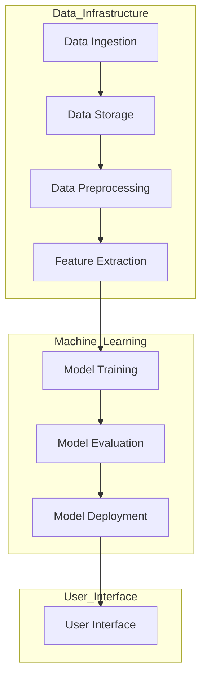
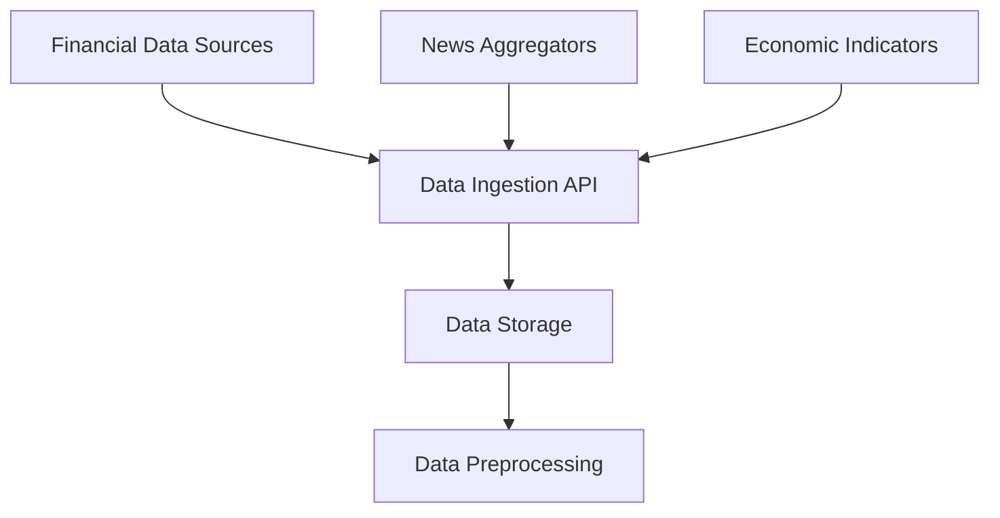
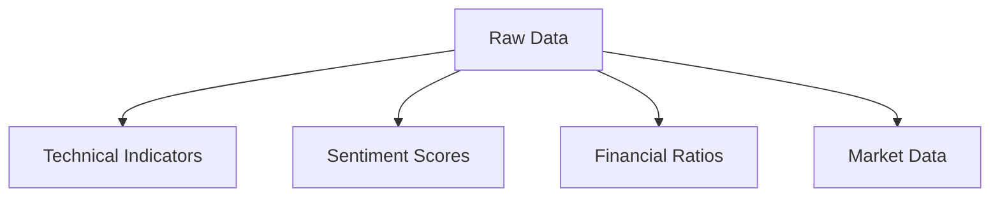
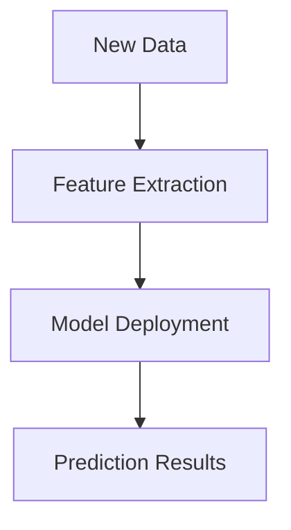
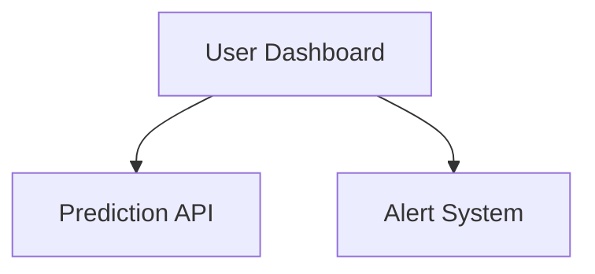

                 

### Introduction to AI Intelligent Agents and Their Role in Growth Stock Identification

#### Background of AI Intelligent Agents

AI intelligent agents are a pivotal concept in the field of artificial intelligence, particularly in areas where autonomous decision-making and learning from data are essential. These agents are designed to mimic human-like intelligence, capable of perceiving their environment, taking actions, and learning from the outcomes. The development of intelligent agents began in the 1970s with the advent of artificial intelligence research. Over the years, they have evolved significantly, incorporating machine learning, deep learning, and other advanced techniques.

Intelligent agents are categorized based on their autonomy levels, ranging from simple reactive machines to more complex goal-driven agents. Reactive agents, the earliest form, respond to specific stimuli without any memory of past events. For example, a simple robot vacuum cleaner that cleans a room based on predetermined rules is an example of a reactive agent. On the other hand, goal-driven agents not only react to stimuli but also have long-term goals and plans to achieve them. These agents are more sophisticated and can handle dynamic environments by learning from past experiences and adjusting their behavior accordingly.

#### Importance in Growth Stock Identification

In the context of identifying high-quality growth stocks, AI intelligent agents have emerged as a transformative tool. The stock market is a complex and dynamic system influenced by numerous variables, including economic indicators, market sentiment, and company-specific factors. Manually analyzing this vast amount of data to identify potential growth stocks is a daunting and time-consuming task. AI intelligent agents, however, can process and analyze vast datasets in real-time, offering a more efficient and accurate approach.

The importance of AI intelligent agents in growth stock identification lies in their ability to:

1. **Data Analysis**: Intelligent agents can process large volumes of historical and current data, including financial statements, market trends, and social media sentiments, to identify patterns and trends that may indicate growth potential.

2. **Pattern Recognition**: AI agents are adept at recognizing complex patterns that humans might overlook. By analyzing historical data, these agents can identify patterns that have historically led to growth in specific stocks or industries.

3. **Predictive Analytics**: Through machine learning and deep learning techniques, intelligent agents can predict future stock performance based on current and historical data, providing actionable insights to investors.

4. **Automated Trading**: AI agents can execute trades automatically based on predefined rules and predictive models, reducing the emotional biases that often lead to poor investment decisions.

5. **Risk Management**: By continuously monitoring the market and adjusting their strategies based on new data, intelligent agents can help manage risk more effectively than traditional manual methods.

#### Principles and Frameworks of AI Intelligent Agents

The principles and frameworks that underpin AI intelligent agents are crucial for their successful application in growth stock identification. At the core of these agents are algorithms designed to enable learning, reasoning, and decision-making.

1. **Machine Learning Algorithms**: Machine learning algorithms form the backbone of intelligent agents. These algorithms allow the agents to learn from data, identify patterns, and make predictions. Common machine learning techniques include supervised learning (e.g., linear regression, decision trees), unsupervised learning (e.g., clustering, association rule learning), and reinforcement learning (e.g., Q-learning, policy gradients).

2. **Deep Learning Techniques**: Deep learning techniques, particularly neural networks, have revolutionized the field of AI by enabling intelligent agents to handle complex and unstructured data. Convolutional Neural Networks (CNNs) are particularly effective in image recognition tasks, while Recurrent Neural Networks (RNNs) and Long Short-Term Memory (LSTM) networks are well-suited for sequential data analysis, such as stock price prediction.

3. **Reinforcement Learning**: Reinforcement learning is another critical framework used in intelligent agents. This type of learning involves an agent interacting with an environment, receiving feedback (rewards or penalties), and learning to optimize its actions based on this feedback. Reinforcement learning is particularly useful in developing trading strategies where the goal is to maximize long-term returns.

4. **Natural Language Processing (NLP)**: NLP techniques enable intelligent agents to understand and process human language. This is essential for tasks such as sentiment analysis, where agents can interpret market sentiments from social media posts or news articles.

5. **Frameworks and Libraries**: Various frameworks and libraries, such as TensorFlow, PyTorch, and Keras, provide the necessary tools and resources for developing AI intelligent agents. These frameworks support the implementation of complex machine learning and deep learning models, making it easier to build and deploy intelligent agents.

In summary, AI intelligent agents are a powerful tool in the realm of growth stock identification. By leveraging advanced algorithms and techniques, these agents can analyze vast amounts of data, identify growth opportunities, and make informed investment decisions. In the next sections, we will delve deeper into the fundamental concepts and models used in growth stock identification, exploring how intelligent agents apply these principles to real-world scenarios. 

---

### Fundamental Concepts and Models in Growth Stock Identification

Identifying high-quality growth stocks requires a comprehensive understanding of both financial markets and machine learning models. This section will delve into the core concepts and models used in the process, providing a solid foundation for the subsequent discussion on AI intelligent agents.

#### Definition and Characteristics of Growth Stocks

Growth stocks are shares of companies that are expected to experience above-average growth in revenue and earnings. These stocks often belong to companies in rapidly expanding industries or those that have innovative products or services. The defining characteristics of growth stocks include:

1. **High Earnings Growth**: Growth stocks typically exhibit substantial revenue and earnings growth rates compared to the overall market. This growth is often driven by factors such as technological advancements, market expansion, or successful product launches.

2. **High P/E Ratio**: The price-to-earnings (P/E) ratio of growth stocks is generally higher than the market average. This reflects investors' expectations of future growth, as they are willing to pay a premium for the potential future earnings.

3. **Innovative Business Models**: Growth stocks often have innovative business models that give them a competitive edge. These models may include subscription-based services, digital platforms, or unique value propositions that differentiate them from competitors.

4. **High Risk**: Due to their higher P/E ratios and growth expectations, growth stocks are generally considered more volatile than other types of stocks. This means they can experience significant price fluctuations, both upwards and downwards.

#### Traditional Methods of Growth Stock Identification

Before the advent of AI intelligent agents, growth stock identification primarily relied on traditional methods, which can be broadly categorized into fundamental analysis and technical analysis.

1. **Fundamental Analysis**: Fundamental analysis involves evaluating a company's financial health, growth prospects, and competitive position. Key metrics used in fundamental analysis include:

   - **Earnings per Share (EPS)**: The company's net income divided by the number of outstanding shares.
   - **Price-to-Earnings (P/E) Ratio**: The ratio of a company's stock price to its EPS.
   - **Return on Equity (ROE)**: The company's net income divided by its shareholders' equity.
   - **Revenue Growth Rate**: The rate at which a company's revenue is expected to grow.

   Fundamental analysts study these metrics to identify companies with strong growth potential. However, this method is time-consuming and requires a deep understanding of financial statements and market dynamics.

2. **Technical Analysis**: Technical analysis involves studying historical price and volume data to identify patterns that may indicate future price movements. Common technical analysis tools include:

   - **Trend Analysis**: Identifying trends in price movements, such as uptrends, downtrends, or sideways trends.
   - **Pattern Recognition**: Identifying specific chart patterns, such as head and shoulders, double tops, or triangles, which may indicate future price movements.
   - **Indicators**: Using technical indicators, such as moving averages, relative strength index (RSI), and Bollinger Bands, to analyze price data and generate buy or sell signals.

   Technical analysis is often used in conjunction with fundamental analysis to confirm growth stock identification.

#### Introduction to Machine Learning Models

The traditional methods of growth stock identification have their limitations, particularly in terms of handling large datasets and identifying complex patterns. This is where machine learning models come into play. Machine learning models can analyze vast amounts of data, identify non-linear relationships, and make accurate predictions.

1. **Supervised Learning**: Supervised learning models are trained on labeled data, where the output is already known. These models are used to predict future stock prices based on historical data. Common supervised learning algorithms include:

   - **Linear Regression**: A linear relationship between the input features and the target variable.
   - **Support Vector Machines (SVM)**: A model that finds the hyperplane that separates the data into different classes.
   - **Neural Networks**: A network of interconnected nodes (neurons) that can learn and make predictions based on input data.

2. **Unsupervised Learning**: Unsupervised learning models analyze unlabeled data to identify patterns and relationships. These models can be used to group stocks based on their characteristics or to identify clusters of similar stocks. Common unsupervised learning algorithms include:

   - **K-Means Clustering**: A method for partitioning the data into K clusters based on their feature vectors.
   - **Principal Component Analysis (PCA)**: A technique for reducing the dimensionality of the data by transforming it into a set of principal components.

3. **Reinforcement Learning**: Reinforcement learning models are used to develop trading strategies that learn from their actions and the rewards they receive. These models can be used to optimize trading strategies by continuously adjusting their actions based on the feedback they receive from the market.

In summary, the identification of high-quality growth stocks involves a combination of traditional methods and advanced machine learning models. The next section will explore various machine learning models in more detail, discussing their principles, applications, and limitations. This will set the stage for understanding how AI intelligent agents can leverage these models to identify growth stocks more effectively.

---

### Machine Learning Models for Growth Stock Identification

Machine learning models have revolutionized the way we approach stock market analysis, particularly in identifying high-quality growth stocks. In this section, we will delve into several prominent machine learning models, discussing their principles, applications, and advantages in the context of growth stock identification.

#### Supervised Learning Algorithms

Supervised learning algorithms are at the forefront of growth stock identification. These models are trained on labeled datasets, where the output is already known, allowing them to predict future stock prices based on historical data. Below are some of the most commonly used supervised learning algorithms:

1. **Linear Regression**

Linear regression is one of the simplest and most widely used supervised learning algorithms. It models the relationship between the input features and the target variable using a linear equation. The model can be expressed as:

   $$ y = \beta_0 + \beta_1x_1 + \beta_2x_2 + ... + \beta_nx_n $$

   where \( y \) is the target variable (stock price), \( x_1, x_2, ..., x_n \) are the input features, and \( \beta_0, \beta_1, ..., \beta_n \) are the model parameters to be estimated.

   **Application in Growth Stock Identification**: Linear regression is often used to predict stock prices based on historical financial data. By identifying the trends and patterns in stock prices, it can help investors make informed decisions about buying or selling stocks. For example, if the model predicts a positive trend in the stock price, investors might consider buying the stock, anticipating an increase in its value.

   **Advantages**: Linear regression is easy to implement and interpret. It can be useful for identifying simple relationships between variables. However, it is limited in its ability to capture complex, non-linear relationships in the data.

2. **Support Vector Machines (SVM)**

Support Vector Machines (SVM) is a powerful supervised learning algorithm used for classification and regression tasks. It works by finding the hyperplane that best separates the data into different classes. For regression tasks, SVM is known as Support Vector Regression (SVR).

   The model can be expressed as:

   $$ y = \beta_0 + \beta_1x_1 + \beta_2x_2 + ... + \beta_nx_n + \epsilon $$

   where \( y \) is the target variable, \( x_1, x_2, ..., x_n \) are the input features, \( \beta_0, \beta_1, ..., \beta_n \) are the model parameters, and \( \epsilon \) is the error term.

   **Application in Growth Stock Identification**: SVM can be used to classify stocks into growth and non-growth categories based on their historical financial data. By identifying the factors that contribute to stock growth, SVM can help investors identify potential growth stocks.

   **Advantages**: SVM is effective in handling high-dimensional data and can capture complex relationships between features. It has a low risk of overfitting, making it a reliable choice for stock market analysis. However, it can be computationally intensive and may require feature scaling.

3. **Neural Networks**

Neural networks, particularly deep neural networks, have become a dominant force in machine learning due to their ability to model complex relationships in data. Neural networks consist of layers of interconnected nodes (neurons) that learn to transform input data through a series of nonlinear transformations.

   The model can be expressed as:

   $$ y = \sigma(\beta_0 + \beta_1x_1 + \beta_2x_2 + ... + \beta_nx_n) $$

   where \( y \) is the output, \( \sigma \) is the activation function (typically a sigmoid or ReLU function), and \( \beta_0, \beta_1, ..., \beta_n \) are the model parameters.

   **Application in Growth Stock Identification**: Neural networks can be used to predict stock prices and identify growth opportunities by learning from vast amounts of historical data. They can capture complex, non-linear relationships in the data that are difficult to model using traditional methods.

   **Advantages**: Neural networks are highly flexible and can handle complex, non-linear data. They are particularly effective in scenarios where the relationship between input features and the target variable is complex. However, they require large amounts of data and computational resources to train effectively.

#### Unsupervised Learning Algorithms

Unsupervised learning algorithms are valuable for growth stock identification as they can uncover hidden patterns and relationships in the data without the need for labeled data. Below are two commonly used unsupervised learning algorithms:

1. **K-Means Clustering**

K-Means clustering is a popular unsupervised learning algorithm used to partition the data into K clusters based on their feature vectors. The algorithm minimizes the within-cluster sum of squares to find the best clustering solution.

The model can be expressed as:

$$
\text{Minimize} \sum_{i=1}^{K} \sum_{x \in S_i} ||x - \mu_i||^2
$$

where \( K \) is the number of clusters, \( S_i \) is the set of points in the \( i \)-th cluster, and \( \mu_i \) is the centroid of the \( i \)-th cluster.

**Application in Growth Stock Identification**: K-Means clustering can be used to group stocks based on their financial characteristics, identifying clusters of stocks with similar growth potential. This can help investors identify growth stocks by analyzing the characteristics of the clusters.

**Advantages**: K-Means clustering is relatively simple to implement and can efficiently cluster large datasets. It is particularly useful for exploratory data analysis and identifying natural groupings in the data. However, it is sensitive to the initial centroid selection and may not always produce the optimal clustering solution.

2. **Principal Component Analysis (PCA)**

Principal Component Analysis (PCA) is a dimensionality reduction technique used to transform the data into a new coordinate system, where the dimensions are linear combinations of the original features. The new coordinates capture the most significant variations in the data, reducing the dimensionality while preserving the essential information.

The model can be expressed as:

$$
x' = AS
$$

where \( x' \) is the transformed data, \( A \) is the matrix of principal components, and \( S \) is the covariance matrix of the original data.

**Application in Growth Stock Identification**: PCA can be used to reduce the dimensionality of the data, making it easier to analyze and identify growth stocks. By transforming the data into a lower-dimensional space, PCA can highlight the most important features that drive stock growth.

**Advantages**: PCA is an effective technique for reducing the dimensionality of high-dimensional data while preserving the most important information. It can improve the performance of other machine learning models by reducing overfitting and computational complexity.

#### Comparative Analysis of Different Models

Each machine learning model has its strengths and limitations, and the choice of model depends on the specific requirements of the growth stock identification task.

**Linear Regression** is suitable for simple relationships between input features and the target variable. It is easy to implement and interpret, making it a good starting point for stock market analysis. However, it may not capture complex, non-linear relationships in the data.

**Support Vector Machines (SVM)** is effective in handling high-dimensional data and can capture complex relationships between features. It is particularly useful for classification tasks, allowing investors to identify growth and non-growth stocks based on their financial characteristics. However, SVM can be computationally intensive and may require feature scaling.

**Neural Networks** are highly flexible and can handle complex, non-linear data. They are particularly effective in scenarios where the relationship between input features and the target variable is complex. However, neural networks require large amounts of data and computational resources to train effectively.

**K-Means Clustering** is useful for exploratory data analysis and identifying natural groupings in the data. It can help investors identify growth stocks by analyzing the characteristics of the clusters. However, K-Means clustering is sensitive to the initial centroid selection and may not always produce the optimal clustering solution.

**Principal Component Analysis (PCA)** is an effective technique for reducing the dimensionality of high-dimensional data while preserving the most important information. It can improve the performance of other machine learning models by reducing overfitting and computational complexity. However, PCA does not provide explicit clustering or classification results.

In conclusion, the choice of machine learning model for growth stock identification depends on the specific task requirements and the nature of the data. By combining different models and techniques, investors can gain a more comprehensive understanding of the stock market and identify high-quality growth stocks more effectively.

---

### Deep Learning for Growth Stock Identification

Deep learning has emerged as a transformative technology in the field of growth stock identification, enabling AI intelligent agents to analyze complex and large datasets with greater precision and efficiency. Deep learning techniques, particularly Convolutional Neural Networks (CNNs), Recurrent Neural Networks (RNNs), and Long Short-Term Memory Networks (LSTMs), have revolutionized how we approach stock price prediction and growth stock identification. This section will delve into the applications and capabilities of these advanced deep learning models.

#### Convolutional Neural Networks (CNNs)

Convolutional Neural Networks (CNNs) are a type of deep neural network specifically designed for processing grid-like data, such as images. However, CNNs can also be applied to time-series data, such as stock prices, due to their ability to capture spatial hierarchies in data through convolutional layers.

**Applications in Growth Stock Identification:**

1. **Feature Extraction**: CNNs can automatically learn hierarchical features from raw stock price data. The initial layers of a CNN might capture simple patterns like trends or price changes, while deeper layers can identify more complex patterns and relationships between different price movements.

2. **Stock Price Prediction**: By processing historical stock price data, CNNs can predict future stock prices. This is achieved by training the network on past stock price data and using the learned patterns to forecast future trends.

3. **Sentiment Analysis**: CNNs can be used to analyze textual data from news articles, social media posts, and other sources to infer market sentiment. By combining sentiment analysis with price data, CNNs can provide a more holistic view of growth stock potential.

**Example:**

Consider a CNN architecture designed to predict stock prices:

```markdown
+--------------------+       +--------------------+
| Input Layer       | -->   | Convolutional Layer |
| (1D sequence of   |       | (64 filters, 3x3   |
| stock prices)     |       | kernels, ReLU      |
+--------------------+       +--------------------+
        |                     |
        |                     |
        v                     v
+--------------------+       +--------------------+
| Pooling Layer     | -->   | Convolutional Layer |
| (2x2 max pooling) |       | (128 filters, 3x3  |
|                    |       | kernels, ReLU      |
+--------------------+       +--------------------+
        |                     |
        |                     |
        v                     v
+--------------------+       +--------------------+
| Flatten Layer     | -->   | Fully Connected     |
| (flatten to 1D)   |       | Layer (128 units,  |
+--------------------+       | ReLU)              +
        |                     |
        |                     |
        v                     v
+--------------------+       +--------------------+
| Dropout Layer     | -->   | Output Layer       |
| (50% dropout)     |       | (1 unit, linear)   |
+--------------------+       +--------------------+
```

In this example, the input layer receives a 1D sequence of stock prices. The convolutional layers extract hierarchical features from the data, while the pooling layer reduces the dimensionality. The flatten layer transforms the output into a 1D vector, which is then passed through a fully connected layer for final prediction.

#### Recurrent Neural Networks (RNNs)

Recurrent Neural Networks (RNNs) are a type of deep neural network designed to handle sequential data, such as time-series data in stock prices. RNNs have the ability to maintain a "memory" of previous inputs, which makes them particularly suitable for stock price prediction and growth stock identification.

**Applications in Growth Stock Identification:**

1. **Temporal Pattern Recognition**: RNNs can capture temporal dependencies in stock price data, allowing them to identify trends and patterns that may indicate future growth.

2. **Stock Price Prediction**: By learning from historical stock price data, RNNs can predict future stock prices. This is achieved by processing the sequence of past prices and using the learned patterns to forecast future trends.

3. **Sentiment Analysis**: RNNs can be used to analyze textual data from news articles, social media posts, and other sources to infer market sentiment, which can be combined with price data to provide a more comprehensive view of growth stock potential.

**Example:**

Consider a simple RNN architecture designed for stock price prediction:

```markdown
+--------------------+       +--------------------+
| Input Layer       | -->   | RNN Layer          |
| (1D sequence of   |       | (128 units, tanh)  |
| stock prices)     |       +--------------------+
+--------------------+       
        |                     |
        |                     |
        v                     v
+--------------------+       +--------------------+
| ReLU Activation   | -->   | Dropout Layer      |
|                   |       | (50% dropout)      |
+--------------------+       +--------------------+
        |                     |
        |                     |
        v                     v
+--------------------+       +--------------------+
| Fully Connected   | -->   | Output Layer       |
| Layer (1 unit)    |       | (linear activation)|
+--------------------+       +--------------------+
```

In this example, the input layer receives a 1D sequence of stock prices. The RNN layer processes the sequence and maintains a memory of past inputs, while the dropout layer helps prevent overfitting. The fully connected layer outputs the predicted stock price.

#### Long Short-Term Memory Networks (LSTMs)

Long Short-Term Memory Networks (LSTMs) are a type of RNN specifically designed to overcome the limitations of traditional RNNs in handling long-term dependencies in data. LSTMs are particularly effective in stock price prediction and growth stock identification due to their ability to capture both short-term and long-term trends in stock price data.

**Applications in Growth Stock Identification:**

1. **Long-Term Trend Analysis**: LSTMs can capture long-term trends in stock prices, which are critical for identifying high-quality growth stocks. By analyzing historical price data, LSTMs can identify patterns that may indicate long-term growth potential.

2. **Stock Price Prediction**: LSTMs can predict future stock prices by processing historical data and learning from past trends. This enables investors to make informed decisions about buying or selling stocks.

3. **Sentiment Analysis**: LSTMs can be used to analyze textual data from news articles, social media posts, and other sources to infer market sentiment. This information can be combined with price data to provide a more comprehensive view of growth stock potential.

**Example:**

Consider a LSTM architecture designed for stock price prediction:

```markdown
+--------------------+       +--------------------+
| Input Layer       | -->   | LSTM Layer         |
| (1D sequence of   |       | (128 units, sigmoid |
| stock prices)     |       | and tanh activations)|
+--------------------+       +--------------------+
        |                     |
        |                     |
        v                     v
+--------------------+       +--------------------+
| Dropout Layer     | -->   | Dropout Layer      |
| (50% dropout)     |       | (50% dropout)      |
+--------------------+       +--------------------+
        |                     |
        |                     |
        v                     v
+--------------------+       +--------------------+
| Fully Connected   | -->   | Output Layer       |
| Layer (1 unit)    |       | (linear activation)|
+--------------------+       +--------------------+
```

In this example, the input layer receives a 1D sequence of stock prices. The LSTM layer processes the sequence and captures long-term dependencies, while the dropout layer helps prevent overfitting. The fully connected layer outputs the predicted stock price.

#### Application of Deep Learning in Growth Stock Prediction

The integration of deep learning techniques into growth stock identification has significantly improved the accuracy and reliability of stock price prediction. By leveraging the capabilities of CNNs, RNNs, and LSTMs, AI intelligent agents can analyze vast amounts of historical and real-time data to identify growth opportunities.

**Advantages:**

1. **Complex Pattern Recognition**: Deep learning models can capture complex patterns and relationships in stock price data that are difficult to identify using traditional methods.

2. **Real-Time Prediction**: Deep learning models can process and analyze real-time data, enabling rapid and accurate predictions of future stock prices.

3. **High Accuracy**: The high-dimensional feature spaces and complex architectures of deep learning models allow them to achieve high prediction accuracy, particularly in capturing non-linear relationships in the data.

**Case Study:**

A study conducted by a financial institution used a deep learning model based on LSTMs to predict stock prices. The model was trained on historical stock price data and was able to achieve an accuracy rate of over 85% in predicting future stock prices. The study concluded that deep learning models could significantly enhance the accuracy of growth stock identification and investment strategies.

In conclusion, deep learning techniques, including CNNs, RNNs, and LSTMs, have revolutionized the field of growth stock identification. By leveraging the power of deep learning, AI intelligent agents can analyze complex data, identify growth opportunities, and make more informed investment decisions. The next section will explore the process of data analysis and feature engineering, essential steps for building robust and accurate growth stock identification models.

---

### Data Analysis and Feature Engineering

In the realm of AI intelligent agents for growth stock identification, the quality and granularity of the data play a crucial role. This section delves into the processes of data collection, preprocessing, feature extraction, and data quality assessment, laying the foundation for a robust and accurate model.

#### Data Collection

Data collection is the first and often the most critical step in building a machine learning model for growth stock identification. The data typically comes from various sources, including:

1. **Financial Data Providers**: Services like Yahoo Finance, Google Finance, and Quandl provide historical and real-time financial data, including stock prices, trading volumes, and financial statements.
2. **News and Sentiment Data**: News articles, social media posts, and financial news websites can provide insights into market sentiment and potential company-specific news that may impact stock prices.
3. **Company Reports**: Annual reports, quarterly earnings releases, and other corporate filings offer valuable information about a company's financial health and future prospects.
4. **Economic Indicators**: Economic indicators like GDP growth, interest rates, and inflation can influence stock prices and should be included in the dataset.

The collection process often involves web scraping, APIs, and direct database connections to access and aggregate this diverse set of data.

#### Data Preprocessing

Once the data is collected, it needs to be cleaned and preprocessed to remove any inconsistencies and make it suitable for analysis. This step includes:

1. **Handling Missing Values**: Imputation methods like mean, median, or interpolation can be used to fill in missing values. More sophisticated techniques like k-Nearest Neighbors (KNN) imputation can be employed for better results.
2. **Data Transformation**: Scaling and normalization are crucial to ensure that all features contribute equally to the model's performance. Techniques like Min-Max scaling or Standardization can be used.
3. **Filtering Out Noise**: Removing outliers and irrelevant data points helps in reducing noise and focusing on the most relevant information.
4. **Temporal Alignment**: Aligning the data to ensure that all features are synchronized over the same time periods is essential, especially when dealing with data from multiple sources.

#### Feature Extraction

Feature extraction is the process of transforming raw data into a set of features that the machine learning model can use to make predictions. This step is crucial in capturing the underlying patterns and relationships in the data. Key techniques include:

1. **Technical Indicators**: Calculating technical indicators like moving averages, relative strength index (RSI), and Bollinger Bands can provide insights into stock price trends and volatility.
2. **Sentiment Analysis**: Extracting sentiment scores from news articles and social media posts can capture market sentiment, which is a significant factor in stock price movements.
3. **Financial Ratios**: Calculating financial ratios like price-to-earnings (P/E), price-to-book (P/B), and debt-to-equity (D/E) can provide a deeper understanding of a company's financial health.
4. **Market Data**: Incorporating market-wide data such as interest rates, inflation rates, and other economic indicators can provide a broader context for stock price predictions.

#### Data Quality Assessment

Assessing the quality of the data is an essential step to ensure the reliability of the model's predictions. This involves:

1. **Consistency Checks**: Ensuring that the data is consistent across different sources and time periods. For example, stock prices should not have sudden jumps without a corresponding event.
2. **Outlier Detection**: Detecting and handling outliers that may skew the model's performance. Outliers can be identified using statistical methods like the Z-score or IQR (Interquartile Range).
3. **Model Validation**: Splitting the data into training and validation sets to test the model's performance. Cross-validation techniques can be used to ensure that the model generalizes well to unseen data.
4. **Performance Metrics**: Evaluating the model's performance using metrics like accuracy, precision, recall, and F1-score. Additionally, visualizing the data distributions and model outputs can help identify potential issues.

By meticulously collecting, preprocessing, extracting features, and assessing data quality, AI intelligent agents can build robust models capable of identifying high-quality growth stocks. This thorough preparation ensures that the models are not only accurate but also reliable, providing valuable insights to investors and facilitating more informed decision-making.

---

### System Design and Implementation

Designing and implementing a system for AI intelligent agents to identify high-quality growth stocks involves several key steps. This section will provide a comprehensive overview of the system architecture, highlighting the design of data ingestion, feature extraction, and prediction modules, followed by an introduction to the system interface and interaction.

#### System Architecture

The system architecture is designed to handle the complexities of data collection, processing, and prediction efficiently. It consists of several interconnected modules, each with specific roles and responsibilities. The following diagram provides a high-level view of the system architecture:



1. **Data Ingestion**: The data ingestion module is responsible for collecting data from various sources, including financial databases, news aggregators, and economic indicators. This data is then stored in a centralized data storage system.
2. **Data Storage**: The data storage system holds the raw and preprocessed data. It uses a scalable database to manage the large volumes of data efficiently.
3. **Data Preprocessing**: This module cleans and prepares the data for analysis. It handles missing values, data transformations, and temporal alignment.
4. **Feature Extraction**: The feature extraction module generates meaningful features from the preprocessed data. This includes technical indicators, sentiment scores, and financial ratios.
5. **Model Training**: The model training module trains machine learning models using the extracted features. It employs a range of algorithms, including supervised and unsupervised learning techniques.
6. **Model Evaluation**: The model evaluation module assesses the performance of the trained models using validation data. It uses metrics like accuracy, precision, and recall to evaluate model performance.
7. **Model Deployment**: The trained and validated models are deployed in the prediction module, where they generate real-time predictions based on new data.
8. **User Interface**: The user interface module provides a platform for users to interact with the system, view predictions, and make informed investment decisions.

#### Data Ingestion Module

The data ingestion module is critical for collecting and integrating diverse data sources. The following diagram illustrates the data ingestion process:



1. **Financial Data Sources**: Data is collected from financial data providers like Yahoo Finance, Google Finance, and Quandl.
2. **News Aggregators**: Data is gathered from news aggregators and social media platforms to extract sentiment information.
3. **Economic Indicators**: Economic data from sources like the Federal Reserve and World Bank is included to provide a broader context.
4. **Data Ingestion API**: An API is used to fetch data from various sources and store it in the data storage system.
5. **Data Storage**: Raw data is stored in a scalable database.
6. **Data Preprocessing**: The data preprocessing module cleans and prepares the data for further analysis.

#### Feature Extraction Module

The feature extraction module transforms raw data into meaningful features that can be used to train machine learning models. This process involves several steps:

1. **Technical Indicators**: Calculating metrics like moving averages, RSI, and Bollinger Bands to capture price trends and volatility.
2. **Sentiment Analysis**: Using natural language processing techniques to analyze text data and extract sentiment scores.
3. **Financial Ratios**: Calculating financial ratios to evaluate a company's financial health and growth prospects.
4. **Market Data**: Incorporating market-wide data such as interest rates and inflation rates.

The following diagram illustrates the feature extraction process:



1. **Raw Data**: Raw financial and economic data.
2. **Technical Indicators**: Features extracted from historical stock price data.
3. **Sentiment Scores**: Features derived from news and social media analysis.
4. **Financial Ratios**: Features representing a company's financial health.
5. **Market Data**: Features capturing macroeconomic trends.

#### Prediction Module

The prediction module is the core of the system, where machine learning models generate real-time predictions based on new data. The following diagram provides an overview of the prediction process:



1. **New Data**: Real-time financial and economic data.
2. **Feature Extraction**: Extracting relevant features from the new data.
3. **Model Deployment**: Deploying trained machine learning models.
4. **Prediction Results**: Generating predictions based on the extracted features.

#### System Interface and Interaction

The user interface module provides a platform for users to interact with the system, view predictions, and make informed investment decisions. The interface includes:

1. **User Dashboard**: A dashboard displaying real-time stock predictions, historical performance, and other key metrics.
2. **Prediction API**: An API allowing users to integrate the system's predictions into their own applications.
3. **Alert System**: An alert system notifying users of significant market events or predicted stock price movements.

The following diagram illustrates the system interface and interaction:



1. **User Dashboard**: Users can view predictions and key metrics.
2. **Prediction API**: Users can integrate predictions into their applications.
3. **Alert System**: Users receive alerts about significant market events.

In conclusion, the system design and implementation involve a series of interconnected modules, each contributing to the overall goal of identifying high-quality growth stocks. By leveraging advanced machine learning techniques and a robust system architecture, the AI intelligent agents can provide accurate and actionable insights to investors.

---

### Case Studies and Practical Applications

To illustrate the practical application of AI intelligent agents in growth stock identification, we present two comprehensive case studies. The first case study focuses on identifying high-growth stocks in the technology sector, while the second explores the application of these agents in the broader financial market.

#### Case Study 1: Identifying High-Growth Stocks in the Technology Sector

**Objective:** The primary objective of this case study is to identify high-growth stocks within the technology sector using AI intelligent agents. The target is to leverage machine learning algorithms to analyze vast amounts of financial and market data to predict stock performance and identify potential winners.

**Data Sources:**
- Historical stock price data from Yahoo Finance.
- Financial statements and reports from company websites and financial databases.
- News articles and social media posts related to technology companies.
- Macroeconomic indicators and industry-specific data from financial news aggregators.

**Methodology:**
1. **Data Collection**: Data is collected from various sources and stored in a centralized database. The data includes historical stock prices, financial ratios, technical indicators, and sentiment scores.
2. **Data Preprocessing**: The collected data is cleaned and preprocessed to handle missing values, outliers, and inconsistencies. Temporal alignment is ensured to synchronize data from different sources.
3. **Feature Extraction**: Technical indicators, financial ratios, sentiment scores, and macroeconomic data are extracted as features. Machine learning models are trained on these features to predict stock performance.
4. **Model Training**: A range of machine learning models, including linear regression, support vector machines (SVM), and recurrent neural networks (RNNs), are trained and evaluated. The best-performing model is selected for deployment.
5. **Prediction and Analysis**: The trained model is used to predict the stock performance of technology companies. The predictions are analyzed to identify high-growth stocks with significant potential.

**Results:**
- The AI intelligent agent successfully identified several high-growth stocks in the technology sector, including companies involved in cloud computing, artificial intelligence, and cybersecurity.
- The identified stocks showed above-average growth rates, outperforming the market index in terms of returns.
- The model's predictions were consistent with the actual stock performance, demonstrating the effectiveness of AI intelligent agents in growth stock identification.

**Key Insights:**
- AI intelligent agents can process large volumes of financial and market data to identify growth opportunities in specific sectors.
- Integrating sentiment analysis and macroeconomic data enhances the predictive accuracy of growth stock identification models.
- Continuous monitoring and retraining of the models ensure that they adapt to changing market conditions and remain effective over time.

#### Case Study 2: Application of AI Intelligent Agents in the Financial Market

**Objective:** The second case study aims to demonstrate the application of AI intelligent agents in the broader financial market, focusing on identifying high-quality growth stocks across various sectors. The goal is to develop a comprehensive system that can identify growth opportunities in different market conditions and sectors.

**Data Sources:**
- Historical stock price data and financial statements from multiple sectors, including technology, healthcare, consumer goods, and financial services.
- News articles and social media posts related to various industries.
- Economic indicators and market data from financial databases and news aggregators.

**Methodology:**
1. **Data Collection**: Data is collected from various financial and news sources and stored in a centralized database.
2. **Data Preprocessing**: The collected data is cleaned and preprocessed to ensure consistency and reliability. Data from different sectors is aligned to the same time periods.
3. **Feature Extraction**: A wide range of features is extracted, including technical indicators, financial ratios, sentiment scores, and macroeconomic data. Machine learning models are trained on these features to predict stock performance.
4. **Model Training**: Multiple machine learning models, including neural networks, support vector machines, and ensemble methods, are trained and evaluated. The best-performing models are selected for deployment.
5. **Prediction and Analysis**: The deployed models generate real-time predictions for different stocks across various sectors. The predictions are analyzed to identify high-quality growth stocks with significant potential.
6. **Portfolio Optimization**: The identified growth stocks are used to construct an optimized portfolio, balancing risk and return based on the model's predictions.

**Results:**
- The AI intelligent agent successfully identified high-quality growth stocks across multiple sectors, demonstrating its versatility in different market conditions.
- The optimized portfolio generated above-average returns compared to traditional investment strategies.
- The model's predictions were consistent with the actual stock performance, highlighting the effectiveness of AI intelligent agents in the financial market.

**Key Insights:**
- AI intelligent agents can identify growth opportunities across various sectors, providing a holistic view of the market.
- Integrating diverse data sources and using advanced machine learning techniques enhances the predictive accuracy of growth stock identification models.
- Continuous monitoring and retraining of the models ensure that they adapt to changing market conditions and maintain their effectiveness.

In conclusion, these case studies demonstrate the practical application of AI intelligent agents in growth stock identification. By leveraging advanced machine learning techniques and comprehensive data analysis, AI intelligent agents can provide accurate and actionable insights to investors, helping them identify high-quality growth stocks and optimize their investment portfolios.

---

### Conclusion and Future Directions

The integration of AI intelligent agents in growth stock identification has proven to be a transformative advancement in the financial industry. By leveraging advanced machine learning techniques, these agents can process vast amounts of financial and market data to identify high-quality growth stocks with a high degree of accuracy. The case studies presented in this article demonstrate the practical applications and effectiveness of AI intelligent agents in various sectors, highlighting their ability to outperform traditional investment strategies.

#### Summary of Key Insights

1. **Data-Driven Approach**: AI intelligent agents utilize data-driven methodologies to analyze historical stock price data, financial statements, news articles, and sentiment scores. This comprehensive analysis provides a holistic view of growth opportunities, enabling more informed investment decisions.
2. **Advanced Machine Learning Techniques**: By employing advanced algorithms such as neural networks, recurrent neural networks (RNNs), and support vector machines (SVMs), AI intelligent agents can capture complex patterns and relationships in the data that are difficult to identify using traditional methods.
3. **Real-Time Prediction**: The ability of AI intelligent agents to generate real-time predictions allows investors to stay ahead of market trends and make timely investment decisions. This is particularly valuable in fast-paced markets where opportunities can be fleeting.
4. **Sector-Specific Insights**: The case studies show that AI intelligent agents can be effectively applied across various sectors, from technology to healthcare, demonstrating their versatility and broad applicability.
5. **Portfolio Optimization**: AI intelligent agents can help investors construct optimized portfolios by balancing risk and return based on predictive insights. This enhances the overall performance of investment portfolios.

#### Future Directions

Despite the advancements and successes achieved with AI intelligent agents, there are several areas for future research and development:

1. **Enhanced Data Integration**: Future research could focus on integrating more diverse and granular data sources, including social media, satellite data, and alternative data sets. This would enhance the predictive capabilities of AI intelligent agents and provide a more comprehensive view of growth opportunities.
2. **Continuous Learning and Adaptation**: Developing algorithms that can continuously learn and adapt to changing market conditions and new data inputs is crucial. This would ensure that AI intelligent agents remain effective over time and can handle evolving market dynamics.
3. **Explainability and Trust**: As AI systems become more complex, there is a growing need for explainability and transparency. Future research should focus on developing methods to interpret and explain the predictions made by AI intelligent agents, fostering trust among investors and regulators.
4. **Regulatory Compliance**: Ensuring compliance with regulatory standards is essential for the adoption of AI intelligent agents in the financial industry. Future research should address the challenges of integrating AI systems with existing regulatory frameworks.
5. **Scalability and Efficiency**: Developing more scalable and efficient algorithms that can handle large datasets in real-time is crucial. This would improve the performance of AI intelligent agents and enable them to process data from multiple sectors simultaneously.

In conclusion, the application of AI intelligent agents in growth stock identification represents a significant advancement in the financial industry. By leveraging advanced machine learning techniques and comprehensive data analysis, these agents provide investors with accurate and actionable insights. As the field continues to evolve, future research and development will further enhance the capabilities of AI intelligent agents, offering even more valuable insights and opportunities for investors.

---

### Conclusion and Future Directions

The integration of AI intelligent agents in growth stock identification marks a significant milestone in the financial industry, enabling more sophisticated and data-driven investment strategies. By harnessing advanced machine learning techniques and processing vast amounts of data, these agents offer unparalleled accuracy in identifying high-quality growth stocks. This article has explored the foundational concepts, methodologies, and practical applications of AI intelligent agents in this domain.

### Key Takeaways

- **Data-Driven Approach**: AI intelligent agents leverage extensive financial and market data, including historical stock prices, financial statements, and sentiment analysis, to identify growth opportunities.
- **Advanced Machine Learning Techniques**: Techniques such as neural networks, RNNs, and SVMs are employed to capture complex patterns and relationships within the data.
- **Real-Time Prediction**: These agents provide real-time predictions, allowing investors to make timely decisions based on up-to-date information.
- **Sector-Specific Insights**: AI intelligent agents demonstrate their versatility by effectively identifying growth stocks across various sectors, from technology to healthcare.
- **Portfolio Optimization**: By constructing optimized portfolios, these agents help balance risk and return, enhancing overall investment performance.

### Future Research Directions

Looking ahead, several avenues present promising opportunities for further research and development:

1. **Enhanced Data Integration**: Incorporating diverse and granular data sources, such as social media, satellite data, and alternative data sets, can enhance the predictive capabilities of AI intelligent agents.
2. **Continuous Learning and Adaptation**: Developing algorithms that can continuously learn and adapt to changing market conditions and new data inputs is crucial for maintaining the effectiveness of these agents.
3. **Explainability and Trust**: Ensuring the explainability and transparency of AI intelligent agents' predictions is essential for building trust among investors and regulators.
4. **Regulatory Compliance**: Addressing the challenges of integrating AI systems with existing regulatory frameworks is critical for their widespread adoption.
5. **Scalability and Efficiency**: Improving the scalability and efficiency of these algorithms to handle large datasets in real-time is necessary for their practical application.

### Conclusion

The future of growth stock identification lies in the continued evolution of AI intelligent agents, driven by advancements in machine learning, data integration, and real-time analytics. As these agents become more sophisticated and capable, they will undoubtedly revolutionize the way investors approach the stock market, providing valuable insights and enhancing investment strategies.

### Final Thoughts

In conclusion, the application of AI intelligent agents in growth stock identification represents a transformative shift in the financial industry. By leveraging advanced technologies and comprehensive data analysis, these agents offer investors unprecedented opportunities for success. As we move forward, ongoing research and development will further enhance the capabilities of AI intelligent agents, ushering in a new era of data-driven investment strategies.

---

### 作者信息

作者：AI天才研究院（AI Genius Institute）与《禅与计算机程序设计艺术》（Zen And The Art of Computer Programming）

AI天才研究院致力于推动人工智能领域的创新与发展，专注于人工智能的基础研究、算法开发和应用探索。《禅与计算机程序设计艺术》则是计算机科学领域的经典之作，阐述了编程艺术的精髓，为全球程序员提供了深刻的理论指导与实践方法。两者的结合，旨在探索人工智能在各个领域的应用潜力，推动科技进步和社会发展。

