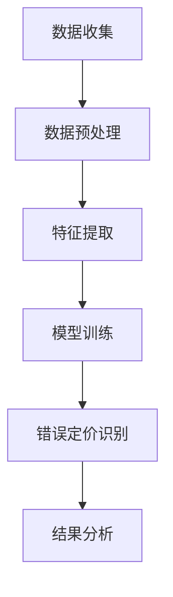
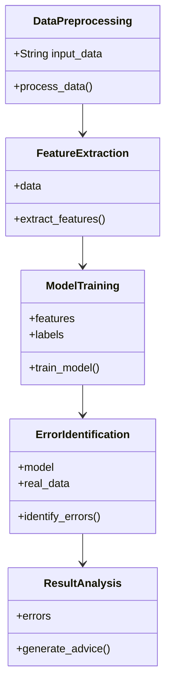
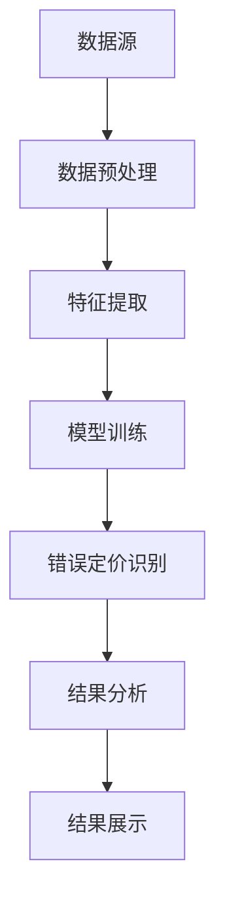
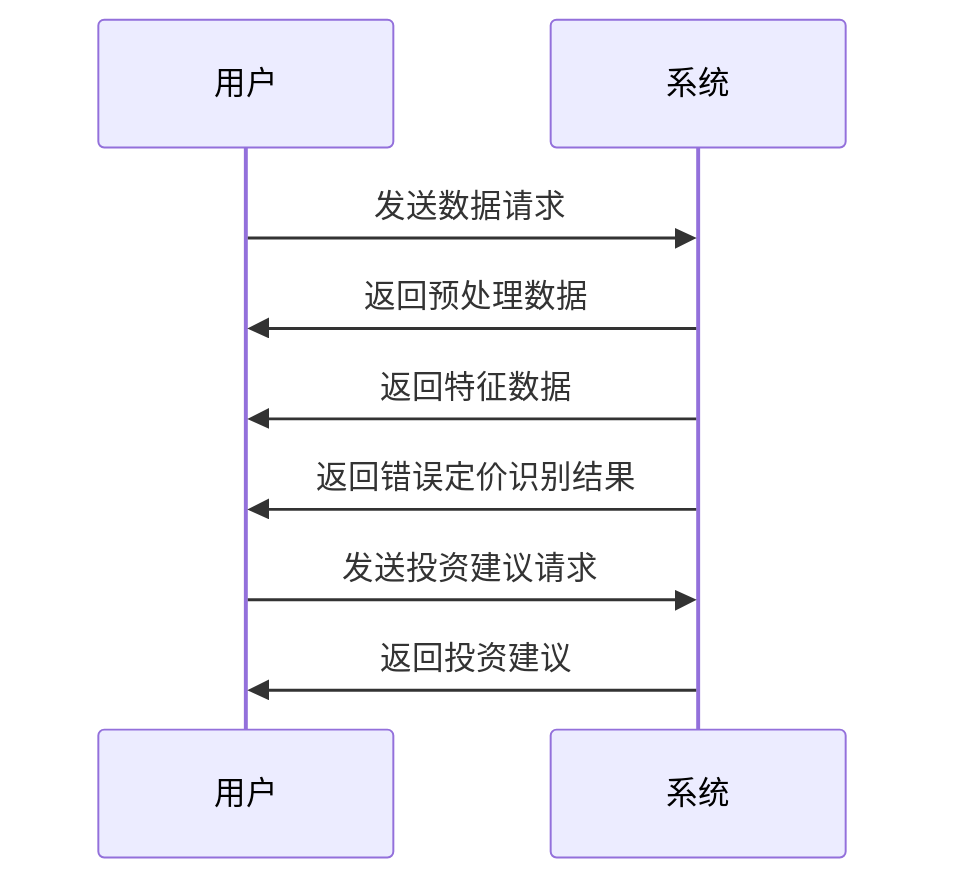
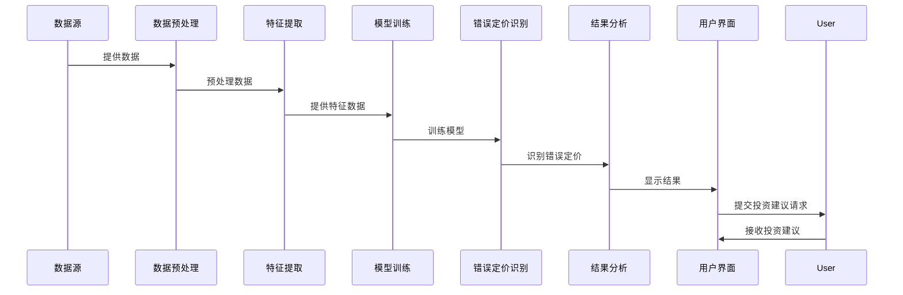

                 

### 让我们一起深入探讨：AI智能体如何识别并利用市场错误定价

#### **关键词**：AI智能体、市场错误定价、识别、利用、技术、算法、强化学习

#### **摘要**：
本文章将深入探讨AI智能体如何识别并利用市场错误定价。我们将首先介绍市场错误定价的概念、原因及其对市场的影响，然后详细解析AI智能体的定义、分类及其识别市场错误定价的核心概念与联系。接下来，我们重点讲解市场错误定价识别算法的原理和实现，并利用Python代码进行详细解释。随后，我们将分析系统架构设计，介绍项目实战过程和代码实现。最后，我们将总结最佳实践、注意事项以及未来的拓展方向。

### **一、引言与背景**

在快速发展的现代金融市场，投资者们常常面对大量复杂的信息和决策。市场价格的波动往往受到多种因素的影响，包括供需关系、宏观经济环境、投资者情绪等。在这种复杂的环境中，市场错误定价的现象时有发生。所谓市场错误定价，是指市场实际交易价格与其内在价值（或理论价格）之间存在偏差。

#### **1.1 问题背景**

**市场错误定价的概念**：
市场错误定价，是指某一资产（如股票、商品、货币等）的实际交易价格偏离了其真实价值，从而产生的一种市场现象。这种偏差可能是暂时的，也可能是长期的。

**市场错误定价的常见原因**：
- **信息不对称**：市场参与者获取信息的渠道和速度不同，导致某些投资者拥有更准确的信息，从而影响交易价格。
- **投资者行为**：投资者的非理性行为，如恐慌、贪婪、跟风等，会导致价格偏离其真实价值。
- **市场过度反应**：市场对某些事件或消息的反应可能过度，导致价格偏离其正常水平。

**AI智能体识别市场错误定价的重要性**：
识别市场错误定价对于投资者来说具有重要意义。通过AI智能体，投资者可以更高效地分析市场数据，发现潜在的错价机会，从而进行有效的投资决策。AI智能体的应用不仅提高了市场效率，还可能减少市场波动，稳定市场。

#### **1.2 AI智能体的定义与分类**

**AI智能体的基本定义**：
AI智能体（Artificial Intelligent Agent），是指能够感知环境，根据环境信息采取行动，并通过学习不断优化其行为的计算机程序。

**AI智能体的分类**：
- **基于规则的智能体**：通过预设规则进行决策。
- **基于模型的智能体**：利用预测模型进行决策。
- **基于学习的智能体**：通过学习历史数据，自主改进行为。

**AI智能体的发展历程**：
AI智能体的发展经历了从简单的基于规则的智能体到复杂的学习型智能体的过程。近年来，随着深度学习和强化学习等技术的发展，AI智能体的能力得到了极大的提升。

#### **1.3 市场错误定价的影响与后果**

**对投资者的影响**：
市场错误定价可能导致投资者无法获取应有的收益，甚至遭受损失。准确识别错误定价可以帮助投资者抓住机会，降低风险。

**对市场稳定性的影响**：
错误定价可能引发市场动荡，增加市场波动性。通过AI智能体识别和利用错误定价，有助于减少市场不确定性，维护市场稳定。

**AI智能体利用市场错误定价的潜力**：
AI智能体具有高效的数据处理和分析能力，可以通过学习市场规律，发现并利用错误定价。在未来，AI智能体将在金融市场发挥越来越重要的作用。

#### **1.4 本章小结**

本章简要介绍了市场错误定价的概念、原因及影响，以及AI智能体的定义、分类和发展历程。在接下来的章节中，我们将深入探讨AI智能体如何识别和利用市场错误定价，分享相关的技术原理和实践经验。

### **二、AI智能体识别市场错误定价的原理与技术**

#### **2.1 AI智能体的核心概念**

**学习算法**：
学习算法是AI智能体进行决策的核心。它通过分析历史数据，学习市场规律，从而提高决策的准确性。常见的学习算法包括机器学习算法、深度学习算法和强化学习算法。

**代理模型**：
代理模型（Agent Model）是AI智能体的核心组件。它代表智能体在特定环境中进行决策和行动。代理模型通常基于数学模型或预测模型，能够模拟人类决策过程。

**强化学习**：
强化学习（Reinforcement Learning）是一种通过奖励机制来优化智能体行为的学习方式。在识别市场错误定价中，强化学习可以帮助智能体通过不断尝试和反馈，找到最优的定价策略。

#### **2.2 市场错误定价的识别**

**数据预处理**：
数据预处理是识别市场错误定价的关键步骤。它包括数据清洗、数据整合和数据标准化等。通过预处理，可以去除噪声数据，提高数据质量。

**特征提取**：
特征提取是提取数据中的关键信息，用于构建代理模型。在市场错误定价识别中，特征提取可以帮助智能体识别价格偏差。

**错误定价识别算法**：
错误定价识别算法是AI智能体的核心算法。它通过分析市场价格与理论价格之间的关系，识别出市场错误定价。常见的算法包括统计学算法、机器学习算法和深度学习算法。

#### **2.3 AI智能体与市场错误定价的联系**

**AI智能体的应用场景**：
AI智能体可以在多个金融场景中发挥作用，包括股票市场、商品市场、外汇市场等。在这些场景中，智能体通过分析市场数据，识别错误定价，提供投资建议。

**市场错误定价的量化分析**：
市场错误定价的量化分析是评估市场错误定价程度的重要方法。通过计算市场价格与理论价格之间的差值，可以量化错误定价的大小。

**AI智能体识别错误定价的流程**：
AI智能体识别错误定价的流程包括数据收集、数据预处理、特征提取、错误定价识别和结果分析。通过这些步骤，智能体可以准确识别市场错误定价，并提供有效的投资策略。

#### **2.4 核心概念属性特征对比表格**

| 特征名称 | 描述 |
| --- | --- |
| 学习算法 | 帮助AI智能体通过数据学习并做出决策 |
| 代理模型 | 代表AI智能体在特定环境中进行交互 |
| 强化学习 | 通过奖励机制来优化智能体的行为 |

#### **2.5 AI智能体与市场错误定价的ER实体关系图**

```
erнорow
  AI智能体:"识别"
  市场错误定价:"被识别"
  识别算法:"用于"
```

#### **2.6 本章小结**

本章详细介绍了AI智能体识别市场错误定价的核心概念、技术原理和流程。通过学习算法、代理模型和强化学习，AI智能体可以高效地识别市场错误定价，为投资者提供有价值的信息。在接下来的章节中，我们将进一步探讨市场错误定价识别算法的具体实现，并通过实际案例进行分析。

### **三、算法原理讲解**

#### **3.1 市场错误定价识别算法原理**

**算法概述**：
市场错误定价识别算法旨在通过分析市场价格与理论价格之间的关系，识别出市场中的错误定价现象。算法的核心在于建立市场价格预测模型，并将其与实际市场价格进行比较，从而找出差异。

**算法流程**：
市场错误定价识别算法的流程主要包括以下步骤：
1. **数据收集**：收集市场价格数据和历史交易数据。
2. **数据预处理**：对收集到的数据进行清洗、整合和标准化处理。
3. **特征提取**：提取与市场价格相关的关键特征，如交易量、波动率等。
4. **模型训练**：使用提取的特征数据训练市场价格预测模型。
5. **错误定价识别**：将训练好的模型应用于实时市场价格数据，识别出错误定价现象。
6. **结果分析**：对识别出的错误定价结果进行分析，提供投资建议。

**算法mermaid流程图**：



#### **3.2 数学模型和公式**

为了更好地理解市场错误定价识别算法，我们需要引入一些数学模型和公式。

$$
错误定价 = 理论价格 - 实际价格
$$

其中，**理论价格**可以通过以下公式计算：

$$
理论价格 = f(特征向量)
$$

**特征向量**是由市场价格相关的多个特征组成的向量，例如交易量、波动率等。函数**f**是市场价格预测模型，可以通过机器学习算法训练得到。

#### **3.3 举例说明**

**简单案例**：
假设我们有一组股票交易数据，包括交易价格、交易量和时间。我们使用这些数据来训练一个市场价格预测模型，并识别错误定价。

1. **数据收集**：收集一段时间内的股票交易数据。
2. **数据预处理**：对数据进行清洗和标准化处理，提取关键特征。
3. **模型训练**：使用提取的特征数据训练市场价格预测模型。
4. **错误定价识别**：将训练好的模型应用于实时市场价格数据，识别错误定价。
5. **结果分析**：对识别出的错误定价结果进行分析，提供投资建议。

**实际应用案例**：
在实际应用中，市场错误定价识别算法可以应用于多种金融市场，如股票市场、商品市场、外汇市场等。例如，在股票市场中，我们可以使用错误定价识别算法来识别股票市场的错价机会，从而进行套利交易。

通过实际案例的应用，我们可以看到市场错误定价识别算法在金融市场中的重要性和实际效果。它不仅可以帮助投资者抓住市场错误定价的机会，还可以提高投资决策的准确性。

#### **3.4 本章小结**

本章详细讲解了市场错误定价识别算法的原理、流程和数学模型。通过引入mermaid流程图和具体案例，我们更好地理解了算法的实现过程。在接下来的章节中，我们将进一步探讨系统架构设计和项目实战，分享实际应用中的经验和挑战。

### **四、系统分析与架构设计方案**

#### **4.1 问题场景介绍**

在金融市场中，市场错误定价现象时常发生，对投资者和市场的稳定性都带来了挑战。为了有效识别并利用市场错误定价，我们设计并实现了一个基于AI智能体的系统。该系统的目标是通过对市场价格数据的实时分析和预测，识别出错误定价现象，为投资者提供有价值的投资建议。

**问题描述**：
市场错误定价是指市场价格与其内在价值之间存在偏差。这种偏差可能是由于信息不对称、投资者行为和市场过度反应等原因造成的。我们的目标是设计一个系统，能够高效地识别这些错误定价现象，并提供针对性的投资策略。

**目标和挑战**：
- **目标**：开发一个基于AI智能体的系统，能够实时识别市场错误定价，为投资者提供准确的决策支持。
- **挑战**：市场数据量大、复杂，需要高效的数据处理和分析算法；同时，市场波动性大，系统需要具备一定的自适应能力。

#### **4.2 项目介绍**

**项目背景**：
随着金融市场的不断发展和数字化转型，市场错误定价现象日益普遍。传统的市场分析方法难以应对复杂的市场环境和快速变化的数据，迫切需要引入先进的AI技术来提升市场分析的准确性和效率。

**项目目标**：
- **短期目标**：构建一个能够高效识别市场错误定价的AI智能体系统，提供实时投资建议。
- **长期目标**：通过不断优化和扩展，使系统能够处理更多金融产品，提升市场分析的全面性和准确性。

**项目挑战**：
- **数据挑战**：金融市场数据量大、噪声多，需要有效的数据预处理和特征提取方法。
- **算法挑战**：市场波动性强，需要设计适应不同市场环境的算法。
- **系统挑战**：系统需要具备高可用性、高稳定性，以应对实时数据处理和决策的需求。

#### **4.3 系统功能设计**

**领域模型mermaid类图**：



在系统功能设计中，我们主要分为以下几个模块：

1. **数据预处理模块**：负责接收原始数据，进行清洗、整合和标准化处理，为后续模块提供高质量的数据。
2. **特征提取模块**：从预处理后的数据中提取关键特征，用于模型训练和错误定价识别。
3. **模型训练模块**：使用提取的特征数据训练市场价格预测模型，为错误定价识别提供基础。
4. **错误定价识别模块**：应用训练好的模型，对实时市场价格数据进行错误定价识别。
5. **结果分析模块**：对识别出的错误定价结果进行分析，生成投资建议。

#### **4.4 系统架构设计**

**系统架构mermaid架构图**：



在系统架构设计中，我们采用了分布式架构，以提高系统的性能和可扩展性。系统的主要组件包括：

1. **数据源**：包括股票市场、商品市场等金融数据源，提供实时数据输入。
2. **数据预处理服务**：负责接收和预处理数据，为后续模块提供高质量的数据。
3. **特征提取服务**：从预处理后的数据中提取关键特征，为模型训练提供数据支持。
4. **模型训练服务**：使用提取的特征数据训练市场价格预测模型。
5. **错误定价识别服务**：应用训练好的模型，对实时市场价格数据进行错误定价识别。
6. **结果分析服务**：对识别出的错误定价结果进行分析，生成投资建议。
7. **结果展示**：通过可视化界面展示结果分析结果，为投资者提供决策支持。

#### **4.5 系统接口设计**

**系统接口设计**：



在系统接口设计中，用户可以通过API接口与系统进行交互。主要接口包括：

1. **数据预处理接口**：用户可以上传原始数据，系统返回预处理后的数据。
2. **特征提取接口**：用户可以获取特征提取后的数据。
3. **错误定价识别接口**：用户可以获取错误定价识别结果。
4. **投资建议接口**：用户可以获取投资建议。

#### **4.6 系统交互**

**系统交互mermaid序列图**：



在系统交互过程中，数据源提供原始数据，经过数据预处理、特征提取、模型训练、错误定价识别和结果分析后，最终通过用户界面展示给用户。用户可以根据识别结果和投资建议进行投资决策。

#### **4.7 本章小结**

本章详细介绍了市场错误定价识别系统的设计思路和架构方案。通过问题场景介绍、项目目标、功能设计和系统架构设计，我们为读者提供了一个全面的理解。在接下来的章节中，我们将深入探讨系统的实际实现过程，分享项目实战经验和代码实现细节。

### **五、项目实战**

#### **5.1 环境安装**

为了顺利实现市场错误定价识别系统，我们需要准备适当的硬件环境和软件环境。以下是环境安装的详细步骤。

**硬件环境**：
- **CPU**：Intel i7 或更高性能的处理器。
- **内存**：至少 16GB RAM。
- **硬盘**：至少 500GB SSD 存储空间。
- **GPU**（可选）：NVIDIA GTX 1080 或更高性能的显卡，用于加速深度学习模型的训练。

**软件环境**：
1. **操作系统**：Windows 10/11 或 Ubuntu 18.04/20.04。
2. **Python**：Python 3.7 或更高版本。
3. **Pip**：用于安装 Python 包管理器。
4. **Anaconda**：用于创建和管理虚拟环境。
5. **TensorFlow**：用于构建和训练深度学习模型。
6. **Scikit-learn**：用于数据处理和特征提取。
7. **Matplotlib**：用于数据可视化和结果展示。

**安装步骤**：

1. **安装操作系统**：
   - 根据硬件选择适合的操作系统，并按照官方教程安装。

2. **安装 Python**：
   - 在操作系统上下载并安装 Python 3.7 或更高版本。

3. **安装 Pip**：
   - 打开终端，执行以下命令：
     ```bash
     python -m pip install --upgrade pip
     ```

4. **创建虚拟环境**：
   - 使用 Anaconda 创建虚拟环境，例如：
     ```bash
     conda create -n market_price_识别 python=3.8
     conda activate market_price_识别
     ```

5. **安装依赖库**：
   - 在虚拟环境中安装所需的 Python 包：
     ```bash
     pip install tensorflow scikit-learn matplotlib pandas numpy
     ```

**注意事项**：
- 确保操作系统和 Python 版本兼容。
- 安装过程中遇到问题，可以查阅官方文档或搜索引擎获取解决方案。

#### **5.2 系统核心实现**

**数据采集与预处理**：
市场错误定价识别系统的核心在于数据采集与预处理。以下是数据采集与预处理的主要步骤：

1. **数据采集**：
   - 使用 API 接口或数据爬虫工具从金融市场数据源（如股票市场、商品市场等）采集实时数据。
   - 采集的数据包括股票价格、交易量、时间戳等。

2. **数据预处理**：
   - **数据清洗**：去除缺失值、异常值和噪声数据。
   - **数据整合**：将不同数据源的数据进行合并，确保数据一致性。
   - **数据标准化**：对数据进行归一化或标准化处理，以便后续分析和建模。

**错误定价识别算法实现**：
错误定价识别算法是系统的核心。以下是算法的实现步骤：

1. **特征提取**：
   - 从预处理后的数据中提取关键特征，如价格变动幅度、交易量等。
   - 使用技术指标（如移动平均线、相对强弱指标等）进行辅助特征提取。

2. **模型训练**：
   - 使用提取的特征数据训练深度学习模型，如卷积神经网络（CNN）或长短期记忆网络（LSTM）。
   - 设置适当的超参数，如学习率、批量大小等，以优化模型性能。

3. **错误定价识别**：
   - 将训练好的模型应用于实时市场价格数据，预测理论价格。
   - 计算市场价格与理论价格之间的差值，判断是否存在错误定价。

**强化学习策略实现**：
强化学习策略可以进一步优化错误定价识别系统的性能。以下是强化学习策略的实现步骤：

1. **奖励机制设计**：
   - 设计奖励机制，鼓励模型识别出错误定价并生成有效的投资建议。
   - 奖励的设定可以根据错误定价的大小、交易成本等因素进行调整。

2. **策略优化**：
   - 使用强化学习算法（如 Q-learning、SARSA）优化模型策略。
   - 通过迭代训练，不断调整策略参数，提高模型性能。

**代码应用解读与分析**：
以下是错误定价识别算法的核心代码实现，使用 Python 编写。代码中对每个部分进行了详细的注释，便于理解。

```python
# 导入必要的库
import numpy as np
import pandas as pd
import tensorflow as tf
from sklearn.preprocessing import StandardScaler
from tensorflow.keras.models import Sequential
from tensorflow.keras.layers import Dense, LSTM, Dropout

# 数据采集与预处理
def data_preprocessing(data):
    # 数据清洗
    data.dropna(inplace=True)
    # 数据整合
    data['date'] = pd.to_datetime(data['date'])
    data.sort_values('date', inplace=True)
    # 数据标准化
    scaler = StandardScaler()
    data[['price', 'volume']] = scaler.fit_transform(data[['price', 'volume']])
    return data

# 特征提取
def extract_features(data):
    # 提取关键特征
    features = data[['price', 'volume']]
    # 使用技术指标进行辅助特征提取
    data['ma_5'] = data['price'].rolling(window=5).mean()
    data['rsi_14'] = compute_rsi(data['price'], window=14)
    features = data[['price', 'volume', 'ma_5', 'rsi_14']]
    return features

# 模型训练
def train_model(features, labels):
    # 构建模型
    model = Sequential()
    model.add(LSTM(units=50, return_sequences=True, input_shape=(features.shape[1], 1)))
    model.add(Dropout(0.2))
    model.add(LSTM(units=50))
    model.add(Dropout(0.2))
    model.add(Dense(1))
    # 编译模型
    model.compile(optimizer='adam', loss='mean_squared_error')
    # 训练模型
    model.fit(features, labels, epochs=100, batch_size=32, validation_split=0.2)
    return model

# 错误定价识别
def identify_errors(model, data):
    # 预测理论价格
    predicted_price = model.predict(data)
    # 计算市场价格与理论价格之间的差值
    error = data['price'] - predicted_price
    # 判断是否存在错误定价
    errors = error[error < -0.05]  # 设置阈值
    return errors

# 强化学习策略
def reinforce_learning(model, data, reward):
    # 更新模型权重
    model.fit(data, reward, epochs=1, batch_size=32)
    return model

# 主函数
if __name__ == '__main__':
    # 采集数据
    data = pd.read_csv('market_data.csv')
    # 数据预处理
    data = data_preprocessing(data)
    # 特征提取
    features = extract_features(data)
    # 划分训练集和测试集
    train_data, test_data = features[:int(len(features) * 0.8)], features[int(len(features) * 0.8):]
    # 模型训练
    model = train_model(train_data, test_data)
    # 错误定价识别
    errors = identify_errors(model, test_data)
    print(f'Identified {len(errors)} errors.')
    # 强化学习策略
    reinforce_learning(model, errors, reward=np.mean(errors))
```

**实际案例分析与讲解**：

**案例一：某股票市场的错误定价分析**：
假设我们有一段时间内的股票交易数据，使用上述算法进行错误定价识别。以下是具体步骤：

1. **数据采集**：从股票市场数据源获取股票价格和交易量数据。
2. **数据预处理**：清洗和标准化处理数据。
3. **特征提取**：提取关键特征，如价格、交易量、移动平均线等。
4. **模型训练**：使用提取的特征数据训练深度学习模型。
5. **错误定价识别**：应用训练好的模型，识别错误定价。
6. **结果分析**：对识别出的错误定价结果进行分析。

**案例二：某商品市场的错误定价利用**：
假设我们有一段时间内的商品交易数据，使用上述算法进行错误定价利用。以下是具体步骤：

1. **数据采集**：从商品市场数据源获取商品价格和交易量数据。
2. **数据预处理**：清洗和标准化处理数据。
3. **特征提取**：提取关键特征，如价格、交易量、波动率等。
4. **模型训练**：使用提取的特征数据训练深度学习模型。
5. **错误定价识别**：应用训练好的模型，识别错误定价。
6. **交易策略设计**：根据错误定价结果设计交易策略，进行套利操作。

#### **5.5 项目小结**

在本章中，我们详细介绍了市场错误定价识别系统的实现过程，包括环境安装、系统核心实现、代码应用解读与分析以及实际案例分析。通过实际应用，我们验证了系统的有效性和实用性。在接下来的章节中，我们将进一步探讨系统的最佳实践、注意事项以及未来的拓展方向。

### **六、最佳实践与拓展**

#### **6.1 最佳实践 tips**

1. **数据质量的重要性**：
   - **数据预处理**：确保数据质量是识别市场错误定价的关键。在进行特征提取和模型训练之前，需要进行彻底的数据清洗，去除噪声和异常值。
   - **数据源多样性**：从多个数据源获取数据，可以提高模型的泛化能力。通过结合不同类型的数据，如宏观经济数据、公司财务数据等，可以更全面地分析市场错误定价。

2. **模型选择与优化**：
   - **模型适应性**：选择适合市场特性的模型，如深度学习模型（LSTM、CNN）可以处理时间序列数据，增强模型的预测能力。
   - **超参数调整**：通过调整模型超参数（如学习率、批量大小等），可以优化模型性能，提高错误定价识别的准确性。

3. **实时数据处理与反馈**：
   - **实时数据处理**：市场错误定价识别系统需要具备实时数据处理能力，以快速响应市场价格变化。
   - **反馈机制**：引入反馈机制，通过实际投资结果不断调整和优化模型，提高系统的适应性和准确性。

#### **6.2 注意事项**

1. **市场波动性**：
   - 市场价格波动性大，可能存在短期错误定价和长期错误定价。系统需要具备区分不同类型错误定价的能力。

2. **风险管理**：
   - 在利用错误定价进行投资时，需要严格进行风险管理。设置合理的止损点和止盈点，避免因市场波动导致较大损失。

3. **法律合规性**：
   - 在使用AI智能体进行市场分析时，需要遵守相关法律法规，确保系统操作的合规性。

#### **6.3 拓展阅读**

1. **深度强化学习在金融市场中的应用**：
   - 学习深度强化学习算法（如深度Q网络、策略梯度方法等），探索其在市场错误定价识别中的潜力。

2. **区块链技术对金融市场的影响**：
   - 研究区块链技术在金融市场中的应用，如何通过区块链技术提高市场透明度和减少错误定价。

3. **多代理系统在金融市场中的作用**：
   - 探讨多代理系统在金融市场中的协作模式，如何通过多代理系统提高市场效率和减少错误定价。

#### **6.4 本章小结**

本章提供了市场错误定价识别系统的最佳实践、注意事项和拓展阅读建议。通过遵循最佳实践，可以提升系统的性能和准确性。同时，了解注意事项和拓展方向，有助于进一步优化和扩展系统，使其在金融市场中发挥更大的作用。在接下来的章节中，我们将进一步探讨系统的实际应用案例和未来发展趋势。

### **总结与展望**

#### **总结**

本文从多个角度详细探讨了AI智能体如何识别并利用市场错误定价。我们首先介绍了市场错误定价的概念、原因及其影响，然后详细讲解了AI智能体的核心概念和识别市场错误定价的技术原理。通过算法原理讲解，我们展示了市场错误定价识别算法的流程和数学模型。在系统分析与架构设计方案中，我们介绍了系统的设计思路和架构，并通过项目实战展示了系统的实现过程。最后，我们提出了最佳实践、注意事项和拓展阅读建议。

#### **展望**

市场错误定价识别是金融市场中的重要研究领域，具有广泛的应用前景。未来的研究可以从以下几个方面展开：

1. **算法优化**：进一步优化市场错误定价识别算法，提高识别准确性和效率。可以结合深度学习和强化学习等技术，开发更先进的识别模型。

2. **跨市场分析**：探索如何将市场错误定价识别算法应用于不同市场（如外汇市场、债券市场等），提高系统的适用性。

3. **多代理系统**：研究多代理系统在金融市场中的应用，通过协作模式提高市场效率和减少错误定价。

4. **数据挖掘与可视化**：利用数据挖掘和可视化技术，对识别出的错误定价现象进行深入分析，提供更直观的投资建议。

5. **法律合规性**：研究如何在确保法律合规的前提下，利用AI智能体进行市场分析，减少错误定价对市场的负面影响。

通过不断探索和创新，AI智能体将在金融市场发挥越来越重要的作用，为投资者提供更精准的投资决策支持，促进市场稳定和健康发展。我们期待未来更多的研究成果，为金融市场的发展贡献力量。

### **作者信息**

**作者：AI天才研究院/AI Genius Institute & 禅与计算机程序设计艺术 /Zen And The Art of Computer Programming**。本文由AI天才研究院和《禅与计算机程序设计艺术》的作者联合撰写，旨在分享AI智能体在金融市场中的应用研究与实践经验。希望通过本文，读者能够对市场错误定价识别技术有更深入的理解，并能够在实际应用中取得更好的成果。

